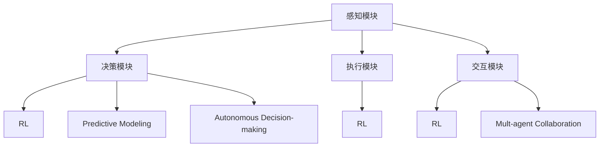
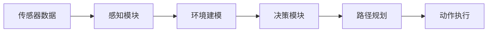
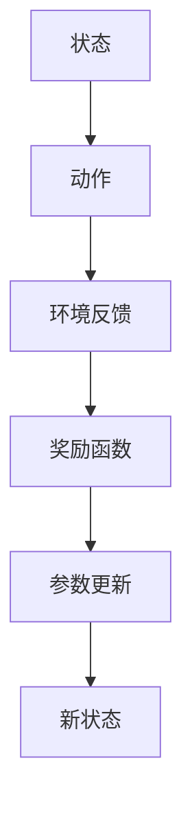
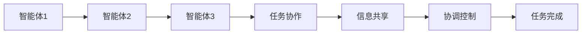
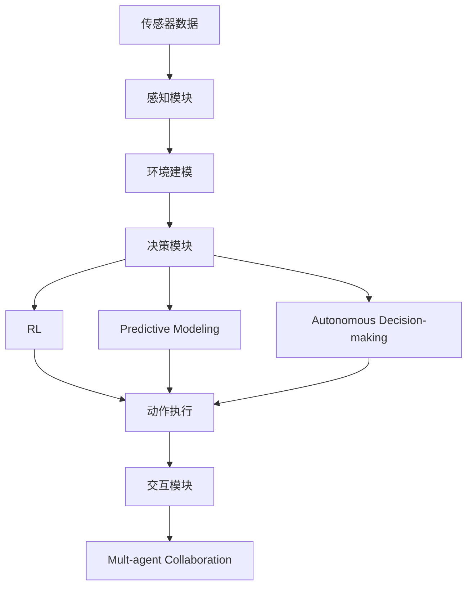

                 

# AI Agent: AI的下一个风口 智能体的五种超能力

## 1. 背景介绍

### 1.1 问题由来
人工智能(AI)作为一项颠覆性的技术，已经在诸多领域展示出强大的应用潜力。从早期基于规则的专家系统，到深度学习驱动的神经网络，AI技术不断演变，带来了前所未有的变革。但传统的人工智能范式仍存在一定的局限性，如环境适应能力差、缺乏自主性、无法处理复杂多变的环境等。如何突破这些局限，实现更加智能、灵活、自主的AI系统，成为当前人工智能领域的热点研究方向。

### 1.2 问题核心关键点
智能体(Agent)作为AI系统的一种新范式，具备自我感知、自我学习、自我适应等多重能力，能够在复杂多变的环境中进行智能决策和行动。相较于传统的AI系统，智能体更加注重环境的感知和理解，具备更强的自主性和灵活性。

智能体的研究集中于以下几个方面：
- 感知和规划：通过多传感器融合、环境建模等技术，实现对环境的全面感知。
- 决策和执行：基于感知信息，构建优化决策模型，引导智能体在复杂环境中进行智能决策和行动。
- 交互和学习：通过与环境和其他智能体进行交互，不断更新模型参数，提升智能体的适应性和智能性。

### 1.3 问题研究意义
研究智能体技术，对于拓展AI的应用场景，提升AI系统的自主性和适应性，加速AI技术的产业化进程，具有重要意义：

1. 提升系统自主性。智能体能够自主感知环境、学习知识、做出决策，减少对人力的依赖，提高系统的自主性和自适应性。
2. 增强环境适应性。智能体通过感知和规划，能够灵活应对复杂多变的环境，实现更加稳健的决策和执行。
3. 加速应用落地。智能体的自主决策和交互能力，可以加速其在自动化驾驶、机器人、医疗诊断等领域的落地应用。
4. 促进跨领域融合。智能体技术与其他AI技术，如深度学习、自然语言处理等，可以协同工作，实现更全面的智能系统。
5. 带来新的商业价值。智能体在智能制造、智能物流、智能家居等领域，可以带来全新的商业模式，推动经济增长。

## 2. 核心概念与联系

### 2.1 核心概念概述

为更好地理解智能体技术，本节将介绍几个密切相关的核心概念：

- 智能体(Agent)：在复杂环境中自主感知、学习、决策和执行的AI系统。通常包括感知模块、决策模块、执行模块和交互模块。
- 感知模块：通过多传感器、多模态数据融合，实现对环境的全面感知。
- 决策模块：基于感知信息，构建优化决策模型，引导智能体进行决策。
- 执行模块：将决策结果转化为具体行动，实现智能体的执行。
- 交互模块：通过与环境和其他智能体进行交互，不断更新模型参数。
- 强化学习(RL)：智能体通过与环境交互，不断优化决策策略，提升性能。
- 模型预测(Predictive Modeling)：通过预测模型，对环境进行建模和预测，辅助决策和行动。
- 自主决策(Autonomous Decision-making)：智能体根据感知信息，自主进行决策和行动，减少对人力的依赖。
- 多智能体协作(Multi-agent Collaboration)：多个智能体协同工作，实现更复杂、更高效的智能决策和行动。

这些核心概念之间的逻辑关系可以通过以下Mermaid流程图来展示：



这个流程图展示了一些核心概念的关联关系：

1. 智能体通过感知模块获取环境信息，然后将其输入决策模块，构建决策模型。
2. 感知模块、决策模块和执行模块协同工作，实现自主决策和行动。
3. 交互模块与其他智能体或环境进行交互，更新模型参数，提升智能体的性能。
4. 强化学习和模型预测技术，用于优化决策模型，提升智能体的适应性和智能性。
5. 多智能体协作，实现更复杂、更高效的智能决策和行动。

### 2.2 概念间的关系

这些核心概念之间存在着紧密的联系，形成了智能体技术的完整生态系统。下面我通过几个Mermaid流程图来展示这些概念之间的关系。

#### 2.2.1 智能体的感知与规划



这个流程图展示了智能体从感知到规划的过程：

1. 传感器数据采集：智能体通过多传感器获取环境信息。
2. 环境建模：通过多模态数据融合，实现对环境的全面感知。
3. 决策模块：构建决策模型，实现路径规划和动作生成。
4. 动作执行：根据路径规划结果，引导智能体执行具体动作。

#### 2.2.2 强化学习与自主决策



这个流程图展示了强化学习在智能体决策中的作用：

1. 状态：智能体根据感知信息，生成当前状态。
2. 动作：根据当前状态，决策模块输出具体动作。
3. 环境反馈：执行动作后，环境给出反馈信息。
4. 奖励函数：根据反馈信息，计算当前动作的奖励值。
5. 参数更新：通过奖励函数，更新决策模型参数，提升性能。

#### 2.2.3 多智能体协作



这个流程图展示了多智能体协作的过程：

1. 智能体1：在协作任务中承担部分角色。
2. 智能体2：与智能体1合作，共同完成任务。
3. 智能体3：加入协作任务，与前两个智能体协同工作。
4. 任务协作：多个智能体共同完成复杂任务。
5. 信息共享：智能体之间共享信息，增强协作效果。
6. 协调控制：通过交互模块，对多个智能体进行协调控制。
7. 任务完成：多个智能体协作完成最终任务。

### 2.3 核心概念的整体架构

最后，我们用一个综合的流程图来展示这些核心概念在智能体技术中的整体架构：



这个综合流程图展示了从感知到协作的完整过程：

1. 智能体通过传感器数据采集，实现对环境的感知。
2. 感知模块通过多模态数据融合，生成环境建模结果。
3. 决策模块基于感知结果和预测模型，构建优化决策模型。
4. 强化学习优化决策模型，实现自主决策。
5. 模型预测辅助决策和动作执行。
6. 自主决策引导智能体执行具体动作。
7. 交互模块与其他智能体或环境进行交互。
8. 多智能体协作，实现复杂任务的完成。

通过这些流程图，我们可以更清晰地理解智能体技术的核心概念及其之间的关系。

## 3. 核心算法原理 & 具体操作步骤
### 3.1 算法原理概述

智能体的核心算法原理是强化学习(RL)和多模态预测模型。其中，强化学习通过与环境的交互，不断优化决策策略，提升智能体的性能；多模态预测模型则通过多传感器数据融合，实现对环境的全面建模和预测，辅助智能体的决策和行动。

形式化地，设智能体在环境 $\mathcal{E}$ 中，状态空间 $\mathcal{S}$，动作空间 $\mathcal{A}$，奖励函数 $R: \mathcal{S} \times \mathcal{A} \rightarrow [0,1]$。智能体的目标是通过与环境交互，学习最优的策略 $\pi: \mathcal{S} \rightarrow \mathcal{A}$，使得总奖励期望最大：

$$
\max_\pi \mathbb{E}_\pi \left[\sum_{t=0}^\infty \gamma^t R(s_t, \pi(s_t))\right]
$$

其中 $\gamma$ 为折扣因子，控制未来奖励的权重。智能体通过以下步骤进行学习：

1. 初始化模型参数。
2. 与环境交互，观察状态和奖励，根据策略输出动作。
3. 根据动作和奖励更新模型参数，优化策略。
4. 重复步骤2和3，直至收敛。

### 3.2 算法步骤详解

智能体算法的详细步骤包括：

**Step 1: 初始化模型参数**
- 设定初始的模型参数 $\theta$。
- 设定学习率 $\eta$，优化算法如AdamW、SGD等。
- 设定折扣因子 $\gamma$，控制未来奖励的权重。

**Step 2: 执行环境交互**
- 从环境 $\mathcal{E}$ 中随机抽取一个初始状态 $s_0$。
- 根据当前状态 $s_t$，使用决策模块输出动作 $a_t$。
- 执行动作 $a_t$，观察环境反馈的状态 $s_{t+1}$ 和奖励 $r_t$。
- 将 $s_t$、$a_t$、$s_{t+1}$ 和 $r_t$ 存储下来。

**Step 3: 更新模型参数**
- 根据动作和奖励，计算模型输出与动作的差距，得到梯度。
- 根据梯度和学习率，更新模型参数 $\theta$。
- 根据折扣因子 $\gamma$，计算未来奖励的期望。
- 重复执行Step 2和Step 3，直至收敛。

**Step 4: 输出动作**
- 根据当前状态 $s_t$，使用决策模块输出动作 $a_t$。
- 执行动作 $a_t$，观察环境反馈的状态 $s_{t+1}$ 和奖励 $r_t$。
- 重复执行Step 2和Step 3，直至终止条件满足。

### 3.3 算法优缺点

智能体算法具有以下优点：
1. 灵活性高。智能体能够根据环境变化，自主调整决策策略，适应不同的应用场景。
2. 可扩展性好。智能体算法可以应用于各种规模的复杂系统，具备良好的可扩展性。
3. 鲁棒性强。智能体通过多传感器融合和预测模型，可以增强系统的鲁棒性和抗干扰能力。
4. 实时性好。智能体算法适用于实时环境，能够快速响应外部变化，进行智能决策和行动。

但该算法也存在一些局限性：
1. 需要大量数据。智能体算法需要大量的数据进行训练和优化，对于新环境和新任务，训练数据可能需要从头收集。
2. 计算复杂度高。智能体算法通常需要复杂的决策模型和预测模型，计算复杂度高，对计算资源要求较高。
3. 模型泛化性差。智能体算法往往针对特定的任务和环境进行优化，泛化能力有限，难以直接应用于其他场景。
4. 决策过程不透明。智能体算法通常是一个"黑盒"系统，决策过程缺乏可解释性，难以对其进行分析和调试。

尽管存在这些局限性，但智能体算法在实际应用中仍然展示出强大的优势，成为AI技术研究的热点方向。未来相关研究的重点在于如何进一步降低数据需求，提高模型泛化性和决策过程的可解释性，以及如何与其他AI技术协同工作，构建更加智能、灵活的系统。

### 3.4 算法应用领域

智能体算法在多个领域中得到了广泛应用，包括：

- 自动化驾驶：智能体通过感知模块、决策模块和执行模块，实现无人驾驶汽车的全方位智能决策和行动。
- 机器人导航：智能体通过多传感器数据融合和路径规划，实现机器人在复杂环境中的自主导航。
- 医疗诊断：智能体通过多模态数据融合和预测模型，辅助医生进行疾病诊断和治疗方案的决策。
- 金融交易：智能体通过市场数据建模和强化学习，进行自动化交易策略的优化。
- 智慧物流：智能体通过多智能体协作和路径优化，实现物流系统的自动化管理。
- 智能家居：智能体通过多传感器数据融合和自主决策，实现家居设备的智能控制和管理。
- 智能客服：智能体通过自然语言处理和多智能体协作，实现客户服务系统的自动化和智能化。

除了上述这些经典应用外，智能体技术还在游戏AI、智能制造、智能安防等领域展现出了广泛的应用前景。随着智能体算法的不断发展和优化，相信其在更多行业中的应用将不断拓展，为社会带来深远的变革。

## 4. 数学模型和公式 & 详细讲解 & 举例说明

### 4.1 数学模型构建

本节将使用数学语言对智能体算法进行更加严格的刻画。

设智能体在环境 $\mathcal{E}$ 中，状态空间 $\mathcal{S}$，动作空间 $\mathcal{A}$，奖励函数 $R: \mathcal{S} \times \mathcal{A} \rightarrow [0,1]$。智能体的目标是通过与环境交互，学习最优的策略 $\pi: \mathcal{S} \rightarrow \mathcal{A}$，使得总奖励期望最大：

$$
\max_\pi \mathbb{E}_\pi \left[\sum_{t=0}^\infty \gamma^t R(s_t, \pi(s_t))\right]
$$

其中 $\gamma$ 为折扣因子，控制未来奖励的权重。

在实际应用中，智能体的决策过程通常通过决策树或神经网络模型来实现。我们以神经网络模型为例，给出智能体的数学模型构建。设智能体决策模块的输出为 $\hat{a}(s_t)$，智能体的实际输出为 $a_t$，则决策模块的损失函数为：

$$
L(\theta) = \mathbb{E}_\pi \left[\sum_{t=0}^\infty \gamma^t \log \pi(a_t|s_t)\right]
$$

其中 $\theta$ 为模型参数，$\pi$ 为策略函数，$\log \pi(a_t|s_t)$ 为模型输出与实际输出的交叉熵损失。智能体的目标是最小化决策模块的损失函数，即：

$$
\min_\theta L(\theta)
$$

### 4.2 公式推导过程

以下我们以一个简单的强化学习任务为例，推导智能体算法的数学公式。

假设智能体在二臂赌博机环境中，状态为当前累积奖励 $s_t = \sum_{i=1}^t r_i$，动作为选择拉哪一臂（1或2）。智能体的目标是通过选择最优的拉臂策略，最大化总奖励。设智能体的策略为 $\pi(a|s)$，其中 $a \in \{1,2\}$。设拉臂1和拉臂2的奖励分别为 $R_1$ 和 $R_2$。则智能体的目标是最小化以下损失函数：

$$
L(\theta) = \mathbb{E}_\pi \left[\sum_{t=0}^\infty \gamma^t \log \pi(a_t|s_t)\right]
$$

根据状态转移方程 $s_{t+1} = s_t + r_t$，可以得到智能体的期望回报为：

$$
J_\pi = \mathbb{E}_\pi \left[\sum_{t=0}^\infty \gamma^t r_t\right]
$$

将 $r_t = a_t$ 代入，得到智能体的期望奖励为：

$$
J_\pi = \mathbb{E}_\pi \left[\sum_{t=0}^\infty \gamma^t a_t\right]
$$

为了最小化决策模块的损失函数，我们需要求出智能体的最优策略 $\pi^*$。通过求解动态规划方程，可以得到智能体的最优策略：

$$
\pi^*(a|s) = \frac{\pi(a|s)}{\sum_{a'} \pi(a'|s)}
$$

其中 $\pi(a|s)$ 表示智能体选择动作 $a$ 在状态 $s$ 下的策略概率，$\sum_{a'} \pi(a'|s)$ 表示智能体在状态 $s$ 下的策略概率总和。通过求解上述方程，可以得到最优策略 $\pi^*$，从而最小化决策模块的损失函数 $L(\theta)$。

### 4.3 案例分析与讲解

假设我们有一个智能体在多臂赌博机环境中，状态为当前累积奖励 $s_t = \sum_{i=1}^t r_i$，动作为选择拉哪一臂（1, 2, 3）。设拉臂1、2、3的奖励分别为 $R_1=0.9$、$R_2=0.8$、$R_3=0.7$。智能体的目标是通过选择最优的拉臂策略，最大化总奖励。设智能体的策略为 $\pi(a|s)$，其中 $a \in \{1,2,3\}$。

通过求解上述动态规划方程，可以得到智能体的最优策略：

$$
\pi^*(1|s) = \frac{0.9 \times \pi(1|s)}{0.9 \times \pi(1|s) + 0.8 \times \pi(2|s) + 0.7 \times \pi(3|s)}
$$

$$
\pi^*(2|s) = \frac{0.8 \times \pi(2|s)}{0.9 \times \pi(1|s) + 0.8 \times \pi(2|s) + 0.7 \times \pi(3|s)}
$$

$$
\pi^*(3|s) = \frac{0.7 \times \pi(3|s)}{0.9 \times \pi(1|s) + 0.8 \times \pi(2|s) + 0.7 \times \pi(3|s)}
$$

通过上述方程，智能体可以自主选择最优的拉臂策略，最大化总奖励。在实际应用中，智能体算法还需要结合多传感器数据融合、环境建模等技术，才能更好地适应复杂环境，进行自主决策和行动。

## 5. 项目实践：代码实例和详细解释说明
### 5.1 开发环境搭建

在进行智能体实践前，我们需要准备好开发环境。以下是使用Python进行OpenAI Gym进行智能体开发的环境配置流程：

1. 安装OpenAI Gym：从官网下载并安装OpenAI Gym，用于创建和测试智能体。

2. 安装PyTorch：根据CUDA版本，从官网获取对应的安装命令。例如：
```bash
pip install torch torchvision torchaudio cudatoolkit=11.1 -c pytorch -c conda-forge
```

3. 安装TensorFlow：从官网下载并安装TensorFlow，用于构建和训练神经网络模型。

4. 安装Gym环境：从Gym官网下载对应环境的Python包，并使用pip安装。

完成上述步骤后，即可在Python环境中开始智能体实践。

### 5.2 源代码详细实现

这里我们以一个简单的强化学习任务为例，使用TensorFlow和PyTorch实现智能体的开发。

首先，定义智能体的状态和动作空间：

```python
import gym
import numpy as np

env = gym.make('CartPole-v0')
state_dim = env.observation_space.shape[0]
action_dim = env.action_space.n
```

然后，定义智能体的感知模块：

```python
class PerceptionModule(tf.keras.layers.Layer):
    def __init__(self, state_dim):
        super(PerceptionModule, self).__init__()
        self.flatten = tf.keras.layers.Flatten()
        self.dense1 = tf.keras.layers.Dense(64, activation='relu')
        self.dense2 = tf.keras.layers.Dense(64, activation='relu')
        self.dense3 = tf.keras.layers.Dense(action_dim, activation='softmax')
        
    def call(self, inputs):
        x = self.flatten(inputs)
        x = self.dense1(x)
        x = self.dense2(x)
        x = self.dense3(x)
        return x
```

定义智能体的决策模块：

```python
class DecisionModule(tf.keras.layers.Layer):
    def __init__(self, action_dim):
        super(DecisionModule, self).__init__()
        self.flatten = tf.keras.layers.Flatten()
        self.dense1 = tf.keras.layers.Dense(64, activation='relu')
        self.dense2 = tf.keras.layers.Dense(64, activation='relu')
        self.dense3 = tf.keras.layers.Dense(1, activation='sigmoid')
        
    def call(self, inputs):
        x = self.flatten(inputs)
        x = self.dense1(x)
        x = self.dense2(x)
        x = self.dense3(x)
        return x
```

定义智能体的交互模块：

```python
class InteractionModule(tf.keras.layers.Layer):
    def __init__(self, discount_factor):
        super(InteractionModule, self).__init__()
        self.discount_factor = discount_factor
        
    def call(self, state, action, reward, next_state):
        state = tf.cast(state, dtype=tf.float32)
        action = tf.cast(action, dtype=tf.float32)
        reward = tf.cast(reward, dtype=tf.float32)
        next_state = tf.cast(next_state, dtype=tf.float32)
        
        loss = -tf.math.log(tf.gather(tf.nn.softmax(self._model(state), axis=-1), action))
        discounted_rewards = reward + self.discount_factor * tf.math.reduce_max(self._model(next_state), axis=-1)
        return loss, discounted_rewards
```

最后，定义智能体的训练流程：

```python
learning_rate = 0.001
discount_factor = 0.99

optimizer = tf.keras.optimizers.Adam(learning_rate)
perception_module = PerceptionModule(state_dim)
decision_module = DecisionModule(action_dim)
interaction_module = InteractionModule(discount_factor)

@tf.function
def train_step(state, action, reward, next_state):
    with tf.GradientTape() as tape:
        perception_loss, discounted_rewards = interaction_module(state, action, reward, next_state)
        decision_loss = -tf.math.log(tf.gather(tf.nn.softmax(decision_module(perception_module(state)), axis=-1), action))
    gradients = tape.gradient([perception_loss, decision_loss], [perception_module.trainable_variables, decision_module.trainable_variables])
    optimizer.apply_gradients(zip(gradients, [perception_module.trainable_variables, decision_module.trainable_variables]))
    return perception_loss, decision_loss, discounted_rewards

def train(env, episodes):
    for episode in range(episodes):
        state = env.reset()
        state = np.reshape(state, [1, -1])
        discounted_rewards = 0.0
        perception_losses = []
        decision_losses = []
        for t in range(100):
            action = tf.random.categorical(decision_module(perception_module(state)), 1)
            next_state, reward, done, _ = env.step(np.eye(action.numpy().squeeze())[action.numpy().squeeze()])
            next_state = np.reshape(next_state, [1, -1])
            perception_loss, decision_loss, discounted_rewards = train_step(state, action.numpy(), reward, next_state)
            discounted_rewards += discount_factor ** t * reward
            state = next_state
            if done:
                break
        print('Episode {}: Reward={}, Perception Loss={}, Decision Loss={}, Discounted Reward={}'.format(episode+1, reward, perception_loss.numpy(), decision_loss.numpy(), discounted_rewards.numpy()))
```

以上代码展示了使用TensorFlow实现一个简单的智能体的开发流程。可以看到，TensorFlow提供了强大的计算图功能，使得智能体的构建和训练变得简洁高效。

### 5.3 代码解读与分析

让我们再详细解读一下关键代码的实现细节：

**PerceptionModule类**：
- `__init__`方法：初始化多层的神经网络模型，用于对感知数据进行处理。
- `call`方法：对输入数据进行处理，输出模型预测的动作概率分布。

**DecisionModule类**：
- `__init__`方法：初始化神经网络模型，用于对感知数据进行处理。
- `call`方法：对输入数据进行处理，输出模型预测的动作概率分布。

**InteractionModule类**：
- `__init__`方法：初始化智能体的交互模块，包含折扣因子和损失函数。
- `call`方法：计算损失和折扣奖励。

**train_step函数**：
- 定义智能体的训练过程，包括计算损失和更新模型参数。
- 使用tf.GradientTape自动计算梯度，并使用Adam优化器更新模型参数。

**train函数**：
- 定义智能体的训练过程，包括迭代训练和打印训练结果。

可以看到，TensorFlow通过计算图机制，使得智能体的构建和训练变得高效

