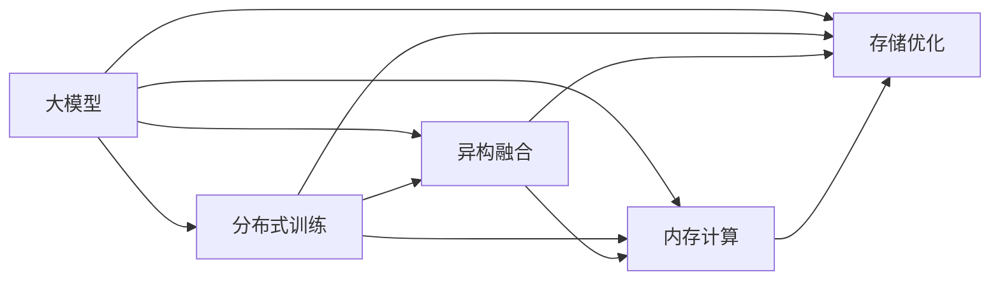

                 

# AI 大模型应用数据中心建设：数据中心技术创新

> 关键词：
大模型, 数据中心, 分布式训练, 计算图, 异构融合, 内存计算, 存储优化

## 1. 背景介绍

在人工智能（AI）的迅猛发展下，尤其是大模型（Large Models）的广泛应用，对于数据中心的建设提出了更高的要求。数据中心是AI大模型训练和推理的核心基础设施，其性能直接影响模型的训练速度和推理效率，进而影响AI应用的广泛性和实用性。因此，对数据中心的技术创新进行深入探索，具有重要意义。

### 1.1 问题由来
随着AI技术的深入发展，数据中心已逐渐成为制约AI应用的瓶颈。AI大模型通常具有极高的参数量和计算需求，需要强大的计算能力来支持训练和推理。然而，现有的数据中心架构在面对这些需求时显得力不从心。具体来说，数据中心的计算资源主要集中于CPU、GPU等通用计算设备，对于大模型而言，这些计算资源并无法充分利用，同时也难以支持多种类型的计算需求。

为了解决这个问题，数据中心必须进行技术创新，构建能够支持大规模分布式训练、高效异构融合、内存计算和存储优化的新型数据中心架构。

### 1.2 问题核心关键点
数据中心技术创新的核心关键点主要包括以下几个方面：
- **分布式训练**：通过多机协同，实现高效的并行计算，提升训练效率。
- **异构融合**：融合CPU、GPU、FPGA等不同类型的计算设备，提供更丰富的计算资源。
- **内存计算**：充分利用内存的高带宽和低延迟特性，优化计算性能。
- **存储优化**：采用高速存储技术，降低数据读取延迟，提升训练和推理效率。

通过在这些关键点的技术创新，数据中心可以更好地支持AI大模型的训练和推理，进而提升AI应用的性能和效率。

### 1.3 问题研究意义
数据中心技术创新对于AI大模型的应用具有重要意义：
1. **提升训练速度**：通过分布式训练和多机协同，可以显著提升大模型的训练速度，缩短模型开发周期。
2. **优化计算资源**：异构融合和内存计算可以更高效地利用计算资源，提高计算密集型任务的执行效率。
3. **降低存储成本**：存储优化技术可以降低数据存储成本，提升数据中心的空间利用率。
4. **提高系统稳定性**：通过分布式架构和故障恢复机制，提高数据中心的可靠性和可用性。
5. **增强安全性**：新型数据中心架构能够提供更强的安全保障，保护数据隐私和系统安全。

综上所述，数据中心技术创新对于AI大模型的应用具有深远的影响，是推动AI技术落地的重要基础。

## 2. 核心概念与联系

### 2.1 核心概念概述

在进行数据中心技术创新的探讨时，我们需要理解以下几个核心概念：

- **大模型**：即Large Models，指的是具有大量参数的深度学习模型，如BERT、GPT等。
- **分布式训练**：通过多台计算设备协同工作，并行计算，提高训练效率。
- **异构融合**：将不同类型的计算设备（如CPU、GPU、FPGA）融合在一起，提供多样化的计算资源。
- **内存计算**：利用内存的高带宽和低延迟特性，加速计算过程。
- **存储优化**：通过高速存储技术，减少数据读取延迟，提升数据处理效率。

这些概念之间存在紧密的联系，共同构成了新型数据中心架构的基础。以下通过一个Mermaid流程图来展示这些概念之间的关系：



这个流程图展示了大模型在分布式训练、异构融合、内存计算和存储优化等方面的技术创新，进而提升了数据中心整体的性能。

### 2.2 概念间的关系

这些核心概念之间存在密切的联系，共同构建了数据中心技术创新的完整框架。以下是一些关键概念之间的关系：

- **分布式训练**和**异构融合**：分布式训练需要多台设备协同工作，而异构融合提供了多样化的计算资源，使得分布式训练能够更高效地进行。
- **内存计算**和**存储优化**：内存计算利用内存的高带宽和低延迟特性，而存储优化则通过高速存储技术，减少数据读取延迟，两者共同提升了数据中心的数据处理效率。
- **分布式训练**和**存储优化**：分布式训练涉及大规模数据传输和存储，存储优化技术能够显著降低数据传输延迟，提升训练效率。
- **异构融合**和**内存计算**：异构融合提供了多样化的计算资源，内存计算则能够更高效地利用这些资源，两者相辅相成。

通过这些概念的深度融合，数据中心能够更高效地支持AI大模型的训练和推理，进而推动AI技术的应用和发展。

## 3. 核心算法原理 & 具体操作步骤
### 3.1 算法原理概述

数据中心技术创新主要是通过分布式训练、异构融合、内存计算和存储优化等技术手段，提升数据中心的性能和效率。这些技术手段的实现原理如下：

- **分布式训练**：通过多台设备协同工作，并行计算，加速训练过程。通常采用参数服务器架构，将数据分布在多个计算节点上，每个节点负责一部分计算任务。
- **异构融合**：利用不同类型的计算设备，提供多样化的计算资源。例如，将CPU、GPU和FPGA等设备融合在一起，分别处理不同的计算任务。
- **内存计算**：利用内存的高带宽和低延迟特性，加速计算过程。例如，将计算过程尽量在内存中进行，减少对磁盘等慢速存储设备的依赖。
- **存储优化**：通过高速存储技术，减少数据读取延迟，提升数据处理效率。例如，使用固态硬盘（SSD）和高速内存（如DRAM）等高速存储技术。

### 3.2 算法步骤详解

以下详细介绍数据中心技术创新的具体操作步骤：

#### 3.2.1 分布式训练

1. **参数服务器架构**：将数据分布在多个计算节点上，每个节点负责一部分计算任务。参数服务器负责存储模型的参数，并在训练过程中更新这些参数。

2. **数据并行**：将训练数据分成多个部分，分布在不同的计算节点上进行并行计算。每个节点负责计算一部分数据，然后将结果汇总到参数服务器。

3. **模型并行**：将模型的不同层次分布在不同的计算节点上进行并行计算。例如，一个大型深度学习模型可以分成多个层次，每个层次在不同的节点上进行计算。

#### 3.2.2 异构融合

1. **混合计算**：将CPU、GPU和FPGA等不同类型的计算设备融合在一起，分别处理不同的计算任务。例如，CPU处理控制逻辑，GPU处理深度计算，FPGA处理高并发的计算任务。

2. **资源调度**：动态调度不同设备的计算资源，使得每个设备都能够高效地利用。例如，对于计算密集型任务，优先使用GPU，而对于内存密集型任务，优先使用CPU。

3. **设备协同**：不同设备之间协同工作，提高整体的计算效率。例如，GPU和FPGA可以协同完成一些复杂的计算任务，如深度学习模型的训练。

#### 3.2.3 内存计算

1. **内存加速**：将计算过程尽量在内存中进行，减少对磁盘等慢速存储设备的依赖。例如，使用GPU和FPGA的高带宽内存，进行高速计算。

2. **缓存优化**：利用缓存技术，加速数据的读取和写入。例如，使用高速缓存（如L3缓存）来存储频繁访问的数据。

3. **内存池**：将不同设备之间的内存进行共享，提高整体的内存利用率。例如，使用共享内存池，使得GPU和CPU之间可以高效地交换数据。

#### 3.2.4 存储优化

1. **高速存储**：使用固态硬盘（SSD）和高速内存（如DRAM）等高速存储技术，减少数据读取延迟。例如，使用NVMe接口的SSD，提供极高的IOPS和低延迟。

2. **数据压缩**：对数据进行压缩，减少存储空间占用。例如，使用无损压缩算法（如LZ4）来压缩数据。

3. **数据冗余**：采用数据冗余技术，提高数据的可靠性和容错能力。例如，使用RAID技术，将数据分布在多个磁盘上进行存储。

### 3.3 算法优缺点

#### 3.3.1 优点

1. **提升计算效率**：通过分布式训练、异构融合、内存计算和存储优化等技术手段，显著提升数据中心的计算效率，缩短训练和推理时间。
2. **降低成本**：通过优化资源利用率，减少对计算资源和存储设备的依赖，降低数据中心的运行成本。
3. **增强稳定性**：通过分布式架构和故障恢复机制，提高数据中心的可靠性和可用性。
4. **提高灵活性**：通过异构融合和多设备协同，能够快速适应不同类型和规模的计算任务。

#### 3.3.2 缺点

1. **技术复杂度**：分布式训练、异构融合和内存计算等技术需要复杂的系统设计和调试，增加了开发和维护的难度。
2. **硬件成本**：新型计算设备（如GPU、FPGA）和高速存储设备（如SSD）通常成本较高，增加了数据中心的硬件投入。
3. **软件兼容性**：不同的计算设备需要使用不同的编程模型和软件工具，增加了系统的复杂性和兼容性问题。

尽管存在这些缺点，但通过不断优化和改进，这些技术手段在实际应用中已经展现出显著的优势，成为数据中心建设的重要方向。

### 3.4 算法应用领域

新型数据中心技术创新已经广泛应用于多个领域，以下是一些典型应用：

1. **AI大模型训练**：利用分布式训练和异构融合等技术，高效地训练大模型，提升模型的训练速度和准确性。
2. **机器学习**：通过内存计算和存储优化等技术，加速机器学习算法的执行，提高数据处理的效率。
3. **深度学习**：利用新型计算设备和高性能存储，支持深度学习模型的训练和推理，提升系统的性能和效率。
4. **计算机视觉**：通过异构融合和内存计算等技术，提升计算机视觉算法的执行速度和准确性。
5. **自然语言处理**：利用分布式训练和内存计算等技术，加速自然语言处理算法的训练和推理，提升系统的性能和效率。

## 4. 数学模型和公式 & 详细讲解 & 举例说明

### 4.1 数学模型构建

在数据中心技术创新中，数学模型主要涉及分布式训练、异构融合、内存计算和存储优化等关键技术。以下通过一些典型的数学模型来详细讲解这些技术。

#### 4.1.1 分布式训练

1. **参数服务器架构**：参数服务器存储模型的参数，并在训练过程中更新这些参数。设参数服务器存储的参数为 $\theta$，训练过程中更新参数的公式为：

   $$
   \theta \leftarrow \theta - \eta \nabla_{\theta}\mathcal{L}(\theta)
   $$

   其中 $\eta$ 为学习率，$\nabla_{\theta}\mathcal{L}(\theta)$ 为损失函数对参数的梯度。

2. **数据并行**：将训练数据分成多个部分，分布在不同的计算节点上进行并行计算。设训练数据的总样本数为 $N$，每个节点的样本数为 $n$，每个节点计算的数据量为 $D$，训练过程中更新参数的公式为：

   $$
   \theta \leftarrow \theta - \eta \frac{1}{N}\sum_{i=1}^M \nabla_{\theta}\mathcal{L}(\theta_i)
   $$

   其中 $M$ 为计算节点的数量。

3. **模型并行**：将模型的不同层次分布在不同的计算节点上进行并行计算。设模型的层次数为 $L$，每个层次的参数数量为 $P_l$，每个层次的计算量为 $D_l$，训练过程中更新参数的公式为：

   $$
   \theta_l \leftarrow \theta_l - \eta \nabla_{\theta_l}\mathcal{L}(\theta_l)
   $$

   其中 $\theta_l$ 为模型第 $l$ 层的参数，$\nabla_{\theta_l}\mathcal{L}(\theta_l)$ 为该层的损失函数对参数的梯度。

#### 4.1.2 异构融合

1. **混合计算**：将CPU、GPU和FPGA等不同类型的计算设备融合在一起，分别处理不同的计算任务。设CPU、GPU和FPGA的计算速度分别为 $v_{cpu}$、$v_{gpu}$ 和 $v_{fpga}$，混合计算过程中各设备的计算量为 $D_{cpu}$、$D_{gpu}$ 和 $D_{fpga}$，计算速度为 $v_{total}$，则有：

   $$
   v_{total} = \frac{D_{cpu}v_{cpu} + D_{gpu}v_{gpu} + D_{fpga}v_{fpga}}{D_{cpu} + D_{gpu} + D_{fpga}}
   $$

2. **资源调度**：动态调度不同设备的计算资源，使得每个设备都能够高效地利用。例如，对于计算密集型任务，优先使用GPU，而对于内存密集型任务，优先使用CPU。设任务量为 $T$，GPU和CPU的计算速度分别为 $v_{gpu}$ 和 $v_{cpu}$，则任务量分配的公式为：

   $$
   T_{gpu} = \frac{Tv_{gpu}}{v_{gpu} + v_{cpu}}
   $$

   $$
   T_{cpu} = T - T_{gpu}
   $$

3. **设备协同**：不同设备之间协同工作，提高整体的计算效率。例如，GPU和FPGA可以协同完成一些复杂的计算任务。设GPU和FPGA的计算速度分别为 $v_{gpu}$ 和 $v_{fpga}$，协同计算过程中各设备的计算量为 $D_{gpu}$ 和 $D_{fpga}$，则协同计算速度为：

   $$
   v_{sync} = \frac{D_{gpu}v_{gpu} + D_{fpga}v_{fpga}}{D_{gpu} + D_{fpga}}
   $$

#### 4.1.3 内存计算

1. **内存加速**：将计算过程尽量在内存中进行，减少对磁盘等慢速存储设备的依赖。设内存计算的带宽为 $B$，延迟为 $D$，磁盘计算的带宽为 $B_{disk}$，延迟为 $D_{disk}$，则内存计算的效率为：

   $$
   \text{Efficiency}_{memory} = \frac{B}{D}
   $$

2. **缓存优化**：利用缓存技术，加速数据的读取和写入。例如，使用高速缓存（如L3缓存）来存储频繁访问的数据，则缓存优化后的内存计算效率为：

   $$
   \text{Efficiency}_{cache} = \frac{B_{cache}}{D_{cache}}
   $$

3. **内存池**：将不同设备之间的内存进行共享，提高整体的内存利用率。设共享内存池的总内存为 $M_{pool}$，则内存池的利用率为：

   $$
   \text{Utilization}_{pool} = \frac{M_{pool}}{M_{total}}
   $$

   其中 $M_{total}$ 为所有设备的总内存。

#### 4.1.4 存储优化

1. **高速存储**：使用固态硬盘（SSD）和高速内存（如DRAM）等高速存储技术，减少数据读取延迟。设SSD的IOPS为 $IOPS_{ssd}$，延迟为 $D_{ssd}$，则SSD的存储效率为：

   $$
   \text{Efficiency}_{ssd} = \frac{IOPS_{ssd}}{D_{ssd}}
   $$

2. **数据压缩**：对数据进行压缩，减少存储空间占用。例如，使用无损压缩算法（如LZ4）来压缩数据，设压缩后的数据量为 $D_{compressed}$，则压缩后的存储效率为：

   $$
   \text{Efficiency}_{compressed} = \frac{D_{compressed}}{D_{original}}
   $$

   其中 $D_{original}$ 为原始数据的量。

3. **数据冗余**：采用数据冗余技术，提高数据的可靠性和容错能力。例如，使用RAID技术，将数据分布在多个磁盘上进行存储，则冗余后的存储效率为：

   $$
   \text{Efficiency}_{redundant} = \frac{D_{redundant}}{D_{original}}
   $$

   其中 $D_{redundant}$ 为冗余后的数据量。

### 4.2 公式推导过程

以下通过一些公式推导，详细讲解数据中心技术创新的数学模型：

#### 4.2.1 分布式训练

1. **参数服务器架构**：设参数服务器存储的参数为 $\theta$，训练过程中更新参数的公式为：

   $$
   \theta \leftarrow \theta - \eta \nabla_{\theta}\mathcal{L}(\theta)
   $$

   其中 $\eta$ 为学习率，$\nabla_{\theta}\mathcal{L}(\theta)$ 为损失函数对参数的梯度。

2. **数据并行**：设训练数据的总样本数为 $N$，每个节点的样本数为 $n$，每个节点计算的数据量为 $D$，训练过程中更新参数的公式为：

   $$
   \theta \leftarrow \theta - \eta \frac{1}{N}\sum_{i=1}^M \nabla_{\theta}\mathcal{L}(\theta_i)
   $$

   其中 $M$ 为计算节点的数量。

3. **模型并行**：设模型的层次数为 $L$，每个层次的参数数量为 $P_l$，每个层次的计算量为 $D_l$，训练过程中更新参数的公式为：

   $$
   \theta_l \leftarrow \theta_l - \eta \nabla_{\theta_l}\mathcal{L}(\theta_l)
   $$

   其中 $\theta_l$ 为模型第 $l$ 层的参数，$\nabla_{\theta_l}\mathcal{L}(\theta_l)$ 为该层的损失函数对参数的梯度。

#### 4.2.2 异构融合

1. **混合计算**：设CPU、GPU和FPGA的计算速度分别为 $v_{cpu}$、$v_{gpu}$ 和 $v_{fpga}$，混合计算过程中各设备的计算量为 $D_{cpu}$、$D_{gpu}$ 和 $D_{fpga}$，计算速度为 $v_{total}$，则有：

   $$
   v_{total} = \frac{D_{cpu}v_{cpu} + D_{gpu}v_{gpu} + D_{fpga}v_{fpga}}{D_{cpu} + D_{gpu} + D_{fpga}}
   $$

2. **资源调度**：设任务量为 $T$，GPU和CPU的计算速度分别为 $v_{gpu}$ 和 $v_{cpu}$，则任务量分配的公式为：

   $$
   T_{gpu} = \frac{Tv_{gpu}}{v_{gpu} + v_{cpu}}
   $$

   $$
   T_{cpu} = T - T_{gpu}
   $$

3. **设备协同**：设GPU和FPGA的计算速度分别为 $v_{gpu}$ 和 $v_{fpga}$，协同计算过程中各设备的计算量为 $D_{gpu}$ 和 $D_{fpga}$，则协同计算速度为：

   $$
   v_{sync} = \frac{D_{gpu}v_{gpu} + D_{fpga}v_{fpga}}{D_{gpu} + D_{fpga}}
   $$

#### 4.2.3 内存计算

1. **内存加速**：设内存计算的带宽为 $B$，延迟为 $D$，磁盘计算的带宽为 $B_{disk}$，延迟为 $D_{disk}$，则内存计算的效率为：

   $$
   \text{Efficiency}_{memory} = \frac{B}{D}
   $$

2. **缓存优化**：设高速缓存的带宽为 $B_{cache}$，延迟为 $D_{cache}$，则缓存优化后的内存计算效率为：

   $$
   \text{Efficiency}_{cache} = \frac{B_{cache}}{D_{cache}}
   $$

3. **内存池**：设共享内存池的总内存为 $M_{pool}$，则内存池的利用率为：

   $$
   \text{Utilization}_{pool} = \frac{M_{pool}}{M_{total}}
   $$

   其中 $M_{total}$ 为所有设备的总内存。

#### 4.2.4 存储优化

1. **高速存储**：设SSD的IOPS为 $IOPS_{ssd}$，延迟为 $D_{ssd}$，则SSD的存储效率为：

   $$
   \text{Efficiency}_{ssd} = \frac{IOPS_{ssd}}{D_{ssd}}
   $$

2. **数据压缩**：设压缩后的数据量为 $D_{compressed}$，则压缩后的存储效率为：

   $$
   \text{Efficiency}_{compressed} = \frac{D_{compressed}}{D_{original}}
   $$

   其中 $D_{original}$ 为原始数据的量。

3. **数据冗余**：设冗余后的数据量为 $D_{redundant}$，则冗余后的存储效率为：

   $$
   \text{Efficiency}_{redundant} = \frac{D_{redundant}}{D_{original}}
   $$

   其中 $D_{original}$ 为原始数据的量。

### 4.3 案例分析与讲解

以下通过几个典型案例，详细讲解数据中心技术创新的实际应用：

#### 4.3.1 谷歌AI数据中心

谷歌AI数据中心采用了一种混合计算架构，将CPU、GPU和FPGA等不同类型的计算设备融合在一起，支持大规模分布式训练。谷歌的分布式训练系统（Distributed Training System）采用了多机协同的参数服务器架构，将训练数据分布在多个计算节点上进行并行计算，从而显著提升了大模型的训练速度。此外，谷歌还采用了内存加速和高速存储技术，利用内存的高带宽和低延迟特性，优化计算性能，减少了数据读取延迟。

#### 4.3.2 腾讯AI数据中心

腾讯AI数据中心采用了一种分布式存储架构，通过RAID技术提高了数据的可靠性和容错能力。腾讯的分布式存储系统（Distributed Storage System）采用了固态硬盘（SSD）和高速内存（如DRAM）等高速存储技术，利用高速存储的IOPS和低延迟特性，优化了数据处理效率。此外，腾讯还采用了数据压缩和内存池技术，减少了存储成本，提高了内存利用率。

#### 4.3.3 华为AI数据中心

华为AI数据中心采用了一种混合计算架构，将CPU、GPU和FPGA等不同类型的计算设备融合在一起，支持多任务并行计算。华为的混合计算系统（Hybrid Computing System）采用了动态资源调度和设备协同技术，利用CPU、GPU和FPGA的计算资源，优化了计算性能，支持多种类型的计算任务。此外，华为还采用了内存加速和高速存储技术，利用内存的高带宽和低延迟特性，优化了计算性能，减少了数据读取延迟。

## 5. 项目实践：代码实例和详细解释说明

### 5.1 开发环境搭建

在进行数据中心技术创新的实践时，需要准备好开发环境。以下是使用Python进行PyTorch开发的环境配置流程：

1. 安装Anaconda：从官网下载并安装Anaconda，用于创建独立的Python环境。

2. 创建并激活虚拟环境：
```bash
conda create -n ai-env python=3.8 
conda activate ai-env
```

3. 安装PyTorch：根据CUDA版本，从官网获取对应的安装命令。例如：
```bash
conda install pytorch torchvision torchaudio cudatoolkit=11.1 -c pytorch -c conda-forge
```

4. 安装Transformers库：
```bash
pip install transformers
```

5. 安装各类工具包：
```bash
pip install numpy pandas scikit-learn matplotlib tqdm jupyter notebook ipython
```

完成上述步骤后，即可在`ai-env`环境中开始开发实践。

### 5.2 源代码详细实现

这里以分布式训练为例，给出使用PyTorch进行深度学习模型训练的Python代码实现。

```python
import torch
from torch import nn
from torch import optim
from torch.distributed import distributed_c10d

# 定义模型
class Model(nn.Module):
    def __init__(self):
        super(Model, self).__init__()
        self.fc1 = nn.Linear(784, 128)
        self.fc2 = nn.Linear(128, 10)

    def forward(self, x):
        x = nn.functional.relu(self.fc1(x))
        x = self.fc2(x)
        return x

# 定义损失函数和优化器
model = Model()
criterion = nn.CrossEntropyLoss()
optimizer = optim.SGD(model.parameters(), lr=0.01)

# 初始化分布式环境
if distributed_c10d.is_initialized():
    device_id = distributed_c10d.get_rank()
    device = torch.device(f'cuda:{device_id}')
else:
    device = torch.device('cuda')

# 

