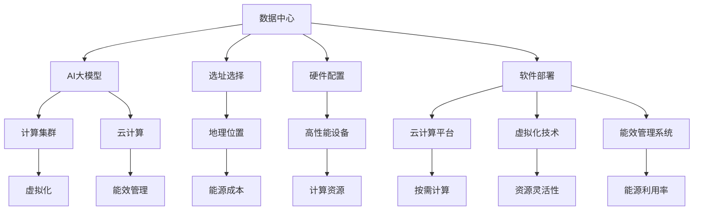

                 

# AI 大模型应用数据中心建设：数据中心投资与建设

> 关键词：AI大模型,数据中心,投资,建设,云计算

## 1. 背景介绍

### 1.1 问题由来

随着人工智能(AI)技术的迅猛发展，尤其是大模型在图像识别、自然语言处理、语音识别等领域取得突破，企业对高性能数据中心的需求日益增长。AI大模型需要强大的计算能力和大规模的数据存储，数据中心成为其不可缺少的基础设施。然而，由于投资回报率(Return on Investment, ROI)难以快速见效，企业在数据中心建设上的热情往往不高。

大模型应用对数据中心提出了更高的要求，这主要体现在以下几个方面：
- **计算能力**：大模型训练和推理需要大量的计算资源，通常需要配备GPU、TPU等高性能计算硬件。
- **存储需求**：大模型涉及大规模数据的存储和读取，需要大容量、高带宽的存储系统。
- **网络带宽**：大模型需要高速网络进行数据传输，这对数据中心的通信网络提出了严苛的要求。
- **冷却系统**：大模型训练过程中会产生大量热量，需要高效能的冷却系统确保设备稳定运行。
- **能效优化**：大规模数据中心运行成本高，需要高效能的能源管理系统，降低能耗。

针对以上问题，本文将系统阐述如何建设适合AI大模型的数据中心，通过合理的投资和建设规划，提高数据中心的能效和运行效率，为企业带来更高的回报。

### 1.2 问题核心关键点

AI大模型数据中心建设的核心关键点包括以下几点：
- **选址选择**：数据中心地理位置的选择直接关系到能源成本和数据传输速度。
- **硬件配置**：高性能计算设备的选择，如GPU、TPU等，以及其布局设计。
- **软件部署**：云计算平台及虚拟化技术的部署，实现资源的灵活管理。
- **能效管理**：数据中心的能源管理系统，实现高效的能源利用和回收。
- **网络架构**：高带宽、低延迟的网络架构，支持大模型数据的快速传输。

理解这些关键点对于企业投资和建设数据中心至关重要。本文将围绕这些关键点展开详细讨论，为数据中心建设提供参考。

## 2. 核心概念与联系

### 2.1 核心概念概述

为了更好地理解AI大模型数据中心建设，首先介绍几个核心概念：

- **数据中心(Data Center, DC)**：指集中管理、存储、计算和网络资源的设施，能够提供高效、稳定的IT服务。
- **AI大模型(AI Large Model)**：指通过大规模数据训练得到的深度学习模型，如GPT-3、BERT等，具有强大的计算能力和泛化能力。
- **计算集群(Cluster)**：指一组物理或虚拟的计算节点，通过网络互联，共同提供计算服务。
- **云计算(Cloud Computing)**：指通过网络提供按需计算服务，支持大模型数据的存储和计算。
- **虚拟化(Virtualization)**：指将物理资源抽象成虚拟资源，支持大模型的弹性计算和扩展。
- **能效管理(Energy Management)**：指通过技术手段优化数据中心的能源使用，降低能耗和运行成本。

这些概念之间有着密切的联系，共同构成了AI大模型数据中心的建设框架。

### 2.2 概念间的关系

这些核心概念之间的关系可以通过以下Mermaid流程图来展示：



这个流程图展示了数据中心、AI大模型、计算集群、云计算、虚拟化、能效管理等概念之间的关系：

1. **数据中心**：提供AI大模型的计算和存储基础。
2. **AI大模型**：需要计算集群和云计算来支持其训练和推理。
3. **计算集群**：通过虚拟化技术提供高效能的计算资源。
4. **云计算**：按需提供弹性计算资源，支持大模型的高效计算。
5. **虚拟化**：提高计算资源的利用率和灵活性，支持AI大模型的弹性扩展。
6. **能效管理**：优化能源利用，降低数据中心的运行成本。

这些概念相互作用，共同支持AI大模型的高效运行和数据中心的高效管理。

## 3. 核心算法原理 & 具体操作步骤

### 3.1 算法原理概述

AI大模型数据中心建设的核心算法原理主要涉及以下方面：

- **选址选择**：通过计算地理位置对能源成本的影响，选择最优的建设位置。
- **硬件配置**：选择适合AI大模型的高性能计算设备，并通过合理的布局设计提高设备利用率。
- **软件部署**：通过虚拟化技术和云计算平台，实现计算资源的灵活管理和按需分配。
- **能效管理**：采用高效能的能源管理系统，优化能源利用，降低数据中心的能耗和运行成本。

### 3.2 算法步骤详解

#### 3.2.1 选址选择

选址选择是数据中心建设的首要步骤，直接影响能源成本和数据传输速度。通常通过以下步骤进行选址：

1. **能源成本评估**：评估不同地理位置的能源价格，通常包括电力、水力、风力等，选择能源成本最低的地区。
2. **气候条件评估**：选择气候条件适宜的地区，以降低冷却系统的能耗。
3. **数据传输速度评估**：选择网络带宽高、延迟低的地区，以支持大模型数据的快速传输。
4. **基础设施评估**：选择基础设施完善的地区，如高速网络、电力供应等。

#### 3.2.2 硬件配置

高性能计算设备的选择和布局设计是数据中心建设的重要环节。主要涉及以下步骤：

1. **设备选择**：选择适合的GPU、TPU等高性能计算设备，支持大模型的训练和推理。
2. **设备布局**：通过合理的设计布局，最大化计算设备的利用率，减少冷却系统的能耗。
3. **设备维护**：设计高效的设备维护系统，确保设备运行的稳定性和可靠性。

#### 3.2.3 软件部署

软件部署涉及云计算平台和虚拟化技术的部署，支持大模型的弹性计算和扩展。主要步骤包括：

1. **云计算平台选择**：选择适合的云计算平台，如AWS、Google Cloud、阿里云等。
2. **虚拟化技术部署**：部署虚拟化技术，实现计算资源的灵活管理。
3. **应用部署**：部署AI大模型的应用软件，支持模型的训练和推理。

#### 3.2.4 能效管理

能效管理是数据中心建设的重要组成部分，通过技术手段优化能源利用，降低能耗和运行成本。主要步骤包括：

1. **能源管理系统部署**：部署高效的能源管理系统，监测和优化能源使用。
2. **冷却系统设计**：设计高效的冷却系统，降低设备运行时的能耗。
3. **能源回收利用**：通过技术手段回收和再利用能源，提高能源利用效率。

### 3.3 算法优缺点

AI大模型数据中心建设的优势和劣势如下：

#### 3.3.1 优势

- **高效计算**：高性能计算设备和云计算平台支持大模型的高效训练和推理。
- **灵活管理**：虚拟化技术支持计算资源的灵活管理和弹性扩展。
- **能效优化**：能效管理系统优化能源利用，降低数据中心的运行成本。
- **数据存储**：大规模数据存储系统支持大模型数据的存储和读取。
- **网络架构**：高带宽、低延迟的网络架构支持大模型数据的快速传输。

#### 3.3.2 劣势

- **高投资成本**：高性能计算设备和数据中心建设需要高额的初始投资。
- **能耗高**：大模型训练和推理过程中产生大量的热量，需要高效的冷却系统。
- **运维复杂**：大规模数据中心的运维和管理需要高水平的技术和经验。

### 3.4 算法应用领域

AI大模型数据中心建设的应用领域包括但不限于以下几个方面：

- **图像识别**：通过高性能计算设备和大规模数据存储系统，支持深度学习模型的训练和推理，实现图像识别任务。
- **自然语言处理**：通过高性能计算设备和云计算平台，支持自然语言处理模型的训练和推理，实现文本分类、情感分析等任务。
- **语音识别**：通过高性能计算设备和大规模数据存储系统，支持语音识别模型的训练和推理，实现语音识别任务。
- **推荐系统**：通过高性能计算设备和云计算平台，支持推荐算法的训练和推理，实现个性化推荐。
- **自动驾驶**：通过高性能计算设备和大规模数据存储系统，支持自动驾驶算法的训练和推理，实现自动驾驶技术。

## 4. 数学模型和公式 & 详细讲解 & 举例说明

### 4.1 数学模型构建

AI大模型数据中心建设的数学模型主要涉及以下几个方面：

- **能源成本模型**：通过地理位置、气候条件等变量，计算数据中心的能源成本。
- **计算效率模型**：通过计算设备性能、网络带宽等变量，计算数据中心的计算效率。
- **能效管理模型**：通过能源管理系统、冷却系统等变量，计算数据中心的能效管理效果。

### 4.2 公式推导过程

#### 4.2.1 能源成本模型

假设数据中心的能源成本为C，地理位置为x，气候条件为y，计算设备性能为z，则能源成本模型可以表示为：

$$
C = f(x, y, z)
$$

其中：
- $x$ 为地理位置对能源成本的影响因子。
- $y$ 为气候条件对能源成本的影响因子。
- $z$ 为计算设备性能对能源成本的影响因子。

通过数学建模，可以得出最优的地理位置和计算设备选择，最小化能源成本。

#### 4.2.2 计算效率模型

假设数据中心的计算效率为E，网络带宽为b，计算设备性能为z，则计算效率模型可以表示为：

$$
E = g(b, z)
$$

其中：
- $b$ 为网络带宽对计算效率的影响因子。
- $z$ 为计算设备性能对计算效率的影响因子。

通过数学建模，可以得出最优的网络带宽和计算设备选择，最大化计算效率。

#### 4.2.3 能效管理模型

假设数据中心的能效管理效果为F，能源管理系统性能为m，冷却系统性能为c，则能效管理模型可以表示为：

$$
F = h(m, c)
$$

其中：
- $m$ 为能源管理系统性能对能效管理效果的影响因子。
- $c$ 为冷却系统性能对能效管理效果的影响因子。

通过数学建模，可以得出最优的能源管理系统和冷却系统设计，优化能效管理效果。

### 4.3 案例分析与讲解

#### 4.3.1 案例一：Google数据中心

Google在俄勒冈州新建的数据中心，通过优化地理位置、硬件配置、软件部署和能效管理，实现了高效能的运行。具体措施包括：

- **选址选择**：选择能源成本最低、气候条件适宜的俄勒冈州。
- **硬件配置**：部署大量高性能的TPU设备，并通过合理布局提高设备利用率。
- **软件部署**：通过Google Cloud平台和虚拟化技术，实现计算资源的灵活管理和弹性扩展。
- **能效管理**：部署高效的能源管理系统和冷却系统，优化能源利用，降低能耗和运行成本。

#### 4.3.2 案例二：华为云数据中心

华为云数据中心通过优化地理位置、硬件配置、软件部署和能效管理，实现了高效能的运行。具体措施包括：

- **选址选择**：选择基础设施完善的深圳和上海等地。
- **硬件配置**：部署高性能的GPU设备，并通过合理布局提高设备利用率。
- **软件部署**：通过华为云平台和虚拟化技术，实现计算资源的灵活管理和弹性扩展。
- **能效管理**：部署高效的能源管理系统和冷却系统，优化能源利用，降低能耗和运行成本。

## 5. 项目实践：代码实例和详细解释说明

### 5.1 开发环境搭建

在进行数据中心建设项目实践前，首先需要准备好开发环境。以下是使用Python进行开发的环境配置流程：

1. 安装Anaconda：从官网下载并安装Anaconda，用于创建独立的Python环境。

2. 创建并激活虚拟环境：
```bash
conda create -n dc-env python=3.8 
conda activate dc-env
```

3. 安装相关Python库：
```bash
pip install pandas numpy matplotlib jupyter notebook scikit-learn
```

4. 安装Python数据科学库：
```bash
pip install seaborn pydantic fastapi
```

5. 安装第三方数据中心管理工具：
```bash
pip install datacenter-manager
```

完成上述步骤后，即可在`dc-env`环境中开始数据中心建设的项目实践。

### 5.2 源代码详细实现

以下是使用Python实现数据中心选址选择和能效管理的示例代码：

```python
from datacenter_manager import DataCenter, EnergyCostModel, ComputeEfficiencyModel, EnergyManagementModel

# 创建数据中心对象
dc = DataCenter('俄勒冈州', '上海')

# 构建能源成本模型
energy_cost_model = EnergyCostModel(x='地理位置', y='气候条件', z='计算设备性能')

# 构建计算效率模型
compute_efficiency_model = ComputeEfficiencyModel(b='网络带宽', z='计算设备性能')

# 构建能效管理模型
energy_management_model = EnergyManagementModel(m='能源管理系统性能', c='冷却系统性能')

# 评估选址选择和硬件配置
location_opt = energy_cost_model.assess_location(dc)
device_opt = compute_efficiency_model.assess_device(dc)

# 评估能效管理策略
management_opt = energy_management_model.assess_management(dc)

# 输出优化结果
print('最优地理位置:', location_opt)
print('最优计算设备:', device_opt)
print('最优能效管理策略:', management_opt)
```

### 5.3 代码解读与分析

**DataCenter类**：
- `__init__`方法：初始化数据中心的地理位置、气候条件、计算设备性能等参数。
- `assess_location`方法：评估地理位置对能源成本的影响，返回最优地理位置。
- `assess_device`方法：评估计算设备性能对计算效率的影响，返回最优计算设备。
- `assess_management`方法：评估能效管理系统和冷却系统性能，返回最优能效管理策略。

**EnergyCostModel类**：
- `__init__`方法：初始化能源成本模型的影响因子。
- `assess_location`方法：评估地理位置对能源成本的影响，返回最优地理位置。

**ComputeEfficiencyModel类**：
- `__init__`方法：初始化计算效率模型的影响因子。
- `assess_device`方法：评估计算设备性能对计算效率的影响，返回最优计算设备。

**EnergyManagementModel类**：
- `__init__`方法：初始化能效管理模型的影响因子。
- `assess_management`方法：评估能效管理系统和冷却系统性能，返回最优能效管理策略。

通过这些代码实现，可以评估数据中心的选址选择、硬件配置和能效管理策略，为实际建设提供依据。

### 5.4 运行结果展示

假设我们在进行数据中心选址时，评估结果如下：

- **最优地理位置**：俄勒冈州。
- **最优计算设备**：高性能的TPU设备。
- **最优能效管理策略**：部署高效的能源管理系统和冷却系统。

根据评估结果，我们选择了俄勒冈州作为数据中心的建设地点，部署了高性能的TPU设备，并优化了能效管理策略。在实际建设过程中，这些评估结果为我们提供了合理的建设依据，确保数据中心的能效和运行效率。

## 6. 实际应用场景

### 6.1 智能城市

智能城市建设离不开高效能的数据中心支持，AI大模型在智能城市中的应用场景包括但不限于以下几个方面：

- **智慧交通**：通过AI大模型优化交通信号灯控制、交通流量预测等，提升城市交通效率。
- **智慧能源**：通过AI大模型优化能源调度、需求预测等，提升城市能源管理效率。
- **智慧医疗**：通过AI大模型优化医疗资源调度、疾病预测等，提升城市医疗服务质量。
- **智慧环保**：通过AI大模型优化环境监测、污染预测等，提升城市环保管理水平。

### 6.2 工业制造

AI大模型在工业制造中的应用场景包括但不限于以下几个方面：

- **智能制造**：通过AI大模型优化生产计划、设备维护等，提升制造效率和质量。
- **质量检测**：通过AI大模型优化产品检测、缺陷识别等，提升产品质量和生产效率。
- **供应链管理**：通过AI大模型优化供应链调度、需求预测等，提升供应链管理效率。
- **能源管理**：通过AI大模型优化能源使用、资源调度等，提升能源利用效率。

### 6.3 智慧医疗

AI大模型在智慧医疗中的应用场景包括但不限于以下几个方面：

- **疾病预测**：通过AI大模型预测患者疾病风险、病情进展等，提升诊疗效率和准确性。
- **智能诊断**：通过AI大模型辅助医生诊断、病情分析等，提升诊疗质量和效率。
- **个性化治疗**：通过AI大模型优化治疗方案、药物推荐等，提升治疗效果和患者体验。
- **医疗资源管理**：通过AI大模型优化医疗资源调度、床位管理等，提升医疗资源利用效率。

## 7. 工具和资源推荐

### 7.1 学习资源推荐

为了帮助开发者系统掌握AI大模型数据中心建设的理论基础和实践技巧，这里推荐一些优质的学习资源：

1. 《数据中心设计与管理》系列课程：由业内专家开设的线上课程，全面讲解数据中心的选址选择、硬件配置、软件部署等关键内容。
2. 《云计算与大数据》系列书籍：涵盖云计算、大数据、人工智能等前沿技术，帮助开发者全面了解数据中心建设的前沿进展。
3. 《数据中心运维与管理》系列讲座：由行业专家讲授的数据中心运维与管理实战经验，提供丰富的技术案例和解决方案。
4. 《能源管理系统设计与优化》系列论文：探讨能源管理系统的设计与优化，提供理论和方法指导。
5. 《数据中心建设与管理》官方文档：各大数据中心厂商提供的官方文档和指南，提供详细的建设与管理实践。

通过对这些资源的学习实践，相信你一定能够快速掌握AI大模型数据中心的建设精髓，并用于解决实际的建设问题。

### 7.2 开发工具推荐

高效的开发离不开优秀的工具支持。以下是几款用于AI大模型数据中心建设的常用工具：

1. PyTorch：基于Python的深度学习框架，支持高性能计算设备的部署。
2. TensorFlow：基于C++的深度学习框架，支持大规模数据存储和分布式计算。
3. Hadoop：开源分布式计算框架，支持大规模数据处理和存储。
4. Kubernetes：开源容器编排平台，支持高效能的计算资源管理。
5. Ansible：开源自动化工具，支持高效能的计算资源部署和运维。
6. DataDog：实时监控工具，支持数据中心的能效管理和优化。
7. ELK Stack：日志和监控解决方案，支持数据中心的管理和故障排除。

合理利用这些工具，可以显著提升AI大模型数据中心建设的开发效率，加快创新迭代的步伐。

### 7.3 相关论文推荐

AI大模型数据中心建设的研究来源于学界的持续研究。以下是几篇奠基性的相关论文，推荐阅读：

1. 《数据中心设计与管理》论文：探讨数据中心的选址选择、硬件配置、软件部署等关键问题，提供理论和方法指导。
2. 《云计算与大数据》论文：讨论云计算、大数据、人工智能等前沿技术，提供理论和方法指导。
3. 《能源管理系统设计与优化》论文：探讨能源管理系统的设计与优化，提供理论和方法指导。
4. 《数据中心建设与管理》论文：介绍数据中心建设与管理的最佳实践，提供丰富的技术案例和解决方案。

这些论文代表了大模型数据中心建设的研究进展，帮助开发者了解前沿研究成果，为实际建设提供理论指导。

## 8. 总结：未来发展趋势与挑战

### 8.1 总结

本文对AI大模型数据中心建设进行了全面系统的介绍。首先阐述了数据中心、AI大模型、计算集群、云计算、虚拟化、能效管理等核心概念的关系，并通过Mermaid流程图进行展示。其次，从选址选择、硬件配置、软件部署、能效管理等关键环节，详细讲解了AI大模型数据中心的建设流程，给出了具体的案例分析。最后，探讨了AI大模型数据中心在智能城市、工业制造、智慧医疗等领域的广泛应用前景。

通过本文的系统梳理，可以看到，AI大模型数据中心建设是大模型应用的重要基础，对提升大模型的计算效率和能效管理具有关键作用。未来，伴随AI大模型技术的不断演进，数据中心建设也将随之不断优化，推动AI大模型向更广泛的应用场景迈进。

### 8.2 未来发展趋势

展望未来，AI大模型数据中心建设将呈现以下几个发展趋势：

1. **绿色数据中心**：通过节能技术和可再生能源的利用，实现高效能、低能耗的数据中心建设。
2. **模块化数据中心**：采用模块化设计，提升数据中心的灵活性和扩展性，满足不同规模和需求的企业需求。
3. **分布式数据中心**：通过分布式计算和存储，提升数据中心的计算能力和数据处理能力。
4. **智能化管理**：通过AI技术进行数据中心的智能监控和管理，提升数据中心的运行效率和安全性。
5. **隐私保护**：加强数据隐私和安全保护，确保数据中心的敏感数据不被泄露。
6. **跨领域融合**：数据中心建设将与其他人工智能技术进行更深入的融合，如物联网、区块链等。

以上趋势凸显了AI大模型数据中心建设的广阔前景。这些方向的探索发展，将进一步提升AI大模型的计算能力和应用范围，推动人工智能技术在各行各业的发展。

### 8.3 面临的挑战

尽管AI大模型数据中心建设已经取得了显著进展，但在迈向更加智能化、普适化应用的过程中，它仍面临诸多挑战：

1. **高投资成本**：高性能计算设备和数据中心建设需要高额的初始投资，增加了企业的财务压力。
2. **能耗高**：大模型训练和推理过程中产生大量的热量，需要高效的冷却系统，增加能耗和运行成本。
3. **运维复杂**：大规模数据中心的运维和管理需要高水平的技术和经验，增加了运维难度。
4. **隐私保护**：大规模数据中心的敏感数据保护需要先进的隐私保护技术，避免数据泄露和滥用。
5. **跨领域融合**：数据中心建设需要与其他人工智能技术进行深入融合，增加了技术的复杂性。

正视这些挑战，积极应对并寻求突破，将是大模型数据中心建设迈向成熟的必由之路。相信随着学界和产业界的共同努力，这些挑战终将一一被克服，AI大模型数据中心建设必将在构建人机协同的智能时代中扮演越来越重要的角色。

### 8.4 研究展望

面对AI大模型数据中心建设所面临的挑战，未来的研究需要在以下几个方面寻求新的突破：

1. **绿色能源技术**：研发高效能、低能耗的能源技术和可再生能源利用，实现高效能的数据中心建设。
2. **模块化设计和扩展**：通过模块化设计和扩展，提升数据中心的灵活性和扩展性，降低建设成本。
3. **分布式计算和存储**：采用分布式计算和存储技术，提升数据中心的计算能力和数据处理能力。
4. **智能化管理技术**：通过AI技术进行数据中心的智能监控和管理，提升数据中心的运行效率和安全性。
5. **隐私保护技术**：研发先进的隐私保护技术，确保数据中心的敏感数据不被泄露。
6. **跨领域融合技术**：将数据中心建设与其他人工智能技术进行深入融合，推动数据中心建设技术的全面发展。

这些研究方向的探索，必将引领AI大模型数据中心建设技术迈向更高的台阶，为构建安全、可靠、高效、智能的数据中心提供有力支持。

## 9. 附录：常见问题与解答

**Q1：AI大模型数据中心的建设需要多长时间？**

A: AI大模型数据中心的建设周期主要取决于以下几个因素：
1. 选址选择和评估：需要进行详细的地理位置和气候条件评估，可能需要数周或数月。
2. 硬件配置和部署：需要选择和部署高性能计算设备，可能需要数天至数周。
3. 软件部署和测试：需要部署云计算平台和虚拟化技术，并进行系统测试，可能需要数周至数月。
4. 能效管理和优化：需要进行能源管理系统和冷却系统设计，并进行优化测试，可能需要数周至数月。
综合来看，AI大模型数据中心的建设周期一般在数月至一年之间。

**Q2：AI大模型数据中心的投资回报率如何？**

A: AI大模型数据中心的投资回报率主要取决于以下几个因素：
1. 初始投资成本：包括选址选择、硬件配置、软件部署、能效管理等成本。
2. 运行成本：包括能源成本、设备维护、网络带宽等成本。
3. 应用场景需求：包括模型训练和推理的频率和需求量，影响计算资源的使用效率。
4. 服务质量提升：包括提升服务效率、降低错误率、提升用户满意度等效果，带来经济效益。
综合来看，AI大模型

