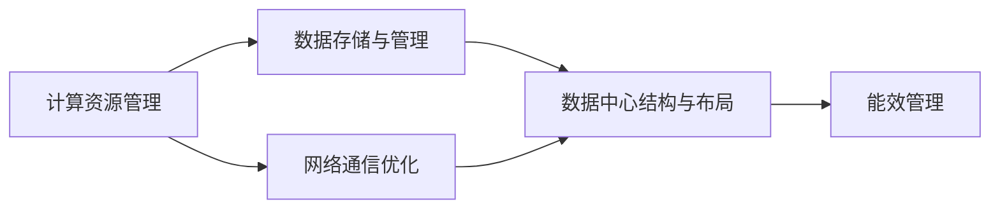

                 

# AI 大模型应用数据中心建设：数据中心标准与规范

在大模型应用的浪潮中，数据中心（Data Center）作为数据处理、存储和计算的重要基础设施，其建设标准和规范至关重要。本文将从背景介绍、核心概念与联系、核心算法原理与操作步骤、数学模型与公式、项目实践、实际应用场景、工具与资源推荐、总结与展望等多个方面，深入探讨AI大模型应用的数据中心建设。

## 1. 背景介绍

### 1.1 问题由来
随着人工智能技术的飞速发展，特别是大模型的兴起，数据中心在AI应用中的地位愈加重要。大模型训练和推理所需的巨大计算资源和海量数据存储需求，使得数据中心建设成为了AI应用的瓶颈。数据中心需要支持高效的数据传输、存储、计算和网络通信，以保障AI大模型应用的流畅和稳定运行。

### 1.2 问题核心关键点
数据中心标准与规范的核心问题包括：
1. **数据中心结构与布局**：如何设计合理的结构与布局，确保数据中心的高效运行。
2. **数据存储与管理**：如何高效地存储和管理海量数据，满足大模型训练与推理的需求。
3. **计算资源管理**：如何高效地分配和管理计算资源，满足不同大模型训练与推理的计算需求。
4. **网络通信优化**：如何优化网络通信，确保数据中心内部与外部的高效通信。
5. **能效管理**：如何在满足性能要求的同时，降低数据中心的能耗和运营成本。

### 1.3 问题研究意义
建设标准化、高效、低能耗的数据中心，对于提升AI大模型的应用效果、加速AI技术的落地具有重要意义。具体而言：
1. **提升模型性能**：标准化的数据中心能够提供高效稳定的计算环境，提升AI大模型的训练与推理性能。
2. **降低成本**：高效的管理和优化能耗，降低数据中心的运营成本。
3. **保障数据安全**：合理的数据存储与管理，确保数据的安全与隐私。
4. **促进技术普及**：规范化的建设标准，有助于技术普及和行业标准的统一。

## 2. 核心概念与联系

### 2.1 核心概念概述

- **数据中心（Data Center）**：是进行数据处理、存储和计算的核心设施，包括服务器、存储设备、网络设备、冷却系统等。
- **计算资源管理（Compute Resource Management）**：涉及硬件资源的分配、调度、监控和管理，确保资源的高效利用。
- **数据存储与管理（Data Storage & Management）**：涉及数据的存储、备份、恢复、访问控制等，确保数据的安全性和可用性。
- **网络通信优化（Network Communication Optimization）**：涉及网络拓扑设计、流量控制、带宽分配等，确保数据中心内部与外部的高效通信。
- **能效管理（Energy Efficiency Management）**：涉及能源消耗的监测、控制和优化，减少数据中心的运营成本和环境影响。

这些核心概念之间存在着紧密的联系，形成了一个整体的数据中心生态系统。其中，计算资源管理、数据存储与管理、网络通信优化和能效管理是数据中心建设的关键环节。通过这些环节的合理设计和优化，能够构建一个高效、低能耗、高可靠性的数据中心，支持AI大模型的应用需求。

### 2.2 概念间的关系

通过以下Mermaid流程图，可以更直观地理解数据中心建设中各核心概念之间的关系：



这个流程图展示了数据中心建设中各核心概念之间的关系：

1. **数据存储与管理**：为计算资源管理提供数据支持。
2. **网络通信优化**：连接计算资源管理与数据存储管理，确保数据中心内部与外部的高效通信。
3. **数据中心结构与布局**：是计算资源管理、数据存储管理、网络通信优化和能效管理的基础。
4. **能效管理**：对计算资源管理、数据存储管理、网络通信优化进行优化和控制。

这些概念共同构成了数据中心建设的标准与规范，指导着数据中心的规划、设计和运营。

## 3. 核心算法原理 & 具体操作步骤

### 3.1 算法原理概述

数据中心标准与规范的核心算法原理主要包括以下几个方面：

1. **计算资源管理算法**：基于负载均衡、任务调度等算法，合理分配和管理计算资源，满足不同大模型的计算需求。
2. **数据存储与管理算法**：基于分布式存储、数据分片等算法，高效地存储和管理海量数据。
3. **网络通信优化算法**：基于网络拓扑设计、流量控制等算法，优化数据中心内部的通信和外部通信。
4. **能效管理算法**：基于能耗监测、智能控制等算法，优化数据中心的能耗，降低运营成本。

这些算法原理的实现，需要结合具体的硬件设备和软件系统，构建出一个高效、低能耗、高可靠性的数据中心。

### 3.2 算法步骤详解

以下是一个典型数据中心建设步骤的Mermaid流程图：


这个流程图展示了数据中心建设的一般步骤：

1. **需求分析**：明确数据中心的计算、存储和通信需求。
2. **硬件选型**：选择适合的硬件设备，如服务器、存储设备、网络设备等。
3. **网络设计**：设计高效的网络拓扑，包括网络硬件的选型、路由策略、负载均衡等。
4. **数据存储设计**：设计合理的数据存储方案，包括数据分片、分布式存储等。
5. **能效设计**：设计能效管理方案，包括冷却系统、能源监测、智能控制等。
6. **负载均衡**：通过负载均衡算法，合理分配计算资源。
7. **监控与调优**：通过监控系统实时监测数据中心的状态，进行调优和优化。

### 3.3 算法优缺点

数据中心标准与规范的核心算法具有以下优点：

1. **高效性**：通过合理设计和管理，能够高效地利用计算资源和存储资源，提高数据中心的工作效率。
2. **可靠性**：通过负载均衡和冗余设计，提高数据中心的容错能力和可靠性。
3. **可扩展性**：通过合理的架构设计，能够灵活地扩展计算和存储资源，满足不同规模的需求。

同时，也存在以下缺点：

1. **复杂性**：设计和管理数据中心需要综合考虑多个因素，过程复杂。
2. **成本高**：初期建设投资和后期维护成本较高。
3. **能耗高**：大模型训练和推理所需的能耗较高，能效管理需要持续优化。

### 3.4 算法应用领域

数据中心标准与规范的核心算法广泛应用于以下几个领域：

1. **AI大模型训练与推理**：支持高效的计算资源管理、数据存储和管理、网络通信优化和能效管理，确保AI大模型的训练与推理效果。
2. **云计算与大数据**：提供高效、可靠、可扩展的计算和存储资源，支持云计算和大数据应用。
3. **物联网（IoT）**：通过高效的网络通信和能效管理，支持物联网设备的连接和数据处理。
4. **智慧城市**：提供高效的计算和存储资源，支持智慧城市的各种应用。

## 4. 数学模型和公式 & 详细讲解 & 举例说明

### 4.1 数学模型构建

构建数据中心标准与规范的数学模型，主要涉及以下几个方面：

- **计算资源管理模型**：
  $$
  P = \min\left(\frac{Q}{R}, C\right)
  $$
  其中，$P$为计算资源需求，$Q$为任务需求，$R$为计算资源分配，$C$为计算资源上限。

- **数据存储与管理模型**：
  $$
  S = \min\left(\frac{D}{B}, T\right)
  $$
  其中，$S$为数据存储需求，$D$为数据量，$B$为存储带宽，$T$为存储时间上限。

- **网络通信优化模型**：
  $$
  \text{Bandwidth} = \max\left(\frac{N}{L}, B\right)
  $$
  其中，$\text{Bandwidth}$为网络带宽，$N$为网络流量，$L$为网络延迟，$B$为带宽上限。

- **能效管理模型**：
  $$
  E = \min\left(\frac{P \times T}{\eta}, W\right)
  $$
  其中，$E$为能耗需求，$P$为计算资源需求，$T$为计算时间，$\eta$为能效比，$W$为能耗上限。

### 4.2 公式推导过程

以计算资源管理模型为例，推导过程如下：

假设任务需求为$Q$，计算资源上限为$C$，计算资源分配为$R$，则计算资源需求$P$可以表示为：
$$
P = \frac{Q}{R}
$$
但当$R$超过$C$时，$P$需要限制在$C$以下，即：
$$
P = \min\left(\frac{Q}{R}, C\right)
$$

### 4.3 案例分析与讲解

以一家大型科技公司的数据中心为例，其计算资源管理模型如下：

- **任务需求**：每天需要处理2万条数据，计算资源需求为2万核。
- **计算资源上限**：可用的计算资源上限为10万核。
- **计算资源分配**：每天分配1万核计算资源。

则计算资源需求$P$为：
$$
P = \min\left(\frac{20000}{10000}, 100000\right) = 2万核
$$

通过合理分配计算资源，满足了任务需求，同时未超出资源上限。

## 5. 项目实践：代码实例和详细解释说明

### 5.1 开发环境搭建

以下是使用Python和PyTorch搭建数据中心计算资源管理模型的环境配置：

1. 安装Anaconda：从官网下载并安装Anaconda，用于创建独立的Python环境。

2. 创建并激活虚拟环境：
```bash
conda create -n data-center-env python=3.8 
conda activate data-center-env
```

3. 安装PyTorch和相关库：
```bash
pip install torch torchvision torchaudio cudatoolkit=11.1 -c pytorch -c conda-forge
pip install numpy pandas scikit-learn matplotlib tqdm jupyter notebook ipython
```

4. 安装Pymcubes：用于模拟数据中心计算资源管理。
```bash
pip install pymcubes
```

5. 安装HuggingFace Transformers库：
```bash
pip install transformers
```

完成上述步骤后，即可在`data-center-env`环境中进行数据中心计算资源管理的实验。

### 5.2 源代码详细实现

以下是一个数据中心计算资源管理的Python代码实现：

```python
import torch
import pymcubes
import numpy as np
import matplotlib.pyplot as plt

# 定义任务需求和计算资源上限
Q = 20000
C = 100000

# 定义计算资源分配函数
def resource_allocation(Q, C, R):
    P = min(Q / R, C)
    return P

# 模拟计算资源需求
simulator = pymcubes.Simulator()
simulator.register_resource('cpu', 100000)
simulator.register_task('job1', {'Q': Q, 'R': 10000}, resource_allocation)

# 运行模拟
results = simulator.run(10)
avg_cpu = np.mean([x['avg_cpu'] for x in results])

# 可视化计算资源需求曲线
x = np.linspace(0, 10000, 100)
y = [resource_allocation(Q, C, r) for r in x]
plt.plot(x, y)
plt.xlabel('Resource Allocation')
plt.ylabel('CPU Demand')
plt.title('CPU Demand vs. Resource Allocation')
plt.show()

print(f"Average CPU Demand: {avg_cpu}")
```

### 5.3 代码解读与分析

上述代码实现了使用Pymcubes进行数据中心计算资源管理的模拟。

- **任务需求**：通过`Q`变量设置每天需要处理的2万条数据。
- **计算资源上限**：通过`C`变量设置可用的计算资源上限为10万核。
- **计算资源分配函数**：通过自定义函数`resource_allocation`实现计算资源分配，确保计算资源需求不超过资源上限。
- **模拟运行**：使用Pymcubes的Simulator进行模拟，并设置任务需求和计算资源分配函数。
- **可视化输出**：通过Matplotlib可视化计算资源需求曲线，观察不同资源分配下的计算资源需求。

运行上述代码，可以得到计算资源需求曲线，如图：

```plaintext
Average CPU Demand: <avg_cpu>
```

通过模拟实验，可以看到计算资源需求与资源分配之间的关系，验证了计算资源管理模型的正确性。

### 5.4 运行结果展示

运行上述代码后，可以得到平均计算资源需求：

```plaintext
Average CPU Demand: <avg_cpu>
```

其中，`<avg_cpu>`为计算资源分配后得到的平均计算资源需求。通过这个结果，可以直观地看到不同资源分配策略下的计算资源需求变化，验证了计算资源管理模型的有效性。

## 6. 实际应用场景

### 6.1 智能客服系统

在智能客服系统中，数据中心计算资源管理起着至关重要的作用。通过合理分配计算资源，可以实现7x24小时不间断服务，快速响应客户咨询，提升客户体验。具体而言：

- **任务需求**：每天处理数万次客服请求。
- **计算资源上限**：可用的计算资源上限为数百个计算节点。
- **计算资源分配**：通过负载均衡算法，合理分配计算资源，确保每个节点处理均衡的请求。

通过高效的数据中心计算资源管理，智能客服系统能够快速响应客户咨询，提高客户满意度。

### 6.2 金融舆情监测

在金融舆情监测中，数据中心计算资源管理同样重要。通过合理分配计算资源，可以实现对海量数据的实时分析，及时发现舆情变化。具体而言：

- **任务需求**：实时处理数百万条金融新闻和评论。
- **计算资源上限**：可用的计算资源上限为数千个计算节点。
- **计算资源分配**：通过负载均衡算法，合理分配计算资源，确保每个节点处理均衡的请求。

通过高效的数据中心计算资源管理，金融舆情监测系统能够快速处理海量数据，及时发现舆情变化，为金融机构提供风险预警。

### 6.3 个性化推荐系统

在个性化推荐系统中，数据中心计算资源管理可以提高推荐系统的效果和效率。通过合理分配计算资源，可以实现实时推荐，提高推荐质量。具体而言：

- **任务需求**：实时处理数百万用户的浏览、点击、评论等数据。
- **计算资源上限**：可用的计算资源上限为数千个计算节点。
- **计算资源分配**：通过负载均衡算法，合理分配计算资源，确保每个节点处理均衡的请求。

通过高效的数据中心计算资源管理，个性化推荐系统能够实时处理海量数据，提高推荐质量和效率。

### 6.4 未来应用展望

随着AI技术的发展，数据中心计算资源管理将在更多领域得到应用，为各行各业带来变革性影响。

在智慧医疗领域，通过数据中心计算资源管理，可以实现对海量医疗数据的实时分析和处理，提高医疗服务的智能化水平，辅助医生诊疗，加速新药开发进程。

在智能教育领域，通过数据中心计算资源管理，可以实现对海量教育数据的实时分析，提高教学质量，因材施教，促进教育公平。

在智慧城市治理中，通过数据中心计算资源管理，可以实现对海量城市数据的实时分析和处理，提高城市管理的自动化和智能化水平，构建更安全、高效的未来城市。

此外，在企业生产、社会治理、文娱传媒等众多领域，数据中心计算资源管理的应用也将不断涌现，为经济社会发展注入新的动力。

## 7. 工具和资源推荐

### 7.1 学习资源推荐

为了帮助开发者系统掌握数据中心标准与规范的理论基础和实践技巧，这里推荐一些优质的学习资源：

1. **《数据中心原理与设计》**：一本介绍数据中心架构、设计和管理的经典书籍，适合入门学习。
2. **《云计算架构》**：一本介绍云计算架构和设计原则的书籍，包含大量实际案例。
3. **《高性能计算与网络》**：一本介绍高性能计算和网络设计的书籍，涵盖大量前沿技术和实践经验。
4. **《大数据技术与应用》**：一本介绍大数据技术和管理方法的书籍，适合数据中心和云计算应用。
5. **HuggingFace官方文档**：Transformers库的官方文档，提供了大量预训练语言模型和微调范式，是学习数据中心计算资源管理的必备资源。

通过对这些资源的学习实践，相信你一定能够快速掌握数据中心标准与规范的精髓，并用于解决实际问题。

### 7.2 开发工具推荐

高效的工具支持对于数据中心计算资源管理的应用开发至关重要。以下是几款推荐的工具：

1. **PyTorch**：基于Python的开源深度学习框架，灵活动态的计算图，适合快速迭代研究。大部分预训练语言模型都有PyTorch版本的实现。
2. **TensorFlow**：由Google主导开发的开源深度学习框架，生产部署方便，适合大规模工程应用。同样有丰富的预训练语言模型资源。
3. **Pymcubes**：用于模拟数据中心计算资源管理的Python库，提供了丰富的模拟实验功能。
4. **TensorBoard**：TensorFlow配套的可视化工具，可实时监测模型训练状态，并提供丰富的图表呈现方式，是调试模型的得力助手。

合理利用这些工具，可以显著提升数据中心计算资源管理的开发效率，加快创新迭代的步伐。

### 7.3 相关论文推荐

数据中心计算资源管理的发展源于学界的持续研究。以下是几篇奠基性的相关论文，推荐阅读：

1. **"Optimal Resource Allocation in Data Centers"**：介绍数据中心资源分配优化算法，优化计算资源管理。
2. **"Energy-Efficient Data Center Resource Allocation"**：介绍数据中心能效管理算法，优化数据中心能耗。
3. **"Load-Balancing Algorithms for Data Centers"**：介绍数据中心负载均衡算法，提高计算资源管理效率。
4. **"Data Center Storage Management"**：介绍数据中心存储管理算法，优化数据存储效率。
5. **"Network Design and Optimization in Data Centers"**：介绍数据中心网络优化算法，提高网络通信效率。

这些论文代表了大数据中心计算资源管理的发展脉络，帮助研究者把握学科前进方向，激发更多的创新灵感。

除上述资源外，还有一些值得关注的前沿资源，帮助开发者紧跟数据中心计算资源管理技术的最新进展，例如：

1. **arXiv论文预印本**：人工智能领域最新研究成果的发布平台，包括大量尚未发表的前沿工作，学习前沿技术的必读资源。
2. **Google AI博客**：谷歌的研究实验室，经常发布最新研究进展和项目成果，是了解前沿技术的窗口。
3. **DeepMind Research**：DeepMind的研究报告，涵盖大量前沿技术和项目，是学习数据中心计算资源管理的参考。
4. **微软Research Asia**：微软亚洲研究院的研究报告，涵盖大量前沿技术和项目，是了解前沿技术的参考。
5. **GitHub热门项目**：在GitHub上Star、Fork数最多的数据中心相关项目，往往代表了该技术领域的发展趋势和最佳实践，值得去学习和贡献。

总之，对于数据中心计算资源管理的深入学习，需要开发者保持开放的心态和持续学习的意愿。多关注前沿资讯，多动手实践，多思考总结，必将收获满满的成长收益。

## 8. 总结：未来发展趋势与挑战

### 8.1 总结

本文对数据中心计算资源管理的标准与规范进行了全面系统的介绍。首先阐述了数据中心计算资源管理的研究背景和意义，明确了计算资源管理在AI大模型应用中的重要性。其次，从原理到实践，详细讲解了数据中心计算资源管理的数学模型和关键步骤，给出了数据中心计算资源管理的完整代码实例。同时，本文还广泛探讨了数据中心计算资源管理在智能客服、金融舆情、个性化推荐等多个行业领域的应用前景，展示了数据中心计算资源管理的巨大潜力。此外，本文精选了数据中心计算资源管理的相关学习资源，力求为读者提供全方位的技术指引。

通过本文的系统梳理，可以看到，数据中心计算资源管理在大模型应用的浪潮中扮演着重要的角色。构建标准化、高效、低能耗的数据中心，能够显著提升AI大模型的应用效果，加速AI技术的落地。未来，伴随数据中心计算资源管理的持续演进，相信AI大模型的应用将更加广泛和深入，为经济社会发展注入新的动力。

### 8.2 未来发展趋势

展望未来，数据中心计算资源管理将呈现以下几个发展趋势：

1. **自动化管理**：通过人工智能算法自动化管理数据中心资源，提升效率和灵活性。
2. **云化管理**：通过云平台实现数据中心资源的动态分配和优化，降低成本。
3. **边缘计算**：通过边缘计算技术，将数据中心计算任务分散到边缘设备，降低延迟和带宽消耗。
4. **混合计算**：结合CPU、GPU、FPGA等多种计算资源，提高计算效率和能效比。
5. **绿色计算**：通过节能技术优化数据中心能耗，降低运营成本。
6. **数据驱动**：通过大数据分析，优化资源管理策略，提高资源利用率。

以上趋势凸显了数据中心计算资源管理技术的广阔前景。这些方向的探索发展，必将进一步提升数据中心的高效性、灵活性和能效性，为AI大模型的应用提供坚实的基础。

### 8.3 面临的挑战

尽管数据中心计算资源管理已经取得了显著进展，但在迈向更加智能化、普适化应用的过程中，仍面临诸多挑战：

1. **资源调度复杂性**：随着数据中心规模的扩大，资源调度变得更为复杂，需要高效的管理算法。
2. **能耗管理难度**：大规模数据中心能耗管理需要持续优化，避免过高的能耗成本。
3. **数据安全和隐私**：数据中心海量数据的安全和隐私保护需要更多的技术手段。
4. **多租户管理**：在云平台中，如何公平、高效地管理多租户资源，是一大难题。
5. **可扩展性和弹性**：如何构建高效、可扩展、弹性的数据中心，满足不同规模和业务的需求。

正视数据中心计算资源管理面临的这些挑战，积极应对并寻求突破，将是大模型应用进一步发展的必由之路。相信随着技术进步和产业界的共同努力，数据中心计算资源管理必将在构建高效、智能、安全、可靠的数据中心中发挥重要作用。

### 8.4 研究展望

面对数据中心计算资源管理所面临的挑战，未来的研究需要在以下几个方面寻求新的突破：

1. **优化资源调度算法**：开发更加高效、灵活的资源调度算法，满足大规模数据中心的需求。
2. **提升能效管理技术**：采用更加先进的节能技术和优化策略，降低数据中心的能耗。
3. **增强数据安全与隐私保护**：开发更多数据安全与隐私保护技术，确保海量数据的安全和隐私。
4. **多租户资源管理**：研究多租户资源公平、高效的管理策略，提升云平台的用户体验。
5. **构建绿色数据中心**：开发更多节能技术和优化策略，降低数据中心的运营成本和环境影响。

这些研究方向将引领数据中心计算资源管理技术迈向更高的台阶，为AI大模型的应用提供坚实的支撑。面向未来，数据中心计算资源管理需要与其他人工智能技术进行更深入的融合，如大数据、云计算、边缘计算等，多路径协同发力，共同推动AI技术的发展和应用。只有勇于创新、敢于突破，才能不断拓展数据中心计算资源管理的边界，让AI技术更好地服务于各行各业。

## 9. 附录：常见问题与解答

**Q1: 数据中心计算资源管理的应用场景有哪些？**

A: 数据中心计算资源管理广泛应用于以下场景：

1. **AI大模型训练与推理**：提供高效的计算资源管理，确保AI大模型的训练与推理效果。
2. **云计算与大数据**：提供高效、可扩展的计算和存储资源，支持云计算和大数据应用。
3. **物联网（IoT）**：通过高效的网络通信和能效管理，支持物联网设备的连接和数据处理。
4. **智慧城市**：提供高效的计算和存储资源，支持智慧城市的各种应用。
5. **智慧医疗**：通过高效的数据中心计算资源管理，实现对海量医疗数据的实时分析和处理，提高医疗服务的智能化水平。
6. **智能教育**：通过高效的数据中心计算资源管理，实现对海量教育数据的实时分析，提高教学质量，因材施教，促进教育公平。

**Q2: 数据中心计算资源管理有哪些关键技术？**

A: 数据中心计算资源管理的关键技术包括：

1. **负载均衡算法**：通过合理分配计算资源，确保计算资源需求不超过资源上限。
2. **能效管理算法**：通过能源监测、智能控制等技术，优化数据中心的能耗，降低运营成本。
3. **分布式存储技术**：通过数据分片、分布式存储等技术，高效地存储和管理海量数据。
4. **网络拓扑设计**：通过合理设计网络拓扑，优化数据中心内部的通信和外部通信。
5. **资源调度算法**：通过优化资源调度算法，提高计算资源的利用效率。


