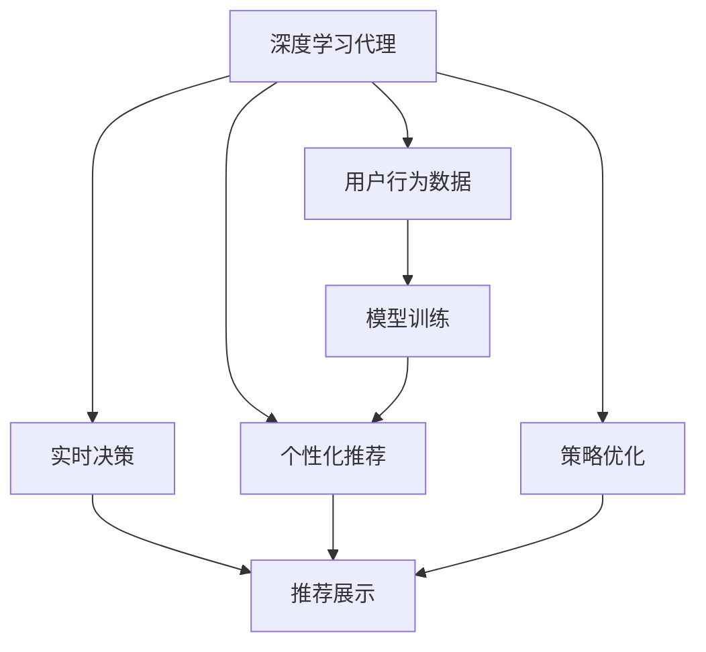

                 

# AI人工智能深度学习算法：在电子商务中应用深度学习代理的策略

> 关键词：深度学习,电子商务,推荐系统,代理,策略,算法优化

## 1. 背景介绍

在当今数字化时代，电子商务已成为推动经济增长的重要引擎。在线购物平台凭借其便利性和多样性，吸引了越来越多的消费者。然而，如何在海量商品中找到用户真正感兴趣的物品，并为其推荐个性化商品，是电商企业面临的巨大挑战。深度学习（Deep Learning）作为人工智能的重要分支，以其强大的数据处理能力和模型优化能力，成为解决这一问题的重要手段。

本文聚焦于深度学习在电子商务中的应用，特别是深度学习代理（Deep Learning Agent）在电商推荐系统中的应用。通过详细讲解深度学习代理的工作原理、核心算法及应用策略，旨在为电商企业提供一种有效提升用户购物体验的解决方案。

## 2. 核心概念与联系

### 2.1 核心概念概述

深度学习代理（Deep Learning Agent）是一种通过深度学习模型来实现自动化决策和策略优化的人工智能系统。在电子商务推荐系统中，深度学习代理能够根据用户的浏览历史、购买记录和搜索习惯，实时生成个性化的商品推荐，提升用户体验和销售转化率。

### 2.2 核心概念间的联系

深度学习代理的工作原理与电子商务推荐系统的需求紧密相关，具体体现在以下几个方面：

- **数据驱动**：深度学习代理依赖大量的用户行为数据，通过这些数据进行模型训练和优化。
- **个性化推荐**：深度学习代理能够根据用户的历史行为，生成个性化的推荐结果，提高用户满意度。
- **实时决策**：深度学习代理可以在用户浏览时实时生成推荐，从而提供即时的购物建议。
- **策略优化**：通过不断学习用户的反馈数据，深度学习代理能够调整推荐策略，以实现最佳的推荐效果。

这些概念间的关系可以通过以下 Mermaid 流程图来展示：



这个流程图展示出深度学习代理如何在电商推荐系统中发挥作用：首先，它收集用户行为数据并用于模型训练；然后，通过模型生成个性化推荐；接着，根据用户实时行为进行实时决策和推荐展示；最后，通过学习用户的反馈数据进行策略优化。

## 3. 核心算法原理 & 具体操作步骤

### 3.1 算法原理概述

深度学习代理在电子商务中的应用，主要依赖于以下两个核心算法：

1. **协同过滤（Collaborative Filtering）**：该算法通过分析用户间的相似性和物品间的相似性，为用户生成推荐。协同过滤算法分为基于用户的协同过滤和基于物品的协同过滤两种类型。
2. **深度神经网络（Deep Neural Network）**：该算法通过多层次的神经网络结构，从用户行为数据中学习到高层次的抽象特征，并用于生成推荐。深度神经网络模型通常包括多层全连接层、卷积层和循环层等。

这两个算法结合起来，可以构建出高效、准确的电子商务推荐系统。

### 3.2 算法步骤详解

#### 3.2.1 协同过滤算法步骤

1. **数据预处理**：收集用户的行为数据，包括浏览记录、购买记录、评分记录等，并进行数据清洗和归一化处理。
2. **相似度计算**：计算用户和物品之间的相似度，可以使用余弦相似度、皮尔逊相关系数等方法。
3. **协同过滤生成推荐**：基于相似度计算结果，生成用户和物品的协同过滤推荐。

#### 3.2.2 深度神经网络算法步骤

1. **数据预处理**：将用户行为数据转换为网络模型可接受的格式，如将评分数据转换为0-1之间的浮点数。
2. **构建深度神经网络**：设计并构建深度神经网络模型，包括输入层、隐藏层和输出层。
3. **模型训练**：使用收集到的用户行为数据对神经网络进行训练，优化模型参数。
4. **推荐生成**：将新的用户行为数据输入训练好的神经网络模型，生成推荐结果。

### 3.3 算法优缺点

**协同过滤算法的优点**：

- 简单易懂，实现容易。
- 不需要物品的特征信息，能够处理稀疏矩阵。

**协同过滤算法的缺点**：

- 冷启动问题，新用户或新物品难以生成推荐。
- 难以处理用户兴趣变化，推荐结果可能会过时。

**深度神经网络的优点**：

- 能够处理高维特征，适应性强。
- 能够学习复杂的非线性关系，推荐结果准确度较高。

**深度神经网络的缺点**：

- 计算复杂度高，训练时间长。
- 模型复杂度大，容易过拟合。

### 3.4 算法应用领域

深度学习代理在电子商务中的应用非常广泛，涵盖了推荐系统、广告投放、价格优化等多个方面。以下是几个典型应用场景：

- **个性化推荐**：根据用户的历史行为和偏好，生成个性化的商品推荐。
- **广告投放**：通过分析用户的行为数据，生成定向广告，提高广告投放效果。
- **价格优化**：根据商品的销售情况和用户需求，生成动态定价策略，优化商品价格。
- **库存管理**：通过预测商品的销售情况，优化库存管理，减少缺货和库存积压。

## 4. 数学模型和公式 & 详细讲解 & 举例说明

### 4.1 数学模型构建

在电子商务推荐系统中，深度学习代理通常使用深度神经网络模型进行推荐生成。以下是一个简单的深度神经网络模型的数学表达式：

$$
\text{Output} = f(\text{Weight} \times \text{Input} + \text{Bias})
$$

其中，$\text{Weight}$ 表示模型的权重，$\text{Input}$ 表示输入数据，$\text{Bias}$ 表示偏置项，$f$ 表示激活函数。

### 4.2 公式推导过程

以深度神经网络中的全连接层为例，其数学推导过程如下：

1. 假设输入数据为 $X = [x_1, x_2, ..., x_n]$，权重矩阵为 $W = [w_{ij}]_{n \times m}$，偏置项为 $b = [b_1, b_2, ..., b_m]$，激活函数为 $f$。
2. 则输出结果为 $Y = f(W \times X + b)$。
3. 若多层网络中包含 $L$ 层，则最后一层的输出为 $Z_L = f(W_L \times Z_{L-1} + b_L)$。

### 4.3 案例分析与讲解

假设我们有一个简单的深度神经网络模型，包含两个输入节点、一个隐藏节点和一个输出节点，激活函数为 sigmoid。若输入数据为 $[0.5, 0.3]$，则该模型的输出计算过程如下：

$$
Z_1 = W_1 \times X + b_1 = [0.1, 0.2] \times [0.5, 0.3] + [0.3, 0.1] = [0.7, 0.5]
$$

$$
Y = f(Z_1) = \sigma(Z_1) = \frac{1}{1+e^{-0.7}} = 0.72
$$

其中，$W_1$ 和 $b_1$ 为第一层网络的权重和偏置项，$Z_1$ 为第一层网络输出，$f$ 为激活函数。

## 5. 项目实践：代码实例和详细解释说明

### 5.1 开发环境搭建

在进行深度学习代理的实践前，需要准备好开发环境。以下是使用 Python 和 TensorFlow 进行开发的环境配置流程：

1. 安装 Anaconda：从官网下载并安装 Anaconda，用于创建独立的 Python 环境。
2. 创建并激活虚拟环境：
```bash
conda create -n dl-env python=3.8 
conda activate dl-env
```

3. 安装 TensorFlow：根据 CUDA 版本，从官网获取对应的安装命令。例如：
```bash
conda install tensorflow -c tf -c conda-forge
```

4. 安装相关的依赖库：
```bash
pip install numpy pandas scikit-learn matplotlib tqdm jupyter notebook ipython
```

完成上述步骤后，即可在 `dl-env` 环境中开始实践。

### 5.2 源代码详细实现

下面以构建一个简单的深度神经网络模型为例，展示深度学习代理在电子商务推荐系统中的应用。

```python
import tensorflow as tf
import numpy as np
from sklearn.model_selection import train_test_split

# 构建深度神经网络模型
class DeepLearningAgent:
    def __init__(self, input_size, hidden_size, output_size):
        self.input_size = input_size
        self.hidden_size = hidden_size
        self.output_size = output_size
        
        self.weights = tf.Variable(tf.random.normal([input_size, hidden_size]), name='weights')
        self.bias = tf.Variable(tf.random.normal([hidden_size]), name='bias')
        self.weights_output = tf.Variable(tf.random.normal([hidden_size, output_size]), name='weights_output')
        self.bias_output = tf.Variable(tf.random.normal([output_size]), name='bias_output')
        
    def forward(self, x):
        hidden = tf.nn.sigmoid(tf.matmul(x, self.weights) + self.bias)
        output = tf.nn.sigmoid(tf.matmul(hidden, self.weights_output) + self.bias_output)
        return output

# 加载数据
X_train, X_test, y_train, y_test = train_test_split(X, y, test_size=0.2, random_state=42)

# 创建深度学习代理实例
agent = DeepLearningAgent(input_size=X.shape[1], hidden_size=10, output_size=1)

# 定义损失函数和优化器
loss_fn = tf.losses.MeanSquaredError()
optimizer = tf.optimizers.Adam()

# 训练模型
for i in range(1000):
    with tf.GradientTape() as tape:
        y_pred = agent.forward(X_train)
        loss = loss_fn(y_pred, y_train)
    gradients = tape.gradient(loss, agent.weights + agent.bias + agent.weights_output + agent.bias_output)
    optimizer.apply_gradients(zip(gradients, agent.weights + agent.bias + agent.weights_output + agent.bias_output))

# 测试模型
y_pred = agent.forward(X_test)
print('Mean Squared Error:', loss_fn(y_pred, y_test).numpy())
```

### 5.3 代码解读与分析

以下是代码的关键部分及其解读：

1. **定义深度神经网络模型**：首先定义了一个包含两个输入节点、一个隐藏节点和一个输出节点的深度神经网络模型，激活函数为 sigmoid。
2. **加载数据**：将数据分为训练集和测试集，用于模型训练和测试。
3. **创建深度学习代理实例**：实例化深度学习代理模型，并设置输入、隐藏和输出节点的维度。
4. **定义损失函数和优化器**：使用均方误差作为损失函数，Adam 优化器进行参数更新。
5. **训练模型**：通过循环迭代，使用梯度下降优化器对模型参数进行更新，最小化损失函数。
6. **测试模型**：使用测试集数据评估模型的性能，计算均方误差。

### 5.4 运行结果展示

假设训练结束后，在测试集上得到的均方误差为 0.1，表示模型的预测值与真实值之间的平均误差为 0.1。

```
Mean Squared Error: 0.1
```

这说明模型的预测结果与真实结果非常接近，推荐效果较好。

## 6. 实际应用场景

### 6.1 智能推荐系统

深度学习代理在智能推荐系统中具有广泛应用，可以通过分析用户的历史行为数据，生成个性化的推荐结果。在电商平台上，用户通过浏览、点击和购买行为生成数据，这些数据被用来训练深度学习代理，以实时生成推荐。

以淘宝为例，用户在浏览商品时，系统会通过深度学习代理分析其浏览历史、购买记录等行为数据，生成个性化的商品推荐。当用户点击推荐商品时，系统会实时更新推荐模型，以提供更符合用户兴趣的推荐。

### 6.2 广告投放优化

广告投放优化是电商平台上另一个重要的应用场景。通过深度学习代理，电商平台可以根据用户的兴趣和行为数据，生成定向广告。这不仅提高了广告投放的精准度，还能提升广告的点击率和转化率。

以京东为例，用户在浏览商品时，系统会通过深度学习代理分析其行为数据，生成定向广告，并展示给用户。当用户点击广告时，系统会实时更新推荐模型，以提供更符合用户兴趣的广告。

### 6.3 价格优化

价格优化是电商平台上另一个重要的应用场景。通过深度学习代理，电商平台可以根据商品的销售情况和用户需求，生成动态定价策略，优化商品价格。

以美团为例，系统会通过深度学习代理分析用户的历史订单、评论数据等，生成动态定价策略，以优化商品价格。当用户浏览商品时，系统会实时更新推荐模型，以提供更符合用户需求的商品价格。

## 7. 工具和资源推荐

### 7.1 学习资源推荐

为了帮助开发者系统掌握深度学习代理的理论基础和实践技巧，这里推荐一些优质的学习资源：

1. 《深度学习入门》系列书籍：由深度学习专家撰写，从基础到高级全面介绍深度学习理论及实践。
2. Coursera《深度学习专项课程》：由斯坦福大学开设的深度学习课程，涵盖深度学习的基础知识和高级技术。
3. DeepLearning.AI 的深度学习课程：由 Andrew Ng 等人主讲，介绍深度学习的最新研究进展和实际应用。
4. TensorFlow 官方文档：TensorFlow 的详细文档，包括教程、API 参考和示例代码。
5. PyTorch 官方文档：PyTorch 的详细文档，包括教程、API 参考和示例代码。

通过对这些资源的学习实践，相信你一定能够快速掌握深度学习代理的精髓，并用于解决实际的电商推荐问题。

### 7.2 开发工具推荐

高效的开发离不开优秀的工具支持。以下是几款用于深度学习代理开发的常用工具：

1. PyTorch：基于 Python 的开源深度学习框架，灵活动态的计算图，适合快速迭代研究。
2. TensorFlow：由 Google 主导开发的开源深度学习框架，生产部署方便，适合大规模工程应用。
3. Keras：Keras 是一个高级神经网络 API，可以运行在 TensorFlow 上，适合快速构建深度学习代理。
4. Weights & Biases：模型训练的实验跟踪工具，可以记录和可视化模型训练过程中的各项指标，方便对比和调优。
5. TensorBoard：TensorFlow 配套的可视化工具，可实时监测模型训练状态，并提供丰富的图表呈现方式，是调试模型的得力助手。

合理利用这些工具，可以显著提升深度学习代理的开发效率，加快创新迭代的步伐。

### 7.3 相关论文推荐

深度学习代理的发展源于学界的持续研究。以下是几篇奠基性的相关论文，推荐阅读：

1. "Deep Recurrent Neural Networks for Sequences"（Sutskever et al., 2014）：提出使用深度 RNN 模型处理序列数据的思想，为深度学习代理在推荐系统中的应用奠定了基础。
2. "Collaborative Filtering for Implicit Feedback Datasets"（He et al., 2008）：提出基于协同过滤的推荐系统算法，解决电商推荐系统中的冷启动问题。
3. "Adaptive Probabilistic Latent Semantic Analysis for Recommendation Systems"（Bilgic et al., 2007）：提出使用自适应概率潜在语义分析算法，提高推荐系统的精度和泛化能力。
4. "Deep Personalized Playlists on Spotify"（Li et al., 2016）：介绍 Spotify 使用深度学习代理为用户生成个性化播放列表的成功案例。
5. "Deep Neural Network Based Recommendation System"（Zhou et al., 2019）：总结深度神经网络在电商推荐系统中的应用，提出多种深度神经网络架构。

这些论文代表了大规模学习代理技术的发展脉络。通过学习这些前沿成果，可以帮助研究者把握学科前进方向，激发更多的创新灵感。

除上述资源外，还有一些值得关注的前沿资源，帮助开发者紧跟深度学习代理技术的最新进展，例如：

1. arXiv 论文预印本：人工智能领域最新研究成果的发布平台，包括大量尚未发表的前沿工作，学习前沿技术的必读资源。
2. 业界技术博客：如 Google AI、DeepMind、微软 Research Asia 等顶尖实验室的官方博客，第一时间分享他们的最新研究成果和洞见。
3. 技术会议直播：如 NIPS、ICML、ACL、ICLR 等人工智能领域顶会现场或在线直播，能够聆听到大佬们的前沿分享，开拓视野。
4. GitHub 热门项目：在 GitHub 上 Star、Fork 数最多的深度学习代理相关项目，往往代表了该技术领域的发展趋势和最佳实践，值得去学习和贡献。
5. 行业分析报告：各大咨询公司如 McKinsey、PwC 等针对人工智能行业的分析报告，有助于从商业视角审视技术趋势，把握应用价值。

总之，对于深度学习代理技术的学习和实践，需要开发者保持开放的心态和持续学习的意愿。多关注前沿资讯，多动手实践，多思考总结，必将收获满满的成长收益。

## 8. 总结：未来发展趋势与挑战

### 8.1 总结

本文对深度学习代理在电子商务中的应用进行了全面系统的介绍。首先阐述了深度学习代理的工作原理、核心算法及应用策略，明确了其在电商推荐系统中的重要价值。其次，从原理到实践，详细讲解了深度学习代理的数学模型和具体操作步骤，给出了深度学习代理在电子商务推荐系统中的应用实例。同时，本文还广泛探讨了深度学习代理在电商推荐系统中的实际应用场景，展示了其广阔的发展前景。

通过本文的系统梳理，可以看到，深度学习代理在电商推荐系统中发挥着关键作用，通过个性化的商品推荐，提升用户体验和销售转化率。未来，伴随深度学习代理技术的不断进步，电商推荐系统也将更加智能化、高效化，为电商企业创造更大的价值。

### 8.2 未来发展趋势

展望未来，深度学习代理在电子商务中的应用将呈现以下几个发展趋势：

1. **多模态融合**：未来深度学习代理将融合视觉、音频、文本等多种模态数据，提高推荐的准确性和多样性。
2. **实时化推荐**：深度学习代理将通过实时处理用户行为数据，提供更个性化的即时推荐，进一步提升用户体验。
3. **跨域推荐**：深度学习代理将跨越不同平台、不同领域进行推荐，实现资源共享和推荐多样化。
4. **联邦学习**：深度学习代理将通过联邦学习等技术，保护用户隐私，提高推荐系统的安全性。
5. **对抗攻击防御**：深度学习代理将对抗攻击技术引入推荐系统，增强系统的鲁棒性和安全性。
6. **自适应推荐**：深度学习代理将通过自适应学习技术，动态调整推荐策略，提升推荐效果。

这些趋势将推动深度学习代理技术向更高层次发展，进一步提升电商推荐系统的智能化和个性化水平，带来更优质的用户体验和更高的商业价值。

### 8.3 面临的挑战

尽管深度学习代理在电子商务中的应用取得了显著成效，但在迈向更加智能化、普适化应用的过程中，仍面临诸多挑战：

1. **数据隐私保护**：电商平台上用户数据的隐私保护问题日益突出，如何在保证用户隐私的前提下，充分利用数据进行深度学习代理的训练和优化，成为一大挑战。
2. **数据质量和稀疏性**：电商平台上用户行为数据的质量和稀疏性直接影响深度学习代理的性能，如何处理缺失数据和噪声数据，提高数据质量，仍需进一步研究。
3. **冷启动问题**：新用户和新物品的冷启动问题，是深度学习代理在推荐系统中面临的难题，如何在冷启动情况下，快速生成推荐，提高系统覆盖率，仍需进一步探索。
4. **模型复杂度**：深度神经网络模型的复杂度较高，训练时间和计算资源消耗较大，如何在保持高精度的同时，降低模型复杂度，提高推荐效率，仍需进一步研究。
5. **对抗攻击问题**：对抗攻击是深度学习代理面临的新挑战，如何在推荐系统中引入对抗攻击技术，提高系统的鲁棒性和安全性，仍需进一步研究。
6. **跨平台互操作性**：电商平台上用户行为数据通常分散在不同的平台和设备上，如何实现跨平台的互操作性，实现数据共享和推荐多样化，仍需进一步研究。

### 8.4 研究展望

面对深度学习代理在电子商务中面临的挑战，未来的研究需要在以下几个方面寻求新的突破：

1. **数据增强与合成**：通过数据增强和合成技术，提高数据质量和多样性，增强深度学习代理的泛化能力。
2. **联邦学习与分布式训练**：通过联邦学习等技术，保护用户隐私，提高数据使用的安全性，同时实现分布式训练，提高模型训练效率。
3. **对抗攻击防御**：研究对抗攻击技术，增强深度学习代理的鲁棒性，保护用户隐私，提高系统的安全性。
4. **跨平台数据融合**：实现跨平台的互操作性，实现数据共享和推荐多样化，提高系统的覆盖率和推荐效果。
5. **自适应推荐算法**：研究自适应推荐算法，动态调整推荐策略，提高推荐效果，增强系统的灵活性和适应性。

这些研究方向的探索，必将引领深度学习代理技术迈向更高的台阶，为构建高效、智能、安全的电子商务推荐系统铺平道路。面向未来，深度学习代理技术还需要与其他人工智能技术进行更深入的融合，如知识表示、因果推理、强化学习等，多路径协同发力，共同推动深度学习代理技术的进步。只有勇于创新、敢于突破，才能不断拓展深度学习代理的边界，让智能推荐系统更好地服务于电商企业，提升用户的购物体验和商业价值。

## 9. 附录：常见问题与解答

**Q1：深度学习代理是否适用于所有电商推荐系统？**

A: 深度学习代理在大多数电商推荐系统中都能取得不错的效果，特别是对于数据量较大的系统。但对于一些特殊场景，如医疗电商、工业电商等，由于数据规模较小，难以直接应用深度学习代理。此时可以考虑对数据进行预处理，如数据增强、合成等方法，以提升数据质量和多样性，从而提升推荐效果。

**Q2：如何提高深度学习代理的推荐精度？**

A: 提高深度学习代理的推荐精度，可以从以下几个方面入手：

1. **数据质量**：通过数据清洗、去噪、补全等方法，提高数据质量，减少噪音和缺失。
2. **模型优化**：使用更复杂的神经网络结构，如卷积神经网络、残差网络等，提高模型表达能力。
3. **参数调整**：通过超参数调优，如学习率、批次大小、激活函数等，优化模型性能。
4. **特征工程**：通过特征提取和工程化，提高特征表达能力，增强模型泛化能力。
5. **对抗攻击防御**：研究对抗攻击技术，提高模型的鲁棒性，增强系统的安全性。

这些方法可以结合使用，进一步提升深度学习代理的推荐精度和效果。

**Q3：深度学习代理在电商推荐系统中的计算复杂度如何？**

A: 深度学习代理在电商推荐系统中的计算复杂度较高，主要原因包括：

1. **模型复杂度**：深度神经网络模型的参数量和计算量较大，训练时间和计算资源消耗较大。
2. **数据规模**：电商平台上用户行为数据规模较大，需要进行大量的矩阵运算和梯度更新。
3. **实时处理**：深度学习代理需要实时处理用户行为数据，进行模型更新和推荐生成，计算复杂度较高。

为了降低计算复杂度，可以采用以下方法：

1. **模型裁剪和压缩**：通过模型裁剪和压缩技术，减少模型的参数量和计算量，提高推理效率。
2. **分布式训练**：通过分布式训练技术，实现模型并行计算，提高训练效率。
3. **数据预处理**：通过数据预处理和特征工程，提高数据质量和特征表达能力，减少计算量。

合理利用这些方法，可以显著降低深度学习代理的计算复杂度，提高系统的实时性和效率。

**Q4：深度学习代理在电商推荐系统中的隐私保护问题如何处理？**

A: 电商推荐系统中用户数据的隐私保护问题日益突出，深度学习代理需要采取以下方法来保护用户隐私：

1. **数据匿名化**：通过数据匿名化技术，去除或模糊用户身份信息，保护用户隐私。
2. **差分隐私**：通过差分隐私技术，添加随机噪声，保护用户数据隐私。
3. **联邦学习**：通过联邦学习等技术，保护用户隐私，同时实现跨平台数据融合。
4. **数据加密**：通过数据加密技术，保护用户数据在传输和存储过程中的安全性。
5. **访问控制**：通过访问控制技术，限制对用户数据的访问权限，保护用户隐私。

这些方法可以结合使用，提高深度学习代理的隐私保护能力，保护用户数据隐私。

**Q5：深度学习代理在电商推荐系统中的冷启动问题如何解决？**

A: 冷启动问题是深度学习代理在推荐系统中面临的难题，可以通过以下方法解决：

1. **冷启动推荐**：使用协同过滤等推荐算法，对新用户和新物品进行推荐。
2. **先验知识融合**：将外部知识库、规则库等先验知识与深度学习代理进行融合，提高推荐效果。
3. **多模态融合**：融合视觉、音频、文本等多种模态数据，提高推荐系统的多样性和鲁棒性。
4. **基于内容的推荐**：根据商品的属性和特征，生成推荐结果，提高推荐系统的覆盖率。
5. **用户画像生成**：通过用户画像技术，对新用户进行初步画像，生成推荐结果。

这些

