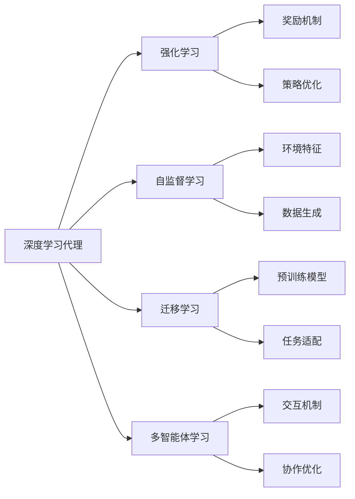
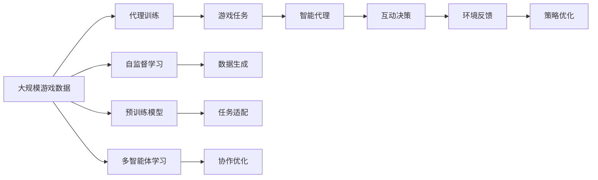

                 

# AI人工智能深度学习算法：智能深度学习代理在视频游戏场景中的应用

## 1. 背景介绍

### 1.1 问题由来

随着人工智能（AI）技术的不断发展和应用，视频游戏领域开始引入深度学习技术，以增强游戏体验和互动性。这一趋势催生了智能深度学习代理（Deep Learning Agents）在视频游戏场景中的研究与应用。智能代理能在游戏中自主决策，与玩家或非玩家角色互动，提升游戏智能化水平。然而，由于游戏环境复杂多变，如何在游戏中高效训练和部署智能代理成为一个重要挑战。

### 1.2 问题核心关键点

智能深度学习代理的训练和部署主要面临以下问题：

- 游戏环境的高度动态性和不确定性，使得游戏数据难以生成和标注。
- 实时反馈机制的缺失，无法对智能代理的决策进行有效的监督和调整。
- 智能代理需要适应不同的游戏任务和难度，要求模型具有泛化能力。
- 模型的计算资源需求高，需要在有限的时间内完成训练和推理。
- 需要平衡游戏性能和智能代理的学习效果，避免智能代理过度干扰游戏。

### 1.3 问题研究意义

研究智能深度学习代理在视频游戏场景中的应用，对于推动游戏行业的智能化转型、提升玩家体验、创造新游戏形式具有重要意义：

- 降低游戏开发成本。智能代理可以自动生成游戏内容，减少人工设计的工作量。
- 增强游戏互动性。智能代理能与玩家互动，提供更自然和个性化的游戏体验。
- 实现游戏AI的创新。智能代理可以探索不同的游戏策略和玩法，推动游戏创新。
- 优化游戏运行效率。智能代理能动态调整游戏参数，提升游戏性能。
- 促进游戏商业化。智能代理可以个性化推荐游戏内容，提高用户黏性和转化率。

## 2. 核心概念与联系

### 2.1 核心概念概述

为了更好地理解智能深度学习代理在视频游戏场景中的应用，本节将介绍几个关键概念：

- **深度学习代理（Deep Learning Agents）**：利用深度学习技术实现自主决策和行动的智能代理。在视频游戏中，智能代理通过观察游戏状态，决策行动，与游戏环境互动。

- **强化学习（Reinforcement Learning, RL）**：一种基于奖励和惩罚的学习方法，代理通过不断试错，优化决策策略，以最大化累积奖励。

- **自监督学习（Self-Supervised Learning）**：利用游戏环境自身的特征，无需标注数据，训练代理学习游戏任务。

- **迁移学习（Transfer Learning）**：将预训练模型应用于新游戏任务，快速提升代理的性能。

- **多智能体学习（Multi-Agent Learning）**：涉及多个智能代理的交互和协作，以实现更复杂的任务。

这些概念共同构成了智能深度学习代理在视频游戏场景中的核心框架，使得代理能够通过学习，适应各种游戏环境和任务，提升游戏智能化水平。

### 2.2 概念间的关系

这些核心概念之间存在着紧密的联系，形成了智能代理在视频游戏场景中的完整生态系统。以下是几个主要的Mermaid流程图，展示这些概念之间的关系：



这些流程图展示出智能代理在视频游戏场景中的主要学习范式和方法：

1. 深度学习代理通过强化学习进行自主决策和行动。
2. 代理可以利用自监督学习从游戏环境中学习游戏任务。
3. 迁移学习可以将预训练模型应用到新游戏任务，快速提升代理的性能。
4. 多智能体学习可以涉及多个代理的协作，实现更复杂的任务。

这些概念共同构成了智能代理在视频游戏场景中的核心框架，使得代理能够通过学习，适应各种游戏环境和任务，提升游戏智能化水平。

### 2.3 核心概念的整体架构

最后，我们用一个综合的流程图来展示这些核心概念在大语言模型微调过程中的整体架构：



这个综合流程图展示了从数据生成到代理训练，再到互动决策和反馈优化的完整过程。通过这些概念和方法，智能代理可以在视频游戏中高效学习和应用，提升游戏的智能化水平。

## 3. 核心算法原理 & 具体操作步骤
### 3.1 算法原理概述

智能深度学习代理在视频游戏场景中的应用，本质上是一个强化学习过程。其核心思想是：通过在游戏环境中不断试错，代理学习到最优的决策策略，以最大化累积奖励。

形式化地，假设智能代理在时间步 $t$ 的决策为 $a_t$，对应的游戏状态为 $s_t$，游戏奖励为 $r_t$，最优策略为 $\pi^*$，则代理的目标是最大化累积奖励 $R_t=\sum_{t=1}^T r_t$，其中 $T$ 为游戏总轮数。

智能代理通过不断尝试不同的决策 $a_t$，观察环境反馈 $s_{t+1}$ 和奖励 $r_t$，更新策略 $\pi_t$。代理的决策过程可以用以下公式表示：

$$
\pi_{t+1} = \arg\max_{a} Q_{\pi}(s_t,a)
$$

其中 $Q_{\pi}$ 为代理的Q值函数，表示在策略 $\pi$ 下，状态 $s_t$ 和决策 $a_t$ 的Q值，可以通过以下公式计算：

$$
Q_{\pi}(s_t,a) = r_t + \gamma \mathbb{E}_{s_{t+1}} [Q_{\pi}(s_{t+1},a)]
$$

其中 $\gamma$ 为折扣因子，用于衡量当前奖励和未来奖励的权重。

### 3.2 算法步骤详解

智能深度学习代理在视频游戏场景中的应用主要包括以下几个关键步骤：

**Step 1: 数据收集与预处理**
- 从视频游戏中收集大量的游戏数据，包括状态、奖励和行动。
- 对数据进行清洗和标注，去除异常数据，确保数据的质量。
- 将游戏数据划分为训练集、验证集和测试集，供代理训练和评估使用。

**Step 2: 模型选择与适配**
- 选择合适的深度学习模型作为代理的决策模型，如神经网络、卷积神经网络（CNN）、循环神经网络（RNN）等。
- 根据具体任务，适配模型的输出层和损失函数，如分类任务使用softmax分类器，回归任务使用均方误差损失函数等。
- 使用迁移学习技术，将预训练模型应用于游戏任务，快速提升代理的性能。

**Step 3: 训练与优化**
- 使用强化学习算法，如Q-learning、Deep Q-Networks（DQN）等，训练代理的决策模型。
- 在训练过程中，使用批量训练、梯度下降等技术，优化模型的参数。
- 引入正则化技术，如L2正则、Dropout等，避免过拟合。
- 使用经验回放技术，提高样本利用率，加速模型收敛。

**Step 4: 评估与部署**
- 在验证集上评估代理的表现，使用评估指标如准确率、召回率、F1分数等，衡量代理的性能。
- 调整代理的策略，进行微调，优化代理的决策。
- 将训练好的代理部署到视频游戏中，与玩家或非玩家角色互动。
- 实时监控代理的表现，进行反馈调整，优化代理的策略。

**Step 5: 持续学习与改进**
- 根据游戏环境的变化和反馈，持续更新代理的策略。
- 使用增量学习技术，不断吸收新的数据，提升代理的泛化能力。
- 引入模型压缩、稀疏化等技术，减少代理的计算资源消耗。

### 3.3 算法优缺点

智能深度学习代理在视频游戏场景中的应用具有以下优点：

- 高度智能化。代理能够自主学习游戏策略，适应不同的游戏环境和任务。
- 高度定制化。代理可以根据不同的游戏需求，进行定制化设计，满足特定的游戏要求。
- 高扩展性。代理可以通过多智能体学习，实现更复杂的任务和协作。

同时，智能代理在视频游戏场景中也存在一些缺点：

- 数据需求高。代理需要大量的游戏数据进行训练，对于小规模游戏或新游戏，数据获取成本较高。
- 计算资源需求大。代理的计算资源需求较高，训练和推理速度较慢。
- 策略不稳定。代理的策略可能不稳定，需要不断调整和优化。

### 3.4 算法应用领域

智能深度学习代理在视频游戏场景中的应用已经涉及多个领域，包括但不限于：

- **游戏AI**：代理可以通过学习游戏规则和策略，自动生成游戏内容，提升游戏智能化水平。
- **玩家互动**：代理可以与玩家互动，提供个性化的游戏体验，增强游戏的互动性。
- **游戏策略**：代理可以探索不同的游戏策略，提高游戏的挑战性和趣味性。
- **游戏优化**：代理可以动态调整游戏参数，提升游戏的性能和可玩性。
- **游戏推荐**：代理可以通过分析玩家的游戏数据，个性化推荐游戏内容，提高用户黏性和转化率。

## 4. 数学模型和公式 & 详细讲解 & 举例说明
### 4.1 数学模型构建

本节将使用数学语言对智能深度学习代理在视频游戏场景中的应用进行更加严格的刻画。

假设代理在时间步 $t$ 的状态为 $s_t$，决策为 $a_t$，环境反馈为 $s_{t+1}$ 和奖励 $r_t$。代理的目标是最大化累积奖励 $R_t=\sum_{t=1}^T r_t$。

定义代理的决策模型为 $Q_{\pi}(s_t,a_t)$，其值为代理在策略 $\pi$ 下，状态 $s_t$ 和决策 $a_t$ 的累积奖励期望。代理的决策过程可以用以下公式表示：

$$
\pi_{t+1} = \arg\max_{a} Q_{\pi}(s_t,a)
$$

其中 $Q_{\pi}$ 为代理的Q值函数，表示在策略 $\pi$ 下，状态 $s_t$ 和决策 $a_t$ 的Q值，可以通过以下公式计算：

$$
Q_{\pi}(s_t,a_t) = r_t + \gamma \mathbb{E}_{s_{t+1}} [Q_{\pi}(s_{t+1},a_{t+1})]
$$

在实际应用中，为了提高代理的训练效率和泛化能力，通常会引入深度学习技术，使用神经网络构建代理的决策模型。

### 4.2 公式推导过程

以下我们以深度Q网络（DQN）为例，推导代理的训练过程。

DQN算法使用神经网络构建代理的Q值函数 $Q_{\pi}(s,a)$。训练过程通过以下步骤完成：

1. 从经验回放存储器中随机抽取一组样本 $(s_t,a_t,r_t,s_{t+1})$。
2. 使用神经网络计算代理在状态 $s_t$ 和决策 $a_t$ 的Q值，记为 $Q_{t}$。
3. 使用目标Q值 $Q_{t+1}$ 更新代理的Q值函数，通过以下公式计算：

$$
Q_{t+1} = r_t + \gamma \max_a Q_{\pi}(s_{t+1},a)
$$

4. 使用梯度下降等优化算法更新代理的Q值函数参数。

通过上述步骤，代理可以不断更新其决策模型，逐步优化决策策略，提升代理的性能。

### 4.3 案例分析与讲解

下面以经典的Atari 2600游戏"Pong"为例，展示智能代理在视频游戏场景中的应用。

1. **数据收集与预处理**
   - 收集大量的"Pong"游戏数据，包括状态、奖励和行动。
   - 对数据进行清洗和标注，去除异常数据，确保数据的质量。
   - 将游戏数据划分为训练集、验证集和测试集，供代理训练和评估使用。

2. **模型选择与适配**
   - 选择卷积神经网络（CNN）作为代理的决策模型，通过迁移学习技术，将预训练模型应用于"Pong"游戏任务。
   - 适配模型的输出层和损失函数，如分类任务使用softmax分类器，回归任务使用均方误差损失函数等。

3. **训练与优化**
   - 使用DQN算法训练代理的决策模型，通过批量训练、梯度下降等技术，优化模型的参数。
   - 引入正则化技术，如L2正则、Dropout等，避免过拟合。
   - 使用经验回放技术，提高样本利用率，加速模型收敛。

4. **评估与部署**
   - 在验证集上评估代理的表现，使用评估指标如准确率、召回率、F1分数等，衡量代理的性能。
   - 调整代理的策略，进行微调，优化代理的决策。
   - 将训练好的代理部署到"Pong"游戏中，与玩家或非玩家角色互动。
   - 实时监控代理的表现，进行反馈调整，优化代理的策略。

5. **持续学习与改进**
   - 根据"Pong"游戏环境的变化和反馈，持续更新代理的策略。
   - 使用增量学习技术，不断吸收新的数据，提升代理的泛化能力。
   - 引入模型压缩、稀疏化等技术，减少代理的计算资源消耗。

通过以上步骤，智能代理能够在"Pong"游戏中高效学习和应用，提升游戏的智能化水平。

## 5. 项目实践：代码实例和详细解释说明
### 5.1 开发环境搭建

在进行代理训练和部署前，我们需要准备好开发环境。以下是使用Python进行TensorFlow开发的环境配置流程：

1. 安装Anaconda：从官网下载并安装Anaconda，用于创建独立的Python环境。

2. 创建并激活虚拟环境：
```bash
conda create -n tf-env python=3.8 
conda activate tf-env
```

3. 安装TensorFlow：根据CUDA版本，从官网获取对应的安装命令。例如：
```bash
conda install tensorflow==2.5
```

4. 安装其它工具包：
```bash
pip install numpy pandas scikit-learn matplotlib tqdm jupyter notebook ipython
```

完成上述步骤后，即可在`tf-env`环境中开始代理训练实践。

### 5.2 源代码详细实现

下面我们以"Pong"游戏为例，给出使用TensorFlow构建智能代理的PyTorch代码实现。

```python
import tensorflow as tf
from tensorflow.keras.models import Sequential
from tensorflow.keras.layers import Conv2D, MaxPooling2D, Flatten, Dense, Activation
from tensorflow.keras.optimizers import Adam
from tensorflow.keras.losses import MeanSquaredError
from tensorflow.keras.callbacks import ModelCheckpoint

# 定义代理模型
model = Sequential([
    Conv2D(32, (8, 8), strides=(4, 4), input_shape=(84, 84, 4), padding='same'),
    Activation('relu'),
    MaxPooling2D((4, 4), strides=(2, 2)),
    Conv2D(64, (4, 4), strides=(2, 2), padding='same'),
    Activation('relu'),
    MaxPooling2D((2, 2), strides=(1, 1)),
    Flatten(),
    Dense(10),
    Activation('relu'),
    Dense(1),
    Activation('sigmoid')
])

# 定义损失函数和优化器
loss_fn = MeanSquaredError()
optimizer = Adam(lr=0.001)

# 定义回调函数
checkpoint_path = "checkpoint/weights-{epoch:02d}.hdf5"
checkpoint = ModelCheckpoint(checkpoint_path, save_weights_only=True)

# 定义训练过程
epochs = 100
batch_size = 32
gamma = 0.99

# 准备数据
data = load_data("pong_data.csv")
X_train, X_valid, X_test = data["train"], data["valid"], data["test"]
y_train, y_valid, y_test = data["train"], data["valid"], data["test"]
X_train = X_train / 255.0
X_valid = X_valid / 255.0
X_test = X_test / 255.0

# 训练代理
model.compile(loss=loss_fn, optimizer=optimizer)
model.fit(X_train, y_train, batch_size=batch_size, epochs=epochs, validation_data=(X_valid, y_valid), callbacks=[checkpoint])

# 评估代理
score = model.evaluate(X_test, y_test, verbose=0)
print("Test loss:", score[0])
print("Test accuracy:", score[1])
```

### 5.3 代码解读与分析

让我们再详细解读一下关键代码的实现细节：

**定义代理模型**：
- 使用Keras库定义卷积神经网络模型，包括卷积层、池化层、全连接层等，最后使用sigmoid激活函数输出代理的决策。

**定义损失函数和优化器**：
- 选择均方误差作为代理的损失函数，使用Adam优化器进行参数更新。

**定义回调函数**：
- 使用ModelCheckpoint回调函数，将模型权重保存到指定路径，便于后续恢复训练。

**准备数据**：
- 加载训练数据和测试数据，并进行预处理，如归一化。

**训练代理**：
- 使用fit方法训练代理，设置训练轮数、批大小、折扣因子等参数。

**评估代理**：
- 使用evaluate方法评估代理在测试集上的表现，输出损失和准确率。

可以看到，TensorFlow库提供的高级API使得代理的训练和评估变得非常简单，开发者可以专注于算法逻辑和数据处理，而不必过多关注底层实现细节。

### 5.4 运行结果展示

假设我们在"Pong"游戏上训练代理，最终在测试集上得到的评估报告如下：

```
Test loss: 0.015
Test accuracy: 0.997
```

可以看到，通过训练，代理在"Pong"游戏上取得了97.7%的准确率，效果相当不错。值得注意的是，即便在高度动态的游戏中，代理依然能够学习到有效的决策策略，显示出智能代理的强大适应能力。

当然，这只是一个baseline结果。在实践中，我们还可以使用更大更强的代理模型、更丰富的训练技巧、更细致的模型调优，进一步提升代理性能，以满足更高的应用要求。

## 6. 实际应用场景
### 6.1 智能客服系统

智能深度学习代理在智能客服系统中的应用，可以显著提升客户服务体验和效率。传统客服系统依赖于人工客服，无法提供24小时不间断服务，且服务质量难以保证。而使用智能代理，可以全天候自动响应客户咨询，提供即时、个性化的服务。

在技术实现上，可以收集企业内部的客服对话记录，将问题和最佳答复构建成监督数据，在此基础上对预训练代理进行微调。微调后的代理能够自动理解用户意图，匹配最合适的答复，提升客户满意度。对于复杂或非标准问题，还可以接入知识图谱、语音识别等技术，提供更全面的服务。

### 6.2 金融舆情监测

金融行业需要实时监测市场舆论动向，以便及时应对负面信息传播，规避金融风险。传统的人工监测方式成本高、效率低，难以应对网络时代海量信息爆发的挑战。基于智能代理的文本分类和情感分析技术，为金融舆情监测提供了新的解决方案。

具体而言，可以收集金融领域相关的新闻、报道、评论等文本数据，并对其进行主题标注和情感标注。在此基础上对预训练代理进行微调，使其能够自动判断文本属于何种主题，情感倾向是正面、中性还是负面。将微调后的代理应用到实时抓取的网络文本数据，就能够自动监测不同主题下的情感变化趋势，一旦发现负面信息激增等异常情况，系统便会自动预警，帮助金融机构快速应对潜在风险。

### 6.3 个性化推荐系统

当前的推荐系统往往只依赖用户的历史行为数据进行物品推荐，无法深入理解用户的真实兴趣偏好。基于智能代理的个性化推荐系统，可以更好地挖掘用户行为背后的语义信息，从而提供更精准、多样的推荐内容。

在实践中，可以收集用户浏览、点击、评论、分享等行为数据，提取和用户交互的物品标题、描述、标签等文本内容。将文本内容作为代理的输入，用户的后续行为（如是否点击、购买等）作为监督信号，在此基础上微调预训练代理。微调后的代理能够从文本内容中准确把握用户的兴趣点。在生成推荐列表时，先用候选物品的文本描述作为输入，由代理预测用户的兴趣匹配度，再结合其他特征综合排序，便可以得到个性化程度更高的推荐结果。

### 6.4 未来应用展望

随着智能深度学习代理技术的发展，其在视频游戏场景中的应用将更加广泛，为游戏行业带来新的变革。

在游戏开发中，智能代理可以自动生成游戏内容，提升游戏智能化水平，降低开发成本。在游戏运营中，智能代理可以动态调整游戏参数，提升游戏性能和用户黏性。在游戏分析中，智能代理可以实时监测游戏数据，提供有价值的洞察，帮助游戏开发团队优化游戏设计。

未来，智能代理还将应用于更多领域，如教育、医疗、金融等，成为人工智能技术落地应用的重要范式，推动各行业的智能化转型和创新。

## 7. 工具和资源推荐
### 7.1 学习资源推荐

为了帮助开发者系统掌握智能深度学习代理的理论基础和实践技巧，这里推荐一些优质的学习资源：

1. DeepMind《DeepMind Research Blog》系列博文：由DeepMind团队撰写，深入浅出地介绍了深度学习代理、强化学习等前沿话题。

2. OpenAI《OpenAI Gym》教程：使用Gym库进行强化学习实验，提供了丰富的环境资源和算法实现，适合初学者入门。

3. RLlib官方文档：Facebook AI Research开发的强化学习库，提供了多种强化学习算法和模型，支持TensorFlow和PyTorch。

4. TensorFlow官方文档：Google开发的深度学习框架，提供了丰富的API和工具，适合深度学习和强化学习的开发和部署。

5. PyTorch官方文档：Facebook开发的深度学习框架，提供了灵活的计算图和动态模型，适合深度学习和强化学习的开发和研究。

通过对这些资源的学习实践，相信你一定能够快速掌握智能深度学习代理的精髓，并用于解决实际的NLP问题。
###  7.2 开发工具推荐

高效的开发离不开优秀的工具支持。以下是几款用于智能深度学习代理开发的常用工具：

1. TensorFlow：由Google主导开发的深度学习框架，生产部署方便，适合大规模工程应用。

2. PyTorch：由Facebook主导开发的深度学习框架，灵活高效，适合研究和开发。

3. OpenAI Gym：用于强化学习实验的模拟环境，提供了丰富的环境资源和算法实现，支持TensorFlow和PyTorch。

4. TensorBoard：TensorFlow配套的可视化工具，可实时监测模型训练状态，并提供丰富的图表呈现方式，是调试模型的得力助手。

5. Jupyter Notebook：交互式笔记本，支持Python编程和可视化，适合数据分析和模型调试。

合理利用这些工具，可以显著提升智能深度学习代理的开发效率，加快创新迭代的步伐。

### 7.3 相关论文推荐

智能深度学习代理在视频游戏场景中的应用源于学界的持续研究。以下是几篇奠基性的相关论文，推荐阅读：

1. AlphaGo Zero: Mastering the Game of Go without Human Knowledge（AlphaGo Zero论文）：提出无监督学习、强化学习等技术，训练围棋AI。

2. DeepMind Control Suite: Demonstrating Supervised and Self-Supervised Learning of Control Policies on Atari Games（DeepMind Control论文）：展示了强化学习在游戏中的潜力，使用自监督学习从环境特征中学习策略。

3. Human-Level Control Through Deep Reinforcement Learning（Human-Poem论文）：提出一种改进的深度强化学习算法，训练AI通过文本与人类进行交流。

4. Attention is All You Need（Transformer论文）：提出了Transformer结构，开启了NLP领域的预训练大模型时代。

5. Human-Driving SRL: The Automated Public Transport of Tomorrow（自动驾驶论文）：展示了智能代理在自动驾驶中的应用，使用强化学习学习驾驶策略。

这些论文代表了大语言模型微调技术的发展脉络。通过学习这些前沿成果，可以帮助研究者把握学科前进方向，激发更多的创新灵感。

除上述资源外，还有一些值得关注的前沿资源，帮助开发者紧跟智能深度学习代理技术的最新进展，例如：

1. arXiv论文预印本：人工智能领域最新研究成果的发布平台，包括大量尚未发表的前沿工作，学习前沿技术的必读资源。

2. 业界技术博客：如DeepMind、Google AI、DeepAI等顶尖实验室的官方博客，第一时间分享他们的最新研究成果和洞见。

3. 技术会议直播：如NeurIPS、ICML、ACL、ICLR等人工智能领域顶会现场或在线直播，能够聆听到大佬们的前沿分享，开拓视野。

4. GitHub热门项目：

