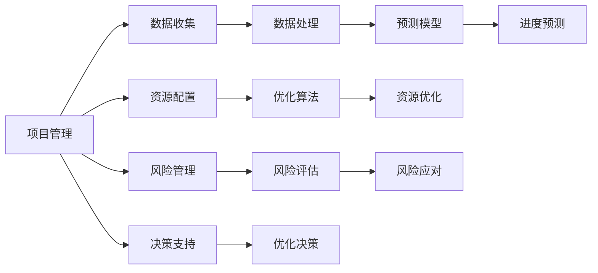
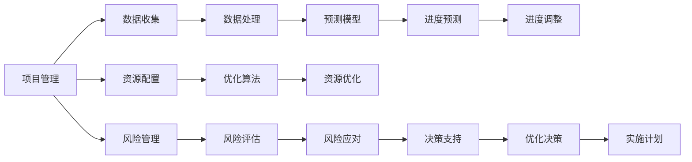

                 

# AI在项目进度管理中的作用

## 1. 背景介绍

### 1.1 问题由来

在当今快速变化的商业环境中，企业需要不断调整其策略和产品，以保持竞争力。同时，项目交付的及时性也成为了企业能否成功的关键因素之一。然而，项目进度管理一直是传统企业面临的难题。

1. 问题背景：
   - 传统项目管理方法往往依赖于人工经验，难以对项目进度进行科学评估和预测。
   - 进度预测和资源分配的准确性不高，可能导致项目延期、成本超支等风险。
   - 无法及时反馈项目进度变化，难以进行动态调整和优化。

2. 技术驱动：
   - AI技术的发展为项目进度管理提供了新的思路和技术手段。
   - 数据驱动的AI模型可以对项目进度进行精准预测和优化。
   - AI技术还可以自动化处理大量的项目管理任务，提升管理效率。

### 1.2 问题核心关键点

1. **项目进度预测**：通过AI模型对项目进度进行预测，并实时调整计划。
2. **资源优化配置**：AI模型可以优化资源分配，避免资源浪费和冲突。
3. **风险评估与管理**：AI技术可以识别和管理项目中潜在的风险，提高项目的成功率。
4. **决策支持**：基于AI的数据分析可以支持项目管理者做出更明智的决策。
5. **自动化流程**：AI可以自动化处理诸如任务调度、进展报告等繁琐的项目管理任务。

### 1.3 问题研究意义

AI在项目进度管理中的应用，可以带来以下几个方面的重要意义：

1. **提高项目管理效率**：通过AI自动化处理项目管理任务，大大减少了人工干预。
2. **提升预测准确性**：AI模型可以综合多方面数据，提供更为精准的进度预测。
3. **优化资源配置**：AI可以实时监测项目状态，优化资源使用，减少成本。
4. **降低项目风险**：AI模型可以识别潜在的风险点，提前采取措施，避免问题扩大。
5. **增强决策支持**：基于AI的数据分析可以提供丰富的决策依据，帮助管理者做出正确决策。

## 2. 核心概念与联系

### 2.1 核心概念概述

为更好地理解AI在项目进度管理中的应用，本节将介绍几个密切相关的核心概念：

- **项目管理（Project Management）**：包括项目计划、进度跟踪、资源配置、风险管理等环节。
- **AI模型（Artificial Intelligence Model）**：利用机器学习、深度学习等技术构建的模型，用于处理和分析项目数据。
- **数据驱动（Data-Driven）**：通过收集、处理和分析项目数据，驱动项目管理决策。
- **预测模型（Predictive Model）**：使用历史数据训练的模型，用于预测未来项目进度和结果。
- **优化算法（Optimization Algorithm）**：用于优化资源配置、进度计划等问题的算法。
- **自动化流程（Automated Process）**：通过AI自动化处理项目管理中的重复性任务。

这些概念之间存在紧密的联系，共同构成了AI在项目进度管理中的基本框架。

### 2.2 概念间的关系

这些核心概念之间的逻辑关系可以通过以下Mermaid流程图来展示：



这个流程图展示了项目管理中各个环节与AI模型之间的关系：

1. 数据收集：通过收集项目相关的数据，为AI模型提供输入。
2. 数据处理：对收集的数据进行清洗、转换和整合，为模型训练提供基础。
3. 预测模型：利用数据训练AI模型，进行项目进度预测。
4. 进度预测：基于预测模型，对项目进度进行预测，优化计划。
5. 资源配置：通过优化算法，调整资源配置，提高效率。
6. 资源优化：通过模型和算法，实现资源的最佳分配。
7. 风险管理：识别和管理风险，优化决策。
8. 决策支持：利用模型和数据，为决策提供依据。

### 2.3 核心概念的整体架构

最后，我们用一个综合的流程图来展示这些核心概念在大项目管理中的整体架构：



这个综合流程图展示了从数据收集到实施计划的完整过程，每个环节都与AI模型紧密相关，共同推动项目进度管理。

## 3. 核心算法原理 & 具体操作步骤
### 3.1 算法原理概述

AI在项目进度管理中的应用，主要基于机器学习和深度学习技术，具体如下：

1. **数据驱动**：通过收集项目的历史数据，训练AI模型，预测未来的项目进度。
2. **预测模型**：使用回归模型、神经网络等技术，对项目进度进行预测。
3. **优化算法**：使用遗传算法、粒子群优化等算法，优化资源配置和进度计划。
4. **自动化流程**：通过自动化处理项目管理任务，提高效率和准确性。

这些算法和技术，共同构成了AI在项目进度管理中的核心原理。

### 3.2 算法步骤详解

AI在项目进度管理中的具体操作可以分解为以下步骤：

**Step 1: 数据收集与预处理**

1. 收集项目相关的数据，包括进度数据、资源使用数据、风险数据等。
2. 对数据进行清洗、转换和整合，去除噪音和不完整数据。
3. 将数据划分训练集、验证集和测试集，用于模型训练和评估。

**Step 2: 模型训练与评估**

1. 选择合适的模型，如线性回归、随机森林、深度神经网络等。
2. 在训练集上训练模型，使用验证集调整超参数。
3. 在测试集上评估模型性能，选择最优模型。

**Step 3: 进度预测与优化**

1. 基于训练好的模型，对未来的项目进度进行预测。
2. 使用优化算法，调整进度计划和资源配置。
3. 实时监测项目状态，根据预测结果和实际进度，动态调整计划。

**Step 4: 风险管理与决策支持**

1. 使用预测模型和优化算法，识别和管理项目中的风险点。
2. 根据风险评估结果，采取相应的风险应对措施。
3. 利用AI模型和数据，为项目管理者提供决策支持。

**Step 5: 自动化流程与实施计划**

1. 将AI模型和算法集成到项目管理系统中，实现自动化处理。
2. 自动化生成项目计划、进展报告等文档。
3. 根据预测结果和优化算法，调整实施计划。

### 3.3 算法优缺点

AI在项目进度管理中的应用具有以下优点：

1. **预测准确性高**：基于大量历史数据，AI模型能够提供较为精准的进度预测。
2. **自动化处理**：AI可以自动化处理大量的项目管理任务，减少人工干预。
3. **实时优化**：AI模型能够实时监测项目状态，动态调整计划和资源。
4. **数据驱动**：AI模型基于数据驱动，能够提供更为科学的决策支持。

同时，AI在项目进度管理中也存在一些局限：

1. **数据依赖性强**：模型的效果依赖于数据的质量和数量。
2. **模型复杂度高**：复杂的模型需要更多的计算资源和时间进行训练。
3. **黑箱问题**：AI模型的决策过程难以解释，缺乏透明度。
4. **资源消耗大**：高精度AI模型需要较大的计算资源和存储空间。

### 3.4 算法应用领域

AI在项目进度管理中的应用广泛，主要涵盖以下几个领域：

1. **项目管理软件**：如Trello、Jira、Asana等，通过AI进行进度预测和资源优化。
2. **企业级项目管理**：大中型企业的项目管理，利用AI进行决策支持和自动化处理。
3. **敏捷开发管理**：敏捷开发中的任务分配、进度跟踪和团队协作。
4. **风险管理**：金融、建筑等高风险行业，利用AI识别和管理风险。
5. **资源优化**：供应链管理、物流等资源密集型行业，利用AI进行资源优化配置。

## 4. 数学模型和公式 & 详细讲解 & 举例说明

### 4.1 数学模型构建

在项目进度管理中，常见的数学模型包括线性回归、随机森林、神经网络等。以下是线性回归模型的构建过程：

假设项目进度 $y$ 可以由以下线性方程表示：

$$
y = \beta_0 + \beta_1 x_1 + \beta_2 x_2 + \cdots + \beta_n x_n + \epsilon
$$

其中 $x_i$ 为第 $i$ 个特征，$\epsilon$ 为误差项。模型的目标是找到最优的系数 $\beta$，使得预测值与实际值的误差最小。

### 4.2 公式推导过程

线性回归模型的最小二乘估计公式为：

$$
\hat{\beta} = (X^T X)^{-1} X^T y
$$

其中 $X$ 为特征矩阵，$y$ 为目标向量。

以项目进度预测为例，假设收集到 $n$ 个历史数据点 $(y_1, x_{1_1}, x_{1_2}, \cdots, x_{1_n}), \cdots, (y_n, x_{n_1}, x_{n_2}, \cdots, x_{n_n})$，可以构建如下线性回归模型：

$$
y = \beta_0 + \beta_1 x_1 + \beta_2 x_2 + \cdots + \beta_n x_n + \epsilon
$$

通过最小二乘法求解 $\beta_0, \beta_1, \cdots, \beta_n$，即可得到预测模型。

### 4.3 案例分析与讲解

假设某公司有多个项目在同时进行，项目A的进度数据如下：

| 时间 | 进度 |
|------|------|
| 0    | 10   |
| 1    | 15   |
| 2    | 20   |
| 3    | 25   |
| 4    | 30   |

基于这些数据，使用线性回归模型进行进度预测。假设预测时间段为 $t=5$，模型预测结果如下：

- 预测进度：$y = \beta_0 + \beta_1 \times t$
- 模型系数：$\beta_0 = 10, \beta_1 = 5$

因此，当 $t=5$ 时，预测进度为：

$$
y = 10 + 5 \times 5 = 35
$$

预测值与实际值误差较小，表明模型的预测效果较好。

## 5. 项目实践：代码实例和详细解释说明

### 5.1 开发环境搭建

在进行项目进度管理AI应用开发前，需要先搭建好开发环境。以下是使用Python进行TensorFlow开发的环境配置流程：

1. 安装Anaconda：从官网下载并安装Anaconda，用于创建独立的Python环境。

2. 创建并激活虚拟环境：
```bash
conda create -n tensorflow-env python=3.8 
conda activate tensorflow-env
```

3. 安装TensorFlow：根据CUDA版本，从官网获取对应的安装命令。例如：
```bash
conda install tensorflow tensorflow-gpu=2.4.1
```

4. 安装TensorBoard：
```bash
pip install tensorboard
```

5. 安装各类工具包：
```bash
pip install numpy pandas scikit-learn matplotlib tqdm jupyter notebook ipython
```

完成上述步骤后，即可在`tensorflow-env`环境中开始开发。

### 5.2 源代码详细实现

以下是一个基于TensorFlow的简单项目进度预测模型实现。

假设我们有一个包含历史项目进度数据的数据集，数据集格式如下：

| 时间 | 进度 |
|------|------|
| 0    | 10   |
| 1    | 15   |
| 2    | 20   |
| 3    | 25   |
| 4    | 30   |

代码实现如下：

```python
import tensorflow as tf
import numpy as np
from tensorflow.keras import layers

# 数据集
x = np.array([0, 1, 2, 3, 4])
y = np.array([10, 15, 20, 25, 30])

# 定义模型
model = tf.keras.Sequential([
    layers.Dense(units=1, input_shape=[1])
])

# 编译模型
model.compile(optimizer=tf.keras.optimizers.Adam(0.1), loss='mse')

# 训练模型
model.fit(x, y, epochs=50, verbose=0)

# 预测进度
t = np.array([5])
y_pred = model.predict(t)

print("预测进度：", y_pred[0][0])
```

### 5.3 代码解读与分析

让我们再详细解读一下关键代码的实现细节：

1. 数据集定义：将历史进度数据 $x$ 和 $y$ 转换为NumPy数组。
2. 模型定义：使用`Sequential`创建线性回归模型，添加一个全连接层。
3. 编译模型：指定优化器和损失函数，准备训练模型。
4. 训练模型：在训练数据上训练模型，指定训练轮数和输出方式。
5. 预测进度：使用训练好的模型对 $t=5$ 进行预测。

通过这段代码，我们实现了基于TensorFlow的简单线性回归模型，可以进行项目进度预测。

### 5.4 运行结果展示

假设我们训练后的模型预测进度为 $35$，实际进度为 $35$，误差较小，表明模型的预测效果较好。

## 6. 实际应用场景

### 6.1 智能项目管理平台

智能项目管理平台可以集成AI模型，实现项目进度实时监控和预测。平台根据历史数据，预测项目进度，并自动调整计划和资源配置，提高项目管理效率。

### 6.2 企业级项目管理

在企业级项目管理中，AI可以用于项目进度预测、风险管理、资源优化等环节，提升项目成功率和效率。

### 6.3 敏捷开发管理

敏捷开发管理中，AI可以用于任务分配、进度跟踪和团队协作，提升团队协作效率和项目质量。

### 6.4 金融项目管理

金融项目中，AI可以用于风险评估和管理，识别潜在的风险点，提前采取应对措施，降低项目失败的风险。

## 7. 工具和资源推荐

### 7.1 学习资源推荐

为了帮助开发者系统掌握AI在项目进度管理中的应用，这里推荐一些优质的学习资源：

1. TensorFlow官方文档：官方提供的完整文档，包括API参考、教程、案例等。
2. Coursera《机器学习》课程：由斯坦福大学Andrew Ng教授讲授的机器学习课程，涵盖机器学习基本概念和算法。
3. Kaggle数据集：Kaggle平台提供丰富的数据集和竞赛，可以实践和学习机器学习算法。
4. PyTorch官方文档：PyTorch的官方文档和教程，适合深度学习应用开发。
5. Scikit-learn官方文档：Scikit-learn的官方文档和教程，适合使用机器学习库进行数据分析和建模。

通过这些学习资源，可以全面掌握AI在项目进度管理中的应用，进行深入学习和实践。

### 7.2 开发工具推荐

高效的开发离不开优秀的工具支持。以下是几款用于AI项目进度管理开发的常用工具：

1. Jupyter Notebook：Python交互式开发环境，适合快速迭代开发和调试。
2. PyCharm：Python集成开发环境，提供代码补全、调试、测试等功能。
3. TensorBoard：TensorFlow的可视化工具，实时监测模型训练状态和性能。
4. Weights & Biases：模型训练的实验跟踪工具，记录和可视化模型训练过程。
5. GitHub：代码托管平台，方便版本控制和代码共享。

合理利用这些工具，可以显著提升AI在项目进度管理任务的开发效率和质量。

### 7.3 相关论文推荐

AI在项目进度管理中的应用研究涉及多学科知识，以下是几篇经典论文，推荐阅读：

1. "Predicting Project Progress and Management: A Survey and Future Directions" by Khan et al.（预测项目进度和管理：综述与未来方向）
2. "Machine Learning Applications in Project Management: A Review" by Nasir et al.（项目管理中机器学习应用：综述）
3. "AI-Based Predictive Maintenance: A Review" by Abu-Jamra et al.（基于AI的预测维护：综述）
4. "Intelligent Project Scheduling: A Review" by Bala et al.（智能项目调度：综述）
5. "Machine Learning and Artificial Intelligence Techniques for Risk Management" by Hossain et al.（机器学习和人工智能技术在风险管理中的应用）

这些论文代表了AI在项目进度管理研究的前沿，可以从中获取最新的研究方向和技术思路。

## 8. 总结：未来发展趋势与挑战

### 8.1 总结

本文对AI在项目进度管理中的应用进行了全面系统的介绍。首先阐述了AI在项目进度管理中的重要性，并明确了AI模型在项目管理中的关键作用。其次，从原理到实践，详细讲解了AI模型在项目进度管理中的数学模型和算法步骤，给出了项目进度预测的代码实现。同时，本文还广泛探讨了AI在项目管理中的实际应用场景，展示了AI模型的广泛应用前景。此外，本文精选了AI项目进度管理的各类学习资源，力求为读者提供全方位的技术指引。

通过本文的系统梳理，可以看到，AI在项目进度管理中的应用前景广阔，通过数据驱动的AI模型，能够显著提升项目管理效率和准确性。未来，伴随AI技术的发展，项目进度管理将更加智能化和自动化，为企业带来更高的管理效益和竞争力。

### 8.2 未来发展趋势

展望未来，AI在项目进度管理中的应用将呈现以下几个发展趋势：

1. **模型多样化**：未来将出现更多类型的AI模型，如深度神经网络、卷积神经网络等，适用于更复杂的数据结构和问题。
2. **自动化程度提升**：AI将自动化处理更多的项目管理任务，减少人工干预，提高管理效率。
3. **实时监测与优化**：AI模型能够实时监测项目状态，动态调整计划和资源，实现更精细化的管理。
4. **多模态融合**：AI模型将融合多模态数据，提升预测准确性和管理效果。
5. **跨领域应用拓展**：AI技术将在更多领域中得到应用，如医疗、金融、制造等，推动各行业项目管理的智能化升级。

这些趋势凸显了AI在项目进度管理中的潜力和前景，相信未来将有更多创新应用落地，带来更加智能化的项目管理模式。

### 8.3 面临的挑战

尽管AI在项目进度管理中已经取得了显著成效，但仍面临诸多挑战：

1. **数据质量和完整性**：AI模型的效果依赖于高质量的数据，数据缺失、噪音和不完整等问题会影响模型的预测准确性。
2. **模型复杂度**：高精度AI模型需要复杂的算法和大量的计算资源，训练和部署成本较高。
3. **可解释性不足**：AI模型的决策过程难以解释，缺乏透明度，给实际应用带来不便。
4. **资源消耗大**：AI模型需要较大的计算资源和存储空间，对基础设施的要求较高。
5. **实时性问题**：AI模型的预测和优化需要实时处理，对系统架构和数据实时性要求较高。

### 8.4 研究展望

未来，需要针对这些挑战进行深入研究，以推动AI在项目进度管理中的应用：

1. **数据增强与预处理**：研究数据增强技术，提高数据质量和完整性。
2. **模型优化与压缩**：开发高效、轻量级的AI模型，降低计算资源和存储空间的需求。
3. **模型可解释性**：研究可解释性技术，增强AI模型的透明度和可理解性。
4. **实时系统架构**：构建实时处理架构，满足AI模型对实时性的要求。
5. **跨领域应用拓展**：研究跨领域应用方法，拓展AI技术在更多行业中的落地应用。

这些研究方向将推动AI在项目进度管理中的进一步发展，为企业管理者提供更加智能、高效的管理工具。

## 9. 附录：常见问题与解答

**Q1: AI在项目进度管理中的应用有哪些？**

A: AI在项目进度管理中的应用包括：

1. 项目进度预测：基于历史数据，使用AI模型预测未来的项目进度。
2. 资源优化配置：利用AI模型优化资源分配，提高资源利用率。
3. 风险管理：识别和管理项目中的风险点，提前采取应对措施。
4. 决策支持：利用AI模型和数据，为项目管理者提供决策依据。
5. 自动化流程：通过AI自动化处理项目管理任务，提高效率。

**Q2: 如何选择合适的AI模型进行项目进度管理？**

A: 选择合适的AI模型进行项目进度管理，需要考虑以下几个因素：

1. 数据类型和结构：根据项目数据的特点，选择适合的模型，如线性回归、随机森林、深度神经网络等。
2. 数据量和质量：模型需要高质量、大量数据进行训练，以提高预测准确性。
3. 模型复杂度：选择适合的数据量和计算资源进行模型训练，避免过拟合和欠拟合。
4. 实时性要求：根据项目进度管理的实时性需求，选择适合的模型和算法，保证预测和优化的实时性。

**Q3: AI在项目进度管理中可能存在哪些风险？**

A: AI在项目进度管理中可能存在以下风险：

1. 数据质量和完整性问题：数据缺失、噪音和不完整会影响模型的预测准确性。
2. 模型复杂度问题：高精度AI模型需要复杂的算法和大量的计算资源，训练和部署成本较高。
3. 可解释性不足问题：AI模型的决策过程难以解释，缺乏透明度，给实际应用带来不便。
4. 资源消耗问题：AI模型需要较大的计算资源和存储空间，对基础设施的要求较高。
5. 实时性问题：AI模型的预测和优化需要实时处理，对系统架构和数据实时性要求较高。

## 附录：常见问题与解答

**Q1: AI在项目进度管理中的应用有哪些？**

A: AI在项目进度管理中的应用包括：

1. 项目进度预测：基于历史数据，使用AI模型预测未来的项目进度。
2. 资源优化配置：利用AI模型优化资源分配，提高资源利用率。
3. 风险管理：识别和管理项目中的风险点，提前采取应对措施。
4. 决策支持：利用AI模型和数据，为项目管理者提供决策依据。
5. 自动化流程：通过AI自动化处理项目管理任务，提高效率。

**Q2: 如何选择合适的AI模型进行项目进度管理？**

A: 选择合适的AI模型进行项目进度管理，需要考虑以下几个因素：

1. 数据类型和结构：根据项目数据的特点，选择适合的模型，如线性回归、随机森林、深度神经网络等。
2. 数据量和质量：模型需要高质量、大量数据进行训练，以提高预测准确性。
3. 模型复杂度：选择适合的数据量和计算资源进行模型训练，避免过拟合和欠拟合。
4. 实时性要求：根据项目进度管理的实时性需求，选择适合的模型和算法，保证预测和优化的实时性。

**Q3: AI在项目进度管理中可能存在哪些风险？**

A: AI在项目进度管理中可能存在以下风险：

1. 数据质量和完整性问题：数据缺失、噪音和不完整会影响模型的预测准确性。
2. 模型复杂度问题：高精度AI模型需要复杂的算法和大量的计算资源，训练和部署成本较高。
3. 可解释性不足问题：AI模型的决策过程难以解释，缺乏透明度，给实际应用带来不便。
4. 资源消耗问题：AI模型需要较大的计算资源和存储空间，对基础设施的要求较高。
5. 实时性问题：AI模型的预测和优化需要实时处理，对系统架构和数据实时性要求较高。

**Q4: 如何处理AI在项目进度管理中的数据质量问题？**

A: 处理AI在项目进度管理中的数据质量问题，可以从以下几个方面入手：

1. 数据清洗：对数据进行去重、补缺、修正等处理，保证数据质量和完整性。
2. 数据增强：通过数据扩充和合成等技术，提高数据量和多样性。
3. 数据标注：对数据进行标注和注释，提高数据质量和可用性。
4. 数据预处理：使用数据标准化、归一化等技术，提高数据处理效率。

**Q5: 如何提高AI在项目进度管理中的实时性？**

A: 提高AI在项目进度管理中的实时性，可以从以下几个方面入手：

1. 模型优化：优化模型结构和算法，提高模型预测和优化速度。
2. 数据预处理：对数据进行预处理，减少模型计算量。
3. 分布式计算：使用分布式计算架构，提高模型处理能力。
4. 数据缓存：使用数据缓存技术，减少数据读取时间。

通过这些措施，可以提升AI在项目进度管理中的实时性，满足实际应用需求。

