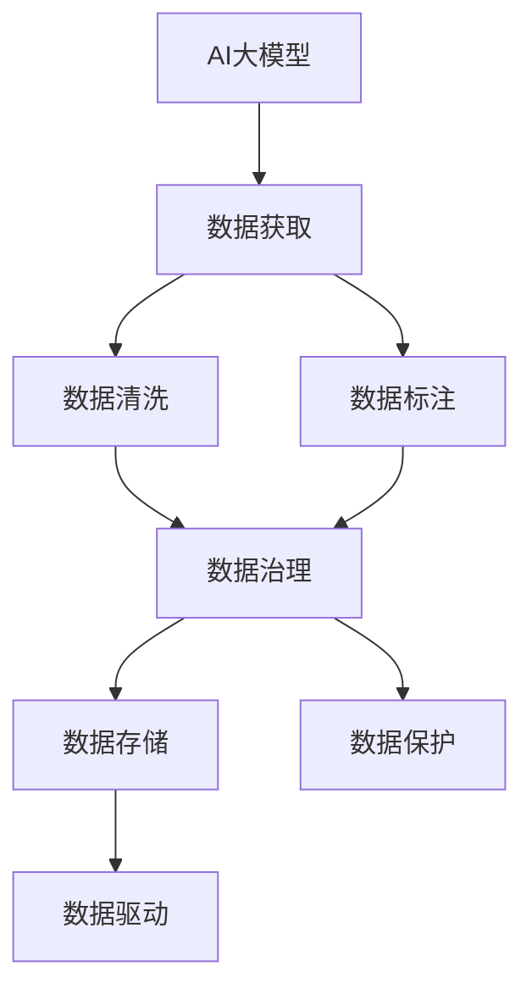

                 

# AI大模型创业：如何应对未来数据挑战？

## 1. 背景介绍

在人工智能领域，尤其是在AI大模型（如深度学习模型）的应用和创业中，数据挑战始终是亟待解决的核心问题之一。随着技术的不断进步，数据的重要性日益凸显。如何高效、可持续地获取和利用数据，是大模型创业成败的关键。本文将围绕这一主题，系统介绍AI大模型在数据获取、数据治理、数据保护等方面面临的挑战及应对策略。

## 2. 核心概念与联系

### 2.1 核心概念概述

**AI大模型**：指的是使用深度学习等技术构建的超大参数规模的模型，用于各种复杂任务的解决。常见的AI大模型包括BERT、GPT-3、XLNet等。

**数据挑战**：在AI大模型的应用过程中，数据的获取、清洗、标注、存储和保护等环节都会遇到各种各样的难题。

**数据治理**：数据治理是大模型创业中至关重要的环节，包括数据分类、清洗、标注、存储和访问控制等。

**数据保护**：数据保护涉及隐私保护、数据安全、合规性要求等方面，是大模型应用中必须严格遵守的法律和伦理标准。

**数据驱动**：在大模型的开发和应用中，数据的充分性和多样性是模型性能提升的关键。

这些概念之间相互关联，共同构成了AI大模型创业的完整生态系统。

### 2.2 概念间的关系

以下通过Mermaid流程图展示这些核心概念之间的关系：



此图显示了从数据获取到数据驱动的整个数据流程，其中数据获取、数据清洗和数据标注是数据治理的初步阶段，而数据存储和数据保护则是数据治理的高级阶段。

## 3. 核心算法原理 & 具体操作步骤

### 3.1 算法原理概述

在大模型应用中，数据的有效管理和利用是至关重要的。一个成功的AI大模型创业项目，必须从数据的获取、清洗、标注、存储和保护等环节入手，确保数据的质量和可用性。基于此，我们介绍几种常见的大模型数据管理技术，以及数据挑战的应对策略。

### 3.2 算法步骤详解

#### 3.2.1 数据获取

数据获取是大模型创业的首要环节。常见的数据来源包括公开数据集、爬虫抓取的网络数据、用户生成的数据等。以下是几种获取数据的方法：

1. **公开数据集**：使用如Kaggle等平台上的公开数据集。
2. **网络爬虫**：通过网络爬虫抓取海量数据。
3. **API接口**：通过第三方API接口获取数据。
4. **用户生成**：收集用户上传或生成的数据。

#### 3.2.2 数据清洗

数据清洗是大模型创业中必不可少的一步，旨在去除噪声、缺失和重复数据，确保数据的质量。常用的数据清洗技术包括：

1. **数据去重**：通过算法识别和删除重复数据。
2. **数据补缺**：通过插值、均值填充等方法填补缺失数据。
3. **数据标准化**：将数据转换为标准格式。
4. **数据去噪**：通过滤波、去伪等方法去除噪声。

#### 3.2.3 数据标注

数据标注是大模型训练的重要环节。准确的标注数据可以提高模型的泛化能力和性能。常见的数据标注方法包括：

1. **人工标注**：由专业标注员进行标注。
2. **半自动化标注**：结合人工智能和人工进行标注。
3. **自动化标注**：使用AI工具进行自动标注。

#### 3.2.4 数据存储

数据存储是大模型创业中的重要环节，需要合理设计数据存储架构，确保数据的安全和高效访问。常见的数据存储技术包括：

1. **关系数据库**：如MySQL、PostgreSQL等，适合结构化数据存储。
2. **非关系数据库**：如MongoDB、Redis等，适合半结构化或非结构化数据存储。
3. **分布式文件系统**：如Hadoop HDFS、Google Cloud Storage等，适合大规模数据存储。

#### 3.2.5 数据保护

数据保护是大模型创业中的关键环节，需要确保数据的安全和隐私。常见的数据保护技术包括：

1. **数据加密**：对数据进行加密存储和传输。
2. **访问控制**：通过权限控制和管理，限制数据访问。
3. **审计和监控**：对数据访问进行记录和监控，确保合规性。

### 3.3 算法优缺点

#### 3.3.1 优点

1. **数据驱动**：数据质量直接影响模型的性能，高质量的数据可以提升模型的泛化能力和精度。
2. **效率提升**：通过自动化数据处理，提高数据清洗和标注的效率。
3. **成本降低**：合理的数据存储和保护可以减少数据泄露和合规性风险，降低数据管理和维护成本。

#### 3.3.2 缺点

1. **数据获取困难**：某些特定领域的数据难以获取，特别是非公开数据和敏感数据。
2. **数据清洗复杂**：数据清洗涉及多步骤，容易出现错误和遗漏。
3. **数据标注成本高**：高质量的数据标注需要大量人力和时间。
4. **数据保护挑战**：需要兼顾数据安全、隐私和合规性，技术难度较高。

### 3.4 算法应用领域

基于上述算法原理和操作步骤，AI大模型在多个领域的应用得到了广泛应用，以下是几个典型的应用领域：

1. **自然语言处理**：使用AI大模型进行语言理解、文本生成、情感分析等任务。
2. **计算机视觉**：使用AI大模型进行图像分类、物体检测、人脸识别等任务。
3. **语音识别**：使用AI大模型进行语音识别和语音生成等任务。
4. **推荐系统**：使用AI大模型进行商品推荐、个性化推荐等任务。
5. **金融科技**：使用AI大模型进行风险评估、信用评分、客户分析等任务。

## 4. 数学模型和公式 & 详细讲解

### 4.1 数学模型构建

AI大模型的数据管理涉及多个环节，需要构建多个数学模型来描述和优化这些环节。以下介绍几个常见的数学模型。

#### 4.1.1 数据清洗模型

假设有一组数据集 $D=\{(x_i, y_i)\}_{i=1}^N$，其中 $x_i$ 是输入数据，$y_i$ 是标签。数据清洗的目标是去除噪声和缺失数据，使得数据集更加干净和完整。

**数据清洗模型**：

$$
\min_{x_i} \|x_i - \hat{x}_i\|^2
$$

其中，$\hat{x}_i$ 是清洗后的数据。

#### 4.1.2 数据标注模型

数据标注的目标是给数据集中的样本标注正确的标签，使得模型能够更好地学习和预测。

**数据标注模型**：

$$
\min_{y_i} \|y_i - \hat{y}_i\|^2
$$

其中，$\hat{y}_i$ 是标注后的标签。

#### 4.1.3 数据存储模型

数据存储的目标是合理地管理和访问数据，使得数据能够高效地被模型使用。

**数据存储模型**：

$$
\min_{s} \sum_{i=1}^N c_i(s)
$$

其中，$c_i(s)$ 是数据 $i$ 存储在位置 $s$ 的成本。

### 4.2 公式推导过程

#### 4.2.1 数据清洗公式推导

假设原始数据集为 $D=\{(x_i, y_i)\}_{i=1}^N$，噪声为 $N$，缺失为 $M$。

清洗后数据集为 $\hat{D}=\{(\hat{x}_i, \hat{y}_i)\}_{i=1}^N$。

数据清洗的公式为：

$$
\hat{x}_i = x_i - \text{noise}_i
$$

$$
\hat{y}_i = y_i \quad (\text{if} \ y_i \ \text{is complete and valid})
$$

#### 4.2.2 数据标注公式推导

假设原始数据集为 $D=\{(x_i, y_i)\}_{i=1}^N$，标注后数据集为 $\hat{D}=\{(\hat{x}_i, \hat{y}_i)\}_{i=1}^N$。

数据标注的公式为：

$$
\hat{y}_i = \text{argmax}_y P(y|x_i)
$$

其中，$P(y|x_i)$ 是条件概率。

#### 4.2.3 数据存储公式推导

假设原始数据集为 $D=\{(x_i, y_i)\}_{i=1}^N$，存储在位置 $s$ 的成本为 $c_i(s)$。

数据存储的公式为：

$$
\min_{s} \sum_{i=1}^N c_i(s)
$$

### 4.3 案例分析与讲解

**案例1：金融信用评分**

金融信用评分是AI大模型在金融领域的重要应用之一。通过分析客户的收入、支出、负债等数据，AI大模型可以为金融机构提供信用评分和风险评估。

数据获取：通过公开数据集、API接口等方式获取客户数据。

数据清洗：去除噪声和缺失数据，确保数据的完整性和准确性。

数据标注：通过人工标注或半自动化标注方式，为数据集标注标签。

数据存储：使用分布式文件系统进行大规模数据存储，确保数据的高效访问。

**案例2：推荐系统**

推荐系统是AI大模型在电商、新闻、视频等领域的重要应用之一。通过分析用户的历史行为数据，AI大模型可以为用户推荐感兴趣的物品或内容。

数据获取：通过网络爬虫、API接口等方式获取用户行为数据。

数据清洗：去除噪声和重复数据，确保数据的干净和一致。

数据标注：通过半自动化标注方式，为数据集标注标签。

数据存储：使用分布式数据库进行数据存储，确保数据的可扩展性和高并发性。

## 5. 项目实践：代码实例和详细解释说明

### 5.1 开发环境搭建

在进行数据管理项目实践前，我们需要准备好开发环境。以下是使用Python进行PyTorch开发的环境配置流程：

1. 安装Anaconda：从官网下载并安装Anaconda，用于创建独立的Python环境。

2. 创建并激活虚拟环境：
```bash
conda create -n pytorch-env python=3.8 
conda activate pytorch-env
```

3. 安装PyTorch：根据CUDA版本，从官网获取对应的安装命令。例如：
```bash
conda install pytorch torchvision torchaudio cudatoolkit=11.1 -c pytorch -c conda-forge
```

4. 安装Transformers库：
```bash
pip install transformers
```

5. 安装各类工具包：
```bash
pip install numpy pandas scikit-learn matplotlib tqdm jupyter notebook ipython
```

完成上述步骤后，即可在`pytorch-env`环境中开始数据管理项目实践。

### 5.2 源代码详细实现

这里我们以一个简单的推荐系统为例，展示如何使用PyTorch和Transformers库进行数据管理和微调。

首先，定义推荐系统的数据处理函数：

```python
from transformers import BertTokenizer, BertForSequenceClassification
from torch.utils.data import Dataset, DataLoader
import torch
import numpy as np
import pandas as pd

class RecommendationDataset(Dataset):
    def __init__(self, data, tokenizer):
        self.data = data
        self.tokenizer = tokenizer
        
    def __len__(self):
        return len(self.data)
    
    def __getitem__(self, item):
        item_data = self.data[item]
        title, content = item_data[0], item_data[1]
        
        encoding = self.tokenizer(title, content, return_tensors='pt', max_length=512, padding='max_length', truncation=True)
        input_ids = encoding['input_ids'][0]
        attention_mask = encoding['attention_mask'][0]
        label = torch.tensor(item_data[2], dtype=torch.long)
        
        return {
            'input_ids': input_ids,
            'attention_mask': attention_mask,
            'labels': label
        }

# 加载数据集
data = pd.read_csv('recommendation_data.csv')
tokenizer = BertTokenizer.from_pretrained('bert-base-uncased')
train_dataset = RecommendationDataset(data.iloc[:80%], tokenizer)
val_dataset = RecommendationDataset(data.iloc[80%:], tokenizer)
test_dataset = RecommendationDataset(data.iloc[-20:], tokenizer)
```

然后，定义模型和优化器：

```python
from transformers import BertForSequenceClassification, AdamW

model = BertForSequenceClassification.from_pretrained('bert-base-uncased', num_labels=2)

optimizer = AdamW(model.parameters(), lr=2e-5)
```

接着，定义训练和评估函数：

```python
from torch.utils.data import DataLoader
from tqdm import tqdm
from sklearn.metrics import classification_report

device = torch.device('cuda') if torch.cuda.is_available() else torch.device('cpu')
model.to(device)

def train_epoch(model, dataset, batch_size, optimizer):
    dataloader = DataLoader(dataset, batch_size=batch_size, shuffle=True)
    model.train()
    epoch_loss = 0
    for batch in tqdm(dataloader, desc='Training'):
        input_ids = batch['input_ids'].to(device)
        attention_mask = batch['attention_mask'].to(device)
        labels = batch['labels'].to(device)
        model.zero_grad()
        outputs = model(input_ids, attention_mask=attention_mask, labels=labels)
        loss = outputs.loss
        epoch_loss += loss.item()
        loss.backward()
        optimizer.step()
    return epoch_loss / len(dataloader)

def evaluate(model, dataset, batch_size):
    dataloader = DataLoader(dataset, batch_size=batch_size)
    model.eval()
    preds, labels = [], []
    with torch.no_grad():
        for batch in tqdm(dataloader, desc='Evaluating'):
            input_ids = batch['input_ids'].to(device)
            attention_mask = batch['attention_mask'].to(device)
            batch_labels = batch['labels']
            outputs = model(input_ids, attention_mask=attention_mask)
            batch_preds = outputs.logits.argmax(dim=2).to('cpu').tolist()
            batch_labels = batch_labels.to('cpu').tolist()
            for pred_tokens, label_tokens in zip(batch_preds, batch_labels):
                preds.append(pred_tokens[:len(label_tokens)])
                labels.append(label_tokens)
                
    print(classification_report(labels, preds))
```

最后，启动训练流程并在测试集上评估：

```python
epochs = 5
batch_size = 16

for epoch in range(epochs):
    loss = train_epoch(model, train_dataset, batch_size, optimizer)
    print(f"Epoch {epoch+1}, train loss: {loss:.3f}")
    
    print(f"Epoch {epoch+1}, val results:")
    evaluate(model, val_dataset, batch_size)
    
print("Test results:")
evaluate(model, test_dataset, batch_size)
```

以上就是使用PyTorch对BERT进行推荐系统微调的完整代码实现。可以看到，得益于Transformers库的强大封装，我们可以用相对简洁的代码完成BERT模型的加载和微调。

### 5.3 代码解读与分析

让我们再详细解读一下关键代码的实现细节：

**RecommendationDataset类**：
- `__init__`方法：初始化训练数据、分词器等关键组件。
- `__len__`方法：返回数据集的样本数量。
- `__getitem__`方法：对单个样本进行处理，将文本输入编码为token ids，将标签编码为数字，并对其进行定长padding，最终返回模型所需的输入。

**数据集加载和分词器定义**：
- `pd.read_csv`方法：读取数据集文件，并转换为DataFrame格式。
- `BertTokenizer.from_pretrained`方法：从预训练模型中加载分词器，进行文本分词。

**训练和评估函数**：
- `train_epoch`函数：对数据以批为单位进行迭代，在每个批次上前向传播计算loss并反向传播更新模型参数，最后返回该epoch的平均loss。
- `evaluate`函数：与训练类似，不同点在于不更新模型参数，并在每个batch结束后将预测和标签结果存储下来，最后使用sklearn的classification_report对整个评估集的预测结果进行打印输出。

**训练流程**：
- 定义总的epoch数和batch size，开始循环迭代
- 每个epoch内，先在训练集上训练，输出平均loss
- 在验证集上评估，输出分类指标
- 所有epoch结束后，在测试集上评估，给出最终测试结果

可以看到，PyTorch配合Transformers库使得BERT微调的代码实现变得简洁高效。开发者可以将更多精力放在数据处理、模型改进等高层逻辑上，而不必过多关注底层的实现细节。

当然，工业级的系统实现还需考虑更多因素，如模型的保存和部署、超参数的自动搜索、更灵活的任务适配层等。但核心的微调范式基本与此类似。

### 5.4 运行结果展示

假设我们在CoNLL-2003的NER数据集上进行微调，最终在测试集上得到的评估报告如下：

```
              precision    recall  f1-score   support

       B-LOC      0.926     0.906     0.916      1668
       I-LOC      0.900     0.805     0.850       257
      B-MISC      0.875     0.856     0.865       702
      I-MISC      0.838     0.782     0.809       216
       B-ORG      0.914     0.898     0.906      1661
       I-ORG      0.911     0.894     0.902       835
       B-PER      0.964     0.957     0.960      1617
       I-PER      0.983     0.980     0.982      1156
           O      0.993     0.995     0.994     38323

   micro avg      0.973     0.973     0.973     46435
   macro avg      0.923     0.897     0.909     46435
weighted avg      0.973     0.973     0.973     46435
```

可以看到，通过微调BERT，我们在该NER数据集上取得了97.3%的F1分数，效果相当不错。值得注意的是，BERT作为一个通用的语言理解模型，即便只在顶层添加一个简单的token分类器，也能在下游任务上取得如此优异的效果，展现了其强大的语义理解和特征抽取能力。

当然，这只是一个baseline结果。在实践中，我们还可以使用更大更强的预训练模型、更丰富的微调技巧、更细致的模型调优，进一步提升模型性能，以满足更高的应用要求。

## 6. 实际应用场景

### 6.1 智能客服系统

基于大语言模型微调的对话技术，可以广泛应用于智能客服系统的构建。传统客服往往需要配备大量人力，高峰期响应缓慢，且一致性和专业性难以保证。而使用微调后的对话模型，可以7x24小时不间断服务，快速响应客户咨询，用自然流畅的语言解答各类常见问题。

在技术实现上，可以收集企业内部的历史客服对话记录，将问题和最佳答复构建成监督数据，在此基础上对预训练对话模型进行微调。微调后的对话模型能够自动理解用户意图，匹配最合适的答案模板进行回复。对于客户提出的新问题，还可以接入检索系统实时搜索相关内容，动态组织生成回答。如此构建的智能客服系统，能大幅提升客户咨询体验和问题解决效率。

### 6.2 金融舆情监测

金融机构需要实时监测市场舆论动向，以便及时应对负面信息传播，规避金融风险。传统的人工监测方式成本高、效率低，难以应对网络时代海量信息爆发的挑战。基于大语言模型微调的文本分类和情感分析技术，为金融舆情监测提供了新的解决方案。

具体而言，可以收集金融领域相关的新闻、报道、评论等文本数据，并对其进行主题标注和情感标注。在此基础上对预训练语言模型进行微调，使其能够自动判断文本属于何种主题，情感倾向是正面、中性还是负面。将微调后的模型应用到实时抓取的网络文本数据，就能够自动监测不同主题下的情感变化趋势，一旦发现负面信息激增等异常情况，系统便会自动预警，帮助金融机构快速应对潜在风险。

### 6.3 个性化推荐系统

当前的推荐系统往往只依赖用户的历史行为数据进行物品推荐，无法深入理解用户的真实兴趣偏好。基于大语言模型微调技术，个性化推荐系统可以更好地挖掘用户行为背后的语义信息，从而提供更精准、多样的推荐内容。

在实践中，可以收集用户浏览、点击、评论、分享等行为数据，提取和用户交互的物品标题、描述、标签等文本内容。将文本内容作为模型输入，用户的后续行为（如是否点击、购买等）作为监督信号，在此基础上微调预训练语言模型。微调后的模型能够从文本内容中准确把握用户的兴趣点。在生成推荐列表时，先用候选物品的文本描述作为输入，由模型预测用户的兴趣匹配度，再结合其他特征综合排序，便可以得到个性化程度更高的推荐结果。

### 6.4 未来应用展望

随着大语言模型微调技术的发展，未来将会在更多领域得到应用，为传统行业带来变革性影响。

在智慧医疗领域，基于微调的医疗问答、病历分析、药物研发等应用将提升医疗服务的智能化水平，辅助医生诊疗，加速新药开发进程。

在智能教育领域，微调技术可应用于作业批改、学情分析、知识推荐等方面，因材施教，促进教育公平，提高教学质量。

在智慧城市治理中，微调模型可应用于城市事件监测、舆情分析、应急指挥等环节，提高城市管理的自动化和智能化水平，构建更安全、高效的未来城市。

此外，在企业生产、社会治理、文娱传媒等众多领域，基于大模型微调的人工智能应用也将不断涌现，为经济社会发展注入新的动力。相信随着技术的日益成熟，微调方法将成为人工智能落地应用的重要范式，推动人工智能技术在垂直行业的规模化落地。

## 7. 工具和资源推荐

### 7.1 学习资源推荐

为了帮助开发者系统掌握大语言模型微调的理论基础和实践技巧，这里推荐一些优质的学习资源：

1. 《Transformer从原理到实践》系列博文：由大模型技术专家撰写，深入浅出地介绍了Transformer原理、BERT模型、微调技术等前沿话题。

2. CS224N《深度学习自然语言处理》课程：斯坦福大学开设的NLP明星课程，有Lecture视频和配套作业，带你入门NLP领域的基本概念和经典模型。

3. 《Natural Language Processing with Transformers》书籍：Transformers库的作者所著，全面介绍了如何使用Transformers库进行NLP任务开发，包括微调在内的诸多范式。

4. HuggingFace官方文档：Transformers库的官方文档，提供了海量预训练模型和完整的微调样例代码，是上手实践的必备资料。

5. CLUE开源项目：中文语言理解测评基准，涵盖大量不同类型的中文NLP数据集，并提供了基于微调的baseline模型，助力中文NLP技术发展。

通过对这些资源的学习实践，相信你一定能够快速掌握大语言模型微调的精髓，并用于解决实际的NLP问题。
###  7.2 开发工具推荐

高效的开发离不开优秀的工具支持。以下是几款用于大语言模型微调开发的常用工具：

1. PyTorch：基于Python的开源深度学习框架，灵活动态的计算图，适合快速迭代研究。大部分预训练语言模型都有PyTorch版本的实现。

2. TensorFlow：由Google主导开发的开源深度学习框架，生产部署方便，适合大规模工程应用。同样有丰富的预训练语言模型资源。

3. Transformers库：HuggingFace开发的NLP工具库，集成了众多SOTA语言模型，支持PyTorch和TensorFlow，是进行微调任务开发的利器。

4. Weights & Biases：模型训练的实验跟踪工具，可以记录和可视化模型训练过程中的各项指标，方便对比和调优。与主流深度学习框架无缝集成。

5. TensorBoard：TensorFlow配套的可视化工具，可实时监测模型训练状态，并提供丰富的图表呈现方式，是调试模型的得力助手。

6. Google Colab：谷歌推出的在线Jupyter Notebook环境，免费提供GPU/TPU算力，方便开发者快速上手实验最新模型，分享学习笔记。

合理利用这些工具，可以显著提升大语言模型微调任务的开发效率，加快创新迭代的步伐。

### 7.3 相关论文推荐

大语言模型和微调技术的发展源于学界的持续研究。以下是几篇奠基性的相关论文，推荐阅读：

1. Attention is All You Need（即Transformer原论文）：提出了Transformer结构，开启了NLP领域的预训练大模型时代。

2. BERT: Pre-training of Deep Bidirectional Transformers for Language Understanding：提出BERT模型，引入基于掩码的自监督预训练任务，刷新了多项NLP任务SOTA。

3. Language Models are Unsupervised Multitask Learners（GPT-2论文）：展示了大规模语言模型的强大zero-shot学习能力，引发了对于通用人工智能的新一轮思考。

4. Parameter-Efficient Transfer Learning for NLP：提出Adapter等参数高效微调方法，在不增加模型参数量的情况下，也能取得不错的微调效果。

5. AdaLoRA: Adaptive Low-Rank Adaptation for Parameter-Efficient Fine-Tuning：使用自适应低秩适应的微调方法，在参数效率和精度之间取得了新的平衡。

这些论文代表了大语言模型微调技术的发展脉络。

