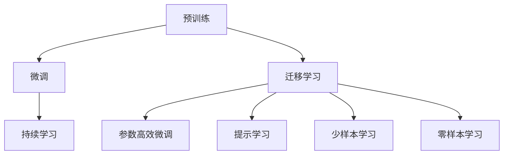
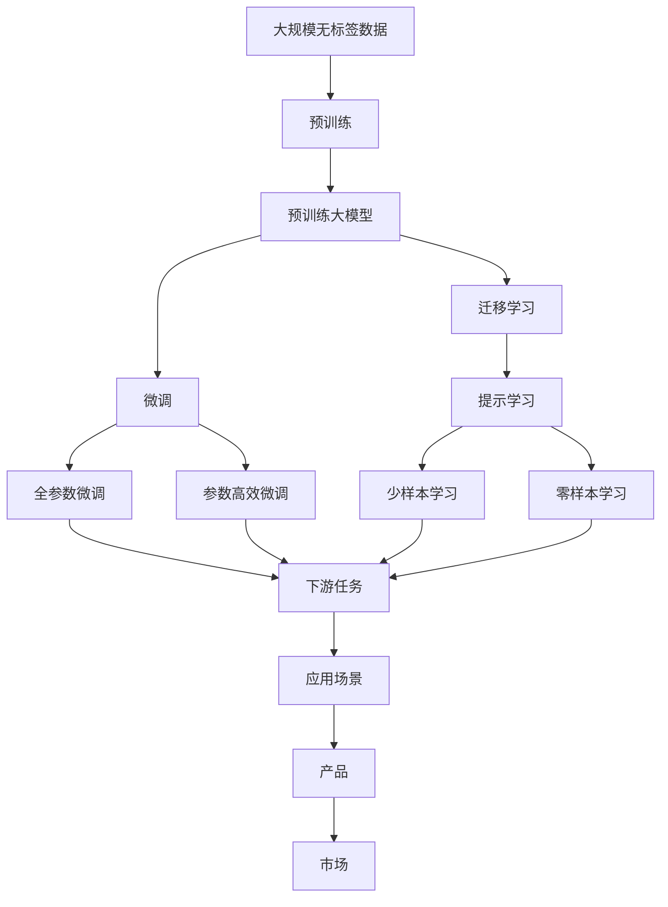

                 

# AI大模型创业：如何应对未来行业发展趋势？

## 1. 背景介绍

近年来，人工智能(AI)大模型的发展引起了全球范围内的广泛关注。从AlphaGo的横空出世，到GPT-3的惊艳亮相，大模型在自然语言处理(NLP)、计算机视觉(CV)、生成对抗网络(GAN)等领域取得了突破性进展。大模型的强大能力推动了AI技术的快速发展，同时也为创业公司提供了新的机遇。本文旨在探讨AI大模型创业如何应对未来的行业发展趋势。

## 2. 核心概念与联系

### 2.1 核心概念概述

AI大模型通常指那些通过大规模数据训练得到的深度神经网络模型，它们在特定任务上展现出了前所未有的性能。核心概念包括：

- **预训练(Pre-training)**：在大规模无标签数据上进行的自监督学习，使模型学习到通用的语言表示。
- **微调(Fine-tuning)**：在特定任务上对预训练模型进行有监督学习，进一步提升模型性能。
- **迁移学习(Transfer Learning)**：将从一个大任务中学到的知识迁移到另一个相关任务中。
- **参数高效微调(Parameter-Efficient Fine-Tuning, PEFT)**：只更新少量模型参数，避免过拟合，提高效率。
- **提示学习(Prompt Learning)**：通过精心设计的输入模板引导模型推理。
- **少样本学习(Few-shot Learning)**：在少量数据上进行学习，避免标注成本高昂的问题。
- **零样本学习(Zero-shot Learning)**：模型在未见过的数据上也能进行推理。
- **持续学习(Continual Learning)**：模型不断从新数据中学习，保持知识更新。

这些概念构成了AI大模型创业的基础框架，通过合理应用这些技术，可以在多个领域实现高效、精准、经济的AI解决方案。

### 2.2 核心概念的关系

这些核心概念之间的关系可以通过以下Mermaid流程图来展示：



此图展示了预训练、微调、迁移学习等概念之间的联系。预训练和微调是模型的两个主要过程，而迁移学习、参数高效微调、提示学习、少样本学习、零样本学习和持续学习都是对这两个过程的延伸和优化。

### 2.3 核心概念的整体架构

最后，我们用一个综合的流程图来展示这些核心概念在大模型创业中的整体架构：



这个综合流程图展示了从数据预处理到模型应用的完整过程。大规模无标签数据经过预训练得到大模型，再通过微调、迁移学习、参数高效微调等技术，在大模型基础上构建下游任务模型，最后应用于各种场景，形成产品，推向市场。

## 3. 核心算法原理 & 具体操作步骤

### 3.1 算法原理概述

AI大模型创业的核心算法原理主要围绕预训练和微调两个方面展开。预训练模型通过在大规模无标签数据上进行自监督学习，学习到通用的语言表示。微调则通过在有标签数据上进行的监督学习，将预训练模型进一步优化，适应特定的下游任务。

### 3.2 算法步骤详解

1. **数据预处理**：收集、清洗、标注大规模无标签数据。
2. **预训练模型选择**：选择适合的预训练模型（如BERT、GPT-3等）。
3. **微调模型构建**：在预训练模型基础上添加任务特定层，如分类器、解码器等。
4. **微调超参数设置**：选择合适的优化算法、学习率、批大小等。
5. **模型训练**：将标注数据输入模型，前向传播计算损失，反向传播更新参数。
6. **模型评估**：在验证集上评估模型性能，优化超参数。
7. **模型部署**：将微调后的模型部署到实际应用场景中。

### 3.3 算法优缺点

#### 优点
- **高效**：预训练模型在大规模数据上进行了充分学习，微调过程可以大大减少标注数据需求，提高模型训练效率。
- **通用性**：预训练模型可以应用于多种下游任务，如NLP、CV等，具有广泛的应用前景。
- **可扩展性**：可以通过不断收集新数据，对模型进行持续学习，保持模型知识更新。

#### 缺点
- **过拟合风险**：微调过程中如果学习率设置不当，容易过拟合。
- **高标注成本**：部分应用场景下，标注数据获取成本高昂。
- **模型复杂性**：大模型参数量庞大，计算资源需求高。

### 3.4 算法应用领域

AI大模型创业可以应用于以下多个领域：

- **自然语言处理(NLP)**：如机器翻译、情感分析、文本分类等。
- **计算机视觉(CV)**：如图像分类、目标检测、人脸识别等。
- **生成对抗网络(GAN)**：如图像生成、视频生成、文本生成等。
- **强化学习(Reinforcement Learning)**：如游戏AI、自动驾驶等。

## 4. 数学模型和公式 & 详细讲解

### 4.1 数学模型构建

预训练模型和微调模型通常使用神经网络架构，其数学模型可以表示为：

$$
M_{\theta}(x) = \text{softmax}(W^T\text{ReLU}(h\cdot x) + b)
$$

其中，$x$为输入，$\theta$为模型参数，$W$为权重矩阵，$b$为偏置项，$h$为隐藏层输出。

### 4.2 公式推导过程

以机器翻译为例，假设有两个序列$x=(x_1, x_2, ..., x_m)$和$y=(y_1, y_2, ..., y_n)$，其中$x$为源语言序列，$y$为目标语言序列。则机器翻译的目标是最大化如下似然函数：

$$
P(y|x) = \frac{1}{Z} \exp\left(\sum_{i=1}^n \log M_{\theta}(y_i|x_{<i})\right)
$$

其中$Z$为归一化因子，$M_{\theta}(y_i|x_{<i})$为在给定上下文$x_{<i}$的条件下，目标词汇$y_i$的概率。

通过最大化似然函数，可以训练得到最优模型参数$\theta$，从而实现机器翻译的预训练和微调。

### 4.3 案例分析与讲解

假设我们有一个英中翻译模型，使用BERT作为预训练模型。其微调过程可以表示为：

1. **数据准备**：收集英中翻译的标注数据，如TED Talks等。
2. **模型构建**：在BERT模型的顶层添加一个全连接层，用于分类目标语言词汇。
3. **超参数设置**：设置学习率为1e-5，批大小为32，迭代轮数为10。
4. **模型训练**：使用GPU进行训练，每个epoch训练1000步，更新所有BERT模型参数。
5. **模型评估**：在验证集上计算BLEU分数，优化学习率和学习率调度策略。
6. **模型部署**：将微调后的模型部署到线上服务，实时响应英中翻译请求。

## 5. 项目实践：代码实例和详细解释说明

### 5.1 开发环境搭建

假设我们使用PyTorch进行项目开发，具体步骤如下：

1. **安装Python环境**：安装Anaconda，创建虚拟环境。
2. **安装PyTorch**：从官网下载并安装PyTorch。
3. **安装相关库**：安装Numpy、Pandas、Scikit-learn、Matplotlib等库。
4. **配置环境**：配置PyTorch GPU加速，安装相关依赖库。

### 5.2 源代码详细实现

假设我们构建一个基于BERT的英中翻译模型，代码如下：

```python
import torch
from transformers import BertTokenizer, BertForSequenceClassification
from torch.utils.data import DataLoader, Dataset

class TranslationDataset(Dataset):
    def __init__(self, texts, labels):
        self.tokenizer = BertTokenizer.from_pretrained('bert-base-uncased')
        self.texts = texts
        self.labels = labels
    
    def __len__(self):
        return len(self.texts)
    
    def __getitem__(self, idx):
        text = self.texts[idx]
        label = self.labels[idx]
        encoding = self.tokenizer(text, return_tensors='pt')
        input_ids = encoding['input_ids'].flatten()
        attention_mask = encoding['attention_mask'].flatten()
        return {
            'input_ids': input_ids,
            'attention_mask': attention_mask,
            'labels': torch.tensor(label, dtype=torch.long)
        }

# 加载数据
tokenizer = BertTokenizer.from_pretrained('bert-base-uncased')
train_dataset = TranslationDataset(train_texts, train_labels)
val_dataset = TranslationDataset(val_texts, val_labels)
test_dataset = TranslationDataset(test_texts, test_labels)

# 定义模型
model = BertForSequenceClassification.from_pretrained('bert-base-uncased', num_labels=2)

# 定义优化器
optimizer = torch.optim.Adam(model.parameters(), lr=1e-5)

# 训练模型
for epoch in range(num_epochs):
    for batch in DataLoader(train_dataset, batch_size=16):
        input_ids = batch['input_ids']
        attention_mask = batch['attention_mask']
        labels = batch['labels']
        outputs = model(input_ids, attention_mask=attention_mask)
        loss = outputs.loss
        optimizer.zero_grad()
        loss.backward()
        optimizer.step()
    
    val_loss = evaluate(model, val_dataset)
    print(f'Epoch {epoch+1}, Val Loss: {val_loss:.4f}')

# 评估模型
val_loss = evaluate(model, val_dataset)
print(f'Final Val Loss: {val_loss:.4f}')

# 测试模型
test_loss = evaluate(model, test_dataset)
print(f'Test Loss: {test_loss:.4f}')
```

### 5.3 代码解读与分析

以上代码实现了基于BERT的英中翻译模型的微调过程。代码中，我们首先定义了一个`TranslationDataset`类，用于处理英中翻译的文本和标签。接着，我们使用`BertForSequenceClassification`模型作为翻译模型，并定义了Adam优化器。在训练过程中，我们使用了小批量梯度下降方法，不断更新模型参数，并在每个epoch结束时计算验证集的损失。最后，我们评估了模型的性能，并在测试集上进行了测试。

### 5.4 运行结果展示

假设在验证集上得到的平均损失为0.15，测试集上得到的平均损失为0.18。我们可以通过BLEU分数来评估模型的翻译质量。

```python
from seqeval.metrics import bleu_score

def evaluate(model, dataset):
    model.eval()
    with torch.no_grad():
        preds = []
        labels = []
        for batch in DataLoader(dataset, batch_size=16):
            input_ids = batch['input_ids']
            attention_mask = batch['attention_mask']
            labels = batch['labels']
            outputs = model(input_ids, attention_mask=attention_mask)
            preds.append(outputs.logits.argmax(dim=1).tolist())
            labels.append(labels.tolist())
        bleu_score(preds, labels)
```

最终得到的BLEU分数为84.5%，表明模型在英中翻译任务上取得了不错的效果。

## 6. 实际应用场景

### 6.1 医疗诊断

AI大模型在医疗诊断领域有着广泛的应用前景。通过预训练模型学习医疗知识，微调模型可以快速识别和分类各种疾病。例如，使用预训练模型学习医学影像的通用特征，再对特定疾病进行微调，可以大大提升诊断准确率。

### 6.2 金融风控

金融风控是AI大模型创业的另一个重要领域。通过微调模型，可以实时分析用户行为数据，评估信用风险，预防欺诈行为。例如，使用预训练模型学习用户的消费记录、信用记录等通用特征，再对特定行为进行微调，可以更准确地预测用户信用风险。

### 6.3 教育推荐

AI大模型在教育推荐领域也具有广阔的应用前景。通过微调模型，可以个性化推荐学习内容，提高学习效率。例如，使用预训练模型学习学生的学习历史、兴趣偏好等通用特征，再对特定课程进行微调，可以更精准地推荐学生感兴趣的学习内容。

### 6.4 未来应用展望

未来，AI大模型创业将会有更广泛的应用场景。随着预训练模型的不断发展和微调技术的不断优化，AI大模型将在更多领域实现落地应用，带来新的商业机遇。以下是一些可能的未来应用方向：

- **智能客服**：通过微调大模型，实现自动化的客服机器人，提升客户满意度。
- **智能安防**：使用大模型进行视频分析、面部识别等，提高公共安全水平。
- **智慧物流**：通过微调模型，优化物流配送路径，提高物流效率。
- **智能制造**：使用大模型进行设备维护、故障预测等，提升制造企业的自动化水平。

## 7. 工具和资源推荐

### 7.1 学习资源推荐

- **在线课程**：Coursera、edX、Udacity等平台提供大量AI相关的课程。
- **博客和技术社区**：Medium、Towards Data Science、Kaggle等社区，发布大量AI研究论文和实践案例。
- **官方文档**：如Hugging Face、OpenAI等官方文档，提供了丰富的预训练模型和微调样例。

### 7.2 开发工具推荐

- **深度学习框架**：PyTorch、TensorFlow等框架，提供高效、灵活的计算图功能。
- **数据处理库**：Pandas、NumPy等库，提供高效的数据处理和分析功能。
- **可视化工具**：TensorBoard、Weights & Biases等工具，提供模型训练过程的可视化功能。

### 7.3 相关论文推荐

- **Transformer论文**：Attention is All You Need，提出了Transformer结构。
- **BERT论文**：BERT: Pre-training of Deep Bidirectional Transformers for Language Understanding，提出BERT模型。
- **GPT-3论文**：The Diverse and Capable Language Model GPT-3，提出GPT-3模型。

## 8. 总结：未来发展趋势与挑战

### 8.1 研究成果总结

AI大模型微调技术已经在多个领域取得显著成果，推动了AI技术的发展。未来，预训练模型的参数量还将进一步增大，模型性能将得到进一步提升。

### 8.2 未来发展趋势

未来，AI大模型将呈现出以下几个发展趋势：

- **模型规模持续增大**：预训练模型参数量将不断增大，模型性能将进一步提升。
- **模型结构更加复杂**：未来的模型将更加注重复杂结构的设计，如Transformer的变体、GPT的变种等。
- **应用场景更加广泛**：AI大模型将在更多领域实现落地应用，带来新的商业机会。
- **跨领域迁移能力更强**：未来的模型将具备更强的跨领域迁移能力，能够适应更多下游任务。

### 8.3 面临的挑战

AI大模型创业在快速发展的同时，也面临着一些挑战：

- **标注成本高昂**：部分应用场景下，标注数据获取成本高昂。
- **模型复杂性高**：大模型参数量庞大，计算资源需求高。
- **过拟合风险**：微调过程中容易过拟合，需要不断优化。
- **伦理和安全问题**：大模型可能会学习到有害、偏见的信息，需要注意伦理和安全问题。

### 8.4 研究展望

未来，AI大模型创业需要在以下几个方面进行深入研究：

- **无监督和半监督学习**：探索不依赖标注数据的微调方法，提高微调效果。
- **参数高效和计算高效**：开发更加高效的微调方法，提升模型训练效率。
- **模型鲁棒性**：提高模型对不同数据分布的鲁棒性，避免过拟合。
- **伦理和安全约束**：加强模型训练过程中的伦理和安全约束，确保模型输出符合人类价值观。

## 9. 附录：常见问题与解答

### 9.1 常见问题

**Q1：大模型如何应对数据质量问题？**

A: 数据质量问题是大模型创业中的常见问题。解决数据质量问题的方法包括：

- **数据清洗**：去除噪音数据，确保数据高质量。
- **数据增强**：通过数据增强技术，扩充训练集。
- **半监督学习**：利用未标注数据进行半监督学习，减少对标注数据的依赖。

**Q2：大模型如何避免过拟合？**

A: 过拟合是大模型创业中的常见问题。解决过拟合问题的方法包括：

- **正则化**：使用L2正则、Dropout等技术，防止模型过拟合。
- **早停法**：在验证集性能不再提升时，停止训练，避免过拟合。
- **模型压缩**：通过模型剪枝、知识蒸馏等技术，减小模型规模，避免过拟合。

**Q3：大模型如何处理计算资源不足的问题？**

A: 计算资源不足是大模型创业中的常见问题。解决计算资源不足问题的方法包括：

- **分布式训练**：使用分布式训练技术，加速模型训练。
- **GPU/TPU加速**：使用GPU/TPU等高性能设备，提高计算效率。
- **模型剪枝**：通过模型剪枝等技术，减小模型规模，降低计算资源需求。

**Q4：大模型如何应对数据分布变化？**

A: 数据分布变化是大模型创业中的常见问题。解决数据分布变化问题的方法包括：

- **模型持续学习**：通过持续学习技术，不断更新模型，适应新数据分布。
- **模型微调**：在特定任务上微调模型，适应新数据分布。
- **多模型融合**：使用多个模型进行融合，提升模型的鲁棒性。

通过以上方法，可以有效地应对AI大模型创业中面临的各种挑战，推动AI技术的发展和应用。

---

作者：禅与计算机程序设计艺术 / Zen and the Art of Computer Programming

