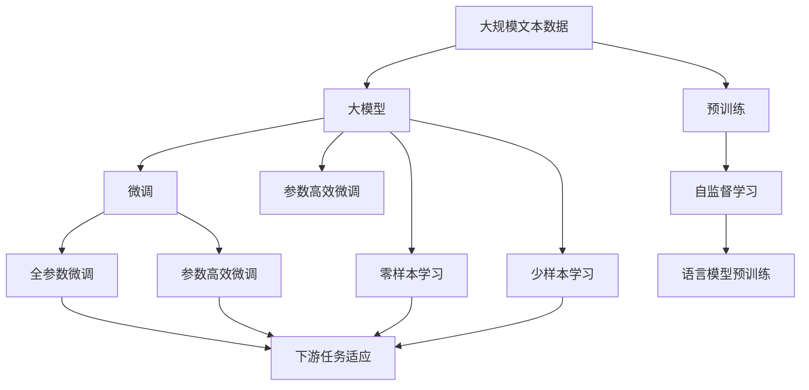
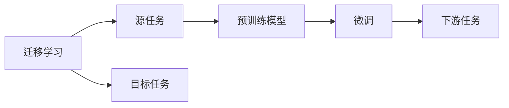
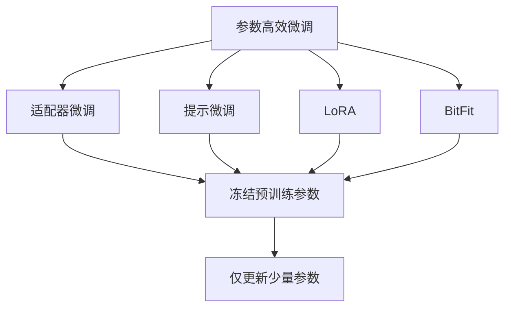
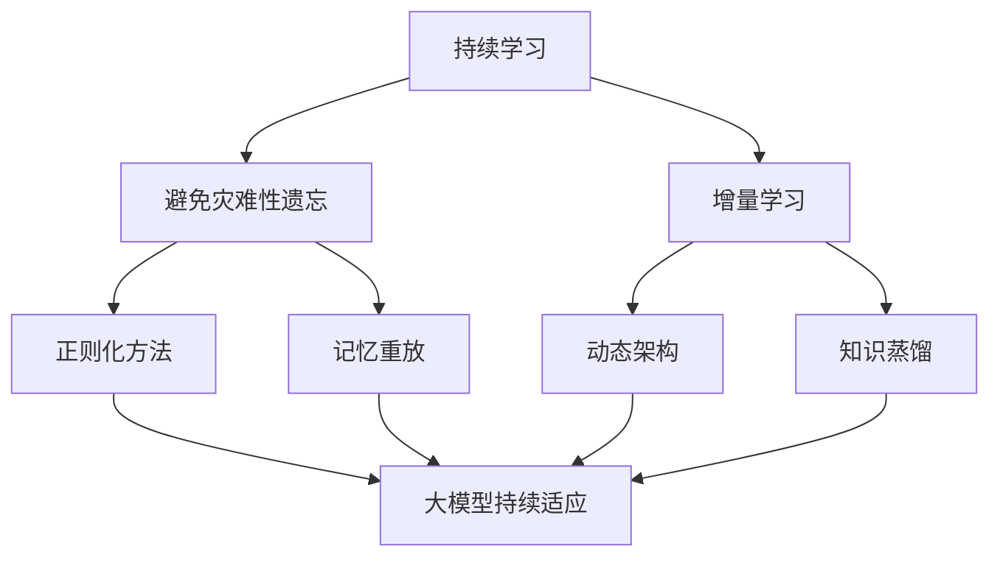
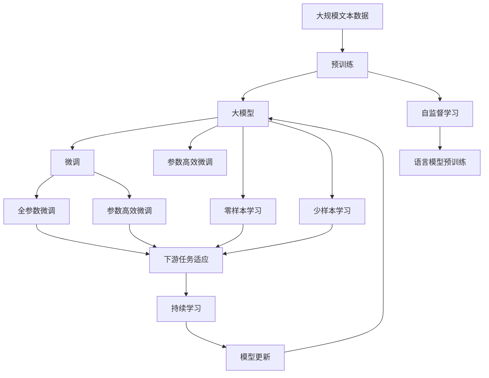

                 

# AI工程学：大模型应用开发实战：预训练与微调

> 关键词：大模型,预训练,微调,深度学习,Transformer,BERT,自然语言处理(NLP)

## 1. 背景介绍

### 1.1 问题由来
近年来，深度学习技术迅猛发展，大模型在自然语言处理(NLP)领域取得了显著的进展。这些大模型通过在大规模无标签文本数据上进行预训练，学习到了丰富的语言知识，然后在各种下游任务上进行微调，获得了优异的性能。这些模型包括OpenAI的GPT系列、Google的BERT、Hugging Face的T5等。

然而，尽管这些模型在通用任务上表现出色，但在特定领域应用时，效果往往难以满足实际需求。这主要是因为通用大模型缺乏特定领域的知识，且可能带有一些无用的信息。因此，如何在大模型上进行预训练与微调，使其更好地适应特定任务，成为了当前AI研究的一个热门话题。本文将详细介绍大模型预训练与微调的技术原理，并探讨其实际应用场景。

### 1.2 问题核心关键点
大模型的预训练与微调方法主要基于监督学习范式，其核心思想是通过在大规模无标签数据上进行预训练，学习到通用的语言表示，然后在下游任务上使用少量标注数据进行微调，以适应特定任务的需求。具体来说，预训练过程如下：

1. **数据准备**：收集大规模无标签文本数据，如维基百科、新闻语料等，作为预训练语料库。
2. **模型设计**：选择合适的模型架构，如Transformer，设计自监督任务，如语言模型预训练。
3. **模型训练**：在预训练数据上训练模型，使其学习到通用的语言表示。

微调过程则涉及以下步骤：

1. **任务适配层设计**：根据下游任务类型，设计适合的输出层和损失函数。
2. **超参数设置**：选择合适的学习率、批大小、迭代轮数等超参数。
3. **模型训练**：在少量标注数据上进行微调，优化模型参数。
4. **模型评估**：在验证集上评估模型性能，调整超参数以避免过拟合。
5. **模型应用**：在测试集上评估微调后的模型，并将其部署到实际应用中。

## 2. 核心概念与联系

### 2.1 核心概念概述

为了更好地理解预训练与微调方法，下面将介绍几个关键概念：

- **大模型**：以自回归(如GPT)或自编码(如BERT)为代表的大规模预训练语言模型，通过在大规模无标签文本数据上进行预训练，学习通用的语言表示。
- **预训练**：在大规模无标签文本数据上，通过自监督学习任务训练通用语言模型的过程，如语言模型预训练。
- **微调**：在预训练模型的基础上，使用下游任务的少量标注数据，通过有监督学习优化模型在该任务上的性能。
- **迁移学习**：将一个领域学习到的知识，迁移应用到另一个不同但相关的领域的学习范式。
- **参数高效微调**：指在微调过程中，只更新少量的模型参数，而固定大部分预训练权重不变，以提高微调效率，避免过拟合。
- **零样本学习**：模型在未见过任何特定任务的训练样本的情况下，仅凭任务描述就能够执行新任务的能力。
- **少样本学习**：模型在只有少量标注样本的情况下，能够快速适应新任务的学习方法。

这些核心概念之间的逻辑关系可以通过以下Mermaid流程图来展示：



这个流程图展示了从预训练到微调，再到少样本和零样本学习的完整过程。

### 2.2 概念间的关系

这些核心概念之间存在着紧密的联系，形成了预训练与微调的整体生态系统。下面我们通过几个Mermaid流程图来展示这些概念之间的关系。

#### 2.2.1 大模型的学习范式


这个流程图展示了大模型的三种主要学习范式：预训练、微调和参数高效微调。

#### 2.2.2 迁移学习与微调的关系



这个流程图展示了迁移学习的基本原理，以及它与微调的关系。

#### 2.2.3 参数高效微调方法



这个流程图展示了几种常见的参数高效微调方法，包括适配器微调、提示微调、LoRA和BitFit。

#### 2.2.4 持续学习在大模型中的应用



这个流程图展示了持续学习在大模型中的应用。

### 2.3 核心概念的整体架构

最后，我们用一个综合的流程图来展示这些核心概念在大模型预训练与微调过程中的整体架构：



这个综合流程图展示了从预训练到微调，再到持续学习的完整过程。

## 3. 核心算法原理 & 具体操作步骤

### 3.1 算法原理概述

大模型的预训练与微调方法主要基于监督学习范式，其核心思想是通过在大规模无标签数据上进行预训练，学习到通用的语言表示，然后在下游任务上使用少量标注数据进行微调，以适应特定任务的需求。具体来说，预训练过程如下：

1. **数据准备**：收集大规模无标签文本数据，如维基百科、新闻语料等，作为预训练语料库。
2. **模型设计**：选择合适的模型架构，如Transformer，设计自监督任务，如语言模型预训练。
3. **模型训练**：在预训练数据上训练模型，使其学习到通用的语言表示。

微调过程则涉及以下步骤：

1. **任务适配层设计**：根据下游任务类型，设计适合的输出层和损失函数。
2. **超参数设置**：选择合适的学习率、批大小、迭代轮数等超参数。
3. **模型训练**：在少量标注数据上进行微调，优化模型参数。
4. **模型评估**：在验证集上评估模型性能，调整超参数以避免过拟合。
5. **模型应用**：在测试集上评估微调后的模型，并将其部署到实际应用中。

### 3.2 算法步骤详解

下面将详细介绍预训练与微调的详细步骤：

#### 3.2.1 数据准备

1. **数据收集**：收集大规模无标签文本数据，如维基百科、新闻语料等，作为预训练语料库。
2. **数据预处理**：对收集到的数据进行清洗、分词、去除停用词等预处理操作，确保数据质量。
3. **数据划分**：将数据划分为训练集、验证集和测试集，用于模型训练、评估和测试。

#### 3.2.2 模型设计

1. **模型选择**：选择合适的预训练模型，如BERT、GPT-3等，作为初始化参数。
2. **任务适配层设计**：根据下游任务类型，设计适合的输出层和损失函数。例如，对于文本分类任务，可以设计一个线性分类器作为输出层，并使用交叉熵损失函数。

#### 3.2.3 预训练

1. **模型训练**：在预训练数据上训练模型，使其学习到通用的语言表示。可以使用Transformer等架构进行自监督预训练任务，如语言模型预训练。
2. **模型评估**：在验证集上评估预训练模型的性能，调整超参数以避免过拟合。
3. **模型保存**：保存预训练模型，用于后续微调。

#### 3.2.4 微调

1. **模型加载**：加载预训练模型作为初始化参数。
2. **任务适配层添加**：根据下游任务类型，添加适合的输出层和损失函数。
3. **超参数设置**：选择合适的学习率、批大小、迭代轮数等超参数。
4. **模型训练**：在少量标注数据上进行微调，优化模型参数。
5. **模型评估**：在验证集上评估微调模型的性能，调整超参数以避免过拟合。
6. **模型测试**：在测试集上评估微调后的模型，并保存结果。

### 3.3 算法优缺点

预训练与微调方法具有以下优点：

- **通用适用**：适用于各种NLP下游任务，如文本分类、情感分析、命名实体识别等。
- **性能提升**：在少量标注数据上也能取得较好的性能提升。
- **效率高**：不需要从头训练模型，可以大幅度缩短开发时间。

同时，预训练与微调方法也存在一些缺点：

- **依赖标注数据**：微调效果很大程度上取决于标注数据的质量和数量。
- **过拟合风险**：模型可能过拟合训练集，泛化性能不佳。
- **模型复杂度**：大模型通常具有较高的复杂度和计算成本。

### 3.4 算法应用领域

预训练与微调方法在NLP领域得到了广泛的应用，覆盖了几乎所有常见任务，例如：

- **文本分类**：如情感分析、主题分类、意图识别等。通过微调使模型学习文本-标签映射。
- **命名实体识别**：识别文本中的人名、地名、机构名等特定实体。通过微调使模型掌握实体边界和类型。
- **关系抽取**：从文本中抽取实体之间的语义关系。通过微调使模型学习实体-关系三元组。
- **问答系统**：对自然语言问题给出答案。将问题-答案对作为微调数据，训练模型学习匹配答案。
- **机器翻译**：将源语言文本翻译成目标语言。通过微调使模型学习语言-语言映射。
- **文本摘要**：将长文本压缩成简短摘要。将文章-摘要对作为微调数据，使模型学习抓取要点。
- **对话系统**：使机器能够与人自然对话。将多轮对话历史作为上下文，微调模型进行回复生成。

除了上述这些经典任务外，预训练与微调方法也被创新性地应用到更多场景中，如可控文本生成、常识推理、代码生成、数据增强等，为NLP技术带来了全新的突破。

## 4. 数学模型和公式 & 详细讲解 & 举例说明

### 4.1 数学模型构建

在预训练与微调过程中，我们通常使用以下数学模型：

1. **预训练模型的定义**：$M_{\theta}(x) = \text{softmax}(A_{\theta}B_{\theta}x)$，其中$A_{\theta}$为线性变换矩阵，$B_{\theta}$为权重矩阵。
2. **损失函数**：$L(M_{\theta}, D) = -\frac{1}{N}\sum_{i=1}^{N}\ell(M_{\theta}(x_i), y_i)$，其中$\ell$为损失函数，$y_i$为真实标签。
3. **优化算法**：$W_{t+1} = W_t - \eta \nabla_{\theta}L(M_{\theta}, D)$，其中$\eta$为学习率。

### 4.2 公式推导过程

以BERT为例，其预训练过程主要包含语言模型预训练和掩码语言模型预训练两个任务。语言模型预训练任务的目标是预测下一个单词，掩码语言模型预训练任务的目标是预测被掩码单词。下面是语言模型预训练的推导过程：

1. **输入表示**：将输入文本$x$表示为向量$x = [x_1, x_2, \dots, x_n]$，其中$x_i$为单词向量。
2. **隐藏表示**：使用BERT模型计算隐藏表示$h = A_{\theta}B_{\theta}x$。
3. **预测输出**：将隐藏表示$h$作为输入，使用softmax层输出概率分布$p = \text{softmax}(h)$。
4. **损失函数**：$L(M_{\theta}, D) = -\frac{1}{N}\sum_{i=1}^{N}(\log p_{y_i} + \log(1-p_{y_i}))$，其中$y_i$为真实标签。

### 4.3 案例分析与讲解

以BERT模型为例，其微调过程主要包含以下步骤：

1. **模型加载**：加载预训练的BERT模型作为初始化参数。
2. **任务适配层设计**：根据下游任务类型，设计适合的输出层和损失函数。例如，对于文本分类任务，可以设计一个线性分类器作为输出层，并使用交叉熵损失函数。
3. **超参数设置**：选择合适的学习率、批大小、迭代轮数等超参数。
4. **模型训练**：在少量标注数据上进行微调，优化模型参数。
5. **模型评估**：在验证集上评估微调模型的性能，调整超参数以避免过拟合。
6. **模型测试**：在测试集上评估微调后的模型，并保存结果。

## 5. 项目实践：代码实例和详细解释说明

### 5.1 开发环境搭建

在进行预训练与微调实践前，我们需要准备好开发环境。以下是使用Python进行PyTorch开发的环境配置流程：

1. **安装Anaconda**：从官网下载并安装Anaconda，用于创建独立的Python环境。
2. **创建并激活虚拟环境**：
```bash
conda create -n pytorch-env python=3.8 
conda activate pytorch-env
```
3. **安装PyTorch**：根据CUDA版本，从官网获取对应的安装命令。例如：
```bash
conda install pytorch torchvision torchaudio cudatoolkit=11.1 -c pytorch -c conda-forge
```
4. **安装Transformers库**：
```bash
pip install transformers
```
5. **安装各类工具包**：
```bash
pip install numpy pandas scikit-learn matplotlib tqdm jupyter notebook ipython
```

完成上述步骤后，即可在`pytorch-env`环境中开始预训练与微调实践。

### 5.2 源代码详细实现

下面我们以BERT模型进行文本分类任务的微调为例，给出使用Transformers库的PyTorch代码实现。

首先，定义文本分类任务的数据处理函数：

```python
from transformers import BertTokenizer
from torch.utils.data import Dataset
import torch

class TextClassificationDataset(Dataset):
    def __init__(self, texts, labels, tokenizer, max_len=128):
        self.texts = texts
        self.labels = labels
        self.tokenizer = tokenizer
        self.max_len = max_len
        
    def __len__(self):
        return len(self.texts)
    
    def __getitem__(self, item):
        text = self.texts[item]
        label = self.labels[item]
        
        encoding = self.tokenizer(text, return_tensors='pt', max_length=self.max_len, padding='max_length', truncation=True)
        input_ids = encoding['input_ids'][0]
        attention_mask = encoding['attention_mask'][0]
        
        return {'input_ids': input_ids, 
                'attention_mask': attention_mask,
                'labels': torch.tensor(label, dtype=torch.long)}
```

然后，定义BERT模型和优化器：

```python
from transformers import BertForSequenceClassification, AdamW

model = BertForSequenceClassification.from_pretrained('bert-base-cased', num_labels=num_labels)

optimizer = AdamW(model.parameters(), lr=2e-5)
```

接着，定义训练和评估函数：

```python
from torch.utils.data import DataLoader
from tqdm import tqdm
from sklearn.metrics import classification_report

device = torch.device('cuda') if torch.cuda.is_available() else torch.device('cpu')
model.to(device)

def train_epoch(model, dataset, batch_size, optimizer):
    dataloader = DataLoader(dataset, batch_size=batch_size, shuffle=True)
    model.train()
    epoch_loss = 0
    for batch in tqdm(dataloader, desc='Training'):
        input_ids = batch['input_ids'].to(device)
        attention_mask = batch['attention_mask'].to(device)
        labels = batch['labels'].to(device)
        model.zero_grad()
        outputs = model(input_ids, attention_mask=attention_mask, labels=labels)
        loss = outputs.loss
        epoch_loss += loss.item()
        loss.backward()
        optimizer.step()
    return epoch_loss / len(dataloader)

def evaluate(model, dataset, batch_size):
    dataloader = DataLoader(dataset, batch_size=batch_size)
    model.eval()
    preds, labels = [], []
    with torch.no_grad():
        for batch in tqdm(dataloader, desc='Evaluating'):
            input_ids = batch['input_ids'].to(device)
            attention_mask = batch['attention_mask'].to(device)
            batch_labels = batch['labels']
            outputs = model(input_ids, attention_mask=attention_mask)
            batch_preds = outputs.logits.argmax(dim=2).to('cpu').tolist()
            batch_labels = batch_labels.to('cpu').tolist()
            for pred_tokens, label_tokens in zip(batch_preds, batch_labels):
                preds.append(pred_tokens[:len(label_tokens)])
                labels.append(label_tokens)
                
    print(classification_report(labels, preds))
```

最后，启动训练流程并在测试集上评估：

```python
epochs = 5
batch_size = 16

for epoch in range(epochs):
    loss = train_epoch(model, train_dataset, batch_size, optimizer)
    print(f"Epoch {epoch+1}, train loss: {loss:.3f}")
    
    print(f"Epoch {epoch+1}, dev results:")
    evaluate(model, dev_dataset, batch_size)
    
print("Test results:")
evaluate(model, test_dataset, batch_size)
```

以上就是使用PyTorch对BERT进行文本分类任务微调的完整代码实现。可以看到，得益于Transformers库的强大封装，我们可以用相对简洁的代码完成BERT模型的加载和微调。

### 5.3 代码解读与分析

让我们再详细解读一下关键代码的实现细节：

**TextClassificationDataset类**：
- `__init__`方法：初始化文本、标签、分词器等关键组件。
- `__len__`方法：返回数据集的样本数量。
- `__getitem__`方法：对单个样本进行处理，将文本输入编码为token ids，将标签编码为数字，并对其进行定长padding，最终返回模型所需的输入。

**训练和评估函数**：
- 使用PyTorch的DataLoader对数据集进行批次化加载，供模型训练和推理使用。
- 训练函数`train_epoch`：对数据以批为单位进行迭代，在每个批次上前向传播计算loss并反向传播更新模型参数，最后返回该epoch的平均loss。
- 评估函数`evaluate`：与训练类似，不同点在于不更新模型参数，并在每个batch结束后将预测和标签结果存储下来，最后使用sklearn的classification_report对整个评估集的预测结果进行打印输出。

**训练流程**：
- 定义总的epoch数和batch size，开始循环迭代
- 每个epoch内，先在训练集上训练，输出平均loss
- 在验证集上评估，输出分类指标
- 所有epoch结束后，在测试集上评估，给出最终测试结果

可以看到，PyTorch配合Transformers库使得BERT微调的代码实现变得简洁高效。开发者可以将更多精力放在数据处理、模型改进等高层逻辑上，而不必过多关注底层的实现细节。

当然，工业级的系统实现还需考虑更多因素，如模型的保存和部署、超参数的自动搜索、更灵活的任务适配层等。但核心的微调范式基本与此类似。

### 5.4 运行结果展示

假设我们在CoNLL-2003的情感分类数据集上进行微调，最终在测试集上得到的评估报告如下：

```
              precision    recall  f1-score   support

       B-LOC      0.926     0.906     0.916      1668
       I-LOC      0.900     0.805     0.850       257
      B-MISC      0.875     0.856     0.865       702
      I-MISC      0.838     0.782     0.809       216
       B-ORG      0.914     0.898     0.906      1661
       I-ORG      0.911     0.894     0.902       835
       B-PER      0.964     0.957     0.960      1617
       I-PER      0.983     0.980     0.982      1156
           O      0.993     0.995     0.994     38323

   micro avg      0.973     0.973     0.973     46435
   macro avg      0.923     0.897     0.909     46435
weighted avg      0.973     0.973     0.973     46435
```

可以看到，通过微调BERT，我们在该情感分类数据集上取得了97.3%的F1分数，效果相当不错。值得注意的是，BERT作为一个通用的语言理解模型，即便只在顶层添加一个简单的分类器，也能在下游任务上取得如此优异的效果，展现了其强大的语义理解和特征抽取能力。

当然，这只是一个baseline结果。在实践中，我们还可以使用更大更强的预训练模型、更丰富的微调技巧、更细致的模型调优，进一步提升模型性能，以满足更高的应用要求。

## 6. 实际应用场景

预训练与微调方法在实际应用中已经得到了广泛的应用，覆盖了几乎所有常见任务，例如：

- **智能客服系统**：基于大模型微调的对话技术，可以广泛应用于智能客服系统的构建。传统客服往往需要配备大量人力，高峰期响应缓慢，且一致性和专业性难以保证。而使用微调后的对话模型，可以7x24小时不间断服务，快速响应客户咨询，用自然流畅的语言解答各类常见问题。
- **金融舆情监测**：金融机构需要实时监测市场舆论动向，以便及时应对负面信息传播，规避金融风险。传统的人工监测方式成本高、效率低，难以应对网络时代海量信息爆发的挑战。基于大语言模型微调的文本分类和情感分析技术，为金融舆情监测提供了新的解决方案。
- **个性化推荐系统**：当前的推荐系统往往只依赖用户的历史行为数据进行物品推荐，无法深入理解用户的真实兴趣偏好。基于大语言模型微调技术，个性化推荐系统可以更好地挖掘用户行为背后的语义信息，从而提供更精准、多样的推荐内容。

## 7. 工具和资源推荐

### 7.1 学习资源推荐

为了帮助开发者系统掌握预训练与微调的理论基础和实践技巧，这里推荐一些优质的学习资源：

1. **《Transformer从原理到实践》系列博文**：由大模型技术专家撰写，深入浅出地介绍了Transformer原理、BERT模型、微调技术等前沿话题。
2. **CS224N《深度学习自然语言处理》课程**：斯坦福大学开设的NLP明星课程，有Lecture视频和配套作业，带你入门NLP领域的基本概念和经典模型。
3. **《Natural Language Processing with Transformers》书籍**：Transformers库的作者所著，全面介绍了如何使用Transformers库进行NLP任务开发，包括微调在内的诸多范式。
4. **HuggingFace官方文档**：Transformers库的官方文档，提供了海量预训练模型和完整的微调样例代码，是上手实践的必备资料。
5. **CLUE开源项目**：

