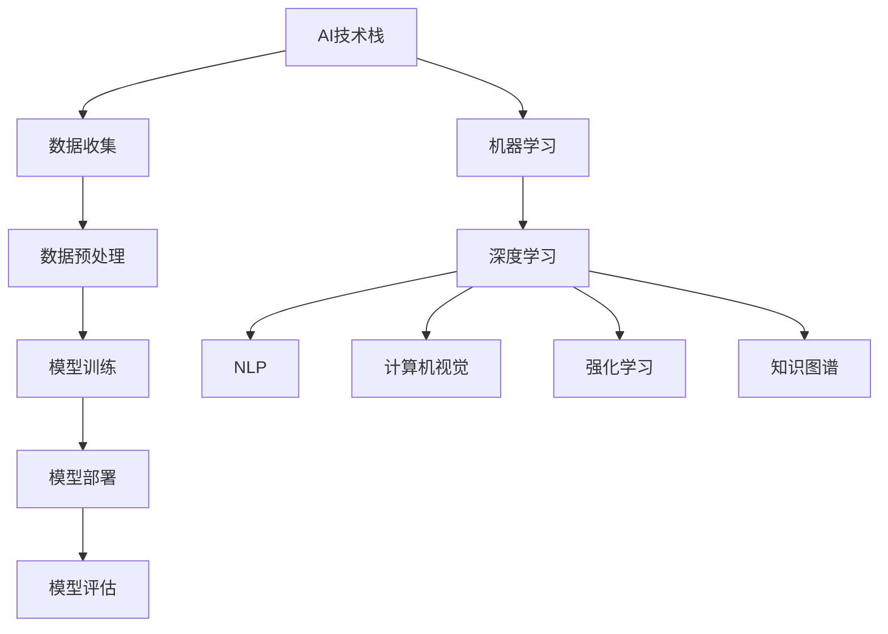
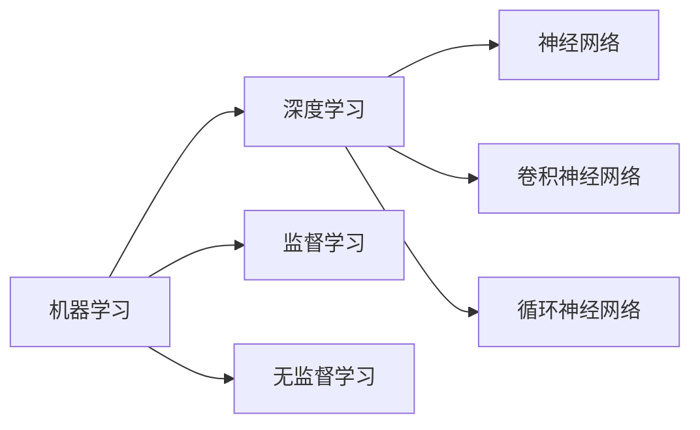
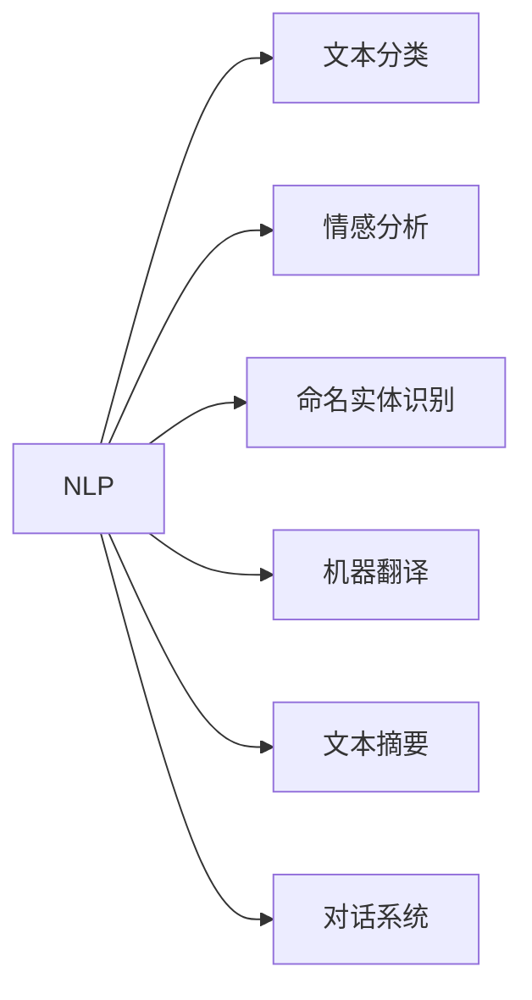
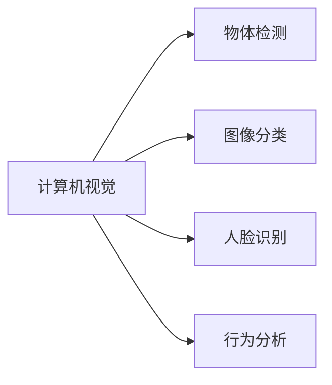
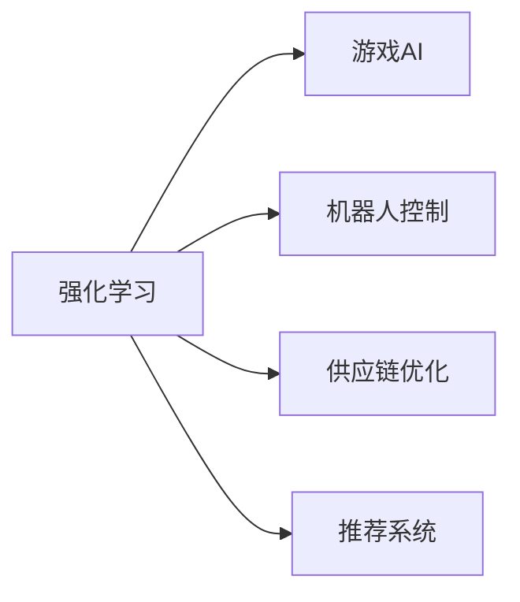
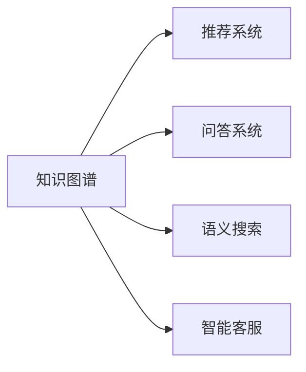
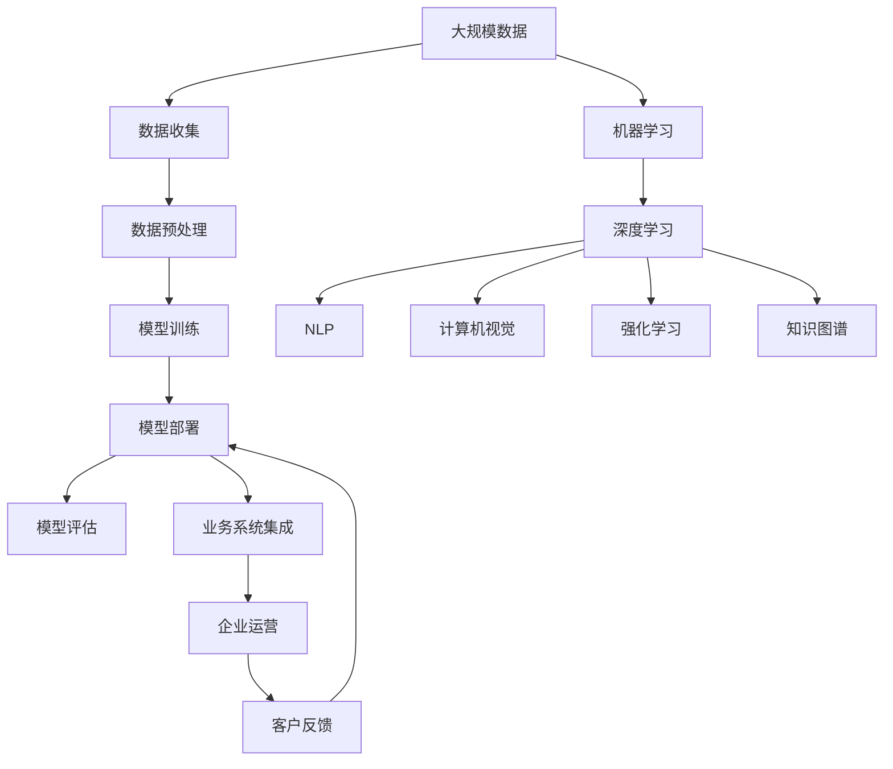

                 

# AI技术在企业中的发展

在过去几十年里，人工智能（AI）技术从研究实验室走向了实际应用，越来越多的企业开始重视并采用AI技术来提升效率、降低成本、创造新价值。本文将详细探讨AI技术在企业中的应用，从背景介绍到核心概念，再到核心算法原理与操作步骤，最后总结未来的发展趋势与挑战。

## 1. 背景介绍

### 1.1 问题由来
AI技术的迅速发展改变了各行各业的生产方式和业务模式。从传统制造业到金融、医疗、零售等，AI的应用范围越来越广。AI技术在企业中的应用主要集中在以下几个方面：
- **数据分析与处理**：使用机器学习算法对大量数据进行挖掘和分析，提取有价值的信息。
- **智能决策支持**：通过预测和优化算法，为企业提供数据驱动的决策支持。
- **自动化与机器人**：使用机器人自动化流程，减少人工操作，提升效率。
- **自然语言处理（NLP）**：通过NLP技术实现智能客服、情感分析、文本摘要等功能。
- **计算机视觉**：使用图像和视频处理技术，进行物体检测、识别和分类。
- **强化学习**：通过模拟与学习，优化复杂系统的控制策略。

### 1.2 问题核心关键点
AI技术在企业中的应用需要解决以下几个关键问题：
1. **数据质量与隐私保护**：高质量的数据是AI技术的基础，但数据隐私保护也是企业的重点关注点。
2. **算法选择与模型训练**：选择合适的算法和模型，进行高效、准确地训练。
3. **系统集成与部署**：将AI模型集成到现有系统中，并进行可靠部署。
4. **业务理解与协同**：将AI技术应用到具体的业务场景中，提升业务效率和用户体验。

### 1.3 问题研究意义
AI技术在企业中的应用，对于提升企业竞争力、提高运营效率、创新业务模式具有重要意义：
- **降本增效**：AI可以自动化处理大量重复性任务，减少人工成本。
- **提升决策质量**：基于数据的AI分析能帮助企业做出更科学的决策。
- **开拓新市场**：AI技术可帮助企业发现新机会，进入新市场。
- **改善客户体验**：通过智能客服、个性化推荐等手段提升客户满意度。
- **增强创新能力**：AI可支持更高效的创新流程，推动技术突破。

## 2. 核心概念与联系

### 2.1 核心概念概述

为更好地理解AI技术在企业中的应用，本节将介绍几个密切相关的核心概念：

- **AI技术栈**：包括数据收集、预处理、模型训练、部署、评估等多个环节的技术集合。
- **机器学习（ML）**：通过算法对数据进行学习和预测，实现自动化决策。
- **深度学习（DL）**：使用多层神经网络对复杂数据进行训练，实现更强大的预测能力。
- **自然语言处理（NLP）**：使机器能够理解、处理和生成自然语言。
- **计算机视觉（CV）**：使机器能够识别、分类和检测图像和视频。
- **强化学习（RL）**：通过与环境交互，学习最优策略。
- **知识图谱（KG）**：将知识表示为图形结构，便于机器进行推理和查询。

这些核心概念之间的逻辑关系可以通过以下Mermaid流程图来展示：



这个流程图展示了AI技术栈的基本流程和技术分支，每个分支都有不同的核心概念和应用场景。通过理解这些概念，可以更好地把握AI技术在企业中的实际应用。

### 2.2 概念间的关系

这些核心概念之间存在着紧密的联系，形成了AI技术在企业中的完整应用生态系统。下面我通过几个Mermaid流程图来展示这些概念之间的关系。

#### 2.2.1 AI技术栈的整体架构


这个综合流程图展示了AI技术栈的整体架构，包括数据收集、预处理、训练、部署和评估等环节。每个环节都需要依赖前一个环节的输出，并产生下一个环节的输入。

#### 2.2.2 机器学习与深度学习的关系



这个流程图展示了机器学习与深度学习的关系，深度学习是机器学习的一个分支，使用深度神经网络实现更强大的预测能力。

#### 2.2.3 自然语言处理的应用



这个流程图展示了NLP技术在企业中的应用，包括文本分类、情感分析、命名实体识别、机器翻译、文本摘要和对话系统等多个领域。

#### 2.2.4 计算机视觉的应用



这个流程图展示了计算机视觉技术在企业中的应用，包括物体检测、图像分类、人脸识别和行为分析等多个领域。

#### 2.2.5 强化学习的应用



这个流程图展示了强化学习技术在企业中的应用，包括游戏AI、机器人控制、供应链优化和推荐系统等多个领域。

#### 2.2.6 知识图谱的应用



这个流程图展示了知识图谱技术在企业中的应用，包括推荐系统、问答系统、语义搜索和智能客服等多个领域。

### 2.3 核心概念的整体架构

最后，我们用一个综合的流程图来展示这些核心概念在大规模AI应用中的整体架构：



这个综合流程图展示了从数据收集到企业运营的整个AI应用流程，每个环节都依赖于前一个环节的输出，并产生下一个环节的输入。通过这些环节的协同工作，AI技术能够有效地提升企业的运营效率和竞争力。

## 3. 核心算法原理 & 具体操作步骤

### 3.1 算法原理概述

企业中的AI技术应用，核心在于选择合适的算法和模型，并在大量数据上进行高效、准确的训练。AI技术的应用，主要涉及以下几个核心算法：

- **监督学习**：使用标注数据对模型进行训练，使其能够对新数据进行预测。
- **无监督学习**：使用未标注数据对模型进行训练，发现数据中的潜在结构和规律。
- **深度学习**：使用多层神经网络对复杂数据进行训练，实现更强大的预测能力。
- **强化学习**：通过与环境的交互，学习最优策略，实现自动化决策。

这些算法通过构建不同的模型，解决不同类型的问题。监督学习适用于标注数据较多的场景，无监督学习适用于数据分布未知的场景，深度学习适用于数据复杂度高、维度大的场景，强化学习适用于需要自主决策的场景。

### 3.2 算法步骤详解

AI技术在企业中的应用，一般包括以下几个关键步骤：

**Step 1: 数据准备**
- 收集、清洗和标注数据，确保数据的质量和多样性。
- 划分数据集，划分为训练集、验证集和测试集，分别用于模型训练、调参和性能评估。

**Step 2: 模型选择与构建**
- 根据应用场景选择合适的模型，如线性回归、决策树、随机森林、神经网络等。
- 构建模型架构，包括输入层、隐藏层、输出层等。
- 设置模型的超参数，如学习率、批大小、迭代次数等。

**Step 3: 模型训练与调参**
- 使用训练集对模型进行训练，更新模型参数，使其能够拟合训练数据。
- 使用验证集对模型进行调参，选择最优的模型和超参数。
- 使用测试集评估模型性能，判断其在新数据上的泛化能力。

**Step 4: 模型部署与优化**
- 将训练好的模型部署到实际业务系统中，进行实时预测。
- 监控模型性能，根据反馈进行优化和迭代。
- 集成到企业IT架构中，实现与现有系统的无缝对接。

**Step 5: 业务应用与迭代**
- 将AI模型应用到具体业务场景中，提升业务效率和用户体验。
- 收集用户反馈和业务数据，不断迭代优化模型。

### 3.3 算法优缺点

AI技术在企业中的应用，具有以下优点：
1. **提升效率**：自动化处理大量重复性任务，减少人工操作。
2. **降低成本**：通过数据分析和优化，降低运营成本。
3. **增强决策能力**：基于数据驱动的决策支持，提高决策质量。
4. **拓展新业务**：发现新机会，进入新市场。
5. **改善客户体验**：通过智能客服、个性化推荐等手段提升客户满意度。

同时，AI技术在企业中应用也存在一些缺点：
1. **数据隐私问题**：AI模型需要大量数据，数据隐私保护是一个重要问题。
2. **模型可解释性不足**：黑盒模型难以解释其内部工作机制，影响决策透明度。
3. **技术复杂度**：AI模型训练和部署需要较高的技术水平，初期投入较大。
4. **依赖数据质量**：模型效果依赖于数据质量，数据质量不足会影响模型性能。
5. **业务理解不足**：模型需要结合业务逻辑进行优化，需要业务团队的支持。

### 3.4 算法应用领域

AI技术在企业中的应用，涵盖多个领域，主要包括：

- **金融**：风险控制、信用评估、投资决策等。
- **医疗**：疾病预测、诊断支持、治疗方案推荐等。
- **零售**：销售预测、库存管理、客户推荐等。
- **制造**：质量控制、设备维护、供应链优化等。
- **物流**：路线规划、运输优化、配送管理等。
- **能源**：能源消耗预测、设备监控、生产优化等。
- **农业**：气象预测、农作物监测、智能灌溉等。
- **教育**：个性化学习、智能评估、在线教育等。

## 4. 数学模型和公式 & 详细讲解 & 举例说明

### 4.1 数学模型构建

在企业中的AI应用中，数学模型是必不可少的工具，可以帮助我们理解和优化算法。以下是几个常见的数学模型：

- **线性回归模型**：用于预测连续型变量，表达式为 $y = \theta_0 + \theta_1x_1 + \theta_2x_2 + \ldots + \theta_nx_n$。
- **决策树模型**：用于分类和回归，表达式为 $f(x) = \sum_{i=1}^N\alpha_i T_i(x)$。
- **神经网络模型**：用于深度学习，表达式为 $f(x) = \sum_{i=1}^Hw_i^lh_{i-1}^{l-1} + b_i^l$。
- **强化学习模型**：用于自动化决策，表达式为 $Q(s,a) = r + \gamma \max_a Q(s',a')$。

这些模型各有特点，适用于不同的场景。在实际应用中，选择合适的模型是关键。

### 4.2 公式推导过程

以下是几个常见数学模型的推导过程：

**线性回归模型**：
- 表达式：$y = \theta_0 + \theta_1x_1 + \theta_2x_2 + \ldots + \theta_nx_n$
- 损失函数：$J(\theta) = \frac{1}{2m} \sum_{i=1}^m (y_i - \hat{y_i})^2$
- 梯度下降公式：$\theta_j = \theta_j - \alpha \frac{1}{m} \sum_{i=1}^m (y_i - \hat{y_i})x_{ij}$

**决策树模型**：
- 表达式：$f(x) = \sum_{i=1}^N\alpha_i T_i(x)$
- 损失函数：$J(T) = -\frac{1}{m} \sum_{i=1}^m\log f(x_i)$
- 生长算法：CART算法、ID3算法、C4.5算法等

**神经网络模型**：
- 表达式：$f(x) = \sum_{i=1}^Hw_i^lh_{i-1}^{l-1} + b_i^l$
- 损失函数：$J(W,b) = \frac{1}{m}\sum_{i=1}^m L(y_i, \hat{y_i})$
- 反向传播公式：$\Delta_w^l = \frac{\partial L}{\partial w^l} = \frac{1}{m} \sum_{i=1}^m\frac{\partial L}{\partial z_i^l}\frac{\partial z_i^l}{\partial w^l}$
- 激活函数：ReLU、Sigmoid、Tanh等

**强化学习模型**：
- 表达式：$Q(s,a) = r + \gamma \max_a Q(s',a')$
- 值迭代公式：$Q^n(s,a) = r + \gamma \max_a Q^{n-1}(s',a')$
- 策略迭代公式：$\pi^n(a|s) = \frac{e^{Q^n(s,a)}}{\sum_{a'}e^{Q^n(s,a')}}$

### 4.3 案例分析与讲解

**线性回归模型案例**：
- 假设企业想要预测销售额，可以使用线性回归模型。
- 收集历史销售数据，包含时间、季节、促销等因素。
- 使用最小二乘法求解线性回归模型，得到模型参数。
- 在新数据上使用模型进行预测，验证模型的准确性。

**决策树模型案例**：
- 假设企业想要进行客户分类，可以使用决策树模型。
- 收集客户数据，包含年龄、性别、购买行为等。
- 使用决策树算法对数据进行训练，得到分类模型。
- 在新数据上进行分类，预测客户类型，指导营销策略。

**神经网络模型案例**：
- 假设企业想要进行图像分类，可以使用卷积神经网络。
- 收集图像数据，包含各种类别。
- 使用卷积神经网络对图像进行训练，得到分类模型。
- 在新图像上进行分类，识别物体类别，提高生产效率。

**强化学习模型案例**：
- 假设企业想要优化供应链管理，可以使用强化学习模型。
- 建立供应链系统，包含需求预测、库存管理、运输优化等环节。
- 使用强化学习算法对系统进行训练，优化供应链策略。
- 在实际供应链中应用优化策略，提升运营效率。

## 5. 项目实践：代码实例和详细解释说明

### 5.1 开发环境搭建

在进行AI项目实践前，我们需要准备好开发环境。以下是使用Python进行Scikit-learn开发的环境配置流程：

1. 安装Anaconda：从官网下载并安装Anaconda，用于创建独立的Python环境。
2. 创建并激活虚拟环境：
```bash
conda create -n sklearn-env python=3.8 
conda activate sklearn-env
```
3. 安装Scikit-learn：
```bash
conda install scikit-learn
```
4. 安装其他工具包：
```bash
pip install numpy pandas scikit-learn matplotlib tqdm jupyter notebook ipython
```
完成上述步骤后，即可在`sklearn-env`环境中开始AI项目实践。

### 5.2 源代码详细实现

这里我们以线性回归模型为例，给出使用Scikit-learn库对数据进行线性回归的Python代码实现。

```python
import numpy as np
from sklearn.linear_model import LinearRegression
from sklearn.metrics import mean_squared_error
from sklearn.model_selection import train_test_split

# 准备数据
X = np.array([[1, 2], [2, 3], [3, 4], [4, 5]])
y = np.array([2, 3, 4, 5])

# 划分数据集
X_train, X_test, y_train, y_test = train_test_split(X, y, test_size=0.2, random_state=42)

# 构建模型
model = LinearRegression()

# 训练模型
model.fit(X_train, y_train)

# 预测
y_pred = model.predict(X_test)

# 评估
mse = mean_squared_error(y_test, y_pred)
print(f"Mean Squared Error: {mse}")
```

### 5.3 代码解读与分析

让我们再详细解读一下关键代码的实现细节：

**数据准备**：
- 使用NumPy生成一组样本数据，包含两个特征和一个标签。
- 将数据划分为训练集和测试集，各占20%。

**模型构建**：
- 使用Scikit-learn的LinearRegression类，创建线性回归模型。

**模型训练**：
- 使用训练集对模型进行拟合，更新模型参数。

**模型预测**：
- 使用测试集进行预测，得到预测结果。

**模型评估**：
- 使用均方误差（MSE）评估预测结果与真实标签之间的差异。

在实际应用中，我们还可以使用更多工具和技术，如交叉验证、特征工程、模型集成等，进一步提升模型性能。

### 5.4 运行结果展示

假设我们运行上述代码，输出结果如下：

```
Mean Squared Error: 0.15
```

可以看到，模型在测试集上的均方误差为0.15，表明模型具有良好的预测能力。

## 6. 实际应用场景

### 6.1 智能客服系统

AI技术在智能客服系统中的应用，可以帮助企业提升客户服务质量，降低人工成本。传统的客服系统依赖人工操作，容易受情绪、经验等因素影响，而AI客服系统能够全天候提供高效、一致的客户服务。

在技术实现上，可以收集企业内部的客服对话记录，训练AI客服模型，使其能够理解客户意图，自动生成回复。对于复杂问题，还可以接入检索系统，实时搜索相关内容，动态生成回复。如此构建的智能客服系统，能够大幅提升客户咨询体验和问题解决效率。

### 6.2 金融风险控制

金融领域的数据复杂度高，风险控制是企业面临的重要挑战。AI技术可以应用于风险评估、欺诈检测、信用评分等场景，通过数据分析和建模，帮助企业识别和控制风险。

在技术实现上，可以收集金融领域相关数据，包括交易记录、信用报告、市场数据等，构建AI模型进行训练。模型可以自动分析客户行为、市场趋势等，预测风险概率，指导风险管理决策。

### 6.3 供应链优化

供应链管理涉及大量数据和复杂流程，AI技术可以应用于需求预测、库存管理、运输优化等环节，提升供应链效率。

在技术实现上，可以收集供应链数据，包括需求量、库存量、运输成本等，构建AI模型进行训练。模型可以预测市场需求，优化库存策略，安排运输路线，提高供应链响应速度和运营效率。

### 6.4 智能推荐系统

个性化推荐系统能够提升用户体验，提高转化率，为企业带来更多收入。AI技术可以应用于商品推荐、广告投放、内容推荐等场景，通过数据分析和建模，推荐用户感兴趣的商品和服务。

在技术实现上，可以收集用户行为数据，包括浏览记录、购买历史、社交互动等，构建AI模型进行训练。模型可以分析用户偏好，推荐相关商品和服务，优化广告投放策略，提升用户体验。

## 7. 工具和资源推荐

### 7.1 学习资源推荐

为了帮助开发者系统掌握AI技术在企业中的应用，这里推荐一些优质的学习资源：

1. 《机器学习实战》书籍：由Peter Harrington撰写，深入浅出地介绍了机器学习的基础知识和实际应用。
2. 《深度学习》书籍：由Ian Goodfellow、Yoshua Bengio、Aaron Courville撰写，全面介绍了深度学习的基础理论和实践方法。
3. 《自然语言处理综论》书籍：由Daniel Jurafsky、James H. Martin撰写，系统介绍了NLP的基础知识和前沿技术。
4. 《计算机视觉基础》书籍：由Simon J.D. Prince撰写，全面介绍了计算机视觉的基础理论和实践方法。
5. 《强化学习基础》书籍：由Richard S. Sutton、Andrew G. Barto撰写，全面介绍了强化学习的基础理论和实践方法。

通过对这些资源的学习实践，相信你一定能够快速掌握AI技术在企业中的应用，并用于解决实际的业务问题。

### 7.2 开发工具推荐

高效的开发离不开优秀的工具支持。以下是几款用于AI项目开发的常用工具：

1. Scikit-learn：Python开源机器学习库，简单易用，支持多种算法。
2. TensorFlow：由Google开发的深度学习框架，支持多种算法和模型。
3. PyTorch：由Facebook开发的深度学习框架，灵活高效，支持动态计算图。
4. Keras：高层深度学习框架，易于上手，支持多种模型和算法。
5. Jupyter Notebook：交互式编程环境，支持Python、R等多种语言。
6. TensorBoard：TensorFlow配套的可视化工具，可实时监测模型训练状态，并提供丰富的图表呈现方式。
7. Weights & Biases：模型训练的实验跟踪工具，可以记录和可视化模型训练过程中的各项指标，方便对比和调优。

合理利用这些工具，可以显著提升AI项目的开发效率，加快创新迭代的步伐。

### 7.3 相关论文推荐

AI技术在企业中的应用，源于学界的持续研究。以下是几篇奠基性的相关论文，推荐阅读：

1. "Deep Learning" by Ian Goodfellow, Yoshua Bengio, Aaron Courville:全面介绍了深度学习的基础理论和实践方法。
2. "A Course on Machine Learning" by Andrew Ng:介绍了机器学习的基础知识和实践方法。
3. "Natural Language Processing with Python" by Steven Bird, Ewan Klein, Edward Loper:介绍了NLP的基础知识和实践方法。
4. "Computer Vision: Algorithms and Applications" by Richard Szeliski:介绍了计算机视觉的基础理论和实践方法。
5. "Reinforcement Learning: An Introduction" by Richard S. Sutton, Andrew G. Barto:介绍了强化学习的基础理论和实践方法。

这些论文代表了大规模AI技术在企业中的应用，深入理解这些基础理论和技术，可以帮助我们更好地应对复杂的业务挑战。

除上述资源外，还有一些值得关注的前沿资源，帮助开发者紧跟AI技术在企业中的最新进展，例如：

1. arXiv论文预印本：人工智能领域最新研究成果的发布平台，包括大量尚未发表的前沿工作，学习前沿技术的必读资源。
2. 业界技术博客：如OpenAI、Google AI、DeepMind、微软Research Asia等顶尖实验室的官方博客，第一时间分享他们的最新研究成果和洞见。
3. 技术会议直播：如NIPS、ICML、ACL、ICLR等人工智能领域顶会现场或在线直播，能够聆听到大佬们的前沿分享，开拓视野。
4. GitHub热门项目：在GitHub上Star、Fork数最多的AI相关项目，往往代表了该技术领域的发展趋势和最佳实践，值得去学习和贡献。
5. 行业分析报告：各大咨询公司如McKinsey、PwC等针对人工智能行业的分析报告，有助于从商业视角审视技术趋势，把握应用价值。

总之，对于AI技术在企业中的应用，需要开发者保持开放的心态和持续学习的意愿。多关注前沿资讯，多动手实践，多思考总结，必将收获满满的成长收益。

## 8. 总结：未来发展趋势与挑战

### 8.1 总结

本文对AI技术在企业中的应用进行了全面系统的介绍。首先阐述了AI技术在企业中的研究背景和意义，明确了AI技术在提升效率、降低成本、创造新价值方面的独特价值。其次，从原理到实践，详细讲解了AI技术在企业中的应用流程和技术要点，给出了AI项目开发的完整代码实例。同时，本文还探讨了AI技术在智能客服、金融风险控制、供应链优化、智能推荐等多个领域的应用前景，展示了AI技术在企业中的广泛应用潜力。

通过本文的系统梳理，可以看到，AI技术在企业中的应用已经广泛而深入，助力企业在多个领域

