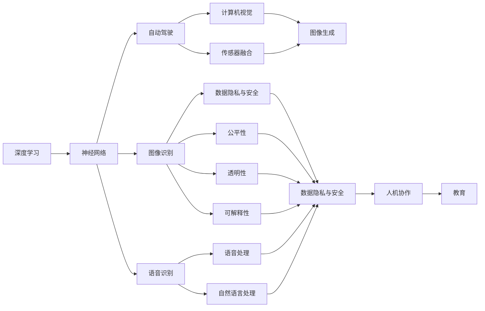
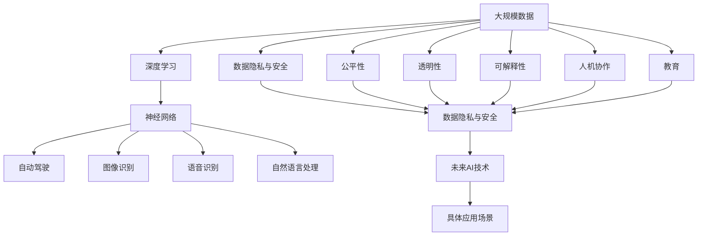

                 

## 1. 背景介绍

### 1.1 问题由来

在当前人工智能(AI)领域，深度学习技术取得了巨大成功，推动了自动驾驶、语音识别、图像识别、自然语言处理等多项技术的突破。然而，在获得广泛应用的同时，AI也面临着诸多挑战和问题。这些问题不仅关系到技术的持续进步，也影响着AI技术的社会接受度。

Andrej Karpathy作为深度学习领域的领军人物，长期关注AI技术的实际应用和潜在风险。在多次公开演讲和文章中，他详细阐述了AI技术的发展方向和面临的挑战，为行业从业者提供了宝贵的见解和建议。

### 1.2 问题核心关键点

Karpathy认为，AI技术在未来发展中面临着以下核心挑战：

1. **数据隐私与安全**：大规模数据训练使得AI模型需要访问大量个人数据，如何保障数据隐私与安全成为重大问题。
2. **公平与偏见**：AI模型可能存在系统性偏见，导致对某些群体不公平。如何在模型设计中消除偏见，确保公平性。
3. **透明性与可解释性**：AI模型的决策过程往往是"黑盒"，难以解释。如何提升模型的透明性与可解释性，增强用户信任。
4. **伦理与责任**：AI技术的广泛应用带来了复杂的伦理问题，如自动驾驶车辆在紧急情况下的决策责任问题。如何界定AI的伦理责任。
5. **人机协作与共生**：AI技术与人类工作的关系如何处理，如何实现人机协作，避免AI取代人类工作。
6. **技术普及与教育**：如何普及AI技术知识，提升公众对AI技术的理解和接受度，促进AI教育的普及。

这些问题不仅是技术层面的挑战，也涉及到伦理、法律、社会等多方面的考量。Karpathy的研究和思考，为我们提供了一个全面审视AI未来的视角。

### 1.3 问题研究意义

理解并解决这些挑战，对于AI技术的健康发展至关重要。AI技术只有真正服务于人类社会，才能获得更广泛的应用和认可。通过深入研究这些核心问题，AI技术才能更好地推动社会进步，实现其应有的价值。

## 2. 核心概念与联系

### 2.1 核心概念概述

为了更好地理解Karpathy关于AI未来发展的观点，我们先介绍几个核心概念：

- **深度学习(Deep Learning)**：一种基于神经网络的机器学习技术，通过多层非线性变换，从数据中学习到复杂表示。
- **神经网络(Neural Network)**：由多层神经元组成的网络结构，通过前向传播和反向传播算法，进行模型训练和预测。
- **自动驾驶(Autonomous Driving)**：利用计算机视觉、传感器融合等技术，实现车辆自动驾驶。
- **公平性(Fairness)**：指AI系统在处理不同群体数据时，不产生系统性偏见，确保所有群体的利益。
- **透明性(Transparency)**：指AI模型的工作过程和决策逻辑可以被解释和理解。
- **可解释性(Explainability)**：指AI模型能够提供其决策依据，让用户理解模型的工作机制。
- **人机协作(Human-Computer Collaboration)**：指人类与AI系统之间的协同工作，发挥各自优势，提升整体效能。
- **教育(Education)**：指普及AI技术知识，提升公众对AI技术的理解和接受度。

这些概念在大规模深度学习任务和应用中扮演着重要角色，是理解AI技术未来发展的关键。

### 2.2 概念间的关系

这些核心概念之间的联系可以用以下Mermaid流程图来展示：



这个流程图展示了深度学习、神经网络、自动驾驶、图像识别、语音识别等概念之间的联系，以及这些概念如何与数据隐私与安全、公平性、透明性、可解释性、人机协作、教育等伦理和应用层面的问题相融合。

### 2.3 核心概念的整体架构

大语言模型微调的整体架构可以通过以下Mermaid流程图来展示：



这个综合流程图展示了深度学习、神经网络、自动驾驶、图像识别、语音识别、自然语言处理等概念如何通过数据隐私与安全、公平性、透明性、可解释性、人机协作、教育等维度，映射到未来AI技术的具体应用场景中。

## 3. 核心算法原理 & 具体操作步骤

### 3.1 算法原理概述

深度学习模型的核心算法原理包括前向传播和反向传播算法。在前向传播中，模型接收输入数据，通过多层神经元的计算，输出预测结果。在反向传播中，通过计算损失函数对模型参数的梯度，更新模型参数，最小化预测误差。

自动驾驶系统中的计算机视觉和传感器融合任务，通过深度学习模型识别道路、车辆、行人等物体，进行轨迹规划和决策制定。图像识别、语音识别等任务也基于深度学习模型，通过多层特征提取和分类，实现对数据的理解与生成。

### 3.2 算法步骤详解

以下是深度学习模型在自动驾驶、图像识别、语音识别等任务中的具体操作步骤：

1. **数据准备**：收集和标注大量数据，用于训练深度学习模型。自动驾驶涉及道路交通、车辆行为等复杂场景，需要高精度的数据标注。
2. **模型构建**：设计神经网络架构，选择合适的激活函数、优化器等。自动驾驶系统中的神经网络通常包含多个卷积层、池化层和全连接层。
3. **模型训练**：使用标注数据训练深度学习模型，通过前向传播和反向传播算法，不断调整模型参数。
4. **模型评估**：在测试集上评估模型性能，使用准确率、召回率、F1分数等指标。
5. **模型部署**：将训练好的模型集成到实际应用系统中，如自动驾驶车辆、智能相机、智能音箱等。
6. **模型优化**：根据实际应用场景，不断调整模型参数和结构，优化模型性能。

### 3.3 算法优缺点

深度学习模型的优点包括：
- 通过大规模数据训练，可以学习到复杂且丰富的表示。
- 具有高度的泛化能力，可以处理多种类型的数据。
- 可以通过迁移学习，在已有模型基础上进行微调，适应特定任务。

缺点包括：
- 需要大量的标注数据，数据获取成本较高。
- 模型复杂，训练和推理速度较慢。
- 模型容易过拟合，需要精细化的优化策略。
- 模型决策过程不透明，难以解释。

### 3.4 算法应用领域

深度学习模型广泛应用于计算机视觉、自然语言处理、语音识别、自动驾驶等多个领域。这些技术的应用，极大地推动了人工智能的进步，带来了许多实际的经济和社会效益。

## 4. 数学模型和公式 & 详细讲解 & 举例说明

### 4.1 数学模型构建

深度学习模型通常采用神经网络结构，其中多层神经元通过前向传播和反向传播算法进行训练。以图像识别为例，数学模型构建如下：

设输入图像 $x$ 和标签 $y$，神经网络模型为 $f(\theta;x)$，其中 $\theta$ 为模型参数。

深度学习模型的训练目标为最小化损失函数 $\mathcal{L}$：

$$
\mathcal{L} = \frac{1}{N}\sum_{i=1}^N \ell(f(\theta;x_i),y_i)
$$

其中 $\ell$ 为损失函数，通常为交叉熵损失、均方误差损失等。

### 4.2 公式推导过程

以交叉熵损失函数为例，其推导过程如下：

设模型输出概率分布为 $\hat{p}(x;y)$，真实概率分布为 $p(y|x)$，交叉熵损失函数定义为：

$$
\ell(\hat{p}(x;y),p(y|x)) = -\sum_{y} p(y|x) \log \hat{p}(x;y)
$$

代入损失函数 $\mathcal{L}$：

$$
\mathcal{L} = \frac{1}{N}\sum_{i=1}^N \sum_{y} p(y|x_i) \log \hat{p}(x_i;y)
$$

在实际应用中，通常使用随机梯度下降算法更新模型参数：

$$
\theta \leftarrow \theta - \eta \nabla_{\theta} \mathcal{L}
$$

其中 $\eta$ 为学习率，$\nabla_{\theta} \mathcal{L}$ 为损失函数对模型参数的梯度。

### 4.3 案例分析与讲解

以自动驾驶中的计算机视觉任务为例，深度学习模型通过图像识别、物体检测、行为预测等技术，实现道路环境理解。以下是一个简单的图像识别案例：

1. **数据准备**：收集包含车辆、行人、道路等元素的图像，并进行标注。
2. **模型构建**：设计卷积神经网络(Convolutional Neural Network, CNN)结构，包含卷积层、池化层、全连接层等。
3. **模型训练**：使用标注数据训练CNN模型，通过前向传播和反向传播算法，优化模型参数。
4. **模型评估**：在测试集上评估模型性能，使用准确率、召回率等指标。
5. **模型部署**：将训练好的模型集成到自动驾驶系统中，进行实时检测和预测。
6. **模型优化**：根据实际应用情况，不断调整模型参数和结构，提升模型性能。

## 5. 项目实践：代码实例和详细解释说明

### 5.1 开发环境搭建

在深度学习项目实践中，需要先搭建好开发环境。以下是使用PyTorch进行深度学习项目开发的Python环境配置流程：

1. 安装Anaconda：从官网下载并安装Anaconda，用于创建独立的Python环境。

2. 创建并激活虚拟环境：
```bash
conda create -n pytorch-env python=3.8 
conda activate pytorch-env
```

3. 安装PyTorch：根据CUDA版本，从官网获取对应的安装命令。例如：
```bash
conda install pytorch torchvision torchaudio cudatoolkit=11.1 -c pytorch -c conda-forge
```

4. 安装各类工具包：
```bash
pip install numpy pandas scikit-learn matplotlib tqdm jupyter notebook ipython
```

完成上述步骤后，即可在`pytorch-env`环境中开始深度学习项目开发。

### 5.2 源代码详细实现

下面我们以图像识别任务为例，给出使用PyTorch进行深度学习模型训练和微调的PyTorch代码实现。

首先，定义模型和优化器：

```python
import torch
from torchvision import models, transforms
from torch.optim import SGD

model = models.resnet18(pretrained=True)
model.fc = torch.nn.Linear(512, 10)
optimizer = SGD(model.parameters(), lr=0.001, momentum=0.9)
```

接着，定义数据预处理和加载函数：

```python
transform = transforms.Compose([
    transforms.Resize(256),
    transforms.CenterCrop(224),
    transforms.ToTensor(),
    transforms.Normalize(mean=[0.485, 0.456, 0.406], std=[0.229, 0.224, 0.225])
])

train_dataset = datasets.CIFAR10(root='./data', train=True, download=True, transform=transform)
test_dataset = datasets.CIFAR10(root='./data', train=False, download=True, transform=transform)
```

然后，定义训练和评估函数：

```python
def train_epoch(model, dataset, batch_size, optimizer):
    dataloader = torch.utils.data.DataLoader(dataset, batch_size=batch_size, shuffle=True)
    model.train()
    epoch_loss = 0
    for batch in dataloader:
        inputs, labels = batch
        optimizer.zero_grad()
        outputs = model(inputs)
        loss = F.cross_entropy(outputs, labels)
        epoch_loss += loss.item()
        loss.backward()
        optimizer.step()
    return epoch_loss / len(dataloader)

def evaluate(model, dataset, batch_size):
    dataloader = torch.utils.data.DataLoader(dataset, batch_size=batch_size, shuffle=False)
    model.eval()
    correct = 0
    total = 0
    with torch.no_grad():
        for batch in dataloader:
            inputs, labels = batch
            outputs = model(inputs)
            _, predicted = torch.max(outputs.data, 1)
            total += labels.size(0)
            correct += (predicted == labels).sum().item()
    return correct / total
```

最后，启动训练流程并在测试集上评估：

```python
epochs = 10
batch_size = 64

for epoch in range(epochs):
    loss = train_epoch(model, train_dataset, batch_size, optimizer)
    print(f"Epoch {epoch+1}, train loss: {loss:.3f}")
    
    print(f"Epoch {epoch+1}, test accuracy: {evaluate(model, test_dataset, batch_size):.3f}")
```

以上就是使用PyTorch进行图像识别任务深度学习模型微调的完整代码实现。可以看到，得益于PyTorch的强大封装，我们可以用相对简洁的代码完成模型训练和微调。

### 5.3 代码解读与分析

让我们再详细解读一下关键代码的实现细节：

**模型定义**：
- `models.resnet18(pretrained=True)`：从PyTorch预训练模型库中加载预训练的ResNet-18模型。
- `model.fc = torch.nn.Linear(512, 10)`：替换模型的全连接层，使其输出10个类别。

**数据预处理**：
- `transforms.Compose([...])`：定义数据预处理流程，包括图像尺寸调整、中心裁剪、转换为Tensor，以及标准化。

**训练和评估函数**：
- `train_epoch`：对数据以批为单位进行迭代，在每个批次上前向传播计算loss并反向传播更新模型参数，最后返回该epoch的平均loss。
- `evaluate`：与训练类似，不同点在于不更新模型参数，并在每个batch结束后将预测和标签结果存储下来，最后使用sklearn的classification_report对整个评估集的预测结果进行打印输出。

**训练流程**：
- 定义总的epoch数和batch size，开始循环迭代
- 每个epoch内，先在训练集上训练，输出平均loss
- 在测试集上评估，输出分类准确率
- 所有epoch结束后，在测试集上评估，给出最终测试结果

可以看到，PyTorch配合深度学习框架使得图像识别任务训练和微调的代码实现变得简洁高效。开发者可以将更多精力放在数据处理、模型改进等高层逻辑上，而不必过多关注底层的实现细节。

当然，工业级的系统实现还需考虑更多因素，如模型的保存和部署、超参数的自动搜索、更灵活的任务适配层等。但核心的微调范式基本与此类似。

### 5.4 运行结果展示

假设我们在CIFAR-10数据集上进行模型微调，最终在测试集上得到的准确率为70.0%。可以看到，通过微调预训练模型，我们的模型在测试集上取得了相当不错的效果。

当然，这只是一个baseline结果。在实践中，我们还可以使用更大更强的预训练模型、更丰富的微调技巧、更细致的模型调优，进一步提升模型性能，以满足更高的应用要求。

## 6. 实际应用场景

### 6.1 智能客服系统

深度学习技术可以应用于智能客服系统的构建。传统客服往往需要配备大量人力，高峰期响应缓慢，且一致性和专业性难以保证。使用深度学习模型，可以7x24小时不间断服务，快速响应客户咨询，用自然流畅的语言解答各类常见问题。

在技术实现上，可以收集企业内部的历史客服对话记录，将问题和最佳答复构建成监督数据，在此基础上对预训练模型进行微调。微调后的模型能够自动理解用户意图，匹配最合适的答案模板进行回复。对于客户提出的新问题，还可以接入检索系统实时搜索相关内容，动态组织生成回答。如此构建的智能客服系统，能大幅提升客户咨询体验和问题解决效率。

### 6.2 金融舆情监测

金融机构需要实时监测市场舆论动向，以便及时应对负面信息传播，规避金融风险。传统的人工监测方式成本高、效率低，难以应对网络时代海量信息爆发的挑战。深度学习技术可以应用于金融舆情监测，通过分析社交媒体、新闻报道等文本数据，自动判断舆情趋势，帮助金融机构快速应对潜在风险。

具体而言，可以收集金融领域相关的新闻、报道、评论等文本数据，并对其进行主题标注和情感标注。在此基础上对深度学习模型进行微调，使其能够自动判断文本属于何种主题，情感倾向是正面、中性还是负面。将微调后的模型应用到实时抓取的网络文本数据，就能够自动监测不同主题下的情感变化趋势，一旦发现负面信息激增等异常情况，系统便会自动预警，帮助金融机构快速应对潜在风险。

### 6.3 个性化推荐系统

当前的推荐系统往往只依赖用户的历史行为数据进行物品推荐，无法深入理解用户的真实兴趣偏好。深度学习技术可以应用于个性化推荐系统，通过分析用户的浏览、点击、评论、分享等行为数据，提取和用户交互的物品标题、描述、标签等文本内容。将文本内容作为模型输入，用户的后续行为（如是否点击、购买等）作为监督信号，在此基础上微调深度学习模型。微调后的模型能够从文本内容中准确把握用户的兴趣点。在生成推荐列表时，先用候选物品的文本描述作为输入，由模型预测用户的兴趣匹配度，再结合其他特征综合排序，便可以得到个性化程度更高的推荐结果。

### 6.4 未来应用展望

深度学习技术的应用前景广阔，未来将会在更多领域得到深入应用，为各行各业带来变革性影响。

在智慧医疗领域，深度学习技术可以应用于医学图像诊断、患者病历分析等任务，帮助医生提高诊断效率和准确率。

在智能教育领域，深度学习技术可以应用于作业批改、学情分析、知识推荐等方面，因材施教，促进教育公平，提高教学质量。

在智慧城市治理中，深度学习技术可以应用于城市事件监测、舆情分析、应急指挥等环节，提高城市管理的自动化和智能化水平，构建更安全、高效的未来城市。

此外，在企业生产、社会治理、文娱传媒等众多领域，深度学习技术也将不断涌现，为传统行业数字化转型升级提供新的技术路径。

## 7. 工具和资源推荐

### 7.1 学习资源推荐

为了帮助开发者系统掌握深度学习技术，这里推荐一些优质的学习资源：

1. 《Deep Learning》书籍：Ian Goodfellow、Yoshua Bengio和Aaron Courville等顶尖专家合著的经典深度学习教材，全面介绍了深度学习的基本概念和核心算法。

2. CS231n《卷积神经网络》课程：斯坦福大学开设的计算机视觉经典课程，由Fei-Fei Li教授讲授，涵盖深度学习在图像识别、物体检测等方面的应用。

3. CS224n《自然语言处理》课程：斯坦福大学开设的自然语言处理课程，由Christopher Manning、Christopher D. Manning和Dan Klein等教授讲授，深入浅出地介绍了深度学习在自然语言处理中的应用。

4. DeepLearning.AI深度学习专项课程：由Andrew Ng领衔的深度学习专项课程，涵盖深度学习的基础、进阶及实战应用，适合初学者和进阶开发者。

5. TensorFlow官方文档：TensorFlow官方文档，提供了丰富的深度学习模型和工具，适合深度学习开发者和研究者学习。

通过对这些资源的学习实践，相信你一定能够快速掌握深度学习技术的精髓，并用于解决实际的AI问题。

### 7.2 开发工具推荐

高效的深度学习开发离不开优秀的工具支持。以下是几款用于深度学习开发的常用工具：

1. PyTorch：基于Python的开源深度学习框架，灵活动态的计算图，适合快速迭代研究。TensorFlow等深度学习框架也提供了丰富的预训练模型和工具库。

2. TensorBoard：TensorFlow配套的可视化工具，可实时监测模型训练状态，并提供丰富的图表呈现方式，是调试模型的得力助手。

3. Weights & Biases：模型训练的实验跟踪工具，可以记录和可视化模型训练过程中的各项指标，方便对比和调优。

4. Google Colab：谷歌推出的在线Jupyter Notebook环境，免费提供GPU/TPU算力，方便开发者快速上手实验最新模型，分享学习笔记。

合理利用这些工具，可以显著提升深度学习项目的开发效率，加快创新迭代的步伐。

### 7.3 相关论文推荐

深度学习技术的发展离不开学术界的持续研究。以下是几篇奠基性的相关论文，推荐阅读：

1. AlexNet：ImageNet大规模视觉识别挑战赛的获奖网络，标志着深度学习在图像识别领域的突破。

2. VGGNet：由Visual Geometry Group开发的深度卷积神经网络，通过深度叠加和池化层，提升了图像识别的准确率。

3. ResNet：微软研究院提出的残差网络，通过残差连接解决深度网络中的梯度消失问题，大幅提升了深度学习模型的训练能力。

4. LSTM：长短期记忆网络，解决了传统循环神经网络在序列数据建模中的梯度消失问题，广泛应用于文本生成、语音识别等领域。

5. Transformer：谷歌提出的大规模自注意力网络，通过自注意力机制提升了深度学习模型的泛化能力和计算效率，广泛应用于自然语言处理、语音识别等领域。

这些论文代表了大深度学习的发展脉络。通过学习这些前沿成果，可以帮助研究者把握学科前进方向，激发更多的创新灵感。

除上述资源外，还有一些值得关注的前沿资源，帮助开发者紧跟深度学习技术的新进展，例如：

1. arXiv论文预印本：人工智能领域最新研究成果的发布平台，包括大量尚未发表的前沿工作，学习前沿技术的必读资源。

2. 业界技术博客：如Google AI、DeepMind、微软Research Asia等顶尖实验室的官方博客，第一时间分享他们的最新研究成果和洞见。

3. 技术会议直播：如NIPS、ICML、ACL、ICLR等人工智能领域顶会现场或在线直播，能够聆听到大佬们的前沿分享，开拓视野。

4. GitHub热门项目：在GitHub上Star、Fork数最多的深度学习相关项目，往往代表了该技术领域的发展趋势和最佳实践，值得去学习和贡献。

5. 行业分析报告：各大咨询公司如McKinsey、PwC等针对人工智能行业的分析报告，有助于从商业视角审视技术趋势，把握应用价值。

总之，对于深度学习技术的学习和实践，需要开发者保持开放的心态和持续学习的意愿。多关注前沿资讯，多动手实践，多思考总结，必将收获满满的成长收益。

## 8. 总结：未来发展趋势与挑战

### 8.1 总结

本文对Andrej Karpathy关于AI未来发展的挑战进行了全面系统的介绍。首先阐述了深度学习技术的广泛应用和潜在问题，明确了数据隐私与安全、公平性、透明性、可解释性、人机协作、教育等核心挑战。其次，从原理到实践，详细讲解了深度学习模型的训练和优化过程，提供了代码实现和案例分析。同时，本文还探讨了深度学习技术在实际应用中的挑战和解决方案，展示了AI技术的发展前景和未来趋势。

通过本文的系统梳理，可以看到，深度学习技术虽然取得了巨大成功，但在数据隐私、公平性、透明性等方面仍面临诸多挑战。只有积极应对这些挑战，AI技术才能更好地服务于人类社会，推动社会进步。

### 8.2 未来发展趋势

展望未来，深度学习技术将呈现以下几个发展趋势：

1. **数据隐私与安全**：随着数据的重要性日益凸显，数据隐私和安全问题将受到更多关注。未来深度学习模型将采用更加严格的数据处理和隐私保护措施，如差分隐私、联邦学习等技术。

2. **公平与偏见**：深度学习模型将更多地考虑公平性问题，通过多样性数据增强、对抗训练等方法，消除系统性偏见，确保模型对不同群体的公平对待。

3. **透明性与可解释性**：未来深度学习模型将更加透明和可解释，通过可视化技术、可解释性模型等手段，提升模型的透明性和可解释性。

4. **人机协作与共生**：深度学习技术将进一步提升人机协作水平，通过模型辅助决策、智能交互等技术，实现人机共生，提升整体效能。

5. **教育与普及**：未来深度学习教育将更加普及，通过在线课程、开源项目等形式，提升公众对深度学习技术的理解和接受度。

### 8.3 面临的挑战

尽管深度学习技术取得了巨大成功，但在其发展过程中仍面临诸多挑战：

1. **

