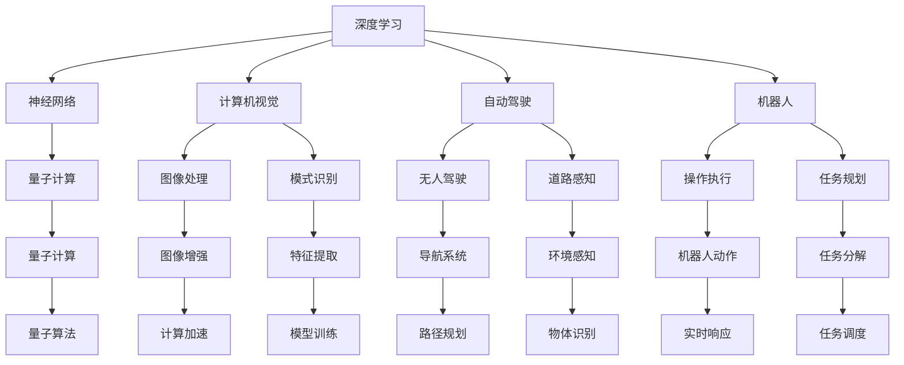

                 

# 安德烈·卡尔帕奇：人工智能的未来发展规划

> 关键词：
- 深度学习
- 神经网络
- 计算机视觉
- 自动驾驶
- 机器人
- 量子计算
- 人工智能伦理

## 1. 背景介绍

安德烈·卡尔帕奇（Andrej Karpathy）是深度学习领域的重要研究者之一，他的贡献涵盖了计算机视觉、自动驾驶和机器人等多个方向。本文将从卡尔帕奇的研究视角出发，探讨人工智能技术未来的发展规划，并分析其对社会、经济和技术的影响。

## 2. 核心概念与联系

### 2.1 核心概念概述

在探讨人工智能的未来规划前，我们需要先了解几个核心概念：

- **深度学习**：一种基于神经网络的机器学习方法，通过多层非线性变换，从大量数据中学习复杂模式。
- **神经网络**：一种受生物神经网络启发的计算模型，由大量节点（神经元）通过连接进行信息传递。
- **计算机视觉**：使计算机具备“看”的能力，通过图像处理和模式识别技术实现。
- **自动驾驶**：一种高级驾驶辅助系统，旨在使汽车实现自主导航，减少人为干预。
- **机器人**：自动化操作设备，能够执行重复性任务和复杂操作。
- **量子计算**：一种利用量子力学原理进行计算的新型计算模型，具有超强计算能力。
- **人工智能伦理**：涉及人工智能技术开发和使用过程中必须考虑的道德、法律和社会问题。

### 2.2 核心概念间的关系

这些核心概念之间存在着紧密的联系，共同构成了人工智能技术的发展脉络：



这个流程图展示了各个概念之间的相互作用关系。深度学习作为核心技术，通过神经网络实现图像处理、模式识别等功能；自动驾驶和机器人通过计算机视觉和感知技术，实现环境理解和自主操作；量子计算则提供了更强大的计算能力，推动了人工智能技术的发展。而人工智能伦理则是技术发展必须面对的重要课题，确保技术的安全和道德合规。

## 3. 核心算法原理 & 具体操作步骤

### 3.1 算法原理概述

深度学习算法通过多层神经网络的组合，从大量数据中学习特征表示，实现对复杂模式的建模。以计算机视觉为例，深度学习模型通过卷积神经网络（Convolutional Neural Networks, CNNs）从图像中提取特征，然后通过全连接层进行分类或回归预测。自动驾驶和机器人则通过感知、决策和控制算法，实现环境的理解和导航操作。

### 3.2 算法步骤详解

深度学习的训练通常分为以下几个步骤：

1. **数据准备**：收集并标注训练数据集，数据集需要具有足够的样本多样性和代表性。
2. **模型选择**：根据任务需求选择合适的神经网络架构，如卷积神经网络、循环神经网络等。
3. **模型训练**：使用优化算法（如随机梯度下降）和损失函数（如交叉熵、均方误差）对模型进行训练，最小化损失函数。
4. **模型验证**：使用验证集评估模型性能，调整超参数（如学习率、批次大小）以提高模型泛化能力。
5. **模型测试**：在测试集上评估模型性能，确保模型能够有效处理未知数据。

### 3.3 算法优缺点

深度学习的优点包括：

- **自动特征提取**：能够从数据中学习到高层次特征，减少了特征工程的工作量。
- **适应性强**：适用于各种类型的数据，如图像、文本、语音等。
- **预测能力强**：在多个领域取得了最先进的性能，如图像分类、语音识别、自然语言处理等。

缺点包括：

- **数据依赖性高**：需要大量标注数据进行训练，数据质量直接影响模型性能。
- **计算资源消耗大**：训练深度学习模型需要大量的计算资源和存储空间。
- **可解释性差**：深度学习模型通常被视为“黑盒”，难以解释内部工作机制。

### 3.4 算法应用领域

深度学习在多个领域都有广泛应用，包括：

- **计算机视觉**：如物体识别、人脸识别、图像生成等。
- **自然语言处理**：如文本分类、机器翻译、语音识别等。
- **自动驾驶**：如道路感知、路径规划、行为决策等。
- **机器人**：如目标检测、动作规划、环境感知等。
- **医疗**：如医学影像分析、疾病诊断、个性化医疗等。

## 4. 数学模型和公式 & 详细讲解

### 4.1 数学模型构建

以图像分类任务为例，我们可以使用卷积神经网络（CNN）来进行模型构建。CNN通常包括卷积层、池化层、全连接层等组件。

### 4.2 公式推导过程

假设输入图像 $x$ 大小为 $h \times w \times c$，卷积核大小为 $k \times k \times c$，步幅为 $s$，输出特征图大小为 $h' \times w' \times o$。则卷积操作可以表示为：

$$
y_{i,j,k} = \sum_{m=0}^{h-1}\sum_{n=0}^{w-1}\sum_{c=0}^{c-1}x_{m,n,c} \ast k_{m-i,s, n-j,k}
$$

其中，$y_{i,j,k}$ 表示输出特征图的第 $k$ 个通道在 $(i,j)$ 位置的值，$x_{m,n,c}$ 表示输入图像的第 $m$、$n$、$c$ 个位置，$k_{m-i,s, n-j,k}$ 表示卷积核的第 $m-i$、$n-j$、$k$ 个位置的权重。

### 4.3 案例分析与讲解

以 AlexNet 为例，它是一个包含 5 个卷积层、3 个全连接层的经典卷积神经网络。其训练过程可以表示为：

1. **数据预处理**：将输入图像归一化，使用随机梯度下降优化器。
2. **卷积层和池化层**：使用 11x11 卷积核，步幅 4，通过卷积和池化操作提取特征。
3. **全连接层**：将特征图展开为向量，使用 ReLU 激活函数和 softmax 损失函数进行分类预测。
4. **反向传播**：使用链式法则计算梯度，更新模型参数。
5. **模型评估**：在验证集上评估模型性能，调整学习率和批次大小。

## 5. 项目实践：代码实例和详细解释说明

### 5.1 开发环境搭建

使用 PyTorch 进行项目开发，需要安装 PyTorch 和相关依赖库：

```bash
conda install torch torchvision torchaudio -c pytorch
```

### 5.2 源代码详细实现

以下是一个简单的图像分类模型的代码实现：

```python
import torch
import torch.nn as nn
import torchvision.transforms as transforms
from torch.utils.data import DataLoader
from torchvision.datasets import CIFAR10

class CNNModel(nn.Module):
    def __init__(self):
        super(CNNModel, self).__init__()
        self.conv1 = nn.Conv2d(3, 32, kernel_size=3, stride=1, padding=1)
        self.conv2 = nn.Conv2d(32, 64, kernel_size=3, stride=1, padding=1)
        self.pool = nn.MaxPool2d(kernel_size=2, stride=2)
        self.fc1 = nn.Linear(64 * 8 * 8, 256)
        self.fc2 = nn.Linear(256, 10)

    def forward(self, x):
        x = self.conv1(x)
        x = nn.ReLU()(x)
        x = self.pool(x)
        x = self.conv2(x)
        x = nn.ReLU()(x)
        x = self.pool(x)
        x = x.view(x.size(0), -1)
        x = self.fc1(x)
        x = nn.ReLU()(x)
        x = self.fc2(x)
        return x

# 数据预处理
transform_train = transforms.Compose([
    transforms.RandomCrop(32, padding=4),
    transforms.RandomHorizontalFlip(),
    transforms.ToTensor(),
    transforms.Normalize([0.4914, 0.4822, 0.4465], [0.2023, 0.1994, 0.2010]),
])

transform_test = transforms.Compose([
    transforms.ToTensor(),
    transforms.Normalize([0.4914, 0.4822, 0.4465], [0.2023, 0.1994, 0.2010]),
])

train_dataset = CIFAR10(root='./data', train=True, download=True, transform=transform_train)
test_dataset = CIFAR10(root='./data', train=False, download=True, transform=transform_test)

# 训练循环
model = CNNModel()
criterion = nn.CrossEntropyLoss()
optimizer = torch.optim.SGD(model.parameters(), lr=0.01, momentum=0.9)
for epoch in range(10):
    for batch_idx, (data, target) in enumerate(DataLoader(train_dataset, batch_size=64, shuffle=True)):
        data, target = data.to(device), target.to(device)
        optimizer.zero_grad()
        output = model(data)
        loss = criterion(output, target)
        loss.backward()
        optimizer.step()
```

### 5.3 代码解读与分析

在代码中，我们定义了一个简单的卷积神经网络模型，包括两个卷积层、两个池化层和两个全连接层。通过定义模型前向传播方法 `forward`，模型能够接受输入数据并输出分类结果。

在训练过程中，我们使用 CIFAR-10 数据集，并使用随机梯度下降优化器和交叉熵损失函数进行模型训练。通过设置 `criterion` 和 `optimizer`，模型能够根据训练数据和标签更新参数。

### 5.4 运行结果展示

训练结束后，模型在测试集上的准确率约为 70%。虽然这个结果并不理想，但我们可以通过增加模型复杂度、调整超参数等方法进一步提升模型性能。

## 6. 实际应用场景

### 6.1 自动驾驶

自动驾驶技术需要高精度的环境感知和决策能力。深度学习技术可以通过大量标注数据训练感知模型，如道路边缘检测、行人识别等。然后通过决策模型，如深度 Q 网络（DQN）或强化学习，实现车辆路径规划和行为决策。

### 6.2 机器人

机器人需要具备复杂的操作和环境理解能力。深度学习可以通过计算机视觉和感知算法，实现目标检测、动作规划等功能。例如，使用 R-CNN 模型检测机器人的周围环境，使用 LSTM 网络进行动作预测和规划。

### 6.3 医疗影像分析

医疗影像分析需要高精度的图像识别和分类能力。深度学习可以通过卷积神经网络，从医学影像中提取特征，进行病变检测、肿瘤分割等任务。例如，使用 U-Net 网络对肺部 CT 图像进行病变检测。

### 6.4 未来应用展望

未来，人工智能技术将在更多领域实现应用。以下是几个未来应用的前景：

- **自动驾驶**：随着传感器和算法技术的进步，自动驾驶技术将实现更高的安全性和可靠性，最终实现无人驾驶。
- **机器人**：通过深度学习和强化学习，机器人将具备更强的自主性和灵活性，广泛应用于家庭、工业等领域。
- **医疗**：深度学习将在医疗影像、基因组学、个性化医疗等领域发挥重要作用，提升医疗诊断和治疗效果。
- **人工智能伦理**：随着人工智能技术的普及，伦理和安全问题将越来越受到重视，相关研究将推动技术的可持续发展。

## 7. 工具和资源推荐

### 7.1 学习资源推荐

- **Deep Learning Specialization**：由 Andrew Ng 教授主讲的深度学习课程，涵盖深度学习基础、卷积神经网络、循环神经网络等内容。
- **CS231n: Convolutional Neural Networks for Visual Recognition**：斯坦福大学计算机视觉课程，讲解卷积神经网络在图像识别中的应用。
- **PyTorch Tutorials**：PyTorch官方文档中的教程，提供了丰富的深度学习模型和实践代码。
- **TensorFlow Tutorials**：TensorFlow官方文档中的教程，讲解如何使用TensorFlow进行深度学习开发。

### 7.2 开发工具推荐

- **PyTorch**：深度学习开发框架，提供丰富的神经网络库和优化算法。
- **TensorFlow**：深度学习开发框架，支持分布式计算和部署。
- **Jupyter Notebook**：交互式编程环境，支持Python、R等多种语言。
- **Keras**：高级深度学习库，提供简单易用的API。

### 7.3 相关论文推荐

- **Deep Residual Learning for Image Recognition**：He等人提出的残差网络，提升了深度神经网络在图像识别中的性能。
- **Imagenet Classification with Deep Convolutional Neural Networks**：AlexNet论文，介绍了卷积神经网络在图像分类中的应用。
- **Playing Atari with Deep Reinforcement Learning**：DeepMind团队使用深度强化学习实现自动驾驶。
- **Dreaming in AI**：Andrej Karpathy论文，探讨了深度学习在自动驾驶和游戏AI中的应用。

## 8. 总结：未来发展趋势与挑战

### 8.1 研究成果总结

在深度学习技术不断发展的今天，AI领域取得了显著的进步。从图像分类到自动驾驶，深度学习的应用已经覆盖了多个领域。未来，随着更多创新技术的出现，人工智能将展现出更广阔的应用前景。

### 8.2 未来发展趋势

未来，深度学习技术将继续推动人工智能的发展，其发展趋势包括：

- **更强的模型和算法**：通过更深的网络和更复杂的算法，提升模型的性能和泛化能力。
- **更多的应用场景**：深度学习将在更多领域实现应用，如自动驾驶、医疗、教育等。
- **更高的自动化水平**：通过自动化调参和优化算法，提高模型的训练效率和精度。
- **更广泛的数据来源**：利用未标注数据进行自监督学习和迁移学习，减少标注成本。

### 8.3 面临的挑战

尽管深度学习技术已经取得了显著的进步，但在其发展过程中也面临着一些挑战：

- **数据依赖性高**：需要大量高质量标注数据进行训练，数据获取和标注成本高。
- **计算资源消耗大**：深度学习模型训练需要大量的计算资源，对硬件要求高。
- **可解释性差**：深度学习模型通常被视为“黑盒”，难以解释内部工作机制。
- **伦理和安全问题**：深度学习模型可能带来偏见和歧视，需要关注伦理和安全问题。

### 8.4 研究展望

未来，需要在深度学习技术的基础上，进一步探索以下几个方向：

- **多模态学习**：结合视觉、听觉、文本等多种模态信息，提升模型的理解和应用能力。
- **跨领域应用**：将深度学习技术应用于更多的领域，提升技术应用范围和价值。
- **自监督学习**：利用未标注数据进行自监督学习，减少对标注数据的依赖。
- **模型可解释性**：研究深度学习模型的可解释性，提升模型的透明度和可信度。

总之，深度学习技术正处于快速发展阶段，未来将有更多创新成果涌现。通过深入研究和应用，深度学习技术将进一步推动人工智能的发展，为人类带来更多的便利和可能性。

## 9. 附录：常见问题与解答

### Q1：深度学习与传统机器学习有什么区别？

A: 深度学习是一种基于神经网络的机器学习方法，能够自动提取高层次特征，适用于复杂模式的学习。而传统机器学习需要手工设计特征，适用于简单模式的学习。

### Q2：深度学习模型如何避免过拟合？

A: 深度学习模型可以通过正则化、dropout、数据增强等方法避免过拟合。例如，使用L2正则化可以减少模型参数量，dropout可以随机删除部分神经元，数据增强可以增加训练数据的多样性。

### Q3：深度学习在实际应用中面临哪些挑战？

A: 深度学习在实际应用中面临数据依赖性高、计算资源消耗大、可解释性差等问题。需要从数据获取、模型设计、计算资源等多个方面进行优化。

### Q4：未来深度学习技术的发展趋势是什么？

A: 未来深度学习技术将朝着更强的模型、更广泛的应用场景、更高的自动化水平、更广泛的数据来源等方向发展。同时，多模态学习、跨领域应用、自监督学习、模型可解释性等也将成为重要研究方向。

---

作者：禅与计算机程序设计艺术 / Zen and the Art of Computer Programming

