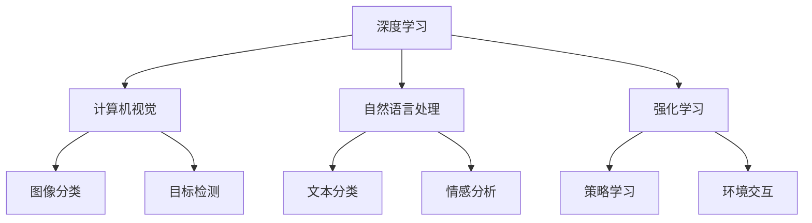

                 

# Andrej Karpathy：人工智能的未来发展趋势

> 关键词：人工智能,深度学习,机器学习,自然语言处理,计算机视觉,强化学习,技术前沿

## 1. 背景介绍

### 1.1 问题由来
人工智能（AI）在过去几十年中取得了巨大的进步，尤其是在深度学习和机器学习（ML）领域。从语音识别、图像处理到自然语言理解和机器人技术，AI在各个领域都取得了突破性进展。然而，AI技术的发展也面临诸多挑战，如计算资源的需求、数据隐私和伦理问题等。本文章将围绕这些问题，探讨Andrej Karpathy对AI未来发展趋势的见解。

### 1.2 问题核心关键点
Andrej Karpathy是一位深度学习领域的领军人物，他曾任特斯拉CTO，并发表了众多关于AI未来发展趋势的见解。他的观点涵盖了多个AI前沿领域，包括自然语言处理（NLP）、计算机视觉（CV）、强化学习（RL）等，为行业提供了宝贵的指导。

## 2. 核心概念与联系

### 2.1 核心概念概述

Andrej Karpathy的核心概念涉及以下几个方面：

- **深度学习**：通过构建多层次的非线性模型，自动学习和提取数据中的特征，用于图像识别、语音识别、自然语言处理等领域。

- **计算机视觉**：研究如何让计算机"看懂"图像和视频，涵盖图像分类、目标检测、语义分割、实例分割等任务。

- **自然语言处理**：使计算机能够理解、处理和生成自然语言，包括文本分类、情感分析、机器翻译等任务。

- **强化学习**：通过与环境的交互，学习如何在特定环境下采取最优行动，以最大化奖励。

- **迁移学习**：通过在预训练任务上的知识迁移，提高模型在新任务上的表现。

- **对抗性学习**：研究如何构建防御机制，防止模型在对抗性样本的攻击下失效。

这些概念之间相互关联，共同构成了AI技术的前沿生态系统。通过了解这些核心概念，我们可以更好地把握AI技术的发展方向。

### 2.2 概念间的关系

这些核心概念之间的关系可以通过以下Mermaid流程图来展示：



这个流程图展示了深度学习在各个AI子领域的应用和交叉：

- 深度学习技术被广泛应用于计算机视觉中的图像分类和目标检测，以及自然语言处理中的文本分类和情感分析。
- 强化学习则被用于策略学习，通过环境交互来优化行为。

## 3. 核心算法原理 & 具体操作步骤
### 3.1 算法原理概述

Andrej Karpathy认为，未来AI技术的发展将依赖于以下几个关键算法原理：

- **自监督学习**：通过无标签数据进行预训练，使模型自动学习到数据的潜在结构，从而提升模型的泛化能力。

- **迁移学习**：在预训练任务上的知识迁移，可以帮助模型快速适应新任务，减少训练时间和数据需求。

- **对抗性训练**：通过引入对抗性样本，提高模型在面对攻击时的鲁棒性。

- **联邦学习**：通过分布式计算，在不共享原始数据的情况下，训练模型。

- **主动学习**：在缺乏大量数据的情况下，通过有选择性地标注样本，最大化学习效率。

这些算法原理的融合，将进一步推动AI技术在各个领域的创新应用。

### 3.2 算法步骤详解

以下是基于Andrej Karpathy观点的AI算法步骤详解：

1. **数据准备**：收集并标注数据集，为模型训练提供基础。

2. **模型设计**：选择合适的深度学习架构，如卷积神经网络（CNN）、循环神经网络（RNN）或Transformer等。

3. **模型训练**：在大量无标签或标注数据上进行预训练，然后使用迁移学习在特定任务上微调模型。

4. **模型评估**：在验证集上评估模型性能，调整超参数以优化模型。

5. **模型部署**：将训练好的模型部署到实际应用中，进行性能监控和维护。

### 3.3 算法优缺点

Andrej Karpathy对AI算法的优缺点进行了详细分析：

- **优点**：
  - **高效性**：自动化学习和特征提取，显著减少了人工标注的工作量。
  - **泛化能力**：自监督学习和迁移学习提升了模型的泛化能力，适应新任务更高效。
  - **鲁棒性**：对抗性训练和联邦学习提高了模型的鲁棒性，防止数据泄露和攻击。

- **缺点**：
  - **计算资源需求高**：深度学习模型通常需要大量计算资源和存储空间。
  - **数据依赖性强**：模型性能依赖于高质量的数据集，数据采集和标注成本高。
  - **模型复杂度高**：模型结构复杂，训练和推理过程耗时较长。

### 3.4 算法应用领域

Andrej Karpathy认为，AI算法将在以下领域得到广泛应用：

- **医疗健康**：通过图像识别和自然语言处理，辅助医生进行诊断和治疗。
- **自动驾驶**：利用计算机视觉和强化学习，实现无人驾驶和智能交通。
- **金融科技**：通过数据挖掘和情感分析，提升金融服务的智能化水平。
- **智慧城市**：结合自然语言处理和计算机视觉，提高城市管理和公共服务的效率。
- **工业制造**：通过机器人技术和计算机视觉，实现智能制造和质量控制。

## 4. 数学模型和公式 & 详细讲解 & 举例说明

### 4.1 数学模型构建

以下是Andrej Karpathy对AI算法数学模型的构建概述：

- **深度神经网络**：多层感知器（MLP）、卷积神经网络（CNN）、循环神经网络（RNN）等。
- **目标函数**：常用的损失函数包括交叉熵损失、均方误差损失、对数损失等。
- **优化算法**：如梯度下降、Adam、SGD等。

### 4.2 公式推导过程

以下是一个简单的深度神经网络（DNN）的数学公式推导：

假设输入数据为 $x$，网络参数为 $\theta$，目标函数为 $L(\theta)$。则前向传播的计算过程为：

$$
z = Wx + b
$$

$$
\hat{y} = g(z)
$$

其中 $W$ 为权重矩阵，$b$ 为偏置向量，$g(z)$ 为激活函数。反向传播的计算过程为：

$$
\frac{\partial L}{\partial z} = \frac{\partial L}{\partial \hat{y}} \frac{\partial \hat{y}}{\partial z}
$$

$$
\frac{\partial L}{\partial W} = \frac{\partial L}{\partial z} \frac{\partial z}{\partial W} = \frac{\partial L}{\partial z} W
$$

$$
\frac{\partial L}{\partial b} = \frac{\partial L}{\partial z} 
$$

### 4.3 案例分析与讲解

以图像分类任务为例，假设模型在训练集上取得较高准确率，但在测试集上表现不佳。分析原因可能有：

- **过拟合**：模型在训练集上过度拟合，导致泛化性能下降。
- **数据分布差异**：训练集和测试集分布不一致，导致模型性能下降。
- **超参数问题**：学习率、批大小等超参数设置不当，影响模型训练。

针对这些问题，可以通过以下方法进行解决：

- **数据增强**：通过图像旋转、平移、缩放等操作，扩充训练集。
- **迁移学习**：在预训练任务上进行迁移学习，提升模型泛化能力。
- **模型压缩**：通过剪枝、量化等方法，减小模型规模，提高推理效率。

## 5. 项目实践：代码实例和详细解释说明

### 5.1 开发环境搭建

以下是基于Andrej Karpathy观点的AI开发环境搭建步骤：

1. **环境准备**：安装Python、PyTorch、TensorFlow等深度学习框架。

2. **数据处理**：使用Pandas、NumPy等工具，处理和清洗数据集。

3. **模型构建**：使用Keras、PyTorch等框架，构建深度神经网络模型。

4. **模型训练**：使用AdamW、SGD等优化器，训练模型。

5. **模型评估**：使用TensorBoard、Weights & Biases等工具，评估模型性能。

### 5.2 源代码详细实现

以下是使用PyTorch实现图像分类的代码示例：

```python
import torch
import torch.nn as nn
import torch.optim as optim
from torchvision import datasets, transforms

# 定义模型
class Net(nn.Module):
    def __init__(self):
        super(Net, self).__init__()
        self.conv1 = nn.Conv2d(3, 64, kernel_size=3, padding=1)
        self.conv2 = nn.Conv2d(64, 128, kernel_size=3, padding=1)
        self.fc1 = nn.Linear(128 * 8 * 8, 256)
        self.fc2 = nn.Linear(256, 10)

    def forward(self, x):
        x = F.relu(self.conv1(x))
        x = F.max_pool2d(x, 2)
        x = F.relu(self.conv2(x))
        x = F.max_pool2d(x, 2)
        x = x.view(-1, 128 * 8 * 8)
        x = F.relu(self.fc1(x))
        x = self.fc2(x)
        return x

# 定义损失函数和优化器
model = Net()
criterion = nn.CrossEntropyLoss()
optimizer = optim.Adam(model.parameters(), lr=0.001)

# 训练模型
train_loader = torch.utils.data.DataLoader(train_dataset, batch_size=32)
for epoch in range(10):
    for images, labels in train_loader:
        optimizer.zero_grad()
        outputs = model(images)
        loss = criterion(outputs, labels)
        loss.backward()
        optimizer.step()

# 评估模型
test_loader = torch.utils.data.DataLoader(test_dataset, batch_size=32)
correct = 0
total = 0
with torch.no_grad():
    for images, labels in test_loader:
        outputs = model(images)
        _, predicted = torch.max(outputs.data, 1)
        total += labels.size(0)
        correct += (predicted == labels).sum().item()
accuracy = 100.0 * correct / total
print('Accuracy: {:.2f}%'.format(accuracy))
```

### 5.3 代码解读与分析

以上代码展示了使用PyTorch实现图像分类的过程：

- **模型定义**：通过继承`nn.Module`，定义了一个包含卷积层和全连接层的深度神经网络。
- **训练过程**：使用Adam优化器，对模型进行反向传播和参数更新。
- **评估过程**：在测试集上评估模型性能，计算准确率。

## 6. 实际应用场景

### 6.4 未来应用展望

Andrej Karpathy认为，未来AI技术将在以下领域得到更广泛的应用：

- **智能家居**：通过自然语言处理和计算机视觉，实现智能家居设备的控制和场景感知。
- **智慧教育**：利用情感分析和对话系统，提升在线教育体验。
- **环保能源**：通过图像识别和强化学习，优化能源管理。
- **自动化交通**：通过计算机视觉和自主驾驶技术，实现智能交通系统。
- **医疗诊断**：结合图像处理和自然语言处理，辅助医生进行疾病诊断和治疗。

## 7. 工具和资源推荐

### 7.1 学习资源推荐

以下是Andrej Karpathy推荐的AI学习资源：

1. **Coursera**：提供深度学习、计算机视觉等课程，由斯坦福大学教授授课。

2. **fast.ai**：提供实用的深度学习课程，注重实战和快速上手。

3. **Deep Learning Specialization**：由Andrew Ng教授授课，涵盖深度学习的基本理论和实践。

4. **Kaggle**：提供数据科学竞赛平台，可以通过实际项目提升AI技能。

### 7.2 开发工具推荐

以下是Andrej Karpathy推荐的AI开发工具：

1. **PyTorch**：开源深度学习框架，支持动态计算图，易于调试和实验。

2. **TensorFlow**：开源深度学习框架，适用于大规模分布式计算。

3. **Keras**：高层深度学习API，易于使用，快速搭建模型。

4. **MXNet**：开源深度学习框架，支持分布式计算和多种编程语言。

### 7.3 相关论文推荐

以下是Andrej Karpathy推荐的AI相关论文：

1. **ImageNet Classification with Deep Convolutional Neural Networks**：提出AlexNet模型，为深度学习在图像分类领域的应用奠定了基础。

2. **Faster R-CNN: Towards Real-Time Object Detection with Region Proposal Networks**：提出Faster R-CNN模型，提升了目标检测的实时性和准确性。

3. **Attention is All You Need**：提出Transformer模型，开启了自注意力机制在深度学习中的广泛应用。

4. **GPT-3: Language Models are Unsupervised Multitask Learners**：提出GPT-3模型，展示了自监督学习在语言模型训练中的强大能力。

5. **Playing Atari with Deep Reinforcement Learning**：提出AlphaGo模型，展示了强化学习在复杂游戏场景中的成功应用。

这些资源和工具将帮助开发者深入理解Andrej Karpathy对AI未来发展趋势的见解，提升自身的AI技术水平。

## 8. 总结：未来发展趋势与挑战

### 8.1 研究成果总结

Andrej Karpathy认为，未来AI技术的发展将依赖于以下几个关键研究成果：

1. **自监督学习**：通过无标签数据进行预训练，使模型自动学习到数据的潜在结构。
2. **迁移学习**：在预训练任务上的知识迁移，提高模型在新任务上的表现。
3. **对抗性训练**：提高模型在面对攻击时的鲁棒性。
4. **联邦学习**：在不共享原始数据的情况下，训练模型。
5. **主动学习**：在缺乏大量数据的情况下，通过有选择性地标注样本，最大化学习效率。

### 8.2 未来发展趋势

Andrej Karpathy对AI未来发展趋势进行了详细预测：

1. **自动化和智能化**：自动化学习和特征提取将进一步推动AI技术的发展，智能化水平将不断提升。
2. **跨领域融合**：AI技术将在更多领域得到应用，如医疗、金融、交通等。
3. **人机协同**：AI将与人类协同工作，提升工作效率和决策质量。
4. **伦理和隐私**：AI技术的伦理和隐私问题将受到更多关注，需要在设计和应用中加以考量。
5. **全球化合作**：AI技术的全球化合作将进一步推动技术的创新和应用。

### 8.3 面临的挑战

Andrej Karpathy认为，未来AI技术的发展仍面临诸多挑战：

1. **计算资源瓶颈**：深度学习模型通常需要大量计算资源和存储空间。
2. **数据隐私和安全**：数据隐私和安全问题将更加突出，需要在模型设计和应用中加以保障。
3. **伦理和道德**：AI技术的伦理和道德问题将引发更多社会关注，需要在应用中加以考量。
4. **模型鲁棒性**：模型在面对攻击和噪声数据时的鲁棒性问题需要进一步解决。
5. **数据质量**：高质量的数据集获取和标注成本高，数据质量问题将影响模型的性能。

### 8.4 研究展望

Andrej Karpathy对AI技术未来研究展望如下：

1. **模型压缩和优化**：通过模型压缩和优化，提高模型的推理速度和效率。
2. **跨模态学习**：结合视觉、语音、文本等多模态数据，提升模型的理解和表达能力。
3. **自监督学习**：通过无标签数据进行预训练，提高模型的泛化能力。
4. **对抗性学习**：研究对抗性样本生成和防御机制，提升模型的鲁棒性。
5. **联邦学习**：通过分布式计算，在不共享原始数据的情况下，训练模型。

## 9. 附录：常见问题与解答

### Q1：如何提高深度学习模型的泛化能力？

**A**：可以通过以下方法提高深度学习模型的泛化能力：

- **数据增强**：通过数据扩充技术，增加数据集的多样性。
- **迁移学习**：利用预训练模型在特定任务上进行微调。
- **正则化**：使用L2正则、Dropout等方法，防止过拟合。
- **对抗性训练**：引入对抗性样本，提高模型的鲁棒性。
- **模型压缩**：通过剪枝、量化等方法，减小模型规模，提高泛化能力。

### Q2：深度学习模型如何处理长序列数据？

**A**：处理长序列数据可以通过以下方法：

- **循环神经网络（RNN）**：适用于序列数据，可以捕捉序列中的时序信息。
- **卷积神经网络（CNN）**：通过池化操作，提取序列中的局部特征。
- **Transformer模型**：利用自注意力机制，处理任意长度的序列数据。

### Q3：如何在深度学习模型中进行模型压缩和优化？

**A**：可以通过以下方法进行模型压缩和优化：

- **剪枝**：去除不必要的参数和层，减小模型规模。
- **量化**：将浮点模型转为定点模型，压缩存储空间。
- **蒸馏**：通过知识蒸馏，将大模型的小模型化，提高推理效率。
- **动态计算图**：使用动态计算图技术，优化模型推理过程。

### Q4：深度学习模型如何应对数据隐私和安全问题？

**A**：可以通过以下方法应对数据隐私和安全问题：

- **联邦学习**：在不共享原始数据的情况下，训练模型。
- **差分隐私**：在数据收集和处理过程中，保护个人隐私。
- **模型蒸馏**：通过知识蒸馏，减小模型规模，保护数据隐私。
- **加密技术**：使用加密技术，保护数据传输和存储安全。

### Q5：如何提高深度学习模型的计算效率？

**A**：可以通过以下方法提高深度学习模型的计算效率：

- **模型剪枝**：去除不必要的参数和层，减小模型规模。
- **量化**：将浮点模型转为定点模型，压缩存储空间。
- **动态计算图**：使用动态计算图技术，优化模型推理过程。
- **分布式计算**：通过分布式计算，提高模型训练和推理效率。

综上所述，Andrej Karpathy对AI未来发展趋势的见解为我们提供了宝贵的参考。通过深入理解AI算法原理和操作步骤，合理利用学习资源和开发工具，可以更好地应对未来的AI挑战，推动AI技术在更多领域的创新应用。

---

作者：禅与计算机程序设计艺术 / Zen and the Art of Computer Programming

