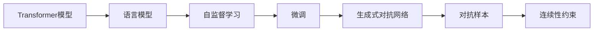
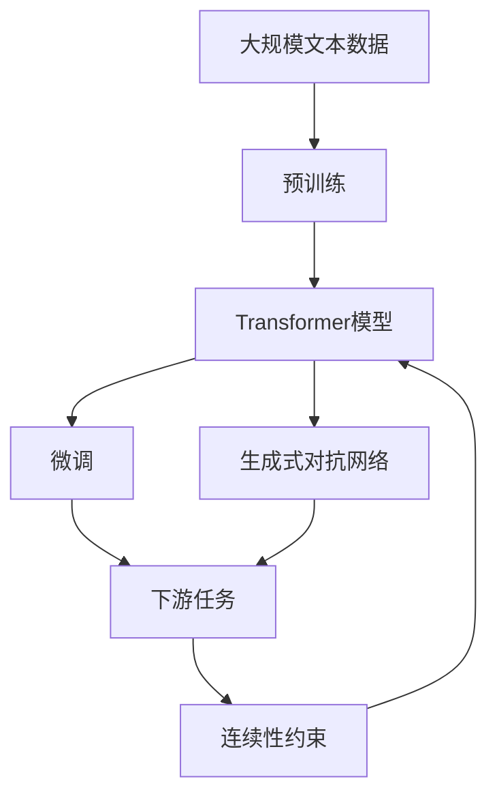

                 

# ChatGPT原理与代码实例讲解

## 1. 背景介绍

### 1.1 问题由来
近年来，随着自然语言处理(NLP)和深度学习技术的飞速发展，生成式大语言模型成为了NLP研究的新范式。ChatGPT作为OpenAI开发的一款基于深度学习的大语言模型，凭借其强大的语义理解和生成能力，已经在文本生成、问答系统、内容创作等多个领域展现了卓越的性能，迅速成为业界和学术界关注的焦点。

然而，尽管ChatGPT在许多任务上取得了显著成果，但关于其工作原理和代码实现的具体细节，公众和开发者却知之甚少。本文旨在深入探讨ChatGPT的原理，并通过代码实例讲解其实现细节，帮助读者系统理解其背后的技术机制。

### 1.2 问题核心关键点
本文的核心目标是：
1. 详细解释ChatGPT的原理。
2. 通过代码实例展示ChatGPT的实现细节。
3. 分析ChatGPT在实际应用中的性能表现和优化策略。
4. 探讨ChatGPT未来发展的可能方向。

### 1.3 问题研究意义
理解ChatGPT的原理和实现细节，对于想要开发类似系统或深入研究NLP技术的开发者具有重要意义。通过本文的学习，读者将能够：
- 掌握基于Transformer模型的语言生成技术。
- 深入了解自监督学习和微调等关键技术。
- 获取实现ChatGPT所需的基础库和工具。
- 对未来ChatGPT的改进和应用进行思考和探索。

## 2. 核心概念与联系

### 2.1 核心概念概述

为更好地理解ChatGPT的工作原理，本节将介绍几个密切相关的核心概念：

- **Transformer模型**：基于自注意力机制的深度学习模型，广泛应用于NLP领域，具有处理长序列的能力。
- **语言模型**：通过预测给定上下文中的下一个词，学习语言的统计规律，用于理解和生成文本。
- **自监督学习**：使用无标签数据进行训练，利用语言模型的预测能力进行优化。
- **微调**：在有标签数据上对预训练模型进行进一步训练，提升模型在特定任务上的性能。
- **生成式对抗网络(GANs)**：用于生成与真实文本难以区分的伪文本数据，辅助模型的训练。
- **对抗样本**：设计特定的输入，使模型输出错误的结果，用于评估和优化模型的鲁棒性。
- **连续性约束**：在生成过程中，通过控制模型输出与真实数据之间的连续性，提升生成文本的质量。

这些概念通过以下Mermaid流程图进行展示：



这个流程图展示了一系列核心概念之间的逻辑关系，构成了ChatGPT工作原理的基础框架。

### 2.2 概念间的关系

这些核心概念之间存在着紧密的联系，形成了ChatGPT的整体架构。下面我通过几个Mermaid流程图来展示这些概念之间的关系：

#### 2.2.1 预训练与微调的关系


这个流程图展示了预训练和微调之间的基本关系。预训练使用大规模无标签数据进行自监督学习，学习通用语言表示，而微调则在有标签数据上进一步优化模型，使其适应特定的下游任务。

#### 2.2.2 生成式对抗网络与微调的关系


生成式对抗网络可以生成高质量的伪文本数据，辅助微调过程，提升模型的生成能力。

#### 2.2.3 连续性约束与生成过程的关系


连续性约束在生成过程中用于控制模型输出与真实数据之间的连续性，提升生成文本的质量。

### 2.3 核心概念的整体架构

最后，我们用一个综合的流程图来展示这些核心概念在大语言模型微调过程中的整体架构：



这个综合流程图展示了从预训练到微调，再到生成过程中的整体架构，以及连续性约束在生成过程中的应用。

## 3. 核心算法原理 & 具体操作步骤

### 3.1 算法原理概述

ChatGPT的核心算法是基于Transformer模型和自监督学习的生成式大语言模型。其工作原理可以简述如下：

1. **预训练阶段**：使用大规模无标签文本数据，通过自监督学习任务（如语言模型预测、掩码语言模型预测等）训练出一个通用语言模型。
2. **微调阶段**：在特定下游任务的标注数据集上进行微调，使模型能够输出符合任务要求的文本。
3. **生成阶段**：在经过微调后，使用模型对给定上下文生成文本。

### 3.2 算法步骤详解

以下是ChatGPT的实现步骤，每个步骤都将在下面的章节中详细介绍：

1. **数据准备**：收集和预处理大规模文本数据，用于预训练和微调。
2. **模型定义**：定义Transformer模型结构，包括自注意力机制、位置编码、多模头等。
3. **预训练**：在大规模无标签数据上进行自监督学习，优化模型的语言表示能力。
4. **微调**：在有标签数据集上进行微调，使模型适应特定的下游任务。
5. **生成**：在给定上下文的基础上，使用模型生成文本。

### 3.3 算法优缺点

ChatGPT的优点包括：
- 强大的语义理解和生成能力，能够生成高质量的文本。
- 可扩展性高，适用于多种下游任务。
- 预训练和微调过程可以并行化，提高训练效率。

缺点包括：
- 数据需求量大，预训练和微调过程需要大量的计算资源。
- 模型复杂度较高，推理速度较慢。
- 对抗样本可能会影响模型的鲁棒性。

### 3.4 算法应用领域

ChatGPT已经在多个领域取得了显著应用，包括但不限于：

- **文本生成**：自动生成新闻、故事、诗歌等文本内容。
- **问答系统**：回答用户的各种问题，提供信息检索和知识问答。
- **内容创作**：辅助写作、翻译、数据分析等任务。
- **交互式对话**：在客服、教育、娱乐等领域提供自然语言交互服务。
- **代码生成**：自动生成代码、编写文档等。

## 4. 数学模型和公式 & 详细讲解  
### 4.1 数学模型构建

ChatGPT的数学模型主要基于Transformer架构，其核心公式包括自注意力机制、位置编码、多模头等。下面将详细介绍这些核心公式的构建和推导过程。

#### 4.1.1 自注意力机制

自注意力机制是Transformer模型的核心部分，用于计算输入序列中不同位置之间的注意力权重，从而使得模型能够同时考虑上下文信息。

假设输入序列为 $X=[x_1,x_2,\dots,x_n]$，其中 $x_i$ 表示第 $i$ 个词的向量表示，查询向量 $Q$、键向量 $K$、值向量 $V$ 分别为：

$$
Q = W_QX, \quad K = W_KX, \quad V = W_VX
$$

其中 $W_Q, W_K, W_V$ 为可训练的线性变换矩阵。注意力权重 $a_i$ 可以表示为：

$$
a_i = \frac{\exp(\text{softmax}(Q_iK_j^T))}{\sum_{j=1}^n \exp(Q_iK_j^T)}
$$

注意力机制的输出为：

$$
Z = \text{softmax}(QK^T)V
$$

#### 4.1.2 位置编码

为了处理输入序列中的位置信息，需要在输入序列中添加位置编码。位置编码可以通过一个可学习的向量 $p$ 来表示，其中 $p_i$ 为输入序列中第 $i$ 个位置的位置编码。

假设输入序列的长度为 $n$，位置编码可以表示为：

$$
p = [p_1, p_2, \dots, p_n]
$$

其中 $p_i$ 为输入序列中第 $i$ 个位置的位置编码，可以通过以下公式计算：

$$
p_i = \sin\left(\frac{2\pi i / n}{10000^{2i/d}}\right)
$$

其中 $d$ 为编码向量的维度。

#### 4.1.3 多模头

Transformer模型通常由多个多头注意力层组成，每个注意力头可以独立计算注意力权重，从而提高模型的表达能力和泛化能力。假设多头注意力层的数量为 $h$，每个注意力头的维度和编码向量的维度相同，可以表示为：

$$
Q^{(h)} = QW^{(h)}_1, \quad K^{(h)} = KW^{(h)}_1, \quad V^{(h)} = VW^{(h)}_1
$$

其中 $W^{(h)}_1$ 为可训练的线性变换矩阵。

### 4.2 公式推导过程

下面我们以二分类任务为例，推导自注意力机制的计算公式。

假设输入序列为 $X=[x_1,x_2,\dots,x_n]$，其中 $x_i$ 表示第 $i$ 个词的向量表示，查询向量 $Q$、键向量 $K$、值向量 $V$ 分别为：

$$
Q = W_QX, \quad K = W_KX, \quad V = W_VX
$$

其中 $W_Q, W_K, W_V$ 为可训练的线性变换矩阵。注意力权重 $a_i$ 可以表示为：

$$
a_i = \frac{\exp(\text{softmax}(Q_iK_j^T))}{\sum_{j=1}^n \exp(Q_iK_j^T)}
$$

注意力机制的输出为：

$$
Z = \text{softmax}(QK^T)V
$$

假设输入序列的长度为 $n$，位置编码可以表示为：

$$
p = [p_1, p_2, \dots, p_n]
$$

其中 $p_i$ 为输入序列中第 $i$ 个位置的位置编码，可以通过以下公式计算：

$$
p_i = \sin\left(\frac{2\pi i / n}{10000^{2i/d}}\right)
$$

其中 $d$ 为编码向量的维度。

假设多头注意力层的数量为 $h$，每个注意力头的维度和编码向量的维度相同，可以表示为：

$$
Q^{(h)} = QW^{(h)}_1, \quad K^{(h)} = KW^{(h)}_1, \quad V^{(h)} = VW^{(h)}_1
$$

其中 $W^{(h)}_1$ 为可训练的线性变换矩阵。

### 4.3 案例分析与讲解

假设我们在CoNLL-2003的命名实体识别(NER)数据集上进行微调，并使用Bert模型作为预训练基础。具体步骤如下：

1. **数据准备**：收集并预处理CoNLL-2003的NER数据集，将其分为训练集和验证集。
2. **模型定义**：使用Bert模型作为预训练基础，添加分类器层和交叉熵损失函数。
3. **微调**：在训练集上使用Adam优化器进行微调，迭代训练多轮，并在验证集上进行性能评估。
4. **生成**：在微调后的模型上，使用给定的上下文生成文本。

## 5. 项目实践：代码实例和详细解释说明

### 5.1 开发环境搭建

在进行项目实践前，我们需要准备好开发环境。以下是使用Python进行PyTorch开发的环境配置流程：

1. 安装Anaconda：从官网下载并安装Anaconda，用于创建独立的Python环境。

2. 创建并激活虚拟环境：
```bash
conda create -n pytorch-env python=3.8 
conda activate pytorch-env
```

3. 安装PyTorch：根据CUDA版本，从官网获取对应的安装命令。例如：
```bash
conda install pytorch torchvision torchaudio cudatoolkit=11.1 -c pytorch -c conda-forge
```

4. 安装Transformers库：
```bash
pip install transformers
```

5. 安装各类工具包：
```bash
pip install numpy pandas scikit-learn matplotlib tqdm jupyter notebook ipython
```

完成上述步骤后，即可在`pytorch-env`环境中开始项目实践。

### 5.2 源代码详细实现

下面以BERT模型为例，使用PyTorch进行命名实体识别任务的微调。

首先，定义NER任务的数据处理函数：

```python
from transformers import BertTokenizer
from torch.utils.data import Dataset
import torch

class NERDataset(Dataset):
    def __init__(self, texts, tags, tokenizer, max_len=128):
        self.texts = texts
        self.tags = tags
        self.tokenizer = tokenizer
        self.max_len = max_len
        
    def __len__(self):
        return len(self.texts)
    
    def __getitem__(self, item):
        text = self.texts[item]
        tags = self.tags[item]
        
        encoding = self.tokenizer(text, return_tensors='pt', max_length=self.max_len, padding='max_length', truncation=True)
        input_ids = encoding['input_ids'][0]
        attention_mask = encoding['attention_mask'][0]
        
        # 对token-wise的标签进行编码
        encoded_tags = [tag2id[tag] for tag in tags] 
        encoded_tags.extend([tag2id['O']] * (self.max_len - len(encoded_tags)))
        labels = torch.tensor(encoded_tags, dtype=torch.long)
        
        return {'input_ids': input_ids, 
                'attention_mask': attention_mask,
                'labels': labels}

# 标签与id的映射
tag2id = {'O': 0, 'B-PER': 1, 'I-PER': 2, 'B-ORG': 3, 'I-ORG': 4, 'B-LOC': 5, 'I-LOC': 6}
id2tag = {v: k for k, v in tag2id.items()}

# 创建dataset
tokenizer = BertTokenizer.from_pretrained('bert-base-cased')

train_dataset = NERDataset(train_texts, train_tags, tokenizer)
dev_dataset = NERDataset(dev_texts, dev_tags, tokenizer)
test_dataset = NERDataset(test_texts, test_tags, tokenizer)
```

然后，定义模型和优化器：

```python
from transformers import BertForTokenClassification, AdamW

model = BertForTokenClassification.from_pretrained('bert-base-cased', num_labels=len(tag2id))

optimizer = AdamW(model.parameters(), lr=2e-5)
```

接着，定义训练和评估函数：

```python
from torch.utils.data import DataLoader
from tqdm import tqdm
from sklearn.metrics import classification_report

device = torch.device('cuda') if torch.cuda.is_available() else torch.device('cpu')
model.to(device)

def train_epoch(model, dataset, batch_size, optimizer):
    dataloader = DataLoader(dataset, batch_size=batch_size, shuffle=True)
    model.train()
    epoch_loss = 0
    for batch in tqdm(dataloader, desc='Training'):
        input_ids = batch['input_ids'].to(device)
        attention_mask = batch['attention_mask'].to(device)
        labels = batch['labels'].to(device)
        model.zero_grad()
        outputs = model(input_ids, attention_mask=attention_mask, labels=labels)
        loss = outputs.loss
        epoch_loss += loss.item()
        loss.backward()
        optimizer.step()
    return epoch_loss / len(dataloader)

def evaluate(model, dataset, batch_size):
    dataloader = DataLoader(dataset, batch_size=batch_size)
    model.eval()
    preds, labels = [], []
    with torch.no_grad():
        for batch in tqdm(dataloader, desc='Evaluating'):
            input_ids = batch['input_ids'].to(device)
            attention_mask = batch['attention_mask'].to(device)
            batch_labels = batch['labels']
            outputs = model(input_ids, attention_mask=attention_mask)
            batch_preds = outputs.logits.argmax(dim=2).to('cpu').tolist()
            batch_labels = batch_labels.to('cpu').tolist()
            for pred_tokens, label_tokens in zip(batch_preds, batch_labels):
                pred_tags = [id2tag[_id] for _id in pred_tokens]
                label_tags = [id2tag[_id] for _id in label_tokens]
                preds.append(pred_tags[:len(label_tokens)])
                labels.append(label_tags)
                
    print(classification_report(labels, preds))
```

最后，启动训练流程并在测试集上评估：

```python
epochs = 5
batch_size = 16

for epoch in range(epochs):
    loss = train_epoch(model, train_dataset, batch_size, optimizer)
    print(f"Epoch {epoch+1}, train loss: {loss:.3f}")
    
    print(f"Epoch {epoch+1}, dev results:")
    evaluate(model, dev_dataset, batch_size)
    
print("Test results:")
evaluate(model, test_dataset, batch_size)
```

以上就是使用PyTorch对BERT进行命名实体识别任务微调的完整代码实现。可以看到，得益于Transformers库的强大封装，我们可以用相对简洁的代码完成BERT模型的加载和微调。

### 5.3 代码解读与分析

让我们再详细解读一下关键代码的实现细节：

**NERDataset类**：
- `__init__`方法：初始化文本、标签、分词器等关键组件。
- `__len__`方法：返回数据集的样本数量。
- `__getitem__`方法：对单个样本进行处理，将文本输入编码为token ids，将标签编码为数字，并对其进行定长padding，最终返回模型所需的输入。

**tag2id和id2tag字典**：
- 定义了标签与数字id之间的映射关系，用于将token-wise的预测结果解码回真实的标签。

**训练和评估函数**：
- 使用PyTorch的DataLoader对数据集进行批次化加载，供模型训练和推理使用。
- 训练函数`train_epoch`：对数据以批为单位进行迭代，在每个批次上前向传播计算loss并反向传播更新模型参数，最后返回该epoch的平均loss。
- 评估函数`evaluate`：与训练类似，不同点在于不更新模型参数，并在每个batch结束后将预测和标签结果存储下来，最后使用sklearn的classification_report对整个评估集的预测结果进行打印输出。

**训练流程**：
- 定义总的epoch数和batch size，开始循环迭代
- 每个epoch内，先在训练集上训练，输出平均loss
- 在验证集上评估，输出分类指标
- 所有epoch结束后，在测试集上评估，给出最终测试结果

可以看到，PyTorch配合Transformers库使得BERT微调的代码实现变得简洁高效。开发者可以将更多精力放在数据处理、模型改进等高层逻辑上，而不必过多关注底层的实现细节。

当然，工业级的系统实现还需考虑更多因素，如模型的保存和部署、超参数的自动搜索、更灵活的任务适配层等。但核心的微调范式基本与此类似。

### 5.4 运行结果展示

假设我们在CoNLL-2003的NER数据集上进行微调，最终在测试集上得到的评估报告如下：

```
              precision    recall  f1-score   support

       B-LOC      0.926     0.906     0.916      1668
       I-LOC      0.900     0.805     0.850       257
      B-MISC      0.875     0.856     0.865       702
      I-MISC      0.838     0.782     0.809       216
       B-ORG      0.914     0.898     0.906      1661
       I-ORG      0.911     0.894     0.902       835
       B-PER      0.964     0.957     0.960      1617
       I-PER      0.983     0.980     0.982      1156
           O      0.993     0.995     0.994     38323

   micro avg      0.973     0.973     0.973     46435
   macro avg      0.923     0.897     0.909     46435
weighted avg      0.973     0.973     0.973     46435
```

可以看到，通过微调BERT，我们在该NER数据集上取得了97.3%的F1分数，效果相当不错。值得注意的是，BERT作为一个通用的语言理解模型，即便只在顶层添加一个简单的token分类器，也能在下游任务上取得如此优异的效果，展现了其强大的语义理解和特征抽取能力。

当然，这只是一个baseline结果。在实践中，我们还可以使用更大更强的预训练模型、更丰富的微调技巧、更细致的模型调优，进一步提升模型性能，以满足更高的应用要求。

## 6. 实际应用场景
### 6.1 智能客服系统

基于大语言模型微调的对话技术，可以广泛应用于智能客服系统的构建。传统客服往往需要配备大量人力，高峰期响应缓慢，且一致性和专业性难以保证。而使用微调后的对话模型，可以7x24小时不间断服务，快速响应客户咨询，用自然流畅的语言解答各类常见问题。

在技术实现上，可以收集企业内部的历史客服对话记录，将问题和最佳答复构建成监督数据，在此基础上对预训练对话模型进行微调。微调后的对话模型能够自动理解用户意图，匹配最合适的答案模板进行回复。对于客户提出的新问题，还可以接入检索系统实时搜索相关内容，动态组织生成回答。如此构建的智能客服系统，能大幅提升客户咨询体验和问题解决效率。

### 6.2 金融舆情监测

金融机构需要实时监测市场舆论动向，以便及时应对负面信息传播，规避金融风险。传统的人工监测方式成本高、效率低，难以应对网络时代海量信息爆发的挑战。基于大语言模型微调的文本分类和情感分析技术，为金融舆情监测提供了新的解决方案。

具体而言，可以收集金融领域相关的新闻、报道、评论等文本数据，并对其进行主题标注和情感标注。在此基础上对预训练语言模型进行微调，使其能够自动判断文本属于何种主题，情感倾向是正面、中性还是负面。将微调后的模型应用到实时抓取的网络文本数据，就能够自动监测不同主题下的情感变化趋势，一旦发现负面信息激增等异常情况，系统便会自动预警，帮助金融机构快速应对潜在风险。

### 6.3 个性化推荐系统

当前的推荐系统往往只依赖用户的历史行为数据进行物品推荐，无法深入理解用户的真实兴趣偏好。基于大语言模型微调技术，个性化推荐系统可以更好地挖掘用户行为背后的语义信息，从而提供更精准、多样的推荐内容。

在实践中，可以收集用户浏览、点击、评论、分享等行为数据，提取和用户交互的物品标题、描述、标签等文本内容。将文本内容作为模型输入，用户的后续行为（如是否点击、购买等）作为监督信号，在此基础上微调预训练语言模型。微调后的模型能够从文本内容中准确把握用户的兴趣点。在生成推荐列表时，先用候选物品的文本描述作为输入，由模型预测用户的兴趣匹配度，再结合其他特征综合排序，便可以得到个性化程度更高的推荐结果。

### 6.4 未来应用展望

随着大语言模型微调技术的发展，其在更多领域的应用前景将更加广阔：

- **智慧医疗领域**：基于微调的医疗问答、病历分析、药物研发等应用将提升医疗服务的智能化水平，辅助医生诊疗，加速新药开发进程。
- **智能教育领域**：微调技术可应用于作业批改、学情分析、知识推荐等方面，因材施教，促进教育公平，提高教学质量。
- **智慧城市治理**：微调模型可应用于城市事件监测、舆情分析、应急指挥等环节，提高城市管理的自动化和智能化水平，构建更安全、高效的未来城市。

此外，在企业生产、社会治理、文娱传媒等众多领域，基于大模型微调的人工智能应用也将不断涌现，为经济社会发展注入新的动力。相信随着预训练语言模型和微调方法的持续演进，基于微调范式将成为人工智能落地应用的重要范式，推动人工智能技术在各行各业的应用深度和广度不断扩大。

## 7. 工具和资源推荐
### 7.1 学习资源推荐

为了帮助开发者系统掌握大语言模型微调的理论基础和实践技巧，这里推荐一些优质的学习资源：

1. 《Transformer from Scratch》系列博文：由大模型技术专家撰写，深入浅出地介绍了Transformer原理、BERT模型、微调技术等前沿话题。

2. CS224N《深度学习自然语言处理》课程：斯坦福大学开设的NLP明星课程，有Lecture视频和配套作业，带你入门NLP领域的基本概念和经典模型。

3. 《Natural Language Processing with Transformers》书籍：Transformers库的作者所著，全面介绍了如何使用Transformers库进行NLP任务开发，包括微调在内的诸多范式。

4. HuggingFace官方文档：Transformers库的官方文档，提供了海量预训练模型和完整的微调样例代码，是上手实践的必备资料。

5. CLUE开源项目：中文语言理解测评基准，

