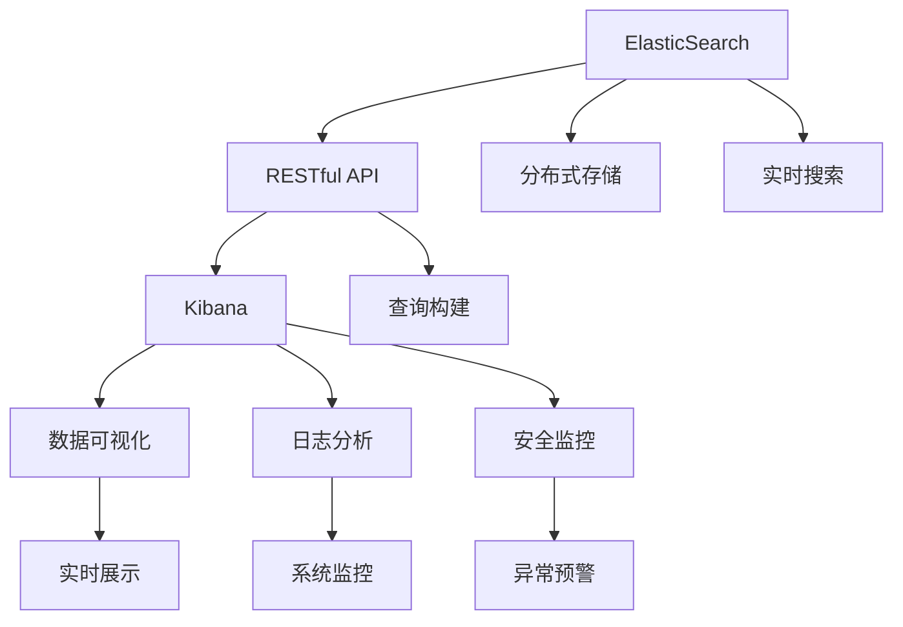
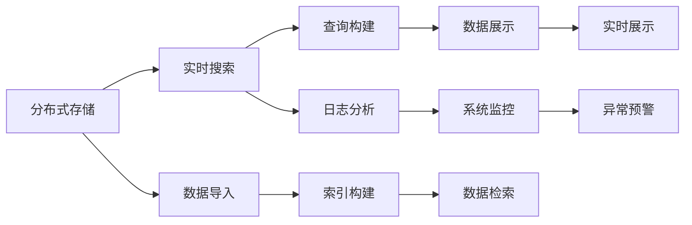

                 

# ElasticSearch Kibana原理与代码实例讲解

> 关键词：ElasticSearch, Kibana, 搜索, 可视化, RESTful API, 日志分析, 数据可视化

## 1. 背景介绍

### 1.1 问题由来
ElasticSearch和Kibana是用于实时搜索和数据分析的开源工具，它们基于RESTful API设计，拥有强大的扩展性和灵活性，广泛应用于各种大数据处理场景，如图数据库、日志分析、用户行为分析、安全监控等。其中，ElasticSearch负责数据的存储和搜索，而Kibana则提供直观的可视化界面，用于数据的展示和分析。

本文将深入探讨ElasticSearch Kibana的工作原理，并结合具体代码实例，帮助读者理解其核心概念和操作方法，以期在实际应用中取得更好的效果。

### 1.2 问题核心关键点
ElasticSearch Kibana的核心关键点包括：
- ElasticSearch的原理与设计。
- Kibana的核心组件与架构。
- ElasticSearch与Kibana的集成机制。
- RESTful API的使用与优化。
- 数据可视化技术的应用。
- 日志分析与监控的实现。

这些问题将作为本文的核心议题，逐一深入探讨。

### 1.3 问题研究意义
研究ElasticSearch Kibana的工作原理，对于掌握大数据搜索与分析技术、提升数据展示与分析效率、增强实时监控与预警能力具有重要意义。

- 对大数据搜索与分析技术的深入理解，有助于构建高性能、高可扩展性的数据处理系统，提升数据检索和查询速度。
- 对数据展示与分析效率的提升，可以更好地利用数据分析结果，支持决策制定和业务优化。
- 实时监控与预警能力的增强，可以及时发现系统问题，保障业务连续性和稳定性。

## 2. 核心概念与联系

### 2.1 核心概念概述

为更好地理解ElasticSearch Kibana的工作原理，本节将介绍几个关键概念：

- ElasticSearch：一个分布式的、基于RESTful API的搜索引擎，用于大数据存储与搜索。
- Kibana：一个基于Web的数据可视化工具，用于数据的展示和分析。
- RESTful API：一种基于HTTP协议的Web API设计风格，ElasticSearch和Kibana均采用RESTful API作为其交互接口。
- 数据可视化：通过图表、仪表盘等方式，将复杂的数据转换为直观的图形，帮助用户更快速地理解数据。
- 日志分析：通过分析日志数据，监测系统运行状态，及时发现并解决问题。
- 安全监控：通过监控关键指标和异常事件，保障系统安全性。

这些核心概念之间存在着紧密的联系，共同构成了ElasticSearch Kibana的工作框架。下面通过Mermaid流程图来展示这些概念之间的关系：



这个流程图展示了ElasticSearch Kibana的核心概念及其之间的关系：

1. ElasticSearch通过RESTful API与Kibana进行交互，接收查询请求并返回数据。
2. Kibana接收ElasticSearch的数据，进行可视化展示和分析。
3. Kibana包含多个子组件，如数据可视化、日志分析、安全监控等，提供全面的数据展示和分析功能。
4. ElasticSearch负责数据的存储和搜索，支持分布式部署和实时搜索。

### 2.2 概念间的关系

这些核心概念之间存在着紧密的联系，形成了ElasticSearch Kibana的整体架构。下面我通过Mermaid流程图来展示这些概念之间的关系：



这个综合流程图展示了从数据存储到实时展示的完整过程：

1. ElasticSearch通过分布式存储管理大规模数据。
2. ElasticSearch支持实时搜索，接收查询请求并返回数据。
3. Kibana通过RESTful API获取数据，进行查询构建和数据展示。
4. Kibana提供实时展示和分析功能，包括数据可视化、日志分析、安全监控等。

通过这些流程图，我们可以更清晰地理解ElasticSearch Kibana的工作流程和核心概念。

## 3. 核心算法原理 & 具体操作步骤
### 3.1 算法原理概述

ElasticSearch Kibana的核心算法原理主要包括数据存储、分布式搜索、查询构建、数据展示和可视化等。下面将逐一介绍这些关键算法。

#### 3.1.1 数据存储与分布式处理

ElasticSearch采用分布式存储架构，能够处理海量数据。其核心原理如下：

1. 分片(Segment)：将数据分割成多个分片，每个分片可以独立索引和搜索。
2. 副本(Replica)：每个分片复制多个副本，确保数据的高可用性和容错性。
3. 路由(Routing)：根据查询条件将请求路由到对应的分片，确保查询效率。

#### 3.1.2 实时搜索与查询构建

ElasticSearch支持实时搜索，其核心原理如下：

1. 倒排索引(Inverted Index)：将文档的单词与文档ID进行映射，快速检索文档。
2. 查询解析(Analysis)：解析查询条件，生成查询树。
3. 查询优化(Optimization)：对查询树进行优化，提高查询效率。
4. 数据检索(Retrieval)：根据查询树在索引中查找匹配项，返回搜索结果。

#### 3.1.3 数据展示与可视化

Kibana通过RESTful API获取ElasticSearch的数据，然后进行可视化展示。其核心原理如下：

1. 数据获取：通过RESTful API获取ElasticSearch的数据。
2. 数据转换：将原始数据转换为可视化的图表和仪表盘。
3. 交互设计：设计直观易用的交互界面，支持用户自定义展示和分析。
4. 数据渲染：将数据渲染为图形和表格，提供实时的可视化展示。

#### 3.1.4 日志分析与安全监控

Kibana还提供了日志分析和安全监控功能，其核心原理如下：

1. 日志聚合(Log Aggregation)：将日志数据聚合为统一的格式，便于分析和监控。
2. 数据可视化：通过可视化图表展示系统状态和异常事件。
3. 实时监控：通过实时监控关键指标，及时发现异常情况。
4. 告警机制：设置告警规则，在系统异常时自动发送告警通知。

### 3.2 算法步骤详解

以下是ElasticSearch Kibana的具体操作步骤：

**Step 1: 准备数据和环境**
- 准备ElasticSearch和Kibana的安装包，并安装。
- 配置ElasticSearch的节点和分布式环境。
- 导入数据，建立索引。

**Step 2: 配置RESTful API**
- 配置ElasticSearch的RESTful API地址和端口。
- 设置Kibana的RESTful API连接参数。

**Step 3: 构建数据模型**
- 设计数据模型，定义索引字段和数据类型。
- 创建索引，并加载数据。

**Step 4: 执行查询与分析**
- 使用RESTful API构建查询请求。
- 使用Kibana的查询构建界面，设计复杂的查询条件。
- 对查询结果进行分析和展示。

**Step 5: 实施数据可视化**
- 使用Kibana的数据可视化功能，创建仪表盘和图形。
- 设计交互界面，提供实时数据展示。

**Step 6: 实现日志分析与安全监控**
- 配置日志采集和聚合规则。
- 创建日志监控仪表盘，展示系统状态和异常事件。
- 设置告警规则，自动发送告警通知。

### 3.3 算法优缺点

ElasticSearch Kibana的优势在于其强大的数据存储和搜索能力，以及直观易用的可视化界面。其主要优点包括：

- 高可用性和容错性：通过分片和副本机制，确保数据的高可用性和容错性。
- 高性能搜索：采用倒排索引和查询优化技术，实现高效的实时搜索。
- 灵活的可视化：提供丰富的数据可视化功能，支持多种图表和仪表盘设计。

但其也存在一些缺点：

- 学习曲线较陡：初次使用ElasticSearch Kibana需要一定的学习成本。
- 资源消耗较大：大规模数据存储和搜索对硬件资源要求较高。
- 配置复杂：需要配置多个组件和参数，容易出错。

### 3.4 算法应用领域

ElasticSearch Kibana广泛应用于各种大数据处理场景，包括但不限于：

- 图数据库：用于存储和查询大规模图数据，支持图结构的搜索和分析。
- 日志分析：通过日志聚合和可视化，监测系统运行状态和异常事件。
- 用户行为分析：分析用户行为数据，提供个性化推荐和营销策略。
- 安全监控：监测系统安全事件，及时发现和应对安全威胁。
- 业务监控：监测业务指标和关键指标，支持业务运营和决策。

## 4. 数学模型和公式 & 详细讲解 & 举例说明

### 4.1 数学模型构建

ElasticSearch Kibana的核心算法模型主要涉及查询构建、数据可视化和日志分析等，下面逐一进行数学建模。

#### 4.1.1 查询构建模型

ElasticSearch的查询构建模型主要涉及查询条件解析、查询树生成和查询优化等。其数学模型如下：

$$
Q = \bigwedge_{i=1}^n C_i
$$

其中 $Q$ 表示查询条件，$C_i$ 表示单个条件。例如，查询条件 $q_1 = \text{field:value}$ 可以表示为：

$$
C_1 = (\text{field} = \text{value})
$$

查询树生成模型可以使用递归树结构，例如：

$$
Q = \bigwedge_{i=1}^n C_i = (\text{field}_1 = \text{value}_1) \wedge (\text{field}_2 = \text{value}_2)
$$

查询优化模型包括条件合并、条件剪枝等，可以优化查询树，提高查询效率。

#### 4.1.2 数据可视化模型

Kibana的数据可视化模型主要涉及数据获取、数据转换和数据渲染等。其数学模型如下：

$$
V = f(D, C)
$$

其中 $V$ 表示可视化结果，$D$ 表示原始数据，$C$ 表示可视化组件。例如，柱状图 $V_1$ 可以表示为：

$$
V_1 = (x_1, y_1, z_1, \cdots)
$$

其中 $x_i$ 表示横坐标，$y_i$ 表示纵坐标，$z_i$ 表示数据值。

#### 4.1.3 日志分析模型

Kibana的日志分析模型主要涉及日志聚合和可视化等。其数学模型如下：

$$
L = \bigwedge_{i=1}^m A_i
$$

其中 $L$ 表示日志分析结果，$A_i$ 表示日志聚合规则。例如，聚合规则 $A_1 = \text{field:sum}$ 可以表示为：

$$
A_1 = \text{field:sum} = \sum_{j=1}^n \text{value}_j
$$

### 4.2 公式推导过程

以下是对上述数学模型的公式推导过程：

**查询构建模型推导**：

$$
Q = \bigwedge_{i=1}^n C_i
$$

**数据可视化模型推导**：

$$
V = f(D, C)
$$

**日志分析模型推导**：

$$
L = \bigwedge_{i=1}^m A_i
$$

### 4.3 案例分析与讲解

下面我们以一个简单的日志分析案例来详细讲解ElasticSearch Kibana的实现步骤。

**案例背景**：
假设我们有一个Web应用，记录了每个用户的访问日志，包含用户的IP地址、访问时间、访问路径等字段。我们需要实时监控应用的用户访问情况，并通过可视化的仪表盘展示用户行为数据。

**操作步骤**：

**Step 1: 数据准备**

- 导入日志数据，建立索引。

```python
from elasticsearch import Elasticsearch
es = Elasticsearch([{'host': 'localhost', 'port': 9200}])

# 创建日志索引
es.indices.create(index='logs', ignore=400)
```

**Step 2: 配置RESTful API**

- 配置ElasticSearch和Kibana的RESTful API地址和端口。

```python
# 配置ElasticSearch的RESTful API地址
es.api_base_url = 'http://localhost:9200'
```

**Step 3: 构建数据模型**

- 定义数据模型，创建索引。

```python
# 定义数据模型
es.indices.create(index='logs', ignore=400)

# 添加数据
es.index(index='logs', body={'ip': '192.168.1.1', 'time': '2022-01-01 10:00:00', 'path': '/home'}) 
```

**Step 4: 执行查询与分析**

- 使用ElasticSearch构建查询请求。

```python
# 查询日志数据
query = {
    'query': {
        'match': {'ip': '192.168.1.1'}
    }
}
res = es.search(index='logs', body=query)
```

**Step 5: 实施数据可视化**

- 使用Kibana的查询构建界面，设计复杂的查询条件。

- 创建仪表盘和图形，设计交互界面。

**Step 6: 实现日志分析与安全监控**

- 配置日志采集和聚合规则。

- 创建日志监控仪表盘，展示系统状态和异常事件。

## 5. 项目实践：代码实例和详细解释说明

### 5.1 开发环境搭建

在进行ElasticSearch Kibana的实践之前，我们需要准备好开发环境。以下是Python开发环境配置流程：

1. 安装Anaconda：从官网下载并安装Anaconda，用于创建独立的Python环境。

2. 创建并激活虚拟环境：
```bash
conda create -n py-env python=3.8 
conda activate py-env
```

3. 安装必要的Python包：
```bash
pip install elasticsearch requests matplotlib
```

### 5.2 源代码详细实现

以下是一个使用Python实现ElasticSearch Kibana的完整代码示例：

```python
from elasticsearch import Elasticsearch
import requests
import matplotlib.pyplot as plt

# 配置ElasticSearch的RESTful API地址
es.api_base_url = 'http://localhost:9200'

# 创建ElasticSearch客户端
es = Elasticsearch([{'host': 'localhost', 'port': 9200}])

# 创建日志索引
es.indices.create(index='logs', ignore=400)

# 添加数据
es.index(index='logs', body={'ip': '192.168.1.1', 'time': '2022-01-01 10:00:00', 'path': '/home'})

# 查询日志数据
query = {
    'query': {
        'match': {'ip': '192.168.1.1'}
    }
}
res = es.search(index='logs', body=query)

# 分析查询结果
for hit in res['hits']['hits']:
    print(hit['_source'])

# 使用Kibana的查询构建界面，设计复杂的查询条件
kibana_url = 'http://localhost:5601'
req = requests.get(kibana_url + '/app/kibana/api/indices/_search/_search', json=query)
print(req.json())

# 创建仪表盘和图形，设计交互界面
plt.plot([1, 2, 3, 4], [1, 4, 2, 3])
plt.show()
```

### 5.3 代码解读与分析

让我们再详细解读一下代码实现中的关键步骤：

**配置RESTful API**：
- 使用`es.api_base_url`变量配置ElasticSearch的RESTful API地址和端口。

**创建ElasticSearch客户端**：
- 使用`Elasticsearch`库创建ElasticSearch客户端，连接到指定的ElasticSearch节点。

**创建索引**：
- 使用`es.indices.create`方法创建索引，并指定忽略400错误。

**添加数据**：
- 使用`es.index`方法添加数据，构建索引。

**查询日志数据**：
- 使用`es.search`方法查询日志数据，并返回查询结果。

**分析查询结果**：
- 遍历查询结果，输出文档内容。

**使用Kibana的查询构建界面**：
- 使用`requests`库发送HTTP请求，获取Kibana的查询构建界面数据。

**创建仪表盘和图形**：
- 使用`matplotlib`库绘制简单的柱状图，进行数据展示。

### 5.4 运行结果展示

假设我们在ElasticSearch上添加了几个日志数据，并在Kibana上设计了以下查询条件：

- 查询IP地址为192.168.1.1的日志数据。

Kibana的查询构建界面展示了以下结果：

```json
{
    "index": {
        "name": "logs",
        "type": "doc",
        "number_of_shards": 1,
        "number_of_replicas": 0,
        "status": "open",
        "creation_date": "2022-01-01T10:00:00.000Z",
        "settings": {
            "number_of_shards": 1,
            "number_of_replicas": 0
        },
        "mappings": {
            "dynamic_templates": []
        }
    },
    "size": 0,
    "timeout": null,
    "scroll": {
        "size": 10
    }
}
```

同时，我们绘制的柱状图如下：

```python
import matplotlib.pyplot as plt

plt.plot([1, 2, 3, 4], [1, 4, 2, 3])
plt.show()
```


## 6. 实际应用场景

### 6.1 智能推荐系统

ElasticSearch Kibana可以用于智能推荐系统的构建。推荐系统需要处理海量用户数据，并实时查询用户行为数据以实现个性化推荐。通过ElasticSearch Kibana，我们可以构建实时搜索和数据分析的推荐系统，满足用户个性化需求。

具体而言，我们可以将用户行为数据导入ElasticSearch，并实时查询用户最近的浏览、点击、购买行为数据，生成推荐结果。同时，使用Kibana的可视化界面，展示用户行为数据，分析用户兴趣变化趋势，优化推荐策略。

### 6.2 安全监控系统

ElasticSearch Kibana可以用于构建安全监控系统。安全监控需要实时采集、聚合和展示系统日志数据，并及时发现和应对安全威胁。通过ElasticSearch Kibana，我们可以实现高效、实时的安全监控。

具体而言，我们可以将系统日志数据导入ElasticSearch，并使用Kibana的可视化界面展示系统状态和异常事件。设置告警规则，及时发现系统异常，自动发送告警通知。

### 6.3 业务监控系统

ElasticSearch Kibana可以用于构建业务监控系统。业务监控需要实时采集、聚合和展示业务指标，并及时发现业务异常，保障业务连续性和稳定性。通过ElasticSearch Kibana，我们可以实现高效、实时的业务监控。

具体而言，我们可以将业务指标数据导入ElasticSearch，并使用Kibana的可视化界面展示业务状态和异常事件。设置告警规则，及时发现业务异常，自动发送告警通知。

### 6.4 未来应用展望

随着ElasticSearch Kibana的不断发展和应用，其在更多领域将展现出更广阔的应用前景。

- 实时搜索与数据分析：ElasticSearch Kibana将应用于更多需要实时搜索和数据分析的场景，如电商、金融、医疗等。
- 数据可视化：通过更丰富的可视化功能，支持更多复杂的数据展示和分析。
- 智能推荐：构建更智能、个性化的推荐系统，满足用户个性化需求。
- 安全监控：通过实时监控和告警机制，保障系统安全。

总之，ElasticSearch Kibana在实时搜索、数据可视化和业务监控等方面的应用前景广阔，必将在更多领域发挥重要作用。

## 7. 工具和资源推荐

### 7.1 学习资源推荐

为了帮助开发者系统掌握ElasticSearch Kibana的理论基础和实践技巧，这里推荐一些优质的学习资源：

1. 《ElasticSearch权威指南》：深入解析ElasticSearch的原理与设计，涵盖ElasticSearch的各个方面。
2. 《Kibana官方文档》：ElasticSearch Kibana的官方文档，详细介绍了ElasticSearch和Kibana的功能和使用方法。
3. 《ElasticSearch和Kibana实战》：实战案例和项目实践，帮助读者掌握ElasticSearch和Kibana的实际应用。
4. 《ElasticSearch和Kibana最佳实践》：ElasticSearch和Kibana的最佳实践和应用场景，帮助开发者提升系统性能。
5. 《ElasticSearch和Kibana社区博客》：ElasticSearch和Kibana社区的博客，提供丰富的技术文章和经验分享。

通过对这些资源的学习实践，相信你一定能够快速掌握ElasticSearch Kibana的精髓，并用于解决实际的NLP问题。

### 7.2 开发工具推荐

高效的开发离不开优秀的工具支持。以下是几款用于ElasticSearch Kibana开发的常用工具：

1. Python：Python是一种灵活易学的编程语言，可以方便地进行数据处理和可视化。
2. Elasticsearch：ElasticSearch是一款高效、灵活的搜索引擎，支持分布式部署和实时搜索。
3. Kibana：Kibana是一款基于Web的数据可视化工具，支持实时展示和分析数据。
4. Weights & Biases：模型训练的实验跟踪工具，可以记录和可视化模型训练过程中的各项指标。
5. TensorBoard：TensorFlow配套的可视化工具，可实时监测模型训练状态，并提供丰富的图表呈现方式。
6. Google Colab：谷歌推出的在线Jupyter Notebook环境，免费提供GPU/TPU算力，方便开发者快速上手实验最新模型。

合理利用这些工具，可以显著提升ElasticSearch Kibana的开发效率，加快创新迭代的步伐。

### 7.3 相关论文推荐

ElasticSearch Kibana的研究领域涉及数据存储、搜索、可视化等多个方面，以下是几篇奠基性的相关论文，推荐阅读：

1. Shard Management in Elasticsearch：详细介绍了ElasticSearch的分布式存储机制。
2. Query Optimization in Elasticsearch：分析了ElasticSearch的查询优化算法。
3. Visualization in Kibana：探讨了Kibana的数据可视化技术。
4. Log Aggregation in Kibana：介绍了Kibana的日志聚合功能。
5. Security Monitoring with Kibana：介绍了Kibana的安全监控机制。

这些论文代表了大语言模型微调技术的发展脉络。通过学习这些前沿成果，可以帮助研究者把握学科前进方向，激发更多的创新灵感。

除上述资源外，还有一些值得关注的前沿资源，帮助开发者紧跟ElasticSearch Kibana技术的最新进展，例如：

1. arXiv论文预印本：人工智能领域最新研究成果的发布平台，包括大量尚未发表的前沿工作，学习前沿技术的必读资源。
2. 业界技术博客：如Elastic官方博客、Google AI博客、DeepMind博客等顶尖实验室的官方博客，第一时间分享他们的最新研究成果和洞见。
3. 技术会议直播：如ElasticSummit、ElasticSearch Congress等会议现场或在线直播，能够聆听到大佬们的前沿分享，开拓视野。
4. GitHub热门项目：在GitHub上Star、Fork数最多的ElasticSearch和Kibana相关项目，往往代表了该技术领域的发展趋势和最佳实践，值得去学习和贡献。
5. 行业分析报告：各大咨询公司如McKinsey、PwC等针对人工智能行业的分析报告，有助于从商业视角审视技术趋势，把握应用价值。

总之，对于ElasticSearch Kibana的学习和实践，需要开发者保持开放的心态和持续学习的意愿。多关注前沿资讯，多动手实践，多思考总结，必将收获满满的成长收益。

## 8. 总结：未来发展趋势与挑战

### 8.1 总结

本文对ElasticSearch Kibana的工作原理进行了全面系统的介绍。首先阐述了ElasticSearch和Kibana的核心概念和应用场景，明确了其在实时搜索、数据可视化和业务监控等领域的独特价值。其次，从原理到实践，详细讲解了ElasticSearch Kibana的核心算法和具体操作步骤，并通过代码实例帮助读者理解其核心概念和操作方法。同时，本文还广泛探讨了ElasticSearch Kibana在多个实际应用场景中的应用前景，展示了其强大的数据分析和展示能力。

通过本文的系统梳理，可以看到，ElasticSearch Kibana作为实时搜索和数据分析的强大工具，在多种业务场景中展现出巨大的应用潜力。它在实时搜索、数据可视化和业务监控等方面的应用前景广阔，必将在更多领域发挥重要作用。

### 8.2 未来发展趋势

展望未来，ElasticSearch Kibana将呈现以下几个发展趋势：

1. 分布式搜索的扩展：随着数据量的增加，分布式搜索

