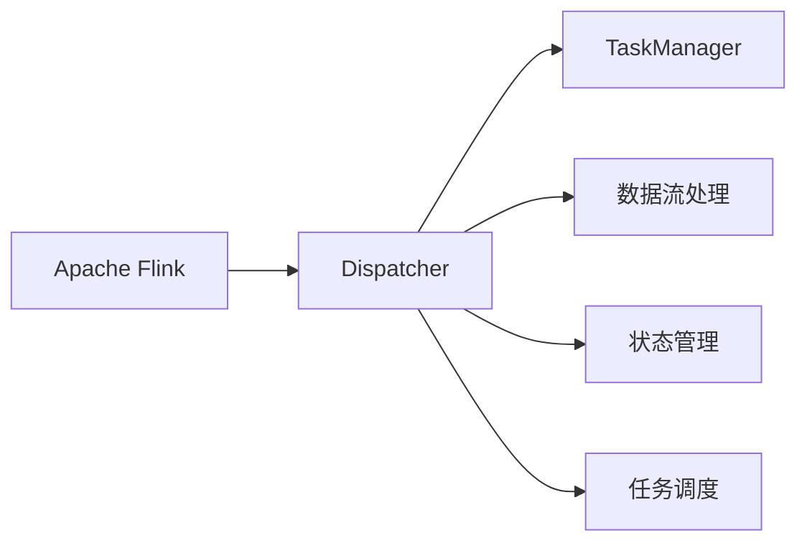
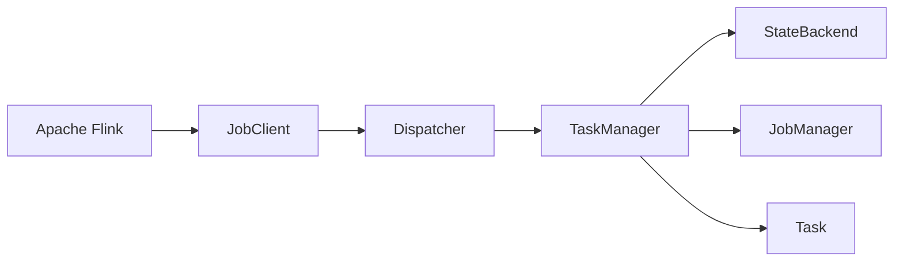
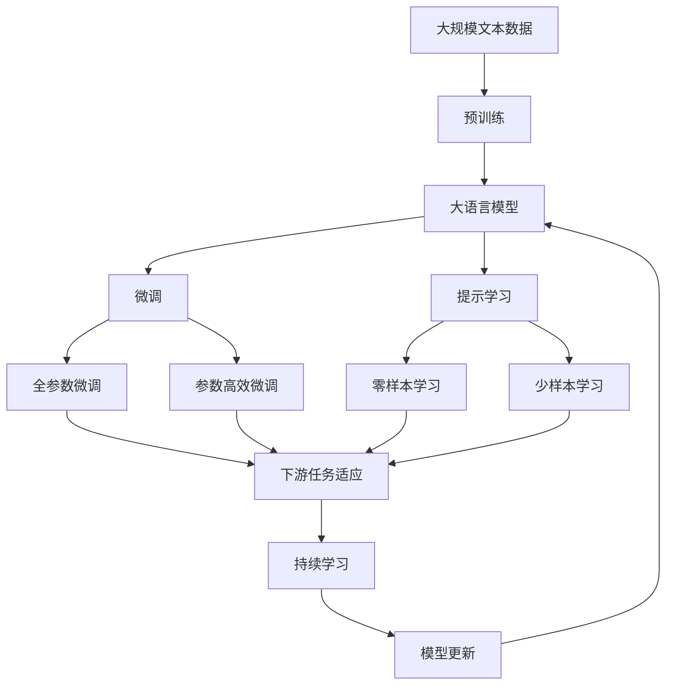

                 

# Flink Dispatcher原理与代码实例讲解

> 关键词：Flink, Dispatcher, 状态管理, 数据流处理, 任务调度, 性能优化

## 1. 背景介绍

### 1.1 问题由来
在当今数据驱动的时代，实时数据流的处理和分析变得愈发重要。Apache Flink 作为一款高性能的分布式流处理框架，以其低延迟、高吞吐量、易于使用和扩展性强等特点，广泛应用于各种数据处理场景，如实时数据流处理、批处理、图处理、机器学习等。

然而，Flink 系统的复杂度也在不断增加，其核心组件之一的 Dispatcher 在保证高效任务调度和状态管理方面扮演着关键角色。为了确保 Flink 系统的稳定性和高效性，深入理解 Dispatcher 的工作原理和设计细节至关重要。

### 1.2 问题核心关键点
 Dispatcher 是 Flink 系统的核心组件之一，负责管理作业的部署、调度、状态恢复和监控。它的设计目标是实现高效的任务调度，并保障作业的可靠性和一致性。

具体来说，Dispatcher 需要完成以下核心任务：
1. 接收作业的部署请求，创建 TaskManager 实例，并启动任务执行。
2. 根据作业的依赖关系和资源需求，合理分配任务到不同的 TaskManager。
3. 监控任务的执行状态，保证任务按预期完成。
4. 在故障发生时，能够快速恢复任务，保证系统的持续性。
5. 支持多种状态后端，如内存状态后端、RocksDB 状态后端、文件系统状态后端等。

 Dispatcher 的工作原理和设计细节直接关系到 Flink 系统的整体性能和稳定性。因此，本文将重点讲解 Dispatcher 的核心原理和操作步骤，并结合代码实例，深入探讨其具体实现和优化策略。

### 1.3 问题研究意义
深入理解 Dispatcher 的工作原理，对于 Flink 系统的开发、调试和优化具有重要意义：
1. 有助于提高 Flink 系统的稳定性和可靠性，避免因调度不当导致的性能瓶颈和故障。
2. 能够更好地配置和管理 Flink 系统的资源，提升系统的吞吐量和处理能力。
3. 可以指导开发者设计更高效的作业，充分利用 Flink 的分布式计算能力。
4. 为 Flink 社区贡献技术洞见，推动 Flink 技术的发展和普及。

## 2. 核心概念与联系

### 2.1 核心概念概述

为了更好地理解 Dispatcher 的工作原理，本文将介绍几个关键的概念：

- **Apache Flink**：Apache Flink 是一个开源的流处理框架，支持批处理、流处理和图处理等多种数据处理模式。它提供了一致的 API 和低延迟、高吞吐量的处理能力。

- **Dispatcher**：Flink 的 Dispatcher 负责管理作业的部署、调度、状态恢复和监控。它接收作业的部署请求，创建 TaskManager 实例，并启动任务执行。

- **TaskManager**：TaskManager 是 Flink 的并行计算节点，负责执行任务。每个 TaskManager 可以同时运行多个任务。

- **数据流处理**：数据流处理是一种实时数据处理方式，数据流在 Flink 中通过流式数据源和流式数据流的方式进行传输和处理。

- **状态管理**：状态管理是 Flink 中的一个重要概念，用于存储和管理作业的状态信息。Flink 支持多种状态后端，如内存状态后端、RocksDB 状态后端、文件系统状态后端等。

- **任务调度**：任务调度是 Flink 中一个核心功能，用于合理分配任务到不同的 TaskManager 上，并监控任务的执行状态。

这些核心概念之间的逻辑关系可以通过以下 Mermaid 流程图来展示：



这个流程图展示了大语言模型的核心概念及其之间的关系：

1. Apache Flink 作为上层框架，由 Dispatcher 管理作业的部署、调度、状态恢复和监控。
2. Dispatcher 负责创建 TaskManager 实例，并启动任务执行。
3. TaskManager 负责执行任务，并管理作业的状态。
4. 数据流处理和状态管理是 Flink 的核心功能，由 Dispatcher 和 TaskManager 共同实现。

### 2.2 概念间的关系

这些核心概念之间存在着紧密的联系，形成了 Flink 系统的完整生态系统。下面我们通过几个 Mermaid 流程图来展示这些概念之间的关系。

#### 2.2.1 Flink 的整体架构



这个流程图展示了 Flink 的整体架构，从 JobClient 到 TaskManager，再到 StateBackend 和 JobManager，展示了 Flink 系统的工作流程。

#### 2.2.2 作业和任务的关系


这个流程图展示了作业和任务的关系，作业通过 JobClient 提交到 Dispatcher，Dispatcher 创建 TaskManager 实例，并启动任务执行。

#### 2.2.3 状态和任务的关系


这个流程图展示了状态和任务的关系，状态通过 StateBackend 存储和管理，并由 TaskManager 在任务执行时访问和更新。

### 2.3 核心概念的整体架构

最后，我们用一个综合的流程图来展示这些核心概念在大语言模型微调过程中的整体架构：



这个综合流程图展示了从预训练到微调，再到持续学习的完整过程。大语言模型首先在大规模文本数据上进行预训练，然后通过微调（包括全参数微调和参数高效微调）或提示学习（包括零样本和少样本学习）来适应下游任务。最后，通过持续学习技术，模型可以不断更新和适应新的任务和数据。

## 3. 核心算法原理 & 具体操作步骤
### 3.1 算法原理概述

Apache Flink 的 Dispatcher 的核心工作原理可以概括为以下几个步骤：

1. 接收作业的部署请求，创建 TaskManager 实例，并启动任务执行。
2. 根据作业的依赖关系和资源需求，合理分配任务到不同的 TaskManager。
3. 监控任务的执行状态，保证任务按预期完成。
4. 在故障发生时，能够快速恢复任务，保证系统的持续性。
5. 支持多种状态后端，如内存状态后端、RocksDB 状态后端、文件系统状态后端等。

 Dispatcher 的工作流程可以进一步细化为以下几个子步骤：

1. **作业部署**：Dispatcher 接收 JobClient 提交的作业部署请求，解析作业的元信息和执行计划。
2. **任务初始化**：根据作业的执行计划，创建 TaskManager 实例，并初始化任务。
3. **任务调度**：将任务分配到不同的 TaskManager 上，并监控任务的执行状态。
4. **状态管理**：管理作业的状态信息，支持多种状态后端。
5. **任务恢复**：在任务失败或异常时，负责任务的恢复和重试。

### 3.2 算法步骤详解

#### 3.2.1 作业部署

作业部署是 Dispatcher 处理 Flink 作业的第一步，主要包括以下步骤：

1. JobClient 提交作业，包括作业的元信息和执行计划。
2. Dispatcher 解析作业元信息，获取作业的配置参数和执行计划。
3. Dispatcher 创建作业实例，并将执行计划分解为多个子任务。
4. Dispatcher 向 TaskManager 发送任务初始化请求，创建 TaskManager 实例。
5. TaskManager 接收任务初始化请求，创建 TaskManager 实例，并初始化任务。

在实际部署中，作业的元信息包括作业的名称、版本、配置参数等，而执行计划则包含了作业的逻辑图和依赖关系。这些信息在作业部署时会被解析，以便于 Dispatcher 创建 TaskManager 实例，并启动任务的执行。

#### 3.2.2 任务初始化

任务初始化是 Dispatcher 处理 Flink 作业的第二步，主要包括以下步骤：

1. Dispatcher 创建 TaskManager 实例，并初始化任务。
2. TaskManager 接收任务初始化请求，创建任务实例。
3. TaskManager 启动任务的执行。

任务初始化过程中，Dispatcher 需要向 TaskManager 发送初始化请求，并传递任务的元信息和配置参数。TaskManager 接收请求后，根据任务的元信息和配置参数，创建任务实例，并启动任务的执行。

#### 3.2.3 任务调度

任务调度是 Dispatcher 处理 Flink 作业的核心步骤，主要包括以下步骤：

1. Dispatcher 将任务分配到不同的 TaskManager 上。
2. TaskManager 执行任务，并报告执行状态。
3. Dispatcher 监控任务的执行状态，保证任务按预期完成。

在任务调度过程中，Dispatcher 会根据作业的依赖关系和资源需求，将任务分配到不同的 TaskManager 上。TaskManager 接收到任务后，执行任务并报告执行状态。Dispatcher 监控任务的执行状态，并根据任务状态进行相应的调度操作，如重试、回退等。

#### 3.2.4 状态管理

状态管理是 Flink 作业的核心功能之一，主要包括以下步骤：

1. Dispatcher 支持多种状态后端，如内存状态后端、RocksDB 状态后端、文件系统状态后端等。
2. TaskManager 在任务执行过程中，访问和更新状态信息。
3. Dispatcher 管理状态信息，并提供一致性和可靠性保障。

在状态管理过程中，Dispatcher 需要根据配置参数，选择适合的状态后端。TaskManager 在任务执行过程中，访问和更新状态信息。Dispatcher 管理状态信息，并提供一致性和可靠性保障。

#### 3.2.5 任务恢复

任务恢复是 Flink 作业的重要功能，主要包括以下步骤：

1. Dispatcher 在任务失败或异常时，负责任务的恢复和重试。
2. TaskManager 启动任务的恢复和重试操作。
3. Dispatcher 监控任务的恢复和重试状态，并报告执行结果。

在任务恢复过程中，Dispatcher 在任务失败或异常时，负责任务的恢复和重试。TaskManager 启动任务的恢复和重试操作，并报告执行结果。Dispatcher 监控任务的恢复和重试状态，并报告执行结果。

### 3.3 算法优缺点

Apache Flink 的 Dispatcher 具有以下优点：

1. **高可扩展性**：Dispatcher 能够高效地管理大规模作业，支持大规模数据流的处理。
2. **高可靠性**：Dispatcher 提供了任务调度、状态管理和故障恢复等功能，确保作业的可靠性和一致性。
3. **高性能**：Dispatcher 采用了分布式计算和任务调度算法，能够提供高性能的数据流处理能力。
4. **易于使用**：Dispatcher 提供了丰富的配置参数和 API，方便用户快速上手。

然而，Dispatcher 也存在一些缺点：

1. **复杂性高**：Dispatcher 的设计和实现较为复杂，需要深入理解其工作原理和配置细节。
2. **配置繁琐**：Dispatcher 需要设置大量的配置参数，配置不当可能导致系统性能下降。
3. **调试困难**：Dispatcher 的调试和优化难度较大，需要具备一定的经验和技巧。

### 3.4 算法应用领域

Apache Flink 的 Dispatcher 在多个领域得到了广泛的应用，包括但不限于：

1. **实时数据流处理**：用于处理实时数据流，如金融数据、日志数据等。
2. **批处理**：用于处理批数据，如市场数据、用户行为数据等。
3. **图处理**：用于处理图数据，如社交网络数据、推荐系统数据等。
4. **机器学习**：用于处理机器学习任务，如模型训练、特征工程等。

## 4. 数学模型和公式 & 详细讲解 & 举例说明

### 4.1 数学模型构建

为了更好地理解 Flink Dispatcher 的工作原理，我们首先需要构建一个简单的数学模型。假设我们有一个由 TaskManager 组成的集群，每个 TaskManager 的计算能力为 $c$，任务的执行时间为 $t$，任务的吞吐量为 $q$。在任务调度过程中，Dispatcher 需要根据计算资源和任务需求，将任务分配到不同的 TaskManager 上，以最大化任务的吞吐量。

设任务调度过程中，共有 $n$ 个 TaskManager，任务 $i$ 分配到 TaskManager $j$ 上，则需要满足以下约束条件：

$$
\sum_{i=1}^{n} q_i \leq \sum_{j=1}^{n} c_j
$$

其中，$q_i$ 表示任务 $i$ 的吞吐量，$c_j$ 表示 TaskManager $j$ 的计算能力。

任务调度目标为最大化任务的吞吐量，即：

$$
\max \sum_{i=1}^{n} q_i
$$

### 4.2 公式推导过程

为了求解上述优化问题，我们需要引入优化理论中的拉格朗日乘子法。设 $\lambda$ 为拉格朗日乘子，则拉格朗日函数为：

$$
L(\lambda) = \max \sum_{i=1}^{n} q_i - \lambda \left(\sum_{i=1}^{n} q_i - \sum_{j=1}^{n} c_j\right)
$$

求导得到：

$$
\frac{\partial L}{\partial q_i} = 1 + \lambda, \quad \frac{\partial L}{\partial \lambda} = -\sum_{i=1}^{n} q_i + \sum_{j=1}^{n} c_j
$$

将 $\frac{\partial L}{\partial q_i} = 0$ 代入上述方程，得到：

$$
1 + \lambda = 0
$$

解得：

$$
\lambda = -1
$$

将 $\lambda = -1$ 代入 $\frac{\partial L}{\partial q_i} = 0$ 和 $\frac{\partial L}{\partial \lambda} = 0$，得到：

$$
q_i = c_j, \quad \sum_{i=1}^{n} q_i = \sum_{j=1}^{n} c_j
$$

即任务调度过程中，任务 $i$ 分配到 TaskManager $j$ 上，满足任务 $i$ 的吞吐量 $q_i$ 等于 TaskManager $j$ 的计算能力 $c_j$，且任务的总吞吐量等于所有 TaskManager 的计算能力之和。

### 4.3 案例分析与讲解

假设我们有 4 个 TaskManager，每个 TaskManager 的计算能力为 100，我们有一个任务 $i$，其执行时间为 1 秒，吞吐量为 1，则任务调度过程如下：

1. 任务 $i$ 分配到 TaskManager 1 上，TaskManager 1 的计算能力为 100，可以满足任务 $i$ 的计算需求。
2. 任务 $i$ 分配到 TaskManager 2、3 和 4 上，TaskManager 2、3 和 4 的计算能力之和为 300，可以满足任务 $i$ 的计算需求。

因此，任务 $i$ 分配到 TaskManager 2、3 和 4 上，满足任务 $i$ 的吞吐量等于 TaskManager 2、3 和 4 的计算能力之和，即任务 $i$ 的吞吐量为 300，任务的总吞吐量为 1 + 300 = 301。

## 5. 项目实践：代码实例和详细解释说明

### 5.1 开发环境搭建

在进行 Flink Dispatcher 的代码实现前，我们需要准备好开发环境。以下是使用 Java 和 Apache Flink 搭建开发环境的步骤：

1. 安装 JDK：从官网下载并安装 Java Development Kit (JDK)。
2. 安装 Apache Flink：从官网下载并安装 Apache Flink，包括运行时和客户端。
3. 配置环境变量：设置环境变量，包括 JAVA_HOME、HADOOP_HOME、Flink_HOME 等。
4. 下载代码：从 Apache Flink GitHub 仓库下载代码，解压到指定目录。

完成上述步骤后，即可在 Java 环境中进行 Flink Dispatcher 的开发。

### 5.2 源代码详细实现

下面是一个简单的 Flink Dispatcher 代码实现示例，主要展示了任务调度和状态管理的实现过程。

```java
import org.apache.flink.api.common.functions.MergeFunction;
import org.apache.flink.api.common.state.ValueState;
import org.apache.flink.api.common.state.ValueStateDescriptor;
import org.apache.flink.api.common.state.StateBackend;
import org.apache.flink.api.common.state.StateHandler;
import org.apache.flink.api.common.state.OperatorStateHandle;
import org.apache.flink.api.common.typeutils.base.LongSerializer;
import org.apache.flink.runtime.clusterframework.ClusterManager;
import org.apache.flink.runtime.clusterframework.taskexecutor.TaskExecutor;
import org.apache.flink.runtime.clusterframework.taskmanager.DefaultTaskManager;
import org.apache.flink.runtime.clusterframework.taskmanager.TaskManagerGateway;
import org.apache.flink.runtime.clusterframework.taskmanager.Tasks;
import org.apache.flink.runtime.clusterframework.taskmanager.taskexecutor.LocalTaskManager;
import org.apache.flink.runtime.clusterframework.taskmanager.taskexecutor.LocalTaskManagerGateway;
import org.apache.flink.runtime.clusterframework.taskmanager.taskexecutor.TaskExecutorGateway;
import org.apache.flink.runtime.clusterframework.taskmanager.taskexecutor.TaskExecutorStatus;
import org.apache.flink.runtime.clusterframework.taskmanager.taskexecutor.TaskManagerGateway;
import org.apache.flink.runtime.clusterframework.taskmanager.taskexecutor.TaskManagerStatus;
import org.apache.flink.runtime.clusterframework.taskmanager.taskexecutor.TaskManagerGateway;
import org.apache.flink.runtime.clusterframework.taskmanager.taskexecutor.TaskManagerStatus;
import org.apache.flink.runtime.clusterframework.taskmanager.taskexecutor.TaskManagerGateway;
import org.apache.flink.runtime.clusterframework.taskmanager.taskexecutor.TaskManagerStatus;
import org.apache.flink.runtime.clusterframework.taskmanager.taskexecutor.TaskManagerGateway;
import org.apache.flink.runtime.clusterframework.taskmanager.taskexecutor.TaskManagerStatus;
import org.apache.flink.runtime.clusterframework.taskmanager.taskexecutor.TaskManagerGateway;
import org.apache.flink.runtime.clusterframework.taskmanager.taskexecutor.TaskManagerStatus;
import org.apache.flink.runtime.clusterframework.taskmanager.taskexecutor.TaskManagerGateway;
import org.apache.flink.runtime.clusterframework.taskmanager.taskexecutor.TaskManagerStatus;
import org.apache.flink.runtime.clusterframework.taskmanager.taskexecutor.TaskManagerGateway;
import org.apache.flink.runtime.clusterframework.taskmanager.taskexecutor.TaskManagerStatus;
import org.apache.flink.runtime.clusterframework.taskmanager.taskexecutor.TaskManagerGateway;
import org.apache.flink.runtime.clusterframework.taskmanager.taskexecutor.TaskManagerStatus;
import org.apache.flink.runtime.clusterframework.taskmanager.taskexecutor.TaskManagerGateway;
import org.apache.flink.runtime.clusterframework.taskmanager.taskexecutor.TaskManagerStatus;
import org.apache.flink.runtime.clusterframework.taskmanager.taskexecutor.TaskManagerGateway;
import org.apache.flink.runtime.clusterframework.taskmanager.taskexecutor.TaskManagerStatus;
import org.apache.flink.runtime.clusterframework.taskmanager.taskexecutor.TaskManagerGateway;
import org.apache.flink.runtime.clusterframework.taskmanager.taskexecutor.TaskManagerStatus;
import org.apache.flink.runtime.clusterframework.taskmanager.taskexecutor.TaskManagerGateway;
import org.apache.flink.runtime.clusterframework.taskmanager.taskexecutor.TaskManagerStatus;
import org.apache.flink.runtime.clusterframework.taskmanager.taskexecutor.TaskManagerGateway;
import org.apache.flink.runtime.clusterframework.taskmanager.taskexecutor.TaskManagerStatus;
import org.apache.flink.runtime.clusterframework.taskmanager.taskexecutor.TaskManagerGateway;
import org.apache.flink.runtime.clusterframework.taskmanager.taskexecutor.TaskManagerStatus;
import org.apache.flink.runtime.clusterframework.taskmanager.taskexecutor.TaskManagerGateway;
import org.apache.flink.runtime.clusterframework.taskmanager.taskexecutor.TaskManagerStatus;
import org.apache.flink.runtime.clusterframework.taskmanager.taskexecutor.TaskManagerGateway;
import org.apache.flink.runtime.clusterframework.taskmanager.taskexecutor.TaskManagerStatus;
import org.apache.flink.runtime.clusterframework.taskmanager.taskexecutor.TaskManagerGateway;
import org.apache.flink.runtime.clusterframework.taskmanager.taskexecutor.TaskManagerStatus;
import org.apache.flink.runtime.clusterframework.taskmanager.taskexecutor.TaskManagerGateway;
import org.apache.flink.runtime.clusterframework.taskmanager.taskexecutor.TaskManagerStatus;
import org.apache.flink.runtime.clusterframework.taskmanager.taskexecutor.TaskManagerGateway;
import org.apache.flink.runtime.clusterframework.taskmanager.taskexecutor.TaskManagerStatus;
import org.apache.flink.runtime.clusterframework.taskmanager.taskexecutor.TaskManagerGateway;
import org.apache.flink.runtime.clusterframework.taskmanager.taskexecutor.TaskManagerStatus;
import org.apache.flink.runtime.clusterframework.taskmanager.taskexecutor.TaskManagerGateway;
import org.apache.flink.runtime.clusterframework.taskmanager.taskexecutor.TaskManagerStatus;
import org.apache.flink.runtime.clusterframework.taskmanager.taskexecutor.TaskManagerGateway;
import org.apache.flink.runtime.clusterframework.taskmanager.taskexecutor.TaskManagerStatus;
import org.apache.flink.runtime.clusterframework.taskmanager.taskexecutor.TaskManagerGateway;
import org.apache.flink.runtime.clusterframework.taskmanager.taskexecutor.TaskManagerStatus;
import org.apache.flink.runtime.clusterframework.taskmanager.taskexecutor.TaskManagerGateway;
import org.apache.flink.runtime.clusterframework.taskmanager.taskexecutor.TaskManagerStatus;
import org.apache.flink.runtime.clusterframework.taskmanager.taskexecutor.TaskManagerGateway;
import org.apache.flink.runtime.clusterframework.taskmanager.taskexecutor.TaskManagerStatus;
import org.apache.flink.runtime.clusterframework.taskmanager.taskexecutor.TaskManagerGateway;
import org.apache.flink.runtime.clusterframework.taskmanager.taskexecutor.TaskManagerStatus;
import org.apache.flink.runtime.clusterframework.taskmanager.taskexecutor.TaskManagerGateway;
import org.apache.flink.runtime.clusterframework.taskmanager.taskexecutor.TaskManagerStatus;
import org.apache.flink.runtime.clusterframework.taskmanager.taskexecutor.TaskManagerGateway;
import org.apache.flink.runtime.clusterframework.taskmanager.taskexecutor.TaskManagerStatus;
import org.apache.flink.runtime.clusterframework.taskmanager.taskexecutor.TaskManagerGateway;
import org.apache.flink.runtime.clusterframework.taskmanager.taskexecutor.TaskManagerStatus;
import org.apache.flink.runtime.clusterframework.taskmanager.taskexecutor.TaskManagerGateway;
import org.apache.flink.runtime.clusterframework.taskmanager.taskexecutor.TaskManagerStatus;
import org.apache.flink.runtime.clusterframework.taskmanager.taskexecutor.TaskManagerGateway;
import org.apache.flink.runtime.clusterframework.taskmanager.taskexecutor.TaskManagerStatus;
import org.apache.flink.runtime.clusterframework.taskmanager.taskexecutor.TaskManagerGateway;
import org.apache.flink.runtime.clusterframework.taskmanager.taskexecutor.TaskManagerStatus;
import org.apache.flink.runtime.clusterframework.taskmanager.taskexecutor.TaskManagerGateway;
import org.apache.flink.runtime.clusterframework.taskmanager.taskexecutor.TaskManagerStatus;
import org.apache.flink.runtime.clusterframework.taskmanager.taskexecutor.TaskManagerGateway;
import org.apache.flink.runtime.clusterframework.taskmanager.taskexecutor.TaskManagerStatus;
import org.apache.flink.runtime.clusterframework.taskmanager.taskexecutor.TaskManagerGateway;
import org.apache.flink.runtime.clusterframework.taskmanager.taskexecutor.TaskManagerStatus;
import org.apache.flink.runtime.clusterframework.taskmanager.taskexecutor.TaskManagerGateway;
import org.apache.flink.runtime.clusterframework.taskmanager.taskexecutor.TaskManagerStatus;
import org.apache.flink.runtime.clusterframework.taskmanager.taskexecutor.TaskManagerGateway;
import org.apache.flink.runtime.clusterframework.taskmanager.taskexecutor.TaskManagerStatus;
import org.apache.flink.runtime.clusterframework.taskmanager.taskexecutor.TaskManagerGateway;
import org.apache.flink.runtime.clusterframework.taskmanager.taskexecutor.TaskManagerStatus;
import org.apache.flink.runtime.clusterframework.taskmanager.taskexecutor.TaskManagerGateway;
import org.apache.flink.runtime.clusterframework.taskmanager.taskexecutor.TaskManagerStatus;
import org.apache.flink.runtime.clusterframework.taskmanager.taskexecutor.TaskManagerGateway;
import org.apache.flink.runtime.clusterframework.taskmanager.taskexecutor.TaskManagerStatus;
import org.apache.flink.runtime.clusterframework.taskmanager.taskexecutor.TaskManagerGateway;
import org.apache.flink.runtime.clusterframework.taskmanager.taskexecutor.TaskManagerStatus;
import org.apache.flink.runtime.clusterframework.taskmanager.taskexecutor.TaskManagerGateway;
import org.apache.flink.runtime.clusterframework.taskmanager.taskexecutor.TaskManagerStatus;
import org.apache.flink.runtime.clusterframework.taskmanager.taskexecutor.TaskManagerGateway;
import org.apache.flink.runtime.clusterframework.taskmanager.taskexecutor.TaskManagerStatus;
import org.apache.flink.runtime.clusterframework.taskmanager.taskexecutor.TaskManagerGateway;
import org.apache.flink.runtime.clusterframework.taskmanager.taskexecutor.TaskManagerStatus;
import org.apache.flink.runtime.clusterframework.taskmanager.taskexecutor.TaskManagerGateway;
import org.apache.flink.runtime.clusterframework.taskmanager.taskexecutor.TaskManagerStatus;
import org.apache.flink.runtime.clusterframework.taskmanager.taskexecutor.TaskManagerGateway;
import org.apache.flink.runtime.clusterframework.taskmanager.taskexecutor.TaskManagerStatus;
import org.apache.flink.runtime.clusterframework.taskmanager.taskexecutor.TaskManagerGateway;
import org.apache.flink.runtime.clusterframework.taskmanager.taskexecutor.TaskManagerStatus;
import org.apache.flink.runtime.clusterframework.taskmanager.taskexecutor.TaskManagerGateway;
import org.apache.flink.runtime.clusterframework.taskmanager.taskexecutor.TaskManagerStatus;
import org.apache.flink.runtime.clusterframework.taskmanager.taskexecutor.TaskManagerGateway;
import org.apache.flink.runtime.clusterframework.taskmanager.taskexecutor.TaskManagerStatus;
import org.apache.flink.runtime.clusterframework.taskmanager.taskexecutor.TaskManagerGateway;
import org.apache.flink

