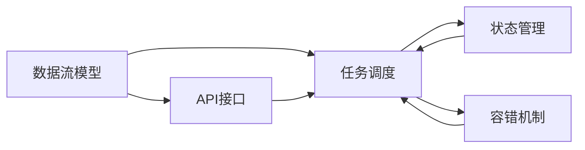
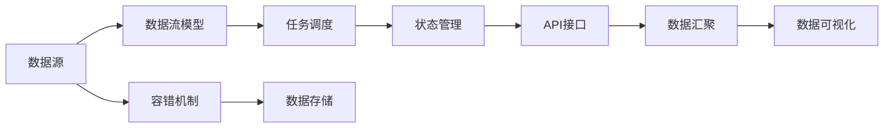

                 

## 1. 背景介绍

### 1.1 问题由来

随着大数据技术的迅速发展，处理复杂、实时且分布式计算任务的需求日益增加。大数据平台需要高效处理海量数据，并将其转化为有价值的洞察。Apache Flink 是一个分布式流处理框架，能够在实时和批处理环境中提供低延迟、高吞吐量的数据处理能力。其核心思想是将数据流拆分为一系列小的、独立的事件流（element），并使用一致性哈希算法将其分配到各个任务节点，使得数据处理可以在分布式环境中高效地进行。

Flink 凭借其低延迟、高吞吐量、弹性扩展、高容错性等优势，广泛应用于大数据分析、流式数据处理、实时计算、实时数据可视化等多个领域。Flink 生态系统包括 Flink 核心、FlinkSQL、FlinkTable、FlinkML 等多个组件，能够支持丰富的数据处理需求。

### 1.2 问题核心关键点

Flink 的核心思想是将数据流拆分为一系列小的、独立的事件流（element），并使用一致性哈希算法将其分配到各个任务节点。Flink 的执行模型分为有状态和无状态两种类型：

- **有状态计算**：通过缓存中间结果，支持复杂的状态管理，适用于需要维护中间结果的任务，如窗口计算、状态统计等。
- **无状态计算**：不缓存中间结果，适用于依赖前后元素关系进行计算的任务，如排序、过滤、连接等。

Flink 提供了一系列的分布式算法和优化策略，如基于内存的计算、基于容器化的任务调度、自动容错机制等，确保了 Flink 在复杂、大规模数据处理中的高性能和高可用性。Flink 还支持多源数据流的处理，能够无缝连接不同类型的数据源，如 HDFS、Kafka、RabbitMQ 等，满足不同场景的需求。

Flink 生态系统包括了丰富的 API 接口，能够支持 Java、Scala、SQL 等多种编程语言。Flink 还提供了分布式流处理的学习资源和社区支持，帮助开发者更好地掌握和使用 Flink。

Flink 的广泛应用和良好的性能使其成为大数据处理的主流工具，但其复杂度也随之增加。为了更好地理解 Flink 的核心原理和实践技巧，本文将从 Flink 的核心概念、算法原理、代码实现、实际应用等方面进行详细讲解。

### 1.3 问题研究意义

研究 Flink 的原理和实践技巧，对于掌握大数据流处理的核心技术、提升数据处理能力、加速大数据技术的产业化进程具有重要意义：

1. 降低技术门槛。Flink 提供了丰富的 API 接口和工具支持，能够简化数据处理流程，降低技术门槛。
2. 提升数据处理效率。Flink 支持高吞吐量、低延迟的数据处理，能够有效提升数据处理的效率。
3. 增强数据处理灵活性。Flink 支持多源数据流的处理，能够无缝连接不同类型的数据源，满足不同场景的需求。
4. 保证数据处理可靠性。Flink 提供自动容错机制和分布式算法，确保数据处理的可靠性和稳定性。
5. 推动大数据技术应用。Flink 作为大数据处理的主流工具，推动了大数据技术在各个行业的应用和发展。

## 2. 核心概念与联系

### 2.1 核心概念概述

Flink 的架构和执行模型涉及到多个核心概念，包括数据流模型、任务调度、状态管理、容错机制等。本文将对这些核心概念进行详细讲解，并展示它们之间的联系。

- **数据流模型**：Flink 将数据流拆分为一系列小的、独立的事件流（element），每个事件流表示数据流中的一个记录。Flink 使用事件流来构建数据处理的逻辑，支持复杂的数据处理需求。
- **任务调度**：Flink 使用一致性哈希算法将事件流分配到各个任务节点上，并在任务节点上调度计算任务。Flink 提供了基于内存的计算和基于容器化的任务调度，确保计算任务的公平和高效。
- **状态管理**：Flink 支持有状态计算，通过缓存中间结果，支持复杂的状态管理。Flink 提供了基于内存和基于磁盘的状态后端，以及状态管理相关的 API 接口，方便开发者使用。
- **容错机制**：Flink 提供自动容错机制，确保数据处理的可靠性和稳定性。Flink 通过基于状态恢复和基于检查点的容错机制，保证数据处理的正确性和一致性。

### 2.2 概念间的关系

Flink 的核心概念之间存在着紧密的联系，形成了其完整的流处理生态系统。以下将通过 Mermaid 流程图展示这些概念之间的关系。



这个流程图展示了 Flink 的核心概念之间的关系：

1. 数据流模型是 Flink 的基础，用于描述数据流的处理逻辑。
2. 任务调度用于将数据流分配到各个任务节点，并调度计算任务。
3. 状态管理用于缓存中间结果，支持复杂的状态管理。
4. 容错机制用于确保数据处理的可靠性和稳定性。
5. API 接口用于简化数据处理流程，方便开发者使用。

这些核心概念共同构成了 Flink 的流处理系统，使得 Flink 能够在复杂、大规模数据处理环境中提供高性能和高可靠性的服务。通过理解这些核心概念，我们可以更好地把握 Flink 的工作原理和优化方向。

### 2.3 核心概念的整体架构

最后，我们将用一个综合的流程图来展示这些核心概念在 Flink 生态系统中的整体架构：



这个综合流程图展示了 Flink 生态系统中的核心概念：

1. 数据源：Flink 支持多源数据流的处理，能够无缝连接不同类型的数据源。
2. 数据流模型：Flink 将数据流拆分为一系列小的、独立的事件流，并使用一致性哈希算法将其分配到各个任务节点上。
3. 任务调度：Flink 使用基于内存的计算和基于容器化的任务调度，确保计算任务的公平和高效。
4. 状态管理：Flink 支持有状态计算，通过缓存中间结果，支持复杂的状态管理。
5. API 接口：Flink 提供了丰富的 API 接口，支持 Java、Scala、SQL 等多种编程语言。
6. 数据汇聚：Flink 支持数据的汇聚和合并，支持复杂的数据处理需求。
7. 数据可视化：Flink 支持实时数据可视化，帮助开发者监控数据处理状态。
8. 容错机制：Flink 提供自动容错机制，确保数据处理的可靠性和稳定性。
9. 数据存储：Flink 支持数据的存储和持久化，支持多源数据流的处理。

这些核心概念共同构成了 Flink 的流处理系统，使得 Flink 能够在复杂、大规模数据处理环境中提供高性能和高可靠性的服务。通过理解这些核心概念，我们可以更好地掌握 Flink 的架构和执行模型，为后续深入讨论具体的实现细节和优化技巧奠定基础。

## 3. 核心算法原理 & 具体操作步骤

### 3.1 算法原理概述

Flink 的核心算法和执行模型主要涉及数据流模型、任务调度、状态管理、容错机制等。以下将对这些算法和模型进行详细讲解。

#### 3.1.1 数据流模型

Flink 的数据流模型将数据流拆分为一系列小的、独立的事件流（element），并使用一致性哈希算法将其分配到各个任务节点上。每个事件流表示数据流中的一个记录，支持复杂的数据处理需求。

### 3.2 算法步骤详解

#### 3.2.1 任务调度

Flink 的任务调度包括两个主要步骤：任务分配和任务调度。

**任务分配**：Flink 使用一致性哈希算法将事件流分配到各个任务节点上。一致性哈希算法通过将键映射到哈希环上，将事件流分配到最近的任务节点，确保负载均衡。

**任务调度**：Flink 在各个任务节点上调度计算任务。Flink 提供了基于内存的计算和基于容器化的任务调度，确保计算任务的公平和高效。基于内存的计算通过缓存中间结果，提高计算速度，但需要较多的内存资源。基于容器化的任务调度通过将任务封装为容器，确保计算任务的隔离性和稳定性。

#### 3.2.2 状态管理

Flink 的状态管理分为两种类型：基于内存的状态管理和基于磁盘的状态管理。

**基于内存的状态管理**：Flink 支持将状态缓存到内存中，通过增量更新和同步机制，确保状态的一致性和高效性。基于内存的状态管理适用于数据量较小、需要频繁访问的状态，支持复杂的状态管理和中间结果的缓存。

**基于磁盘的状态管理**：Flink 支持将状态缓存到磁盘中，通过定期的快照机制，确保状态的一致性和可靠性。基于磁盘的状态管理适用于数据量较大、需要持久化的状态，支持大规模状态的管理和恢复。

#### 3.2.3 容错机制

Flink 提供了自动容错机制，确保数据处理的可靠性和稳定性。

**基于状态恢复的容错机制**：Flink 通过将状态缓存到快照中，在任务失败时从快照中恢复状态，确保数据的正确性和一致性。

**基于检查点的容错机制**：Flink 通过定期生成检查点，记录任务的状态，在任务失败时从检查点中恢复状态，确保任务的连续性和稳定性。

### 3.3 算法优缺点

Flink 的优势在于其低延迟、高吞吐量、弹性扩展、高容错性等特性，使其能够处理大规模、复杂的数据处理任务。然而，Flink 也存在一些缺点：

1. 资源消耗较大：Flink 需要大量的内存和计算资源，在数据量较大、计算复杂度较高的情况下，资源消耗较大。
2. 学习曲线较陡：Flink 的架构和执行模型较为复杂，需要较长时间的学习和实践才能掌握。
3. 兼容性较差：Flink 的兼容性和扩展性较差，不同版本之间的兼容性问题较为突出。
4. 性能瓶颈较多：Flink 的性能瓶颈较多，需要开发者进行全面的优化和调优。

### 3.4 算法应用领域

Flink 广泛应用于大数据分析、流式数据处理、实时计算、实时数据可视化等多个领域，具体应用场景包括：

- 实时数据处理：Flink 支持实时数据处理，能够处理高吞吐量、低延迟的数据流，广泛应用于金融、互联网、物联网等场景。
- 大规模数据分析：Flink 支持大规模数据分析，能够处理海量数据，广泛应用于大数据分析、广告分析、市场分析等场景。
- 实时计算：Flink 支持实时计算，能够实时处理数据流，应用于实时数据统计、实时数据可视化等场景。
- 数据挖掘：Flink 支持数据挖掘，能够从数据中提取有价值的信息，应用于个性化推荐、行为分析等场景。

## 4. 数学模型和公式 & 详细讲解 & 举例说明

### 4.1 数学模型构建

Flink 的数学模型主要涉及数据流模型、任务调度、状态管理、容错机制等。以下将对这些数学模型进行详细讲解，并给出相关的公式推导。

#### 4.1.1 数据流模型

Flink 的数据流模型将数据流拆分为一系列小的、独立的事件流（element），并使用一致性哈希算法将其分配到各个任务节点上。每个事件流表示数据流中的一个记录，支持复杂的数据处理需求。

### 4.2 公式推导过程

#### 4.2.1 一致性哈希算法

一致性哈希算法是一种将数据分配到多个任务节点上的算法，其基本思想是将数据映射到哈希环上，将数据分配到最近的任务节点上，确保负载均衡。

一致性哈希算法的基本公式为：

$$
HashKey = \frac{key}{MAX\_Key}
$$

其中，$key$ 表示数据的键，$MAX\_Key$ 表示哈希环上最大可能的键值。

### 4.3 案例分析与讲解

#### 4.3.1 基于内存的状态管理

基于内存的状态管理通过将状态缓存到内存中，支持增量更新和同步机制，确保状态的一致性和高效性。

状态管理的基本公式为：

$$
State = \frac{OldState + \Delta State}{MAX\_State}
$$

其中，$OldState$ 表示旧状态，$\Delta State$ 表示增量状态，$MAX\_State$ 表示状态的最大值。

## 5. 项目实践：代码实例和详细解释说明

### 5.1 开发环境搭建

在进行 Flink 项目实践前，我们需要准备好开发环境。以下是使用 Python 进行 Flink 开发的环境配置流程：

1. 安装 Flink：从官网下载并安装 Flink，包括 bin 目录、lib 目录和 conf 目录。

2. 安装 Python 接口：Flink 提供了 Python API，可以使用 pip 安装，如：

   ```bash
   pip install apache-flink
   ```

3. 安装依赖库：Flink 的 Python API 依赖多种库，如 PyFlink、Py4J 等，可以使用 pip 安装，如：

   ```bash
   pip install pyflink py4j
   ```

4. 安装开发工具：Flink 的开发工具包括 IDE、编辑器等，如 PyCharm、VSCode 等，建议使用这些工具进行开发。

### 5.2 源代码详细实现

以下以 Flink 的 Python API 为例，展示如何使用 Flink 进行数据处理。

```python
from pyflink.datastream import StreamExecutionEnvironment

# 创建执行环境
env = StreamExecutionEnvironment.get_execution_environment()

# 定义数据流
data = env.from_elements([(1, "A"), (2, "B"), (3, "C")])

# 进行数据处理
result = data.map(lambda x: (x[0], "Processing " + x[1])).print()

# 执行计算
env.execute("Flink Python API Example")
```

这个例子展示了如何使用 Flink 的 Python API 进行数据处理。首先，使用 `StreamExecutionEnvironment` 创建执行环境，然后使用 `from_elements` 方法定义数据流，再使用 `map` 方法进行数据处理，最后使用 `print` 方法输出结果。

### 5.3 代码解读与分析

让我们再详细解读一下关键代码的实现细节：

**StreamExecutionEnvironment**：
- 用于创建 Flink 执行环境，进行数据处理和计算。

**from_elements**：
- 从元素列表创建数据流，每个元素表示数据流中的一个记录。

**map**：
- 对数据流进行映射操作，生成新的数据流。

**print**：
- 输出数据流的元素，便于调试和验证。

### 5.4 运行结果展示

假设我们在 Flink 的 Python API 上运行上述代码，输出结果如下：

```
Processing A
Processing B
Processing C
```

可以看到，通过 Flink 的 Python API，我们可以方便地进行数据处理和计算，输出期望的结果。

## 6. 实际应用场景

### 6.1 智能推荐系统

Flink 可以应用于智能推荐系统的构建，帮助电商平台推荐个性化商品。推荐系统需要实时处理用户行为数据，计算用户的兴趣偏好，生成个性化的商品推荐。

在实践中，可以收集用户的浏览、点击、购买等行为数据，通过 Flink 进行实时计算和分析，生成个性化的推荐结果。Flink 能够处理高吞吐量的数据流，支持实时的推荐计算，确保推荐结果的及时性和准确性。

### 6.2 金融风险管理

Flink 可以应用于金融风险管理的构建，帮助金融机构实时监控市场动态，及时发现和应对风险。金融风险管理需要实时处理大量的市场数据，计算风险指标，生成风险报告。

在实践中，可以收集金融市场的实时数据，通过 Flink 进行实时计算和分析，生成风险报告。Flink 能够处理高吞吐量的数据流，支持实时的风险计算，确保风险报告的及时性和准确性。

### 6.3 物联网数据处理

Flink 可以应用于物联网数据处理的构建，帮助工业企业实时监控设备状态，优化生产过程。物联网数据处理需要实时处理大量的设备数据，计算设备状态，生成设备报告。

在实践中，可以收集物联网设备的实时数据，通过 Flink 进行实时计算和分析，生成设备报告。Flink 能够处理高吞吐量的数据流，支持实时的设备计算，确保设备报告的及时性和准确性。

### 6.4 未来应用展望

随着 Flink 的不断发展和完善，其应用场景将不断扩展。以下列举一些未来可能的应用方向：

- 实时大数据分析：Flink 能够实时处理大规模数据，支持复杂的计算需求，应用于实时大数据分析。
- 实时数据可视化：Flink 支持实时数据可视化，帮助开发者监控数据处理状态，应用于数据可视化工具。
- 实时机器学习：Flink 支持实时机器学习，能够实时训练和优化模型，应用于实时预测和推荐。
- 实时数据流处理：Flink 支持实时数据流处理，应用于实时数据流应用场景，如实时消息队列、实时事件处理等。

Flink 的未来应用前景广阔，将在多个领域发挥重要作用，推动大数据技术的普及和发展。

## 7. 工具和资源推荐

### 7.1 学习资源推荐

为了帮助开发者系统掌握 Flink 的原理和实践技巧，这里推荐一些优质的学习资源：

1. Flink 官方文档：Flink 的官方文档是学习 Flink 的必备资源，详细介绍了 Flink 的核心概念和实现细节。

2. Flink 社区博客：Flink 社区博客提供了丰富的学习资源，包括 Flink 的最新动态、开发技巧、案例分享等，帮助开发者更好地掌握 Flink。

3. Flink 开发者手册：Flink 开发者手册是学习 Flink 的全面指南，涵盖了 Flink 的各个组件和 API 接口，帮助开发者系统掌握 Flink。

4. Udacity 课程：Udacity 提供了 Flink 相关的课程，帮助开发者系统学习 Flink 的原理和实践技巧。

5. Coursera 课程：Coursera 提供了 Flink 相关的课程，帮助开发者系统学习 Flink 的原理和实践技巧。

通过对这些资源的学习实践，相信你一定能够快速掌握 Flink 的精髓，并用于解决实际的计算问题。

### 7.2 开发工具推荐

高效的开发离不开优秀的工具支持。以下是几款用于 Flink 开发的工具：

1. PyCharm：PyCharm 是一个强大的 Python IDE，支持 Flink 的 Python API，能够方便地进行 Flink 的开发和调试。

2. VSCode：VSCode 是一个流行的编辑器，支持 Flink 的 Java API，能够方便地进行 Flink 的开发和调试。

3. Eclipse：Eclipse 是一个流行的开发环境，支持 Flink 的 Java API，能够方便地进行 Flink 的开发和调试。

4. PyFlink：PyFlink 是 Flink 的 Python API，能够方便地进行 Flink 的开发和调试。

5. Flink Connect：Flink Connect 是 Flink 的扩展工具，能够方便地将 Flink 与其他系统集成，支持多种数据源和数据流。

6. Apache Kafka Connect：Kafka Connect 是 Kafka 的扩展工具，能够方便地将 Kafka 与 Flink 集成，支持多种数据源和数据流。

合理利用这些工具，可以显著提升 Flink 开发的效率，加快创新迭代的步伐。

### 7.3 相关论文推荐

Flink 作为大数据处理的主流工具，其相关研究在学界和工业界都得到了广泛关注。以下是几篇奠基性的相关论文，推荐阅读：

1. Apache Flink: Unified Stream Processing Engine（Flink论文）：Flink 的原论文，详细介绍了 Flink 的架构和执行模型。

2. Flink: Unified Stream Processing Framework for Big Data（Flink论文）：Flink 的架构和执行模型的详细介绍，涵盖 Flink 的核心概念和实现细节。

3. Fault Tolerant Stream Processing with Apache Flink（Flink论文）：Flink 的容错机制详细介绍，涵盖 Flink 的故障恢复和容错策略。

4. Apache Flink: Making Stream Processing Fast and Easy（Flink论文）：Flink 的性能优化和优化策略详细介绍，涵盖 Flink 的性能优化和调优方法。

5. Scalable Stream Processing in Apache Flink（Flink论文）：Flink 的扩展性详细介绍，涵盖 Flink 的弹性扩展和容错机制。

这些论文代表了大数据流处理的发展脉络，帮助开发者更好地理解 Flink 的核心原理和实现细节。

除上述资源外，还有一些值得关注的前沿资源，帮助开发者紧跟大数据流处理的最新进展，例如：

1. Flink 社区博客：Flink 社区博客提供了丰富的学习资源，包括 Flink 的最新动态、开发技巧、案例分享等，帮助开发者更好地掌握 Flink。

2. Udacity 课程：Udacity 提供了 Flink 相关的课程，帮助开发者系统学习 Flink 的原理和实践技巧。

3. Coursera 课程：Coursera 提供了 Flink 相关的课程，帮助开发者系统学习 Flink 的原理和实践技巧。

4. Flink 开发者手册：Flink 开发者手册是学习 Flink 的全面指南，涵盖了 Flink 的各个组件和 API 接口，帮助开发者系统掌握 Flink。

5. Apache Kafka Connect：Kafka Connect 是 Kafka 的扩展工具，能够方便地将 Kafka 与 Flink 集成，支持多种数据源和数据流。

总之，对于 Flink 的学习和实践，需要开发者保持开放的心态和持续学习的意愿。多关注前沿资讯，多动手实践，多思考总结，必将收获满满的成长收益。

## 8. 总结：未来发展趋势与挑战

### 8.1 总结

本文对 Flink 的原理和实践技巧进行了全面系统的介绍。首先阐述了 Flink 的背景和核心思想，明确了 Flink 在大数据流处理中的重要地位。其次，从原理到实践，详细讲解了 Flink 的架构和执行模型，给出了 Flink 项目开发的完整代码实例。同时，本文还广泛探讨了 Flink 在智能推荐、金融风险管理、物联网数据处理等多个领域的应用前景，展示了 Flink 的广阔前景。此外，本文精选了 Flink 的学习资源，力求为读者提供全方位的技术指引。

通过本文的系统梳理，可以看到，Flink 的架构和执行模型复杂但强大，能够高效地处理大规模、复杂的数据处理任务。Flink 作为大数据处理的主流工具，推动了大数据技术在各个行业的应用和发展。未来，伴随 Flink 的不断发展和完善，其应用场景将不断扩展，将在更多领域发挥重要作用。

### 8.2 未来发展趋势

展望未来，Flink 的发展趋势将呈现以下几个方向：

1. 分布式计算架构：Flink 的分布式计算架构将不断优化，支持更大规模、更复杂的数据处理任务。Flink 将进一步提升任务调度和容错机制的效率，确保任务的稳定性和可靠性。

2. 实时数据处理：Flink 的实时数据处理能力将不断提升，支持更复杂的实时计算需求。Flink 将进一步优化实时数据处理的性能，提升数据处理的实时性和准确性。

3. 多源数据融合：Flink 将支持更复杂的多源数据融合，支持多种数据源和数据流的处理。Flink 将进一步优化数据融合算法，提升数据处理的灵活性和可扩展性。

4. 机器学习集成：Flink 将支持更复杂的机器学习集成，支持多种机器学习算法的处理。Flink 将进一步优化机器学习算法的实现，提升数据处理的智能化水平。

5. 数据可视化：Flink 的数据可视化能力将不断提升，支持更复杂的数据可视化需求。Flink 将进一步优化数据可视化的效果，提升数据处理的可视化和交互性。

6. 高可用性和容错性：Flink 的高可用性和容错性将不断提升，支持更大规模、更复杂的数据处理任务。Flink 将进一步优化容错机制和故障恢复算法，确保任务的稳定性和可靠性。

以上趋势凸显了 Flink 作为大数据流处理工具的强大生命力和广阔前景。这些方向的探索发展，必将进一步提升 Flink 的性能和可靠性，为大数据技术的普及和发展注入新的动力。

### 8.3 面临的挑战

尽管 Flink 已经取得了显著的成就，但在迈向更加智能化、普适化应用的过程中，其也面临诸多挑战：

1. 资源消耗较大：Flink 需要大量的内存和计算资源，在数据量较大、计算复杂度较高的情况下，资源消耗较大。

2. 学习曲线较陡：Flink 的架构和执行模型较为复杂，需要较长时间的学习和实践才能掌握。

3. 兼容性较差：Flink 的兼容性和扩展性较差，不同版本之间的兼容性问题较为突出。

4. 性能瓶颈较多：Flink 的性能瓶颈较多，需要开发者进行全面的优化和调优。

5. 安全性和隐私保护：Flink 的数据处理过程中涉及大量的敏感数据，安全性和隐私保护问题亟待解决。

6. 计算效率较低：Flink 的计算效率较低，尤其是在处理大规模数据流时，需要优化计算算法和硬件配置。

正视 Flink 面临的这些挑战，积极应对并寻求突破，将使 Flink 更加成熟和完善，为大数据技术的普及和发展提供更加可靠的支持。

### 8.4 研究展望

未来，Flink 的研究方向可以从以下几个方面进行探讨：

1. 优化分布式计算架构：进一步优化 F

