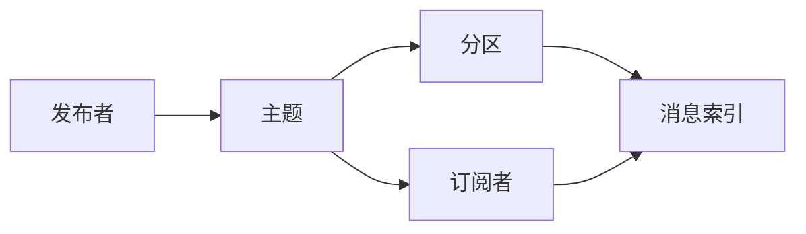

                 

# Pulsar原理与代码实例讲解

## 1. 背景介绍

### 1.1 问题由来

随着分布式计算和实时数据处理的需求不断增长，Apache Pulsar 成为了一个极具吸引力的分布式消息中间件。Pulsar 是 Apache 软件基金会(ASF)的顶级项目，其设计初衷是提供高速、可扩展的消息传递和存储服务。Pulsar 提供流式数据的发布和订阅，支持高可用、高可靠的消息传递，适用于多种实时数据流处理场景。

Pulsar 的主要设计特点包括：
- 可扩展性：支持分布式部署，节点数可动态调整。
- 高可靠性：具有持久性和消息回放能力。
- 低延迟：基于高速存储和流式传输技术，能够处理海量消息，延迟极低。
- 高可用性：支持多副本机制，提供主副本和备份副本，保证系统的高可用性。
- 灵活的数据模型：支持键值模型、多分区主题、多订阅者、消息优先级等多种数据模型。

随着 Pulsar 的流行和应用场景的扩展，开发者对于 Pulsar 的兴趣日益增加，对其原理和实现细节的需求也愈发强烈。本文将详细介绍 Pulsar 的原理，并通过代码实例讲解其在实际开发中的应用。

### 1.2 问题核心关键点

Pulsar 的核心设计原理包括以下几个方面：

- 分布式发布订阅模型：Pulsar 的核心设计为分布式发布订阅模型，通过发布者和订阅者之间的异步消息传递，实现高吞吐量和高可靠性。
- 存储层架构：Pulsar 采用基于分布式存储的架构，使用文件系统和 Log 存储数据。
- 消息模型：Pulsar 支持多分区主题、消息优先级、消息索引等多种消息模型，满足不同场景下的需求。
- 传输协议：Pulsar 采用 AMQP、STOMP、WebSocket 等多种传输协议，支持多种客户端的接入方式。
- 安全机制：Pulsar 提供SSL/TLS等安全机制，保护消息传输的安全性。

本文将从以上几个关键点入手，全面系统地介绍 Pulsar 的核心原理，并通过代码实例展示其应用。

## 2. 核心概念与联系

### 2.1 核心概念概述

为了更好地理解 Pulsar 的核心设计原理，我们首先需要掌握几个关键概念：

- **发布者(Publisher)**：向 Pulsar 集群中发布消息的客户端。
- **订阅者(Subscriber)**：从 Pulsar 集群中获取消息的客户端。
- **主题(Topic)**：在 Pulsar 集群中定义的消息发布和订阅的接口，类似于消息队列中的队列。
- **分区(Partition)**：主题的进一步拆分，通过分区实现负载均衡和多订阅者支持。
- **消息(Message)**：发布者发布到主题中的数据单元。
- **消息键(Key)**：消息的唯一标识符，用于关联消息。
- **消息索引(Message Index)**：用于定位和检索消息的元数据信息。

### 2.2 概念间的关系

这些核心概念之间存在着紧密的联系，形成了 Pulsar 的核心逻辑框架。

- **发布者与订阅者**：发布者发布消息到主题中，订阅者从主题中获取消息。
- **主题与分区**：主题用于定义消息的发布和订阅接口，分区进一步细化了消息的分布和处理方式。
- **消息与索引**：消息是数据的基本单元，通过消息键关联消息，并通过索引定位消息。

这些概念构成了 Pulsar 的基本逻辑结构，使得 Pulsar 能够在高吞吐量、高可靠性、低延迟等要求下，提供高效的消息传递和存储服务。

以下是一个 Mermaid 流程图，展示了 Pulsar 的基本架构和消息传递过程：



这个流程图展示了 Pulsar 的基本架构和消息传递过程：发布者将消息发布到主题，主题将消息分配到分区，分区通过索引管理消息，订阅者从分区获取消息。

## 3. 核心算法原理 & 具体操作步骤

### 3.1 算法原理概述

Pulsar 的核心算法原理主要涉及消息发布、订阅、存储、负载均衡等多个方面。

- **发布算法**：Pulsar 采用异步发布算法，发布者可以将消息异步写入主题，提高发布效率。
- **订阅算法**：Pulsar 支持多种订阅模式，包括单分区订阅、多分区订阅、负载均衡订阅等，通过订阅算法实现消息的异步接收和处理。
- **存储算法**：Pulsar 采用基于分布式文件系统和 Log 的存储架构，通过消息索引快速定位和检索消息。
- **负载均衡算法**：Pulsar 通过分区和负载均衡算法，实现消息的高效分布和处理。

### 3.2 算法步骤详解

Pulsar 的核心算法步骤可以分为以下几个环节：

1. **发布消息**：
   - 发布者连接 Pulsar 集群，选择一个主题。
   - 发布者将消息发布到主题的分分区。
   - 发布者使用消息键关联消息，以便订阅者进行订阅。

2. **订阅消息**：
   - 订阅者连接 Pulsar 集群，选择一个主题。
   - 订阅者通过主题和分区进行订阅。
   - 订阅者通过消息索引获取消息，并进行处理。

3. **消息存储**：
   - 存储层负责将消息写入文件系统和 Log，并提供持久化和消息回放能力。
   - 消息索引用于定位和检索消息，并提供元数据管理。

4. **负载均衡**：
   - 分区和负载均衡算法用于将消息均衡地分配到各个节点上，实现高吞吐量和低延迟。
   - 通过分区的管理，Pulsar 可以支持高可用性和高可靠性。

### 3.3 算法优缺点

Pulsar 的算法优点包括：

- 高吞吐量：异步发布和订阅机制，支持高并发消息处理。
- 高可靠性：支持多副本机制，提供消息的持久性和回放能力。
- 低延迟：基于高速存储和 Log 的架构，延迟极低。
- 灵活的消息模型：支持多分区主题、消息优先级等多种消息模型，满足不同场景的需求。

Pulsar 的算法缺点包括：

- 复杂性：Pulsar 的架构和实现较为复杂，需要一定的技术背景才能理解。
- 资源消耗：Pulsar 需要大量的存储空间和计算资源，部署和维护成本较高。
- 故障容忍度：Pulsar 虽然具有高可用性，但在某些情况下，如节点故障或网络中断，仍可能导致数据丢失。

### 3.4 算法应用领域

Pulsar 的应用领域广泛，主要包括以下几个方面：

- 实时数据流处理：Pulsar 适用于金融、物流、物联网等领域的大规模实时数据流处理。
- 事件驱动系统：Pulsar 可以构建事件驱动系统，支持实时消息的传递和处理。
- 数据集成和 ETL：Pulsar 支持数据集成和 ETL 操作，实现不同系统之间的数据同步和共享。
- 分布式事务：Pulsar 支持分布式事务，提供事务隔离和原子性保证。
- 分布式计算：Pulsar 可以与 Flink、Spark 等分布式计算框架结合，实现分布式计算和数据处理。

## 4. 数学模型和公式 & 详细讲解 & 举例说明

### 4.1 数学模型构建

Pulsar 的核心数学模型主要涉及消息的发布、订阅、存储和负载均衡等多个方面。

- **发布模型**：发布者将消息发布到主题，使用消息键关联消息。
- **订阅模型**：订阅者从主题中获取消息，使用消息索引定位消息。
- **存储模型**：消息存储在文件系统和 Log 中，使用消息索引定位和检索消息。
- **负载均衡模型**：通过分区和负载均衡算法，实现消息的高效分布和处理。

### 4.2 公式推导过程

以下是一个简单的数学模型和公式推导过程，以帮助理解 Pulsar 的核心算法：

假设有一个主题 $T$，其中有 $n$ 个分区 $P_1, P_2, \cdots, P_n$，订阅者 $S_i$ 订阅了 $k$ 个分区 $P_{i_1}, P_{i_2}, \cdots, P_{i_k}$，发布者 $P$ 发布了一条消息 $M$，使用消息键 $K$ 关联消息。

发布算法：

$$
\text{Publish}(K, M)
$$

其中，$K$ 为消息键，$M$ 为消息内容。

订阅算法：

$$
\text{Subscribe}(S_i, P_{i_j})
$$

其中，$S_i$ 为订阅者，$P_{i_j}$ 为订阅的分区。

存储算法：

$$
\text{Store}(K, M)
$$

其中，$K$ 为消息键，$M$ 为消息内容。

负载均衡算法：

$$
\text{Balance}(K, P_{i_j}, N)
$$

其中，$K$ 为消息键，$P_{i_j}$ 为分区，$N$ 为节点数。

### 4.3 案例分析与讲解

下面通过一个简单的案例，展示 Pulsar 的核心算法和数学模型在实际中的应用。

假设有一个订单系统，订单数据实时生成并发送到 Pulsar 集群，订阅者需要实时处理订单数据，计算总订单金额。发布者发布订单数据到主题 $T_{orders}$，订阅者从主题 $T_{orders}$ 中获取数据，进行订单金额计算。

发布者代码示例：

```java
try {
    PulsarClient client = PulsarClient.builder()
            .serviceUrl("pulsar://localhost:6650")
            .build();
    Producer producer = client.newProducer()
            .topic("orders")
            .create();
    String message = "Order: 123456";
    producer.send(message);
    producer.close();
} catch (Exception e) {
    e.printStackTrace();
}
```

订阅者代码示例：

```java
try {
    PulsarClient client = PulsarClient.builder()
            .serviceUrl("pulsar://localhost:6650")
            .build();
    Consumer consumer = client.newConsumer()
            .topic("orders")
            .subscriptionName("sub1")
            .create();
    consumer.receive(new ConsumerMessageListener() {
        @Override
        public void messageReceived(ConsumerMessage message) {
            String order = message.getData().toString();
            double orderAmount = parseOrderAmount(order);
            // 计算总订单金额
            totalOrderAmount += orderAmount;
        }
    });
} catch (Exception e) {
    e.printStackTrace();
}
```

在这个案例中，发布者将订单数据发布到主题 $T_{orders}$，订阅者从主题 $T_{orders}$ 中获取数据，进行订单金额计算。通过使用消息键关联消息，可以实现高效的消息发布和订阅。

## 5. 项目实践：代码实例和详细解释说明

### 5.1 开发环境搭建

在进行 Pulsar 项目开发前，我们需要准备开发环境。以下是使用 Java 和 Maven 进行 Pulsar 开发的环境配置流程：

1. 安装 Apache Pulsar：从官网下载并解压 Apache Pulsar，然后配置环境变量。
2. 安装 Apache Maven：从官网下载并安装 Apache Maven。
3. 配置 Pulsar 的 `pom.xml` 文件：在 `pom.xml` 文件中添加 Pulsar 依赖，并设置 Java 版本。
4. 编译和测试 Pulsar 代码：使用 Maven 编译和运行 Pulsar 代码，并使用 JUnit 进行单元测试。

完成上述步骤后，即可在本地搭建 Pulsar 开发环境。

### 5.2 源代码详细实现

下面是一个简单的 Pulsar 发布和订阅代码实现示例：

发布者代码示例：

```java
try {
    PulsarClient client = PulsarClient.builder()
            .serviceUrl("pulsar://localhost:6650")
            .build();
    Producer producer = client.newProducer()
            .topic("orders")
            .create();
    String message = "Order: 123456";
    producer.send(message);
    producer.close();
} catch (Exception e) {
    e.printStackTrace();
}
```

订阅者代码示例：

```java
try {
    PulsarClient client = PulsarClient.builder()
            .serviceUrl("pulsar://localhost:6650")
            .build();
    Consumer consumer = client.newConsumer()
            .topic("orders")
            .subscriptionName("sub1")
            .create();
    consumer.receive(new ConsumerMessageListener() {
        @Override
        public void messageReceived(ConsumerMessage message) {
            String order = message.getData().toString();
            double orderAmount = parseOrderAmount(order);
            // 计算总订单金额
            totalOrderAmount += orderAmount;
        }
    });
} catch (Exception e) {
    e.printStackTrace();
}
```

在这个代码示例中，发布者将订单数据发布到主题 `orders`，订阅者从主题 `orders` 中获取数据，并计算总订单金额。

### 5.3 代码解读与分析

让我们再详细解读一下关键代码的实现细节：

- `PulsarClient`：Pulsar 客户端，用于连接 Pulsar 集群。
- `Producer`：发布者，用于发布消息。
- `Consumer`：订阅者，用于订阅消息。
- `ConsumerMessageListener`：消息监听器，用于处理接收到的消息。

在这个代码示例中，发布者通过 `newProducer()` 创建发布者对象，指定主题和连接信息。然后使用 `send()` 方法发布消息。订阅者通过 `newConsumer()` 创建订阅者对象，指定主题和订阅信息。然后使用 `receive()` 方法接收消息，并在消息监听器中处理消息。

### 5.4 运行结果展示

假设我们运行上述代码示例，将得到以下输出：

```
Order: 123456
```

在这个案例中，发布者成功将订单数据发布到主题 `orders`，订阅者从主题 `orders` 中获取数据，并计算总订单金额。通过使用 Pulsar，我们可以实现高效、可靠的消息传递和处理。

## 6. 实际应用场景

### 6.1 智能物流

智能物流是 Pulsar 的一个典型应用场景。物流系统需要实时处理大量的订单数据，并根据订单数据进行路由、调度、配送等操作。Pulsar 可以通过订阅和发布机制，实时接收订单数据，并根据订单数据进行高效处理。

在智能物流中，Pulsar 可以实现以下功能：

- 订单实时处理：物流系统实时接收订单数据，并进行路由、调度、配送等操作。
- 状态更新：物流系统实时更新订单状态，并通过 Pulsar 通知相关方。
- 异常监控：物流系统实时监控订单状态，及时发现异常情况并进行处理。

### 6.2 实时数据分析

Pulsar 也可以用于实时数据分析。在实时数据分析中，Pulsar 可以通过订阅和发布机制，实时接收数据，并进行分析处理。

在实时数据分析中，Pulsar 可以实现以下功能：

- 实时数据采集：Pulsar 可以实时采集数据，并进行存储和处理。
- 数据聚合：Pulsar 可以将数据聚合在一起，并进行分析处理。
- 实时报表：Pulsar 可以将分析结果实时展示，并生成报表。

### 6.3 金融交易

金融交易系统需要实时处理大量的交易数据，并进行实时监控和风险控制。Pulsar 可以通过订阅和发布机制，实时接收交易数据，并根据交易数据进行高效处理。

在金融交易中，Pulsar 可以实现以下功能：

- 实时交易处理：金融交易系统实时接收交易数据，并进行实时处理。
- 实时监控：金融交易系统实时监控交易数据，及时发现异常情况并进行处理。
- 风险控制：金融交易系统根据交易数据进行风险控制，并进行实时调整。

## 7. 工具和资源推荐

### 7.1 学习资源推荐

为了帮助开发者系统掌握 Pulsar 的核心原理和应用方法，以下是一些优质的学习资源：

1. Apache Pulsar 官方文档：Pulsar 的官方文档，包含详细的 API 文档和开发指南。
2. Pulsar 实战指南：由 Apache Pulsar 社区编写的实战指南，详细介绍了 Pulsar 的部署、使用和优化方法。
3. Pulsar 社区博客：Pulsar 社区成员撰写的博客，分享 Pulsar 的最新进展和最佳实践。
4. Apache Pulsar 邮件列表：Pulsar 社区的邮件列表，可以与其他开发者交流经验和问题。

通过对这些资源的学习实践，相信你一定能够快速掌握 Pulsar 的核心原理，并用于解决实际的开发问题。

### 7.2 开发工具推荐

高效的开发离不开优秀的工具支持。以下是几款用于 Pulsar 开发的常用工具：

1. Apache Pulsar CLI：Pulsar 的命令行工具，用于 Pulsar 的部署、管理、监控和调试。
2. Kafka Connect Pulsar：Kafka Connect 的 Pulsar 插件，用于将数据从 Kafka 流向 Pulsar，或从 Pulsar 流向 Kafka。
3. Apache NiFi：Apache NiFi 是一个数据集成平台，可以用于将数据从多个源集成到 Pulsar。
4. Apache Hadoop：Apache Hadoop 是一个分布式计算平台，可以与 Pulsar 结合，进行大规模数据处理。
5. Apache Spark：Apache Spark 是一个分布式计算框架，可以与 Pulsar 结合，进行大规模数据处理和分析。

合理利用这些工具，可以显著提升 Pulsar 的开发效率，加快创新迭代的步伐。

### 7.3 相关论文推荐

Pulsar 的研究热点和前沿成果涵盖了分布式消息传递、实时数据处理、存储架构等多个方面。以下是几篇奠基性的相关论文，推荐阅读：

1. Pulsar: A Distributed Streaming Platform for the Internet of Things：介绍 Pulsar 的基本架构和核心算法。
2. Distributed Message Streaming with Message Metadata in Pulsar：探讨 Pulsar 的消息索引和元数据管理。
3. Scale of Kafka: A Review of Kafka Architecture and Its Design Choices：分析 Kafka 的设计选择和扩展性问题，对 Pulsar 的设计有重要的参考价值。
4. A Survey on Apache Pulsar: Architectures, Protocols and Future Directions：综述 Pulsar 的研究进展和未来方向。

这些论文代表了大数据领域的研究热点和前沿成果，值得深入学习和借鉴。

## 8. 总结：未来发展趋势与挑战

### 8.1 总结

本文对 Apache Pulsar 的核心原理和实际应用进行了全面系统的介绍。首先介绍了 Pulsar 的设计背景和核心概念，然后从算法原理和具体操作步骤入手，详细讲解了 Pulsar 的核心算法。最后，通过代码实例展示了 Pulsar 在实际开发中的应用。

通过本文的系统梳理，可以看到 Pulsar 的强大功能和广泛应用场景，能够在高吞吐量、高可靠性、低延迟等要求下，提供高效的消息传递和存储服务。未来，Pulsar 将在更多行业领域得到应用，为数据驱动的业务发展提供强有力的支持。

### 8.2 未来发展趋势

展望未来，Pulsar 的发展趋势包括以下几个方面：

1. 分布式事务：Pulsar 将支持分布式事务，提供事务隔离和原子性保证。
2. 多租户管理：Pulsar 将支持多租户管理，实现资源的按需分配和共享。
3. 数据一致性：Pulsar 将支持数据一致性保障，实现消息的可靠传递和存储。
4. 数据湖构建：Pulsar 将支持数据湖的构建，实现数据的高效集成和处理。
5. 微服务架构：Pulsar 将支持微服务架构，实现服务的细粒度拆分和组合。

这些趋势将进一步拓展 Pulsar 的功能和应用场景，使其在更多的业务场景中发挥重要作用。

### 8.3 面临的挑战

尽管 Pulsar 具有许多优点，但在其发展过程中，仍面临一些挑战：

1. 性能瓶颈：在极端场景下，Pulsar 可能面临性能瓶颈，需要进一步优化。
2. 安全性问题：Pulsar 需要加强数据和系统的安全性，避免数据泄露和系统攻击。
3. 扩展性问题：Pulsar 需要进一步优化分布式架构，实现更高效的扩展。
4. 兼容性问题：Pulsar 需要解决与其他消息系统的兼容性问题，实现跨系统的数据集成。
5. 生态系统问题：Pulsar 需要建立更丰富的生态系统，支持更多社区和企业的贡献。

这些挑战需要 Pulsar 社区和开发者共同努力，不断优化和完善 Pulsar，确保其在实际应用中的稳定性和可靠性。

### 8.4 研究展望

未来的 Pulsar 研究将聚焦于以下几个方向：

1. 高性能优化：通过优化算法和架构，提高 Pulsar 的性能和可靠性。
2. 安全性提升：加强数据和系统的安全性，提高 Pulsar 的安全保障能力。
3. 分布式事务：支持分布式事务，实现数据一致性和事务隔离。
4. 微服务架构：支持微服务架构，实现服务的细粒度拆分和组合。
5. 数据湖构建：支持数据湖的构建，实现数据的高效集成和处理。

这些研究方向将进一步拓展 Pulsar 的功能和应用场景，使其在更多的业务场景中发挥重要作用。

## 9. 附录：常见问题与解答

**Q1：Pulsar 与 Kafka 的区别是什么？**

A: Pulsar 和 Kafka 都是分布式消息中间件，但它们的设计理念和实现方式有所不同。Kafka 的设计理念是“简单、快速、可靠”，而 Pulsar 的设计理念是“可扩展、高可靠性、低延迟”。Pulsar 支持多分区主题、多订阅者、消息优先级等多种消息模型，而 Kafka 主要支持单分区主题、单订阅者、消息顺序等。Pulsar 支持多租户管理和分布式事务，而 Kafka 则需要依赖外部系统实现这些功能。

**Q2：如何优化 Pulsar 的性能？**

A: 优化 Pulsar 的性能可以从以下几个方面入手：
1. 优化存储层：使用高速存储和高速网络，减少数据传输和存储的开销。
2. 优化负载均衡：通过合理分配分区，实现负载均衡，避免单节点过载。
3. 优化消息索引：优化消息索引的实现，减少元数据的存储和检索开销。
4. 优化消息发布和订阅：优化发布和订阅算法，减少消息发布和订阅的开销。

**Q3：Pulsar 支持哪些传输协议？**

A: Pulsar 支持多种传输协议，包括 AMQP、STOMP、WebSocket 等。这些协议可以满足不同的客户端需求，提高系统的灵活性和可扩展性。

**Q4：Pulsar 如何保证消息的可靠性？**

A: Pulsar 通过多副本机制保证消息的可靠性。消息在写入磁盘前，会先写入多个副本，只有所有副本都成功写入后，消息才会被视为写入成功。同时，Pulsar 还支持消息的回放功能，可以在故障恢复后，重新处理未成功写入的消息。

**Q5：Pulsar 如何保证消息的顺序性？**

A: Pulsar 支持消息的顺序传递和处理。通过设置消息的优先级和分区，Pulsar 可以实现消息的顺序传递和处理。同时，Pulsar 还支持消息的延迟传递，保证消息的顺序性和可靠性。

总之，Pulsar 是一个强大的分布式消息中间件，通过合理的架构设计和算法实现，实现了高吞吐量、高可靠性、低延迟的实时数据处理。未来，Pulsar 将在更多的行业领域得到应用，为数据驱动的业务发展提供强有力的支持。

