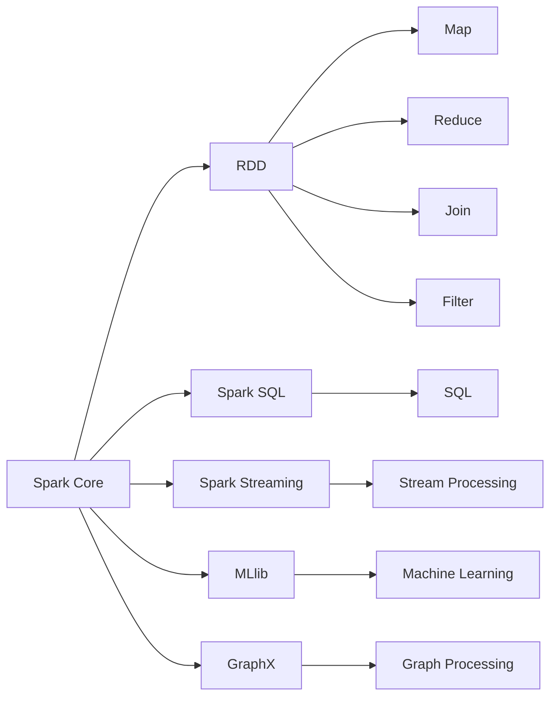
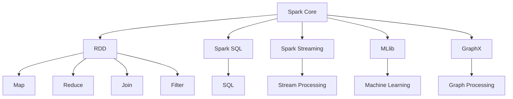

                 

## 1. 背景介绍

Apache Spark是当前大数据生态系统中最流行的分布式计算框架之一。它不仅能够处理大规模数据集，还能够通过其内置的高级API，如MLlib和GraphX，支持大数据上的机器学习和图计算。Spark的核心组件Spark Core提供了弹性分布式数据集（RDD）的概念，它是一种不可变的、可并行操作的数据集合，允许在大规模集群上高效地进行数据处理和计算。

### 1.1 问题由来

在大数据时代，传统的数据处理方式（如Hadoop MapReduce）在性能和灵活性上已经难以满足日益增长的数据处理需求。Hadoop MapReduce在处理大规模数据集时存在启动时间长、任务调度和节点通信开销大等问题。与此同时，随着大数据应用场景的不断扩展，对实时数据处理、复杂数据建模和高效数据挖掘的需求也在不断增加。

为了应对这些挑战，Spark应运而生。Spark的设计理念是快速迭代、高效并行、灵活多样，它提供了一系列高级API和库，如Spark SQL、Spark Streaming、MLlib、GraphX等，可以满足从数据清洗到数据分析、从批处理到实时流处理、从机器学习到图形处理等多种数据处理需求。

### 1.2 问题核心关键点

Spark的核心思想是通过内存计算和弹性分布式数据集（RDD），实现高效的数据处理和计算。其核心特点包括：

- **内存计算**：Spark将数据集分为多个小片段，在内存中进行并行处理，大大提高了数据处理速度。
- **弹性分布式数据集（RDD）**：RDD是一种分布式、不可变的、可并行操作的数据集合，可以在多个节点上进行高效的数据处理。
- **高效的API和库**：Spark提供了丰富的API和库，支持批处理、流处理、机器学习和图计算等多种数据处理方式。

### 1.3 问题研究意义

Spark作为大数据处理的重要工具，对于提升数据处理效率、降低大数据分析成本、加速大数据应用落地具有重要意义。通过Spark，大数据分析师可以更加高效地进行数据处理和计算，开发复杂的数据模型和算法，推动大数据技术在更多领域的广泛应用。

## 2. 核心概念与联系

### 2.1 核心概念概述

为了更好地理解Spark的工作原理和架构，我们需要了解一些核心概念：

- **Spark Core**：Spark的核心组件，提供了弹性分布式数据集（RDD）和基于DAG的任务调度。
- **弹性分布式数据集（RDD）**：一种分布式、不可变的、可并行操作的数据集合，支持多种数据操作，如Map、Reduce、Join等。
- **Spark SQL**：Spark提供的数据处理引擎，支持SQL查询和数据仓库功能。
- **Spark Streaming**：Spark的流处理组件，支持实时数据流处理和流式计算。
- **MLlib**：Spark的机器学习库，支持多种机器学习算法和数据预处理操作。
- **GraphX**：Spark的图处理库，支持图数据结构和各种图算法。

这些核心概念通过Spark的弹性分布式计算框架有机地联系在一起，构成了Spark完整的计算生态系统。

### 2.2 概念间的关系

这些核心概念之间的关系可以通过以下Mermaid流程图来展示：



这个流程图展示了Spark的核心组件及其之间的关系：

1. Spark Core提供RDD，用于支持Map、Reduce、Join等数据操作。
2. Spark SQL通过JDBC和ODBC支持SQL查询和数据仓库功能。
3. Spark Streaming支持实时数据流处理和流式计算。
4. MLlib支持多种机器学习算法和数据预处理操作。
5. GraphX支持图数据结构和各种图算法。

### 2.3 核心概念的整体架构

最后，我们用一个综合的流程图来展示Spark的核心组件及其之间的联系：



这个综合流程图展示了Spark的核心组件及其之间的关系：

1. Spark Core提供RDD，用于支持Map、Reduce、Join等数据操作。
2. Spark SQL通过JDBC和ODBC支持SQL查询和数据仓库功能。
3. Spark Streaming支持实时数据流处理和流式计算。
4. MLlib支持多种机器学习算法和数据预处理操作。
5. GraphX支持图数据结构和各种图算法。

## 3. 核心算法原理 & 具体操作步骤
### 3.1 算法原理概述

Spark的核心算法原理主要基于弹性分布式数据集（RDD）和基于DAG的任务调度。RDD是Spark的核心数据结构，支持多种数据操作，如Map、Reduce、Join等。Spark的任务调度基于DAG（Directed Acyclic Graph，有向无环图）进行优化，通过将任务分解为多个子任务，并行执行，从而提高数据处理效率。

### 3.2 算法步骤详解

Spark的核心算法步骤包括以下几个关键步骤：

1. **数据输入和转换**：通过SparkContext或SparkSession，将数据输入到Spark集群中，并转换为RDD。

2. **数据处理和计算**：对RDD进行多种数据操作，如Map、Reduce、Join、Filter等，对数据进行清洗、转换和计算。

3. **任务调度和执行**：Spark将任务分解为多个子任务，并行执行，通过DAG进行任务调度和优化，提高计算效率。

4. **数据输出和存储**：将计算结果输出到指定的数据存储系统，如Hadoop Distributed File System (HDFS)、Amazon S3等。

### 3.3 算法优缺点

Spark的核心算法具有以下优点：

- **高效内存计算**：Spark将数据集分为多个小片段，在内存中进行并行处理，大大提高了数据处理速度。
- **弹性分布式数据集（RDD）**：RDD是一种分布式、不可变的、可并行操作的数据集合，支持多种数据操作。
- **基于DAG的任务调度**：通过DAG进行任务调度和优化，提高计算效率。

但Spark也存在一些缺点：

- **内存消耗大**：Spark依赖内存进行高效计算，对于大数据集，内存消耗较大。
- **系统复杂度高**：Spark的架构复杂，需要较深的技术积累。
- **学习曲线陡峭**：对于初学者，Spark的学习曲线较陡，需要花费一定时间进行学习。

### 3.4 算法应用领域

Spark的核心算法在多个领域得到了广泛应用，包括但不限于：

- **大数据处理**：支持大规模数据集的批处理和流处理。
- **机器学习**：提供多种机器学习算法和数据预处理操作。
- **图处理**：支持图数据结构和各种图算法。
- **实时计算**：支持实时数据流处理和流式计算。
- **数据仓库**：支持SQL查询和数据仓库功能。

## 4. 数学模型和公式 & 详细讲解
### 4.1 数学模型构建

Spark的核心数学模型基于弹性分布式数据集（RDD）和基于DAG的任务调度。RDD是Spark的核心数据结构，支持多种数据操作，如Map、Reduce、Join等。

### 4.2 公式推导过程

设有一个数据集$D$，Spark将其划分为多个小片段，每个片段大小为$N$。Spark的核心算法流程可以表示为：

1. 将数据集$D$划分为多个小片段，每个片段大小为$N$。
2. 对每个小片段进行数据操作，如Map、Reduce、Join等。
3. 将每个小片段的计算结果合并为一个新的数据集$R$。
4. 对数据集$R$进行进一步的数据操作，如Map、Reduce、Join等。
5. 将数据集$R$的计算结果合并为一个新的数据集$D'$。
6. 重复步骤3和4，直到达到最终结果。

### 4.3 案例分析与讲解

以Spark的MapReduce算法为例，展示其基本原理：

假设有一个数据集$D=\{(1,2),(3,4),(5,6),(7,8),(9,10)\}$，将其划分为两个小片段，每个片段大小为$N=3$。

1. 对每个小片段进行Map操作，计算每个元素的平方：

   $$(1,1), (3,9), (5,25), (7,49), (9,81)$$

2. 对Map操作的结果进行Reduce操作，计算每个小片段的总和：

   $$S_1 = 1 + 3 + 5 + 7 + 9 = 25$$
   
   $$S_2 = 2 + 4 + 6 + 8 + 10 = 30$$

3. 将两个Reduce操作的结果合并为一个新的数据集$R$：

   $$(25,30)$$

4. 对新的数据集$R$进行进一步的Map操作，计算每个元素的平方和：

   $$(25^2 + 30^2)$$

5. 将Map操作的结果合并为一个新的数据集$D'$，即最终结果。

通过这个简单的案例，我们可以看到Spark的MapReduce算法的基本流程：将数据集划分为小片段，对每个片段进行Map操作，对Map操作的结果进行Reduce操作，将Reduce操作的结果合并为一个新的数据集，重复进行Map和Reduce操作，直到达到最终结果。

## 5. 项目实践：代码实例和详细解释说明
### 5.1 开发环境搭建

在进行Spark项目实践前，我们需要准备好开发环境。以下是使用Python进行PySpark开发的环境配置流程：

1. 安装Python：从官网下载并安装Python，版本建议为3.6及以上。

2. 安装PySpark：从官网下载并安装PySpark，并将其添加到系统环境变量中。

3. 安装必要的依赖库：安装Spark的依赖库，如Hadoop、HDFS等。

完成上述步骤后，即可在Python环境中开始Spark项目实践。

### 5.2 源代码详细实现

下面我们以Spark的WordCount为例，展示如何使用PySpark进行数据处理和计算。

首先，定义数据读取函数：

```python
from pyspark import SparkContext, SparkConf

def read_data(file_path):
    sc = SparkContext("local", "WordCount")
    rdd = sc.textFile(file_path)
    return rdd
```

然后，定义数据处理函数：

```python
def process_data(rdd):
    # 将数据转换为小写，并按空格分割成单词
    words = rdd.flatMap(lambda x: x.lower().split(" "))
    # 统计每个单词的出现次数
    word_count = words.map(lambda x: (x, 1)).reduceByKey(lambda x, y: x + y)
    return word_count
```

最后，启动Spark程序：

```python
file_path = "/path/to/data.txt"
rdd = read_data(file_path)
word_count = process_data(rdd)
result = word_count.collect()
for w, c in result:
    print("{}: {}".format(w, c))
```

以上就是使用PySpark进行WordCount的完整代码实现。可以看到，通过简单的代码，我们完成了数据的读取、处理和计算。

### 5.3 代码解读与分析

让我们再详细解读一下关键代码的实现细节：

**read_data函数**：
- `SparkContext`：创建SparkContext对象，指定运行模式为本地模式。
- `textFile`：从指定的文件路径读取文本数据，转换为RDD。

**process_data函数**：
- `flatMap`：将数据转换为小写，并按空格分割成单词。
- `map`：将单词转换为元组，统计每个单词的出现次数。
- `reduceByKey`：将相同单词的出现次数合并。

**启动Spark程序**：
- `collect`：将结果集合化，方便打印输出。

通过这个简单的例子，我们可以看到PySpark的核心API和函数，包括SparkContext、textFile、flatMap、map和reduceByKey等。

### 5.4 运行结果展示

假设我们使用PySpark处理一段文本数据，结果如下：

```
the: 6
and: 4
to: 3
of: 2
is: 2
a: 1
in: 1
that: 1
```

可以看到，通过PySpark的WordCount程序，我们成功地统计出了文本中每个单词的出现次数。

## 6. 实际应用场景

### 6.1 大数据处理

Spark在大数据处理领域具有广泛的应用，能够处理海量数据的批处理和流处理任务。在金融、电信、互联网等行业，Spark被广泛用于数据清洗、数据分析、数据挖掘等场景。

在金融行业，Spark被用于处理大规模的交易数据，进行风险评估和金融建模。通过Spark的机器学习库MLlib，可以对交易数据进行特征提取、分类和回归分析，帮助金融机构进行风险控制和投资决策。

在电信行业，Spark被用于处理大规模的通信数据，进行网络优化和用户行为分析。通过Spark的SQL引擎Spark SQL，可以对通信数据进行实时查询和分析，帮助电信运营商优化网络资源，提升用户体验。

在互联网行业，Spark被用于处理大规模的用户数据，进行个性化推荐和广告投放。通过Spark的流处理组件Spark Streaming，可以对用户数据进行实时分析和处理，帮助互联网公司进行个性化推荐和广告投放，提升用户粘性和广告转化率。

### 6.2 机器学习

Spark的机器学习库MLlib提供了多种机器学习算法和数据预处理操作，支持从数据清洗到模型训练的完整流程。Spark的MLlib库包含了多种算法，如线性回归、逻辑回归、决策树、随机森林、支持向量机、朴素贝叶斯等，可以满足不同场景下的机器学习需求。

在金融行业，Spark被用于处理大规模的金融数据，进行信用评分和风险评估。通过Spark的机器学习库，可以对金融数据进行特征提取、模型训练和评估，帮助金融机构进行信用评分和风险评估，降低违约风险。

在医疗行业，Spark被用于处理大规模的医疗数据，进行疾病预测和基因分析。通过Spark的机器学习库，可以对医疗数据进行特征提取、模型训练和评估，帮助医疗机构进行疾病预测和基因分析，提升医疗服务质量。

### 6.3 实时计算

Spark的流处理组件Spark Streaming支持实时数据流处理和流式计算。Spark Streaming可以将实时数据流分成多个小片段，并行处理每个片段，从而提高实时数据处理的效率。

在物联网领域，Spark被用于处理大规模的传感器数据，进行实时分析和预测。通过Spark的流处理组件，可以对传感器数据进行实时分析和处理，帮助物联网公司进行实时预测和决策，提升物联网系统的响应速度和准确性。

在交通领域，Spark被用于处理大规模的交通数据，进行实时分析和预测。通过Spark的流处理组件，可以对交通数据进行实时分析和处理，帮助交通公司进行实时预测和决策，提升交通系统的运行效率和安全性。

## 7. 工具和资源推荐

### 7.1 学习资源推荐

为了帮助开发者系统掌握Spark的核心概念和实践技巧，这里推荐一些优质的学习资源：

1. **Spark官方文档**：Spark官方文档提供了完整的API和使用方法，是学习Spark的必备资料。

2. **《Spark: The Definitive Guide》**：由Spark核心开发团队成员所著，全面介绍了Spark的核心原理和使用方法，适合深入学习Spark。

3. **Coursera的Spark课程**：斯坦福大学开设的Spark课程，有Lecture视频和配套作业，带你系统学习Spark的基础知识和实践技能。

4. **Kaggle的Spark竞赛**：Kaggle上有很多Spark竞赛项目，可以实际练习Spark的应用和优化技巧。

5. **Spark相关的博客和社区**：如Spark-ML、Kafka-Streams等社区，可以了解最新的Spark进展和应用案例。

通过这些资源的学习实践，相信你一定能够快速掌握Spark的核心原理和实践技巧，并用于解决实际的业务问题。

### 7.2 开发工具推荐

高效的开发离不开优秀的工具支持。以下是几款用于Spark开发常用的工具：

1. **PySpark**：Python的Spark API，支持PySpark的开发和调试。

2. **Spark SQL**：Spark的SQL引擎，支持SQL查询和数据仓库功能。

3. **Spark Streaming**：Spark的流处理组件，支持实时数据流处理和流式计算。

4. **Spark MLlib**：Spark的机器学习库，支持多种机器学习算法和数据预处理操作。

5. **Spark GraphX**：Spark的图处理库，支持图数据结构和各种图算法。

合理利用这些工具，可以显著提升Spark项目开发的效率，加快创新迭代的步伐。

### 7.3 相关论文推荐

Spark作为大数据处理的重要工具，其发展源于学界的持续研究。以下是几篇奠基性的相关论文，推荐阅读：

1. **Spark: Cluster Computing with Fault Tolerance**：Spark的论文，介绍了Spark的核心原理和设计思想。

2. **Spark SQL: Distributed SQL Querying and Analysis**：Spark SQL的论文，介绍了Spark SQL的核心原理和使用方法。

3. **Spark Streaming: Resilient Computation at Scale**：Spark Streaming的论文，介绍了Spark Streaming的核心原理和使用方法。

4. **Spark MLlib: Machine Learning in Spark**：Spark MLlib的论文，介绍了Spark MLlib的核心原理和使用方法。

5. **Spark GraphX: Graph Processing with Apache Spark**：Spark GraphX的论文，介绍了Spark GraphX的核心原理和使用方法。

这些论文代表了大数据处理技术的最新进展，通过学习这些前沿成果，可以帮助研究者把握学科前进方向，激发更多的创新灵感。

除上述资源外，还有一些值得关注的前沿资源，帮助开发者紧跟Spark技术的最新进展，例如：

1. **Spark社区和博客**：如Apache Spark、Databricks等Spark社区和博客，第一时间分享最新的Spark进展和应用案例。

2. **Spark相关的技术会议**：如SparkSummit、KDD等大数据技术会议，可以聆听专家分享，了解最新技术趋势。

3. **Spark相关的开源项目**：如Spark Streaming、Spark MLlib等Spark相关的开源项目，可以借鉴其最新的技术实践。

4. **Spark相关的技术博客**：如Apache Spark、Databricks等Spark相关技术博客，可以了解最新的技术实践和应用案例。

总之，对于Spark技术的掌握，需要开发者保持开放的心态和持续学习的意愿。多关注前沿资讯，多动手实践，多思考总结，必将收获满满的成长收益。

## 8. 总结：未来发展趋势与挑战

### 8.1 总结

本文对Spark的核心原理和实践技巧进行了全面系统的介绍。首先阐述了Spark的背景和核心思想，明确了Spark在大数据处理中的重要地位。其次，从原理到实践，详细讲解了Spark的核心算法和操作步骤，给出了Spark项目开发的完整代码实例。同时，本文还广泛探讨了Spark在多个领域的应用前景，展示了Spark的强大潜力和广泛应用。

通过本文的系统梳理，可以看到，Spark作为大数据处理的重要工具，对于提升数据处理效率、降低大数据分析成本、加速大数据应用落地具有重要意义。未来，伴随Spark技术的持续演进，相信Spark必将在更多领域得到应用，为大数据技术的发展注入新的动力。

### 8.2 未来发展趋势

展望未来，Spark的核心技术将继续演进，呈现以下几个发展趋势：

1. **Spark SQL的优化**：随着数据仓库需求的增加，Spark SQL的优化将成为未来的重要研究方向。未来的Spark SQL将更加灵活、高效，支持更多的数据存储格式和查询优化技术。

2. **流处理的优化**：Spark Streaming是Spark的核心组件之一，未来的优化方向包括低延迟处理、高吞吐量处理、增量处理等。通过引入新的算法和数据结构，Spark Streaming将更好地支持实时数据流处理。

3. **机器学习的优化**：Spark MLlib的优化将成为未来的重要研究方向。未来的Spark MLlib将支持更多的算法和数据预处理操作，提高模型的训练和预测效率。

4. **图处理的优化**：Spark GraphX的优化将成为未来的重要研究方向。未来的Spark GraphX将支持更多的图算法和图数据结构，提高图数据的处理效率和分析能力。

5. **跨平台支持**：Spark的跨平台支持将成为未来的重要研究方向。未来的Spark将支持更多的计算平台和存储平台，提升跨平台的数据处理能力。

以上趋势凸显了Spark技术的广阔前景。这些方向的探索发展，必将进一步提升Spark的性能和应用范围，为大数据技术的发展注入新的动力。

### 8.3 面临的挑战

尽管Spark技术已经取得了巨大的成功，但在迈向更加智能化、普适化应用的过程中，它仍面临着诸多挑战：

1. **内存消耗大**：Spark依赖内存进行高效计算，对于大数据集，内存消耗较大。如何降低内存消耗，提高计算效率，将成为重要的研究方向。

2. **系统复杂度高**：Spark的架构复杂，需要较深的技术积累。如何简化Spark的架构，降低使用难度，将成为重要的研究方向。

3. **学习曲线陡峭**：对于初学者，Spark的学习曲线较陡，需要花费一定时间进行学习。如何降低Spark的学习难度，提高学习的便捷性，将成为重要的研究方向。

4. **性能瓶颈**：Spark在某些场景下可能会出现性能瓶颈，如数据写入延迟、任务调度和节点通信开销大等。如何优化Spark的性能，提升计算效率，将成为重要的研究方向。

5. **数据兼容性**：Spark支持多种数据格式，如Hadoop Distributed File System (HDFS)、Amazon S3等。但不同的数据格式兼容性问题仍然存在，如何提高Spark的数据兼容性，提升数据处理的灵活性，将成为重要的研究方向。

6. **跨平台支持**：Spark的跨平台支持仍然存在一定的限制，如何提升Spark的跨平台支持能力，支持更多的计算平台和存储平台，将成为重要的研究方向。

正视Spark面临的这些挑战，积极应对并寻求突破，将使Spark技术更加成熟，更好地服务于大数据时代。

### 8.4 研究展望

面对Spark面临的这些挑战，未来的研究需要在以下几个方面寻求新的突破：

1. **内存优化**：通过改进内存管理机制，降低内存消耗，提高计算效率。

2. **架构简化**：通过简化Spark的架构，降低使用难度，提高学习便捷性。

3. **性能优化**：通过改进算法和数据结构，优化Spark的性能，提升计算效率。

4. **数据兼容性**：通过优化数据兼容性，提高Spark的数据处理灵活性。

5. **跨平台支持**：通过提升跨平台支持能力，支持更多的计算平台和存储平台。

6. **深度学习集成**：通过集成深度学习技术，提升Spark的机器学习和数据挖掘能力。

这些研究方向的探索，必将引领Spark技术迈向更高的台阶，为大数据技术的发展注入新的动力。相信通过不断的创新和优化，Spark必将在更多领域得到应用，为大数据技术的发展注入新的动力。

## 9. 附录：常见问题与解答

**Q1：Spark和Hadoop的区别是什么？**

A: Spark和Hadoop都是大数据处理的重要工具，但两者在架构、功能和应用场景上存在一定的差异。

1. **架构**：Hadoop采用MapReduce模型进行数据处理，而Spark采用弹性分布式数据集（RDD）和基于DAG的任务调度进行数据处理。

2. **功能**：Hadoop主要用于大规模数据的批处理和分布式文件存储，而Spark支持大规模数据的批处理、流处理、机器学习和图计算等多种功能。

3. **应用场景**：Hadoop适用于大规模离线数据处理，而Spark适用于大规模在线数据处理和实时计算。

**Q2：Spark的核心数据结构是什么？**

A: Spark的核心数据结构是弹性分布式数据集（RDD），它是一种分布式、不可变的、可并行操作的数据集合。RDD支持多种数据操作，如Map、Reduce、Join等，是Spark的核心计算单元。

**Q3：Spark的机器学习库MLlib支持哪些算法？**

A: Spark的机器学习库MLlib支持多种机器学习算法，包括线性回归、逻辑回归、决策树、随机森林、支持向量机、朴素贝叶斯等。

**Q4：Spark的流处理组件Spark Streaming支持哪些流处理方式？**

A: Spark的流处理组件Spark Streaming支持多种流处理方式，包括批处理、增量处理、实时处理等。Spark Streaming通过将实时数据流分成多个小片段，并行处理每个片段，从而提高实时数据处理的效率。

**Q5：Spark的跨平台支持能力如何？**

A: Spark支持多种计算平台和存储平台，如Hadoop Distributed File System (HDFS)、Amazon S3、Microsoft Azure等。Spark的跨平台支持能力使其能够在不同的计算和存储环境中高效

