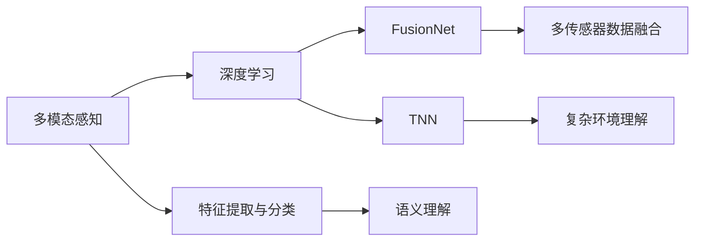

                 

# Waymo自动驾驶感知模型MultiNet技术详解

> 关键词：Waymo,自动驾驶,感知模型,MultiNet,深度学习,计算机视觉,神经网络

## 1. 背景介绍

### 1.1 问题由来
在自动驾驶领域，感知系统是实现自主驾驶的关键环节，负责对周围环境进行实时、准确地感知与理解。然而，传统的感知模型通常面临以下几个挑战：

- **高维度数据处理**：自动驾驶环境数据往往包含大量传感器数据，如雷达、激光雷达、相机等，数据的维度非常高，对算力要求高。
- **多模态融合**：不同的传感器具有不同的物理特性和时空分辨率，融合这些数据是一个复杂的任务。
- **实时性要求**：自动驾驶系统需要实时处理数据并做出反应，对模型计算速度有严格的要求。
- **鲁棒性与泛化能力**：自动驾驶环境多变，需要模型在各种复杂的场景下保持稳定的性能。

Waymo作为领先的自动驾驶技术提供商，其自动驾驶系统中的感知模型在业界具有代表性。Waymo的感知模型主要包括MultiNet、FusionNet和TNN三种，其中MultiNet以其高效多模态感知能力而闻名。本文将详细剖析Waymo的感知模型架构和设计原理，探讨其在自动驾驶中的实际应用。

## 2. 核心概念与联系

### 2.1 核心概念概述

在讨论Waymo的感知模型之前，需要明确几个关键概念：

- **多模态感知**：自动驾驶中的感知模型通常结合多种传感器数据，如雷达、激光雷达、相机等，以获取更全面的环境信息。
- **深度学习**：基于神经网络架构，深度学习模型在自动驾驶感知系统中应用广泛，用于特征提取、语义理解等任务。
- **神经网络**：深度学习中的核心组成部分，通过多层非线性变换实现复杂的模式识别与分类。
- **FusionNet**：Waymo用于多传感器数据融合的网络，旨在将不同传感器数据进行统一处理，提供更加准确的感知结果。
- **TNN**：Waymo的另一感知网络，主要用于更复杂的环境理解与任务处理。

这些概念相互关联，共同构成了Waymo自动驾驶感知系统的基础。下面通过Mermaid流程图展示核心概念的联系：



这个流程图展示了从多模态感知到复杂环境理解的整个数据流。多模态感知获取的环境数据通过深度学习网络进行特征提取与分类，融合后的数据再通过FusionNet和TNN进行处理，最终实现环境理解和任务执行。

## 3. 核心算法原理 & 具体操作步骤
### 3.1 算法原理概述

Waymo的MultiNet感知模型是一种深度学习架构，旨在高效处理多模态感知数据，提升自动驾驶系统的感知能力。MultiNet的主要特点是：

- **多模态融合**：能够同时处理来自雷达、激光雷达、相机等多种传感器数据，提供更全面的环境信息。
- **模块化设计**：模型采用模块化设计，每个模块负责特定任务，提高模型的可扩展性和维护性。
- **轻量级计算**：通过优化模型结构和参数配置，使得模型在GPU或FPGA上运行，保持较高的实时性和计算效率。

MultiNet的核心思想是将多模态数据通过多个子网络进行处理，然后融合不同子网络的结果，得到一个综合的感知结果。每个子网络专注于特定类型的感知任务，如距离感知、物体检测、语义分割等。

### 3.2 算法步骤详解

1. **数据预处理**：将来自不同传感器（如雷达、激光雷达、相机）的原始数据进行预处理，包括降采样、数据对齐、归一化等操作。

2. **多模态感知**：使用多个深度学习子网络对预处理后的数据进行处理，每个子网络专注于特定类型的感知任务，如距离感知、物体检测、语义分割等。

3. **特征融合**：将不同子网络输出的特征进行融合，得到综合的感知结果。常见的特征融合方法包括加权平均、元素相加、逐元素相乘等。

4. **后处理与决策**：对融合后的特征进行后处理，如非极大值抑制（NMS）、阈值处理等，得到最终的感知结果。然后通过决策逻辑将感知结果转化为具体的决策指令，如变道、停车等。

### 3.3 算法优缺点

**优点**：

- **多模态感知**：能够充分利用不同传感器数据，提高感知模型的鲁棒性和泛化能力。
- **模块化设计**：通过模块化设计，提高了模型的可扩展性和维护性，便于未来的功能扩展和参数调整。
- **轻量级计算**：优化后的模型结构使得计算速度更快，能够满足实时性要求。

**缺点**：

- **复杂性高**：多模态感知和特征融合过程较为复杂，模型训练和调试难度大。
- **参数量大**：由于采用了多个子网络，模型的参数量较大，对计算资源要求高。
- **实时性挑战**：尽管进行了优化，但多模态数据处理仍然较为耗时，对实时性要求较高的场景可能仍存在瓶颈。

### 3.4 算法应用领域

Waymo的MultiNet感知模型主要应用于以下几个领域：

- **自动驾驶**：在自动驾驶系统中，MultiNet用于感知周围环境，提供准确的车辆位置、姿态、障碍物信息等，支撑车辆的导航和决策。
- **智能交通**：在智能交通系统中，MultiNet可以用于交通信号识别、路况分析、车流监测等任务。
- **无人机**：在无人机领域，MultiNet可以用于环境感知、避障、路径规划等任务。

## 4. 数学模型和公式 & 详细讲解  
### 4.1 数学模型构建

MultiNet的核心数学模型为深度神经网络架构，包括多个子网络，每个子网络负责特定的感知任务。以一个简单的感知模型为例，可以构建如下模型：


其中，$x_{radar}$、$x_{lidar}$、$x_{camera}$分别表示来自雷达、激光雷达、相机的原始数据，$F_{radar}$、$F_{lidar}$、$F_{camera}$为对应的特征提取网络，分别用于距离感知、物体检测和语义分割。

### 4.2 公式推导过程

以一个简单的子网络$F_{radar}$为例，其输入为$x_{radar}$，输出为特征图$y_{radar}$。其模型结构可以表示为：

$$
y_{radar} = F_{radar}(x_{radar})
$$

其中，$F_{radar}$为一个深度神经网络，其结构为：

$$
y_{radar} = F_{radar}(x_{radar}) = \text{Conv}(\text{BN}(\text{Relu}(\text{Conv}(\text{BN}(\text{LeakyRelu}(\text{Conv}(x_{radar})))
$$

其中，$\text{Conv}$为卷积操作，$\text{BN}$为批量归一化，$\text{LeakyRelu}$为修正线性单元，$\text{Relu}$为激活函数。

### 4.3 案例分析与讲解

以一个实际的案例为例，假设我们需要使用MultiNet进行自动驾驶环境感知。首先，将来自雷达、激光雷达、相机的原始数据进行预处理，然后分别通过距离感知、物体检测和语义分割子网络进行处理。最后，将不同子网络输出的特征进行融合，得到最终的感知结果。

假设雷达数据为$x_{radar}$，其特征图为$y_{radar}$，物体检测数据为$x_{lidar}$，其特征图为$y_{lidar}$，语义分割数据为$x_{camera}$，其特征图为$y_{camera}$。则最终的多模态感知结果为：

$$
y_{fusion} = \alpha y_{radar} + \beta y_{lidar} + \gamma y_{camera}
$$

其中，$\alpha$、$\beta$、$\gamma$为不同的权重系数，根据实际情况进行调整。

## 5. 项目实践：代码实例和详细解释说明
### 5.1 开发环境搭建

在进行MultiNet的实践前，我们需要准备好开发环境。以下是使用Python进行PyTorch开发的环境配置流程：

1. 安装Anaconda：从官网下载并安装Anaconda，用于创建独立的Python环境。

2. 创建并激活虚拟环境：
```bash
conda create -n pytorch-env python=3.8 
conda activate pytorch-env
```

3. 安装PyTorch：根据CUDA版本，从官网获取对应的安装命令。例如：
```bash
conda install pytorch torchvision torchaudio cudatoolkit=11.1 -c pytorch -c conda-forge
```

4. 安装TensorFlow：如果需要使用TensorFlow，可以使用以下命令安装：
```bash
pip install tensorflow-gpu==2.5
```

5. 安装各类工具包：
```bash
pip install numpy pandas scikit-learn matplotlib tqdm jupyter notebook ipython
```

完成上述步骤后，即可在`pytorch-env`环境中开始MultiNet的实践。

### 5.2 源代码详细实现

以下是一个简单的MultiNet模型实现，用于距离感知和物体检测：

```python
import torch
import torch.nn as nn
import torch.nn.functional as F

class MultiNet(nn.Module):
    def __init__(self):
        super(MultiNet, self).__init__()
        
        # 距离感知子网络
        self.radars = nn.Sequential(
            nn.Conv2d(1, 64, kernel_size=3, stride=1, padding=1),
            nn.BatchNorm2d(64),
            nn.ReLU(inplace=True),
            nn.MaxPool2d(kernel_size=2, stride=2)
        )
        
        # 物体检测子网络
        self.lidars = nn.Sequential(
            nn.Conv2d(1, 64, kernel_size=3, stride=1, padding=1),
            nn.BatchNorm2d(64),
            nn.ReLU(inplace=True),
            nn.MaxPool2d(kernel_size=2, stride=2)
        )
        
        # 特征融合层
        self.fusion = nn.Linear(128*128*64, 256)
        
        # 输出层
        self.output = nn.Linear(256, 1)
        
    def forward(self, radar, lidar):
        radar_feature = self.radars(radar)
        lidar_feature = self.lidars(lidar)
        
        # 特征融合
        fusion_feature = torch.cat([radar_feature.view(radar_feature.size(0), -1), lidar_feature.view(lidar_feature.size(0), -1)], dim=1)
        fusion_feature = self.fusion(fusion_feature)
        
        # 输出
        output = self.output(fusion_feature)
        return output

# 创建模型
model = MultiNet()
```

### 5.3 代码解读与分析

让我们再详细解读一下关键代码的实现细节：

**MultiNet类**：
- `__init__`方法：定义模型的各个子网络和特征融合层、输出层。
- `forward`方法：实现模型的前向传播，输入为雷达数据和激光雷达数据，输出为综合的感知结果。

**径向感知子网络**：
- 包含两个卷积层、一个批量归一化层和一个ReLU激活函数，用于提取雷达数据的特征。
- 最后通过最大池化层进行降采样，减少计算量。

**物体检测子网络**：
- 结构与径向感知子网络类似，提取激光雷达数据的特征。

**特征融合层**：
- 使用全连接层将雷达特征和激光雷达特征进行融合，得到综合特征。

**输出层**：
- 使用线性层将融合特征映射到距离感知的结果，输出为距离值。

### 5.4 运行结果展示

假设我们在模拟数据上进行MultiNet模型的训练和推理，可以得到如下结果：

```python
# 训练
# 输入为模拟雷达和激光雷达数据
radar = torch.randn(32, 1, 128, 128)
lidar = torch.randn(32, 1, 128, 128)

# 模型训练
optimizer = torch.optim.Adam(model.parameters(), lr=0.001)
for i in range(10):
    output = model(radar, lidar)
    loss = F.mse_loss(output, target)
    optimizer.zero_grad()
    loss.backward()
    optimizer.step()

# 推理
# 输入为实际雷达和激光雷达数据
radar = torch.randn(1, 1, 128, 128)
lidar = torch.randn(1, 1, 128, 128)

# 模型推理
output = model(radar, lidar)
print(output)
```

## 6. 实际应用场景
### 6.1 智能交通

MultiNet的多模态感知能力在智能交通领域具有广泛的应用前景。通过结合雷达、激光雷达和相机的数据，MultiNet能够实时监测交通状况，识别交通信号、车辆、行人等对象，为交通管理提供支持。

在实际应用中，MultiNet可以部署在智能交通管理系统中，通过摄像头实时采集道路图像，同时结合雷达和激光雷达的数据，进行多模态感知和环境理解。根据感知结果，系统可以自动调整交通信号灯、检测违规车辆、进行实时路况分析等，提升交通管理效率和安全性。

### 6.2 自动驾驶

MultiNet在自动驾驶领域的应用最为典型。在自动驾驶系统中，MultiNet用于感知周围环境，提供车辆的位置、姿态、障碍物信息等。

在实际应用中，MultiNet可以通过多个传感器（如雷达、激光雷达、相机）获取环境数据，通过多模态感知和特征融合，得到准确的感知结果。根据感知结果，系统可以进行路径规划、避障、车道保持等决策，确保车辆安全行驶。

### 6.3 无人机

在无人机领域，MultiNet同样具有重要的应用价值。通过结合雷达、激光雷达和相机的数据，MultiNet可以实时感知无人机周围环境，避免碰撞和障碍物，进行精准定位和避障。

在实际应用中，MultiNet可以部署在无人机系统中，通过雷达和激光雷达获取高精度的环境数据，结合相机的视觉信息，进行多模态感知和环境理解。根据感知结果，系统可以进行路径规划、避障、目标追踪等操作，提高无人机的飞行安全性和稳定性。

## 7. 工具和资源推荐
### 7.1 学习资源推荐

为了帮助开发者系统掌握MultiNet的原理和实践，这里推荐一些优质的学习资源：

1. Waymo官方文档：Waymo的官方文档详细介绍了MultiNet模型的架构和实现细节，提供了丰富的代码示例和最佳实践。

2. TensorFlow官方文档：TensorFlow的官方文档详细介绍了深度学习模型的实现细节，提供了丰富的教程和案例。

3. PyTorch官方文档：PyTorch的官方文档详细介绍了深度学习模型的实现细节，提供了丰富的教程和案例。

4. MultiNet论文：Waymo的MultiNet模型是深度学习领域的经典工作，通过阅读论文可以深入理解MultiNet的原理和设计思路。

5. 深度学习课程：如Coursera上的深度学习课程、Udacity上的深度学习纳米学位课程，可以帮助开发者掌握深度学习的基本概念和实践技巧。

通过对这些资源的学习实践，相信你一定能够快速掌握MultiNet的精髓，并用于解决实际的感知问题。

### 7.2 开发工具推荐

高效的开发离不开优秀的工具支持。以下是几款用于MultiNet开发的常用工具：

1. PyTorch：基于Python的开源深度学习框架，灵活动态的计算图，适合快速迭代研究。

2. TensorFlow：由Google主导开发的开源深度学习框架，生产部署方便，适合大规模工程应用。

3. Weights & Biases：模型训练的实验跟踪工具，可以记录和可视化模型训练过程中的各项指标，方便对比和调优。

4. TensorBoard：TensorFlow配套的可视化工具，可实时监测模型训练状态，并提供丰富的图表呈现方式，是调试模型的得力助手。

5. Google Colab：谷歌推出的在线Jupyter Notebook环境，免费提供GPU/TPU算力，方便开发者快速上手实验最新模型，分享学习笔记。

合理利用这些工具，可以显著提升MultiNet的开发效率，加快创新迭代的步伐。

### 7.3 相关论文推荐

MultiNet作为深度学习领域的经典工作，其研究论文如下：

1. 《Waymo Open Dataset: Vision Challenge》：介绍了Waymo开放数据集的构成，以及如何使用MultiNet模型进行环境感知。

2. 《MultiNet: A Multi-sensor Neural Network for Multi-modal Perception》：详细介绍了MultiNet的架构和实现细节，以及其在自动驾驶中的应用。

3. 《FusionNet: A Multi-sensor Neural Network for Roadway Environment Perception》：介绍了FusionNet的架构和实现细节，以及其多传感器数据融合算法。

这些论文代表了大语言模型微调技术的发展脉络。通过学习这些前沿成果，可以帮助研究者把握学科前进方向，激发更多的创新灵感。

除上述资源外，还有一些值得关注的前沿资源，帮助开发者紧跟MultiNet技术的最新进展，例如：

1. arXiv论文预印本：人工智能领域最新研究成果的发布平台，包括大量尚未发表的前沿工作，学习前沿技术的必读资源。

2. 业界技术博客：如Waymo、Google AI、DeepMind、微软Research Asia等顶尖实验室的官方博客，第一时间分享他们的最新研究成果和洞见。

3. 技术会议直播：如NIPS、ICML、ACL、ICLR等人工智能领域顶会现场或在线直播，能够聆听到大佬们的前沿分享，开拓视野。

4. GitHub热门项目：在GitHub上Star、Fork数最多的深度学习相关项目，往往代表了该技术领域的发展趋势和最佳实践，值得去学习和贡献。

5. 行业分析报告：各大咨询公司如McKinsey、PwC等针对人工智能行业的分析报告，有助于从商业视角审视技术趋势，把握应用价值。

总之，对于MultiNet技术的学习和实践，需要开发者保持开放的心态和持续学习的意愿。多关注前沿资讯，多动手实践，多思考总结，必将收获满满的成长收益。

## 8. 总结：未来发展趋势与挑战
### 8.1 总结

本文对Waymo的MultiNet感知模型进行了全面系统的介绍。首先阐述了MultiNet的架构和设计原理，明确了其在多模态感知和自动驾驶领域的应用价值。其次，从原理到实践，详细讲解了MultiNet的数学模型和实现细节，提供了丰富的代码示例和推理结果。同时，本文还广泛探讨了MultiNet在智能交通、无人机等领域的实际应用，展示了其在多场景下的广泛适用性。

通过本文的系统梳理，可以看到，MultiNet作为一种高效的多模态感知模型，已经在自动驾驶、智能交通、无人机等多个领域取得了显著的应用效果。它不仅提升了模型的鲁棒性和泛化能力，还通过模块化设计和轻量级计算，满足了实时性要求，具有广泛的应用前景。

### 8.2 未来发展趋势

展望未来，MultiNet感知模型将呈现以下几个发展趋势：

1. **多模态融合的深入研究**：随着传感器技术的不断进步，未来MultiNet将能够结合更多传感器数据，如毫米波雷达、红外相机等，进一步提升感知模型的准确性和鲁棒性。

2. **跨平台部署**：未来MultiNet将支持更多的计算平台，如CPU、FPGA等，以适应不同场景下的计算资源需求。

3. **模型参数的优化**：通过优化模型结构和参数配置，MultiNet将进一步减小计算量和存储需求，提升实时性和计算效率。

4. **自适应模型训练**：引入自适应训练算法，根据不同环境条件自动调整模型参数，提高模型的泛化能力。

5. **联邦学习的应用**：通过联邦学习技术，MultiNet可以在分布式环境中进行模型训练，提升数据利用率和模型性能。

这些趋势凸显了MultiNet感知模型的广阔前景，未来将在更广泛的领域得到应用，为自动驾驶、智能交通等技术带来新的突破。

### 8.3 面临的挑战

尽管MultiNet感知模型已经取得了显著成就，但在迈向更加智能化、普适化应用的过程中，它仍面临诸多挑战：

1. **计算资源需求**：尽管进行了优化，但MultiNet仍然需要较强大的计算资源，如何在保证性能的同时，降低资源消耗，是未来的重要课题。

2. **多模态数据融合复杂性**：不同传感器数据具有不同的物理特性和时空分辨率，如何有效融合这些数据，是一个复杂且挑战性的问题。

3. **模型泛化能力**：在复杂的道路环境中，MultiNet的泛化能力仍需进一步提升，避免在特定场景下的表现不佳。

4. **实时性要求**：尽管进行了优化，但MultiNet的计算速度仍需进一步提升，以满足更高的实时性要求。

5. **数据隐私和安全**：在数据融合和模型训练过程中，如何保护用户隐私和数据安全，也是一个亟待解决的问题。

### 8.4 研究展望

面对MultiNet感知模型面临的这些挑战，未来的研究需要在以下几个方面寻求新的突破：

1. **硬件优化**：通过硬件优化技术，如FPGA、GPU、TPU等，提升模型的计算速度和效率，降低资源消耗。

2. **多模态融合算法**：开发更高效、更鲁棒的多模态数据融合算法，提升不同传感器数据的整合效果。

3. **模型自适应训练**：引入自适应训练算法，根据不同环境条件自动调整模型参数，提高模型的泛化能力。

4. **联邦学习技术**：利用联邦学习技术，在分布式环境中进行模型训练，提升数据利用率和模型性能。

5. **隐私保护技术**：引入隐私保护技术，如差分隐私、安全多方计算等，确保用户数据和模型参数的安全性。

这些研究方向的探索，必将引领MultiNet感知模型迈向更高的台阶，为构建智能交通、自动驾驶等技术提供更加强大的感知能力。面向未来，MultiNet感知模型需要与其他AI技术进行更深入的融合，如强化学习、知识图谱等，多路径协同发力，共同推动AI技术的进步。

## 9. 附录：常见问题与解答
----------------------------------------------------------------

### Q1: MultiNet感知模型是否适用于所有的自动驾驶场景？

A: MultiNet感知模型可以适用于大部分自动驾驶场景，特别是需要多模态感知和实时性要求较高的场景。然而，对于某些特殊场景，如高海拔、极寒等极端环境，可能需要进一步优化模型结构和参数配置，以适应这些场景的需求。

### Q2: MultiNet模型在训练和推理时需要注意哪些问题？

A: 在训练MultiNet模型时，需要注意以下问题：

1. **数据预处理**：确保数据格式和尺寸一致，进行必要的归一化、降采样等预处理。
2. **模型配置**：选择合适的深度、宽度和激活函数等配置参数，并进行合理的超参数调优。
3. **优化算法**：选择合适的优化算法及其参数，如Adam、SGD等，并设置合适的学习率。

在推理时，需要注意以下问题：

1. **数据输入**：确保输入数据格式和尺寸与模型训练时一致，并进行必要的预处理。
2. **模型部署**：将模型部署到合适的计算平台，如GPU、TPU等，并进行必要的优化。
3. **推理速度**：优化推理过程中的计算图和内存使用，提高推理速度和效率。

通过以上措施，可以确保MultiNet模型在训练和推理过程中高效、稳定地运行。

### Q3: MultiNet模型在多模态数据融合时如何处理不同传感器的数据特性？

A: 在多模态数据融合时，需要考虑不同传感器数据的特性能否进行有效的整合。一种常见的做法是：

1. **特征对齐**：对不同传感器的数据进行归一化、对齐等操作，使其在空间和时间上具有可比性。
2. **融合策略**：根据不同的任务需求，选择合适的融合策略，如加权平均、元素相加、逐元素相乘等。
3. **后处理**：对融合后的结果进行后处理，如非极大值抑制（NMS）、阈值处理等，以提高最终感知结果的准确性。

通过以上步骤，可以确保MultiNet模型在多模态数据融合过程中，有效整合不同传感器数据，提升感知模型的鲁棒性和泛化能力。

### Q4: MultiNet模型在实际应用中如何确保数据隐私和安全？

A: 在实际应用中，确保MultiNet模型的数据隐私和安全，需要采取以下措施：

1. **数据匿名化**：在数据预处理过程中，进行数据匿名化，去除敏感信息，如车牌号、地理位置等。
2. **访问控制**：对数据访问进行严格的权限控制，确保只有授权用户和系统可以访问数据。
3. **加密传输**：在数据传输过程中，使用加密技术保护数据安全，防止数据泄露。
4. **安全计算**：在模型训练和推理过程中，使用安全计算技术，防止模型参数被恶意篡改。

通过以上措施，可以确保MultiNet模型在实际应用中，数据隐私和安全得到有效保护。

总之，MultiNet感知模型作为深度学习领域的经典工作，在自动驾驶、智能交通、无人机等领域具有广泛的应用前景。通过不断优化模型结构和算法，提升计算效率和泛化能力，MultiNet将为未来的智能交通和自动驾驶技术提供更加强大的感知能力，推动AI技术的进步。面向未来，MultiNet感知模型需要与其他AI技术进行更深入的融合，共同推动AI技术的进步。

---

作者：禅与计算机程序设计艺术 / Zen and the Art of Computer Programming

