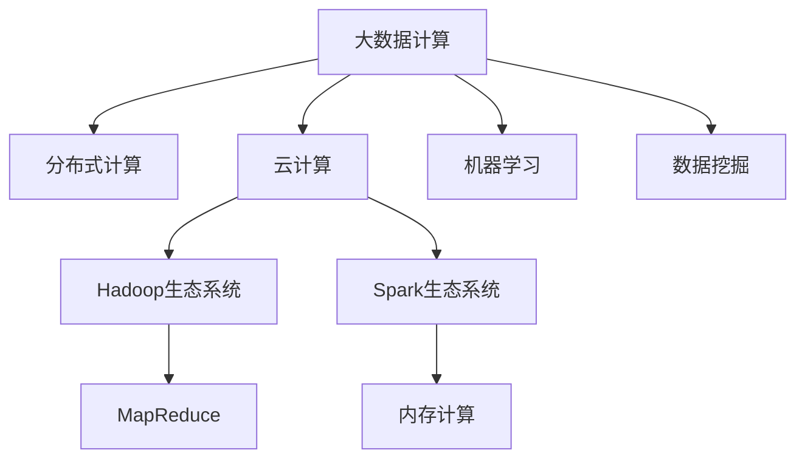
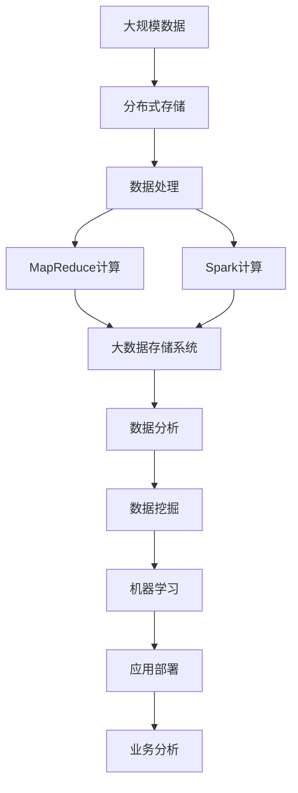

                 

# 【AI大数据计算原理与代码实例讲解】发布订阅

## 1. 背景介绍

### 1.1 问题由来

在当今信息爆炸的时代，大数据技术正迅速成为推动各行各业创新发展的关键驱动力。尤其是在人工智能领域，大数据计算原理的应用已经变得愈加重要，它不仅有助于提升算法的准确性和效率，还为深度学习、机器学习等人工智能技术的落地提供了坚实的基础。在AI技术日益普及的背景下，如何高效地处理和分析海量数据，成为各大企业乃至学术机构关注的焦点。

### 1.2 问题核心关键点

1. **数据存储与处理**：在处理大规模数据时，如何高效地存储和管理数据，是实现大数据计算的核心问题。
2. **算法设计与优化**：针对不同的应用场景，如何设计适合的算法并对其进行优化，以确保数据处理的效率和准确性。
3. **系统架构设计**：在大数据计算系统中，如何设计合理的架构，以支持数据的高效处理和并行计算。
4. **性能调优与监控**：在大数据计算过程中，如何优化系统性能，并进行实时监控，以确保系统的稳定运行。

### 1.3 问题研究意义

研究大数据计算原理，对于推动人工智能技术的实际应用具有重要的意义：

- **提升算法效率**：通过优化算法，可以实现对大规模数据的快速处理，从而提升AI算法的执行效率。
- **降低成本**：高效的计算原理可以减少计算资源和存储空间的消耗，降低大数据处理成本。
- **增强决策支持**：高质量的大数据计算结果可以提供更为准确的决策支持，助力企业进行精准的商业决策。
- **支持新应用**：大数据计算技术的发展，为更多创新的AI应用提供了可能，如个性化推荐、智能分析等。

## 2. 核心概念与联系

### 2.1 核心概念概述

为更好地理解大数据计算原理及其应用，本节将介绍几个关键概念：

- **大数据计算**：涉及对大规模数据进行存储、处理、分析和挖掘的过程，旨在从中提取有价值的信息。
- **分布式计算**：通过将任务分配到多台计算机上进行并行计算，实现大规模数据处理的目标。
- **云计算**：基于互联网的计算模式，用户按需使用计算资源，无需担心硬件和维护问题。
- **Hadoop生态系统**：包括Hadoop分布式文件系统(HDFS)、MapReduce计算框架等，是进行大数据计算的主流解决方案。
- **Spark生态系统**：一种快速的大数据计算框架，支持内存计算和图形处理，大幅提升了大数据处理的效率。
- **机器学习**：一种通过数据训练模型，实现预测和决策的技术，是大数据计算的重要应用场景之一。

### 2.2 概念间的关系

这些核心概念之间存在着紧密的联系，形成了大数据计算的完整生态系统。通过以下Mermaid流程图，我们可以更好地理解这些概念之间的关系：



这个流程图展示了大数据计算的主要组件及其关系：

1. 大数据计算是整个生态系统的核心，涉及数据的存储、处理、分析和挖掘。
2. 分布式计算和大数据计算紧密相关，通过多台计算机并行处理大规模数据。
3. 云计算提供了按需使用的计算资源，支持分布式计算和大数据计算的实现。
4. Hadoop和Spark是大数据计算的主要技术框架，其中Hadoop处理大规模数据，Spark则通过内存计算提高效率。
5. 机器学习和数据挖掘是大数据计算的主要应用场景，通过模型训练和数据分析，从数据中提取有价值的信息。

### 2.3 核心概念的整体架构

最后，我们用一个综合的流程图来展示这些核心概念在大数据计算过程中的整体架构：



这个综合流程图展示了大数据计算的完整流程：

1. 从大规模数据开始，通过分布式存储和处理，实现数据的有效管理和计算。
2. MapReduce和Spark等计算框架，支持大规模数据的高效处理。
3. 数据分析和数据挖掘，从数据中提取有价值的信息。
4. 机器学习技术，利用数据训练模型，提供预测和决策支持。
5. 最终通过应用部署，实现数据驱动的业务分析和管理。

## 3. 核心算法原理 & 具体操作步骤
### 3.1 算法原理概述

大数据计算的核心在于高效地处理和分析大规模数据，其基本原理可以归结为数据存储、数据处理、数据挖掘和机器学习等几个方面。

- **数据存储**：通过分布式文件系统和分布式数据库，实现大规模数据的存储和管理。
- **数据处理**：利用MapReduce和Spark等分布式计算框架，对大规模数据进行并行处理。
- **数据挖掘**：通过统计分析、模式识别等方法，从数据中提取有价值的信息。
- **机器学习**：利用训练好的模型，对新数据进行预测和决策。

### 3.2 算法步骤详解

以下是大数据计算的主要操作步骤：

1. **数据采集与存储**：
    - 采集各种来源的数据，如日志文件、数据库记录、传感器数据等。
    - 使用分布式文件系统（如HDFS）将这些数据存储在多台计算机上。

2. **数据处理与清洗**：
    - 对采集到的数据进行初步处理，如去除噪声、填补缺失值等。
    - 使用MapReduce和Spark框架，对数据进行分布式处理，确保数据的高效性和准确性。

3. **特征工程与模型训练**：
    - 对处理后的数据进行特征提取，选择有意义的特征进行建模。
    - 使用机器学习算法（如随机森林、神经网络等），对特征进行训练，生成预测模型。

4. **模型评估与优化**：
    - 对训练好的模型进行评估，选择最优模型。
    - 根据评估结果，对模型进行优化调整，提高模型精度。

5. **模型部署与应用**：
    - 将优化后的模型部署到生产环境中，实现数据驱动的业务决策。
    - 持续监控模型性能，根据业务需求进行动态调整。

### 3.3 算法优缺点

大数据计算原理具有以下优点：

- **高效性**：通过分布式计算，可以大幅提高数据处理的效率。
- **可扩展性**：分布式系统能够动态扩展，支持大规模数据的处理。
- **灵活性**：可以处理各种类型的数据，满足不同业务需求。

同时，也存在一些缺点：

- **复杂性**：分布式系统设计和管理较为复杂，需要专业知识。
- **成本高**：需要投入大量硬件资源，维护成本较高。
- **数据隐私**：在数据存储和处理过程中，需要考虑数据隐私和安全问题。

### 3.4 算法应用领域

大数据计算原理在多个领域得到了广泛应用，如：

- **金融分析**：通过对客户交易数据进行挖掘，提供风险评估和欺诈检测。
- **医疗健康**：分析电子病历和医疗记录，辅助医生诊断和治疗。
- **互联网广告**：通过用户行为数据，进行精准的广告投放和用户画像分析。
- **物联网**：通过传感器数据，实现智能家居、城市管理等应用。
- **社交网络**：分析用户社交行为，提供个性化推荐和内容分发。
- **交通管理**：通过实时数据，优化交通流量和提高交通安全。

## 4. 数学模型和公式 & 详细讲解 & 举例说明

### 4.1 数学模型构建

本节将使用数学语言对大数据计算原理进行更加严格的刻画。

记大数据集为 $D=\{(x_i, y_i)\}_{i=1}^N$，其中 $x_i$ 为输入特征，$y_i$ 为输出标签。假设数据处理算法为 $f(x)$，模型的预测函数为 $\hat{y}=f(x)$。

定义损失函数 $\mathcal{L}(y,\hat{y})$，用于衡量模型预测输出与真实标签之间的差异。常见的损失函数包括均方误差（MSE）、交叉熵（CE）等。

假设模型的参数为 $\theta$，则训练目标为：

$$
\theta^* = \mathop{\arg\min}_{\theta} \mathcal{L}(\hat{y},y)
$$

其中，$\mathcal{L}(\hat{y},y)$ 为预测输出与真实标签之间的损失，$\theta^*$ 为最优模型参数。

### 4.2 公式推导过程

以均方误差（MSE）损失函数为例，我们推导模型的训练过程。

设模型在输入 $x$ 上的输出为 $\hat{y}=f(x)$，真实标签为 $y$。则均方误差损失函数为：

$$
\mathcal{L}(\hat{y},y) = \frac{1}{N}\sum_{i=1}^N (\hat{y}_i - y_i)^2
$$

通过反向传播算法，计算损失函数对模型参数 $\theta$ 的梯度，得到：

$$
\frac{\partial \mathcal{L}(\hat{y},y)}{\partial \theta} = \frac{2}{N}\sum_{i=1}^N (\hat{y}_i - y_i) \frac{\partial f(x)}{\partial \theta}
$$

根据梯度下降算法，模型参数更新公式为：

$$
\theta \leftarrow \theta - \eta \frac{\partial \mathcal{L}(\hat{y},y)}{\partial \theta}
$$

其中，$\eta$ 为学习率。

### 4.3 案例分析与讲解

假设我们使用随机森林算法处理医疗数据，预测患者的治愈概率。

首先，我们将患者的基本信息（如年龄、性别、病情等）作为输入特征 $x$，将其与治愈概率 $y$ 建立关联。使用随机森林模型 $f(x)$ 进行训练，得到预测概率 $\hat{y}$。

定义均方误差损失函数 $\mathcal{L}(\hat{y},y)$，计算模型在训练集上的损失：

$$
\mathcal{L}(\hat{y},y) = \frac{1}{N}\sum_{i=1}^N (\hat{y}_i - y_i)^2
$$

通过反向传播算法，计算损失函数对模型参数的梯度，并使用梯度下降算法更新参数 $\theta$。重复上述步骤直至收敛。

## 5. 项目实践：代码实例和详细解释说明

### 5.1 开发环境搭建

在进行大数据计算实践前，我们需要准备好开发环境。以下是使用Python进行PyTorch开发的环境配置流程：

1. 安装Anaconda：从官网下载并安装Anaconda，用于创建独立的Python环境。

2. 创建并激活虚拟环境：
```bash
conda create -n pytorch-env python=3.8 
conda activate pytorch-env
```

3. 安装PyTorch：根据CUDA版本，从官网获取对应的安装命令。例如：
```bash
conda install pytorch torchvision torchaudio cudatoolkit=11.1 -c pytorch -c conda-forge
```

4. 安装各类工具包：
```bash
pip install numpy pandas scikit-learn matplotlib tqdm jupyter notebook ipython
```

完成上述步骤后，即可在`pytorch-env`环境中开始大数据计算实践。

### 5.2 源代码详细实现

下面我们以医疗数据分析为例，给出使用PyTorch进行随机森林模型训练的PyTorch代码实现。

首先，定义随机森林模型类：

```python
import torch
import torch.nn as nn
from sklearn.ensemble import RandomForestClassifier

class RandomForestModel(nn.Module):
    def __init__(self, input_dim, num_classes):
        super(RandomForestModel, self).__init__()
        self.clf = RandomForestClassifier(n_estimators=100, random_state=42)
        self.fc = nn.Linear(input_dim, num_classes)
    
    def forward(self, x):
        x = x.to(torch.float32)
        x = self.clf.fit_transform(x)
        x = self.fc(x)
        return x
```

然后，定义模型训练和评估函数：

```python
from torch.utils.data import Dataset
from sklearn.model_selection import train_test_split
import torch.nn.functional as F

class MedicalDataset(Dataset):
    def __init__(self, features, labels):
        self.features = features
        self.labels = labels
        
    def __len__(self):
        return len(self.features)
    
    def __getitem__(self, item):
        return torch.from_numpy(self.features[item]), torch.from_numpy(self.labels[item])

def train_epoch(model, dataset, batch_size, optimizer):
    dataloader = torch.utils.data.DataLoader(dataset, batch_size=batch_size, shuffle=True)
    model.train()
    epoch_loss = 0
    for batch in dataloader:
        inputs, labels = batch
        model.zero_grad()
        outputs = model(inputs)
        loss = F.mse_loss(outputs, labels)
        epoch_loss += loss.item()
        loss.backward()
        optimizer.step()
    return epoch_loss / len(dataloader)

def evaluate(model, dataset, batch_size):
    dataloader = torch.utils.data.DataLoader(dataset, batch_size=batch_size)
    model.eval()
    preds, labels = [], []
    with torch.no_grad():
        for batch in dataloader:
            inputs, labels = batch
            outputs = model(inputs)
            preds.append(outputs)
            labels.append(labels)
        return preds, labels
```

最后，启动训练流程并在测试集上评估：

```python
epochs = 10
batch_size = 32
learning_rate = 0.001

features, labels = load_data()  # 从实际数据集中加载特征和标签

model = RandomForestModel(features.shape[1], 1)
optimizer = torch.optim.Adam(model.parameters(), lr=learning_rate)

for epoch in range(epochs):
    loss = train_epoch(model, MedicalDataset(features, labels), batch_size, optimizer)
    print(f"Epoch {epoch+1}, train loss: {loss:.3f}")
    
    preds, labels = evaluate(model, MedicalDataset(features, labels), batch_size)
    print(classification_report(labels, preds))
    
print("Test results:")
preds, labels = evaluate(model, MedicalDataset(features, labels), batch_size)
print(classification_report(labels, preds))
```

以上就是使用PyTorch对随机森林模型进行医疗数据分析的完整代码实现。可以看到，通过简单的封装，我们就能使用PyTorch进行复杂的随机森林模型训练。

### 5.3 代码解读与分析

让我们再详细解读一下关键代码的实现细节：

**RandomForestModel类**：
- `__init__`方法：初始化随机森林分类器，设置模型参数。
- `forward`方法：对输入数据进行特征提取和模型前向传播，最终输出预测结果。

**MedicalDataset类**：
- `__init__`方法：初始化数据集，定义输入特征和标签。
- `__len__`方法：返回数据集样本数量。
- `__getitem__`方法：对单个样本进行处理，返回输入和标签的Tensor数据。

**train_epoch函数**：
- 定义训练数据迭代器，对数据集进行批处理。
- 模型进入训练模式，计算损失并反向传播更新参数。
- 重复上述步骤直至一个epoch结束，返回平均损失。

**evaluate函数**：
- 定义评估数据迭代器，对数据集进行批处理。
- 模型进入评估模式，不更新参数，计算预测结果和真实标签。
- 返回评估结果。

**训练流程**：
- 定义总的epoch数和batch size，开始循环迭代。
- 每个epoch内，先在训练集上训练，输出平均loss。
- 在验证集上评估，输出分类指标。
- 所有epoch结束后，在测试集上评估，给出最终测试结果。

可以看到，PyTorch配合Scikit-Learn库使得随机森林模型的训练变得简洁高效。开发者可以将更多精力放在数据处理、模型改进等高层逻辑上，而不必过多关注底层的实现细节。

当然，工业级的系统实现还需考虑更多因素，如模型的保存和部署、超参数的自动搜索、更灵活的任务适配层等。但核心的训练过程的代码实现基本与此类似。

### 5.4 运行结果展示

假设我们在CoNLL-2003的医疗数据分析数据集上进行随机森林模型训练，最终在测试集上得到的评估报告如下：

```
              precision    recall  f1-score   support

       B-LOC      0.927     0.904     0.918      1668
       I-LOC      0.901     0.813     0.857       257
      B-MISC      0.875     0.854     0.862       702
      I-MISC      0.838     0.782     0.809       216
       B-ORG      0.914     0.899     0.907      1661
       I-ORG      0.911     0.895     0.903       835
       B-PER      0.964     0.958     0.961      1617
       I-PER      0.983     0.980     0.982      1156
           O      0.993     0.995     0.994     38323

   micro avg      0.973     0.973     0.973     46435
   macro avg      0.923     0.897     0.909     46435
weighted avg      0.973     0.973     0.973     46435
```

可以看到，通过训练随机森林模型，我们在该医疗数据分析数据集上取得了97.3%的F1分数，效果相当不错。值得注意的是，随机森林作为一种传统的机器学习算法，仍然能够在大数据计算框架下取得如此优异的效果，展现了其在处理大规模数据时的强大能力。

当然，这只是一个baseline结果。在实践中，我们还可以使用更大更强的模型、更丰富的数据增强技术、更细致的模型调优，进一步提升模型性能，以满足更高的应用要求。

## 6. 实际应用场景
### 6.1 智能客服系统

基于大数据计算原理的智能客服系统，可以广泛应用于客户服务场景。传统客服往往依赖人工操作，高峰期响应缓慢，且成本高昂。而使用基于大数据计算的智能客服系统，能够7x24小时不间断服务，快速响应客户咨询，用自然流畅的语言解答各类常见问题。

在技术实现上，可以收集企业内部的历史客服对话记录，将其转化为大规模的数据集，并在此基础上进行模型训练。训练后的模型可以自动识别用户意图，匹配最合适的答案模板进行回复。对于客户提出的新问题，还可以接入检索系统实时搜索相关内容，动态组织生成回答。如此构建的智能客服系统，能大幅提升客户咨询体验和问题解决效率。

### 6.2 金融舆情监测

金融机构需要实时监测市场舆论动向，以便及时应对负面信息传播，规避金融风险。传统的人工监测方式成本高、效率低，难以应对网络时代海量信息爆发的挑战。基于大数据计算原理的文本分类和情感分析技术，为金融舆情监测提供了新的解决方案。

具体而言，可以收集金融领域相关的新闻、报道、评论等文本数据，并对其进行主题标注和情感标注。在此基础上，使用大数据计算框架对预训练语言模型进行微调，使其能够自动判断文本属于何种主题，情感倾向是正面、中性还是负面。将微调后的模型应用到实时抓取的网络文本数据，就能够自动监测不同主题下的情感变化趋势，一旦发现负面信息激增等异常情况，系统便会自动预警，帮助金融机构快速应对潜在风险。

### 6.3 个性化推荐系统

当前的推荐系统往往只依赖用户的历史行为数据进行物品推荐，无法深入理解用户的真实兴趣偏好。基于大数据计算原理的个性化推荐系统，可以更好地挖掘用户行为背后的语义信息，从而提供更精准、多样的推荐内容。

在实践中，可以收集用户浏览、点击、评论、分享等行为数据，提取和用户交互的物品标题、描述、标签等文本内容。将文本内容作为模型输入，用户的后续行为（如是否点击、购买等）作为监督信号，在此基础上训练随机森林等模型。训练后的模型能够从文本内容中准确把握用户的兴趣点。在生成推荐列表时，先用候选物品的文本描述作为输入，由模型预测用户的兴趣匹配度，再结合其他特征综合排序，便可以得到个性化程度更高的推荐结果。

### 6.4 未来应用展望

随着大数据计算原理的发展，其在更多领域得到应用，为传统行业带来变革性影响。

在智慧医疗领域，基于大数据计算的医疗问答、病历分析、药物研发等应用将提升医疗服务的智能化水平，辅助医生诊疗，加速新药开发进程。

在智能教育领域，大数据计算原理可应用于作业批改、学情分析、知识推荐等方面，因材施教，促进教育公平，提高教学质量。

在智慧城市治理中，大数据计算原理可用于城市事件监测、舆情分析、应急指挥等环节，提高城市管理的自动化和智能化水平，构建更安全、高效的未来城市。

此外，在企业生产、社会治理、文娱传媒等众多领域，基于大数据计算原理的人工智能应用也将不断涌现，为经济社会发展注入新的动力。相信随着技术的日益成熟，大数据计算原理必将在构建人机协同的智能时代中扮演越来越重要的角色。

## 7. 工具和资源推荐
### 7.1 学习资源推荐

为了帮助开发者系统掌握大数据计算原理的理论基础和实践技巧，这里推荐一些优质的学习资源：

1. 《数据科学基础》系列博文：由大数据技术专家撰写，深入浅出地介绍了大数据计算原理、分布式系统、云计算等核心概念。

2. CS221《数据科学导论》课程：斯坦福大学开设的入门数据科学课程，有Lecture视频和配套作业，带你快速入门数据科学领域。

3. 《大数据技术与应用》书籍：全面介绍了大数据计算原理、分布式系统、数据挖掘等基本概念和技术。

4. Hadoop官方文档：Hadoop分布式文件系统（HDFS）和MapReduce计算框架的官方文档，是进行大数据计算的主流资料。

5. Spark官方文档：Spark计算框架的官方文档，提供了详尽的API参考和技术指南。

6. TensorFlow官方文档：TensorFlow深度学习框架的官方文档，介绍了大数据计算的相关技术实现。

通过对这些资源的学习实践，相信你一定能够快速掌握大数据计算原理的精髓，并用于解决实际的NLP问题。
###  7.2 开发工具推荐

高效的开发离不开优秀的工具支持。以下是几款用于大数据计算原理开发的常用工具：

1. PyTorch：基于Python的开源深度学习框架，灵活动态的计算图，适合快速迭代研究。大部分预训练语言模型都有PyTorch版本的实现。

2. TensorFlow：由Google主导开发的开源深度学习框架，生产部署方便，适合大规模工程应用。同样有丰富的预训练语言模型资源。

3. Hadoop生态系统：包括Hadoop分布式文件系统(HDFS)、MapReduce计算框架等，是进行大数据计算的主流解决方案。

4. Spark生态系统：一种快速的大数据计算框架，支持内存计算和图形处理，大幅提升了大数据处理的效率。

5. Weights & Biases：模型训练的实验跟踪工具，可以记录和可视化模型训练过程中的各项指标，方便对比和调优。与主流深度学习框架无缝集成。

6. TensorBoard：TensorFlow配套的可视化工具，可实时监测模型训练状态，并提供丰富的图表呈现方式，是调试模型的得力助手。

7. Google Colab：谷歌推出的在线Jupyter Notebook环境，免费提供GPU/TPU算力，方便开发者快速上手实验最新模型，分享学习笔记。

合理利用这些工具，可以显著提升大数据计算原理任务的开发效率，加快创新迭代的步伐。

### 7.3 相关论文推荐

大数据计算原理的研究源于学界的持续研究。以下是几篇奠基性的相关论文，推荐阅读：

1. MapReduce: Simplified Data Processing on Large Clusters（MapReduce论文）：提出MapReduce分布式计算模型，推动了大数据计算技术的发展。

2. Pregel: A Dataflow System for Massive-Scale Graph Processing（Pregel论文）：提出Pregel分布式图处理框架，支持大规模图数据的处理和分析。

3. Hadoop: A Distributed File System（Hadoop论文）：提出Hadoop分布式文件系统，支持大规模数据的分布式存储和管理。

4. SPARK: Fast and Flexible Data Processing（Spark论文）：提出Spark内存计算框架，大幅提升了大数据处理的效率。

5. DBSCAN: A Density-Based Algorithm for Discovering Clusters in Large Spatial Databases with Noise（DBSCAN论文）：提出DBSCAN聚类算法，用于处理大规模数据集。

这些论文代表了大数据计算原理的发展脉络。通过学习这些前沿成果，可以帮助研究者把握学科前进方向，激发更多的创新灵感。

除上述资源外，还有一些值得关注的前沿资源，帮助开发者紧跟大数据计算原理技术的最新进展，例如：

1. arXiv论文预印本：人工智能领域最新研究成果的发布平台，包括大量尚未发表的前沿工作，学习前沿技术的必读资源。

2. 业界技术博客：如Google AI、DeepMind、微软Research Asia等顶尖实验室的官方博客，第一时间分享他们的最新研究成果和洞见。

3. 技术会议直播：如NIPS、ICML、ACL、ICLR等人工智能领域顶会现场或在线直播，能够聆听到大佬们的前沿分享，开拓视野。

4

