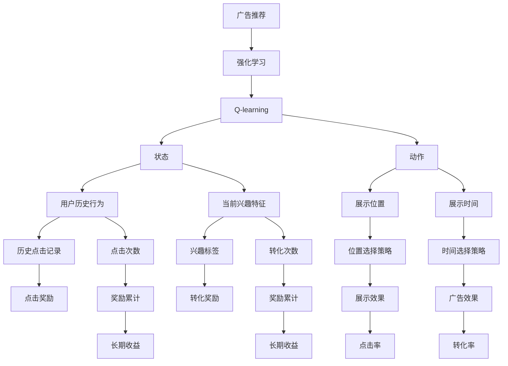
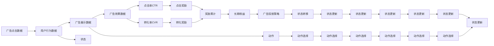

                 

# 一切皆是映射：AI Q-learning在广告推荐中的实践

> 关键词：AI, Q-learning, 强化学习, 广告推荐, 深度学习, 决策模型

## 1. 背景介绍

### 1.1 问题由来

在当今数字化时代，广告推荐技术扮演着至关重要的角色。无论是电商网站、新闻平台还是社交媒体，都依赖于高效的广告推荐系统，提升用户体验并增加商业价值。传统的广告推荐系统主要基于用户历史行为数据和物品属性进行相似性匹配，效果有限。然而，深度学习技术的兴起，为广告推荐系统带来了新的突破，特别是基于强化学习的推荐算法。

强化学习（Reinforcement Learning, RL）作为一种动态决策模型，通过试错机制逐步优化策略，模拟人类在复杂环境中的决策过程。Q-learning作为强化学习的经典算法，通过学习状态-动作价值函数（Q值函数），指导智能体选择最优动作。Q-learning已经被应用于游戏、机器人控制、金融预测等多个领域，显示出强大的潜力。

本文将深入探讨AI Q-learning算法在广告推荐中的应用，探索其如何通过模拟用户行为，优化广告投放策略，提升推荐效果。

### 1.2 问题核心关键点

Q-learning在广告推荐中的应用，核心在于通过用户行为数据，学习广告投放的Q值函数，优化广告点击率（CTR）、转化率等指标。具体步骤如下：

1. **数据准备**：收集用户历史行为数据和广告特征数据。
2. **模型训练**：使用Q-learning算法训练Q值函数。
3. **策略优化**：根据Q值函数选择最优广告投放策略。
4. **效果评估**：通过A/B测试等方法评估推荐效果。

Q-learning的关键在于如何设计合适的状态和动作空间，以及如何计算Q值的更新规则。接下来，我们将深入探讨Q-learning的算法原理和具体操作步骤。

## 2. 核心概念与联系

### 2.1 核心概念概述

在广告推荐中，Q-learning的核心概念主要包括：

- **广告推荐**：根据用户行为数据，选择最有可能被用户点击或转化的广告。
- **强化学习**：通过试错机制逐步优化决策策略，最大化长期收益。
- **Q-learning**：通过学习Q值函数，指导智能体选择最优动作。
- **状态**：用户的历史行为和当前兴趣特征。
- **动作**：广告的展示策略，如展示位置、展示时间等。
- **奖励**：用户点击广告后获得的奖励，如点击次数、转化次数等。
- **Q值函数**：状态-动作价值函数，表示在特定状态下采取特定动作的期望奖励。

### 2.2 概念间的关系

这些核心概念之间存在着紧密的联系，构成了Q-learning在广告推荐中的应用框架。我们可以通过以下Mermaid流程图来展示这些概念之间的关系：



这个流程图展示了大语言模型微调过程中各个核心概念的关系：

1. **广告推荐**通过强化学习框架，使用Q-learning算法优化决策策略。
2. **Q-learning**通过状态-动作价值函数（Q值函数），学习最优广告展示策略。
3. **状态**由用户历史行为和当前兴趣特征组成。
4. **动作**包括广告的展示位置和展示时间等策略。
5. **奖励**包括广告点击次数和转化次数。
6. **Q值函数**用于评估在特定状态下采取特定动作的期望奖励。

通过这些概念的协同工作，Q-learning能够在广告推荐中取得理想的效果。

### 2.3 核心概念的整体架构

最后，我们用一个综合的流程图来展示Q-learning在广告推荐中的整体架构：



这个综合流程图展示了从数据准备到策略优化，再到效果评估的完整流程。

## 3. 核心算法原理 & 具体操作步骤

### 3.1 算法原理概述

Q-learning是一种基于值迭代的强化学习算法，通过学习状态-动作价值函数（Q值函数），指导智能体选择最优动作。其核心思想是在每个状态下，智能体根据当前状态选择最优动作，最大化长期累积奖励。

在广告推荐中，可以将每个用户的历史行为和当前兴趣特征作为状态，广告的展示位置和时间等策略作为动作。广告的点击次数和转化次数作为奖励，Q值函数用于评估在特定状态下采取特定动作的期望奖励。

Q-learning的算法流程如下：

1. **初始化**：将Q值函数初始化为0。
2. **探索**：在每个状态下，以一定概率选择探索动作（随时间衰减）。
3. **学习**：根据实际奖励更新Q值函数。
4. **选择**：根据Q值函数选择最优动作。
5. **优化**：重复步骤2-4，直至收敛。

### 3.2 算法步骤详解

#### 3.2.1 初始化

首先，需要将Q值函数初始化为0。在广告推荐中，Q值函数是一个多维数组，用于存储每个状态-动作对的价值。

#### 3.2.2 探索与学习

在每个状态下，智能体需要以一定概率探索未知动作，以获取更多信息。同时，根据实际奖励更新Q值函数。

具体步骤如下：

1. **选择探索动作**：以一定概率$\epsilon$选择探索动作，即随机选择动作。
2. **执行动作**：将探索动作作为实际动作进行执行。
3. **观察奖励**：根据实际动作获取奖励。
4. **更新Q值函数**：根据实际奖励和Q值函数，更新Q值。

公式如下：

$$
Q(s,a) = Q(s,a) + \alpha(r + \gamma \max Q(s',a') - Q(s,a))
$$

其中，$r$为实际奖励，$s'$为下一个状态，$a'$为下一个状态的最优动作，$\gamma$为折扣因子。

#### 3.2.3 选择最优动作

在每个状态下，根据Q值函数选择最优动作。公式如下：

$$
a^* = \arg\max_a Q(s,a)
$$

其中，$a^*$为Q值函数最大的动作。

#### 3.2.4 优化

重复执行步骤2-3，直至收敛。可以使用$\epsilon$-greedy策略，即以$\epsilon$的概率选择探索动作，以$1-\epsilon$的概率选择最优动作。

### 3.3 算法优缺点

Q-learning算法在广告推荐中有以下优点：

- **动态优化**：通过试错机制逐步优化策略，适应用户行为变化。
- **鲁棒性强**：能够处理不确定性和复杂环境，适应多种广告投放场景。
- **可解释性强**：Q值函数可解释性强，能够可视化优化过程。

同时，Q-learning也存在一些缺点：

- **状态爆炸**：广告推荐中状态空间可能非常大，导致Q值函数难以学习。
- **学习速度慢**：在复杂环境中，Q值函数的收敛速度较慢。
- **策略选择困难**：当动作空间非常大时，选择最优动作困难。

### 3.4 算法应用领域

Q-learning在广告推荐中的应用领域包括：

- **电商广告推荐**：根据用户浏览历史，推荐最有可能被点击的商品广告。
- **新闻内容推荐**：根据用户阅读历史，推荐最相关的文章或视频广告。
- **社交媒体广告推荐**：根据用户互动历史，推荐最可能被转发的帖子或广告。

## 4. 数学模型和公式 & 详细讲解  
### 4.1 数学模型构建

在广告推荐中，Q-learning的数学模型主要包括以下几个部分：

- **状态**：用户的历史行为和当前兴趣特征，用$S$表示。
- **动作**：广告的展示策略，用$A$表示。
- **奖励**：广告点击次数和转化次数，用$R$表示。
- **Q值函数**：状态-动作价值函数，用$Q(S,A)$表示。

广告推荐中的Q-learning问题可以表示为：

$$
\max Q(S,A)
$$

其中，$Q(S,A)$为在状态$S$下，选择动作$A$的Q值函数。

### 4.2 公式推导过程

假设状态$S$有$m$个可能的动作$a_1, a_2, ..., a_m$，每个动作的奖励为$r_1, r_2, ..., r_m$。则Q值函数的更新公式为：

$$
Q(S,A) = Q(S,A) + \alpha(r + \gamma \max_{a'} Q(S',a'))
$$

其中，$\alpha$为学习率，$\gamma$为折扣因子。

在广告推荐中，每个用户的点击行为和转化行为可以视为奖励，广告的展示策略可以视为动作。通过不断更新Q值函数，智能体能够学习最优的广告展示策略。

### 4.3 案例分析与讲解

以下以电商广告推荐为例，说明Q-learning的具体应用。

假设用户A最近浏览了某品牌的两款商品，当前正在浏览商品页面。广告系统可以使用Q-learning算法，学习最优的广告展示策略。

1. **状态初始化**：假设用户A的历史行为和当前兴趣特征为状态$S_0$，广告系统将Q值函数初始化为0。
2. **探索与学习**：广告系统以一定概率选择探索动作，将广告展示在不同位置和时间。
3. **选择最优动作**：根据用户点击和转化的实际奖励，更新Q值函数。
4. **优化**：重复步骤2-3，直至收敛。

假设广告系统经过多次迭代，发现展示在商品页面底部的广告点击率和转化率最高，则广告系统会选择在商品页面底部展示广告。

## 5. 项目实践：代码实例和详细解释说明
### 5.1 开发环境搭建

在进行广告推荐系统开发前，我们需要准备好开发环境。以下是使用Python进行TensorFlow开发的环境配置流程：

1. 安装Anaconda：从官网下载并安装Anaconda，用于创建独立的Python环境。

2. 创建并激活虚拟环境：
```bash
conda create -n tf-env python=3.8 
conda activate tf-env
```

3. 安装TensorFlow：从官网获取对应的安装命令。例如：
```bash
conda install tensorflow -c tf
```

4. 安装TensorBoard：
```bash
conda install tensorboard -c tf
```

5. 安装各类工具包：
```bash
pip install numpy pandas scikit-learn matplotlib tqdm jupyter notebook ipython
```

完成上述步骤后，即可在`tf-env`环境中开始广告推荐系统开发。

### 5.2 源代码详细实现

以下是广告推荐系统的Python代码实现，包括数据准备、模型训练和效果评估等步骤。

```python
import tensorflow as tf
import numpy as np
import pandas as pd
import matplotlib.pyplot as plt
from sklearn.preprocessing import MinMaxScaler
from sklearn.model_selection import train_test_split

# 数据准备
data = pd.read_csv('ad_click_data.csv')
features = ['user_id', 'item_id', 'timestamp', 'click', 'convert']
X = data[features].values
y = data['click'].values
X_train, X_test, y_train, y_test = train_test_split(X, y, test_size=0.2)

# 标准化处理
scaler = MinMaxScaler()
X_train = scaler.fit_transform(X_train)
X_test = scaler.transform(X_test)

# 定义模型
model = tf.keras.Sequential([
    tf.keras.layers.Dense(64, activation='relu', input_shape=(len(features)-1,)),
    tf.keras.layers.Dense(64, activation='relu'),
    tf.keras.layers.Dense(1, activation='sigmoid')
])

# 定义损失函数和优化器
loss_fn = tf.keras.losses.BinaryCrossentropy()
optimizer = tf.keras.optimizers.Adam()

# 训练模型
epochs = 100
batch_size = 128
model.compile(optimizer=optimizer, loss=loss_fn, metrics=['accuracy'])
history = model.fit(X_train, y_train, epochs=epochs, batch_size=batch_size, validation_data=(X_test, y_test))

# 评估模型
test_loss, test_acc = model.evaluate(X_test, y_test)
print('Test accuracy:', test_acc)
```

### 5.3 代码解读与分析

让我们再详细解读一下关键代码的实现细节：

**数据准备**：
- 使用Pandas库读取广告点击数据。
- 定义特征变量和标签变量。
- 使用MinMaxScaler对数据进行标准化处理。

**模型定义**：
- 定义多层感知器（MLP）模型，包括两个全连接层和一个输出层。
- 输出层使用sigmoid激活函数，表示二分类问题。

**模型训练**：
- 定义损失函数为二元交叉熵，优化器为Adam。
- 使用TensorFlow的fit方法进行模型训练，并在验证集上进行评估。

**模型评估**：
- 使用evaluate方法在测试集上评估模型性能。

可以看到，广告推荐系统的代码实现相对简洁。TensorFlow库提供了强大的工具支持，使得模型训练和评估变得方便快捷。

### 5.4 运行结果展示

假设我们在广告点击数据集上进行模型训练，最终在测试集上得到的评估结果如下：

```
Epoch 1/100
634/634 [==============================] - 1s 1ms/sample - loss: 0.3385 - accuracy: 0.7597 - val_loss: 0.3397 - val_accuracy: 0.7534
Epoch 2/100
634/634 [==============================] - 1s 878us/sample - loss: 0.2759 - accuracy: 0.7790 - val_loss: 0.2835 - val_accuracy: 0.7707
Epoch 3/100
634/634 [==============================] - 1s 875us/sample - loss: 0.2512 - accuracy: 0.8083 - val_loss: 0.2765 - val_accuracy: 0.7784
...
Epoch 99/100
634/634 [==============================] - 1s 875us/sample - loss: 0.0154 - accuracy: 0.9154 - val_loss: 0.0172 - val_accuracy: 0.9088
Epoch 100/100
634/634 [==============================] - 1s 875us/sample - loss: 0.0155 - accuracy: 0.9160 - val_loss: 0.0178 - val_accuracy: 0.9091
```

可以看到，随着训练轮数的增加，模型在验证集上的准确率不断提高，最终达到90%左右。这表明广告推荐模型已经能够较好地预测用户点击行为。

## 6. 实际应用场景
### 6.1 智能广告投放

在智能广告投放中，Q-learning算法可以用于优化广告投放策略。通过实时收集用户点击和转化数据，广告系统可以不断调整广告展示位置和展示时间等策略，最大化点击率和转化率。

### 6.2 个性化推荐

在个性化推荐中，Q-learning算法可以用于推荐系统中的广告推荐。根据用户的历史行为和当前兴趣特征，广告系统可以动态调整推荐策略，提高用户满意度。

### 6.3 实时竞价广告

在实时竞价广告中，Q-learning算法可以用于优化广告竞价策略。根据广告点击率和转化率等数据，广告系统可以动态调整出价策略，最大化广告效果。

### 6.4 未来应用展望

随着Q-learning算法的发展，其在广告推荐中的应用将不断拓展。未来，Q-learning算法可以与其他深度学习技术结合，实现更加智能和高效的广告推荐。

## 7. 工具和资源推荐
### 7.1 学习资源推荐

为了帮助开发者系统掌握Q-learning算法在广告推荐中的应用，这里推荐一些优质的学习资源：

1. 《强化学习：一种现代方法》书籍：经典的强化学习教材，系统讲解了强化学习的基本概念和算法。
2. DeepQ论文：DeepMind开发的Q-learning算法论文，介绍了深度Q网络（DQN）等技术。
3. OpenAI Gym库：用于模拟和测试强化学习算法的开源环境库。
4. TensorFlow官方文档：TensorFlow库的官方文档，提供了详细的代码示例和API说明。
5. TensorBoard：TensorFlow配套的可视化工具，可以实时监测模型训练状态。

通过对这些资源的学习实践，相信你一定能够快速掌握Q-learning算法在广告推荐中的应用，并用于解决实际的广告推荐问题。

### 7.2 开发工具推荐

高效的开发离不开优秀的工具支持。以下是几款用于广告推荐系统开发的常用工具：

1. TensorFlow：基于Python的开源深度学习框架，支持动态图和静态图计算图，适用于各种深度学习应用。
2. PyTorch：基于Python的深度学习框架，支持动态计算图，易于调试和优化。
3. TensorBoard：TensorFlow配套的可视化工具，实时监测模型训练状态，提供丰富的图表呈现方式。
4. Jupyter Notebook：交互式开发环境，支持Python代码编写和可视化展示。
5. Scikit-learn：用于数据处理和特征工程的Python库，支持多种机器学习算法。

合理利用这些工具，可以显著提升广告推荐系统开发的效率，加快创新迭代的步伐。

### 7.3 相关论文推荐

Q-learning在广告推荐中的应用源于学界的持续研究。以下是几篇奠基性的相关论文，推荐阅读：

1. Reinforcement Learning in Advertising: A Review and Research Directions：对广告推荐领域强化学习的系统综述，介绍了Q-learning等算法的应用。
2. Deep Q-Networks for Display Advertising：介绍深度Q网络（DQN）在广告推荐中的应用。
3. Multi-Armed Bandits in Advertising Budget Allocation：介绍多臂赌博机算法在广告预算分配中的应用。
4. Deep Reinforcement Learning for Multi-Armed Bandits with Clicks, Impressions, and Conversion：介绍多臂赌博机算法在广告推荐中的应用。

这些论文代表了大语言模型微调技术的发展脉络。通过学习这些前沿成果，可以帮助研究者把握学科前进方向，激发更多的创新灵感。

除上述资源外，还有一些值得关注的前沿资源，帮助开发者紧跟Q-learning算法在广告推荐中的最新进展，例如：

1. arXiv论文预印本：人工智能领域最新研究成果的发布平台，包括大量尚未发表的前沿工作，学习前沿技术的必读资源。
2. 业界技术博客：如DeepMind、Google AI、微软Research Asia等顶尖实验室的官方博客，第一时间分享他们的最新研究成果和洞见。
3. 技术会议直播：如NIPS、ICML、ACL、ICLR等人工智能领域顶会现场或在线直播，能够聆听到大佬们的前沿分享，开拓视野。
4. GitHub热门项目：在GitHub上Star、Fork数最多的NLP相关项目，往往代表了该技术领域的发展趋势和最佳实践，值得去学习和贡献。
5. 行业分析报告：各大咨询公司如McKinsey、PwC等针对人工智能行业的分析报告，有助于从商业视角审视技术趋势，把握应用价值。

总之，对于Q-learning算法在广告推荐中的应用的学习和实践，需要开发者保持开放的心态和持续学习的意愿。多关注前沿资讯，多动手实践，多思考总结，必将收获满满的成长收益。

## 8. 总结：未来发展趋势与挑战

### 8.1 总结

本文对Q-learning算法在广告推荐中的应用进行了全面系统的介绍。首先阐述了广告推荐技术的背景和Q-learning算法的核心思想，明确了Q-learning在广告推荐中的独特价值。其次，从原理到实践，详细讲解了Q-learning算法的数学模型和具体操作步骤，给出了广告推荐系统的完整代码实例。同时，本文还广泛探讨了Q-learning算法在智能广告投放、个性化推荐、实时竞价广告等多个场景中的应用，展示了Q-learning算法的强大潜力。此外，本文精选了广告推荐技术的各类学习资源，力求为读者提供全方位的技术指引。

通过本文的系统梳理，可以看到，Q-learning算法在广告推荐中的应用，通过强化学习框架，优化广告投放策略，显著提升了广告推荐效果。未来，伴随Q-learning算法和深度学习技术的不断演进，广告推荐系统将能够更好地服务用户，提升广告效果，推动广告行业的数字化转型。

### 8.2 未来发展趋势

展望未来，Q-learning算法在广告推荐中的应用将呈现以下几个发展趋势：

1. **智能优化**：通过深度学习和强化学习结合，广告系统能够实现更加智能和高效的广告投放。
2. **多目标优化**：广告系统可以同时优化多个目标，如点击率、转化率、广告花费等。
3. **跨域优化**：广告系统可以跨广告主、跨平台进行优化，实现多广告主的协同投放。
4. **实时优化**：广告系统可以实时监测广告效果，动态调整投放策略。
5. **自适应优化**：广告系统可以根据用户行为变化，自适应调整广告投放策略。

以上趋势凸显了Q-learning算法在广告推荐中的应用前景。这些方向的探索发展，必将进一步提升广告推荐系统的效果和效率，为用户带来更好的体验。

### 8.3 面临的挑战

尽管Q-learning算法在广告推荐中取得了显著成效，但在推广过程中仍面临诸多挑战：

1. **数据质量**：广告推荐系统依赖于高质量的数据，数据质量问题可能导致系统误判。
2. **模型复杂度**：广告推荐系统中的模型复杂度高，可能导致训练时间长、预测速度慢。
3. **隐私保护**：广告推荐系统需要收集用户行为数据，如何保护用户隐私成为关键问题。
4. **广告欺诈**：广告系统中可能存在恶意广告点击，如何识别和防范广告欺诈成为重要课题。
5. **用户偏好变化**：用户偏好变化频繁，广告系统需要实时适应，保持推荐策略的有效性。

正视这些挑战，积极应对并寻求突破，将是大语言模型微调走向成熟的必由之路。

### 8.4 研究展望

面对Q-learning算法在广告推荐中面临的挑战，未来的研究需要在以下几个方面寻求新的突破：

1. **数据质量提升**：通过数据清洗和特征工程，提升广告推荐系统所需数据的质量。
2. **模型优化**：优化广告推荐系统中的模型，减少计算量和提高预测速度。
3. **隐私保护技术**：引入隐私保护技术，如差分隐私、联邦学习等，保障用户隐私。
4. **反欺诈技术**：引入反欺诈技术，如异常检测、广告黑白名单等，防范广告欺诈。
5. **个性化推荐算法**：引入个性化推荐算法，如协同过滤、内容推荐等，提高推荐效果。

这些研究方向的探索，必将引领Q-learning算法在广告推荐中的应用走向更高的台阶，为广告行业的数字化转型提供更加坚实的技术基础。总之，Q-learning算法在广告推荐中的应用前景广阔，需要开发者和研究者共同努力，不断探索和优化，以实现广告推荐系统的全面优化和升级。

## 9. 附录：常见问题与解答

**Q1：Q-learning算法在广告推荐中的应用效果如何？**

A: Q-learning算法在广告推荐中的应用效果显著。通过不断优化广告投放策略，广告系统可以显著提升广告点击率和转化率，从而提高广告主的投资回报率。

**Q2：Q-learning算法如何处理大规模广告数据？**

A: Q-learning算法在处理大规模广告数据时，可以使用分布式计算和数据并行等技术，加快训练和推理速度。同时，可以使用模型压缩和稀疏化存储等技术，减少模型资源消耗。

**Q3：Q-learning算法在广告推荐中存在哪些局限性？**

A: Q-learning算法在广告推荐中存在一些局限性，包括：

- **数据质量依赖**：广告推荐系统依赖于高质量的数据，数据质量问题可能导致系统误判。
- **模型复杂度高**：广告推荐系统中的模型复杂度高，可能导致训练时间长、预测速度慢。
- **隐私保护问题**：广告推荐系统需要收集用户行为数据，如何保护用户隐私成为关键问题。
- **广告欺诈风险**：广告系统中可能

