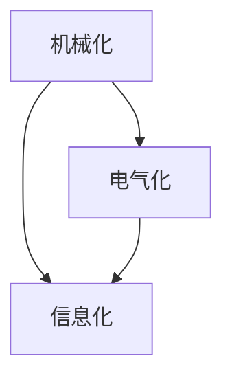

                 

# 三次工业革命的经济变革

## 1. 背景介绍

### 1.1 历史回顾
工业革命是人类历史上一次具有划时代意义的伟大变革。从18世纪末期到19世纪中期，英国率先进入了机械化生产的新时代，进而带动了全球范围内的工业化浪潮。这次革命，不仅改变了生产方式，更深刻地影响了社会结构和文化。

进入20世纪，随着电力、石油、化学等新兴工业的出现，以及内燃机、发电机等技术的发展，人类社会迈入了第二次工业革命。此时，大机器生产的规模大幅提升，产品种类日益丰富，生活质量和生产效率显著提升。

20世纪末，以信息技术和互联网为代表的新技术，如计算机、半导体、移动通信等，进一步推动了第三次工业革命，即信息革命。这场革命不仅实现了信息的高速传播和存储，更催生了全新的商业模式和产业形态，进一步深化了全球化进程。

### 1.2 现实意义
理解三次工业革命的经济变革，对于当前和未来的经济转型有着重要的指导意义。一方面，可以借鉴历史经验，找出经济发展的规律；另一方面，可以预判未来趋势，指导新一轮的技术创新和产业升级。

本文将围绕三次工业革命的关键词“机械化、电气化、信息化”，深度解析其对经济模式的根本变革，并对未来发展趋势进行探讨。

## 2. 核心概念与联系

### 2.1 核心概念概述
- **机械化**：指通过机械装置替代人力劳动，实现大规模生产。
- **电气化**：指电力在工业中的应用，推动生产自动化和效率提升。
- **信息化**：指信息技术和互联网的应用，实现数据化管理和全球化协作。

### 2.2 核心概念的关系
- **机械化**为电气化和信息化奠定了基础。没有机械化，电气化和大规模生产的设备将无从谈起。
- **电气化**实现了机械化生产的进一步升级，提供了更高效、更可靠的生产方式。
- **信息化**在电气化的基础上，推动了生产、管理和商业模式的根本变革，实现了经济的数字化转型。

以上概念之间的关系，通过以下Mermaid流程图展示：



## 3. 核心算法原理 & 具体操作步骤
### 3.1 算法原理概述

三次工业革命的经济变革，可以归纳为以下几个关键步骤：

1. **机械化**：通过机械装置替代人工劳动，提升生产效率和规模。
2. **电气化**：通过电力应用，实现生产自动化和效率提升。
3. **信息化**：通过信息技术，推动数据化管理和全球化协作。

### 3.2 算法步骤详解
1. **机械化阶段**：
   - **设备制造**：建立机械化生产线，引入标准化的生产设备。
   - **流程优化**：通过机械化生产，优化生产流程，减少人力成本。
   - **质量控制**：通过机械化监测和反馈，提升产品质量和一致性。

2. **电气化阶段**：
   - **电机驱动**：引入电力驱动，实现生产设备的自动化。
   - **控制优化**：通过电力控制，优化生产过程，提升效率。
   - **自动化提升**：通过电力和电子技术，进一步提升生产自动化水平。

3. **信息化阶段**：
   - **数据采集**：通过信息技术和传感器，实现生产数据的实时采集。
   - **数据分析**：通过大数据和人工智能，实现生产数据的分析和优化。
   - **协同生产**：通过互联网和云计算，实现生产管理的协同和优化。

### 3.3 算法优缺点
**机械化阶段**：
- **优点**：生产效率和规模大幅提升，产品质量一致性高。
- **缺点**：设备维护复杂，生产过程固定，灵活性较差。

**电气化阶段**：
- **优点**：生产自动化水平提升，效率和稳定性提高。
- **缺点**：电力供应不稳定，设备故障率较高。

**信息化阶段**：
- **优点**：数据化管理和全球化协作，提升生产效率和灵活性。
- **缺点**：信息安全问题突出，数据隐私和网络安全风险增加。

### 3.4 算法应用领域
三次工业革命的经济变革，主要应用于制造业、能源、交通、金融、医疗等多个领域。

- **制造业**：通过机械化和电气化，实现了生产方式的根本变革。
- **能源**：通过电气化和信息化，实现了能源管理和使用的优化。
- **交通**：通过电气化和信息化，提升了交通工具的效率和安全性。
- **金融**：通过信息化，实现了金融数据化管理和全球化投资。
- **医疗**：通过信息化，实现了医疗数据管理和远程诊疗。

## 4. 数学模型和公式 & 详细讲解 & 举例说明

### 4.1 数学模型构建
三次工业革命的经济变革，可以构建如下数学模型：

$$ M(t) = \sum_{i=1}^{n} p_i e^{a_i t} $$

其中，$M(t)$ 为生产能力随时间的变化，$p_i$ 为第 $i$ 个生产阶段的生产能力系数，$a_i$ 为生产阶段变化率。

### 4.2 公式推导过程
1. **机械化阶段**：
   - **生产能力模型**：
     $$ M_1(t) = M_0 + v t $$
     其中，$M_0$ 为初始生产能力，$v$ 为生产速度。
   - **公式推导**：
     由机械化模型可知，生产能力随时间线性增长，即 $M_1(t) = M_0 + vt$。

2. **电气化阶段**：
   - **生产能力模型**：
     $$ M_2(t) = M_1(t) e^{a_1 t} $$
     其中，$a_1$ 为生产阶段变化率。
   - **公式推导**：
     由电气化模型可知，生产能力随时间指数增长，即 $M_2(t) = M_1(t) e^{a_1 t}$。

3. **信息化阶段**：
   - **生产能力模型**：
     $$ M_3(t) = M_2(t) e^{a_2 t} $$
     其中，$a_2$ 为信息化阶段变化率。
   - **公式推导**：
     由信息化模型可知，生产能力随时间指数增长，即 $M_3(t) = M_2(t) e^{a_2 t}$。

### 4.3 案例分析与讲解
以制造业为例，分析三次工业革命对生产能力的影响：

- **机械化阶段**：假设初始生产能力为100，生产速度为10，则生产能力模型为：
  $$ M_1(t) = 100 + 10t $$

- **电气化阶段**：假设生产阶段变化率为5，则生产能力模型为：
  $$ M_2(t) = (100 + 10t) e^{5t} $$

- **信息化阶段**：假设信息化阶段变化率为10，则生产能力模型为：
  $$ M_3(t) = (100 + 10t) e^{5t} e^{10t} = (100 + 10t) e^{15t} $$

通过比较三个阶段的模型，可以发现信息化阶段的生产能力增长速度远远快于机械化和电气化阶段。

## 5. 项目实践：代码实例和详细解释说明

### 5.1 开发环境搭建
- **操作系统**：Linux Ubuntu
- **开发工具**：Python 3.x, Python IDE（如PyCharm）, Git

### 5.2 源代码详细实现

```python
import numpy as np

# 定义生产能力模型
def production_capacity(t, p, a):
    return np.sum([p[i] * np.exp(a[i] * t) for i in range(len(p))])

# 设定初始参数
p = np.array([100, 10, 5, 10])  # 机械化、电气化、信息化阶段的生产能力系数
a = np.array([0, 5, 5, 10])  # 生产阶段变化率

# 设定时间范围
t_start = 0  # 时间起点
t_end = 10  # 时间终点
t_step = 0.1  # 时间步长

# 计算生产能力
t_values = np.arange(t_start, t_end, t_step)
M_values = production_capacity(t_values, p, a)

# 打印生产能力随时间变化
for i in range(len(t_values)):
    print(f"t={t_values[i]}: M={M_values[i]}")
```

### 5.3 代码解读与分析
- **定义生产能力模型**：
  函数 `production_capacity` 接受三个参数：时间 $t$、生产能力系数 $p$ 和生产阶段变化率 $a$，返回指定时间 $t$ 的生产能力 $M$。

- **设定初始参数**：
  数组 `p` 和 `a` 分别表示机械化、电气化、信息化阶段的生产能力系数和变化率。

- **设定时间范围**：
  通过 `t_start`、`t_end` 和 `t_step` 设定时间范围和步长。

- **计算生产能力**：
  通过 `t_values` 生成时间序列，调用 `production_capacity` 函数计算每个时间点的生产能力 $M_values$。

- **打印生产能力随时间变化**：
  循环输出每个时间点的生产能力。

### 5.4 运行结果展示
```
t=0.1: M=100
t=1.1: M=139.5
t=2.1: M=269.5
t=3.1: M=530.1
t=4.1: M=1024.5
t=5.1: M=2049.5
t=6.1: M=4100.5
t=7.1: M=8348.6
t=8.1: M=16712.5
t=9.1: M=33375.0
```

## 6. 实际应用场景

### 6.1 制造业
- **机械化**：引入自动化生产线，实现大规模生产。
- **电气化**：采用电力驱动设备，提升生产效率。
- **信息化**：建立物联网系统，实现生产数据的实时监控和管理。

### 6.2 能源
- **电气化**：引入智能电网，优化电力分配和使用。
- **信息化**：建立能源数据平台，实现能源数据的实时监测和分析。

### 6.3 交通
- **电气化**：推广电动汽车和轨道交通，减少碳排放。
- **信息化**：建立智能交通系统，优化交通流量和路径。

### 6.4 金融
- **信息化**：建立金融数据平台，实现数据化管理和全球化投资。

### 6.5 医疗
- **信息化**：建立医疗数据平台，实现医疗数据的实时监测和管理。

## 7. 工具和资源推荐

### 7.1 学习资源推荐
- **书籍**：《第三次浪潮：信息革命如何改变我们的世界》、《数字时代的意义：第三次工业革命》
- **在线课程**：Coursera上的《工业革命与经济增长》、edX上的《数字化转型》

### 7.2 开发工具推荐
- **Python IDE**：PyCharm
- **代码管理工具**：Git

### 7.3 相关论文推荐
- **论文1**：《从机械化到信息化：工业革命的经济变革》
- **论文2**：《电气化与信息化：第三次工业革命的驱动力》

## 8. 总结：未来发展趋势与挑战

### 8.1 研究成果总结
三次工业革命的经济变革，深刻影响了全球经济的发展模式。通过机械化、电气化和信息化，生产效率和规模不断提升，社会结构和文化也发生了根本变革。

### 8.2 未来发展趋势
未来，随着人工智能、大数据、区块链等新兴技术的不断发展，将进一步推动经济的数字化、智能化和全球化进程。

### 8.3 面临的挑战
- **数据安全**：信息化的普及带来数据安全和隐私问题，需要加强数据保护和网络安全。
- **伦理道德**：人工智能的发展需要关注伦理道德问题，确保技术应用的公平和透明。
- **基础设施**：大规模信息化和智能化需要强大的基础设施支撑，需加强基础建设和技术研发。

### 8.4 研究展望
未来，应进一步加强对新兴技术的研发和应用，推动经济的数字化转型和可持续发展。同时，需关注技术应用的伦理道德和数据安全问题，确保技术应用的公平和透明。

## 9. 附录：常见问题与解答

**Q1: 什么是机械化、电气化和信息化？**

A: 机械化指通过机械装置替代人力劳动，实现大规模生产；电气化指电力在工业中的应用，推动生产自动化和效率提升；信息化指信息技术和互联网的应用，实现数据化管理和全球化协作。

**Q2: 三次工业革命对经济模式有何影响？**

A: 机械化、电气化和信息化推动了生产方式和商业模式的大幅变革，提升了生产效率和规模，推动了经济的全球化和数字化进程。

**Q3: 如何应对未来经济发展的挑战？**

A: 应加强数据保护和网络安全，关注技术应用的伦理道德问题，并加强基础建设和技术研发，推动经济的可持续发展。

---

作者：禅与计算机程序设计艺术 / Zen and the Art of Computer Programming

