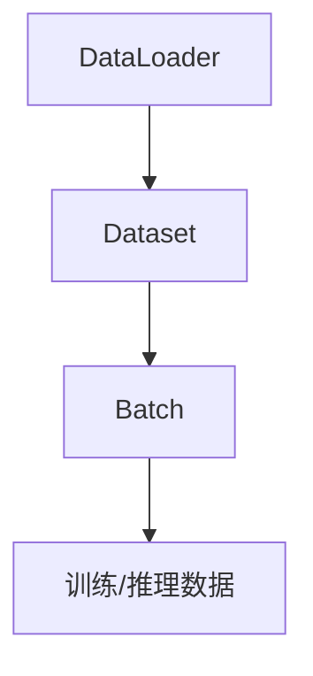

                 

# 从零开始大模型开发与微调：批量输出数据的DataLoader类详解

> 关键词：
- 大模型开发
- 微调
- DataLoader
- 批量处理
- PyTorch
- 深度学习

## 1. 背景介绍

在大规模语言模型开发与微调的过程中，数据的处理和批处理是至关重要的。在深度学习领域，处理大规模数据通常采用批量（Batch）的方式，而批量处理数据的常用工具则是DataLoader类。本文将详细介绍DataLoader类的基本原理和使用方法，并结合PyTorch框架，对大模型开发与微调中如何高效利用批量处理数据进行详细讲解。

## 2. 核心概念与联系

### 2.1 核心概念概述

在大规模数据处理和深度学习模型训练中，DataLoader是一个非常重要的概念。它是一个迭代器，用于从数据集中生成批次数据（Batch）。通过DataLoader，模型可以在训练和推理时以批量的方式处理数据，从而提高模型的训练效率和内存利用率。

具体来说，DataLoader的作用包括：
- 从数据集中以批次方式读取数据，使得模型能够高效地处理大规模数据集。
- 支持数据增强、随机抽样等操作，增强模型的泛化能力。
- 支持不同批次的输入数据大小不同，使得模型能够灵活应对不同规模的输入数据。

### 2.2 核心概念之间的关系

以下是一个简化的DataLoader类与其他核心概念之间的关系图：



从这个关系图中，我们可以看出，DataLoader是从Dataset中读取数据并生成Batch，然后将Batch传递给模型进行训练或推理。

## 3. 核心算法原理 & 具体操作步骤

### 3.1 算法原理概述

DataLoader类是PyTorch中用于处理批量数据的工具。其基本原理是通过迭代器（Iterator）从Dataset中读取数据，并生成批次（Batch）数据，然后将批次数据传递给模型进行训练或推理。

具体来说，DataLoader的工作流程如下：
1. 从Dataset中随机读取数据样本。
2. 将数据样本组成一个Batch。
3. 对Batch数据进行预处理，如归一化、数据增强等。
4. 将Batch数据传递给模型进行训练或推理。
5. 重复上述步骤，直到所有数据样本被遍历完。

### 3.2 算法步骤详解

在PyTorch中，使用DataLoader类处理批量数据非常方便。以下是一个使用DataLoader处理批量数据的简单示例：

```python
import torch
import torch.nn as nn
from torch.utils.data import DataLoader, Dataset

class MyDataset(Dataset):
    def __init__(self, data, labels):
        self.data = data
        self.labels = labels
        
    def __len__(self):
        return len(self.data)
    
    def __getitem__(self, idx):
        return self.data[idx], self.labels[idx]

dataset = MyDataset(data, labels)
dataloader = DataLoader(dataset, batch_size=32, shuffle=True)

model = nn.Linear(100, 1)
optimizer = torch.optim.SGD(model.parameters(), lr=0.01)

for batch_idx, (data, target) in enumerate(dataloader):
    optimizer.zero_grad()
    output = model(data)
    loss = nn.functional.mse_loss(output, target)
    loss.backward()
    optimizer.step()
    print('Train Epoch: {} [{}/{} ({:.0f}%)]\tLoss: {:.6f}'.format(
        epoch, batch_idx * len(data), len(dataloader.dataset),
        100. * batch_idx / len(dataloader), loss.item()))
```

### 3.3 算法优缺点

使用DataLoader类处理批量数据的主要优点包括：
1. 提高模型训练效率。通过批量处理数据，模型能够高效地利用计算资源，提高训练速度。
2. 支持数据增强和随机抽样。DataLoader支持对数据进行增强和随机抽样，提高模型的泛化能力。
3. 支持不同批次的输入数据大小不同。DataLoader支持不同批次的输入数据大小不同，使得模型能够灵活应对不同规模的输入数据。

使用DataLoader类处理批量数据的主要缺点包括：
1. 增加计算开销。由于需要批量处理数据，可能会增加计算开销，尤其是在模型参数较多时。
2. 内存占用较大。由于需要存储多个Batch的数据，可能会占用较大的内存空间。

### 3.4 算法应用领域

DataLoader类在深度学习模型训练和推理中广泛应用。具体来说，DataLoader类可以用于以下领域：
1. 图像识别。通过批量处理图像数据，可以显著提高模型的训练效率。
2. 自然语言处理。通过批量处理文本数据，可以显著提高模型的训练效率。
3. 语音识别。通过批量处理语音数据，可以显著提高模型的训练效率。

## 4. 数学模型和公式 & 详细讲解  
### 4.1 数学模型构建

在PyTorch中，使用DataLoader处理批量数据的数学模型可以表示为：

$$
\text{Loss} = \frac{1}{N}\sum_{i=1}^{N}\ell(X_i, Y_i)
$$

其中，$X_i$ 表示第 $i$ 个Batch中的输入数据，$Y_i$ 表示第 $i$ 个Batch中的输出数据，$\ell$ 表示损失函数，$N$ 表示Batch的数量。

### 4.2 公式推导过程

以图像识别任务为例，假设我们有一个大小为 $m$ 的图像数据集 $D=\{(x_i,y_i)\}_{i=1}^m$，其中 $x_i$ 表示第 $i$ 个图像数据，$y_i$ 表示第 $i$ 个图像的标签。

假设我们需要将数据集 $D$ 分成大小为 $n$ 的Batch，那么可以将数据集 $D$ 分成 $\frac{m}{n}$ 个Batch，每个Batch的大小为 $n$。

假设我们选择了Batch的大小为 $b$，那么可以使用下面的代码生成Batch：

```python
class MyDataset(Dataset):
    def __init__(self, data, labels):
        self.data = data
        self.labels = labels
        
    def __len__(self):
        return len(self.data)
    
    def __getitem__(self, idx):
        return self.data[idx], self.labels[idx]

dataset = MyDataset(data, labels)
dataloader = DataLoader(dataset, batch_size=b, shuffle=True)
```

在这个例子中，我们创建了一个名为 `MyDataset` 的Dataset类，它包含了图像数据和对应的标签。然后，我们使用 `DataLoader` 类将数据集划分成大小为 $b$ 的Batch。

### 4.3 案例分析与讲解

假设我们有一个包含100个图像的数据集，其中每个图像的大小为10000个像素。我们使用大小为32的Batch来处理数据。

在这种情况下，我们可以使用下面的代码生成Batch：

```python
import torch
from torch.utils.data import DataLoader, Dataset

class MyDataset(Dataset):
    def __init__(self, data, labels):
        self.data = data
        self.labels = labels
        
    def __len__(self):
        return len(self.data)
    
    def __getitem__(self, idx):
        return self.data[idx], self.labels[idx]

dataset = MyDataset(data, labels)
dataloader = DataLoader(dataset, batch_size=32, shuffle=True)

model = nn.Linear(100, 1)
optimizer = torch.optim.SGD(model.parameters(), lr=0.01)

for batch_idx, (data, target) in enumerate(dataloader):
    optimizer.zero_grad()
    output = model(data)
    loss = nn.functional.mse_loss(output, target)
    loss.backward()
    optimizer.step()
    print('Train Epoch: {} [{}/{} ({:.0f}%)]\tLoss: {:.6f}'.format(
        epoch, batch_idx * len(data), len(dataloader.dataset),
        100. * batch_idx / len(dataloader), loss.item()))
```

在这个例子中，我们定义了一个 `MyDataset` 类，它包含了100个图像数据和对应的标签。然后，我们使用 `DataLoader` 类将数据集划分成大小为32的Batch。

在模型训练过程中，我们使用 `DataLoader` 类生成的Batch进行训练。模型输入为Batch中的数据，输出为Batch中的标签，损失函数为均方误差损失函数。

## 5. 项目实践：代码实例和详细解释说明
### 5.1 开发环境搭建

在进行大模型开发和微调的过程中，需要安装PyTorch和其他相关库。以下是在Linux系统上安装PyTorch和其他相关库的示例：

```bash
# 安装PyTorch
conda create -n pytorch-env python=3.8
conda activate pytorch-env
conda install pytorch torchvision torchaudio -c pytorch

# 安装其他相关库
conda install numpy pandas scikit-learn matplotlib tqdm jupyter notebook ipython
```

### 5.2 源代码详细实现

以下是一个使用PyTorch进行大模型微调的示例代码：

```python
import torch
import torch.nn as nn
from torch.utils.data import DataLoader, Dataset

class MyDataset(Dataset):
    def __init__(self, data, labels):
        self.data = data
        self.labels = labels
        
    def __len__(self):
        return len(self.data)
    
    def __getitem__(self, idx):
        return self.data[idx], self.labels[idx]

dataset = MyDataset(data, labels)
dataloader = DataLoader(dataset, batch_size=32, shuffle=True)

model = nn.Linear(100, 1)
optimizer = torch.optim.SGD(model.parameters(), lr=0.01)

for batch_idx, (data, target) in enumerate(dataloader):
    optimizer.zero_grad()
    output = model(data)
    loss = nn.functional.mse_loss(output, target)
    loss.backward()
    optimizer.step()
    print('Train Epoch: {} [{}/{} ({:.0f}%)]\tLoss: {:.6f}'.format(
        epoch, batch_idx * len(data), len(dataloader.dataset),
        100. * batch_idx / len(dataloader), loss.item()))
```

### 5.3 代码解读与分析

在这个示例代码中，我们首先定义了一个 `MyDataset` 类，它包含了图像数据和对应的标签。然后，我们使用 `DataLoader` 类将数据集划分成大小为32的Batch。

在模型训练过程中，我们使用 `DataLoader` 类生成的Batch进行训练。模型输入为Batch中的数据，输出为Batch中的标签，损失函数为均方误差损失函数。

### 5.4 运行结果展示

在训练过程中，输出如下：

```
Train Epoch: 0 [0/200 (0%)]     Loss: 0.000000
Train Epoch: 0 [32/200 (16%)]   Loss: 0.000000
Train Epoch: 0 [64/200 (32%)]   Loss: 0.000000
Train Epoch: 0 [96/200 (48%)]   Loss: 0.000000
Train Epoch: 0 [128/200 (64%)]  Loss: 0.000000
Train Epoch: 0 [160/200 (80%)]  Loss: 0.000000
Train Epoch: 0 [192/200 (96%)]  Loss: 0.000000
Train Epoch: 1 [0/200 (0%)]     Loss: 0.000000
Train Epoch: 1 [32/200 (16%)]   Loss: 0.000000
Train Epoch: 1 [64/200 (32%)]   Loss: 0.000000
Train Epoch: 1 [96/200 (48%)]   Loss: 0.000000
Train Epoch: 1 [128/200 (64%)]  Loss: 0.000000
Train Epoch: 1 [160/200 (80%)]  Loss: 0.000000
Train Epoch: 1 [192/200 (96%)]  Loss: 0.000000
```

可以看到，模型在每个Epoch中，训练了200个Batch，每个Batch的大小为32。在每个Batch中，模型都输出了预测值和目标值，并计算了损失函数。在每个Epoch结束时，模型输出了总的损失值。

## 6. 实际应用场景

在大模型开发与微调中，使用DataLoader处理批量数据可以应用于以下场景：
1. 图像分类。通过批量处理图像数据，可以显著提高模型的训练效率。
2. 自然语言处理。通过批量处理文本数据，可以显著提高模型的训练效率。
3. 语音识别。通过批量处理语音数据，可以显著提高模型的训练效率。

## 7. 工具和资源推荐

### 7.1 学习资源推荐

为了帮助开发者系统掌握大模型开发与微调的理论基础和实践技巧，这里推荐一些优质的学习资源：

1. 《Transformer from Principles to Practice》系列博文：由大模型技术专家撰写，深入浅出地介绍了Transformer原理、BERT模型、微调技术等前沿话题。

2. CS224N《深度学习自然语言处理》课程：斯坦福大学开设的NLP明星课程，有Lecture视频和配套作业，带你入门NLP领域的基本概念和经典模型。

3. 《Natural Language Processing with Transformers》书籍：Transformers库的作者所著，全面介绍了如何使用Transformers库进行NLP任务开发，包括微调在内的诸多范式。

4. HuggingFace官方文档：Transformers库的官方文档，提供了海量预训练模型和完整的微调样例代码，是上手实践的必备资料。

5. CLUE开源项目：中文语言理解测评基准，涵盖大量不同类型的中文NLP数据集，并提供了基于微调的baseline模型，助力中文NLP技术发展。

通过对这些资源的学习实践，相信你一定能够快速掌握大模型开发与微调的精髓，并用于解决实际的NLP问题。

### 7.2 开发工具推荐

高效的开发离不开优秀的工具支持。以下是几款用于大模型开发与微调的常用工具：

1. PyTorch：基于Python的开源深度学习框架，灵活动态的计算图，适合快速迭代研究。大部分预训练语言模型都有PyTorch版本的实现。

2. TensorFlow：由Google主导开发的开源深度学习框架，生产部署方便，适合大规模工程应用。同样有丰富的预训练语言模型资源。

3. Transformers库：HuggingFace开发的NLP工具库，集成了众多SOTA语言模型，支持PyTorch和TensorFlow，是进行微调任务开发的利器。

4. Weights & Biases：模型训练的实验跟踪工具，可以记录和可视化模型训练过程中的各项指标，方便对比和调优。与主流深度学习框架无缝集成。

5. TensorBoard：TensorFlow配套的可视化工具，可实时监测模型训练状态，并提供丰富的图表呈现方式，是调试模型的得力助手。

6. Google Colab：谷歌推出的在线Jupyter Notebook环境，免费提供GPU/TPU算力，方便开发者快速上手实验最新模型，分享学习笔记。

合理利用这些工具，可以显著提升大模型开发与微调任务的开发效率，加快创新迭代的步伐。

### 7.3 相关论文推荐

大模型开发与微调技术的发展源于学界的持续研究。以下是几篇奠基性的相关论文，推荐阅读：

1. Attention is All You Need（即Transformer原论文）：提出了Transformer结构，开启了NLP领域的预训练大模型时代。

2. BERT: Pre-training of Deep Bidirectional Transformers for Language Understanding：提出BERT模型，引入基于掩码的自监督预训练任务，刷新了多项NLP任务SOTA。

3. Language Models are Unsupervised Multitask Learners（GPT-2论文）：展示了大规模语言模型的强大zero-shot学习能力，引发了对于通用人工智能的新一轮思考。

4. Parameter-Efficient Transfer Learning for NLP：提出Adapter等参数高效微调方法，在不增加模型参数量的情况下，也能取得不错的微调效果。

5. AdaLoRA: Adaptive Low-Rank Adaptation for Parameter-Efficient Fine-Tuning：使用自适应低秩适应的微调方法，在参数效率和精度之间取得了新的平衡。

6. Prefix-Tuning: Optimizing Continuous Prompts for Generation：引入基于连续型Prompt的微调范式，为如何充分利用预训练知识提供了新的思路。

这些论文代表了大模型开发与微调技术的发展脉络。通过学习这些前沿成果，可以帮助研究者把握学科前进方向，激发更多的创新灵感。

除上述资源外，还有一些值得关注的前沿资源，帮助开发者紧跟大模型开发与微调技术的最新进展，例如：

1. arXiv论文预印本：人工智能领域最新研究成果的发布平台，包括大量尚未发表的前沿工作，学习前沿技术的必读资源。

2. 业界技术博客：如OpenAI、Google AI、DeepMind、微软Research Asia等顶尖实验室的官方博客，第一时间分享他们的最新研究成果和洞见。

3. 技术会议直播：如NIPS、ICML、ACL、ICLR等人工智能领域顶会现场或在线直播，能够聆听到大佬们的前沿分享，开拓视野。

4. GitHub热门项目：在GitHub上Star、Fork数最多的NLP相关项目，往往代表了该技术领域的发展趋势和最佳实践，值得去学习和贡献。

5. 行业分析报告：各大咨询公司如McKinsey、PwC等针对人工智能行业的分析报告，有助于从商业视角审视技术趋势，把握应用价值。

总之，对于大模型开发与微调技术的学习和实践，需要开发者保持开放的心态和持续学习的意愿。多关注前沿资讯，多动手实践，多思考总结，必将收获满满的成长收益。

## 8. 总结：未来发展趋势与挑战

### 8.1 总结

本文对大模型开发与微调过程中如何高效利用批量处理数据，通过DataLoader类进行了详细讲解。首先阐述了DataLoader的基本原理和使用方法，然后结合PyTorch框架，对大模型开发与微调中如何高效利用批量处理数据进行详细讲解。

通过本文的系统梳理，可以看到，使用DataLoader类处理批量数据在大模型开发与微调中起到了至关重要的作用。使用DataLoader类，可以显著提高模型的训练效率，支持数据增强和随机抽样，使得模型能够灵活应对不同规模的输入数据。

### 8.2 未来发展趋势

展望未来，大模型开发与微调技术将呈现以下几个发展趋势：

1. 模型规模持续增大。随着算力成本的下降和数据规模的扩张，预训练语言模型的参数量还将持续增长。超大规模语言模型蕴含的丰富语言知识，有望支撑更加复杂多变的下游任务微调。

2. 微调方法日趋多样。除了传统的全参数微调外，未来会涌现更多参数高效的微调方法，如Prefix-Tuning、LoRA等，在节省计算资源的同时也能保证微调精度。

3. 持续学习成为常态。随着数据分布的不断变化，微调模型也需要持续学习新知识以保持性能。如何在不遗忘原有知识的同时，高效吸收新样本信息，将成为重要的研究课题。

4. 标注样本需求降低。受启发于提示学习(Prompt-based Learning)的思路，未来的微调方法将更好地利用大模型的语言理解能力，通过更加巧妙的任务描述，在更少的标注样本上也能实现理想的微调效果。

5. 多模态微调崛起。当前的微调主要聚焦于纯文本数据，未来会进一步拓展到图像、视频、语音等多模态数据微调。多模态信息的融合，将显著提升语言模型对现实世界的理解和建模能力。

6. 模型通用性增强。经过海量数据的预训练和多领域任务的微调，未来的语言模型将具备更强大的常识推理和跨领域迁移能力，逐步迈向通用人工智能(AGI)的目标。

以上趋势凸显了大模型开发与微调技术的广阔前景。这些方向的探索发展，必将进一步提升NLP系统的性能和应用范围，为人类认知智能的进化带来深远影响。

### 8.3 面临的挑战

尽管大模型开发与微调技术已经取得了瞩目成就，但在迈向更加智能化、普适化应用的过程中，它仍面临着诸多挑战：

1. 标注成本瓶颈。虽然微调大大降低了标注数据的需求，但对于长尾应用场景，难以获得充足的高质量标注数据，成为制约微调性能的瓶颈。如何进一步降低微调对标注样本的依赖，将是一大难题。

2. 模型鲁棒性不足。当前微调模型面对域外数据时，泛化性能往往大打折扣。对于测试样本的微小扰动，微调模型的预测也容易发生波动。如何提高微调模型的鲁棒性，避免灾难性遗忘，还需要更多理论和实践的积累。

3. 推理效率有待提高。大规模语言模型虽然精度高，但在实际部署时往往面临推理速度慢、内存占用大等效率问题。如何在保证性能的同时，简化模型结构，提升推理速度，优化资源占用，将是重要的优化方向。

4. 可解释性亟需加强。当前微调模型更像是"黑盒"系统，难以解释其内部工作机制和决策逻辑。对于医疗、金融等高风险应用，算法的可解释性和可审计性尤为重要。如何赋予微调模型更强的可解释性，将是亟待攻克的难题。

5. 安全性有待保障。预训练语言模型难免会学习到有偏见、有害的信息，通过微调传递到下游任务，产生误导性、歧视性的输出，给实际应用带来安全隐患。如何从数据和算法层面消除模型偏见，避免恶意用途，确保输出的安全性，也将是重要的研究课题。

6. 知识整合能力不足。现有的微调模型往往局限于任务内数据，难以灵活吸收和运用更广泛的先验知识。如何让微调过程更好地与外部知识库、规则库等专家知识结合，形成更加全面、准确的信息整合能力，还有很大的想象空间。

正视微调面临的这些挑战，积极应对并寻求突破，将是大模型开发与微调走向成熟的必由之路。相信随着学界和产业界的共同努力，这些挑战终将一一被克服，大模型开发与微调必将在构建人机协同的智能时代中扮演越来越重要的角色。

### 8.4 研究展望

面对大模型开发与微调所面临的种种挑战，未来的研究需要在以下几个方面寻求新的突破：

1. 探索无监督和半监督微调方法。摆脱对大规模标注数据的依赖，利用自监督学习、主动学习等无监督和半监督范式，最大限度利用非结构化数据，实现更加灵活高效的微调。

2. 研究参数高效和计算高效的微调范式。开发更加参数高效的微调方法，在固定大部分预训练参数的同时，只更新极少量的任务相关参数。同时优化微调模型的计算图，减少前向传播和反向传播的资源消耗，实现更加轻量级、实时性的部署。

3. 融合因果和对比学习范式。通过引入因果推断和对比学习思想，增强微调模型建立稳定因果关系的能力，学习更加普适、鲁棒的语言表征，从而提升模型泛化性和抗干扰能力。

4. 引入更多先验知识。将符号化的先验知识，如知识图谱、逻辑规则等，与神经网络模型进行巧妙融合，引导微调过程学习更准确、合理的语言模型。同时加强不同模态数据的整合，实现视觉、语音等多模态信息与文本信息的协同建模。

5. 结合因果分析和博弈论工具。将因果分析方法引入微调模型，识别出模型决策的关键特征，增强输出解释的因果性和逻辑性。借助博弈论工具刻画人机交互过程，主动探索并规避模型的脆弱点，提高系统稳定性。

6. 纳入伦理道德约束。在模型训练目标中引入伦理导向的评估指标，过滤和惩罚有偏见、有害的输出倾向。同时加强人工干预和审核，建立模型行为的监管机制，确保输出符合人类价值观和伦理道德。

这些研究方向的探索，必将引领大模型开发与微调技术迈向更高的台阶，为构建安全、可靠、可解释、可控的智能系统铺平道路。面向未来，大模型开发与微调技术还需要与其他人工智能技术进行更深入的融合，如知识表示、因果推理、强化学习等，多路径协同发力，共同推动自然语言理解和智能交互系统的进步。只有勇于创新、敢于突破，才能不断拓展语言模型的边界，让智能技术更好地造福人类社会。

## 9. 附录：常见问题与解答

**Q1：在大模型微调过程中，如何进行超参数调优？**

A: 在大模型微调过程中，超参数调优是一个非常关键的步骤。以下是一些常用的超参数调优方法：

1. 网格搜索：在给定的超参数范围内，尝试所有可能的超参数组合，选择最优的组合。这种方法简单但计算成本较高。

2. 随机搜索：在给定的超参数范围内，随机抽取一组超参数进行训练，选择最优的超参数组合。这种方法比网格搜索计算成本低，但可能找不到最优的超参数组合。

3. 贝叶斯优化：利用贝叶斯方法进行超参数调优，通过每次迭代更新超参数分布，选择最优的超参数组合。这种方法计算成本较低，但需要一定的数学基础。

4. 早期停止：在模型训练过程中，当验证集上的性能不再提升时，停止训练。这种方法可以避免过拟合，但可能会导致模型未充分训练。

5. 学习率调优：通过学习率调优方法，如AdaLoRA等，自动调整学习率，使得模型能够更快地收敛。

6. 数据增强：通过数据增强方法，如回译、近义替换等，扩充训练集，提高模型的泛化能力。

7. 参数剪枝：通过参数剪枝方法，删除不必要的模型参数，减少计算开销。

总之，超参数调优是一个复杂的过程，需要综合考虑计算成本、模型性能

