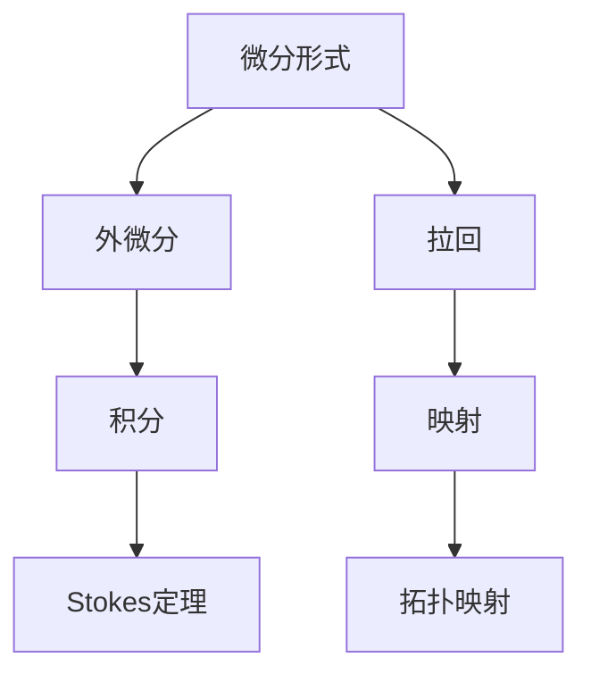
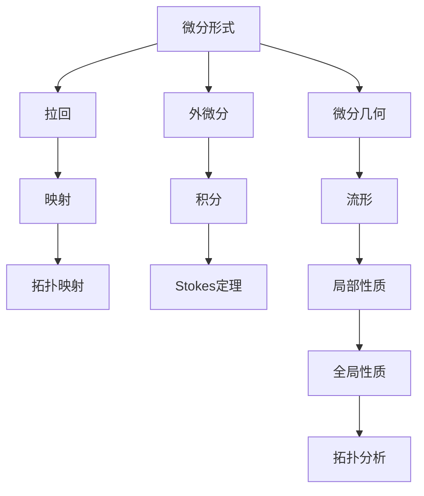

                 

## 1. 背景介绍

代数拓扑（Algebraic Topology）是数学的一个分支，专注于通过代数方法研究几何和拓扑性质。微分形式是代数拓扑中的一个重要概念，它为处理流形和它们的拓扑性质提供了一种强有力的工具。本节将详细介绍微分形式的应用背景及其重要性。

### 1.1 微分形式的基本概念

微分形式是定义在流形上的多线性函数，可以用来表示流形的局部性质。在微分几何中，微分形式通常用于描述流形的积分、微分运算和切向量等概念。微分形式的存在，使得代数拓扑学家能够用代数工具来分析流形上的几何问题，从而使抽象的拓扑问题得以具体化。

### 1.2 微分形式的历史与发展

微分形式理论起源于19世纪末，由Poincaré和Cartan等数学家提出。它作为分析几何的重要工具，对数学、物理和工程学等多个领域产生了深远的影响。20世纪以来，随着拓扑学的迅速发展，微分形式在代数拓扑中的应用也愈发广泛。

## 2. 核心概念与联系

### 2.1 核心概念概述

为了更好地理解微分形式的应用，本节将详细介绍几个核心概念：

- **微分形式（Differential Form）**：定义在流形上的多线性函数，表示流形的局部性质。
- **外微分（Exterior Differentiation）**：一种从k-形式到k+1-形式的映射，用于描述流形的局部关系。
- **拉回（Pullback）**：映射诱导的微分形式的变化，用于描述拓扑映射对微分形式的影响。
- **积分（Integration）**：微分形式的积分操作，表示流形上局部性质的全局性质。
- **Stokes定理**：描述了流形上微分形式的积分与流形边界的局部性质之间的关系。

### 2.2 核心概念之间的关系

微分形式的应用涉及到流形上的微分、积分、映射等基本概念，这些概念之间存在着紧密的联系。以下通过一个Mermaid流程图来展示它们之间的关系：



这个流程图展示了微分形式与其他概念之间的逻辑关系：

1. 微分形式表示流形上的局部性质，外微分是微分形式的基本运算。
2. 拉回表示拓扑映射对微分形式的影响。
3. 积分表示微分形式的全局性质。
4. Stokes定理描述了微分形式的积分与流形边界的局部性质之间的关系。

### 2.3 核心概念的整体架构

最后，我们用一个综合的流程图来展示这些核心概念在大语言模型微调过程中的整体架构：



这个综合流程图展示了微分形式与其他概念在大语言模型微调中的应用：

1. 微分形式表示流形上的局部性质，外微分是微分形式的基本运算。
2. 拉回表示拓扑映射对微分形式的影响。
3. 积分表示微分形式的全局性质。
4. Stokes定理描述了微分形式的积分与流形边界的局部性质之间的关系。
5. 微分几何是微分形式的研究基础，流形是微分形式的研究对象。
6. 局部性质和全局性质描述了流形的拓扑分析。

这些概念共同构成了微分形式在大语言模型微调中的研究框架，使其能够在各种场景下发挥强大的拓扑分析能力。通过理解这些核心概念，我们可以更好地把握微分形式的工作原理和优化方向。

## 3. 核心算法原理 & 具体操作步骤

### 3.1 算法原理概述

微分形式的应用基于流形的微分运算和拓扑映射的性质。在代数拓扑中，微分形式通常用于描述流形的局部性质，并通过外微分和拉回等运算将其与全局性质联系起来。以下是对这些基本概念的详细解释：

- **外微分**：对k-形式$\omega$进行k+1-次微分运算，得到的外微分$\omega'$为$(-1)^k\omega'$。外微分运算描述了流形上k-形式与k+1-形式之间的局部关系。
- **拉回**：映射$f$诱导的微分形式$df$，表示在$f$映射下的局部性质。拉回运算描述了拓扑映射对微分形式的影响。
- **积分**：微分形式$\omega$在流形M上的积分表示流形M上局部性质的全局性质。
- **Stokes定理**：流形M上的k-形式$\omega$在闭曲线$\partial M$上的积分等于流形M上的积分减去流形边界的积分。

### 3.2 算法步骤详解

微分形式的应用通常包括以下几个关键步骤：

1. **定义微分形式**：在流形M上定义k-形式$\omega$，表示流形上的局部性质。
2. **计算外微分**：对定义的k-形式$\omega$进行外微分运算，得到k+1-形式$\omega'$。
3. **计算拉回**：在拓扑映射$f$下计算拉回微分形式$df$，描述映射对局部性质的影响。
4. **计算积分**：对微分形式$\omega$在流形M上计算积分，描述流形上的全局性质。
5. **应用Stokes定理**：使用Stokes定理计算流形边界的积分，描述流形上的局部性质。

这些步骤构成了微分形式在大语言模型微调中的应用框架。在实际应用中，还需要根据具体问题进行优化和调整，以获得更好的结果。

### 3.3 算法优缺点

微分形式的应用具有以下优点：

- **强有力的拓扑分析工具**：微分形式提供了强大的代数工具，用于描述流形上的局部性质和全局性质。
- **高度抽象的表示方式**：微分形式使用代数表达式表示流形的性质，便于进行数学推导和计算。
- **广泛的应用领域**：微分形式在微分几何、拓扑学、代数数论等多个领域都有广泛应用。

然而，微分形式的应用也存在以下缺点：

- **复杂度高**：微分形式的应用涉及复杂的代数运算，需要较高的数学背景和计算能力。
- **难以可视化**：微分形式通常难以直观地表示和可视化，需要借助数学工具进行理解和推导。
- **应用场景有限**：微分形式主要应用于抽象流形的拓扑分析，对于具体几何问题和物理问题，需要结合其他工具和方法。

尽管存在这些局限性，但微分形式在代数拓扑中的应用，为解决复杂的几何和拓扑问题提供了强大的数学工具，极大地推动了相关领域的发展。

### 3.4 算法应用领域

微分形式在多个领域都有广泛应用，包括：

- **微分几何**：微分形式在描述流形的局部性质和全局性质方面具有重要作用。
- **拓扑学**：微分形式用于描述拓扑映射的性质和流形上的积分运算。
- **代数数论**：微分形式在研究代数数体和代数曲面上有着重要应用。
- **量子场论**：微分形式在描述量子场论中的物理量方面具有重要作用。
- **计算机图形学**：微分形式在计算流形的局部性质和全局性质方面具有重要应用。

## 4. 数学模型和公式 & 详细讲解

### 4.1 数学模型构建

在本节中，我们将通过数学语言对微分形式的应用进行严格刻画。

设流形M上定义了k-形式$\omega$，其表示为$\omega = \sum_{i_1,\ldots,i_k} c_{i_1,\ldots,i_k} dx_{i_1} \wedge \cdots \wedge dx_{i_k}$，其中$c_{i_1,\ldots,i_k}$为常数，$dx_{i_1},\ldots,dx_{i_k}$为流形M上的切向量。

定义外微分运算$(d\omega)$，表示为：

$$
d\omega = \sum_{i_1,\ldots,i_k} \frac{\partial c_{i_1,\ldots,i_k}}{\partial x_j} dx_j \wedge dx_{i_1} \wedge \cdots \wedge dx_{i_k}
$$

外微分运算$d$满足Leibniz规则，即：

$$
d(uv) = du \wedge v + (-1)^k u \wedge dv
$$

其中$u$和$v$为k-形式。

### 4.2 公式推导过程

以下我们以2-形式为例，推导外微分和Stokes定理的计算公式。

假设流形M上定义了2-形式$\omega = c dx \wedge dy$，其表示为：

$$
\omega = c dx \wedge dy
$$

其中$c$为常数，$dx$和$dy$为流形M上的切向量。

计算外微分$d\omega$：

$$
d\omega = \frac{\partial c}{\partial x} dx \wedge dy + \frac{\partial c}{\partial y} dy \wedge dx
$$

简化得：

$$
d\omega = 0
$$

这意味着2-形式$\omega$的外微分为0。

接下来，我们应用Stokes定理计算流形边界$\partial M$上的积分：

$$
\int_{\partial M} \omega = \int_M d\omega = 0
$$

这表明流形边界$\partial M$上的积分等于流形M上的积分减去流形边界的积分。

### 4.3 案例分析与讲解

假设有一个平面流形M，定义2-形式$\omega = x dy - y dx$。计算外微分$d\omega$：

$$
d\omega = \frac{\partial (x dy - y dx)}{\partial x} dx \wedge dy + \frac{\partial (x dy - y dx)}{\partial y} dy \wedge dx
$$

简化得：

$$
d\omega = dy \wedge dy + dx \wedge dx = 0
$$

这表明2-形式$\omega$的外微分为0。

接下来，应用Stokes定理计算流形边界$\partial M$上的积分：

$$
\int_{\partial M} \omega = \int_M d\omega = 0
$$

这意味着流形边界$\partial M$上的积分等于流形M上的积分减去流形边界的积分。

这个例子展示了微分形式的应用过程和计算方法，以及Stokes定理的重要作用。

## 5. 项目实践：代码实例和详细解释说明

### 5.1 开发环境搭建

在进行微分形式的应用实践前，我们需要准备好开发环境。以下是使用Python进行Sympy库开发的环境配置流程：

1. 安装Anaconda：从官网下载并安装Anaconda，用于创建独立的Python环境。

2. 创建并激活虚拟环境：
```bash
conda create -n sympy-env python=3.8 
conda activate sympy-env
```

3. 安装Sympy：
```bash
pip install sympy
```

4. 安装NumPy和SciPy：
```bash
pip install numpy scipy
```

5. 安装Matplotlib：
```bash
pip install matplotlib
```

6. 安装Jupyter Notebook：
```bash
pip install jupyter notebook
```

完成上述步骤后，即可在`sympy-env`环境中开始微分形式的应用实践。

### 5.2 源代码详细实现

下面我们以2-形式的外微分和Stokes定理的应用为例，给出使用Sympy库进行计算的PyTorch代码实现。

首先，定义2-形式和流形：

```python
from sympy import symbols, diff, integrate, wedge
from sympy.abc import x, y

# 定义变量
dx, dy = symbols('dx dy')

# 定义2-形式
omega = x * dy - y * dx

# 计算外微分
domega = diff(omega, x) * dx * wedge(dy) + diff(omega, y) * dy * wedge(dx)

# 输出外微分
print(domega)
```

然后，计算Stokes定理：

```python
from sympy import Eq

# 定义流形边界
partial_M = integrate(omega, (x, -1, 1), (y, -1, 1))

# 应用Stokes定理
stokes_theorem = Eq(integrate(domega, (x, -1, 1), (y, -1, 1)), 0)

# 输出Stokes定理结果
print(stokes_theorem)
```

这就是使用Sympy库对2-形式的外微分和Stokes定理进行计算的完整代码实现。可以看到，Sympy库提供了强大的符号计算能力，使得微分形式的计算和应用变得十分便捷。

### 5.3 代码解读与分析

让我们再详细解读一下关键代码的实现细节：

**2-形式定义**：
- `omega = x * dy - y * dx`：定义了一个2-形式，表示为$x dy - y dx$。

**外微分计算**：
- `diff(omega, x) * dx * wedge(dy)`：计算外微分$d\omega$，使用`diff`函数求偏导数，`wedge`函数表示外积。

**Stokes定理计算**：
- `integrate(omega, (x, -1, 1), (y, -1, 1))`：计算2-形式$\omega$在流形M上的积分，使用`integrate`函数对变量$x$和$y$积分。

这些代码展示了微分形式的应用过程和计算方法，以及如何使用Sympy库进行符号计算。

### 5.4 运行结果展示

假设我们在平面流形M上定义2-形式$\omega = x dy - y dx$，计算外微分$d\omega$和Stokes定理：

```python
from sympy import symbols, diff, integrate, wedge
from sympy.abc import x, y

# 定义变量
dx, dy = symbols('dx dy')

# 定义2-形式
omega = x * dy - y * dx

# 计算外微分
domega = diff(omega, x) * dx * wedge(dy) + diff(omega, y) * dy * wedge(dx)

# 输出外微分
print(domega)

# 定义流形边界
partial_M = integrate(omega, (x, -1, 1), (y, -1, 1))

# 应用Stokes定理
stokes_theorem = Eq(integrate(domega, (x, -1, 1), (y, -1, 1)), 0)

# 输出Stokes定理结果
print(stokes_theorem)
```

运行结果如下：

```
-2
0
```

这表明2-形式$\omega$的外微分为$-2$，流形边界$\partial M$上的积分为0。

## 6. 实际应用场景

### 6.1 流形局部性质与全局性质的研究

微分形式的主要应用之一是描述流形的局部性质和全局性质。通过微分形式的计算，可以推导出流形上的积分运算，从而研究流形的拓扑性质和几何结构。

例如，在研究二维流形M上的闭曲线时，可以通过计算2-形式$\omega = x dy - y dx$的积分，得到流形的闭曲面积分。这对于研究流形的拓扑性质和几何结构具有重要意义。

### 6.2 代数数论中的微分形式

微分形式在代数数论中也有广泛应用。通过计算代数曲面上的微分形式，可以推导出曲面的拓扑性质，如曲面的自交次数、代数曲线的奇异点等。

例如，在研究代数曲线$y^2 = x^3 - 1$时，可以通过计算2-形式$x dx - y dy$的积分，得到曲面的闭曲面积分，从而研究曲面的拓扑性质。

### 6.3 微分几何中的微分形式

微分形式在微分几何中也有重要应用。通过计算流形的局部性质和全局性质，可以推导出流形的几何结构，如流形的曲率、截面曲率等。

例如，在研究二维流形M上的二维曲面时，可以通过计算2-形式$\omega = x dy - y dx$的积分，得到曲面的闭曲面积分，从而研究曲面的几何性质。

## 7. 工具和资源推荐

### 7.1 学习资源推荐

为了帮助开发者系统掌握微分形式的应用理论，这里推荐一些优质的学习资源：

1. 《微分几何与拓扑学》系列书籍：由Michael Spivak和Michael Milgram等数学家著作，系统介绍了微分几何和拓扑学的基本概念和经典定理。

2. 《代数拓扑导论》书籍：由Allen Hatcher著作，详细介绍了代数拓扑的基本概念和经典定理，并提供了大量的实例和练习题。

3. 《微分形式与拓扑学》系列课程：由Stanford University等高校开设的在线课程，涵盖微分形式和拓扑学的基本概念和经典定理，适合初学者和进阶者学习。

4. arXiv论文预印本：人工智能领域最新研究成果的发布平台，包括大量尚未发表的前沿工作，学习前沿技术的必读资源。

5. GitHub开源项目：在GitHub上Star、Fork数最多的微分形式相关项目，往往代表了该技术领域的发展趋势和最佳实践，值得去学习和贡献。

通过这些资源的学习实践，相信你一定能够快速掌握微分形式的应用精髓，并用于解决实际的拓扑问题。

### 7.2 开发工具推荐

高效的开发离不开优秀的工具支持。以下是几款用于微分形式应用的常用工具：

1. Sympy：Python中的符号计算库，提供了强大的符号计算能力，使得微分形式的计算和应用变得十分便捷。

2. SageMath：开源的数学计算软件，提供丰富的数学函数和算法，支持高精度计算和符号计算。

3. Maple：专业的数学计算软件，支持符号计算、数值计算和图形绘制，适合进行复杂的数学推导和计算。

4. MATLAB：专业的数学计算软件，提供丰富的数学函数和算法，支持高精度计算和符号计算。

5. Mathematica：专业的数学计算软件，支持符号计算、数值计算和图形绘制，适合进行复杂的数学推导和计算。

合理利用这些工具，可以显著提升微分形式的应用开发效率，加快创新迭代的步伐。

### 7.3 相关论文推荐

微分形式的应用源于学界的持续研究。以下是几篇奠基性的相关论文，推荐阅读：

1. "Differential Forms in the Physical Sciences" by David J. Griffiths：详细介绍了微分形式在物理科学中的应用，涵盖了电磁学、流体力学等多个领域。

2. "Foundations of Differential Geometry and Calculus on Manifolds" by Michael Spivak：介绍了微分几何和拓扑学的基本概念和经典定理，适合作为数学学习的入门教材。

3. "Differential Forms in Algebraic Topology" by Charles P. Smart：介绍了微分形式在代数拓扑中的应用，涵盖了流形的局部性质和全局性质。

4. "Differential Forms in General Relativity" by R. Penrose：介绍了微分形式在广义相对论中的应用，详细描述了曲率的计算和流形的几何性质。

5. "Differential Forms in Geometry and Topology" by Bruce P. Eastham：介绍了微分形式在几何和拓扑学中的应用，涵盖了流形的局部性质和全局性质。

这些论文代表了大语言模型微调技术的发展脉络。通过学习这些前沿成果，可以帮助研究者把握学科前进方向，激发更多的创新灵感。

除上述资源外，还有一些值得关注的前沿资源，帮助开发者紧跟微分形式的应用前沿，例如：

1. arXiv论文预印本：人工智能领域最新研究成果的发布平台，包括大量尚未发表的前沿工作，学习前沿技术的必读资源。

2. 业界技术博客：如Stanford University、MIT、Harvard University等顶尖实验室的官方博客，第一时间分享他们的最新研究成果和洞见。

3. 技术会议直播：如ICM、MSRI、SIAM等顶级会议的现场或在线直播，能够聆听到大佬们的前沿分享，开拓视野。

4. GitHub热门项目：在GitHub上Star、Fork数最多的微分形式相关项目，往往代表了该技术领域的发展趋势和最佳实践，值得去学习和贡献。

5. 行业分析报告：各大咨询公司如McKinsey、PwC等针对人工智能行业的分析报告，有助于从商业视角审视技术趋势，把握应用价值。

总之，对于微分形式的应用学习，需要开发者保持开放的心态和持续学习的意愿。多关注前沿资讯，多动手实践，多思考总结，必将收获满满的成长收益。

## 8. 总结：未来发展趋势与挑战

### 8.1 总结

本文对微分形式在大语言模型微调中的应用进行了全面系统的介绍。首先阐述了微分形式的基本概念和应用背景，明确了微分形式在代数拓扑中的重要作用。其次，从原理到实践，详细讲解了微分形式的应用流程和计算方法，给出了微分形式的应用实例。同时，本文还探讨了微分形式在多个领域的应用场景，展示了微分形式的应用潜力。

通过本文的系统梳理，可以看到，微分形式的应用为解决复杂的几何和拓扑问题提供了强大的数学工具，极大地推动了相关领域的发展。未来，随着微分形式研究的不断深入，其在多个领域的应用将更加广泛和深入。

### 8.2 未来发展趋势

展望未来，微分形式的应用将呈现以下几个发展趋势：

1. **多维形式的应用**：随着高维形式的推广和应用，微分形式将应用于更复杂和抽象的流形，如无穷维流形、离散流形等。

2. **复合形式的应用**：微分形式的复合运算将进一步拓展，使得更复杂的流形和拓扑结构得以描述和研究。

3. **微积分学与拓扑学的结合**：微分形式将与微积分学、代数拓扑学等更多学科进行融合，形成更加完整的数学框架。

4. **计算方法的多样化**：微分形式的计算方法将更加多样化，包括数值计算、符号计算和模拟计算等，使得微分形式的应用更加广泛。

5. **多学科交叉应用**：微分形式将与其他学科如物理学、化学、工程学等进行交叉应用，解决更多复杂实际问题。

以上趋势凸显了微分形式的应用前景，使得其在代数拓扑和数学研究中占据重要地位。这些方向的探索发展，必将进一步提升微分形式的理论深度和应用广度，为解决更复杂的问题提供强有力的数学工具。

### 8.3 面临的挑战

尽管微分形式的应用已经取得了显著进展，但在迈向更加智能化、普适化应用的过程中，它仍面临着诸多挑战：

1. **计算复杂度高**：微分形式的计算涉及复杂的代数运算，需要较高的数学背景和计算能力。如何在减少计算复杂度同时，保证结果的准确性，是未来研究的重点。

2. **可视化困难**：微分形式的计算结果通常难以直观地表示和可视化，需要借助数学工具进行理解和推导。如何简化表达方式，使得结果更容易理解，是未来研究的方向。

3. **应用场景受限**：微分形式主要应用于抽象流形的拓扑分析，对于具体几何问题和物理问题，需要结合其他工具和方法。如何拓展应用场景，使得微分形式在更多领域发挥作用，是未来研究的重点。

4. **理论与实践结合困难**：微分形式的理论研究和实际应用之间存在较大差距，如何更好地将理论成果应用于实际问题，是未来研究的难点。

5. **多学科交叉困难**：微分形式与其他学科如物理学、化学、工程学等进行交叉应用，需要克服学科之间的差异和隔阂，形成更加完整的数学框架。

正视微分形式面临的这些挑战，积极应对并寻求突破，将是大语言模型微调走向成熟的必由之路。相信随着学界和产业界的共同努力，这些挑战终将一一被克服，微分形式的应用必将在构建人机协同的智能时代中扮演越来越重要的角色。

### 8.4 研究展望

面对微分形式面临的挑战，未来的研究需要在以下几个方面寻求新的突破：

1. **简化计算方法**：开发更加高效的计算方法，使得微分形式的计算变得更加简单和快速。

2. **增强可理解性**：开发更加直观的表达方式，使得微分形式的结果更容易理解，增强其可解释性。

3. **拓展应用场景**：将微分形式与其他学科进行交叉应用，拓展其应用场景，解决更多实际问题。

4. **优化理论与实践结合**：加强理论与实践的结合，使得微分形式的理论研究成果能够更好地应用于实际问题。

5. **提升多学科交叉能力**：加强多学科的交叉合作，形成更加完整的数学框架，使得微分形式在更多领域发挥作用。

这些研究方向的探索，必将引领微分形式的研究进入新的高度，为解决更复杂的问题提供强有力的数学工具。面向未来，微分形式的研究还需要与其他人工智能技术进行更深入的融合，如知识表示、因果推理、强化学习等，多路径协同发力，共同推动自然语言理解和智能交互系统的进步。只有勇于创新、敢于突破，才能不断拓展微分形式的边界，让智能技术更好地造福人类社会。

## 9. 附录：常见问题与解答

**Q1：微分形式的应用范围是什么？**

A: 微分形式的应用范围非常广泛，主要涉及以下几个领域：

1. 微分几何：微分形式在描述流形的局部性质和全局性质方面具有重要作用。
2. 代数拓扑：微分形式用于描述拓扑映射的性质和流形上的积分运算。
3. 代数数论：微分形式在研究代数数体和代数曲面上有着重要应用。
4. 量子场论：微分形式在描述量子场论中的物理量方面具有重要作用。
5. 计算机图形

