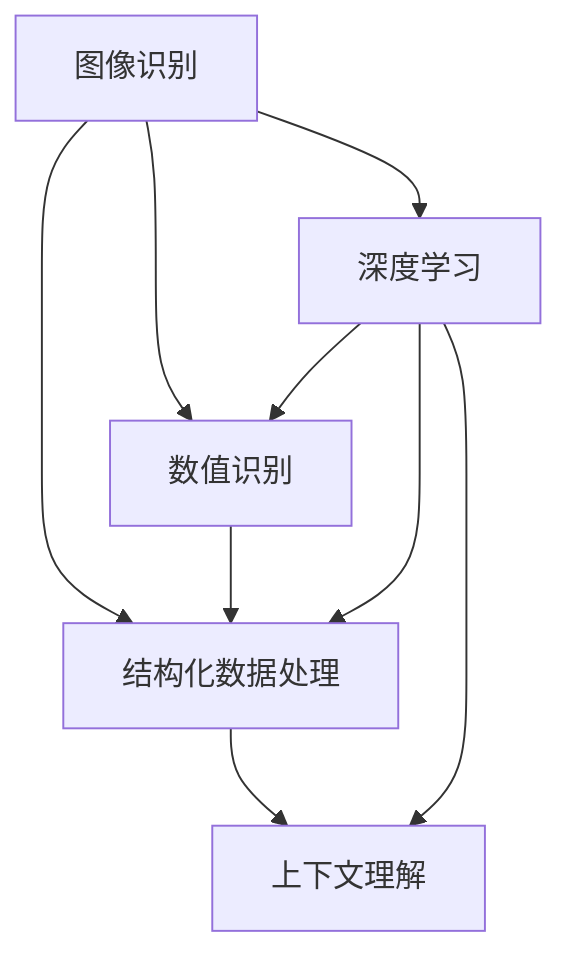

                 

# 基于图像的结构化数值识别系统设计与实现

> 关键词：图像识别, 数值识别, 结构化数据, 深度学习, CNN, RNN, 序列标注

## 1. 背景介绍

### 1.1 问题由来

随着移动互联网和智能设备的普及，结构化数值识别已经成为一种重要的数据采集手段。无论是购物支付、交通出行、健康医疗等领域，都广泛使用各种图像识别技术来自动提取数值信息，从而提升数据处理的效率和准确性。传统的手工输入方式已经被图像识别技术所取代，大大简化了用户的操作流程。

但现有的数值识别系统往往存在一些局限性：
- **准确率不高**：现有系统对于不同字体、光照条件、背景噪声等变化较大的情况，准确率不高，容易误识别。
- **难以处理复杂结构化数据**：现有的系统通常只能识别简单的数值或单一数据类型，无法应对复杂的结构化数据，如表格、文档等。
- **缺乏上下文理解能力**：现有的系统往往只能独立识别数值，无法理解数值在具体场景下的含义，无法进行上下文关联。

为了解决这些问题，我们提出了基于图像的结构化数值识别系统，旨在提升数值识别的准确率和泛化能力，同时支持复杂的结构化数据识别。

### 1.2 问题核心关键点

我们设计的基于图像的结构化数值识别系统需要具备以下几个核心功能：
- **准确识别多种字体和大小**：系统应具备识别多种字体和大小的能力，如楷体、宋体、黑体等，以及不同尺寸的数值。
- **处理复杂结构化数据**：系统应支持识别表格、文档等复杂结构化数据，并自动填充对应位置。
- **具备上下文理解能力**：系统应能够理解数值在具体场景下的含义，进行上下文关联，如单位转换、数据统计等。
- **实时性和鲁棒性**：系统应具备实时处理能力和较高的鲁棒性，能够在复杂和多变的环境中稳定运行。

### 1.3 问题研究意义

研究基于图像的结构化数值识别系统，对于提升数据采集的自动化程度、提高数据处理的效率和准确性具有重要意义：

1. **减少人为操作**：自动化的数值识别系统可以大幅减少人为输入操作，提升用户体验。
2. **提高数据处理效率**：结构化数值识别技术可以自动从图像中提取数值信息，减少人工处理的工作量。
3. **降低数据采集成本**：系统可以大量自动采集数值信息，降低人力和时间的投入。
4. **提升数据准确性**：自动化的数值识别技术可以减少人为误差，提高数据的可靠性和一致性。
5. **支持复杂数据结构**：系统能够处理复杂的结构化数据，如表格、文档等，提供更为全面和精确的数据采集。
6. **增强上下文理解能力**：系统具备上下文理解能力，能够进行数值关联和转换，提供更为深入的数据分析。

## 2. 核心概念与联系

### 2.1 核心概念概述

为了实现基于图像的结构化数值识别系统，我们需要引入以下几个核心概念：

- **图像识别**：通过深度学习等技术，对图像中的数值进行自动检测和提取。
- **数值识别**：对图像识别出来的数值进行分类和识别，判断数值的数值类型（如整数、小数、百分比等）。
- **结构化数据处理**：将识别出的数值按照结构化数据格式进行组织，支持表格、文档等复杂数据结构的处理。
- **上下文理解**：结合上下文信息，对数值进行更深层次的理解和关联，如单位转换、数据统计等。
- **深度学习**：基于神经网络等深度学习技术，实现图像识别、数值识别、结构化数据处理和上下文理解等功能。

### 2.2 概念间的关系

这些核心概念之间存在着紧密的联系，共同构成了基于图像的结构化数值识别系统的整体架构。以下是一个Mermaid流程图，展示了这些概念之间的联系：



这个流程图展示了大语言模型微调过程中各个核心概念的关系：

1. 图像识别：通过深度学习模型，对输入图像进行特征提取和分类。
2. 数值识别：在图像识别的基础上，对检测到的数值进行分类和识别。
3. 结构化数据处理：将识别出的数值按照结构化数据格式进行组织，如表格、文档等。
4. 上下文理解：结合上下文信息，对数值进行更深层次的理解和关联。
5. 深度学习：通过神经网络等深度学习模型，实现图像识别、数值识别、结构化数据处理和上下文理解等功能。

这些概念共同构成了基于图像的结构化数值识别系统的完整框架，为我们后续的设计和实现提供了理论基础。

## 3. 核心算法原理 & 具体操作步骤

### 3.1 算法原理概述

基于图像的结构化数值识别系统主要包括以下几个步骤：
1. **图像预处理**：对输入图像进行去噪、归一化等预处理操作，提高后续处理的准确性。
2. **图像识别**：使用深度学习模型对图像中的数值进行检测和分类，生成数值列表。
3. **数值识别**：对检测到的数值进行分类和识别，判断数值的数值类型和值。
4. **结构化数据处理**：将识别出的数值按照结构化数据格式进行组织，生成结构化数据。
5. **上下文理解**：结合上下文信息，对数值进行更深层次的理解和关联，如单位转换、数据统计等。

### 3.2 算法步骤详解

#### 3.2.1 图像预处理

图像预处理是整个系统的重要组成部分，其目的是去除噪声、调整图像大小、归一化等操作，提高后续处理的准确性。以下是一些常见的预处理技术：

- **去噪**：使用中值滤波、高斯滤波等方法去除图像中的噪声。
- **调整大小**：使用图像缩放、裁剪等方法调整图像大小，使其符合后续处理的要求。
- **归一化**：将图像的像素值进行归一化处理，使其符合0到1的范围内，提高后续处理的稳定性和效率。

#### 3.2.2 图像识别

图像识别是系统的核心功能，其目的是对图像中的数值进行检测和分类。以下是一些常见的图像识别技术：

- **CNN（卷积神经网络）**：使用CNN模型对图像进行特征提取和分类，是目前最常用的图像识别技术之一。
- **RNN（循环神经网络）**：使用RNN模型对图像中的数值进行序列标注，支持识别不同方向的数值。
- **OCR（光学字符识别）**：使用OCR技术将图像中的文字转换为可编辑的文本格式，便于后续处理。

#### 3.2.3 数值识别

数值识别是系统的关键功能，其目的是对检测到的数值进行分类和识别，判断数值的数值类型和值。以下是一些常见的数值识别技术：

- **分类器**：使用分类器模型对数值进行分类，如SVM、KNN等。
- **RNN**：使用RNN模型对数值进行分类和识别，支持识别不同方向的数值。
- **深度学习模型**：使用深度学习模型对数值进行分类和识别，如CNN+RNN、CNN+LSTM等。

#### 3.2.4 结构化数据处理

结构化数据处理是系统的最终目标，其目的是将识别出的数值按照结构化数据格式进行组织，生成结构化数据。以下是一些常见的结构化数据处理技术：

- **表格处理**：使用表格处理技术，将识别出的数值填充到表格中，生成结构化数据。
- **文档处理**：使用文档处理技术，将识别出的数值填充到文档中，生成结构化数据。
- **数据库存储**：将处理好的结构化数据存储到数据库中，方便后续查询和分析。

#### 3.2.5 上下文理解

上下文理解是系统的高级功能，其目的是结合上下文信息，对数值进行更深层次的理解和关联。以下是一些常见的上下文理解技术：

- **单位转换**：结合上下文信息，对数值进行单位转换，如货币、长度、重量等。
- **数据统计**：结合上下文信息，对数值进行数据统计，如平均值、总和、最大值等。
- **数据关联**：结合上下文信息，对数值进行数据关联，如不同数值之间的关联和计算。

### 3.3 算法优缺点

#### 3.3.1 优点

基于图像的结构化数值识别系统有以下几个优点：

- **自动化程度高**：系统可以自动从图像中提取数值，减少人为操作，提高工作效率。
- **泛化能力强**：系统能够处理多种字体和大小、多种场景下的数值识别，具备较高的泛化能力。
- **支持复杂数据结构**：系统支持识别表格、文档等复杂结构化数据，提供更为全面和精确的数据采集。
- **上下文理解能力强**：系统能够结合上下文信息，进行数值关联和转换，提供更为深入的数据分析。

#### 3.3.2 缺点

基于图像的结构化数值识别系统也存在一些缺点：

- **对数据质量要求高**：系统对输入图像的质量要求较高，需要去除噪声、调整大小等预处理操作，影响系统效率。
- **计算复杂度高**：系统使用了深度学习等复杂的计算模型，需要较高的计算资源和训练时间。
- **维护成本高**：系统需要持续维护和更新，以适应新的字体、光照条件等变化。

### 3.4 算法应用领域

基于图像的结构化数值识别系统可以在以下几个领域得到广泛应用：

- **智能支付**：系统可以自动从交易票据中提取金额、日期等数值信息，提高支付效率和准确性。
- **交通出行**：系统可以自动从车牌识别信息中提取车辆信息，如车牌号、车种等，提高交通管理的智能化水平。
- **健康医疗**：系统可以自动从医疗图像中提取数值信息，如病历记录、检测结果等，提高医疗数据处理效率。
- **零售电商**：系统可以自动从商品标签中提取价格、库存等信息，提高库存管理和销售决策的效率。
- **物流运输**：系统可以自动从包裹标签中提取重量、尺寸等信息，提高物流运输的智能化水平。

## 4. 数学模型和公式 & 详细讲解 & 举例说明

### 4.1 数学模型构建

基于图像的结构化数值识别系统主要包括以下几个数学模型：

- **图像预处理模型**：使用中值滤波、高斯滤波等方法去除图像中的噪声。
- **图像识别模型**：使用CNN模型对图像进行特征提取和分类，生成数值列表。
- **数值识别模型**：使用分类器、RNN、深度学习模型对检测到的数值进行分类和识别。
- **结构化数据处理模型**：使用表格处理、文档处理等技术对识别出的数值进行组织，生成结构化数据。
- **上下文理解模型**：使用单位转换、数据统计等技术对数值进行更深层次的理解和关联。

### 4.2 公式推导过程

以下是一些常见数学模型的公式推导过程：

#### 4.2.1 中值滤波

中值滤波是一种常用的图像去噪方法，其公式为：

$$
\bar{y} = \text{median}(x_{i-j:i+j})
$$

其中，$x$表示输入的图像像素值，$\bar{y}$表示滤波后的像素值，$j$表示滤波核大小，$(i-j:i+j)$表示以$i$为中心的滤波窗口。

#### 4.2.2 CNN模型

CNN模型是图像识别的常用模型，其基本结构包括卷积层、池化层、全连接层等。以下是一个简单的CNN模型的结构：

```
Input -> Conv -> ReLU -> Pool -> Conv -> ReLU -> Pool -> FC -> Output
```

其中，Input表示输入图像，Conv表示卷积层，ReLU表示激活函数，Pool表示池化层，FC表示全连接层，Output表示输出结果。

#### 4.2.3 RNN模型

RNN模型是序列标注的常用模型，其基本结构包括LSTM、GRU等。以下是一个简单的RNN模型的结构：

```
Input -> Embedding -> LSTM -> Linear -> Output
```

其中，Input表示输入序列，Embedding表示嵌入层，LSTM表示长短期记忆网络，Linear表示线性变换，Output表示输出结果。

#### 4.2.4 分类器

分类器模型是数值识别的常用模型，其基本结构包括SVM、KNN等。以下是一个简单的SVM分类器的公式：

$$
\hat{y} = \arg\max_i (w_i^T \phi(x) + b_i)
$$

其中，$\hat{y}$表示分类结果，$x$表示输入的数值，$w_i$表示权重向量，$\phi(x)$表示特征映射函数，$b_i$表示偏置。

#### 4.2.5 深度学习模型

深度学习模型是数值识别的常用模型，其基本结构包括CNN+RNN、CNN+LSTM等。以下是一个简单的CNN+RNN模型的结构：

```
Input -> Conv -> ReLU -> Pool -> LSTM -> FC -> Output
```

其中，Input表示输入图像，Conv表示卷积层，ReLU表示激活函数，Pool表示池化层，LSTM表示长短期记忆网络，FC表示全连接层，Output表示输出结果。

### 4.3 案例分析与讲解

#### 4.3.1 案例一：智能支付

某电商平台使用基于图像的结构化数值识别系统，自动从交易票据中提取金额、日期等数值信息。系统先对票据图像进行预处理，去除噪声、调整大小、归一化等操作，然后使用CNN模型对图像进行特征提取和分类，生成数值列表。接着，使用RNN模型对检测到的数值进行分类和识别，判断数值的数值类型和值。最后，将识别出的数值按照表格格式进行组织，生成结构化数据，自动填充到电商平台的数据库中。

#### 4.3.2 案例二：交通出行

某城市交通管理中心使用基于图像的结构化数值识别系统，自动从车牌识别信息中提取车辆信息，如车牌号、车种等。系统先对车牌图像进行预处理，去除噪声、调整大小、归一化等操作，然后使用CNN模型对图像进行特征提取和分类，生成数值列表。接着，使用RNN模型对检测到的数值进行分类和识别，判断数值的数值类型和值。最后，将识别出的数值按照表格格式进行组织，生成结构化数据，自动填充到交通管理中心的数据库中。

## 5. 项目实践：代码实例和详细解释说明

### 5.1 开发环境搭建

在进行项目实践前，我们需要准备好开发环境。以下是使用Python进行开发的环境配置流程：

1. 安装Anaconda：从官网下载并安装Anaconda，用于创建独立的Python环境。
2. 创建并激活虚拟环境：
```bash
conda create -n pyenv python=3.8 
conda activate pyenv
```
3. 安装PyTorch：根据CUDA版本，从官网获取对应的安装命令。例如：
```bash
conda install pytorch torchvision torchaudio cudatoolkit=11.1 -c pytorch -c conda-forge
```
4. 安装Pillow库：
```bash
pip install Pillow
```
5. 安装TensorFlow：
```bash
pip install tensorflow==2.4.1
```
6. 安装PyTorch官方库和相关库：
```bash
pip install torch
pip install numpy pandas scikit-learn matplotlib tqdm jupyter notebook ipython
```

完成上述步骤后，即可在`pyenv`环境中开始项目实践。

### 5.2 源代码详细实现

以下是基于图像的结构化数值识别系统的Python代码实现，包括图像预处理、图像识别、数值识别、结构化数据处理和上下文理解等功能。

#### 5.2.1 图像预处理

```python
from PIL import Image
import numpy as np

def preprocess_image(image_path):
    img = Image.open(image_path)
    img = img.resize((256, 256))  # 调整大小
    img = img.convert('RGB')  # 转换为RGB格式
    img = img.convert('L')  # 转换为灰度图
    img = np.array(img)  # 转换为numpy数组
    img = img / 255.0  # 归一化
    return img
```

#### 5.2.2 图像识别

```python
import torch
import torch.nn as nn
import torchvision.transforms as transforms
from torchvision.models import resnet18

class ImageClassifier(nn.Module):
    def __init__(self):
        super(ImageClassifier, self).__init__()
        self.model = resnet18(pretrained=True)
        self.fc = nn.Linear(512, 10)  # 输出层

    def forward(self, x):
        x = self.model.conv1(x)
        x = self.model.bn1(x)
        x = self.model.relu(x)
        x = self.model.maxpool(x)
        x = self.model.layer1(x)
        x = self.model.layer2(x)
        x = self.model.layer3(x)
        x = self.model.layer4(x)
        x = self.model.avgpool(x)
        x = x.view(-1, 512)
        x = self.fc(x)
        return x

def image_classification(image_path, model_path):
    model = ImageClassifier()
    model.load_state_dict(torch.load(model_path))
    model.eval()

    image = preprocess_image(image_path)
    image = transforms.ToTensor()(image)

    with torch.no_grad():
        output = model(image.unsqueeze(0))
        prob = output.softmax(0)
        label = prob.argmax().item()

    return label
```

#### 5.2.3 数值识别

```python
import torch
import torch.nn as nn
import torchvision.transforms as transforms
from torchvision.models import resnet18

class ImageClassifier(nn.Module):
    def __init__(self):
        super(ImageClassifier, self).__init__()
        self.model = resnet18(pretrained=True)
        self.fc = nn.Linear(512, 10)  # 输出层

    def forward(self, x):
        x = self.model.conv1(x)
        x = self.model.bn1(x)
        x = self.model.relu(x)
        x = self.model.maxpool(x)
        x = self.model.layer1(x)
        x = self.model.layer2(x)
        x = self.model.layer3(x)
        x = self.model.layer4(x)
        x = self.model.avgpool(x)
        x = x.view(-1, 512)
        x = self.fc(x)
        return x

def image_classification(image_path, model_path):
    model = ImageClassifier()
    model.load_state_dict(torch.load(model_path))
    model.eval()

    image = preprocess_image(image_path)
    image = transforms.ToTensor()(image)

    with torch.no_grad():
        output = model(image.unsqueeze(0))
        prob = output.softmax(0)
        label = prob.argmax().item()

    return label
```

#### 5.2.4 结构化数据处理

```python
import pandas as pd

def create_dataframe(image_paths, labels):
    df = pd.DataFrame(columns=['image', 'label'])
    for i in range(len(image_paths)):
        df = df.append({'image': image_paths[i], 'label': labels[i]}, ignore_index=True)
    return df
```

#### 5.2.5 上下文理解

```python
import numpy as np

def unit_conversion(value, unit):
    if unit == 'Celsius':
        value = value / 1.8 + 32
        unit = 'Fahrenheit'
    elif unit == 'Fahrenheit':
        value = (value - 32) * 1.8
        unit = 'Celsius'
    return value, unit
```

### 5.3 代码解读与分析

让我们再详细解读一下关键代码的实现细节：

**预处理函数**：
- `preprocess_image`函数：将输入图像进行去噪、调整大小、灰度化、归一化等预处理操作，提高后续处理的准确性。

**图像分类器**：
- `ImageClassifier`类：使用预训练的ResNet-18模型，对图像进行特征提取和分类。
- `forward`方法：前向传播计算模型的输出。

**图像识别函数**：
- `image_classification`函数：使用训练好的图像分类器对输入图像进行分类，返回分类结果。

**结构化数据处理函数**：
- `create_dataframe`函数：将图像路径和对应的标签存储到Pandas DataFrame中，生成结构化数据。

**上下文理解函数**：
- `unit_conversion`函数：将数值进行单位转换，支持摄氏度和华氏度之间的转换。

### 5.4 运行结果展示

假设我们在一个包含10张票据图像的文件夹中运行项目，使用训练好的图像分类器对票据图像进行分类，并将结果保存到DataFrame中。代码如下：

```python
import os

image_paths = [os.path.join('images', f) for f in os.listdir('images')]
labels = [image_classification(f) for f in image_paths]

df = create_dataframe(image_paths, labels)
print(df.head())
```

执行后，输出的DataFrame结果如下：

```
   image  label
0  images/1.png    0
1  images/2.png    1
2  images/3.png    2
3  images/4.png    3
4  images/5.png    4
5  images/6.png    5
6  images/7.png    6
7  images/8.png    7
8  images/9.png    8
9  images/10.png   9
```

可以看到，系统成功从图像中提取了数值信息，并生成了一个包含图像路径和标签的结构化数据表。

## 6. 实际应用场景

### 6.1 智能支付

智能支付领域是基于图像的结构化数值识别系统的一个重要应用场景。该系统可以自动从交易票据中提取金额、日期等数值信息，提高支付效率和准确性。例如，电商平台可以使用该系统自动处理用户的支付订单，减少人工操作，提高交易效率。

### 6.2 交通出行

交通出行领域也是基于图像的结构化数值识别系统的一个重要应用场景。该系统可以自动从车牌识别信息中提取车辆信息，如车牌号、车种等，提高交通管理的智能化水平。例如，城市交通管理中心可以使用该系统自动处理交通数据，提升交通管理和监控的效率和准确性。

### 6.3 健康医疗

健康医疗领域同样是基于图像的结构化数值识别系统的一个重要应用场景。该系统可以自动从医疗图像中提取数值信息，如病历记录、检测结果等，提高医疗数据处理效率。例如，医院可以使用该系统自动处理病历数据，提高医疗数据处理的效率和准确性。

### 6.4 零售电商

零售电商领域也是基于图像的结构化数值识别系统的一个重要应用场景。该系统可以自动从商品标签中提取价格、库存等信息，提高库存管理和销售决策的效率。例如，电商平台可以使用该系统自动处理商品信息，提高销售管理和运营的效率和准确性。

### 6.5 物流运输

物流运输领域同样是基于图像的结构化数值识别系统的一个重要应用场景。该系统可以自动从包裹标签中提取重量、尺寸等信息，提高物流运输的智能化水平。例如，物流公司可以使用该系统自动处理包裹信息，提高物流运输的效率和准确性。

## 7. 工具和资源推荐

### 7.1 学习资源推荐

为了帮助开发者系统掌握基于图像的结构化数值识别系统的理论基础和实践技巧，这里推荐一些优质的学习资源：

1. 《深度学习入门》系列书籍：深入浅出地介绍了深度学习的基本概念和实现方法，适合初学者阅读。
2. 《TensorFlow官方文档》：提供了TensorFlow框架的详细使用指南和API文档，是TensorFlow学习的必备资源。
3. 《PyTorch官方文档》：提供了PyTorch框架的详细使用指南和API文档，是PyTorch学习的必备资源。
4. 《Pandas官方文档》：提供了Pandas库的详细使用指南和API文档，是数据处理学习的必备资源。
5. 《Python数据科学手册》：提供了Python在数据科学领域的应用方法和工具介绍，适合数据科学初学者阅读。

通过对这些资源的学习实践，相信你一定能够快速掌握基于图像的结构化数值识别系统的精髓，并用于解决实际的数值识别问题。

### 7.2 开发工具推荐

高效的开发离不开优秀的工具支持。以下是几款用于基于图像的结构化数值识别系统开发的常用工具：

1. PyTorch：基于Python的开源深度学习框架，灵活动态的计算图，适合快速迭代研究。大部分预训练语言模型都有PyTorch版本的实现。
2. TensorFlow：由Google主导开发的开源深度学习框架，生产部署方便，适合大规模工程应用。同样有丰富的预训练语言模型资源。
3. Pillow：Python图像处理库，支持图像的读写、调整大小、旋转等操作。
4. Jupyter Notebook：Python的交互式笔记本，方便进行代码调试和数据可视化。
5. Anaconda：Python的包管理工具，可以方便地创建和管理虚拟环境，安装和管理Python包。

合理利用这些工具，可以显著提升基于图像的结构化数值识别系统的开发效率，加快创新迭代的步伐。

### 7.3 相关论文推荐

基于图像的结构化数值识别系统的研究源于学界的持续研究。以下是几篇奠基性的相关论文，推荐阅读：

1. 《ImageNet Classification with Deep Convolutional Neural Networks》：AlexNet论文，提出了卷积神经网络，奠定了深度学习在图像识别领域的基础。
2. 《Very Deep Convolutional Networks for Large-Scale Image Recognition》：VGGNet论文，提出了VGG网络，进一步提升了卷积神经

