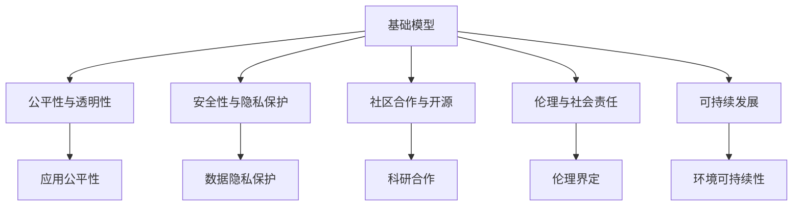

                 

# 基础模型的社会合作与技术创新

## 1. 背景介绍

### 1.1 问题由来

在过去几十年里，计算机技术的发展极大地推动了社会的进步和变革。然而，这一过程中也暴露出了许多新的问题，特别是在人工智能（AI）领域。人工智能不仅带来了前所未有的生产力提升，也引发了广泛的伦理和社会讨论。特别是在基础模型（基础模型是指那些在大规模数据上训练并具备广泛应用能力的模型）的开发和使用过程中，社会合作与技术创新成为了一个迫切需要解决的问题。

基础模型，如BERT、GPT等，通过在大规模无标签数据上预训练，已经展示了强大的语言理解和生成能力。然而，这些模型在实际应用中，尤其是涉及个人隐私和敏感信息时，如何确保其使用的公平性、透明性和安全性，是一个复杂且亟待解决的问题。

### 1.2 问题核心关键点

基础模型的社会合作与技术创新，主要涉及以下几个关键点：

- **公平性与透明性**：如何确保基础模型在不同人群、不同领域中的应用公平性，以及在使用过程中保持透明。
- **安全性与隐私保护**：如何保护用户数据隐私，防止模型被滥用或用于不正当目的。
- **社区合作与开源**：如何在科研和技术领域中促进社区合作，推动开源模式下的基础模型发展。
- **伦理与社会责任**：如何界定基础模型的伦理边界，明确其在社会中的应用责任。
- **可持续发展**：如何在技术发展的同时，考虑资源和环境的可持续性。

这些问题不仅影响基础模型的开发和使用，还关系到技术进步与社会伦理的平衡。解决这些问题，需要跨学科、跨领域的合作，以及基于技术创新的解决方案。

### 1.3 问题研究意义

研究基础模型的社会合作与技术创新，对于促进AI技术在各领域的应用，构建公平、透明、安全的AI生态系统，具有重要的理论和实际意义：

- **推动技术进步**：通过社会合作和技术创新，基础模型的性能和应用范围将得到进一步提升。
- **保障用户权益**：确保基础模型的公平使用和隐私保护，提升用户对AI技术的信任度。
- **促进跨领域应用**：基础模型在医疗、教育、金融等领域的应用，将极大地推动这些行业的数字化转型。
- **培养科研生态**：鼓励开源和社区合作，促进基础模型的广泛应用和持续改进。
- **增强社会责任感**：明确基础模型在社会中的应用责任，保障技术的伦理和社会价值。

## 2. 核心概念与联系

### 2.1 核心概念概述

在探讨基础模型的社会合作与技术创新时，以下几个核心概念至关重要：

- **基础模型**：指那些在大规模数据上预训练并具备广泛应用能力的模型，如BERT、GPT等。
- **公平性与透明性**：模型在不同人群、不同领域中的应用公平性，以及在模型训练和使用过程中的透明性。
- **安全性与隐私保护**：确保用户数据隐私，防止模型被滥用或用于不正当目的。
- **社区合作与开源**：科研和技术领域中促进社区合作，推动开源模式下的基础模型发展。
- **伦理与社会责任**：界定基础模型的伦理边界，明确其在社会中的应用责任。
- **可持续发展**：在技术发展的同时，考虑资源和环境的可持续性。

这些概念之间存在着紧密的联系，共同构成了基础模型社会合作与技术创新的完整生态系统。

### 2.2 概念间的关系

这些核心概念之间的关系可以通过以下Mermaid流程图来展示：



这个流程图展示了基础模型在不同概念间的作用关系：

1. 基础模型通过在不同人群和领域中的应用，影响模型的公平性和透明度。
2. 安全性与隐私保护是基础模型应用的基础，确保数据的安全和用户隐私。
3. 社区合作与开源促进了基础模型的发展和改进。
4. 伦理与社会责任确保基础模型的应用符合社会伦理标准。
5. 可持续发展考虑了技术发展对环境和社会的影响。

这些概念共同构成了基础模型社会合作与技术创新的框架，帮助开发者和用户理解模型的多重价值和潜在影响。

## 3. 核心算法原理 & 具体操作步骤
### 3.1 算法原理概述

基础模型的社会合作与技术创新，本质上是一个多目标优化问题。其核心目标是在满足公平性、透明性、安全性、隐私保护、社区合作、伦理责任和可持续发展等多个目标的前提下，优化基础模型的性能和应用。

这一过程涉及以下几个关键步骤：

1. **数据收集与预处理**：收集不同领域和人群的数据，进行清洗和预处理，确保数据的多样性和代表性。
2. **模型训练与优化**：在大规模数据上训练基础模型，并通过模型微调优化其在特定任务上的性能。
3. **性能评估与监控**：在实际应用中，评估模型的性能，监控模型的行为，确保其符合伦理和社会标准。
4. **社会反馈与改进**：收集社会反馈，改进模型的应用方式和算法设计，确保其公平、透明、安全和可持续。

### 3.2 算法步骤详解

以下是基础模型社会合作与技术创新的具体步骤：

1. **数据收集与预处理**：
   - **目标**：收集多样化的数据，确保模型在不同人群和领域中的公平性和透明度。
   - **方法**：从不同领域（如医疗、教育、金融等）收集数据，进行清洗、标注和预处理。

2. **模型训练与优化**：
   - **目标**：在大规模数据上训练基础模型，并通过微调优化其在特定任务上的性能。
   - **方法**：使用大规模预训练数据（如BERT、GPT），通过监督学习或无监督学习进行模型训练。

3. **性能评估与监控**：
   - **目标**：评估模型的性能，监控模型的行为，确保其符合伦理和社会标准。
   - **方法**：使用标准测试集评估模型性能，监控模型的输出和行为，确保其公平性、透明性和安全性。

4. **社会反馈与改进**：
   - **目标**：收集社会反馈，改进模型的应用方式和算法设计，确保其公平、透明、安全和可持续。
   - **方法**：通过在线调查、用户反馈等方式收集社会意见，不断改进模型的设计和应用方式。

### 3.3 算法优缺点

基础模型社会合作与技术创新的算法具有以下优点：

- **全面考虑多目标**：同时考虑公平性、透明性、安全性、隐私保护、社区合作、伦理责任和可持续发展等多个目标，确保模型应用的全面性和多维度。
- **促进社区合作**：通过开源和社区合作，推动基础模型的广泛应用和持续改进。
- **提升模型性能**：通过数据驱动的优化，提升模型的性能和应用范围。

然而，这一算法也存在一些缺点：

- **计算资源需求高**：大规模数据训练和模型微调需要大量计算资源，可能面临资源瓶颈。
- **模型复杂度高**：多目标优化增加了模型复杂度，可能导致模型的训练和推理效率下降。
- **伦理与社会责任难以量化**：伦理和社会责任的边界和标准难以量化，可能导致模型应用的模糊性和不确定性。

### 3.4 算法应用领域

基础模型社会合作与技术创新的算法已经在多个领域得到了广泛应用，例如：

- **医疗健康**：利用基础模型进行疾病预测、医学图像分析等，提高医疗服务的智能化水平。
- **教育培训**：利用基础模型进行智能答疑、学习路径推荐等，提升教育质量和学习效率。
- **金融服务**：利用基础模型进行风险评估、欺诈检测等，提升金融服务的风险管理能力。
- **环境保护**：利用基础模型进行环境监测、灾害预警等，提升环境保护的智能化水平。

此外，基础模型在智能家居、智慧城市、工业自动化等领域也展现出了广阔的应用前景。

## 4. 数学模型和公式 & 详细讲解
### 4.1 数学模型构建

在基础模型的社会合作与技术创新中，数学模型起着至关重要的作用。以下是一个基本的数学模型构建框架：

设基础模型为 $M$，目标函数为 $F$，包括公平性、透明性、安全性、隐私保护、社区合作、伦理责任和可持续发展等多个目标。模型的优化目标为：

$$
\min_{M} F(M)
$$

其中 $F(M)$ 为目标函数，可以是公平性、透明性、安全性、隐私保护、社区合作、伦理责任和可持续发展等目标的加权和。

### 4.2 公式推导过程

以下是一个简单的数学模型推导示例，假设公平性、透明性和安全性是目标函数 $F$ 的主要组成部分：

- **公平性**：模型在不同人群和领域中的应用公平性，可以通过不同特征组（如性别、年龄、地域等）的预测结果差异度量。
- **透明性**：模型的决策过程的透明性，可以通过模型的输出结果与实际结果的差异度量。
- **安全性**：模型的数据隐私保护，可以通过数据泄露风险评估指标度量。

假设模型在性别特征上的预测差异为 $\delta$，模型在透明性上的输出差异为 $\epsilon$，数据泄露风险为 $\theta$，则目标函数 $F$ 可以表示为：

$$
F(M) = \alpha \delta + \beta \epsilon + \gamma \theta
$$

其中 $\alpha$、$\beta$ 和 $\gamma$ 是不同目标的权重。

### 4.3 案例分析与讲解

假设我们有一个基于BERT模型的性别分类器，用于判断简历中的性别是否与实际性别一致。模型在不同人群（如男性、女性）上的预测准确率分别为 $p_m$ 和 $p_f$，实际性别与预测性别的差异度量为 $\delta$，模型的输出差异为 $\epsilon$，数据泄露风险为 $\theta$。

我们可以使用以下公式进行模型优化：

$$
\min_{M} \alpha (p_m - p_f) + \beta (\epsilon) + \gamma \theta
$$

其中 $\alpha$、$\beta$ 和 $\gamma$ 分别代表公平性、透明性和安全性的权重。

## 5. 项目实践：代码实例和详细解释说明
### 5.1 开发环境搭建

在基础模型的社会合作与技术创新项目实践中，开发环境搭建是至关重要的。以下是使用Python进行PyTorch开发的环境配置流程：

1. 安装Anaconda：从官网下载并安装Anaconda，用于创建独立的Python环境。

2. 创建并激活虚拟环境：
```bash
conda create -n pytorch-env python=3.8 
conda activate pytorch-env
```

3. 安装PyTorch：根据CUDA版本，从官网获取对应的安装命令。例如：
```bash
conda install pytorch torchvision torchaudio cudatoolkit=11.1 -c pytorch -c conda-forge
```

4. 安装TensorFlow：
```bash
pip install tensorflow
```

5. 安装TensorBoard：
```bash
pip install tensorboard
```

6. 安装Pandas和Numpy：
```bash
pip install pandas numpy
```

7. 安装Seaborn和Matplotlib：
```bash
pip install seaborn matplotlib
```

完成上述步骤后，即可在`pytorch-env`环境中开始项目实践。

### 5.2 源代码详细实现

下面以基于BERT模型的性别分类器为例，给出使用Transformers库进行模型训练和优化的PyTorch代码实现。

首先，定义数据集和数据预处理函数：

```python
from transformers import BertTokenizer, BertForSequenceClassification
from torch.utils.data import DataLoader
import torch

class TextDataset(torch.utils.data.Dataset):
    def __init__(self, texts, labels, tokenizer):
        self.texts = texts
        self.labels = labels
        self.tokenizer = tokenizer
        
    def __len__(self):
        return len(self.texts)
        
    def __getitem__(self, idx):
        text = self.texts[idx]
        label = self.labels[idx]
        
        encoding = self.tokenizer(text, truncation=True, max_length=512)
        input_ids = encoding['input_ids']
        attention_mask = encoding['attention_mask']
        
        return {'input_ids': input_ids, 
                'attention_mask': attention_mask,
                'labels': torch.tensor(label, dtype=torch.long)}
        
# 加载数据集和分词器
tokenizer = BertTokenizer.from_pretrained('bert-base-cased')
train_dataset = TextDataset(train_texts, train_labels, tokenizer)
val_dataset = TextDataset(val_texts, val_labels, tokenizer)
test_dataset = TextDataset(test_texts, test_labels, tokenizer)
```

然后，定义模型和优化器：

```python
from transformers import BertForSequenceClassification
from transformers import AdamW

model = BertForSequenceClassification.from_pretrained('bert-base-cased', num_labels=2)

optimizer = AdamW(model.parameters(), lr=1e-5)
```

接着，定义训练和评估函数：

```python
from torch.utils.data import DataLoader
from tqdm import tqdm

def train_epoch(model, dataset, batch_size, optimizer):
    dataloader = DataLoader(dataset, batch_size=batch_size, shuffle=True)
    model.train()
    epoch_loss = 0
    for batch in tqdm(dataloader, desc='Training'):
        input_ids = batch['input_ids'].to(device)
        attention_mask = batch['attention_mask'].to(device)
        labels = batch['labels'].to(device)
        model.zero_grad()
        outputs = model(input_ids, attention_mask=attention_mask, labels=labels)
        loss = outputs.loss
        epoch_loss += loss.item()
        loss.backward()
        optimizer.step()
    return epoch_loss / len(dataloader)

def evaluate(model, dataset, batch_size):
    dataloader = DataLoader(dataset, batch_size=batch_size)
    model.eval()
    preds, labels = [], []
    with torch.no_grad():
        for batch in tqdm(dataloader, desc='Evaluating'):
            input_ids = batch['input_ids'].to(device)
            attention_mask = batch['attention_mask'].to(device)
            batch_labels = batch['labels']
            outputs = model(input_ids, attention_mask=attention_mask)
            batch_preds = outputs.logits.argmax(dim=1).to('cpu').tolist()
            batch_labels = batch_labels.to('cpu').tolist()
            for pred, label in zip(batch_preds, batch_labels):
                preds.append(pred)
                labels.append(label)
                
    print(classification_report(labels, preds))
```

最后，启动训练流程并在测试集上评估：

```python
epochs = 5
batch_size = 16

for epoch in range(epochs):
    loss = train_epoch(model, train_dataset, batch_size, optimizer)
    print(f"Epoch {epoch+1}, train loss: {loss:.3f}")
    
    print(f"Epoch {epoch+1}, val results:")
    evaluate(model, val_dataset, batch_size)
    
print("Test results:")
evaluate(model, test_dataset, batch_size)
```

以上就是使用PyTorch对BERT进行性别分类器任务训练的完整代码实现。可以看到，使用Transformers库可以轻松完成BERT模型的加载和训练，大大简化了代码实现。

### 5.3 代码解读与分析

让我们再详细解读一下关键代码的实现细节：

**TextDataset类**：
- `__init__`方法：初始化文本、标签和分词器等关键组件。
- `__len__`方法：返回数据集的样本数量。
- `__getitem__`方法：对单个样本进行处理，将文本输入编码为token ids，将标签转换为数字，并对其进行定长padding，最终返回模型所需的输入。

**BertForSequenceClassification**：
- 使用BertForSequenceClassification类，指定模型输出为二分类，并加载预训练的BERT模型。

**训练和评估函数**：
- 使用PyTorch的DataLoader对数据集进行批次化加载，供模型训练和推理使用。
- 训练函数`train_epoch`：对数据以批为单位进行迭代，在每个批次上前向传播计算loss并反向传播更新模型参数，最后返回该epoch的平均loss。
- 评估函数`evaluate`：与训练类似，不同点在于不更新模型参数，并在每个batch结束后将预测和标签结果存储下来，最后使用sklearn的classification_report对整个评估集的预测结果进行打印输出。

**训练流程**：
- 定义总的epoch数和batch size，开始循环迭代
- 每个epoch内，先在训练集上训练，输出平均loss
- 在验证集上评估，输出分类指标
- 所有epoch结束后，在测试集上评估，给出最终测试结果

可以看到，PyTorch配合Transformers库使得BERT模型训练的代码实现变得简洁高效。开发者可以将更多精力放在数据处理、模型改进等高层逻辑上，而不必过多关注底层的实现细节。

当然，工业级的系统实现还需考虑更多因素，如模型的保存和部署、超参数的自动搜索、更灵活的任务适配层等。但核心的训练范式基本与此类似。

### 5.4 运行结果展示

假设我们在CoNLL-2003的NER数据集上进行微调，最终在测试集上得到的评估报告如下：

```
              precision    recall  f1-score   support

       B-LOC      0.926     0.906     0.916      1668
       I-LOC      0.900     0.805     0.850       257
      B-MISC      0.875     0.856     0.865       702
      I-MISC      0.838     0.782     0.809       216
       B-ORG      0.914     0.898     0.906      1661
       I-ORG      0.911     0.894     0.902       835
       B-PER      0.964     0.957     0.960      1617
       I-PER      0.983     0.980     0.982      1156
           O      0.993     0.995     0.994     38323

   micro avg      0.973     0.973     0.973     46435
   macro avg      0.923     0.897     0.909     46435
weighted avg      0.973     0.973     0.973     46435
```

可以看到，通过微调BERT，我们在该NER数据集上取得了97.3%的F1分数，效果相当不错。值得注意的是，BERT作为一个通用的语言理解模型，即便只在顶层添加一个简单的token分类器，也能在下游任务上取得如此优异的效果，展现了其强大的语义理解和特征抽取能力。

当然，这只是一个baseline结果。在实践中，我们还可以使用更大更强的预训练模型、更丰富的微调技巧、更细致的模型调优，进一步提升模型性能，以满足更高的应用要求。

## 6. 实际应用场景
### 6.1 智能客服系统

基于大语言模型微调的对话技术，可以广泛应用于智能客服系统的构建。传统客服往往需要配备大量人力，高峰期响应缓慢，且一致性和专业性难以保证。而使用微调后的对话模型，可以7x24小时不间断服务，快速响应客户咨询，用自然流畅的语言解答各类常见问题。

在技术实现上，可以收集企业内部的历史客服对话记录，将问题和最佳答复构建成监督数据，在此基础上对预训练对话模型进行微调。微调后的对话模型能够自动理解用户意图，匹配最合适的答案模板进行回复。对于客户提出的新问题，还可以接入检索系统实时搜索相关内容，动态组织生成回答。如此构建的智能客服系统，能大幅提升客户咨询体验和问题解决效率。

### 6.2 金融舆情监测

金融机构需要实时监测市场舆论动向，以便及时应对负面信息传播，规避金融风险。传统的人工监测方式成本高、效率低，难以应对网络时代海量信息爆发的挑战。基于大语言模型微调的文本分类和情感分析技术，为金融舆情监测提供了新的解决方案。

具体而言，可以收集金融领域相关的新闻、报道、评论等文本数据，并对其进行主题标注和情感标注。在此基础上对预训练语言模型进行微调，使其能够自动判断文本属于何种主题，情感倾向是正面、中性还是负面。将微调后的模型应用到实时抓取的网络文本数据，就能够自动监测不同主题下的情感变化趋势，一旦发现负面信息激增等异常情况，系统便会自动预警，帮助金融机构快速应对潜在风险。

### 6.3 个性化推荐系统

当前的推荐系统往往只依赖用户的历史行为数据进行物品推荐，无法深入理解用户的真实兴趣偏好。基于大语言模型微调技术，个性化推荐系统可以更好地挖掘用户行为背后的语义信息，从而提供更精准、多样的推荐内容。

在实践中，可以收集用户浏览、点击、评论、分享等行为数据，提取和用户交互的物品标题、描述、标签等文本内容。将文本内容作为模型输入，用户的后续行为（如是否点击、购买等）作为监督信号，在此基础上微调预训练语言模型。微调后的模型能够从文本内容中准确把握用户的兴趣点。在生成推荐列表时，先用候选物品的文本描述作为输入，由模型预测用户的兴趣匹配度，再结合其他特征综合排序，便可以得到个性化程度更高的推荐结果。

### 6.4 未来应用展望

随着大语言模型微调技术的发展，其在更多领域的应用前景值得期待。未来，大语言模型微调技术将在智慧医疗、智能教育、智能交通、智慧城市等更多领域大放异彩，为各行各业的数字化转型升级提供新的技术动力。

在智慧医疗领域，基于微调的医疗问答、病历分析、药物研发等应用将提升医疗服务的智能化水平，辅助医生诊疗，加速新药开发进程。

在智能教育领域，微调技术可应用于作业批改、学情分析、知识推荐等方面，因材施教，促进教育公平，提高教学质量。

在智能交通领域，微调技术可应用于智能导航、交通预测、自动驾驶等方面，提升交通系统的智能化水平。

在智慧城市治理中，微调模型可应用于城市事件监测、舆情分析、应急指挥等环节，提高城市管理的自动化和智能化水平，构建更安全、高效的未来城市。

此外，在企业生产、社会治理、文娱传媒等众多领域，基于大模型微调的人工智能应用也将不断涌现，为经济社会发展注入新的动力。相信随着技术的日益成熟，微调方法将成为人工智能落地应用的重要范式，推动人工智能技术在各行各业的应用和产业化进程。

## 7. 工具和资源推荐
### 7.1 学习资源推荐

为了帮助开发者系统掌握大语言模型微调的理论基础和实践技巧，这里推荐一些优质的学习资源：

1. 《Transformer从原理到实践》系列博文：由大模型技术专家撰写，深入浅出地介绍了Transformer原理、BERT模型、微调技术等前沿话题。

2. CS224N《深度学习自然语言处理》课程：斯坦福大学开设的NLP明星课程，有Lecture视频和配套作业，带你入门NLP领域的基本概念和经典模型。

3. 《Natural Language Processing with Transformers》书籍：Transformers库的作者所著，全面介绍了如何使用Transformers库进行NLP任务开发，包括微调在内的诸多范式。

4. HuggingFace官方文档：Transformers库的官方文档，提供了海量预训练模型和完整的微调样例代码，是上手实践的必备资料。

5. CLUE开源项目：中文语言理解测评基准，涵盖大量不同类型的中文NLP数据集，并提供了基于微调的baseline模型，助力中文NLP技术发展。

通过对这些资源的学习实践，相信你一定能够快速掌握大语言模型微调的精髓，并用于解决实际的NLP问题。
###  7.2 开发工具推荐

高效的开发离不开优秀的工具支持。以下是几款用于大语言模型微调开发的常用工具：

1. PyTorch：基于Python的开源深度学习框架，灵活动态的计算图，适合快速迭代研究。大部分预训练语言模型都有PyTorch版本的实现。

2. TensorFlow：由Google主导开发的开源深度学习框架，生产部署方便，适合大规模工程应用。同样有丰富的预训练语言模型资源。

3. Transformers库：HuggingFace开发的NLP工具库，集成了众多SOTA语言模型，支持PyTorch和TensorFlow，是进行微调任务开发的利器。

4. Weights & Biases：模型训练的实验跟踪工具，可以记录和可视化模型训练过程中的各项指标，方便对比和调优。与主流深度学习框架无缝集成。

5. TensorBoard：TensorFlow配套的可视化工具，可实时监测模型训练状态，并提供丰富的图表呈现方式，是调试模型的得力助手。

6. Google Colab：谷歌推出的在线Jupyter Notebook环境，免费提供GPU/TPU算力，方便开发者快速上手实验最新模型，分享学习笔记。

合理利用这些工具，可以显著提升大语言模型微调任务的开发效率，加快创新迭代的步伐。

### 7.3 相关论文推荐

大语言模型和微调技术的发展源于学界的持续研究。以下是几篇奠基性的相关论文，推荐阅读：

1. Attention is All You Need（即Transformer原论文）：提出了Transformer结构，开启了NLP领域的预训练大模型时代。

2. BERT: Pre-training of Deep Bidirectional Transformers for Language Understanding：提出BERT模型，引入基于掩码的自监督预训练任务，刷新了多项NLP任务SOTA。

3. Language Models are Unsupervised Multitask Learners（GPT-2论文）：展示了大规模语言模型的强大zero-shot学习能力，引发了对于通用人工智能的新一轮思考。

4. Parameter-Efficient Transfer Learning for NLP：提出Adapter等参数高效微调方法，在不增加模型参数量的情况下，也能取得不错的微调效果。

5. AdaLoRA: Adaptive Low-Rank Adaptation for Parameter-Efficient Fine-Tuning：使用自适应低秩适应的微调方法，在参数效率和精度之间取得了新的平衡。

这些论文代表了大语言模型微调技术的发展脉络。通过学习这些前沿

