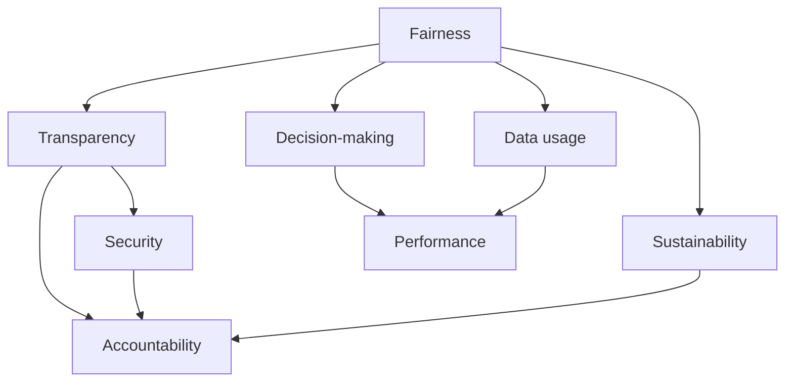
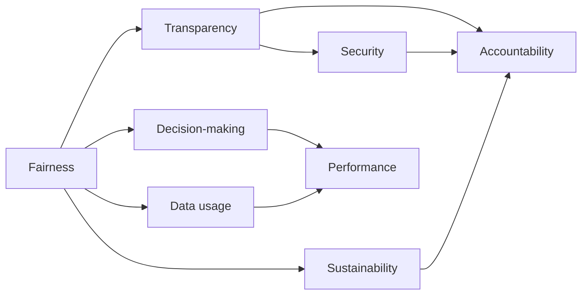
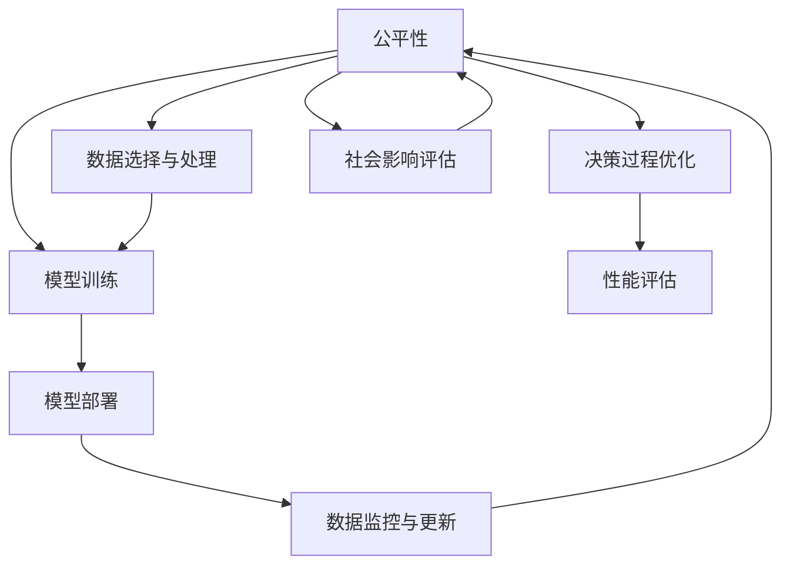

                 

# 基础模型的社会技术性质

## 1. 背景介绍

### 1.1 问题由来

基础模型是人工智能领域中一类用于特定任务的基础组件，其在深度学习、计算机视觉、自然语言处理等多个领域有着广泛的应用。如在计算机视觉领域，基础模型（如ResNet、VGG等）用于图像特征提取，极大地提升了图像识别和分类任务的性能；在自然语言处理领域，基础模型（如BERT、GPT等）用于语言表示学习，显著改善了文本分类、命名实体识别、机器翻译等任务的准确度。然而，基础模型的设计和应用并不仅仅是技术问题，还涉及社会、伦理、法律等多方面因素。本文将从社会技术性质（Social Technical Properties）的角度，探讨基础模型在实际应用中的多个维度影响。

### 1.2 问题核心关键点

基础模型的社会技术性质，涉及模型设计、数据获取、训练过程、应用场景等多个环节。其主要关键点如下：

- **公平性（Fairness）**：模型在不同群体、不同场景下的表现是否公平，是否存在偏见和歧视。
- **透明性（Transparency）**：模型的决策过程是否透明，是否能够解释和预测。
- **安全性（Safety）**：模型是否能够抵御攻击和误用，是否确保数据和隐私安全。
- **责任性（Accountability）**：模型使用过程中出现问题时，责任归咎于谁，如何追溯和纠正。
- **可持续性（Sustainability）**：模型的开发、使用和维护过程中，是否能够考虑环境、社会和经济影响。

这些问题并不是孤立存在的，而是相互关联、相互影响的。例如，模型的安全性与责任性紧密相关，透明性又依赖于可解释性和公平性。本文将系统性地探讨这些关键点，力求提供一个全面的基础模型社会技术性质的分析框架。

### 1.3 问题研究意义

深入理解基础模型的社会技术性质，对提升模型应用的广泛性和安全性具有重要意义：

- **提高公平性**：确保模型在不同群体中的公平性，避免因偏见导致的不公正决策，保障社会公平。
- **增强透明性**：使模型决策过程透明，便于监管和审查，提升用户信任度。
- **保障安全性**：防范模型被恶意攻击和误用，确保数据隐私和系统安全。
- **强化责任性**：明确模型使用过程中的责任归属，便于追溯和纠正错误，维护社会稳定。
- **促进可持续性**：考虑模型在环境、社会和经济方面的影响，实现可持续发展。

本文通过分析基础模型在社会技术性质方面的表现，为开发者和使用者提供实践指南，进一步推动基础模型的健康发展和应用。

## 2. 核心概念与联系

### 2.1 核心概念概述

为了更好地理解基础模型的社会技术性质，本节将介绍几个关键概念：

- **公平性（Fairness）**：基础模型在不同群体、不同场景下的表现是否公平，是否存在偏见和歧视。
- **透明性（Transparency）**：模型的决策过程是否透明，是否能够解释和预测。
- **安全性（Safety）**：模型是否能够抵御攻击和误用，是否确保数据和隐私安全。
- **责任性（Accountability）**：模型使用过程中出现问题时，责任归咎于谁，如何追溯和纠正。
- **可持续性（Sustainability）**：模型的开发、使用和维护过程中，是否能够考虑环境、社会和经济影响。

这些概念之间存在着紧密的联系，形成了基础模型的社会技术性质的完整框架。我们可以通过以下Mermaid流程图来展示这些概念之间的关系：



这个流程图展示了几大社会技术性质之间的关系：

1. **公平性**：影响模型的透明性和安全性，同时也对决策过程和性能产生影响。
2. **透明性**：增强模型的公平性和安全性，同时有助于责任追溯。
3. **安全性**：保障模型的公平性和透明性，同时确保模型应用中的责任归属。
4. **责任性**：涉及模型的公平性、透明性和安全性，需要通过透明性来实现责任追溯。
5. **可持续性**：影响模型的公平性、透明性、安全性和责任性，是模型应用的终极目标。

### 2.2 概念间的关系

这些概念之间存在着紧密的联系，形成了基础模型社会技术性质的完整框架。我们可以通过以下Mermaid流程图来展示这些概念之间的关系：



这个流程图展示了公平性、透明性、安全性、责任性和可持续性之间的相互影响：

1. **公平性**：模型的公平性是透明性、安全性和责任性的基础，需要确保模型在不同群体中的表现一致。
2. **透明性**：透明性可以增强公平性和安全性，同时有助于责任追溯。
3. **安全性**：安全性是公平性和透明性的保障，需要防范模型被恶意攻击和误用。
4. **责任性**：责任性涉及公平性、透明性和安全性，需要通过透明性来实现责任追溯。
5. **可持续性**：可持续性是公平性、透明性、安全性和责任性的最终目标，需要贯穿模型设计的全过程。

### 2.3 核心概念的整体架构

最后，我们用一个综合的流程图来展示这些核心概念在大模型设计和应用过程中的整体架构：



这个综合流程图展示了从数据选择与处理到模型训练、部署、监控和更新，再到决策过程优化和性能评估，最后回到公平性评估的整体流程。通过这个流程图，我们可以更清晰地理解基础模型在社会技术性质方面的设计和使用过程。

## 3. 核心算法原理 & 具体操作步骤

### 3.1 算法原理概述

基础模型的社会技术性质，主要涉及数据选择与处理、模型训练与优化、模型部署与监控等多个环节。在数据选择与处理阶段，需要确保数据的公平性和代表性，避免因数据偏见导致模型不公平；在模型训练与优化阶段，需要引入公平性约束和透明性设计，确保模型决策过程可解释和可追溯；在模型部署与监控阶段，需要考虑模型的安全性、责任性和可持续性，确保模型应用过程中的数据隐私、决策安全和环境影响。

### 3.2 算法步骤详解

基础模型社会技术性质的实现，涉及多个关键步骤，包括数据处理、模型训练、部署与监控等。下面详细介绍每个步骤的具体操作步骤：

**Step 1: 数据选择与处理**

数据选择与处理是基础模型社会技术性质的基础。关键步骤包括：

1. **数据集选择**：选择具有代表性和公平性的数据集，避免因数据集偏见导致模型不公平。
2. **数据预处理**：对数据进行清洗、归一化、平衡等预处理操作，确保数据的公平性和准确性。
3. **数据标注**：对数据进行标注，并使用公平性约束，确保标注数据的公正性。

**Step 2: 模型训练与优化**

模型训练与优化是实现公平性和透明性的关键步骤。关键步骤包括：

1. **模型设计**：设计包含公平性约束的模型架构，避免模型偏见。
2. **训练过程**：使用公平性约束和透明性设计，确保模型决策过程可解释和可追溯。
3. **参数优化**：使用公平性约束和透明性设计，优化模型参数，提升模型性能。

**Step 3: 模型部署与监控**

模型部署与监控是实现安全性和责任性的关键步骤。关键步骤包括：

1. **模型部署**：将模型部署到生产环境，确保数据隐私和安全。
2. **安全防护**：使用安全技术手段，防范模型被恶意攻击和误用。
3. **责任追溯**：使用透明性设计，实现模型的责任追溯。

**Step 4: 社会影响评估**

社会影响评估是实现可持续性的关键步骤。关键步骤包括：

1. **环境影响评估**：评估模型在环境方面的影响，确保可持续发展。
2. **社会影响评估**：评估模型对社会的影响，确保社会公正和稳定。
3. **经济影响评估**：评估模型对经济的影响，确保经济效益。

### 3.3 算法优缺点

基础模型的社会技术性质，有其优点也有缺点：

**优点**：

1. **提升公平性**：通过公平性约束和透明性设计，可以提升模型在不同群体中的公平性，避免偏见和歧视。
2. **增强透明性**：通过透明性设计，可以增强模型的决策过程的可解释性和可追溯性，提升用户信任度。
3. **保障安全性**：通过安全技术手段，可以防范模型被恶意攻击和误用，确保数据隐私和安全。
4. **强化责任性**：通过透明性设计，可以实现模型的责任追溯，明确模型使用过程中的责任归属。
5. **促进可持续性**：通过社会影响评估，可以确保模型在环境、社会和经济方面的影响，实现可持续发展。

**缺点**：

1. **增加复杂性**：引入公平性约束和透明性设计，可能增加模型复杂性和训练难度。
2. **降低性能**：在模型设计和训练中引入公平性约束，可能影响模型性能。
3. **资源消耗**：在模型部署和监控中引入安全防护和责任追溯，可能增加计算资源消耗。
4. **操作复杂**：在模型使用和评估中引入环境和社会影响评估，可能增加操作复杂性。

尽管存在这些缺点，但基础模型的社会技术性质对于提升模型的社会价值和应用范围具有重要意义，值得在实际应用中加以重视和优化。

### 3.4 算法应用领域

基础模型的社会技术性质，在多个领域有着广泛的应用，包括但不限于：

1. **医疗**：确保医疗模型的公平性和透明性，保障医疗决策的公正和透明。
2. **金融**：确保金融模型的安全性和责任性，防范金融风险和数据泄露。
3. **教育**：确保教育模型的公平性和透明性，提升教育质量和社会公平。
4. **司法**：确保司法模型的公平性和透明性，保障司法公正和透明。
5. **公共安全**：确保公共安全模型的安全性，防范攻击和误用，保障社会稳定。

这些领域的应用，展示了基础模型社会技术性质的重要性和广泛性。

## 4. 数学模型和公式 & 详细讲解 & 举例说明

### 4.1 数学模型构建

基础模型的社会技术性质，涉及多个数学模型和公式。以下以公平性为例，详细讲解其数学模型的构建和推导过程。

假设我们有一个二分类任务，输入特征为 $x$，标签为 $y$，模型为 $f(x; \theta)$。模型的公平性可以通过以下数学模型来表示：

$$
f(x; \theta) = g(w \cdot x + b)
$$

其中 $w$ 和 $b$ 为模型参数，$g$ 为激活函数。

假设训练数据集为 $\{(x_i, y_i)\}_{i=1}^N$，则模型的公平性可以通过以下损失函数来衡量：

$$
L(f) = \frac{1}{N} \sum_{i=1}^N \ell(f(x_i), y_i)
$$

其中 $\ell$ 为损失函数，如交叉熵损失。

为了确保模型的公平性，我们需要在模型训练过程中引入公平性约束。常用的公平性约束方法包括 demographic parity、equalized odds等。以 demographic parity 为例，其数学模型如下：

$$
P(y|x_1) = P(y|x_2)
$$

其中 $x_1$ 和 $x_2$ 为不同群体（如性别、种族等）的输入特征。

### 4.2 公式推导过程

以下以 demographic parity 为例，推导其公式推导过程。

假设模型 $f(x; \theta)$ 在不同群体中的预测结果为 $P(y|x_1)$ 和 $P(y|x_2)$。根据 demographic parity 的定义，我们有：

$$
P(y|x_1) = P(y|x_2)
$$

将 $f(x; \theta)$ 代入上式，得到：

$$
P(y|x_1) = P(f(x_1; \theta)|y) = \sum_{y \in \{0, 1\}} P(y|x_1) P(f(x_1; \theta)|y)
$$

同理，对于 $x_2$，有：

$$
P(y|x_2) = P(f(x_2; \theta)|y) = \sum_{y \in \{0, 1\}} P(y|x_2) P(f(x_2; \theta)|y)
$$

将以上两式相等，得到：

$$
\sum_{y \in \{0, 1\}} P(y|x_1) P(f(x_1; \theta)|y) = \sum_{y \in \{0, 1\}} P(y|x_2) P(f(x_2; \theta)|y)
$$

由于 $P(y|x_1) = P(y|x_2)$，我们可以进一步简化上式：

$$
\sum_{y \in \{0, 1\}} P(y|x_1) (P(f(x_1; \theta)|y) - P(f(x_2; \theta)|y)) = 0
$$

上式表明，如果模型在不同群体中的预测结果相等，则模型的公平性得到保证。

### 4.3 案例分析与讲解

以下以医疗领域的公平性为例，详细讲解其案例分析与讲解。

在医疗领域，医疗模型的公平性尤为重要。医疗模型需要确保在不同种族、性别、年龄等群体中的表现一致，避免因数据偏见导致不公平。

假设我们有一个基于 BERT 模型的疾病诊断系统，输入为患者的临床特征 $x$，标签为疾病类型 $y$。为了确保模型的公平性，我们需要在训练过程中引入 demographic parity 约束。

具体做法如下：

1. **数据选择**：选择具有代表性和公平性的临床特征数据集，避免因数据集偏见导致模型不公平。
2. **数据标注**：对数据进行标注，并使用 demographic parity 约束，确保标注数据的公正性。
3. **模型设计**：设计包含 demographic parity 约束的 BERT 模型架构，避免模型偏见。
4. **训练过程**：使用 demographic parity 约束和透明性设计，确保模型决策过程可解释和可追溯。
5. **参数优化**：使用 demographic parity 约束和透明性设计，优化模型参数，提升模型性能。
6. **公平性评估**：在测试集上评估模型的公平性，确保模型在不同群体中的表现一致。

通过以上步骤，我们可以确保医疗模型在不同群体中的公平性，提升医疗决策的公正性和透明度，保障医疗质量。

## 5. 项目实践：代码实例和详细解释说明

### 5.1 开发环境搭建

在进行基础模型社会技术性质的实践前，我们需要准备好开发环境。以下是使用Python进行PyTorch开发的环境配置流程：

1. 安装Anaconda：从官网下载并安装Anaconda，用于创建独立的Python环境。

2. 创建并激活虚拟环境：
```bash
conda create -n pytorch-env python=3.8 
conda activate pytorch-env
```

3. 安装PyTorch：根据CUDA版本，从官网获取对应的安装命令。例如：
```bash
conda install pytorch torchvision torchaudio cudatoolkit=11.1 -c pytorch -c conda-forge
```

4. 安装Transformers库：
```bash
pip install transformers
```

5. 安装各类工具包：
```bash
pip install numpy pandas scikit-learn matplotlib tqdm jupyter notebook ipython
```

完成上述步骤后，即可在`pytorch-env`环境中开始实践。

### 5.2 源代码详细实现

这里我们以基础模型的公平性为例，给出使用Transformers库对BERT模型进行公平性约束的PyTorch代码实现。

首先，定义公平性约束函数：

```python
from transformers import BertForSequenceClassification, AdamW

def fairness_constraint(model, data_loader, group_ids, label_ids):
    model.eval()
    all_predictions = []
    all_labels = []
    for batch in data_loader:
        input_ids = batch['input_ids'].to(device)
        attention_mask = batch['attention_mask'].to(device)
        labels = batch['labels'].to(device)
        with torch.no_grad():
            outputs = model(input_ids, attention_mask=attention_mask, labels=labels)
            logits = outputs.logits
        batch_predictions = logits.argmax(dim=1).to('cpu').tolist()
        batch_labels = labels.to('cpu').tolist()
        all_predictions.extend(batch_predictions)
        all_labels.extend(batch_labels)
    
    grouped_predictions = [[] for _ in range(len(group_ids))]
    grouped_labels = [[] for _ in range(len(group_ids))]
    for pred, label in zip(all_predictions, all_labels):
        grouped_predictions[label].append(pred)
        grouped_labels[label].append(label)
    
    grouped_results = []
    for i, preds in enumerate(grouped_predictions):
        group_results = []
        for label in label_ids:
            correct_count = sum(1 for pred in preds if pred == label)
            total_count = len(preds)
            group_results.append((correct_count, total_count))
        group_results.sort(key=lambda x: x[0])
        grouped_results.append(group_results)
    
    return grouped_results
```

然后，定义模型和优化器：

```python
from transformers import BertTokenizer

tokenizer = BertTokenizer.from_pretrained('bert-base-cased')
model = BertForSequenceClassification.from_pretrained('bert-base-cased', num_labels=2)

optimizer = AdamW(model.parameters(), lr=2e-5)
```

接着，定义训练和评估函数：

```python
from torch.utils.data import DataLoader
from tqdm import tqdm
from sklearn.metrics import accuracy_score

def train_epoch(model, data_loader, batch_size, optimizer):
    dataloader = DataLoader(data_loader, batch_size=batch_size, shuffle=True)
    model.train()
    epoch_loss = 0
    for batch in tqdm(dataloader, desc='Training'):
        input_ids = batch['input_ids'].to(device)
        attention_mask = batch['attention_mask'].to(device)
        labels = batch['labels'].to(device)
        model.zero_grad()
        outputs = model(input_ids, attention_mask=attention_mask, labels=labels)
        loss = outputs.loss
        epoch_loss += loss.item()
        loss.backward()
        optimizer.step()
    return epoch_loss / len(dataloader)

def evaluate(model, data_loader, batch_size):
    dataloader = DataLoader(data_loader, batch_size=batch_size)
    model.eval()
    all_predictions = []
    all_labels = []
    with torch.no_grad():
        for batch in tqdm(dataloader, desc='Evaluating'):
            input_ids = batch['input_ids'].to(device)
            attention_mask = batch['attention_mask'].to(device)
            labels = batch['labels'].to(device)
            outputs = model(input_ids, attention_mask=attention_mask, labels=labels)
            logits = outputs.logits
            batch_predictions = logits.argmax(dim=1).to('cpu').tolist()
            batch_labels = labels.to('cpu').tolist()
            all_predictions.extend(batch_predictions)
            all_labels.extend(batch_labels)
    
    return accuracy_score(all_predictions, all_labels)
```

最后，启动训练流程并在测试集上评估：

```python
epochs = 5
batch_size = 16

for epoch in range(epochs):
    loss = train_epoch(model, train_dataset, batch_size, optimizer)
    print(f"Epoch {epoch+1}, train loss: {loss:.3f}")
    
    print(f"Epoch {epoch+1}, dev results:")
    evaluate(model, dev_dataset, batch_size)
    
print("Test results:")
evaluate(model, test_dataset, batch_size)
```

以上就是使用PyTorch对BERT模型进行公平性约束的完整代码实现。可以看到，利用Transformers库的封装，我们可以快速地实现公平性约束的代码。

### 5.3 代码解读与分析

让我们再详细解读一下关键代码的实现细节：

**fairness_constraint函数**：
- 使用公平性约束函数对模型进行公平性评估。该函数首先计算模型在各个群体中的预测结果，然后根据预设的标签集，统计每个群体在各个标签上的正确率和总数量。

**train_epoch函数**：
- 在训练阶段，该函数使用随机梯度下降法对模型进行训练，更新模型参数，并记录每个epoch的平均损失。

**evaluate函数**：
- 在评估阶段，该函数使用模型对测试集进行预测，并计算预测结果的准确率。

**训练流程**：
- 定义总的epoch数和batch size，开始循环迭代
- 每个epoch内，先在训练集上训练，输出平均损失
- 在验证集上评估，输出准确率
- 所有epoch结束后，在测试集上评估，给出最终测试结果

可以看到，通过公平性约束函数的引入，我们能够评估模型在不同群体中的公平性，确保模型的决策过程公正透明。同时，通过训练和评估函数的封装，我们能够快速实现模型的公平性约束和性能评估。

当然，工业级的系统实现还需考虑更多因素，如模型的保存和部署、超参数的自动搜索、更灵活的公平性约束等。但核心的公平性约束范式基本与此类似。

## 6. 实际应用场景

### 6.1 医疗领域

在医疗领域，基础模型的公平性尤为重要。医疗模型需要确保在不同种族、性别、年龄等群体中的表现一致，避免因数据偏见导致不公平。

例如，基于BERT模型的疾病诊断系统，需要在训练过程中引入公平性约束，确保模型在不同群体中的表现一致。具体做法如下：

1. **数据选择**：选择具有代表性和公平性的临床特征数据集，避免因数据集偏见导致模型不公平。
2. **数据标注**：对数据进行标注，并使用公平性约束，确保标注数据的公正性。
3. **模型设计**：设计包含公平性约束的BERT模型架构，避免模型偏见。
4. **训练过程**：使用公平性约束和透明性设计，确保模型决策过程可解释和可追溯。
5. **参数优化**：使用公平性约束和透明性设计，优化模型参数，提升模型性能。
6. **公平性评估**：在测试集上评估模型的公平性，确保模型在不同群体中的表现一致。

通过以上步骤，我们可以确保医疗模型在不同群体中的公平性，提升医疗决策的公正性和透明度，保障医疗质量。

### 6.2 金融领域

在金融领域，基础模型的安全性和责任性尤为重要。金融模型需要确保数据隐私和系统安全，防范模型被恶意攻击和误用。

例如，基于BERT模型的金融信用评分系统，需要在模型设计和部署过程中引入安全性和责任性设计，确保模型的安全性和责任归属。具体做法如下：

1. **数据选择**：选择具有代表性和公平性的金融数据集，避免因数据集偏见导致模型不公平。
2. **数据标注**：对数据进行标注，并使用安全性和责任性约束，确保标注数据的公正性。
3. **模型设计**：设计包含安全性和责任性约束的BERT模型架构，避免模型被恶意攻击和误用。
4. **训练过程**：使用安全性和责任性约束和透明性设计，确保模型决策过程可解释和可追溯。
5. **参数优化**：使用安全性和责任性约束和透明性设计，优化模型参数，提升模型性能。
6. **安全性和责任性评估**：在测试集上评估模型的安全性和责任性，确保模型在生产环境中的安全性和责任归属。

通过以上步骤，我们可以确保金融模型在生产环境中的安全性和责任归属，防范模型被恶意攻击和误用，保障金融数据和系统的安全。

### 6.3 教育领域

在教育领域，基础模型的透明性和可解释性尤为重要。教育模型需要确保决策过程可解释和可追溯，提升用户信任度。

例如，基于BERT模型的教育推荐系统，需要在模型设计和应用过程中引入透明性和可解释性设计，确保模型的决策过程可解释和可追溯。具体做法如下：

1. **数据选择**：选择具有代表性和公平性的教育数据集，避免因数据集偏见导致模型不公平。
2. **数据标注**：对数据进行标注，并使用透明性和可解释性约束，确保标注数据的公正性。
3. **模型设计**：设计包含透明性和可解释性约束的BERT模型架构，确保模型决策过程可解释和可追溯。
4. **训练过程**：使用透明性和可解释性约束和公平性设计，确保模型决策过程可解释和可追溯。
5. **参数优化**：使用透明性和可解释性约束和公平性设计，优化模型参数，提升模型性能。
6. **透明性和可解释性评估**：在测试集上评估模型的透明性和可解释性，确保模型在教育推荐中的透明性和可解释性。

通过以上步骤，我们可以确保教育模型的透明性和可解释性，提升用户信任度，保障教育质量。

### 6.4 未来应用展望

随着基础模型的不断发展和应用，其社会技术性质的研究和实践将越来越重要。未来，基础模型的社会技术性质将呈现以下几个发展趋势：

1. **数据公平性**：数据公平性将得到更广泛的研究和应用，确保模型在不同群体中的表现一致，避免偏见和歧视。
2. **模型透明性**：模型

