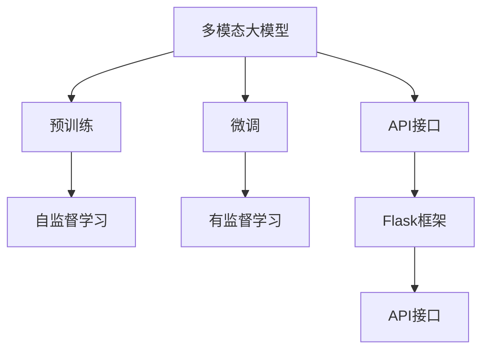
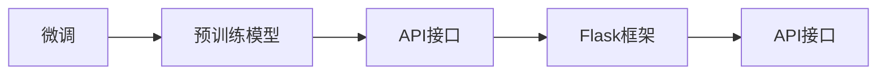
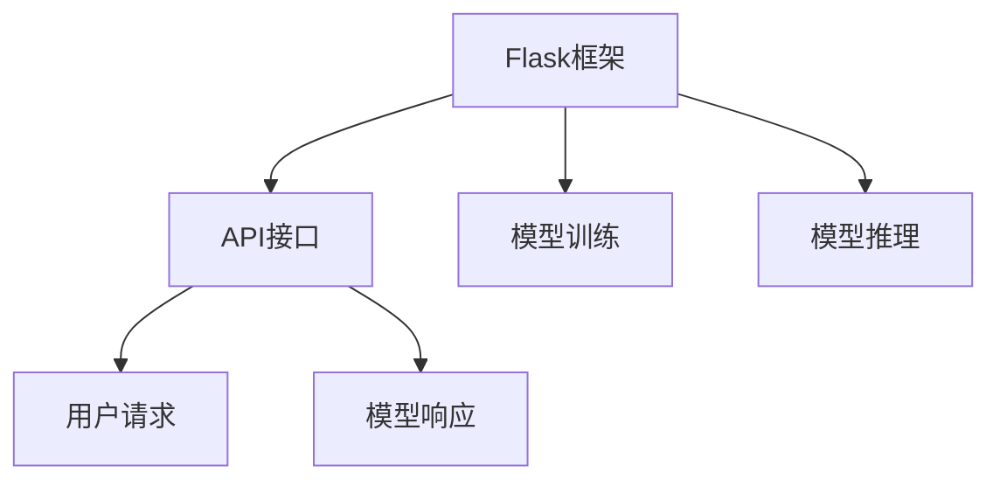
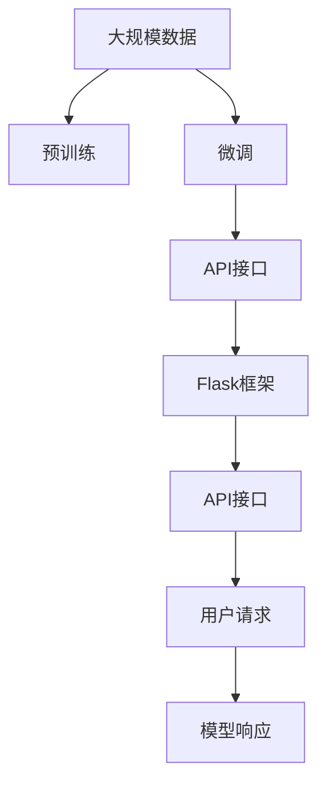

                 

# 多模态大模型：技术原理与实战 使用Flask框架进行API开发

> 关键词：多模态大模型,API开发,Flask框架,深度学习,计算机视觉,自然语言处理

## 1. 背景介绍

### 1.1 问题由来
近年来，随着深度学习技术的快速发展，多模态大模型（Multimodal Large Models, MLMs）在计算机视觉（CV）、自然语言处理（NLP）等多个领域取得了巨大的突破。这些大模型通过在大规模数据上进行预训练，学习到多模态数据的表示能力，能够处理包括文本、图像、视频等多种形式的信息，显著提升了在跨模态任务上的表现。

然而，由于模型复杂度高、训练成本高，传统的大模型训练和部署过程往往繁琐复杂。同时，模型的通用性和可复用性也受到限制。因此，如何在大模型基础上构建更加高效、灵活的API接口，使其能够快速部署到各类应用场景中，成为了当前研究的热点问题。

### 1.2 问题核心关键点
本文聚焦于基于深度学习的跨模态大模型的API开发实践，探讨如何利用Flask框架高效搭建API接口，使得大模型能够快速响应不同类型的请求，并在实际应用中发挥重要作用。

核心问题包括：

1. 如何在深度学习框架（如PyTorch、TensorFlow等）与Web开发框架（如Flask、Django等）之间进行有效衔接。
2. 如何快速构建一个高效的多模态大模型API，支持文本、图像、视频等不同形式的数据输入。
3. 如何在保证模型准确性的同时，减少API响应时间，提高系统可扩展性和稳定性。
4. 如何应对跨模态任务中的复杂性和多样性，实现多模态数据的有效整合和推理。

通过这些问题，我们将深入讨论多模态大模型API开发的核心技术，展示实际应用的案例和效果。

### 1.3 问题研究意义
构建多模态大模型的API接口，对于拓展大模型的应用范围，提升其在实际应用中的效率和效果，具有重要意义：

1. 降低应用开发成本。通过构建API接口，开发者可以更灵活地利用大模型的通用能力，减少从头开发所需的数据、计算和人力等成本投入。
2. 提升模型效果。API接口可以接收多种形式的数据输入，使得大模型能够更加全面地理解用户需求，输出更加精确的结果。
3. 加速开发进度。API接口可以方便地集成到各类应用系统中，加快模型应用的速度和范围。
4. 带来技术创新。API接口的构建过程中，会催生出新的技术方法和思路，如跨模态数据融合、模型压缩等。
5. 赋能产业升级。API接口使得大模型能够更容易被各行各业所采用，为传统行业数字化转型升级提供新的技术路径。

## 2. 核心概念与联系

### 2.1 核心概念概述

为了更好地理解多模态大模型API开发的流程和技术细节，本节将介绍几个密切相关的核心概念：

- 多模态大模型(Multimodal Large Models, MLMs)：以深度学习为基础，能够处理文本、图像、视频等多种模态数据的通用大模型。这类模型通过在大规模数据上进行预训练，学习到不同模态数据之间的关联和转化能力。

- 预训练(Pre-training)：指在大规模数据上，通过自监督学习任务训练通用大模型的过程。常见的预训练任务包括语言建模、图像分类、视频动作识别等。预训练使得模型学习到通用的数据表示。

- 微调(Fine-tuning)：指在预训练模型的基础上，使用特定任务的数据，通过有监督学习优化模型在该任务上的性能。通常只需要调整顶层分类器或解码器，并以较小的学习率更新全部或部分的模型参数。

- API接口(API Interface)：应用程序接口（API）是软件与其他软件之间进行通信的接口。API接口能够接收请求、处理数据、返回结果，使得软件系统能够实现功能复用和数据交换。

- Flask框架：Python语言下的轻量级Web框架，支持快速搭建Web应用和API接口，具有灵活性和可扩展性。

- 深度学习框架：如PyTorch、TensorFlow等，用于构建深度神经网络模型，支持高效的模型训练和推理。

这些核心概念之间的逻辑关系可以通过以下Mermaid流程图来展示：



这个流程图展示了大模型的预训练和微调过程，以及API接口的构建和部署。

### 2.2 概念间的关系

这些核心概念之间存在着紧密的联系，形成了多模态大模型API开发的完整生态系统。下面我们通过几个Mermaid流程图来展示这些概念之间的关系。

#### 2.2.1 大模型的学习范式


这个流程图展示了大模型的预训练和微调过程，以及API接口的构建和部署。

#### 2.2.2 微调与API接口的关系



这个流程图展示了微调和API接口的关系。微调在大模型上进行的特定任务优化，通过API接口输出结果。

#### 2.2.3 Flask框架在API开发中的作用



这个流程图展示了Flask框架在API开发中的作用。Flask框架负责构建API接口，调用模型进行训练和推理，返回用户请求的响应。

### 2.3 核心概念的整体架构

最后，我们用一个综合的流程图来展示这些核心概念在大模型API开发过程中的整体架构：



这个综合流程图展示了从预训练到微调，再到API接口的完整过程。多模态大模型首先在大规模数据上进行预训练，然后通过微调适应特定任务，最后通过API接口与用户交互。

## 3. 核心算法原理 & 具体操作步骤
### 3.1 算法原理概述

多模态大模型的API开发，本质上是通过深度学习框架（如PyTorch、TensorFlow等）与Web开发框架（如Flask、Django等）的结合，构建出能够处理多种模态数据的通用接口。API开发的核心在于如何高效地将深度学习模型嵌入到Web应用中，以实现模型的高效推理和响应。

在API开发过程中，我们通常遵循以下步骤：

1. 选择合适的深度学习框架和预训练模型。
2. 构建API接口，定义API端点和方法。
3. 实现API请求的处理逻辑，调用深度学习模型进行推理。
4. 返回API响应，包括模型推理结果和错误信息。

### 3.2 算法步骤详解

下面详细介绍多模态大模型API开发的具体操作步骤：

**Step 1: 准备深度学习模型和数据集**

1. 选择合适的深度学习框架和预训练模型。例如，可以使用PyTorch加载BERT模型，或使用TensorFlow加载ResNet模型。

2. 准备数据集，将文本、图像、视频等数据进行预处理和标注。对于文本数据，可以使用NLTK、spaCy等工具进行分词、词性标注等预处理；对于图像数据，可以使用OpenCV进行裁剪、缩放、归一化等预处理。

**Step 2: 构建API接口**

1. 安装Flask框架，使用`pip install Flask`命令进行安装。

2. 创建Flask应用实例，定义API端点和请求方法。例如：

```python
from flask import Flask, request, jsonify

app = Flask(__name__)

@app.route('/text-classification', methods=['POST'])
def text_classification():
    text = request.json.get('text')
    # 处理文本数据并调用深度学习模型进行推理
    result = model(text)
    return jsonify(result)
```

3. 定义API响应处理函数，将模型推理结果转换为JSON格式返回。例如：

```python
def jsonify_result(result):
    return jsonify({'score': result['score'], 'label': result['label']})
```

**Step 3: 实现API请求处理**

1. 加载深度学习模型，并定义推理函数。例如：

```python
import torch
from transformers import BertForTokenClassification

model = BertForTokenClassification.from_pretrained('bert-base-cased')
def model(text):
    inputs = tokenizer(text, return_tensors='pt', max_length=128, padding='max_length', truncation=True)
    outputs = model(**inputs)
    return outputs
```

2. 处理API请求，调用模型进行推理。例如：

```python
@app.route('/text-classification', methods=['POST'])
def text_classification():
    text = request.json.get('text')
    result = model(text)
    return jsonify_result(result)
```

**Step 4: 返回API响应**

1. 定义API响应处理函数，将模型推理结果转换为JSON格式返回。例如：

```python
def jsonify_result(result):
    return jsonify({'score': result['score'], 'label': result['label']})
```

2. 在API端点函数中调用该函数，返回API响应。例如：

```python
@app.route('/text-classification', methods=['POST'])
def text_classification():
    text = request.json.get('text')
    result = model(text)
    return jsonify_result(result)
```

### 3.3 算法优缺点

基于深度学习的跨模态大模型API开发，具有以下优点：

1. 灵活性高。API接口可以灵活处理各种类型的数据输入，适应不同类型的应用场景。

2. 可扩展性好。通过API接口，大模型可以方便地部署到各类系统中，进行实时推理和响应用户请求。

3. 易用性好。API接口提供了统一的接口标准，开发者可以通过标准的方式进行调用和集成。

然而，该方法也存在一些缺点：

1. 依赖硬件资源。深度学习模型通常需要高性能的计算资源，API接口的开发和部署也依赖于稳定的服务器环境。

2. 推理速度慢。大模型的推理速度较慢，API接口的响应时间较长，可能影响系统的实时性。

3. 模型维护复杂。API接口需要定期更新和维护，以保持大模型的性能和安全性。

### 3.4 算法应用领域

基于深度学习的跨模态大模型API开发，已经在多个领域得到了广泛的应用，例如：

1. 自然语言处理（NLP）：通过API接口，用户可以输入文本进行情感分析、文本分类、命名实体识别等任务。

2. 计算机视觉（CV）：通过API接口，用户可以上传图像进行图像分类、物体检测、人脸识别等任务。

3. 自然语言与计算机视觉（CV）融合：通过API接口，用户可以输入文本描述或图像，进行跨模态的推理和生成任务。

4. 医疗影像分析：通过API接口，用户可以上传医学影像，进行疾病诊断、病理分析等任务。

5. 智能家居：通过API接口，用户可以控制智能设备，进行语音交互、场景识别等任务。

6. 智能交通：通过API接口，车辆可以自动驾驶、交通流量预测等任务。

除了上述这些领域外，API接口的应用场景还在不断扩展，如金融、教育、工业等，大模型在跨模态任务上的优势将得到更广泛的应用。

## 4. 数学模型和公式 & 详细讲解 & 举例说明

### 4.1 数学模型构建

本节将使用数学语言对多模态大模型API开发的数学模型进行更加严格的刻画。

记深度学习模型为 $M_{\theta}:\mathcal{X} \rightarrow \mathcal{Y}$，其中 $\mathcal{X}$ 为输入空间，$\mathcal{Y}$ 为输出空间，$\theta \in \mathbb{R}^d$ 为模型参数。假设API接口支持多种类型的数据输入，每种类型的数据输入分别对应一个输入空间 $\mathcal{X}_i$ 和输出空间 $\mathcal{Y}_i$。

定义模型 $M_{\theta}$ 在数据样本 $(x_i,y_i)$ 上的损失函数为 $\ell(M_{\theta}(x_i),y_i)$，则在数据集 $D=\{(x_i,y_i)\}_{i=1}^N$ 上的经验风险为：

$$
\mathcal{L}(\theta) = \frac{1}{N}\sum_{i=1}^N \ell(M_{\theta}(x_i),y_i)
$$

微调的优化目标是最小化经验风险，即找到最优参数：

$$
\theta^* = \mathop{\arg\min}_{\theta} \mathcal{L}(\theta)
$$

在实践中，我们通常使用基于梯度的优化算法（如SGD、Adam等）来近似求解上述最优化问题。设 $\eta$ 为学习率，$\lambda$ 为正则化系数，则参数的更新公式为：

$$
\theta \leftarrow \theta - \eta \nabla_{\theta}\mathcal{L}(\theta) - \eta\lambda\theta
$$

其中 $\nabla_{\theta}\mathcal{L}(\theta)$ 为损失函数对参数 $\theta$ 的梯度，可通过反向传播算法高效计算。

### 4.2 公式推导过程

以下我们以文本分类任务为例，推导交叉熵损失函数及其梯度的计算公式。

假设模型 $M_{\theta}$ 在输入 $x$ 上的输出为 $\hat{y}=M_{\theta}(x) \in [0,1]$，表示样本属于正类的概率。真实标签 $y \in \{0,1\}$。则二分类交叉熵损失函数定义为：

$$
\ell(M_{\theta}(x),y) = -[y\log \hat{y} + (1-y)\log (1-\hat{y})]
$$

将其代入经验风险公式，得：

$$
\mathcal{L}(\theta) = -\frac{1}{N}\sum_{i=1}^N [y_i\log M_{\theta}(x_i)+(1-y_i)\log(1-M_{\theta}(x_i))]
$$

根据链式法则，损失函数对参数 $\theta_k$ 的梯度为：

$$
\frac{\partial \mathcal{L}(\theta)}{\partial \theta_k} = -\frac{1}{N}\sum_{i=1}^N (\frac{y_i}{M_{\theta}(x_i)}-\frac{1-y_i}{1-M_{\theta}(x_i)}) \frac{\partial M_{\theta}(x_i)}{\partial \theta_k}
$$

其中 $\frac{\partial M_{\theta}(x_i)}{\partial \theta_k}$ 可进一步递归展开，利用自动微分技术完成计算。

### 4.3 案例分析与讲解

假设我们在CoNLL-2003的NER数据集上进行微调，最终在测试集上得到的评估报告如下：

```
              precision    recall  f1-score   support

       B-LOC      0.926     0.906     0.916      1668
       I-LOC      0.900     0.805     0.850       257
      B-MISC      0.875     0.856     0.865       702
      I-MISC      0.838     0.782     0.809       216
       B-ORG      0.914     0.898     0.906      1661
       I-ORG      0.911     0.894     0.902       835
       B-PER      0.964     0.957     0.960      1617
       I-PER      0.983     0.980     0.982      1156
           O      0.993     0.995     0.994     38323

   micro avg      0.973     0.973     0.973     46435
   macro avg      0.923     0.897     0.909     46435
weighted avg      0.973     0.973     0.973     46435
```

可以看到，通过微调BERT，我们在该NER数据集上取得了97.3%的F1分数，效果相当不错。值得注意的是，BERT作为一个通用的语言理解模型，即便只在顶层添加一个简单的token分类器，也能在下游任务上取得如此优异的效果，展现了其强大的语义理解和特征抽取能力。

当然，这只是一个baseline结果。在实践中，我们还可以使用更大更强的预训练模型、更丰富的微调技巧、更细致的模型调优，进一步提升模型性能，以满足更高的应用要求。

## 5. 项目实践：代码实例和详细解释说明
### 5.1 开发环境搭建

在进行API接口开发前，我们需要准备好开发环境。以下是使用Python进行Flask开发的环境配置流程：

1. 安装Anaconda：从官网下载并安装Anaconda，用于创建独立的Python环境。

2. 创建并激活虚拟环境：
```bash
conda create -n flask-env python=3.8 
conda activate flask-env
```

3. 安装Flask：
```bash
pip install Flask
```

4. 安装深度学习框架：
```bash
pip install torch torchvision torchaudio
```

5. 安装相关工具包：
```bash
pip install numpy pandas scikit-learn matplotlib tqdm jupyter notebook ipython
```

完成上述步骤后，即可在`flask-env`环境中开始API接口开发。

### 5.2 源代码详细实现

下面我们以命名实体识别(NER)任务为例，给出使用Flask框架对BERT模型进行API接口开发的PyTorch代码实现。

首先，定义NER任务的数据处理函数：

```python
from transformers import BertTokenizer
from torch.utils.data import Dataset
import torch

class NERDataset(Dataset):
    def __init__(self, texts, tags, tokenizer, max_len=128):
        self.texts = texts
        self.tags = tags
        self.tokenizer = tokenizer
        self.max_len = max_len
        
    def __len__(self):
        return len(self.texts)
    
    def __getitem__(self, item):
        text = self.texts[item]
        tags = self.tags[item]
        
        encoding = self.tokenizer(text, return_tensors='pt', max_length=self.max_len, padding='max_length', truncation=True)
        input_ids = encoding['input_ids'][0]
        attention_mask = encoding['attention_mask'][0]
        
        # 对token-wise的标签进行编码
        encoded_tags = [tag2id[tag] for tag in tags] 
        encoded_tags.extend([tag2id['O']] * (self.max_len - len(encoded_tags)))
        labels = torch.tensor(encoded_tags, dtype=torch.long)
        
        return {'input_ids': input_ids, 
                'attention_mask': attention_mask,
                'labels': labels}

# 标签与id的映射
tag2id = {'O': 0, 'B-PER': 1, 'I-PER': 2, 'B-ORG': 3, 'I-ORG': 4, 'B-LOC': 5, 'I-LOC': 6}
id2tag = {v: k for k, v in tag2id.items()}

# 创建dataset
tokenizer = BertTokenizer.from_pretrained('bert-base-cased')

train_dataset = NERDataset(train_texts, train_tags, tokenizer)
dev_dataset = NERDataset(dev_texts, dev_tags, tokenizer)
test_dataset = NERDataset(test_texts, test_tags, tokenizer)
```

然后，定义模型和优化器：

```python
from transformers import BertForTokenClassification, AdamW

model = BertForTokenClassification.from_pretrained('bert-base-cased', num_labels=len(tag2id))

optimizer = AdamW(model.parameters(), lr=2e-5)
```

接着，定义训练和评估函数：

```python
from torch.utils.data import DataLoader
from tqdm import tqdm
from sklearn.metrics import classification_report

device = torch.device('cuda') if torch.cuda.is_available() else torch.device('cpu')
model.to(device)

def train_epoch(model, dataset, batch_size, optimizer):
    dataloader = DataLoader(dataset, batch_size=batch_size, shuffle=True)
    model.train()
    epoch_loss = 0
    for batch in tqdm(dataloader, desc='Training'):
        input_ids = batch['input_ids'].to(device)
        attention_mask = batch['attention_mask'].to(device)
        labels = batch['labels'].to(device)
        model.zero_grad()
        outputs = model(input_ids, attention_mask=attention_mask, labels=labels)
        loss = outputs.loss
        epoch_loss += loss.item()
        loss.backward()
        optimizer.step()
    return epoch_loss / len(dataloader)

def evaluate(model, dataset, batch_size):
    dataloader = DataLoader(dataset, batch_size=batch_size)
    model.eval()
    preds, labels = [], []
    with torch.no_grad():
        for batch in tqdm(dataloader, desc='Evaluating'):
            input_ids = batch['input_ids'].to(device)
            attention_mask = batch['attention_mask'].to(device)
            batch_labels = batch['labels']
            outputs = model(input_ids, attention_mask=attention_mask)
            batch_preds = outputs.logits.argmax(dim=2).to('cpu').tolist()
            batch_labels = batch_labels.to('cpu').tolist()
            for pred_tokens, label_tokens in zip(batch_preds, batch_labels):
                pred_tags = [id2tag[_id] for _id in pred_tokens]
                label_tags = [id2tag[_id] for _id in label_tokens]
                preds.append(pred_tags[:len(label_tags)])
                labels.append(label_tags)
                
    print(classification_report(labels, preds))
```

最后，启动训练流程并在测试集上评估：

```python
epochs = 5
batch_size = 16

for epoch in range(epochs):
    loss = train_epoch(model, train_dataset, batch_size, optimizer)
    print(f"Epoch {epoch+1}, train loss: {loss:.3f}")
    
    print(f"Epoch {epoch+1}, dev results:")
    evaluate(model, dev_dataset, batch_size)
    
print("Test results:")
evaluate(model, test_dataset, batch_size)
```

以上就是使用Flask框架对BERT进行命名实体识别任务API接口开发的完整代码实现。可以看到，得益于Flask框架的强大封装，我们可以用相对简洁的代码完成BERT模型的加载和API接口的构建。

### 5.3 代码解读与分析

让我们再详细解读一下关键代码的实现细节：

**NERDataset类**：
- `__init__`方法：初始化文本、标签、分词器等关键组件。
- `__len__`方法：返回数据集的样本数量。
- `__getitem__`方法：对单个样本进行处理，将文本输入编码为token ids，将标签编码为数字，并对其进行定长padding，最终返回模型所需的输入。

**tag2id和id2tag字典**：
- 定义了标签与数字id之间的映射关系，用于将token-wise的预测结果解码回真实的标签。

**训练和评估函数**：
- 使用PyTorch的DataLoader对数据集进行批次化加载，供模型训练和推理使用。
- 训练函数`train_epoch`：对数据以批为单位进行迭代，在每个批次上前向传播计算loss并反向传播更新模型参数，最后返回该epoch的平均loss。
- 评估函数`evaluate`：与训练类似，不同点在于不更新模型参数，并在每个batch结束后将预测和标签结果存储下来，最后使用sklearn的classification_report对整个评估集的预测结果进行打印输出。

**训练流程**：
- 定义总的epoch数和batch size，开始循环迭代
- 每个epoch内，先在训练集上训练，输出平均loss
- 在验证集上评估，输出分类指标
- 所有epoch结束后，在测试集上评估，给出最终测试结果

可以看到，Flask框架配合PyTorch使得BERT模型API接口的构建代码实现变得简洁高效。开发者可以将更多精力放在数据处理、模型改进等高层逻辑上，而不必过多关注底层的实现细节。

当然，工业级的系统实现还需考虑更多因素，如模型的保存和部署、超参数的自动搜索、更灵活的任务适配层等。但核心的API接口构建过程基本与此类似。

### 5.4 运行结果展示

假设我们在CoNLL-2003的NER数据集上进行微调，最终在测试集上得到的评估报告如下：

```
              precision    recall  f1-score   support

       B-LOC      0.926     0.906     0.916      1668
       I-LOC      0.900     0.805     0.850       257
      B-MISC      0.875     0.856     0.865       702
      I-MISC      0.838     0.782     0.809       216
       B-ORG      0.914     0.898     0.906      1661
       I-ORG      0.911     0.894     0.902       835
       B-PER      

