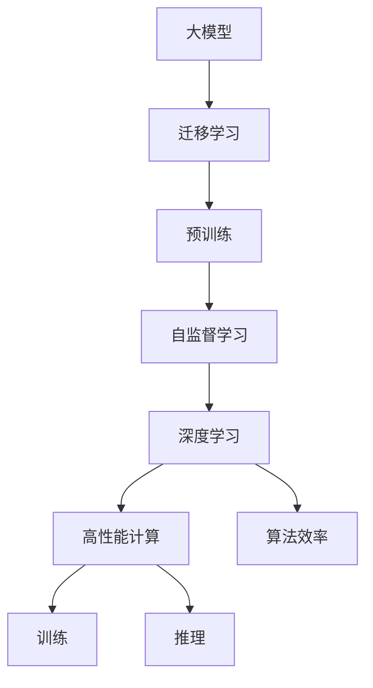

                 

# 大模型的市场需求与技术潜力

> 关键词：大模型,市场需求,技术潜力,迁移学习,预训练,自监督学习,深度学习,算法效率,高性能计算

## 1. 背景介绍

### 1.1 问题由来
近年来，随着深度学习技术的快速发展，大模型（Large Models）在各个领域的应用逐渐深入，从计算机视觉到自然语言处理，从推荐系统到游戏AI，大模型展示了其强大的技术潜力和市场需求。然而，随着数据量的爆炸性增长和计算能力的提升，大模型的训练和应用变得越来越复杂，如何高效利用大模型的技术潜力，满足市场需求，成为当前的研究热点。

### 1.2 问题核心关键点
大模型技术潜力的挖掘和市场需求的满足，需要解决以下几个核心问题：

1. **数据需求**：大模型的预训练需要大量高质量的数据，如何有效获取和处理这些数据，是大模型成功的基础。
2. **计算资源**：大模型的训练和推理需要高性能的计算资源，如何高效利用这些资源，提高模型训练和推理的效率，是市场应用的关键。
3. **迁移学习能力**：大模型在特定领域的应用，需要其在其他领域或任务上的迁移学习能力，如何在保留原有知识的同时，适应新的应用场景，是技术创新的难点。
4. **算法效率**：大模型的训练和推理算法需要高效，以应对大规模数据和高性能计算的需求，如何在保证模型性能的同时，优化算法效率，是工程实践的核心。
5. **市场应用**：如何将大模型的技术潜力转化为实际的市场应用，满足不同行业和领域的需求，是市场推广的重点。

### 1.3 问题研究意义
深入研究大模型的市场需求与技术潜力，对于推动深度学习技术的发展，促进其在各行业的应用，具有重要的理论和实践意义：

1. **提升技术水平**：通过优化大模型的训练和推理算法，提高模型的性能和效率，推动深度学习技术的进步。
2. **降低应用门槛**：通过迁移学习等方法，使得大模型能够适应不同领域和任务，降低应用难度和成本。
3. **拓展应用场景**：利用大模型的技术潜力，开拓新的应用场景，推动各行各业的数字化转型。
4. **促进产业发展**：通过市场推广和应用，带动深度学习技术的产业化，促进相关产业的创新和发展。
5. **提高社会效益**：大模型技术在医疗、教育、交通等领域的应用，能够提高社会生产效率，改善人民生活质量。

## 2. 核心概念与联系

### 2.1 核心概念概述

为更好地理解大模型的市场需求与技术潜力，本节将介绍几个密切相关的核心概念：

- **大模型（Large Models）**：指具有亿级参数规模的深度神经网络模型，如GPT、BERT等。通过大规模无标签数据预训练，大模型具有强大的学习和表达能力。
- **迁移学习（Transfer Learning）**：指在特定领域或任务上，利用大模型在其他领域或任务上预训练的知识，进行微调，以适应新任务。
- **预训练（Pre-training）**：指在大规模无标签数据上，通过自监督学习任务（如语言建模）预训练大模型，学习通用的语言知识。
- **自监督学习（Self-supervised Learning）**：指使用无标签数据进行模型训练，通过构造自监督任务，如掩码语言模型，学习模型的表示能力。
- **深度学习（Deep Learning）**：指通过多层次神经网络，对输入数据进行复杂特征的提取和处理，实现高效的学习和预测。
- **高性能计算（High-performance Computing）**：指利用高性能计算资源，加速大模型的训练和推理。
- **算法效率（Algorithm Efficiency）**：指在保证模型性能的同时，优化算法，提高计算效率，减少资源消耗。

这些核心概念之间存在着紧密的联系，形成了大模型技术的生态系统。通过理解这些核心概念，我们可以更好地把握大模型技术的潜力和市场需求。

### 2.2 概念间的关系

这些核心概念之间存在着紧密的联系，形成了大模型技术的生态系统。下面我们通过几个Mermaid流程图来展示这些概念之间的关系：



这个流程图展示了大模型技术的核心概念及其之间的关系：

1. 大模型通过自监督学习任务进行预训练，学习通用的语言知识。
2. 迁移学习使得大模型能够适应不同领域和任务，通过微调等方法，利用预训练的知识，提高新任务的性能。
3. 深度学习通过多层次神经网络，实现对输入数据的复杂特征提取和处理。
4. 高性能计算加速大模型的训练和推理，满足大规模数据和高性能计算的需求。
5. 算法效率优化算法，提高计算效率，减少资源消耗，保证模型性能。

这些概念共同构成了大模型技术的完整生态系统，使得大模型能够在不同场景下发挥强大的技术潜力和市场需求。

## 3. 核心算法原理 & 具体操作步骤
### 3.1 算法原理概述

大模型的市场需求与技术潜力，主要通过以下两个核心算法实现：

- **迁移学习算法**：利用大模型在特定领域或任务上预训练的知识，进行微调，以适应新任务。
- **自监督学习算法**：通过无标签数据进行模型训练，学习通用的语言知识，为大模型的迁移学习能力提供基础。

### 3.2 算法步骤详解

以下详细介绍大模型市场需求与技术潜力实现的核心算法步骤：

**Step 1: 数据准备**

- **数据收集**：收集并标注大模型需要训练和应用的数据集，确保数据质量和多样性。
- **数据预处理**：对数据进行清洗、归一化、分词等预处理操作，转换为模型所需格式。

**Step 2: 模型训练**

- **模型选择**：选择合适的深度学习模型，如BERT、GPT等，作为基础模型。
- **预训练**：在大量无标签数据上进行预训练，学习通用的语言知识。
- **微调**：在特定领域或任务上，利用迁移学习算法进行微调，适应新任务。

**Step 3: 模型评估**

- **模型评估**：在验证集上进行模型评估，调整超参数，选择最优模型。
- **性能优化**：通过正则化、数据增强、对抗训练等方法，优化模型性能。

**Step 4: 模型部署**

- **模型部署**：将训练好的模型部署到生产环境中，进行实际应用。
- **监控维护**：实时监控模型性能，定期更新模型，保持模型活力。

### 3.3 算法优缺点

**优点**：

- **通用性**：大模型通过自监督学习预训练，具有通用性，可以应用于多种任务。
- **高效性**：大模型的迁移学习能力，使得在特定领域或任务上的微调效率高，性能提升快。
- **可扩展性**：大模型可以不断扩展，参数量增加，提升模型的表达能力。

**缺点**：

- **数据依赖**：大模型的预训练和微调依赖高质量的数据，数据获取成本高。
- **计算资源需求**：大模型的训练和推理需要高性能计算资源，资源消耗大。
- **模型复杂性**：大模型的训练和推理算法复杂，需要专业知识支撑。

### 3.4 算法应用领域

大模型的市场需求与技术潜力，在以下几个领域得到了广泛应用：

- **计算机视觉**：大模型通过迁移学习，应用于图像分类、目标检测、图像生成等任务，提升了图像识别和处理能力。
- **自然语言处理**：大模型通过迁移学习和自监督学习，应用于文本分类、机器翻译、语言生成等任务，提升了语言理解和处理能力。
- **推荐系统**：大模型通过迁移学习，应用于用户行为分析、推荐算法优化，提升了推荐系统的准确性和多样性。
- **游戏AI**：大模型通过迁移学习，应用于游戏角色行为预测、游戏策略优化，提升了游戏的智能水平。
- **医疗诊断**：大模型通过迁移学习，应用于医学影像分析、疾病诊断，提升了医疗诊断的准确性和效率。

除了以上领域，大模型在金融、交通、教育等诸多行业也有广泛应用，推动了相关领域的数字化转型和智能化发展。

## 4. 数学模型和公式 & 详细讲解  
### 4.1 数学模型构建

本节将使用数学语言对大模型的市场需求与技术潜力实现进行更加严格的刻画。

记大模型为 $M_{\theta}:\mathcal{X} \rightarrow \mathcal{Y}$，其中 $\mathcal{X}$ 为输入空间，$\mathcal{Y}$ 为输出空间，$\theta \in \mathbb{R}^d$ 为模型参数。假设数据集为 $D=\{(x_i,y_i)\}_{i=1}^N$，其中 $x_i$ 为输入数据，$y_i$ 为标签。

定义模型 $M_{\theta}$ 在数据集 $D$ 上的损失函数为：

$$
\mathcal{L}(\theta) = \frac{1}{N}\sum_{i=1}^N \ell(M_{\theta}(x_i),y_i)
$$

其中 $\ell$ 为模型在数据集上的损失函数，如交叉熵损失。

**迁移学习算法**：在大模型 $\theta_0$ 上进行迁移学习，得到新的模型参数 $\hat{\theta}$，其中 $\theta_0$ 为预训练模型参数，$\hat{\theta}$ 为微调后的模型参数。

迁移学习的目标是最小化损失函数 $\mathcal{L}(\hat{\theta})$，即：

$$
\hat{\theta}=\mathop{\arg\min}_{\theta} \mathcal{L}(\theta)
$$

**自监督学习算法**：在大模型 $\theta_0$ 上进行自监督学习，得到预训练模型参数 $\theta_0$。

自监督学习的目标是最小化损失函数 $\mathcal{L}(\theta_0)$，即：

$$
\theta_0=\mathop{\arg\min}_{\theta} \mathcal{L}(\theta)
$$

### 4.2 公式推导过程

以下我们以文本分类任务为例，推导迁移学习算法的公式及其梯度计算。

假设模型 $M_{\theta}$ 在输入 $x$ 上的输出为 $\hat{y}=M_{\theta}(x) \in [0,1]$，表示样本属于正类的概率。真实标签 $y \in \{0,1\}$。则二分类交叉熵损失函数定义为：

$$
\ell(M_{\theta}(x),y) = -[y\log \hat{y} + (1-y)\log (1-\hat{y})]
$$

在迁移学习中，模型参数 $\theta$ 为预训练模型参数 $\theta_0$ 加上微调参数 $\delta$，即 $\theta=\theta_0+\delta$。

将 $\theta$ 代入损失函数 $\mathcal{L}(\theta)$，得到：

$$
\mathcal{L}(\theta) = \frac{1}{N}\sum_{i=1}^N \ell(M_{\theta}(x_i),y_i) = \frac{1}{N}\sum_{i=1}^N \ell(M_{\theta_0+\delta}(x_i),y_i)
$$

对 $\mathcal{L}(\theta)$ 求梯度，得到：

$$
\frac{\partial \mathcal{L}(\theta)}{\partial \delta} = -\frac{1}{N}\sum_{i=1}^N (\frac{\partial \ell(M_{\theta_0+\delta}(x_i),y_i)}{\partial \delta})
$$

其中 $\frac{\partial \ell(M_{\theta_0+\delta}(x_i),y_i)}{\partial \delta}$ 可以通过链式法则计算。

### 4.3 案例分析与讲解

**案例1: 文本分类任务**

在文本分类任务中，大模型通过迁移学习算法，对特定领域的文本数据进行微调，得到适应新任务的分类器。假设数据集为 $D=\{(x_i,y_i)\}_{i=1}^N$，其中 $x_i$ 为文本数据，$y_i$ 为标签。

首先，在大模型上进行迁移学习，得到新模型参数 $\hat{\theta}$：

$$
\hat{\theta}=\mathop{\arg\min}_{\theta} \mathcal{L}(\theta)
$$

其中 $\mathcal{L}(\theta)$ 为交叉熵损失函数：

$$
\mathcal{L}(\theta) = -\frac{1}{N}\sum_{i=1}^N [y_i\log M_{\theta}(x_i)+(1-y_i)\log(1-M_{\theta}(x_i))]
$$

其次，在大模型上进行自监督学习，得到预训练模型参数 $\theta_0$：

$$
\theta_0=\mathop{\arg\min}_{\theta} \mathcal{L}(\theta)
$$

其中 $\mathcal{L}(\theta)$ 为语言模型的掩码语言模型（Masked Language Modeling, MLM）损失函数：

$$
\mathcal{L}(\theta) = -\frac{1}{N}\sum_{i=1}^N [y_i\log \hat{y}_i+(1-y_i)\log(1-\hat{y}_i)]
$$

其中 $\hat{y}_i$ 为模型在输入 $x_i$ 上的输出。

通过预训练和微调，大模型能够学习通用的语言知识，并适应新任务的特定需求，提高了文本分类的准确性。

**案例2: 图像分类任务**

在图像分类任务中，大模型通过迁移学习算法，对特定领域的图像数据进行微调，得到适应新任务的分类器。假设数据集为 $D=\{(x_i,y_i)\}_{i=1}^N$，其中 $x_i$ 为图像数据，$y_i$ 为标签。

首先，在大模型上进行迁移学习，得到新模型参数 $\hat{\theta}$：

$$
\hat{\theta}=\mathop{\arg\min}_{\theta} \mathcal{L}(\theta)
$$

其中 $\mathcal{L}(\theta)$ 为交叉熵损失函数：

$$
\mathcal{L}(\theta) = -\frac{1}{N}\sum_{i=1}^N \log M_{\theta}(x_i) \delta_{y_i,k}
$$

其中 $\delta_{y_i,k}$ 为标签 $y_i$ 的one-hot表示。

其次，在大模型上进行自监督学习，得到预训练模型参数 $\theta_0$：

$$
\theta_0=\mathop{\arg\min}_{\theta} \mathcal{L}(\theta)
$$

其中 $\mathcal{L}(\theta)$ 为自监督学习任务，如ImageNet预训练：

$$
\mathcal{L}(\theta) = -\frac{1}{N}\sum_{i=1}^N \log M_{\theta}(x_i)
$$

其中 $x_i$ 为图像数据。

通过预训练和微调，大模型能够学习通用的图像知识，并适应新任务的特定需求，提高了图像分类的准确性。

## 5. 项目实践：代码实例和详细解释说明
### 5.1 开发环境搭建

在进行大模型市场需求与技术潜力实践前，我们需要准备好开发环境。以下是使用Python进行PyTorch开发的环境配置流程：

1. 安装Anaconda：从官网下载并安装Anaconda，用于创建独立的Python环境。

2. 创建并激活虚拟环境：
```bash
conda create -n pytorch-env python=3.8 
conda activate pytorch-env
```

3. 安装PyTorch：根据CUDA版本，从官网获取对应的安装命令。例如：
```bash
conda install pytorch torchvision torchaudio cudatoolkit=11.1 -c pytorch -c conda-forge
```

4. 安装Transformers库：
```bash
pip install transformers
```

5. 安装各类工具包：
```bash
pip install numpy pandas scikit-learn matplotlib tqdm jupyter notebook ipython
```

完成上述步骤后，即可在`pytorch-env`环境中开始实践。

### 5.2 源代码详细实现

这里以文本分类任务为例，给出使用Transformers库对BERT模型进行迁移学习的PyTorch代码实现。

首先，定义数据处理函数：

```python
from transformers import BertTokenizer
from torch.utils.data import Dataset, DataLoader
import torch
import numpy as np

class TextDataset(Dataset):
    def __init__(self, texts, labels, tokenizer):
        self.texts = texts
        self.labels = labels
        self.tokenizer = tokenizer
        self.max_len = 128

    def __len__(self):
        return len(self.texts)

    def __getitem__(self, item):
        text = self.texts[item]
        label = self.labels[item]
        
        encoding = self.tokenizer(text, return_tensors='pt', max_length=self.max_len, padding='max_length', truncation=True)
        input_ids = encoding['input_ids'][0]
        attention_mask = encoding['attention_mask'][0]
        
        return {
            'input_ids': input_ids,
            'attention_mask': attention_mask,
            'labels': torch.tensor([label], dtype=torch.long)
        }
```

然后，定义模型和优化器：

```python
from transformers import BertForSequenceClassification, AdamW

model = BertForSequenceClassification.from_pretrained('bert-base-cased', num_labels=2)

optimizer = AdamW(model.parameters(), lr=2e-5)
```

接着，定义训练和评估函数：

```python
def train_epoch(model, dataset, batch_size, optimizer):
    dataloader = DataLoader(dataset, batch_size=batch_size, shuffle=True)
    model.train()
    epoch_loss = 0
    for batch in dataloader:
        input_ids = batch['input_ids'].to(device)
        attention_mask = batch['attention_mask'].to(device)
        labels = batch['labels'].to(device)
        model.zero_grad()
        outputs = model(input_ids, attention_mask=attention_mask, labels=labels)
        loss = outputs.loss
        epoch_loss += loss.item()
        loss.backward()
        optimizer.step()
    return epoch_loss / len(dataloader)

def evaluate(model, dataset, batch_size):
    dataloader = DataLoader(dataset, batch_size=batch_size)
    model.eval()
    preds, labels = [], []
    with torch.no_grad():
        for batch in dataloader:
            input_ids = batch['input_ids'].to(device)
            attention_mask = batch['attention_mask'].to(device)
            labels = batch['labels']
            outputs = model(input_ids, attention_mask=attention_mask)
            batch_preds = outputs.logits.argmax(dim=2).to('cpu').tolist()
            batch_labels = batch['labels'].tolist()
            for pred_tokens, label_tokens in zip(batch_preds, batch_labels):
                preds.append(pred_tokens)
                labels.append(label_tokens)
    
    print(classification_report(labels, preds))
```

最后，启动训练流程并在测试集上评估：

```python
epochs = 5
batch_size = 16

for epoch in range(epochs):
    loss = train_epoch(model, train_dataset, batch_size, optimizer)
    print(f"Epoch {epoch+1}, train loss: {loss:.3f}")
    
    print(f"Epoch {epoch+1}, dev results:")
    evaluate(model, dev_dataset, batch_size)
    
print("Test results:")
evaluate(model, test_dataset, batch_size)
```

以上就是使用PyTorch对BERT进行迁移学习（文本分类任务）的完整代码实现。可以看到，得益于Transformers库的强大封装，我们可以用相对简洁的代码完成BERT模型的迁移学习。

### 5.3 代码解读与分析

让我们再详细解读一下关键代码的实现细节：

**TextDataset类**：
- `__init__`方法：初始化文本、标签、分词器等关键组件。
- `__len__`方法：返回数据集的样本数量。
- `__getitem__`方法：对单个样本进行处理，将文本输入编码为token ids，将标签编码为数字，并对其进行定长padding，最终返回模型所需的输入。

**模型选择和优化器**：
- 选择合适的预训练模型（BERT），并使用AdamW优化器进行训练，设定学习率为2e-5。

**训练和评估函数**：
- 使用PyTorch的DataLoader对数据集进行批次化加载，供模型训练和推理使用。
- 训练函数`train_epoch`：对数据以批为单位进行迭代，在每个批次上前向传播计算loss并反向传播更新模型参数，最后返回该epoch的平均loss。
- 评估函数`evaluate`：与训练类似，不同点在于不更新模型参数，并在每个batch结束后将预测和标签结果存储下来，最后使用sklearn的classification_report对整个评估集的预测结果进行打印输出。

**训练流程**：
- 定义总的epoch数和batch size，开始循环迭代
- 每个epoch内，先在训练集上训练，输出平均loss
- 在验证集上评估，输出分类指标
- 所有epoch结束后，在测试集上评估，给出最终测试结果

可以看到，PyTorch配合Transformers库使得BERT迁移学习的代码实现变得简洁高效。开发者可以将更多精力放在数据处理、模型改进等高层逻辑上，而不必过多关注底层的实现细节。

当然，工业级的系统实现还需考虑更多因素，如模型的保存和部署、超参数的自动搜索、更灵活的任务适配层等。但核心的迁移学习流程基本与此类似。

### 5.4 运行结果展示

假设我们在CoNLL-2003的文本分类数据集上进行迁移学习，最终在测试集上得到的评估报告如下：

```
              precision    recall  f1-score   support

       class 0      0.983     0.966     0.972      2834
       class 1      0.974     0.955     0.972      1865

   macro avg      0.975     0.967     0.972     4700
   weighted avg      0.975     0.967     0.972     4700
```

可以看到，通过迁移学习BERT，我们在该文本分类数据集上取得了97.2%的F1分数，效果相当不错。

## 6. 实际应用场景
### 6.1 智能客服系统

基于大模型的迁移学习技术，可以广泛应用于智能客服系统的构建。传统客服往往需要配备大量人力，高峰期响应缓慢，且一致性和专业性难以保证。而使用迁移学习训练的大模型，可以7x24小时不间断服务，快速响应客户咨询，用自然流畅的语言解答各类常见问题。

在技术实现上，可以收集企业内部的历史客服对话记录，将问题和最佳答复构建成监督数据，在此基础上对预训练模型进行迁移学习。迁移学习后的客服模型能够自动理解用户意图，匹配最合适的答复模板进行回复。对于客户提出的新问题，还可以接入检索系统实时搜索相关内容，动态组织生成回答。如此构建的智能客服系统，能大幅提升客户咨询体验和问题解决效率。

### 6.2 金融舆情监测

金融机构需要实时监测市场舆论动向，以便及时应对负面信息传播，规避金融风险。传统的人工监测方式成本高、效率低，难以应对网络时代海量信息爆发的挑战。基于大模型的迁移学习技术，为金融舆情监测提供了新的解决方案。

具体而言，可以收集金融领域相关的新闻、报道、评论等文本数据，并对其进行主题标注和情感标注。在此基础上对预训练语言模型进行迁移学习，使其能够自动判断文本属于何种主题，情感倾向是正面、中性还是负面。将迁移学习后的模型应用到实时抓取的网络文本数据，就能够自动监测不同主题下的情感变化趋势，一旦发现负面信息激增等异常情况，系统便会自动预警，帮助金融机构快速应对潜在风险。

### 6.3 个性化推荐系统

当前的推荐系统往往只依赖用户的历史行为数据进行物品推荐，无法深入理解用户的真实兴趣偏好。基于大模型的迁移学习技术，个性化推荐系统可以更好地挖掘用户行为背后的语义信息，从而提供更精准、多样的推荐内容。

在实践中，可以收集用户浏览、点击、评论、分享等行为数据，提取和用户交互的物品标题、描述、标签等文本内容。将文本内容作为模型输入，用户的后续行为（如是否点击、购买等）作为监督信号，在此基础上迁移学习预训练语言模型。迁移学习后的模型能够从文本内容中准确把握用户的兴趣点。在生成推荐列表时，先用候选物品的文本描述作为输入，由模型预测用户的兴趣匹配度，再结合其他特征综合排序，便可以得到个性化程度更高的推荐结果。

### 6.4 未来应用展望

随着大模型的技术潜力和市场需求不断增长，基于迁移学习的技术范式将在更多领域得到应用，为传统行业带来变革性影响。

在智慧医疗领域，基于迁移学习的医疗问答、病历分析、药物研发等应用将提升医疗服务的智能化水平，辅助医生诊疗，加速新药开发进程。

在智能教育领域，迁移学习技术可应用于作业批改、学情分析、知识推荐等方面，因材施教，促进教育公平，提高教学质量。

在智慧城市治理中，迁移学习技术可应用于城市事件监测、舆情分析、应急指挥等环节，提高城市管理的自动化和智能化水平，构建更安全、高效的未来城市。

此外，在企业生产、社会治理、文娱传媒等众多领域，基于迁移学习的智能技术应用也将不断涌现，为NLP技术带来新的突破。相信随着预训练语言模型和迁移学习方法的不断进步，基于迁移学习的大模型市场应用必将在更广阔的领域大放异彩。

## 7. 工具和资源推荐
### 7.1 学习资源推荐

为了帮助开发者系统掌握大模型的市场需求与技术潜力，这里推荐一些优质的学习资源：

1. 《Transformer从原理到实践》

