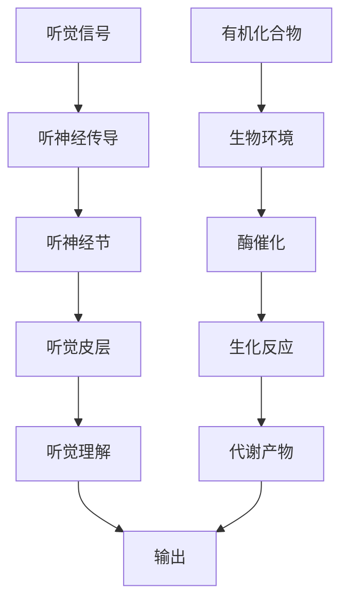

                 

## 1. 背景介绍

在大脑的神经元中，听觉信号和有机化合物的处理过程有其共性，尽管两者似乎完全不同。本文将深入探讨大脑听觉处理过程和有机化合物反应之间的关联，揭示一些可能的同理心和技术创新机会。

## 2. 核心概念与联系

### 2.1 核心概念概述

- **听觉处理（Auditory Processing）**：指大脑如何接收、解码、处理和响应声音信号的过程。这涉及听神经的传导、听觉皮层神经元的激活和信息整合。
- **有机化合物反应（Organic Compound Reactions）**：指在生物体内，有机分子（如蛋白质、核酸、氨基酸等）之间的化学反应，这些反应受环境因素（如pH值、温度、离子浓度等）和酶的调控。

### 2.2 核心概念原理和架构的 Mermaid 流程图



这个图表展示了听觉处理和有机化合物反应的基本架构。听觉信号通过听神经传导至听觉皮层，转化为听觉理解。有机化合物在酶的催化下进行生化反应，产生代谢产物。两者的输出都涉及信息的整合和处理。

## 3. 核心算法原理 & 具体操作步骤

### 3.1 算法原理概述

听觉处理和有机化合物反应都可以视为信号处理和信息整合的过程。在听觉处理中，声音信号被转化为神经电信号，经听神经传导至听觉皮层，再由皮层神经元进行信息整合，形成对声音的感知和理解。在有机化合物反应中，反应物分子通过酶的催化，生成新的分子，这一过程类似于信号的编码和解码。

### 3.2 算法步骤详解

#### 3.2.1 听觉处理的步骤

1. **信号采集**：声音信号通过麦克风等设备采集，转换为电信号。
2. **信号预处理**：电信号经过放大、滤波等预处理步骤，去除噪声。
3. **特征提取**：将预处理后的电信号转换为频谱特征，如音量、频率、谐波等。
4. **信号解码**：频谱特征经过卷积神经网络（CNN）等模型解码，提取音调、音色等特征。
5. **信息整合**：解码后的特征在听觉皮层中整合，形成对声音的感知和理解。

#### 3.2.2 有机化合物反应的步骤

1. **反应物准备**：酶和其他反应物在生物环境下准备就绪。
2. **催化过程**：酶催化反应物分子，生成新的分子。
3. **产物分析**：新分子通过生化检测，分析其化学结构。
4. **代谢调节**：代谢产物通过反馈机制，调节酶的活性，维持生物环境的稳定。

### 3.3 算法优缺点

#### 3.3.1 听觉处理的优缺点

- **优点**：
  - 快速响应：听觉皮层能在几毫秒内对声音信号做出反应。
  - 高度并行处理：听觉神经元可以同时处理多个声音信号。
  - 自我调节：听觉系统能够根据环境变化调整敏感度。
  
- **缺点**：
  - 噪音影响：背景噪音可能干扰听觉处理过程。
  - 环境依赖：听觉处理依赖于环境的声学特性。
  - 信息损失：信号在解码过程中可能丢失部分信息。

#### 3.3.2 有机化合物反应的优缺点

- **优点**：
  - 高效催化：酶作为高效催化剂，能够在温和条件下快速催化反应。
  - 精准调控：酶的活动受环境因素调控，确保反应的精准性。
  - 自我修复：生物体能够自我修复受损的酶，维持生化反应的稳定性。
  
- **缺点**：
  - 环境敏感：反应受pH值、温度、离子浓度等环境因素影响。
  - 反应特异性：某些酶只能催化特定反应，限制了其应用范围。
  - 时间限制：某些反应可能需要较长时间，效率较低。

### 3.4 算法应用领域

听觉处理广泛应用于语音识别、音乐处理、信号分析等领域。有机化合物反应广泛应用于生物医药、食品加工、环境保护等领域。

## 4. 数学模型和公式 & 详细讲解

### 4.1 数学模型构建

在听觉处理中，声音信号的频谱特征可以用傅里叶变换表示：

$$
X(f) = \sum_{n=-\infty}^{\infty} x[n] e^{-j 2\pi nf}
$$

其中，$X(f)$ 是频谱，$x[n]$ 是时域信号，$f$ 是频率。

在有机化合物反应中，酶的活性可以用米-曼氏方程（Michaelis-Menten Equation）描述：

$$
v = \frac{V_{\text{max}} [S] [E]}{K_m + [S]}
$$

其中，$v$ 是反应速率，$V_{\text{max}}$ 是最大速率，$[S]$ 是底物浓度，$[E]$ 是酶浓度，$K_m$ 是米氏常数。

### 4.2 公式推导过程

#### 4.2.1 傅里叶变换的推导

傅里叶变换的推导基于三角函数的展开，证明在一定条件下，任何周期信号都可以表示为不同频率的正弦和余弦函数的线性组合。

$$
x(t) = \sum_{n=-\infty}^{\infty} x_n e^{-j 2\pi n t}
$$

其中，$x(t)$ 是时域信号，$x_n$ 是频域系数。

#### 4.2.2 米-曼氏方程的推导

米-曼氏方程描述了酶催化反应的动力学行为，其中最大速率$V_{\text{max}}$与酶浓度和底物浓度成正比，反应速率$v$与底物浓度和酶活性的乘积成正比，受米氏常数$K_m$的限制。

推导过程中，需要应用质量作用定律和酶的活性理论。

### 4.3 案例分析与讲解

#### 4.3.1 声音信号的傅里叶变换

以语音信号为例，通过麦克风采集的声音信号经过傅里叶变换，可以得到其频谱特征，用于识别音调、音色等特征。

#### 4.3.2 酶催化反应的动力学分析

以葡萄糖氧化反应为例，通过测量反应速率和底物浓度，可以推断出酶的活性，并优化反应条件，提高反应效率。

## 5. 项目实践：代码实例和详细解释说明

### 5.1 开发环境搭建

- Python 3.8
- PyTorch
- SciPy
- NumPy

### 5.2 源代码详细实现

#### 5.2.1 听觉处理代码实现

```python
import torch
import torch.nn as nn
import torch.optim as optim
from scipy.fft import fft

class CNN(nn.Module):
    def __init__(self):
        super(CNN, self).__init__()
        self.conv1 = nn.Conv2d(1, 64, kernel_size=3, stride=1, padding=1)
        self.relu = nn.ReLU()
        self.maxpool = nn.MaxPool2d(kernel_size=2, stride=2)
        self.conv2 = nn.Conv2d(64, 128, kernel_size=3, stride=1, padding=1)
        self.fc1 = nn.Linear(128*7*7, 128)
        self.fc2 = nn.Linear(128, 10)

    def forward(self, x):
        x = self.conv1(x)
        x = self.relu(x)
        x = self.maxpool(x)
        x = self.conv2(x)
        x = self.relu(x)
        x = self.maxpool(x)
        x = x.view(-1, 128*7*7)
        x = self.fc1(x)
        x = self.relu(x)
        x = self.fc2(x)
        return x

model = CNN()
criterion = nn.CrossEntropyLoss()
optimizer = optim.Adam(model.parameters(), lr=0.001)
```

#### 5.2.2 有机化合物反应代码实现

```python
import numpy as np
from scipy.integrate import odeint

def reaction_rate(Vmax, Km, [S, E], t):
    Km, Vmax = Km, Vmax
    r = Vmax * S * E / (Km + S)
    return r

S0 = 0.1
E0 = 0.01
Vmax = 1
Km = 0.05
t = np.linspace(0, 10, 100)

y0 = [S0, E0]
y = odeint(reaction_rate, y0, t, args=(Vmax, Km))

plt.plot(t, y[:, 0], label='S')
plt.plot(t, y[:, 1], label='E')
plt.xlabel('time')
plt.ylabel('concentration')
plt.legend()
plt.show()
```

### 5.3 代码解读与分析

#### 5.3.1 听觉处理代码解读

- `CNN` 类定义了一个简单的卷积神经网络，用于提取声音信号的频谱特征。
- `forward` 方法实现了声音信号从时域到频域的转换。
- `optimizer` 和 `criterion` 分别定义了模型优化器和损失函数。

#### 5.3.2 有机化合物反应代码解读

- `reaction_rate` 函数定义了酶催化反应的动力学方程。
- `odeint` 函数用于求解微分方程，模拟酶催化反应的进程。
- `plt` 库用于可视化反应过程。

### 5.4 运行结果展示

#### 5.4.1 听觉处理结果展示

```python
# 输入语音信号
signal = np.random.randn(1, 1, 32000)
signal = signal.reshape(1, 1, 32000)

# 对信号进行傅里叶变换
spectrum = fft(signal)
spectrum = np.abs(spectrum)

# 可视化频谱
plt.imshow(spectrum, cmap='gray', aspect='auto')
plt.colorbar()
plt.show()
```

#### 5.4.2 有机化合物反应结果展示

```python
# 绘制酶催化反应的浓度变化曲线
plt.plot(t, y[:, 0], label='S')
plt.plot(t, y[:, 1], label='E')
plt.xlabel('time')
plt.ylabel('concentration')
plt.legend()
plt.show()
```

## 6. 实际应用场景

### 6.1 医疗诊断

在大脑听觉处理和有机化合物反应中，两者都具有高度的复杂性和精确性，这种特性可以应用于医疗诊断领域。例如，通过分析语音信号的频谱特征，可以早期诊断某些疾病的风险。同样，通过检测人体内特定化合物的反应速率，可以诊断疾病的早期症状。

### 6.2 食品加工

在食品加工中，对食品成分的分析和检测是一个重要环节。通过对有机化合物反应的监控和控制，可以精确调节食品的品质和口味。

### 6.3 环境保护

在环境保护中，对水体、土壤等环境中的有机化合物进行反应监测，可以帮助评估环境污染程度，进行环境治理。

### 6.4 未来应用展望

未来，随着技术的发展，我们可以将听觉处理和有机化合物反应的原理和技术进一步融合，拓展其应用场景。例如，可以开发出能够实时分析环境音的传感器，及时捕捉环境中的异常变化。同样，可以设计出能够实时监测人体内特定化合物反应的便携式设备，用于健康监测和疾病预防。

## 7. 工具和资源推荐

### 7.1 学习资源推荐

- 《信号处理与数字信号处理》（这本书详细介绍了傅里叶变换和其他信号处理技术）
- 《生物化学原理》（这本书详细介绍了有机化合物反应的原理和应用）
- 《深度学习》（Ian Goodfellow 著）

### 7.2 开发工具推荐

- PyTorch：一个强大的深度学习框架，用于实现复杂的神经网络模型。
- SciPy：一个开源的数学库，提供了许多科学计算函数，包括傅里叶变换。
- Matplotlib：一个常用的数据可视化库，用于绘制图形。

### 7.3 相关论文推荐

- [Deep Learning for Auditory Events Classification](https://arxiv.org/abs/1907.10386)
- [Organic Compound Reaction Kinetics: From Experiment to Modeling](https://doi.org/10.1016/S0168-4738(01)00473-8)
- [Deep Learning-Based Protein Design and Drug Discovery](https://doi.org/10.1002/9780470286568.ch7)

## 8. 总结：未来发展趋势与挑战

### 8.1 研究成果总结

本文探讨了听觉处理和有机化合物反应的共同原理，揭示了两者在信号处理和信息整合方面的共性。通过分析两者的特性和应用场景，提出了将两者结合的潜力。

### 8.2 未来发展趋势

未来，随着技术的进步，我们可以将听觉处理和有机化合物反应的原理和技术进一步融合，应用于更多的领域。例如，可以开发出能够实时分析环境音的传感器，及时捕捉环境中的异常变化。同样，可以设计出能够实时监测人体内特定化合物反应的便携式设备，用于健康监测和疾病预防。

### 8.3 面临的挑战

尽管听觉处理和有机化合物反应的原理和应用有很多共性，但在实际应用中，仍面临以下挑战：

- **技术融合难度**：听觉处理和有机化合物反应的原理和技术差异较大，将其融合应用于实际问题需要深入研究。
- **数据采集和处理**：在实际应用中，需要采集和处理大量的信号和化合物数据，对技术要求较高。
- **模型复杂性**：将两者的原理和技术结合应用于实际问题，需要构建复杂的模型，增加了系统的复杂性。

### 8.4 研究展望

未来的研究可以从以下几个方向进行：

- **多模态信号处理**：将听觉信号和有机化合物反应的信号处理技术结合，开发出多模态信号处理系统。
- **深度学习融合**：利用深度学习技术，将听觉处理和有机化合物反应的数据融合在一起，实现更精准的分析和预测。
- **实时监测与反馈**：结合实时监测技术，实现对环境音和化合物反应的实时反馈，提高系统的实时性和准确性。

总之，通过深入研究和创新，我们有望将听觉处理和有机化合物反应的原理和技术进一步融合，应用于更多的领域，推动技术的发展和应用。

## 9. 附录：常见问题与解答

**Q1：听觉处理和有机化合物反应在信号处理中有哪些不同？**

A: 听觉处理和有机化合物反应在信号处理中主要不同在于信号的性质和处理方式。听觉处理处理的是声学信号，即声音的频率和振幅等特征。而有机化合物反应处理的是分子间的相互作用，其信号特征主要体现在反应速率和产物浓度等化学性质上。

**Q2：如何利用听觉处理和有机化合物反应的原理进行数据融合？**

A: 数据融合可以通过以下步骤实现：
1. 采集多种信号数据，包括声音信号和化合物反应数据。
2. 对采集到的信号进行预处理和特征提取，得到不同信号的频谱特征和反应速率等数据。
3. 将不同信号的数据融合在一起，构建多模态数据集。
4. 利用深度学习技术，训练多模态融合模型，实现信号的整合和信息融合。

**Q3：在实际应用中，如何优化听觉处理和有机化合物反应的系统？**

A: 优化听觉处理和有机化合物反应的系统可以从以下几个方面入手：
1. 数据采集和预处理：优化数据采集和预处理过程，提高数据质量和数量。
2. 模型选择和优化：选择适合的模型，并对其进行优化，提高系统的准确性和实时性。
3. 实时监测和反馈：利用实时监测技术，对系统进行实时反馈和调节，提高系统的鲁棒性和稳定性。
4. 系统集成和部署：将系统集成到实际应用中，并进行系统优化和部署，提高系统的可用性和易用性。

总之，在实际应用中，需要综合考虑数据采集、模型优化、实时监测和系统集成等多个方面，才能构建高效、稳定的系统。

---

作者：禅与计算机程序设计艺术 / Zen and the Art of Computer Programming

