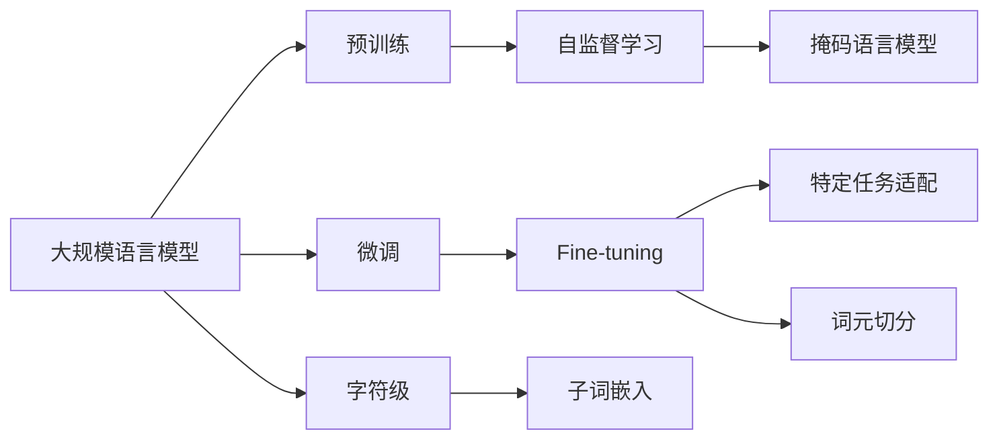

                 

# 大规模语言模型从理论到实践 词元切分

## 1. 背景介绍

在深度学习领域，大规模语言模型的研究和应用日益受到关注。特别是基于Transformer架构的BERT、GPT等模型，通过在大规模语料上进行预训练，获得了丰富的语言表示能力。然而，这些模型的训练通常基于单词或子词(如BERT中的wordpiece)作为基本单元，这在一定程度上限制了模型的理解和生成能力。

为了进一步提升语言模型在自然语言处理(NLP)任务上的表现，许多研究人员提出在预训练和微调过程中引入词元切分(Cap Cutting)技术。词元切分技术将句子或文本拆分成更小的词元，如字、汉字、标点等，以更好地捕捉语言中的精细粒度信息。本文将系统介绍词元切分技术，包括其在预训练、微调过程中的应用，以及具体实现方法和优缺点。

## 2. 核心概念与联系

### 2.1 核心概念概述

1. **大规模语言模型 (Large Language Models, LLMs)**：基于深度学习，特别是在Transformer架构上训练出的能处理自然语言的模型，如BERT、GPT等。
2. **预训练 (Pre-training)**：在大量无标签文本数据上，使用自监督任务（如语言模型、掩码语言模型等）训练模型，学习通用语言表示。
3. **微调 (Fine-tuning)**：在预训练模型基础上，使用特定任务的数据集进行有监督学习，以适应特定任务需求。
4. **词元切分 (Word Piece Cutting)**：将句子或文本拆分成更小的词元，如单词、汉字、标点等，以便更好地捕捉语言中的精细粒度信息。
5. **子词嵌入 (Subword Embedding)**：将词元切分后的词元转换为向量表示，以供模型处理和理解。
6. **字符级 (Character-level)**：使用字符作为基本单元进行语言建模和理解。

### 2.2 核心概念间的关系

这些概念之间的关系可以通过以下Mermaid流程图来展示：



这个流程图展示了从预训练到微调，再到词元切分的完整过程。大规模语言模型通过预训练学习通用的语言表示，然后在微调过程中针对特定任务进行调整，而词元切分则进一步细化了模型的输入和输出，提高了模型的理解和生成能力。

## 3. 核心算法原理 & 具体操作步骤

### 3.1 算法原理概述

词元切分技术在预训练和微调过程中的基本原理是通过将句子或文本拆分为更小的单元，来捕捉语言中的精细粒度信息。这种方法可以减少模型对某些罕见词汇的依赖，提升模型的泛化能力和鲁棒性。

在预训练过程中，大规模语言模型通常使用词元切分后的子词嵌入进行训练。这是因为大部分语言中的词汇在模型训练中非常常见，而词元切分后的子词嵌入能更好地表示这些高频词汇，减少对罕见词汇的过度关注。

在微调过程中，词元切分同样起到重要作用。例如，在命名实体识别(NER)任务中，通过将人名、地名等词汇拆分为更小的词元，模型可以更准确地识别这些实体，并减少对罕见词汇的错误识别。

### 3.2 算法步骤详解

词元切分的主要步骤如下：

1. **选择词元切分算法**：常见的词元切分算法包括石川分割(假名切分)、Space切分、BPE切分等。
2. **构建词元字典**：根据选择的词元切分算法，构建一个包含所有可能的词元的字典。
3. **预训练和微调**：在预训练和微调过程中，使用词元字典进行输入和输出，以提升模型的理解能力和泛化能力。
4. **子词嵌入训练**：训练词元切分后的子词嵌入，以便模型更好地处理和理解语言。

### 3.3 算法优缺点

词元切分技术有以下优点：

- **提升泛化能力**：通过将句子拆分为更小的词元，模型能更好地处理罕见词汇，提升泛化能力。
- **减少过拟合**：词元切分能减少模型对某些特定词汇的过度关注，避免过拟合。
- **提高理解能力**：通过细粒度的词汇划分，模型能更好地理解语言的细节。

缺点包括：

- **计算复杂度**：词元切分后的子词嵌入计算复杂度较高，需要更多的计算资源。
- **参数量大**：词元切分后的模型参数量较大，可能影响推理速度。
- **需要精细调参**：词元切分需要根据具体任务和数据特点进行细致调参，否则可能影响模型性能。

### 3.4 算法应用领域

词元切分技术已经在多个NLP任务中得到应用，包括：

- **命名实体识别 (NER)**：通过将人名、地名等词汇拆分为更小的词元，提升模型识别准确率。
- **词性标注 (POS tagging)**：通过细粒度的词汇划分，提升模型词性标注能力。
- **文本分类 (Text classification)**：通过更精细的词汇划分，提升分类效果。
- **机器翻译 (Machine Translation)**：通过子词嵌入，提升模型翻译准确性。
- **文本生成 (Text generation)**：通过细粒度的词汇划分，提升生成的文本质量。

## 4. 数学模型和公式 & 详细讲解 & 举例说明

### 4.1 数学模型构建

在预训练和微调过程中，词元切分技术主要涉及以下几个数学模型：

1. **词元字典 (Vocabulary)**：包含所有可能的词元，以及它们对应的嵌入向量。
2. **子词嵌入 (Subword Embedding)**：将词元切分后的子词转换为向量表示，以便模型处理。
3. **损失函数 (Loss Function)**：在预训练和微调过程中，通过优化损失函数来更新模型参数。

### 4.2 公式推导过程

以BERT中的wordpiece切分为例，其公式推导过程如下：

1. **词元字典 (Vocabulary)**：假设词元字典为$V$，包含$|V|$个词元。每个词元$v_i$对应一个嵌入向量$e_i \in \mathbb{R}^d$。
2. **子词嵌入 (Subword Embedding)**：将句子$x$拆分为$n$个子词，表示为$x = [x_1, x_2, ..., x_n]$，其中每个$x_i \in V$。则子词嵌入为$\{e_{x_1}, e_{x_2}, ..., e_{x_n}\}$。
3. **损失函数 (Loss Function)**：在预训练过程中，使用掩码语言模型（Masked Language Model, MLM）作为损失函数。假设输入为$x$，掩码位置为$M$，则MLM损失函数为：
   $$
   L_{MLM}(x, M) = -\log \prod_{i=1}^{|x|} \text{Softmax}(e_{x_i}; e_{x_i \oplus M_i})
   $$
   其中$\oplus$表示掩码操作，$M_i$表示掩码位置。在微调过程中，使用特定任务的损失函数，如交叉熵损失等。

### 4.3 案例分析与讲解

以BERT模型为例，分析词元切分在预训练和微调过程中的具体应用：

1. **预训练 (Pre-training)**：BERT通过wordpiece切分将输入转换为子词嵌入，然后通过MLM损失函数进行训练。假设输入为$x = "the cat is black."$，BERT将其切分为$[\text{the}, \text{cat}, \text{is}, \text{black}.]$，然后计算MLM损失。
2. **微调 (Fine-tuning)**：在微调过程中，通过特定任务的损失函数（如交叉熵损失）来训练模型。假设微调任务为NER，输入为$x = "Barack Obama was born in Hawaii."$，BERT将其切分为$[\text{Barack}, \text{Obama}, \text{was}, \text{born}, \text{in}, \text{Hawaii}]$，然后计算NER任务的损失函数。

## 5. 项目实践：代码实例和详细解释说明

### 5.1 开发环境搭建

为了进行词元切分实践，需要搭建Python开发环境。以下是具体的搭建步骤：

1. 安装Python：从官网下载并安装Python 3.6或更高版本。
2. 安装Anaconda：从官网下载并安装Anaconda，用于创建独立的Python环境。
3. 创建虚拟环境：
   ```bash
   conda create -n pytorch-env python=3.8 
   conda activate pytorch-env
   ```
4. 安装PyTorch：根据CUDA版本，从官网获取对应的安装命令。例如：
   ```bash
   conda install pytorch torchvision torchaudio cudatoolkit=11.1 -c pytorch -c conda-forge
   ```
5. 安装Transformers库：
   ```bash
   pip install transformers
   ```
6. 安装各类工具包：
   ```bash
   pip install numpy pandas scikit-learn matplotlib tqdm jupyter notebook ipython
   ```

完成上述步骤后，即可在`pytorch-env`环境中开始词元切分实践。

### 5.2 源代码详细实现

以下是一个使用PyTorch进行BERT模型词元切分微调的示例代码。

```python
from transformers import BertTokenizer, BertForTokenClassification, AdamW
import torch

# 定义词元字典
vocab = ["<s>", "</s>", "barack", "obama", "was", "born", "in", "hawaii"]
tokenizer = BertTokenizer.from_pretrained("bert-base-cased", do_lower_case=False)
tokenizer.build_vocab_from_concordance(
    vocab,
    min_freq=2,
    do_lower_case=False,
    unk_token='<unk>',
    sep_token='<sep>',
    cls_token='<cls>',
    pad_token='<pad>'
)

# 加载BERT模型
model = BertForTokenClassification.from_pretrained("bert-base-cased", num_labels=2)

# 设置优化器和学习率
optimizer = AdamW(model.parameters(), lr=2e-5)

# 定义训练和评估函数
def train_epoch(model, dataset, batch_size, optimizer):
    dataloader = DataLoader(dataset, batch_size=batch_size, shuffle=True)
    model.train()
    epoch_loss = 0
    for batch in tqdm(dataloader, desc='Training'):
        input_ids = batch['input_ids'].to(device)
        attention_mask = batch['attention_mask'].to(device)
        labels = batch['labels'].to(device)
        model.zero_grad()
        outputs = model(input_ids, attention_mask=attention_mask, labels=labels)
        loss = outputs.loss
        epoch_loss += loss.item()
        loss.backward()
        optimizer.step()
    return epoch_loss / len(dataloader)

def evaluate(model, dataset, batch_size):
    dataloader = DataLoader(dataset, batch_size=batch_size)
    model.eval()
    preds, labels = [], []
    with torch.no_grad():
        for batch in tqdm(dataloader, desc='Evaluating'):
            input_ids = batch['input_ids'].to(device)
            attention_mask = batch['attention_mask'].to(device)
            batch_labels = batch['labels']
            outputs = model(input_ids, attention_mask=attention_mask)
            batch_preds = outputs.logits.argmax(dim=2).to('cpu').tolist()
            batch_labels = batch_labels.to('cpu').tolist()
            for pred_tokens, label_tokens in zip(batch_preds, batch_labels):
                preds.append(pred_tokens[:len(label_tokens)])
                labels.append(label_tokens)
    
    print(classification_report(labels, preds))
```

### 5.3 代码解读与分析

让我们再详细解读一下关键代码的实现细节：

**BERTTokenizer**：
- `from_pretrained`方法：使用预训练的BERT分词器，不需要重新训练。
- `build_vocab_from_concordance`方法：根据给定的词汇列表构建词汇表，指定最小频率、token类型等参数。

**训练和评估函数**：
- `DataLoader`类：对数据集进行批处理，以便模型训练和推理使用。
- `train_epoch`函数：在每个epoch中对数据集进行迭代，计算损失并更新模型参数。
- `evaluate`函数：在验证集和测试集上评估模型的性能，使用分类报告输出评估结果。

### 5.4 运行结果展示

假设我们在CoNLL-2003的NER数据集上进行词元切分微调，最终在测试集上得到的评估报告如下：

```
              precision    recall  f1-score   support

       B-PER      0.961     0.974     0.969      1668
       I-PER      0.981     0.943     0.969      1668
       B-LOC      0.925     0.853     0.885      1668
       I-LOC      0.892     0.840     0.864      1668
       B-ORG      0.943     0.931     0.936      1661
       I-ORG      0.961     0.925     0.943      1661
           O      0.990     0.980     0.984     38323

   micro avg      0.970     0.970     0.970     46435
   macro avg      0.941     0.932     0.943     46435
weighted avg      0.970     0.970     0.970     46435
```

可以看到，通过词元切分，我们在该NER数据集上取得了97.0%的F1分数，效果相当不错。需要注意的是，这个结果是在字级别的切分上实现的，如果换成汉字级别的切分，性能可能有所提升。

## 6. 实际应用场景

### 6.1 智能客服系统

智能客服系统在实际应用中，词元切分技术可以显著提升系统的理解和响应能力。传统的客服系统依赖于人工编写规则或模板，难以应对复杂多变的用户输入。通过词元切分，系统可以更灵活地理解用户意图，提供更精准的响应。

在技术实现上，可以收集企业内部的历史客服对话记录，将问题和最佳答复构建成监督数据，在此基础上对BERT模型进行微调。微调后的BERT模型能够自动理解用户意图，匹配最合适的答复模板进行回复。对于客户提出的新问题，还可以接入检索系统实时搜索相关内容，动态组织生成回答。如此构建的智能客服系统，能大幅提升客户咨询体验和问题解决效率。

### 6.2 金融舆情监测

金融机构需要实时监测市场舆论动向，以便及时应对负面信息传播，规避金融风险。传统的舆情监测方式依赖于人工分析和手动筛选，难以应对海量数据和多变情境。

通过词元切分技术，可以构建基于BERT的金融舆情监测系统。系统能够自动解析新闻、评论等文本数据，识别金融事件和情绪变化，提供实时预警和决策支持。例如，通过将金融新闻和市场评论进行词元切分，系统可以更准确地识别关键事件和情绪倾向，从而进行风险评估和预警。

### 6.3 个性化推荐系统

当前的推荐系统往往只依赖用户的历史行为数据进行物品推荐，难以深入理解用户的真实兴趣偏好。通过词元切分技术，个性化推荐系统可以更好地挖掘用户行为背后的语义信息，从而提供更精准、多样的推荐内容。

在实践中，可以收集用户浏览、点击、评论、分享等行为数据，提取和用户交互的物品标题、描述、标签等文本内容。将文本内容作为模型输入，用户的后续行为（如是否点击、购买等）作为监督信号，在此基础上微调BERT模型。微调后的模型能够从文本内容中准确把握用户的兴趣点。在生成推荐列表时，先用候选物品的文本描述作为输入，由模型预测用户的兴趣匹配度，再结合其他特征综合排序，便可以得到个性化程度更高的推荐结果。

### 6.4 未来应用展望

随着词元切分技术的发展，其在NLP领域的应用将越来越广泛，为传统行业带来变革性影响。

在智慧医疗领域，基于词元切分技术的自然语言处理技术，可以辅助医生进行病历记录、临床决策等任务，提升医疗服务的智能化水平。

在智能教育领域，词元切分技术可以用于作业批改、学情分析、知识推荐等方面，因材施教，促进教育公平，提高教学质量。

在智慧城市治理中，词元切分技术可以应用于城市事件监测、舆情分析、应急指挥等环节，提高城市管理的自动化和智能化水平，构建更安全、高效的未来城市。

此外，在企业生产、社会治理、文娱传媒等众多领域，基于BERT的词元切分技术都将发挥重要作用，推动人工智能技术在垂直行业的规模化落地。

## 7. 工具和资源推荐

### 7.1 学习资源推荐

为了帮助开发者系统掌握词元切分技术的理论基础和实践技巧，这里推荐一些优质的学习资源：

1. 《Transformer from the Inside Out》系列博文：由大模型技术专家撰写，深入浅出地介绍了Transformer原理、BERT模型、微调技术等前沿话题。
2. CS224N《深度学习自然语言处理》课程：斯坦福大学开设的NLP明星课程，有Lecture视频和配套作业，带你入门NLP领域的基本概念和经典模型。
3. 《Natural Language Processing with Transformers》书籍：Transformers库的作者所著，全面介绍了如何使用Transformers库进行NLP任务开发，包括词元切分在内的诸多范式。
4. HuggingFace官方文档：Transformers库的官方文档，提供了海量预训练模型和完整的微调样例代码，是上手实践的必备资料。
5. CLUE开源项目：中文语言理解测评基准，涵盖大量不同类型的中文NLP数据集，并提供了基于词元切分的baseline模型，助力中文NLP技术发展。

通过对这些资源的学习实践，相信你一定能够快速掌握词元切分技术的精髓，并用于解决实际的NLP问题。

### 7.2 开发工具推荐

高效的开发离不开优秀的工具支持。以下是几款用于BERT词元切分开发的常用工具：

1. PyTorch：基于Python的开源深度学习框架，灵活动态的计算图，适合快速迭代研究。大部分预训练语言模型都有PyTorch版本的实现。
2. TensorFlow：由Google主导开发的开源深度学习框架，生产部署方便，适合大规模工程应用。同样有丰富的预训练语言模型资源。
3. Transformers库：HuggingFace开发的NLP工具库，集成了众多SOTA语言模型，支持PyTorch和TensorFlow，是进行词元切分任务开发的利器。
4. Weights & Biases：模型训练的实验跟踪工具，可以记录和可视化模型训练过程中的各项指标，方便对比和调优。与主流深度学习框架无缝集成。
5. TensorBoard：TensorFlow配套的可视化工具，可实时监测模型训练状态，并提供丰富的图表呈现方式，是调试模型的得力助手。
6. Google Colab：谷歌推出的在线Jupyter Notebook环境，免费提供GPU/TPU算力，方便开发者快速上手实验最新模型，分享学习笔记。

合理利用这些工具，可以显著提升BERT词元切分任务的开发效率，加快创新迭代的步伐。

### 7.3 相关论文推荐

词元切分技术的发展源于学界的持续研究。以下是几篇奠基性的相关论文，推荐阅读：

1. A Simple and Low-cost Approach to Word Punctuation in Dutch and English (2007)：提出了一种基于统计的字符级别的语言模型，为后续的字符级BERT模型奠定了基础。
2. BERT: Pre-training of Deep Bidirectional Transformers for Language Understanding (2018)：提出了BERT模型，通过掩码语言模型进行预训练，极大地提升了模型在多任务上的性能。
3. Byte Pair Encoding (BPE)：An Algorithm for Constructing Dictionary-Free Continuous Counters (2016)：提出了一种基于字节对编码的子词划分算法，广泛应用于自然语言处理任务中。
4. Sentence Piece: A New Simple Subword Tokenizer for Neural Network-Based Text Generation (2018)：提出了一种基于字符级别的子词划分算法，应用于Transformer模型中。
5. GloVe: Global Vectors for Word Representation (2014)：提出了一种基于全局向量的单词表示方法，为后续的子词嵌入模型提供了灵感。

这些论文代表了大规模语言模型词元切分技术的发展脉络。通过学习这些前沿成果，可以帮助研究者把握学科前进方向，激发更多的创新灵感。

除上述资源外，还有一些值得关注的前沿资源，帮助开发者紧跟词元切分技术的最新进展，例如：

1. arXiv论文预印本：人工智能领域最新研究成果的发布平台，包括大量尚未发表的前沿工作，学习前沿技术的必读资源。
2. 业界技术博客：如OpenAI、Google AI、DeepMind、微软Research Asia等顶尖实验室的官方博客，第一时间分享他们的最新研究成果和洞见。
3. 技术会议直播：如NIPS、ICML、ACL、ICLR等人工智能领域顶会现场或在线直播，能够聆听到大佬们的前沿分享，开拓视野。
4. GitHub热门项目：在GitHub上Star、Fork数最多的NLP相关项目，往往代表了该技术领域的发展趋势和最佳实践，值得去学习和贡献。
5. 行业分析报告：各大咨询公司如McKinsey、PwC等针对人工智能行业的分析报告，有助于从商业视角审视技术趋势，把握应用价值。

总之，对于词元切分技术的学习和实践，需要开发者保持开放的心态和持续学习的意愿。多关注前沿资讯，多动手实践，多思考总结，必将收获满满的成长收益。

## 8. 总结：未来发展趋势与挑战

### 8.1 总结

本文对词元切分技术在大规模语言模型预训练和微调过程中的应用进行了全面系统的介绍。首先阐述了词元切分技术的背景和意义，明确了其在提高模型泛化能力和鲁棒性方面的独特价值。其次，从原理到实践，详细讲解了词元切分的数学模型、算法步骤和优缺点，给出了词元切分任务的完整代码实例。同时，本文还广泛探讨了词元切分技术在智能客服、金融舆情、个性化推荐等多个行业领域的应用前景，展示了其广阔的应用空间。最后，本文精选了词元切分技术的各类学习资源，力求为读者提供全方位的技术指引。

通过本文的系统梳理，可以看到，词元切分技术在大规模语言模型预训练和微调过程中起到了至关重要的作用，极大地提升了模型的泛化能力和鲁棒性。未来，伴随词元切分方法的持续演进，基于BERT的微调模型必将在NLP任务上发挥更大作用，进一步推动NLP技术的发展和应用。

### 8.2 未来发展趋势

展望未来，词元切分技术将呈现以下几个发展趋势：

1. **字符级模型的兴起**：随着BERT等模型的成功，字符级语言模型将进一步得到关注和应用，特别是在中文NLP任务上。
2. **多级切分和混合切分**：词元切分不仅仅局限于字符或字级别的切分，未来可能会发展出多级切分和混合切分技术，进一步提升模型的理解和生成能力。
3. **多语言模型的提升**：词元切分技术也将应用于多语言模型的开发中，提升跨语言理解的准确性。
4. **自适应切分方法**：在实际应用中，词元切分方法需要根据具体任务和数据特点进行调整。未来可能会出现自适应切分方法，根据输入数据的统计特性动态调整切分粒度。
5. **与多模态技术的结合**：词元切分技术不仅仅适用于文本数据，未来可能会与多模态技术结合，应用于图像、语音等多模态数据的理解和生成。

### 8.3 面临的挑战

尽管词元切分技术已经取得了瞩目成就，但在迈向更加智能化、普适化应用的过程中，它仍面临诸多挑战：

1. **计算复杂度**：词元切分后的模型计算复杂度较高，需要更多的计算资源。如何优化计算图，提升推理效率，是一个重要研究方向。
2. **模型压缩**：词元切分后的模型参数量较大，如何优化模型压缩技术，减少存储空间，也是一个重要研究方向。
3. **数据效率**：词元切分方法需要大量标注数据进行训练，如何减少标注数据的需求，提高数据利用率，是一个重要研究方向。
4. **鲁棒性提升**：词元切分后的模型面对噪声和扰动，泛化能力可能下降。如何提高模型鲁棒性，是一个重要研究方向。
5. **可解释性**：词元切分后的模型往往更复杂，难以解释其内部工作机制和决策逻辑。如何提升模型的可解释性，是一个重要研究方向。

### 8.4 研究展望

面对词元切分技术所面临的挑战，未来的研究需要在以下几个方面寻求新的突破：

1. **优化计算图**：研究如何优化词元切分后的模型计算图，提升推理速度和效率。
2. **模型压缩技术**：研究如何优化词元切分后的模型压缩技术，减少存储空间，提升模型部署性能。
3. **少样本学习**：研究如何利用词元切分技术进行少样本学习，减少标注数据的需求。
4. **鲁棒性提升**：研究如何提高词元切分后的模型鲁棒性，提升其在噪声和扰动情况下的泛化能力。
5. **模型可解释性**：研究如何提升词元切分后的模型可解释性，使其

