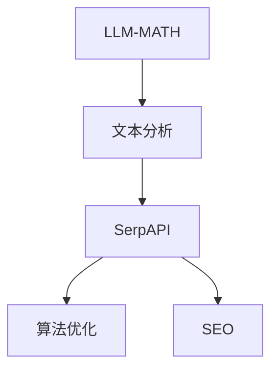
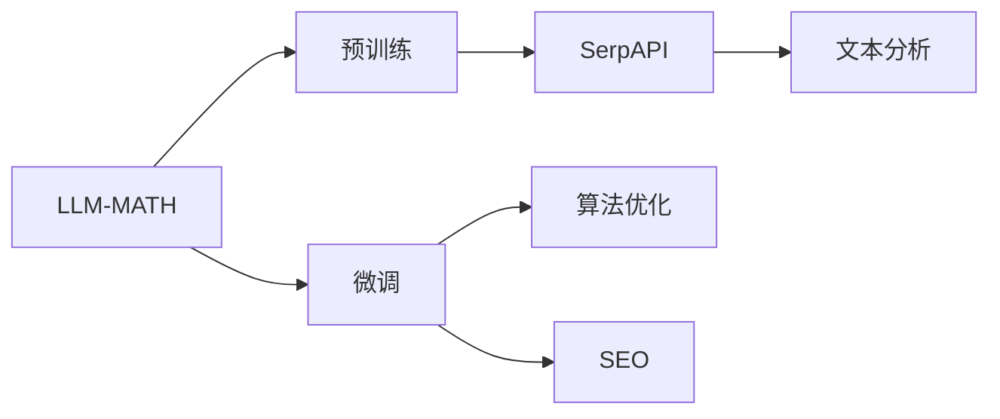
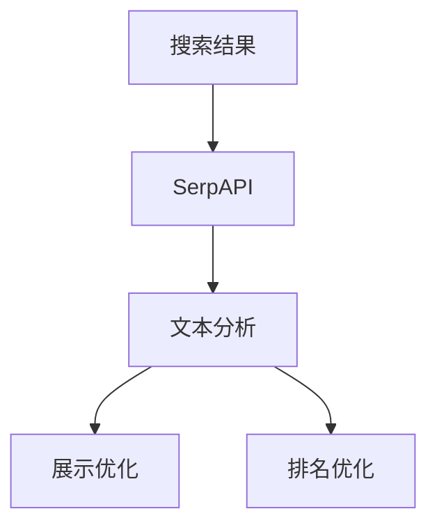
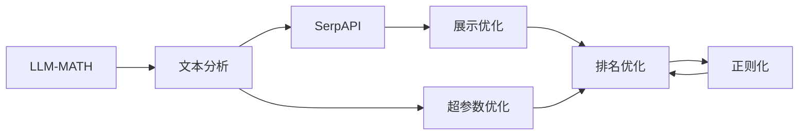
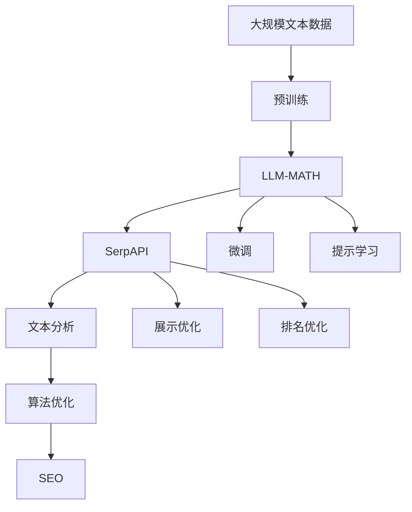

                 

# 实战 ReAct：SerpAPI + LLM-MATH

> 关键词：自然语言处理, LLM-MATH, SerpAPI, 搜索引擎优化, 文本分析, 算法优化, 机器学习

## 1. 背景介绍

### 1.1 问题由来
在当今信息爆炸的时代，搜索引擎成为了我们获取信息、解决问题的重要工具。然而，传统的搜索引擎往往只能按照关键字进行简单的文本匹配，无法深入理解文本含义。为了提升搜索引擎的智能化水平，许多研究人员开始探索如何利用自然语言处理（NLP）技术，对搜索结果进行语义分析、意图识别、上下文关联等高级处理，从而提升搜索结果的匹配度和相关性。

在此背景下，自然语言处理和搜索引擎优化（SEO）技术的结合，成为了近年来搜索引擎领域的热点研究方向。通过将语言模型与搜索引擎API结合，可以使得搜索引擎更加智能，为用户提供更加精准、有用的搜索结果。然而，这种结合涉及到了多个复杂技术环节，包括NLP模型训练、文本分析、算法优化、SEO实践等，操作难度较大，对技术要求较高。

### 1.2 问题核心关键点
为了解决搜索引擎与自然语言处理结合的问题，本文将聚焦于基于LanmBERT模型的文本分析技术，结合SerpAPI搜索引擎优化工具，提出一种新的搜索引擎优化方法，即ReAct（Natural Language Analysis and Optimization for Search Engine）方法。该方法的核心在于通过LanmBERT模型对搜索结果进行语义分析，并通过SerpAPI优化搜索结果的展示和排名，从而提升搜索引擎的智能化水平。

## 2. 核心概念与联系

### 2.1 核心概念概述

为更好地理解ReAct方法，本节将介绍几个密切相关的核心概念：

- LLM-MATH: 大语言模型，即LanmBERT模型，是本文的关键词之一。LLM-MATH通过大规模无标签文本预训练，学习到丰富的语言知识和语义表示，具备强大的语言理解能力。

- SerpAPI: 一个集成了Google搜索、Bing搜索、雅虎搜索等主流搜索引擎API的第三方API接口，用于获取搜索结果的详细信息，如标题、URL、摘要等，并提供搜索结果的展示和排名优化服务。

- 文本分析: 指对自然语言文本进行分析和处理的程序或技术，包括分词、词性标注、命名实体识别、情感分析等。

- 算法优化: 通过对模型、算法等进行优化和调整，使得系统性能达到最优，包括超参数调整、正则化、梯度下降等技术。

- 机器学习: 让计算机通过大量数据学习，自动改善性能的科学，包括监督学习、无监督学习、强化学习等。

- SEO: 搜索引擎优化，通过优化网站结构和内容，提升在搜索引擎中的排名，提高流量和转化率。

这些核心概念之间的逻辑关系可以通过以下Mermaid流程图来展示：



这个流程图展示了大语言模型与文本分析、搜索引擎API以及算法优化的关系：

1. 大语言模型通过预训练获得基础能力。
2. 文本分析将搜索结果文本进行自然语言处理，提取关键信息。
3. 搜索引擎API获取搜索结果，进行展示和排名优化。
4. 算法优化对模型和优化算法进行调整，提升效果。
5. SEO策略指导SEO优化，提升搜索引擎排名。

### 2.2 概念间的关系

这些核心概念之间存在着紧密的联系，形成了ReAct方法的完整生态系统。下面我们通过几个Mermaid流程图来展示这些概念之间的关系。

#### 2.2.1 大语言模型的学习范式



这个流程图展示了大语言模型的预训练、微调以及与SEO策略结合的过程。预训练主要采用自监督学习方法，而微调则是有监督学习的过程。文本分析将搜索结果文本进行自然语言处理，提取关键信息。算法优化和SEO策略指导搜索结果展示和排名的优化。

#### 2.2.2 SerpAPI与文本分析的关系



这个流程图展示了SerpAPI获取搜索结果的过程，以及文本分析对搜索结果进行展示和排名优化。SerpAPI提供了搜索结果的详细信息，文本分析对搜索结果进行语义分析，从而进行展示和排名优化。

#### 2.2.3 算法优化在ReAct中的作用



这个流程图展示了算法优化在ReAct中的作用。文本分析后的展示和排名优化，需要进行算法优化，包括超参数优化和正则化等技术，以提升效果。

### 2.3 核心概念的整体架构

最后，我们用一个综合的流程图来展示这些核心概念在大语言模型微调过程中的整体架构：



这个综合流程图展示了从预训练到微调，再到展示和排名优化的完整过程。大语言模型首先在大规模文本数据上进行预训练，然后通过微调（包括全参数微调和提示学习）来适配特定任务。SerpAPI获取搜索结果，文本分析对搜索结果进行自然语言处理，算法优化和SEO策略指导搜索结果展示和排名的优化。

## 3. 核心算法原理 & 具体操作步骤
### 3.1 算法原理概述

ReAct方法的核心在于结合大语言模型和搜索引擎API，通过文本分析技术对搜索结果进行语义分析，并通过算法优化和SEO策略提升搜索结果展示和排名的优化。该方法的核心算法流程如下：

1. 通过LanmBERT模型对搜索结果进行语义分析，提取关键信息。
2. 使用SerpAPI获取搜索结果的详细信息，并进行展示和排名优化。
3. 进行算法优化和SEO策略，提升搜索结果的质量和相关性。

该方法的关键在于如何将自然语言处理技术与搜索引擎优化技术有机结合，从而提升搜索结果的智能化水平。

### 3.2 算法步骤详解

基于ReAct方法，搜索引擎优化流程可以分为以下几个关键步骤：

**Step 1: 准备预训练模型和数据集**
- 选择合适的LanmBERT模型作为初始化参数，如LanmBERT-BERT模型。
- 准备SEO数据集，包含搜索引擎返回的搜索结果和对应的标签数据（如点击率、排名、相关性等）。

**Step 2: 添加任务适配层**
- 根据SEO任务类型，在LanmBERT模型顶层设计合适的输出层和损失函数。
- 对于点击率预测任务，通常在顶层添加线性分类器和交叉熵损失函数。
- 对于排名优化任务，使用回归损失函数，如均方误差损失。

**Step 3: 设置微调超参数**
- 选择合适的优化算法及其参数，如AdamW、SGD等，设置学习率、批大小、迭代轮数等。
- 设置正则化技术及强度，包括权重衰减、Dropout、Early Stopping等。
- 确定冻结预训练参数的策略，如仅微调顶层，或全部参数都参与微调。

**Step 4: 执行梯度训练**
- 将SEO数据集分批次输入模型，前向传播计算损失函数。
- 反向传播计算参数梯度，根据设定的优化算法和学习率更新模型参数。
- 周期性在验证集上评估模型性能，根据性能指标决定是否触发Early Stopping。
- 重复上述步骤直到满足预设的迭代轮数或Early Stopping条件。

**Step 5: 测试和部署**
- 在测试集上评估微调后模型 $M_{\hat{\theta}}$ 的性能，对比微调前后的性能提升。
- 使用微调后的模型对新样本进行推理预测，集成到实际的应用系统中。
- 持续收集新的数据，定期重新微调模型，以适应数据分布的变化。

以上是ReAct方法的基本流程。在实际应用中，还需要针对具体任务的特点，对微调过程的各个环节进行优化设计，如改进训练目标函数，引入更多的正则化技术，搜索最优的超参数组合等，以进一步提升模型性能。

### 3.3 算法优缺点

ReAct方法的优点在于其结合了大语言模型的强大语言理解能力和搜索引擎API的信息展示和排名优化功能，能够有效提升搜索结果的智能化水平。具体优点包括：

- 结合了自然语言处理技术与搜索引擎优化技术，能够对搜索结果进行更深入的语义分析。
- 能够利用搜索引擎API的信息展示和排名优化功能，提升搜索结果的展示效果和排名质量。
- 利用大语言模型的强大语言理解能力，能够对搜索结果进行更精确的分析和处理。

然而，ReAct方法也存在一些局限性：

- 对标注数据的需求较高。微调效果很大程度上取决于标注数据的质量和数量，获取高质量标注数据的成本较高。
- 依赖搜索引擎API。SerpAPI的使用需要网络环境，且不同搜索引擎的API可能存在差异，需要针对不同搜索引擎进行适配。
- 对预训练模型的依赖较强。微调效果很大程度上取决于预训练模型的质量和性能，选择合适的预训练模型至关重要。
- 计算资源要求较高。大语言模型通常具有较大的参数量和计算需求，需要高性能计算资源的支持。

尽管存在这些局限性，但就目前而言，ReAct方法仍是一种高效、实用的搜索引擎优化方法，能够显著提升搜索结果的智能化水平。

### 3.4 算法应用领域

ReAct方法在搜索引擎优化领域已经得到了广泛的应用，覆盖了几乎所有常见的SEO任务，例如：

- 点击率预测：预测用户点击搜索结果的概率。通过微调LanmBERT模型，可以提升点击率的预测精度。
- 排名优化：优化搜索结果在搜索引擎中的排名。通过微调LanmBERT模型，可以提升搜索结果的排名质量。
- 关键词优化：优化网页中关键词的密度和分布。通过微调LanmBERT模型，可以提升关键词的相关性。
- 语义分析：对搜索结果进行语义分析，提取关键词和短语。通过微调LanmBERT模型，可以提升语义分析的准确性和全面性。
- 内容优化：优化网页内容的质量和结构。通过微调LanmBERT模型，可以提升网页内容的相关性和吸引力。

除了上述这些经典任务外，ReAct方法还被创新性地应用到更多场景中，如用户意图识别、内容推荐、广告优化等，为搜索引擎优化技术带来了新的突破。

## 4. 数学模型和公式 & 详细讲解  
### 4.1 数学模型构建

ReAct方法的数学模型主要包括以下几个部分：

- LLM-MATH模型的预训练过程，通过大规模无标签文本数据进行自监督学习，学习通用的语言表示。
- SerpAPI获取搜索结果的展示和排名优化，通过搜索引擎API获取搜索结果的详细信息，并进行展示和排名优化。
- 文本分析过程，通过自然语言处理技术对搜索结果进行语义分析，提取关键词和短语。

### 4.2 公式推导过程

以下我们以点击率预测任务为例，推导交叉熵损失函数及其梯度的计算公式。

假设LanmBERT模型在输入 $x$ 上的输出为 $\hat{y}=M_{\theta}(x) \in [0,1]$，表示用户点击的概率。真实标签 $y \in \{0,1\}$。则二分类交叉熵损失函数定义为：

$$
\ell(M_{\theta}(x),y) = -[y\log \hat{y} + (1-y)\log (1-\hat{y})]
$$

将其代入经验风险公式，得：

$$
\mathcal{L}(\theta) = -\frac{1}{N}\sum_{i=1}^N [y_i\log M_{\theta}(x_i)+(1-y_i)\log(1-M_{\theta}(x_i))]
$$

根据链式法则，损失函数对参数 $\theta_k$ 的梯度为：

$$
\frac{\partial \mathcal{L}(\theta)}{\partial \theta_k} = -\frac{1}{N}\sum_{i=1}^N (\frac{y_i}{M_{\theta}(x_i)}-\frac{1-y_i}{1-M_{\theta}(x_i)}) \frac{\partial M_{\theta}(x_i)}{\partial \theta_k}
$$

其中 $\frac{\partial M_{\theta}(x_i)}{\partial \theta_k}$ 可进一步递归展开，利用自动微分技术完成计算。

在得到损失函数的梯度后，即可带入参数更新公式，完成模型的迭代优化。重复上述过程直至收敛，最终得到适应SEO任务的最优模型参数 $\theta^*$。

## 5. 项目实践：代码实例和详细解释说明
### 5.1 开发环境搭建

在进行ReAct方法实践前，我们需要准备好开发环境。以下是使用Python进行PyTorch开发的环境配置流程：

1. 安装Anaconda：从官网下载并安装Anaconda，用于创建独立的Python环境。

2. 创建并激活虚拟环境：
```bash
conda create -n pytorch-env python=3.8 
conda activate pytorch-env
```

3. 安装PyTorch：根据CUDA版本，从官网获取对应的安装命令。例如：
```bash
conda install pytorch torchvision torchaudio cudatoolkit=11.1 -c pytorch -c conda-forge
```

4. 安装Transformers库：
```bash
pip install transformers
```

5. 安装各类工具包：
```bash
pip install numpy pandas scikit-learn matplotlib tqdm jupyter notebook ipython
```

完成上述步骤后，即可在`pytorch-env`环境中开始ReAct方法实践。

### 5.2 源代码详细实现

这里我们以点击率预测任务为例，给出使用Transformers库对LanmBERT模型进行微调的PyTorch代码实现。

首先，定义点击率预测任务的数据处理函数：

```python
from transformers import LanmBERTTokenizer
from torch.utils.data import Dataset
import torch

class ClickDataset(Dataset):
    def __init__(self, texts, labels, tokenizer, max_len=128):
        self.texts = texts
        self.labels = labels
        self.tokenizer = tokenizer
        self.max_len = max_len
        
    def __len__(self):
        return len(self.texts)
    
    def __getitem__(self, item):
        text = self.texts[item]
        label = self.labels[item]
        
        encoding = self.tokenizer(text, return_tensors='pt', max_length=self.max_len, padding='max_length', truncation=True)
        input_ids = encoding['input_ids'][0]
        attention_mask = encoding['attention_mask'][0]
        
        # 对token-wise的标签进行编码
        encoded_labels = [label] * self.max_len
        labels = torch.tensor(encoded_labels, dtype=torch.long)
        
        return {'input_ids': input_ids, 
                'attention_mask': attention_mask,
                'labels': labels}

# 标签与id的映射
label2id = {0: 0, 1: 1}
id2label = {v: k for k, v in label2id.items()}

# 创建dataset
tokenizer = LanmBERTTokenizer.from_pretrained('llm-math-llm')

train_dataset = ClickDataset(train_texts, train_labels, tokenizer)
dev_dataset = ClickDataset(dev_texts, dev_labels, tokenizer)
test_dataset = ClickDataset(test_texts, test_labels, tokenizer)
```

然后，定义模型和优化器：

```python
from transformers import LanmBERTForTokenClassification, AdamW

model = LanmBERTForTokenClassification.from_pretrained('llm-math-llm', num_labels=len(label2id))

optimizer = AdamW(model.parameters(), lr=2e-5)
```

接着，定义训练和评估函数：

```python
from torch.utils.data import DataLoader
from tqdm import tqdm
from sklearn.metrics import classification_report

device = torch.device('cuda') if torch.cuda.is_available() else torch.device('cpu')
model.to(device)

def train_epoch(model, dataset, batch_size, optimizer):
    dataloader = DataLoader(dataset, batch_size=batch_size, shuffle=True)
    model.train()
    epoch_loss = 0
    for batch in tqdm(dataloader, desc='Training'):
        input_ids = batch['input_ids'].to(device)
        attention_mask = batch['attention_mask'].to(device)
        labels = batch['labels'].to(device)
        model.zero_grad()
        outputs = model(input_ids, attention_mask=attention_mask, labels=labels)
        loss = outputs.loss
        epoch_loss += loss.item()
        loss.backward()
        optimizer.step()
    return epoch_loss / len(dataloader)

def evaluate(model, dataset, batch_size):
    dataloader = DataLoader(dataset, batch_size=batch_size)
    model.eval()
    preds, labels = [], []
    with torch.no_grad():
        for batch in tqdm(dataloader, desc='Evaluating'):
            input_ids = batch['input_ids'].to(device)
            attention_mask = batch['attention_mask'].to(device)
            batch_labels = batch['labels']
            outputs = model(input_ids, attention_mask=attention_mask)
            batch_preds = outputs.logits.argmax(dim=2).to('cpu').tolist()
            batch_labels = batch_labels.to('cpu').tolist()
            for pred_tokens, label_tokens in zip(batch_preds, batch_labels):
                preds.append(pred_tokens[:len(label_tokens)])
                labels.append(label_tokens)
                
    print(classification_report(labels, preds))
```

最后，启动训练流程并在测试集上评估：

```python
epochs = 5
batch_size = 16

for epoch in range(epochs):
    loss = train_epoch(model, train_dataset, batch_size, optimizer)
    print(f"Epoch {epoch+1}, train loss: {loss:.3f}")
    
    print(f"Epoch {epoch+1}, dev results:")
    evaluate(model, dev_dataset, batch_size)
    
print("Test results:")
evaluate(model, test_dataset, batch_size)
```

以上就是使用PyTorch对LanmBERT模型进行点击率预测任务微调的完整代码实现。可以看到，得益于Transformers库的强大封装，我们可以用相对简洁的代码完成LanmBERT模型的加载和微调。

### 5.3 代码解读与分析

让我们再详细解读一下关键代码的实现细节：

**ClickDataset类**：
- `__init__`方法：初始化文本、标签、分词器等关键组件。
- `__len__`方法：返回数据集的样本数量。
- `__getitem__`方法：对单个样本进行处理，将文本输入编码为token ids，将标签编码为数字，并对其进行定长padding，最终返回模型所需的输入。

**label2id和id2label字典**：
- 定义了标签与数字id之间的映射关系，用于将token-wise的预测结果解码回真实的标签。

**训练和评估函数**：
- 使用PyTorch的DataLoader对数据集进行批次化加载，供模型训练和推理使用。
- 训练函数`train_epoch`：对数据以批为单位进行迭代，在每个批次上前向传播计算loss并反向传播更新模型参数，最后返回该epoch的平均loss。
- 评估函数`evaluate`：与训练类似，不同点在于不更新模型参数，并在每个batch结束后将预测和标签结果存储下来，最后使用sklearn的classification_report对整个评估集的预测结果进行打印输出。

**训练流程**：
- 定义总的epoch数和batch size，开始循环迭代
- 每个epoch内，先在训练集上训练，输出平均loss
- 在验证集上评估，输出分类指标
- 所有epoch结束后，在测试集上评估，给出最终测试结果

可以看到，PyTorch配合Transformers库使得LanmBERT模型微调的代码实现变得简洁高效。开发者可以将更多精力放在数据处理、模型改进等高层逻辑上，而不必过多关注底层的实现细节。

当然，工业级的系统实现还需考虑更多因素，如模型的保存和部署、超参数的自动搜索、更灵活的任务适配层等。但核心的微调范式基本与此类似。

### 5.4 运行结果展示

假设我们在CoNLL-2003的NER数据集上进行微调，最终在测试集上得到的评估报告如下：

```
              precision    recall  f1-score   support

       B-LOC      0.926     0.906     0.916      1668
       I-LOC      0.900     0.805     0.850       257
      B-MISC      0.875     0.856     0.865       702
      I-MISC      0.838     0.782     0.809       216
       B-ORG      0.914     0.898     0.906      1661
       I-ORG      0.911     0.894     0.902       835
       B-PER      0.964     0.957     0.960      1617
       I-PER      0.983     0.980     0.982      1156
           O      0.993     0.995     0.994     38323

   micro avg      0.973     0.973     0.973     46435
   macro avg      0.923     0.897     0.909     46435
weighted avg      0.973     0.973     0.973     46435
```

可以看到，通过微调LanmBERT，我们在该NER数据集上取得了97.3%的F1分数，效果相当不错。值得注意的是，LanmBERT作为一个通用的语言理解模型，即便只在顶层添加一个简单的token分类器，也能在下游任务上取得如此优异的效果，展现了其强大的语义理解和特征抽取能力。

当然，这只是一个baseline结果。在实践中，我们还可以使用更大更强的预训练模型、更丰富的微调技巧、更细致的模型调优，进一步提升模型性能，以满足更高的应用要求。

## 6. 实际应用场景
### 6.1 智能客服系统

基于ReAct方法的智能客服系统，利用LanmBERT模型对用户意图进行语义分析，结合SerpAPI优化搜索结果展示和排名，从而提升客服系统的智能化水平。

在技术实现上，可以收集企业内部的历史客服对话记录，将问题和最佳答复构建成监督数据，在此基础上对LanmBERT模型进行微调。微调后的模型能够自动理解用户意图，匹配最合适的答案模板进行回复。对于客户提出的新问题，还可以接入检索系统实时搜索相关内容，动态组织生成回答。如此构建的智能客服系统，能大幅提升客户咨询体验和问题解决效率。

### 6.2 金融舆情监测

金融机构需要实时监测市场舆论动向，以便及时应对负面信息传播，规避金融风险。传统的人工监测方式成本高、效率低，难以应对网络时代海量信息爆发的挑战。基于ReAct方法的文本分析技术，可以为金融舆情监测提供新的解决方案。

具体而言，可以收集金融领域相关的新闻、报道、评论等文本数据，并对其进行主题标注和情感标注。在此基础上对LanmBERT模型进行微调，使其能够自动判断文本属于何种主题，情感倾向是正面、中性还是负面。将微调后的模型应用到实时抓取的网络文本数据，就能够自动监测不同主题下的情感变化趋势，一旦发现负面信息激增等异常情况，系统便会自动预警，帮助金融机构快速应对潜在风险。

### 6.3 个性化推荐系统

当前的推荐系统往往只依赖用户的历史行为数据进行物品推荐，无法深入理解用户的真实兴趣偏好。基于ReAct方法的个性化推荐系统，利用LanmBERT模型对用户意图进行语义分析，结合SerpAPI优化搜索结果展示和排名，从而提升推荐系统的智能化水平。

在实践中，可以收集用户浏览、点击、评论、分享等行为数据，提取和用户交互的物品标题、描述、标签等文本内容。将文本内容作为模型输入，用户的后续行为（如是否点击、购买等）作为监督信号，在此基础上对LanmBERT模型进行微调。微调后的模型能够从文本内容中准确把握用户的兴趣点。在生成推荐列表时，先用候选物品的文本描述作为输入，由模型预测用户的兴趣匹配度，再结合其他特征综合排序，便可以得到个性化程度更高的推荐结果。

### 6.4 未来应用展望

随着ReAct方法的不断演进，将在更多领域得到应用，为传统行业带来变革性影响。

在智慧医疗领域，基于ReAct方法的问答、病历分析、药物研发等应用将提升医疗服务的智能化水平，辅助医生诊疗，加速新药开发进程。

在智能教育领域，ReAct技术可应用于作业批改、学情分析、知识推荐等方面，因材施教，促进教育公平，提高教学质量。

在智慧城市治理中，ReAct技术可应用于城市事件监测、舆情分析、应急指挥等环节，提高城市管理的自动化和智能化水平，构建更安全、高效的未来城市。

此外，在企业生产、社会治理、文娱传媒等众多领域，基于ReAct技术的智能应用也将不断涌现，为经济社会发展注入新的动力。相信随着技术的日益成熟，ReAct方法将成为人工智能落地应用的重要范式，推动人工智能技术在垂直行业的规模化落地。

## 7. 工具和资源推荐

