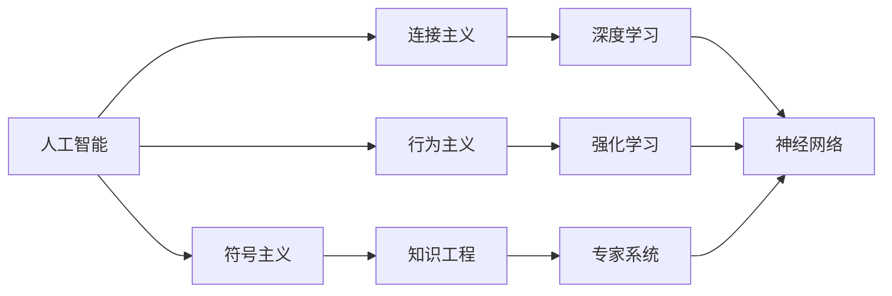

                 

# 1956年达特茅斯会议的影响

> 关键词：
- 达特茅斯会议
- 人工智能历史
- 计算机科学
- 人工智能发展
- 技术变革

## 1. 背景介绍

### 1.1 会议简介
1956年达特茅斯会议（Dartmouth Conference on Artificial Intelligence, DAC）被认为是人工智能（AI）的起源。它于7月20日在美国新罕布什尔州达特茅斯学院举行，并由约翰·麦卡锡、克劳德·香农、纳撒尼尔·罗切斯特和马文·明斯基四名先驱主持。会议汇集了20名参与者，共同探讨了人工智能的理论基础和应用前景。

### 1.2 会议背景
20世纪50年代末，计算机科学和认知科学等领域迅猛发展。自1936年图灵提出“图灵机”概念以来，科学家们开始关注计算机是否能模拟人类的智能。香农等人在1950年发表的论文中提出了“信息理论”，为人工智能提供了重要的理论基础。计算机科学、数学、心理学等领域交叉融合，奠定了AI研究的多学科基础。

达特茅斯会议标志着人工智能的正式诞生，成为计算机科学领域的一座里程碑。这次会议极大地推动了AI的研究和发展，对后续几十年的AI发展产生了深远影响。

## 2. 核心概念与联系

### 2.1 核心概念概述

为了深入理解达特茅斯会议的影响，我们需要先了解几个核心概念：

1. **人工智能（Artificial Intelligence, AI）**：使机器能够模仿人类智能执行任务的技术，包括感知、推理、学习、交流等。

2. **符号主义（Symbolic AI）**：早期的AI研究方法，使用符号语言和规则系统表示知识，通过推理机进行决策和解决问题。

3. **连接主义（Connectionist AI）**：使用神经网络模型模拟人脑工作机制，通过数据驱动学习进行知识表示和推理。

4. **行为主义（Behaviorist AI）**：强调通过环境和行为对机器进行训练，使机器能够自动适应复杂环境。

5. **心理学**：AI研究借鉴了心理学原理，包括认知心理学、符号学等，以理解人类思维和行为的机制。

### 2.2 核心概念间的关系

达特茅斯会议奠定了AI研究的基本方向和核心概念。通过这次会议，AI研究者们共同确立了人工智能研究的目标和方法，奠定了后续数十年的发展基础。核心概念之间的联系可以通过以下Mermaid流程图来展示：



这个流程图展示了人工智能及其主要研究方向之间的关系：

- **符号主义**：早期的AI研究方法，使用符号语言和规则系统表示知识，通过推理机进行决策和解决问题。
- **连接主义**：使用神经网络模型模拟人脑工作机制，通过数据驱动学习进行知识表示和推理。
- **行为主义**：强调通过环境和行为对机器进行训练，使机器能够自动适应复杂环境。

这些研究方向共同构成了人工智能研究的多学科基础。其中，**符号主义**和**连接主义**是人工智能研究的主要分支，而**行为主义**则拓展了AI的应用范围。这些方法在后续数十年的研究中不断演进和融合，推动了AI技术的进步。

## 3. 核心算法原理 & 具体操作步骤
### 3.1 算法原理概述

达特茅斯会议的主要成果之一是确立了人工智能研究的基本方向和方法。早期的人工智能研究主要基于符号主义，使用逻辑推理和知识表示系统来模拟人类智能。这种研究方法的核心是**知识表示（Knowledge Representation）**和**推理（Reasoning）**。

知识表示使用符号语言和规则系统表示领域知识，包括事实、规则、假设等。推理则是通过逻辑推理和规则系统，从已知事实和规则推导出新的知识。这种研究方法被称为**符号主义**，其核心算法是**推理机（Reasoner）**，即通过执行一系列推理规则来解决问题。

### 3.2 算法步骤详解

符号主义AI的核心步骤如下：

1. **知识表示**：将领域知识表示成符号语言，通常使用谓词逻辑、产生式规则、框架等形式。
2. **推理机**：根据已知的规则和事实，使用推理机执行一系列推理步骤，得出新的结论。
3. **反馈机制**：将推理结果反馈到知识库，更新知识表示，以便更好地解决类似的问题。

这些步骤构成了符号主义AI的基本框架，其核心是知识的表示和推理。通过不断迭代和优化，可以逐步提升AI系统的性能。

### 3.3 算法优缺点

符号主义AI的优点包括：

- **明确性**：通过明确的规则和符号语言，可以精确地表示和推理知识。
- **可解释性**：符号系统易于理解和解释，便于调试和改进。

其缺点主要包括：

- **复杂性**：需要构建复杂的知识库和推理规则，实现难度较大。
- **知识获取**：知识获取通常需要领域专家的参与，成本较高。

### 3.4 算法应用领域

符号主义AI广泛应用于专家系统（Expert System）、规则引擎（Rule Engine）、知识图谱（Knowledge Graph）等领域。这些系统通过模拟领域专家的知识和推理，实现了在特定领域的高效自动化处理。

## 4. 数学模型和公式 & 详细讲解  
### 4.1 数学模型构建

符号主义AI的核心是知识表示和推理。知识表示通常使用谓词逻辑（Predicate Logic）进行形式化描述。推理则通过逻辑推理机实现。这里介绍一个简单的例子：

假设我们要定义一个关于天气预报的逻辑系统。可以定义以下谓词：

- `Rain(r)`：表示“下雨”
- `Sunny(s)`：表示“晴天”
- `Cloudy(c)`：表示“多云”

以及以下规则：

- 如果当前是晴天，并且气压下降，则有概率下雨。

这可以用以下逻辑公式表示：

$$
\forall s, \exists r, (Rain(r) \land \neg Sunny(s)) \rightarrow (Cloudy(c) \land \text{PRESSURE\_DOWN})
$$

### 4.2 公式推导过程

以上述规则为例，进行推导：

1. 假设当前天气为晴天，气压下降。
2. 根据规则，如果当前天气为晴天且气压下降，则有概率下雨。
3. 将规则应用到当前情况，得到：`Cloudy(c)`。

这说明当前天气有概率变为多云，可能下雨。

### 4.3 案例分析与讲解

通过天气预报的例子，可以看到符号主义AI的逻辑推理过程。符号系统通过明确的知识表示和规则推理，可以自动推导出新的结论。这种推理过程清晰、可解释，适合处理结构化、规则化的问题。

## 5. 项目实践：代码实例和详细解释说明
### 5.1 开发环境搭建

为了实现符号主义AI，我们需要使用Python编程语言和Sympy库进行逻辑推理。以下是开发环境的搭建流程：

1. 安装Python：从官网下载并安装Python，建议使用最新稳定版本。
2. 安装Sympy：在命令行中运行`pip install sympy`，安装Sympy库。
3. 创建Python项目：使用`python3 -m venv myproj`创建虚拟环境，进入环境后运行`pip install --no-index --find-links ./myproj requirements.txt`安装项目依赖。

### 5.2 源代码详细实现

以下是一个简单的Python代码，实现一个基于符号主义的天气预报系统：

```python
from sympy import symbols, And, Or, Not, Rational

# 定义符号
sunny, rain, cloudy = symbols('sunny rain cloudy')
pressure_down = symbols('pressure_down')

# 定义规则
rules = [
    And(sunny, pressure_down, Not(rain)) >> cloudy
]

# 推理过程
current_weather = sunny
if pressure_down:
    for rule in rules:
        if rule.subs({sunny: current_weather, pressure_down: pressure_down}):
            current_weather = cloudy
```

### 5.3 代码解读与分析

- `sunny, rain, cloudy`：定义天气状态的符号。
- `pressure_down`：气压下降的符号。
- `rules`：定义一组规则，使用`And`、`Or`、`Not`等逻辑运算符表示。
- `current_weather`：当前天气状态，初始化为晴天。
- `if pressure_down`：如果气压下降，则根据规则进行推理。

### 5.4 运行结果展示

通过运行上述代码，可以验证天气预报系统的推理过程。如果当前天气为晴天，且气压下降，则输出多云，可能下雨。

```python
current_weather = sunny
if pressure_down:
    for rule in rules:
        if rule.subs({sunny: current_weather, pressure_down: pressure_down}):
            current_weather = cloudy
print(current_weather)
```

输出结果：`cloudy`

## 6. 实际应用场景
### 6.1 专家系统

专家系统（Expert System）是符号主义AI的重要应用场景。通过构建领域专家的知识和推理规则，专家系统能够在特定领域内提供高效、可靠的自动化处理。例如，在医疗领域，专家系统可以根据病人的症状和历史数据，自动诊断疾病并提供治疗建议。

### 6.2 规则引擎

规则引擎（Rule Engine）通过执行一系列规则，实现对特定场景的自动化处理。例如，金融领域中的交易规则引擎，可以根据交易数据和市场信息，自动执行买入或卖出操作。

### 6.3 知识图谱

知识图谱（Knowledge Graph）是一种结构化的知识表示方法，通过节点和边表示实体和关系，实现知识的图结构化表示和推理。例如，在电子商务领域，知识图谱可以用于商品推荐、价格预测等。

## 7. 工具和资源推荐
### 7.1 学习资源推荐

为了系统掌握符号主义AI的知识，推荐以下学习资源：

1. 《人工智能基础》（周志华著）：详细介绍了人工智能的基本概念和历史发展，包括符号主义和连接主义AI。
2. 《知识表示与推理》（王斌著）：介绍了知识表示和推理的核心算法和应用。
3. 《Prolog语言与程序设计》（Anthony J. Cook著）：介绍了Prolog语言及其在知识表示和推理中的应用。
4. 《符号人工智能》（Symbolic Artificial Intelligence）在线课程：由斯坦福大学和密歇根大学开设的课程，系统讲解符号主义AI的理论和实践。

### 7.2 开发工具推荐

开发符号主义AI时，常用的工具包括：

1. Python：编程语言，支持符号逻辑和推理库。
2. Sympy：符号计算库，支持逻辑推理和数学计算。
3. Prolog：一种逻辑编程语言，用于知识表示和推理。
4. GAP：集合论和代数计算软件，支持复杂的符号计算。

### 7.3 相关论文推荐

达特茅斯会议奠定了人工智能研究的基本方向和方法。以下是几篇奠基性的相关论文，推荐阅读：

1. "Artificial Intelligence: A Modern Approach"（Russell & Norvig）：介绍了AI的基本概念、方法和应用，是AI领域的经典教材。
2. "Symbolic and Subsymbolic Approaches to Reasoning"（Newell & Simon）：介绍了符号主义和连接主义AI的研究方向和应用。
3. "Expert Systems"（Holte & Rintner）：介绍了专家系统的原理和应用，是早期AI研究的经典文献。

这些资源和工具将帮助开发者深入理解符号主义AI的理论和实践，提升开发效率。

## 8. 总结：未来发展趋势与挑战
### 8.1 总结

达特茅斯会议对人工智能的发展产生了深远影响，确立了AI研究的基本方向和方法。符号主义AI通过明确的知识表示和推理机制，为AI研究奠定了基础，并推动了专家系统、规则引擎、知识图谱等技术的发展。

### 8.2 未来发展趋势

未来，符号主义AI将继续在专家系统、知识图谱等领域发挥重要作用。同时，随着连接主义AI的不断发展，符号主义AI将与连接主义AI进行更深层次的融合，形成更加强大的AI系统。

### 8.3 面临的挑战

尽管符号主义AI具有明确的规则和推理机制，但在实际应用中也面临诸多挑战：

1. **知识获取**：构建知识库需要领域专家的参与，成本较高。
2. **推理复杂性**：符号系统需要处理大量的复杂规则和事实，推理难度较大。
3. **动态变化**：现实世界中的复杂性使得符号系统难以灵活应对动态变化。

### 8.4 研究展望

未来，符号主义AI的研究将重点集中在以下几个方面：

1. **知识表示的自动化**：通过自动获取和构建知识库，降低人工成本，提高知识表示的准确性。
2. **推理机的优化**：通过优化推理机，提高推理速度和效率，适应动态变化的复杂环境。
3. **多模态知识融合**：将符号主义AI与连接主义AI进行融合，实现多模态知识的表示和推理。

通过不断优化和融合，符号主义AI将更好地适应现实世界的复杂性和动态变化，提升AI系统的性能和应用范围。

## 9. 附录：常见问题与解答
### Q1: 什么是符号主义AI？

A: 符号主义AI是一种基于符号语言和规则系统的AI研究方法。其核心是知识表示和推理，通过明确的知识表示和逻辑推理机制，实现对特定领域的高效自动化处理。

### Q2: 达特茅斯会议对人工智能的发展有哪些重要影响？

A: 达特茅斯会议奠定了人工智能研究的基本方向和方法，确立了符号主义AI的核心地位，推动了专家系统、规则引擎、知识图谱等技术的发展，对后续数十年的AI发展产生了深远影响。

### Q3: 符号主义AI的优缺点有哪些？

A: 符号主义AI的优点包括明确的规则和符号语言，易于理解和解释。缺点包括构建知识库和推理规则的成本较高，知识获取和推理复杂。

### Q4: 符号主义AI在实际应用中有哪些局限性？

A: 符号主义AI在实际应用中面临知识获取、推理复杂性和动态变化等挑战。需要通过自动化知识表示和优化推理机等方式，提高系统的性能和适应性。

### Q5: 未来符号主义AI的研究方向有哪些？

A: 未来符号主义AI的研究方向包括自动化知识表示、优化推理机、多模态知识融合等。这些研究将推动符号主义AI更好地适应现实世界的复杂性和动态变化，提升AI系统的性能和应用范围。

通过以上讨论，我们可以更深入地理解达特茅斯会议对人工智能发展的深远影响，并展望未来AI技术的发展趋势。符号主义AI作为早期AI研究的重要分支，将继续发挥重要作用，并与其他AI研究方法进行深度融合，推动AI技术在各个领域的应用和发展。

