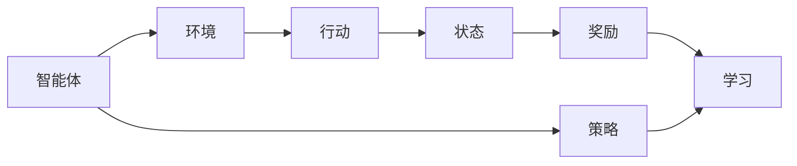

                 

## 1. 背景介绍

### 1.1 问题由来

在过去几十年中，随着城市化进程的加快，交通拥堵问题变得越来越严重。拥堵不仅导致交通效率低下，还严重影响了城市环境质量和居民生活质量。智能化交通系统被认为是解决这一问题的重要手段，其中强化学习在智能交通中的应用越来越受到关注。

### 1.2 问题核心关键点

强化学习在智能交通系统中的应用，主要涉及以下几个关键点：

1. **动态交通流的优化**：强化学习可以用于实时优化交通信号灯、路况、行车路线等，从而提升道路通行效率。
2. **自动驾驶**：通过强化学习，可以训练自动驾驶汽车在复杂交通环境中的决策能力，实现更安全的驾驶。
3. **路径规划与导航**：强化学习可以优化路径规划算法，提高导航系统的准确性和效率。
4. **交通流量预测**：强化学习可以用于交通流量预测，为城市规划和交通管理提供科学依据。
5. **节能减排**：通过优化交通流，强化学习有助于减少燃料消耗和碳排放，推动绿色交通发展。

### 1.3 问题研究意义

强化学习在智能交通系统中的应用，对于提升交通系统的智能化水平、提高交通效率、改善环境质量具有重要意义：

1. **降低交通拥堵**：通过智能交通系统，可以有效缓解城市交通压力，提高道路通行效率。
2. **提升安全水平**：通过自动驾驶和智能导航，减少交通事故，提高行车安全性。
3. **促进节能减排**：优化交通流，减少燃料消耗和碳排放，推动绿色交通发展。
4. **推动技术进步**：强化学习为交通系统智能化提供了新手段，推动相关技术的发展。
5. **提高管理效率**：通过智能系统，可以实现对交通数据的实时监测和分析，提高交通管理效率。

## 2. 核心概念与联系

### 2.1 核心概念概述

强化学习（Reinforcement Learning, RL）是一种机器学习方法，通过与环境的交互，智能体（agent）学习如何在特定环境中采取行动以最大化长期奖励。智能交通系统可以看作是一个复杂的动态系统，通过强化学习，可以不断优化交通信号灯、车辆控制等关键因素，实现智能化管理。

### 2.2 核心概念间的关系

以下是一个简化的强化学习流程：



这个流程图展示了强化学习的基本流程：

1. **智能体（A）**：在智能交通系统中，智能体可以是交通信号灯、自动驾驶汽车等。
2. **环境（B）**：交通系统的状态和环境，如道路交通流量、天气、交通事故等。
3. **行动（C）**：智能体采取的具体行动，如调整信号灯、改变车速等。
4. **状态（D）**：环境的当前状态，如交通流量、车辆位置等。
5. **奖励（E）**：根据智能体的行动，环境给予的奖励，如减少交通延误、提高通行效率等。
6. **学习（F）**：智能体根据奖励信息调整行动策略，以最大化长期奖励。
7. **策略（G）**：智能体采取行动的策略，如Q-learning、策略梯度等。

这些概念共同构成了强化学习在智能交通系统中的应用框架。

## 3. 核心算法原理 & 具体操作步骤
### 3.1 算法原理概述

强化学习的核心思想是通过与环境的交互，智能体学习如何在特定环境中采取行动以最大化长期奖励。在智能交通系统中，强化学习可以应用于交通信号灯控制、自动驾驶决策、路径规划等多个方面。

具体而言，智能体通过与交通环境的交互，不断调整行动策略，以最大化如交通流畅度、通行效率、安全性等长期奖励。智能体的行动通过模型预测，并根据环境反馈调整，最终形成一个最优的行动策略。

### 3.2 算法步骤详解

强化学习的算法步骤通常包括：

1. **环境建模**：建立交通环境的数学模型，包括交通流量、路况、车辆行为等。
2. **智能体设计**：设计智能体的行动策略和决策过程，如Q-learning、策略梯度等。
3. **状态表示**：将交通环境的状态编码为智能体可以理解和处理的形式，如状态空间、状态特征等。
4. **行动空间**：定义智能体的行动空间，如信号灯的控制状态、车辆的速度和方向等。
5. **奖励设计**：设计奖励函数，如减少交通延误、提高通行效率等。
6. **训练与优化**：通过与环境的交互，不断调整智能体的行动策略，以最大化长期奖励。
7. **模型评估**：评估强化学习模型的性能，如通过测试集进行模型验证和优化。

### 3.3 算法优缺点

强化学习在智能交通系统中的应用具有以下优点：

1. **自适应性强**：强化学习能够适应复杂的交通环境，实时优化交通信号灯、车辆控制等，提高系统响应速度。
2. **高效性**：强化学习可以通过与环境的实时交互，快速调整行动策略，提升交通系统的效率。
3. **鲁棒性好**：强化学习算法能够在各种环境下工作，具有一定的鲁棒性。

同时，强化学习也存在一些缺点：

1. **复杂度高**：交通系统的复杂性较高，强化学习的模型训练和优化过程较为复杂。
2. **模型选择难度大**：不同的交通场景可能需要不同的智能体模型，模型选择和优化难度较大。
3. **数据依赖性强**：强化学习需要大量的历史数据进行训练，数据收集和处理成本较高。

### 3.4 算法应用领域

强化学习在智能交通系统中的应用，主要包括以下几个领域：

1. **交通信号控制**：通过强化学习优化交通信号灯的控制策略，减少交通延误，提高通行效率。
2. **自动驾驶**：通过强化学习训练自动驾驶汽车，使其在复杂交通环境中做出最优决策。
3. **路径规划与导航**：通过强化学习优化路径规划算法，提高导航系统的准确性和效率。
4. **交通流量预测**：通过强化学习预测交通流量，为城市规划和交通管理提供科学依据。
5. **智能停车管理**：通过强化学习优化停车场管理，提高停车场的利用率和效率。

## 4. 数学模型和公式 & 详细讲解
### 4.1 数学模型构建

强化学习的数学模型主要包括状态空间、行动空间、奖励函数和价值函数等。在智能交通系统中，这些模型可以表示为：

- **状态空间**：交通环境的状态，如交通流量、车辆位置、信号灯状态等。
- **行动空间**：智能体的行动，如信号灯的控制状态、车辆的速度和方向等。
- **奖励函数**：智能体采取行动后获得的奖励，如减少交通延误、提高通行效率等。
- **价值函数**：表示智能体在特定状态下，采取特定行动的期望奖励。

### 4.2 公式推导过程

以Q-learning为例，其核心公式为：

$$
Q(s, a) = Q(s, a) + \alpha [R(s, a) + \gamma \max_{a'} Q(s', a')] - Q(s, a)
$$

其中：
- $Q(s, a)$ 表示在状态 $s$ 下采取行动 $a$ 的价值。
- $R(s, a)$ 表示在状态 $s$ 下采取行动 $a$ 获得的即时奖励。
- $\gamma$ 表示折扣因子，表示未来奖励的权重。
- $\alpha$ 表示学习率，控制每次更新步长的大小。

公式推导过程如下：

1. **初始化**：将 $Q(s, a)$ 初始化为0。
2. **行动选择**：在当前状态 $s$ 下，根据策略 $\epsilon$-greedy（以 $\epsilon$ 的概率随机选择行动，以 $1-\epsilon$ 的概率选择最优行动）选择行动 $a$。
3. **状态更新**：观察行动 $a$ 导致的状态 $s'$ 和即时奖励 $R(s, a)$。
4. **价值更新**：根据Q-learning公式，更新 $Q(s, a)$。

### 4.3 案例分析与讲解

假设有一个十字路口，交通信号灯有红、黄、绿三种状态。在状态 $s$ 下，智能体可以选择两种行动：将信号灯设置为红色或绿色。智能体希望最大化交通流畅度，即在状态 $s$ 下采取行动 $a$ 后，能使得交通流量最大。

通过Q-learning算法，智能体可以学习到最优的信号灯控制策略。具体步骤如下：

1. **初始化**：将 $Q(s, a)$ 初始化为0。
2. **行动选择**：在状态 $s$ 下，以 $\epsilon$ 的概率随机选择行动，以 $1-\epsilon$ 的概率选择最优行动。
3. **状态更新**：观察行动 $a$ 导致的状态 $s'$ 和即时奖励 $R(s, a)$。
4. **价值更新**：根据Q-learning公式，更新 $Q(s, a)$。

假设智能体在状态 $s$ 下选择将信号灯设置为绿色，并观察到状态 $s'$ 和即时奖励 $R(s, a)$。通过不断重复上述过程，智能体可以逐步学习到最优的信号灯控制策略。

## 5. 项目实践：代码实例和详细解释说明
### 5.1 开发环境搭建

为了进行强化学习在智能交通系统中的应用研究，我们需要搭建合适的开发环境。以下是Python环境搭建的步骤：

1. **安装Python**：安装Python 3.7及以上版本。
2. **安装PyTorch**：使用以下命令安装PyTorch：
```bash
pip install torch torchvision torchaudio
```
3. **安装OpenAI Gym**：OpenAI Gym是一个用于强化学习研究的环境库，包含多种环境。使用以下命令安装：
```bash
pip install gym
```
4. **安装TensorBoard**：用于可视化训练过程和结果。使用以下命令安装：
```bash
pip install tensorboard
```
5. **配置环境变量**：设置环境变量，使Python能够找到所需库。

### 5.2 源代码详细实现

以下是一个简单的强化学习示例代码，用于训练智能体控制十字路口的信号灯：

```python
import torch
import torch.nn as nn
import gym
import gym(boxenvs:ReinforcementLearning)
import numpy as np
from tensorboardX import SummaryWriter

class Net(nn.Module):
    def __init__(self):
        super(Net, self).__init__()
        self.fc1 = nn.Linear(3, 16)
        self.fc2 = nn.Linear(16, 3)

    def forward(self, x):
        x = torch.relu(self.fc1(x))
        x = self.fc2(x)
        return x

class Agent():
    def __init__(self, state_size, action_size, net_size, learning_rate, gamma):
        self.state_size = state_size
        self.action_size = action_size
        self.net = Net(state_size, action_size, net_size)
        self.optimizer = torch.optim.Adam(self.net.parameters(), lr=learning_rate)
        self.gamma = gamma
        self.memory = []

    def act(self, state):
        state = torch.tensor(state, dtype=torch.float32)
        with torch.no_grad():
            action_values = self.net(state)
            action = np.argmax(action_values.data.numpy())
        return action

    def learn(self, state, action, reward, next_state):
        state = torch.tensor(state, dtype=torch.float32)
        next_state = torch.tensor(next_state, dtype=torch.float32)
        action = torch.tensor([action], dtype=torch.long)
        action_values = self.net(state)
        next_action_values = self.net(next_state)
        target = reward + self.gamma * np.max(next_action_values.data.numpy())
        loss = nn.functional.smooth_l1_loss(torch.tensor(target, dtype=torch.float32), action_values)
        self.optimizer.zero_grad()
        loss.backward()
        self.optimizer.step()
```

### 5.3 代码解读与分析

在这个示例代码中，我们定义了两个类：Net和Agent。Net类用于定义神经网络的架构，Agent类用于定义智能体的行为和训练过程。

- **Net类**：定义了一个简单的神经网络，包含两个全连接层。输入是交通信号灯的状态（红、黄、绿），输出是采取的行动（设置信号灯的状态）。
- **Agent类**：
  - **初始化**：初始化智能体的神经网络、优化器、折扣因子等参数。
  - **act方法**：根据当前状态，选择最优的行动。
  - **learn方法**：根据当前状态、行动、奖励和下一个状态，更新神经网络的权重。

### 5.4 运行结果展示

在训练过程中，可以使用TensorBoard进行可视化。具体步骤如下：

1. **启动TensorBoard**：使用以下命令启动TensorBoard：
```bash
tensorboard --logdir=logs --port=6006
```
2. **查看结果**：在浏览器中输入 `http://localhost:6006/` 访问TensorBoard，查看训练过程中的损失、奖励等指标。

## 6. 实际应用场景

### 6.1 智能交通信号灯控制

强化学习可以应用于交通信号灯控制，通过实时优化信号灯控制策略，减少交通延误，提高通行效率。例如，通过强化学习，智能体可以学习到在不同交通流量下，如何调整信号灯的控制策略，使得车辆能够在红灯时间通过十字路口，减少等待时间。

### 6.2 自动驾驶决策

强化学习可以用于训练自动驾驶汽车，使其在复杂交通环境中做出最优决策。例如，在城市道路环境中，智能体可以学习到如何根据前车、行人、交通信号灯等环境因素，做出最优的加速、减速、转向等决策。

### 6.3 路径规划与导航

强化学习可以优化路径规划算法，提高导航系统的准确性和效率。例如，在地图规划中，智能体可以学习到如何在多条路径中选择最优路径，以最小化行驶时间和距离。

### 6.4 交通流量预测

强化学习可以用于交通流量预测，为城市规划和交通管理提供科学依据。例如，在城市交通预测中，智能体可以学习到如何根据历史交通数据，预测未来的交通流量和拥堵情况，为交通管理提供决策支持。

### 6.5 智能停车管理

强化学习可以优化停车场管理，提高停车场的利用率和效率。例如，在停车场管理中，智能体可以学习到如何根据车辆进入和离开的实时数据，优化停车位的分配和调度，减少车辆等待时间。

## 7. 工具和资源推荐
### 7.1 学习资源推荐

为了深入学习强化学习在智能交通系统中的应用，推荐以下学习资源：

1. 《强化学习：基础与进阶》书籍：由美国斯坦福大学David Silver教授所著，深入浅出地介绍了强化学习的基本概念和应用，是学习强化学习的经典教材。
2. OpenAI Gym官方文档：Gym是一个用于强化学习研究的开源环境库，包含多种环境，是学习强化学习的必备工具。
3. 强化学习教程（Reinforcement Learning）：由谷歌开发者社区提供的强化学习教程，涵盖从基础到高级的强化学习内容，适合初学者和进阶学习者。
4. DeepMind博客：DeepMind公司发布的强化学习相关博客，涵盖最新研究进展和应用案例，是了解强化学习前沿动态的优质资源。
5. Coursera强化学习课程：Coursera提供的强化学习相关课程，由顶级大学教授授课，涵盖强化学习的各个方面。

### 7.2 开发工具推荐

为了进行强化学习在智能交通系统中的应用研究，推荐以下开发工具：

1. PyTorch：一个用于深度学习的开源框架，提供了强大的GPU加速和动态计算图，适合强化学习研究。
2. TensorBoard：一个用于可视化训练过程和结果的工具，适合跟踪模型训练指标和结果。
3. OpenAI Gym：一个用于强化学习研究的开源环境库，提供了多种环境，方便进行模型训练和测试。
4. NumPy：一个用于科学计算的Python库，提供了高效的数组运算和线性代数计算功能。
5. Matplotlib：一个用于数据可视化的Python库，提供了多种绘图工具，适合绘制训练过程中的曲线和图表。

### 7.3 相关论文推荐

为了深入了解强化学习在智能交通系统中的应用，推荐以下相关论文：

1. "Learning to Drive"（DeepMind）：DeepMind公司在自动驾驶领域的研究，通过强化学习训练自动驾驶汽车，展示了其在复杂交通环境中的决策能力。
2. "Traffic Light Control using Reinforcement Learning"（Google）：谷歌公司在其研究中，使用强化学习优化交通信号灯控制策略，实现了交通流畅度的显著提升。
3. "Modeling and Optimization of GPS Path Planning Algorithm"（IET）：IET（Institute of Engineering and Technology）的研究论文，提出了基于强化学习的路径规划算法，提高了导航系统的准确性和效率。
4. "A Reinforcement Learning Approach to Smart Parking Management"（IEEE）：IEEE（Institute of Electrical and Electronics Engineers）的研究论文，提出了基于强化学习的停车场管理算法，提高了停车场的利用率和效率。
5. "Intelligent Traffic Flow Prediction Using Reinforcement Learning"（Springer）：Springer出版的论文，提出了基于强化学习的交通流量预测模型，为城市规划和交通管理提供了科学依据。

## 8. 总结：未来发展趋势与挑战
### 8.1 研究成果总结

强化学习在智能交通系统中的应用，已经取得了显著的成果，展示了其在优化交通流、提高安全水平、节能减排等方面的巨大潜力。通过智能体与环境的交互，强化学习能够实时优化交通信号灯、车辆控制等关键因素，提高交通系统的效率和安全性。

### 8.2 未来发展趋势

未来，强化学习在智能交通系统中的应用将呈现以下几个发展趋势：

1. **更高效的学习算法**：随着深度学习技术的发展，新的强化学习算法（如强化学习结合深度学习、强化学习结合进化算法等）将进一步提升智能体的学习效率。
2. **更复杂的交通环境**：智能交通系统将面临更加复杂的交通环境，如自动驾驶、智能停车等，强化学习需要适应更多的复杂场景。
3. **更广泛的智能体应用**：除了交通信号灯控制、路径规划等，强化学习还将应用于更广泛的智能体，如智能导航系统、智能停车系统等。
4. **更高级的决策能力**：智能体的决策能力将进一步提升，能够更好地适应动态变化的环境，做出更优的决策。
5. **更实时的数据处理**：强化学习需要处理大量的实时数据，未来的算法将更加注重数据处理效率，以适应动态变化的环境。

### 8.3 面临的挑战

尽管强化学习在智能交通系统中的应用前景广阔，但也面临一些挑战：

1. **数据获取难度大**：智能交通系统需要大量的实时数据，数据获取难度大，成本高。
2. **模型复杂度高**：智能交通系统复杂度高，强化学习的模型训练和优化过程较为复杂。
3. **鲁棒性差**：强化学习算法在不同环境下的鲁棒性差，需要进一步提升其鲁棒性。
4. **计算资源需求高**：强化学习需要大量的计算资源进行训练，计算资源需求高。
5. **模型可解释性差**：强化学习模型往往是"黑盒"模型，难以解释其决策过程。

### 8.4 研究展望

未来的研究需要在以下几个方面进行探索：

1. **多智能体系统**：探索多智能体系统在智能交通中的应用，提升系统的协作能力和整体效率。
2. **混合决策算法**：探索混合决策算法，结合强化学习和传统决策算法，提升系统的决策能力。
3. **跨模态学习**：探索跨模态学习，结合视觉、语音等模态数据，提升系统的综合感知能力。
4. **隐私保护**：探索隐私保护技术，保护用户数据的隐私和安全。
5. **伦理道德**：探索伦理道德约束，确保系统决策的公正性和合法性。

总之，强化学习在智能交通系统中的应用前景广阔，但也需要面对数据获取、模型复杂度、鲁棒性等方面的挑战。未来的研究需要不断突破，探索新的技术和方法，以实现智能交通系统的高效、安全、环保的目标。

## 9. 附录：常见问题与解答

**Q1: 强化学习在智能交通系统中的应用有哪些优势和局限性？**

A: 强化学习在智能交通系统中的应用有以下优势：

1. **自适应性强**：强化学习能够适应复杂的交通环境，实时优化交通信号灯、车辆控制等，提高系统响应速度。
2. **高效性**：强化学习可以通过与环境的实时交互，快速调整行动策略，提升交通系统的效率。
3. **鲁棒性好**：强化学习算法能够在各种环境下工作，具有一定的鲁棒性。

但强化学习在智能交通系统中的应用也存在一些局限性：

1. **数据获取难度大**：智能交通系统需要大量的实时数据，数据获取难度大，成本高。
2. **模型复杂度高**：智能交通系统复杂度高，强化学习的模型训练和优化过程较为复杂。
3. **鲁棒性差**：强化学习算法在不同环境下的鲁棒性差，需要进一步提升其鲁棒性。

**Q2: 强化学习在智能交通系统中的应用如何处理数据？**

A: 强化学习在智能交通系统中的应用需要处理大量的实时数据，一般采用以下方法：

1. **数据采集**：通过传感器、摄像头、GPS等设备采集交通数据，如交通流量、车辆位置、交通信号灯状态等。
2. **数据预处理**：对采集到的数据进行预处理，如数据清洗、特征提取等，以便于模型训练。
3. **数据存储**：将处理后的数据存储在数据库中，以便于模型训练和实时访问。
4. **数据增强**：通过数据增强技术，扩充训练集，提升模型的泛化能力。

**Q3: 强化学习在智能交通系统中的应用需要哪些先决条件？**

A: 强化学习在智能交通系统中的应用需要以下先决条件：

1. **硬件设备**：需要高性能的计算机和GPU设备进行模型训练和推理。
2. **数据资源**：需要大量的实时交通数据进行模型训练。
3. **算法知识**：需要具备一定的强化学习算法知识，如Q-learning、策略梯度等。
4. **模型训练**：需要具有数据处理和模型训练的能力，掌握Python、PyTorch等工具。
5. **系统集成**：需要具备系统集成的能力，将模型嵌入到实际应用系统中。

**Q4: 强化学习在智能交通系统中的应用有哪些典型的案例？**

A: 强化学习在智能交通系统中的应用有以下典型案例：

1. **交通信号灯控制**：通过强化学习优化交通信号灯控制策略，减少交通延误，提高通行效率。
2. **自动驾驶决策**：通过强化学习训练自动驾驶汽车，使其在复杂交通环境中做出最优决策。
3. **路径规划与导航**：通过强化学习优化路径规划算法，提高导航系统的准确性和效率。
4. **交通流量预测**：通过强化学习预测交通流量，为城市规划和交通管理提供科学依据。
5. **智能停车管理**：通过强化学习优化停车场管理，提高停车场的利用率和效率。

总之，强化学习在智能交通系统中的应用前景广阔，具有巨大的发展潜力和应用价值。

---

作者：禅与计算机程序设计艺术 / Zen and the Art of Computer Programming

