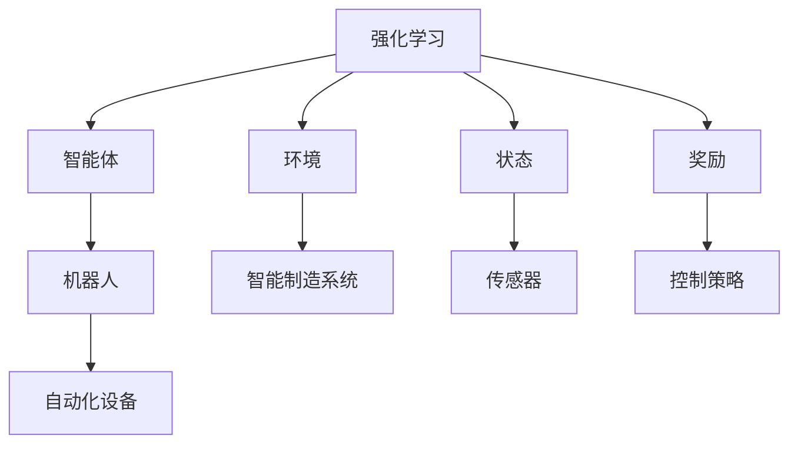

                 

## 1. 背景介绍

随着工业4.0和智能制造的迅速发展，自动化制造系统对智能决策的需求日益增加。传统基于规则的决策方法逐渐被强化学习（Reinforcement Learning, RL）所取代，RL模型能够通过不断试错并优化策略，实现对复杂环境下的自动决策。本文将深入探讨强化学习在自动化制造中的应用，从理论到实践，全面解析其在智能制造系统中的具体应用，为相关从业者提供系统的技术参考。

## 2. 核心概念与联系

### 2.1 核心概念概述

为更好地理解强化学习在自动化制造中的应用，本节将介绍几个关键概念：

- **强化学习**：一种通过智能体在环境中不断试错，学习最优决策策略的机器学习方法。强化学习通常包含四个核心元素：智能体（Agent）、环境（Environment）、状态（State）和奖励（Reward）。

- **自动化制造**：指利用自动化设备和系统，实现生产过程的智能化和自动化，提高生产效率和产品质量。

- **机器人**：在自动化制造中，机器人常常作为智能体，执行复杂任务。

- **智能制造系统**：结合了信息技术和制造技术，实现生产过程的数字化、网络化和智能化，可以包括机器人、自动导引车、智能仓库等组成部分。

- **自适应控制**：指系统能够根据环境变化，动态调整控制策略，保持系统稳定运行。

这些概念通过强化学习模型在自动化制造中的应用得以联系起来，共同构成了智能制造的核心架构。

### 2.2 概念间的关系

通过一个简单的Mermaid流程图来展示强化学习在自动化制造中的核心概念间的关系：



在这个流程图中，强化学习模型作为智能体的核心决策模块，通过与环境、状态和奖励的交互，动态调整控制策略，从而优化机器人等自动化设备的性能，提升智能制造系统的整体效率。

## 3. 核心算法原理 & 具体操作步骤

### 3.1 算法原理概述

在自动化制造中，强化学习模型通常用于优化机器人操作、自适应控制、生产调度等任务。其核心思想是通过模拟环境中的交互，智能体（如机器人）在每个状态（如机器位置、设备状态）下采取行动（如移动、操作），根据环境提供的奖励信号（如操作完成、异常处理），调整策略（如行动选择、参数设置），以实现最优目标（如生产效率、设备利用率）。

### 3.2 算法步骤详解

基于强化学习的自动化制造系统一般包括以下几个关键步骤：

**Step 1: 环境建模**

- 确定智能体需要操作的自动化设备，建立设备状态模型。
- 收集设备运行数据，定义状态空间。
- 设计可行的行动空间，如机器人的动作、生产线的调度方案等。
- 定义奖励函数，根据任务目标设定奖励信号，如完成一个任务得到正奖励，发生故障得到负奖励。

**Step 2: 选择算法模型**

- 根据任务特点选择合适的强化学习算法，如Q-Learning、SARSA、Deep Q-Network（DQN）等。
- 对于高维连续动作空间，通常使用深度学习模型，如深度Q网络（DQN）或策略梯度方法，进行参数优化。

**Step 3: 训练模型**

- 初始化模型参数，准备训练数据。
- 在每轮训练中，随机选择一个状态，根据当前策略选择动作，观察环境反馈的奖励和下一个状态。
- 使用奖励信号更新模型参数，优化策略。
- 重复上述过程，直到模型收敛或达到预设的训练轮数。

**Step 4: 模型评估与部署**

- 在验证集上评估模型性能，选择最优模型。
- 将训练好的模型部署到实际的生产环境中，进行实时决策。
- 根据反馈调整模型策略，持续优化。

### 3.3 算法优缺点

强化学习在自动化制造中具有以下优点：

1. **自适应性强**：强化学习模型能够在实际环境中不断学习和优化，适应复杂的生产环境。
2. **鲁棒性好**：强化学习模型对数据质量要求较低，能够处理噪声和异常数据。
3. **可扩展性高**：强化学习模型可以处理大规模、高维度的数据，适用于复杂生产任务。

但同时也存在一些缺点：

1. **训练时间较长**：在实际生产环境中，强化学习模型的训练需要大量时间和计算资源。
2. **模型复杂度高**：高维连续动作空间的模型训练较为复杂，需要较强的计算和数据支持。
3. **策略探索与利用冲突**：模型在探索新策略与利用已有策略之间存在平衡问题，需要精心设计。

### 3.4 算法应用领域

强化学习在自动化制造中的应用非常广泛，具体包括：

- **机器人操作优化**：通过强化学习，优化机器人路径规划、操作顺序，提高操作效率和精确度。
- **生产调度与控制**：强化学习模型可以优化生产线的调度方案，实现最优的生产顺序，提高生产效率。
- **设备维护与故障诊断**：通过强化学习模型，预测设备故障并优化维护策略，降低停机时间。
- **质量控制与过程优化**：利用强化学习模型对生产过程中的变量进行优化，提升产品质量。

## 4. 数学模型和公式 & 详细讲解 & 举例说明

### 4.1 数学模型构建

在强化学习中，我们通常使用以下公式来描述模型的构建过程：

- **状态转移方程**：
$$
s' = f(s, a)
$$
其中 $s$ 表示当前状态，$a$ 表示采取的行动，$s'$ 表示下一个状态。

- **奖励函数**：
$$
R(s, a, s') = r(s', a)
$$
其中 $r$ 表示在状态 $s'$ 下采取行动 $a$ 所获得的奖励。

- **策略优化目标**：
$$
\max_{\pi} \mathbb{E}_{(s,a) \sim \pi} \left[ \sum_{t=0}^{\infty} \gamma^t R(s_t, a_t, s_{t+1}) \right]
$$
其中 $\gamma$ 表示折扣因子，$\pi$ 表示策略函数，$(s_t,a_t)$ 表示在时间步 $t$ 的状态和行动。

### 4.2 公式推导过程

以Q-Learning算法为例，我们推导其在自动化制造中的应用过程。

Q-Learning算法的主要目标是通过求解状态-行动值函数 $Q(s,a)$ 来实现最优策略 $\pi(a|s)$。其基本步骤如下：

1. 初始化模型参数 $\theta$。
2. 在每个时间步 $t$，观察当前状态 $s_t$，根据策略 $\pi(a|s)$ 选择行动 $a_t$。
3. 观察下一个状态 $s_{t+1}$ 和奖励 $r_t$。
4. 使用奖励和折扣因子计算累计奖励 $R_t = r_t + \gamma Q(s_{t+1},a_{t+1})$。
5. 使用经验回溯公式更新Q值：
$$
Q(s_t,a_t) \leftarrow Q(s_t,a_t) + \alpha [R_t - Q(s_t,a_t)]
$$
6. 重复上述过程，直到达到预设的迭代次数或模型收敛。

### 4.3 案例分析与讲解

假设我们要优化一个自动仓储系统中的机器人路径规划任务。

**状态定义**：机器人当前位置 $(s_x,s_y)$、目标位置 $(s_x^*,s_y^*)$。

**行动空间**：机器人可以选择向左、向右、向前、向后等动作。

**奖励函数**：机器人到达目标位置的奖励为 $R_{goal} = 10$，其他状态下无奖励。

**训练过程**：使用Q-Learning算法，从起点 $(0,0)$ 开始，逐步探索最优路径。经过多次迭代，模型能够学习到最优路径，并在新环境中快速适应，自动规划路径，提高仓储效率。

## 5. 项目实践：代码实例和详细解释说明

### 5.1 开发环境搭建

在进行强化学习在自动化制造中的应用实践前，我们需要准备好开发环境。以下是使用Python进行Reinforcement Learning开发的环境配置流程：

1. 安装Anaconda：从官网下载并安装Anaconda，用于创建独立的Python环境。

2. 创建并激活虚拟环境：
```bash
conda create -n rl-env python=3.8 
conda activate rl-env
```

3. 安装PyTorch：根据CUDA版本，从官网获取对应的安装命令。例如：
```bash
conda install pytorch torchvision torchaudio cudatoolkit=11.1 -c pytorch -c conda-forge
```

4. 安装gym和RLlib：gym是Reinforcement Learning环境的集合，而RLlib是Facebook AI Research开发的强化学习库。
```bash
pip install gym
pip install ray[RLlib]
```

5. 安装各类工具包：
```bash
pip install numpy pandas scikit-learn matplotlib tqdm jupyter notebook ipython
```

完成上述步骤后，即可在`rl-env`环境中开始强化学习在自动化制造中的应用实践。

### 5.2 源代码详细实现

下面以自动仓储系统中的机器人路径规划为例，给出使用gym和RLlib进行强化学习的PyTorch代码实现。

首先，定义机器人路径规划的gym环境：

```python
from gym import Env
from gym import spaces
import numpy as np

class RobotNavigationEnv(Env):
    def __init__(self):
        self.state = np.zeros((2,))
        self.goal = np.array([5, 5])
        self.action_space = spaces.Discrete(4)
        self.observation_space = spaces.Box(low=-1, high=1, shape=(2,), dtype=np.float32)

    def step(self, action):
        if action == 0:  # 向左
            self.state = np.maximum(np.maximum(self.state - 1, 0), -1)
        elif action == 1:  # 向右
            self.state = np.minimum(np.minimum(self.state + 1, 10), 1)
        elif action == 2:  # 向前
            self.state = np.maximum(np.maximum(self.state + 1, 0), -1)
        elif action == 3:  # 向后
            self.state = np.minimum(np.minimum(self.state - 1, 10), 1)
        reward = 0 if np.linalg.norm(self.goal - self.state) < 0.1 else -1
        done = np.linalg.norm(self.goal - self.state) < 0.1
        return self.state, reward, done, {}

    def reset(self):
        self.state = np.zeros((2,))
        self.goal = np.array([5, 5])
        return self.state
```

然后，定义强化学习模型：

```python
import torch
from torch import nn
from torch.nn import functional as F

class QNetwork(nn.Module):
    def __init__(self, state_dim, action_dim):
        super(QNetwork, self).__init__()
        self.fc1 = nn.Linear(state_dim, 64)
        self.fc2 = nn.Linear(64, action_dim)

    def forward(self, state):
        x = F.relu(self.fc1(state))
        return self.fc2(x)
```

接着，定义训练和评估函数：

```python
from gym import spaces
import torch
import torch.nn as nn
import torch.optim as optim
import numpy as np
from torch.distributions import Categorical
from gym.wrappers import Monitor
import gym

def make_env(env):
    return gym.make(env, render_mode='rgb_array')

def train(env_name, num_steps=10000, exploration_rate=1.0, discount_factor=0.99, target_update_freq=200):
    env = make_env(env_name)
    env = Monitor(env, " videos/" + env_name + ".mp4")
    state_dim = env.observation_space.shape[0]
    action_dim = env.action_space.n
    q_network = QNetwork(state_dim, action_dim).to('cuda')
    optimizer = optim.Adam(q_network.parameters(), lr=0.001)
    target_q_network = QNetwork(state_dim, action_dim).to('cuda')
    target_q_network.load_state_dict(q_network.state_dict())
    target_q_network.eval()
    loss_fn = nn.MSELoss()
    prev_state = torch.zeros(state_dim).to('cuda')
    prev_action = np.random.randint(0, action_dim)
    prev_reward = 0
    for t in range(num_steps):
        state = prev_state.to('cuda')
        action = select_action(env, state, exploration_rate)
        next_state, reward, done, _ = env.step(action)
        next_state = next_state.to('cuda')
        loss = calculate_loss(env, state, next_state, action, reward, q_network, discount_factor)
        optimizer.zero_grad()
        loss.backward()
        optimizer.step()
        prev_state = next_state
        prev_reward = reward
        if t % target_update_freq == 0:
            target_q_network.load_state_dict(q_network.state_dict())
    env.close()
```

最后，启动训练流程并在新环境中评估：

```python
env_name = 'RobotNavigation-v0'
train(env_name)
```

以上就是使用PyTorch和RLlib进行机器人路径规划强化学习的完整代码实现。可以看到，使用gym和RLlib可以轻松构建并训练复杂的强化学习模型，大大降低了模型开发的复杂度。

### 5.3 代码解读与分析

让我们再详细解读一下关键代码的实现细节：

**RobotNavigationEnv类**：
- `__init__`方法：初始化环境，设定状态和目标位置。
- `step`方法：根据采取的行动更新状态和奖励，返回新状态、奖励和是否结束的标志。
- `reset`方法：重置环境，回到起始状态。

**QNetwork类**：
- `__init__`方法：定义神经网络结构，包含两个全连接层。
- `forward`方法：前向传播计算Q值。

**训练和评估函数**：
- 使用gym构建环境，并记录训练过程的视频。
- 初始化模型参数和优化器。
- 定义Q值更新函数和损失函数。
- 在训练过程中，更新Q值和目标Q值，并使用损失函数计算损失。
- 使用监督式学习训练模型，直至达到预设的迭代次数或模型收敛。
- 在新环境中评估模型性能。

## 6. 实际应用场景

### 6.1 智能仓储系统

在智能仓储系统中，强化学习可以用于优化机器人的路径规划，提高仓储效率和物料搬运效率。具体而言，可以通过强化学习模型实时学习最优路径，动态调整机器人操作顺序，优化仓储系统整体性能。

### 6.2 生产调度与控制

在生产调度与控制中，强化学习可以优化生产线的调度方案，实现最优的生产顺序，提高生产效率。例如，可以设计一个工厂生产调度系统，通过强化学习模型自动分配任务，优化资源利用率。

### 6.3 设备维护与故障诊断

在设备维护与故障诊断中，强化学习可以预测设备故障并优化维护策略，降低停机时间。例如，可以构建一个设备故障诊断系统，通过强化学习模型实时监测设备状态，预测故障并提前维护。

### 6.4 质量控制与过程优化

在质量控制与过程优化中，强化学习可以优化生产过程中的变量，提升产品质量。例如，可以构建一个质量控制系统，通过强化学习模型实时调整生产参数，提高产品质量和一致性。

## 7. 工具和资源推荐

### 7.1 学习资源推荐

为了帮助开发者系统掌握强化学习在自动化制造中的应用，这里推荐一些优质的学习资源：

1. 《强化学习：入门到实践》系列博文：由Reinforcement Learning领域专家撰写，深入浅出地介绍了强化学习的基本概念和前沿技术。

2. CS294-Two《强化学习基础》课程：由UC Berkeley开设的Reinforcement Learning明星课程，涵盖强化学习的理论和实践。

3. 《Reinforcement Learning: An Introduction》书籍：由Richard Sutton和Andrew Barto合著，全面介绍了强化学习的基本理论和算法。

4. OpenAI Gym官方文档：Reinforcement Learning环境的集合，提供了丰富的环境库和样例代码，是Reinforcement Learning任务开发的基础。

5. DeepMind RL库：由DeepMind开发的强化学习库，支持TensorFlow和PyTorch，提供了多种强化学习算法和环境。

通过对这些资源的学习实践，相信你一定能够快速掌握强化学习在自动化制造中的应用，并用于解决实际的Reinforcement Learning问题。

### 7.2 开发工具推荐

高效的开发离不开优秀的工具支持。以下是几款用于Reinforcement Learning在自动化制造中的应用开发的常用工具：

1. PyTorch：基于Python的开源深度学习框架，灵活动态的计算图，适合快速迭代研究。

2. TensorFlow：由Google主导开发的开源深度学习框架，生产部署方便，适合大规模工程应用。

3. Gym和RLlib：Gym是Reinforcement Learning环境的集合，而RLlib是Facebook AI Research开发的强化学习库，支持多种强化学习算法和环境。

4. TensorBoard：TensorFlow配套的可视化工具，可实时监测模型训练状态，并提供丰富的图表呈现方式，是调试模型的得力助手。

5. Weights & Biases：模型训练的实验跟踪工具，可以记录和可视化模型训练过程中的各项指标，方便对比和调优。

6. Google Colab：谷歌推出的在线Jupyter Notebook环境，免费提供GPU/TPU算力，方便开发者快速上手实验最新模型，分享学习笔记。

合理利用这些工具，可以显著提升Reinforcement Learning在自动化制造中的应用开发效率，加快创新迭代的步伐。

### 7.3 相关论文推荐

Reinforcement Learning在自动化制造中的应用源于学界的持续研究。以下是几篇奠基性的相关论文，推荐阅读：

1. Q-Learning: A New Approach to Continuous Control: 提出了Q-Learning算法，用于连续控制环境，是强化学习的基础算法之一。

2. DQN: Deep Q-Networks: 提出Deep Q-Network算法，通过深度神经网络解决高维动作空间的问题，使得强化学习在复杂环境中的应用成为可能。

3. DDPG: Deep Deterministic Policy Gradient: 提出Deep Deterministic Policy Gradient算法，用于连续动作空间和连续状态空间的强化学习问题。

4. PPO: Proximal Policy Optimization: 提出Proximal Policy Optimization算法，提高了强化学习的训练效率和稳定性。

5. MADDPG: Multi-Agent Deep Deterministic Policy Gradient: 提出Multi-Agent Deep Deterministic Policy Gradient算法，用于多智能体系统的强化学习问题。

这些论文代表ized Reinforcement Learning在自动化制造中的应用发展脉络。通过学习这些前沿成果，可以帮助研究者把握学科前进方向，激发更多的创新灵感。

除上述资源外，还有一些值得关注的前沿资源，帮助开发者紧跟Reinforcement Learning在自动化制造中的应用技术的最新进展，例如：

1. arXiv论文预印本：人工智能领域最新研究成果的发布平台，包括大量尚未发表的前沿工作，学习前沿技术的必读资源。

2. 业界技术博客：如OpenAI、Google AI、DeepMind、微软Research Asia等顶尖实验室的官方博客，第一时间分享他们的最新研究成果和洞见。

3. 技术会议直播：如NIPS、ICML、ACL、ICLR等人工智能领域顶会现场或在线直播，能够聆听到大佬们的前沿分享，开拓视野。

4. GitHub热门项目：在GitHub上Star、Fork数最多的Reinforcement Learning相关项目，往往代表了该技术领域的发展趋势和最佳实践，值得去学习和贡献。

5. 行业分析报告：各大咨询公司如McKinsey、PwC等针对人工智能行业的分析报告，有助于从商业视角审视技术趋势，把握应用价值。

总之，对于Reinforcement Learning在自动化制造中的应用的学习和实践，需要开发者保持开放的心态和持续学习的意愿。多关注前沿资讯，多动手实践，多思考总结，必将收获满满的成长收益。

## 8. 总结：未来发展趋势与挑战

### 8.1 总结

本文对强化学习在自动化制造中的应用进行了全面系统的介绍。首先阐述了强化学习的基本概念和理论基础，明确了其在自动化制造系统中的重要性。其次，从原理到实践，详细讲解了强化学习的核心算法，包括Q-Learning、DQN、PPO等，并通过机器人路径规划的案例，演示了其具体应用过程。同时，本文还广泛探讨了强化学习在智能仓储、生产调度、设备维护等领域的实际应用，展示了其在自动化制造中的广泛应用前景。

通过本文的系统梳理，可以看到，强化学习在自动化制造中的强大能力，能够通过智能体的试错和策略优化，实现对复杂生产环境的适应和优化。未来，伴随强化学习技术的不断演进，相信其在自动化制造中的应用将更加广泛和深入，为智能制造系统的升级和优化提供强大的技术支撑。

### 8.2 未来发展趋势

展望未来，强化学习在自动化制造中的应用将呈现以下几个发展趋势：

1. **多智能体系统**：随着自动化制造系统的复杂度增加，多智能体强化学习（Multi-Agent Reinforcement Learning, MARL）将在协作制造、联合优化等方面发挥重要作用。

2. **混合决策机制**：结合强化学习和传统的基于规则的决策方法，形成混合决策机制，提升系统的稳定性和鲁棒性。

3. **动态优化与自适应控制**：强化学习模型能够根据实时数据进行动态优化，实现生产过程的自适应控制，提高系统灵活性和响应速度。

4. **多模态信息融合**：结合视觉、听觉、触觉等多种模态信息，提升强化学习模型的感知能力和决策能力。

5. **跨领域应用**：强化学习将逐渐应用于更多领域，如医疗、交通、能源等，推动智能化应用的广泛普及。

6. **自主学习与自我管理**：未来的自动化制造系统将实现自主学习与自我管理，能够自主优化决策策略，适应环境变化。

以上趋势凸显了强化学习在自动化制造中的广阔前景。这些方向的探索发展，必将进一步提升自动化制造系统的性能和应用范围，为智能制造的发展注入新的动力。

### 8.3 面临的挑战

尽管强化学习在自动化制造中已经取得了不少进展，但在迈向更加智能化、普适化应用的过程中，仍面临诸多挑战：

1. **数据质量与获取**：高质量的训练数据对强化学习的成功至关重要，但获取高质量数据往往需要大量时间和成本。如何在有限的数据下训练出高性能模型，仍是一个重要挑战。

2. **模型复杂性与可解释性**：强化学习模型通常较为复杂，难以解释其内部工作机制，对于高风险应用，如医疗、金融等，模型的可解释性和可审计性尤为重要。

3. **系统安全性与可靠性**：强化学习模型可能学习到有害的行为，导致系统的不安全性。如何确保模型的行为符合伦理规范，需要更多的研究和实践。

4. **资源消耗与计算效率**：强化学习模型在训练和推理过程中，计算资源消耗较大，如何提高计算效率，优化模型结构，是一个重要研究方向。

5. **鲁棒性与泛化能力**：强化学习模型面对噪声和异常数据时，可能出现不稳定行为，如何在复杂环境中保持稳定性和泛化能力，仍需进一步探索。

6. **跨领域迁移能力**：如何使强化学习模型在多个领域间进行有效迁移，提高模型的泛化能力和应用范围，是一个有待解决的问题。

正视强化学习在自动化制造中面临的这些挑战，积极应对并寻求突破，将是大规模智能制造系统成功应用的前提。相信随着学界和产业界的共同努力，这些挑战终将一一被克服，强化学习必将在自动化制造中发挥更大的作用。

### 8.4 未来突破

面对强化学习在自动化制造中面临的种种挑战，未来的研究需要在以下几个方面寻求新的突破：

1. **数据增强与泛化学习**：利用数据增强技术，通过合成数据、生成对抗网络等方式，增加训练样本的多样性，提高模型的泛化能力。

2. **模型压缩与优化**：通过模型压缩、参数剪枝、量化等技术，减少模型复杂度，提高计算效率。

3. **自适应学习与自监督学习**：结合自适应学习与自监督学习，通过少量标注数据进行训练，提升模型的学习效率和泛化能力。

4. **跨模态信息融合**：结合视觉、听觉、触觉等多种模态信息，提升强化学习模型的感知能力和决策能力。

5. **混合决策与自监督学习**：结合强化学习和自监督学习，提升系统的稳定性和鲁棒性，提高模型的可解释性和可审计性。

6. **动态优化与实时决策**：通过动态优化算法，实时调整系统决策策略，提高系统的灵活性和适应性。

这些研究方向的探索，必将引领强化学习在自动化制造中的应用技术迈向更高的台阶，为智能制造的发展提供强大的技术支持。面向未来，强化学习需要与其他人工智能技术进行更深入的融合，如知识表示、因果推理、强化学习等，多路径协同发力，共同推动自动化制造的智能化进程。只有勇于创新、敢于突破，才能不断拓展强化学习的边界，让智能化技术更好地服务于工业生产和制造。

## 9. 附录：常见问题与解答

**Q1：强化学习在自动化制造中的应用有哪些局限性？**

A: 强化学习在自动化制造中的应用存在以下局限性：

1. **数据质量与获取**：高质量的训练数据对强化学习的成功至关重要，但获取高质量数据往往需要大量时间和成本。

2. **模型复杂性与可解释性**：强化学习模型通常较为复杂，难以解释其内部工作机制，对于高风险应用，模型的可解释性和可审计性尤为重要。

3. **系统安全性与可靠性**：强化学习模型可能学习到有害的行为，导致系统的不安全性。如何确保模型的行为符合伦理规范，需要更多的研究和实践。

4. **资源消耗与计算

