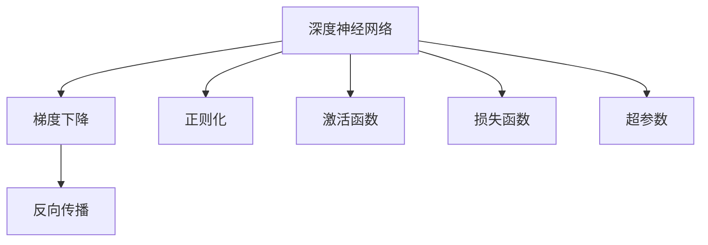

                 

# 思想的深度：从概念到洞见

> 关键词：深度学习,概念理解,洞见获取,数学模型,算法实践,技术挑战

## 1. 背景介绍

### 1.1 问题由来

随着人工智能(AI)技术的飞速发展，深度学习成为该领域的核心技术。其中，深度神经网络在图像、语音、自然语言处理等领域取得了巨大的突破。然而，仅凭数据和模型训练，难以全面理解其背后的机制和原理。因此，对于深度学习的概念理解与洞见获取，成为研究者和工程师必须面对的重要课题。

### 1.2 问题核心关键点

深度学习的核心关键点在于其复杂的网络结构、海量数据和强大的计算能力。通过大量样本训练，网络能够自动学习并提取数据的高级特征，但这些特征的原理和意义仍不明确。因此，在深度学习的研究与应用中，如何从数据和模型中获取深刻的洞见，成为重要挑战。

### 1.3 问题研究意义

掌握深度学习的概念理解与洞见获取，对于深化对该技术的认识，推动其在各行各业的应用具有重要意义：

1. **理论探索**：理解深度学习的核心概念，有助于研究人员深入探索其原理与机制，推动理论研究的突破。
2. **算法优化**：洞见获取能力能够帮助工程师从实践中发现新算法，提升模型性能。
3. **应用推广**：深刻理解深度学习的洞见，有助于将技术应用到更多领域，加速AI技术的产业化进程。
4. **技术突破**：洞见获取能够促进技术的持续创新，为未来AI发展开辟新的路径。

## 2. 核心概念与联系

### 2.1 核心概念概述

在深度学习的探索中，以下几个核心概念构成了其理论基础和实践框架：

- **深度神经网络(Deep Neural Networks, DNNs)**：通过多层非线性变换，学习数据的复杂表示。
- **梯度下降(Gradient Descent)**：优化算法，用于更新模型参数以最小化损失函数。
- **反向传播(Backpropagation)**：计算梯度的一种高效方法，使网络能够自动更新参数。
- **正则化(Regularization)**：防止模型过拟合的策略，如L2正则、Dropout等。
- **激活函数(Activation Functions)**：引入非线性特性，如ReLU、Sigmoid等。
- **损失函数(Loss Functions)**：衡量模型预测与真实标签之间差异的函数，如均方误差、交叉熵等。
- **超参数(Hyperparameters)**：网络中需要手动设定的参数，如学习率、批大小等。

这些概念相互联系，构成了深度学习的基本框架，对其理解是深入探索该技术的前提。

### 2.2 概念间的关系

这些核心概念之间的关系可以通过以下Mermaid流程图来展示：



这个流程图展示了深度学习中各个概念之间的联系：

1. 深度神经网络通过梯度下降和反向传播进行参数优化。
2. 正则化和激活函数用于增强网络的鲁棒性和非线性特性。
3. 损失函数衡量模型的预测效果，超参数用于控制模型的训练过程。

通过理解这些概念的相互关系，我们可以更好地把握深度学习的运行机制和优化策略。

## 3. 核心算法原理 & 具体操作步骤
### 3.1 算法原理概述

深度学习的核心算法原理基于梯度下降和反向传播。其基本流程如下：

1. **数据准备**：收集并准备训练数据，划分为训练集、验证集和测试集。
2. **模型构建**：选择适当的神经网络结构，定义损失函数和优化器。
3. **前向传播**：将输入数据输入模型，计算输出结果。
4. **计算损失**：计算模型输出与真实标签之间的误差，即损失值。
5. **反向传播**：通过反向传播计算损失函数对每个参数的梯度。
6. **参数更新**：使用梯度下降等优化算法更新模型参数。
7. **模型评估**：在验证集和测试集上评估模型性能。

### 3.2 算法步骤详解

以下是深度学习模型的具体步骤：

**Step 1: 数据准备**
- 收集并准备训练数据集，划分为训练集、验证集和测试集。
- 对数据进行预处理，如标准化、归一化、数据增强等。

**Step 2: 模型构建**
- 选择适当的神经网络结构，如卷积神经网络(CNNs)、递归神经网络(RNNs)、Transformer等。
- 定义损失函数，如均方误差(MSE)、交叉熵(Cross-Entropy)等。
- 选择优化器，如SGD、Adam、RMSprop等。

**Step 3: 前向传播**
- 将输入数据输入模型，计算每个神经元的输出值。
- 将输出值通过激活函数进行非线性变换。
- 将变换后的输出作为下一层的输入，重复上述过程，直至输出层。

**Step 4: 计算损失**
- 将模型输出与真实标签进行比较，计算损失值。
- 通常使用均方误差(MSE)或交叉熵(Cross-Entropy)等函数。

**Step 5: 反向传播**
- 计算损失函数对每个参数的梯度。
- 使用链式法则计算每个神经元的误差。
- 反向传播误差，更新所有参数的梯度。

**Step 6: 参数更新**
- 使用优化算法更新模型参数，如梯度下降法。
- 更新参数后，继续前向传播和反向传播，直至收敛。

**Step 7: 模型评估**
- 在验证集和测试集上评估模型性能。
- 使用准确率、精确率、召回率、F1分数等指标衡量模型表现。

### 3.3 算法优缺点

深度学习的核心算法具有以下优点：

1. **强大的表达能力**：通过多层网络结构，深度学习可以自动学习并提取数据的高级特征。
2. **高效的数据利用**：梯度下降和反向传播使得模型能够高效地利用大量数据进行训练。
3. **灵活的模型结构**：不同的网络结构和激活函数适用于不同的任务，灵活性强。

同时，深度学习算法也存在一些缺点：

1. **计算资源消耗大**：大规模神经网络需要大量的计算资源和存储空间。
2. **模型复杂性高**：深度学习模型结构复杂，难以解释其内部机制。
3. **过拟合风险高**：模型容易过拟合，特别是在数据量不足的情况下。
4. **训练时间长**：深度学习模型训练时间长，难以实时调整。

### 3.4 算法应用领域

深度学习算法已经在计算机视觉、自然语言处理、语音识别、推荐系统等多个领域取得了广泛应用：

- **计算机视觉**：图像分类、目标检测、图像生成等任务。
- **自然语言处理**：文本分类、机器翻译、情感分析等任务。
- **语音识别**：语音转文本、语音合成等任务。
- **推荐系统**：商品推荐、内容推荐等任务。
- **游戏AI**：游戏策略优化、路径规划等任务。

## 4. 数学模型和公式 & 详细讲解 & 举例说明
### 4.1 数学模型构建

深度学习的数学模型通常由以下几部分构成：

- **输入数据**：$x \in \mathbb{R}^n$，表示网络输入。
- **权重和偏置**：$\theta \in \mathbb{R}^m$，表示网络中的权重和偏置。
- **损失函数**：$\mathcal{L}(\theta)$，用于衡量模型的预测与真实标签之间的误差。
- **优化器**：$\mathcal{O}$，用于更新模型参数，如梯度下降法。

### 4.2 公式推导过程

以多层感知机(Multilayer Perceptron, MLP)为例，推导反向传播的公式。

**前向传播**：
$$
y^{[l]} = g(\sum_{i=1}^{m_l} W^{[l]}_i x^{[l-1]} + b^{[l]})
$$

其中，$y^{[l]}$表示第$l$层的输出，$g$表示激活函数，$W^{[l]}$表示第$l$层的权重矩阵，$b^{[l]}$表示第$l$层的偏置向量。

**损失函数**：
$$
\mathcal{L}(\theta) = \frac{1}{N} \sum_{i=1}^{N} \mathcal{L}(y^{[1]}, y^{[1]}) + \frac{\lambda}{2} \sum_{l=1}^{L} ||W^{[l]}||^2
$$

其中，$\mathcal{L}(y^{[1]}, y^{[1]})$表示预测值与真实值之间的损失，$\lambda$表示正则化系数。

**梯度下降**：
$$
\theta^{[l]} \leftarrow \theta^{[l]} - \eta \frac{\partial \mathcal{L}}{\partial \theta^{[l]}}
$$

其中，$\eta$表示学习率，$\partial \mathcal{L}/\partial \theta^{[l]}$表示损失函数对第$l$层参数的梯度。

**反向传播**：
$$
\frac{\partial \mathcal{L}}{\partial y^{[l]}} = \frac{\partial \mathcal{L}}{\partial z^{[l]}} \frac{\partial z^{[l]}}{\partial y^{[l]}} = \frac{\partial \mathcal{L}}{\partial z^{[l+1]}} W^{[l+1]} g'(z^{[l+1]})
$$

其中，$\partial \mathcal{L}/\partial z^{[l]}$表示损失函数对第$l$层激活值的梯度，$g'(z^{[l+1]})$表示激活函数的导数。

### 4.3 案例分析与讲解

以手写数字识别为例，分析深度学习模型的训练过程。

**数据准备**：
- 收集并准备MNIST手写数字数据集，划分为训练集、验证集和测试集。
- 对数据进行预处理，如标准化、归一化。

**模型构建**：
- 选择三层全连接神经网络，包含一个输入层、一个隐藏层和一个输出层。
- 定义损失函数为交叉熵损失。
- 选择优化器为Adam。

**前向传播**：
- 将输入图像输入网络，计算隐藏层的输出。
- 将隐藏层的输出作为下一层的输入，计算输出层的输出。
- 通过Softmax函数将输出层的结果转换为概率分布。

**计算损失**：
- 计算交叉熵损失，衡量模型输出与真实标签之间的差异。

**反向传播**：
- 计算损失函数对每个参数的梯度。
- 使用链式法则计算每个神经元的误差。
- 反向传播误差，更新所有参数的梯度。

**参数更新**：
- 使用Adam优化器更新模型参数。
- 重复上述过程，直至收敛。

**模型评估**：
- 在验证集和测试集上评估模型性能。
- 使用准确率、精确率、召回率、F1分数等指标衡量模型表现。

## 5. 项目实践：代码实例和详细解释说明
### 5.1 开发环境搭建

在进行深度学习实践前，我们需要准备好开发环境。以下是使用Python进行TensorFlow开发的环境配置流程：

1. 安装Anaconda：从官网下载并安装Anaconda，用于创建独立的Python环境。

2. 创建并激活虚拟环境：
```bash
conda create -n tf-env python=3.8 
conda activate tf-env
```

3. 安装TensorFlow：根据CUDA版本，从官网获取对应的安装命令。例如：
```bash
conda install tensorflow-gpu -c conda-forge -c pytorch -c pypi
```

4. 安装各类工具包：
```bash
pip install numpy pandas scikit-learn matplotlib tqdm jupyter notebook ipython
```

完成上述步骤后，即可在`tf-env`环境中开始深度学习实践。

### 5.2 源代码详细实现

这里我们以手写数字识别为例，给出使用TensorFlow进行深度学习的PyTorch代码实现。

```python
import tensorflow as tf
from tensorflow.keras import datasets, layers, models

# 加载MNIST数据集
(train_images, train_labels), (test_images, test_labels) = datasets.mnist.load_data()

# 对数据进行预处理
train_images = train_images / 255.0
test_images = test_images / 255.0

# 定义模型
model = models.Sequential([
    layers.Flatten(input_shape=(28, 28)),
    layers.Dense(128, activation='relu'),
    layers.Dense(10, activation='softmax')
])

# 定义损失函数和优化器
loss_fn = tf.keras.losses.SparseCategoricalCrossentropy(from_logits=True)
optimizer = tf.keras.optimizers.Adam()

# 编译模型
model.compile(optimizer=optimizer, loss=loss_fn, metrics=['accuracy'])

# 训练模型
model.fit(train_images, train_labels, epochs=5, validation_data=(test_images, test_labels))
```

以上代码展示了从数据预处理到模型训练的完整流程。可以看到，TensorFlow提供的高级API使得深度学习模型的构建和训练变得简单快捷。

### 5.3 代码解读与分析

让我们再详细解读一下关键代码的实现细节：

**数据预处理**：
- 使用`tf.keras.datasets.mnist.load_data()`函数加载MNIST数据集。
- 将图像数据归一化到0到1之间，方便网络处理。

**模型定义**：
- 使用`tf.keras.Sequential()`定义神经网络结构。
- 添加一个Flatten层将图像数据展开为一维向量。
- 添加一个全连接层，使用ReLU激活函数。
- 添加一个输出层，使用Softmax激活函数。

**损失函数和优化器**：
- 使用`tf.keras.losses.SparseCategoricalCrossentropy()`定义交叉熵损失函数。
- 使用`tf.keras.optimizers.Adam()`定义Adam优化器。

**模型编译**：
- 使用`model.compile()`函数编译模型，指定损失函数、优化器和评估指标。

**模型训练**：
- 使用`model.fit()`函数训练模型，指定训练数据、训练轮数和验证数据。

## 6. 实际应用场景
### 6.1 智能推荐系统

深度学习在智能推荐系统中发挥了重要作用。推荐系统能够根据用户的历史行为和兴趣，推荐用户可能感兴趣的商品或内容。深度学习模型通过学习用户数据和物品特征，进行个性化推荐。

在实践中，可以通过收集用户浏览、点击、评分等数据，训练深度学习模型，预测用户对物品的兴趣评分。常用的模型包括协同过滤、基于内容的推荐、混合推荐等，这些模型都依赖深度学习技术进行优化和改进。推荐系统广泛应用于电商、新闻、音乐、视频等多个领域，极大地提升了用户体验和业务价值。

### 6.2 图像识别

深度学习在图像识别领域取得了巨大成功。通过训练深度神经网络，能够自动学习并提取图像中的高级特征，实现对图像的分类、检测、分割等任务。

在实践中，可以使用卷积神经网络(CNNs)对图像进行分类。常用的模型包括LeNet、AlexNet、VGG、ResNet、Inception等，这些模型都在图像识别领域取得了突破性进展。图像识别广泛应用于自动驾驶、安防监控、医疗影像分析等多个领域，极大地提高了图像处理的自动化和智能化水平。

### 6.3 自然语言处理

深度学习在自然语言处理(NLP)领域也取得了显著成果。通过训练深度神经网络，能够自动学习并理解自然语言的语义和语法结构，实现对文本的分类、情感分析、机器翻译等任务。

在实践中，可以使用循环神经网络(RNNs)和Transformer等模型进行文本处理。常用的任务包括文本分类、机器翻译、情感分析、问答系统等。NLP技术广泛应用于智能客服、新闻推荐、金融分析等多个领域，极大地提升了数据处理的自动化和智能化水平。

### 6.4 未来应用展望

随着深度学习技术的不断发展，未来深度学习的应用场景将更加广泛。以下是一些可能的未来应用：

1. **自动驾驶**：深度学习模型能够自动学习并理解复杂环境中的感知信息，实现自动驾驶。
2. **健康医疗**：深度学习模型能够自动学习并分析医疗影像数据，辅助医生进行疾病诊断和治疗。
3. **金融分析**：深度学习模型能够自动学习并分析金融市场数据，预测股票走势，辅助投资决策。
4. **游戏AI**：深度学习模型能够自动学习并优化游戏策略，提升游戏AI的智能水平。
5. **智能制造**：深度学习模型能够自动学习并优化生产流程，提升制造效率和质量。
6. **智能家居**：深度学习模型能够自动学习并优化家居环境，提升生活便捷性和舒适性。

## 7. 工具和资源推荐
### 7.1 学习资源推荐

为了帮助开发者系统掌握深度学习的概念理解与洞见获取，这里推荐一些优质的学习资源：

1. 《深度学习》（周志华）：全面介绍了深度学习的基本概念和算法，适合初学者入门。
2. 《神经网络与深度学习》（Michael Nielsen）：深入浅出地介绍了神经网络的基本原理和实现方法，适合进阶学习。
3. 《Deep Learning Specialization》（Andrew Ng）：由斯坦福大学教授Andrew Ng主讲，系统讲解了深度学习的理论和实践。
4. 《Deep Learning for Vision》（Online course）：由吴恩达主讲，专注于深度学习在计算机视觉领域的应用。
5. 《Natural Language Processing with Python》（Online book）：由Stuart Russell和Peter Norvig合著，全面介绍了自然语言处理的基本概念和算法。
6. 《Hands-On Machine Learning with Scikit-Learn, Keras, and TensorFlow》（Aurélien Géron）：详细介绍了深度学习模型的构建和训练，适合实践开发。

通过对这些资源的学习实践，相信你一定能够全面掌握深度学习的核心概念和洞见获取方法，为解决实际问题奠定坚实基础。

### 7.2 开发工具推荐

高效的深度学习开发离不开优秀的工具支持。以下是几款用于深度学习开发的常用工具：

1. TensorFlow：由Google主导开发的开源深度学习框架，灵活高效，广泛应用于学术研究和工业应用。
2. PyTorch：由Facebook开发的深度学习框架，支持动态计算图和丰富的GPU加速功能，适合研究和实验。
3. Keras：一个高级神经网络API，简化了深度学习模型的构建和训练，适合快速开发原型。
4. MXNet：由Apache支持的深度学习框架，支持多语言和多平台，适合大规模工程应用。
5. Caffe：由Berkeley Vision and Learning Center开发的深度学习框架，适合图像处理任务。
6. CNTK：由Microsoft开发的深度学习框架，支持多GPU加速和分布式训练。

合理利用这些工具，可以显著提升深度学习项目的开发效率，加速创新迭代的步伐。

### 7.3 相关论文推荐

深度学习的研究源于学界的持续研究。以下是几篇奠基性的相关论文，推荐阅读：

1. LeNet-5：1998年，Yann LeCun等人提出的卷积神经网络，开创了深度学习在计算机视觉领域的应用。
2. AlexNet：2012年，Alex Krizhevsky等人提出的卷积神经网络，在ImageNet数据集上取得了突破性进展。
3. VGGNet：2014年，Karen Simonyan和Andrew Zisserman提出的卷积神经网络，展示了网络结构对性能的影响。
4. ResNet：2015年，Kaiming He等人提出的残差网络，解决了深度网络训练中的梯度消失问题。
5. InceptionNet：2014年，Google Brain团队提出的卷积神经网络，展示了网络结构的多样性和优化效果。
6. AlphaGo：2016年，DeepMind公司开发的深度强化学习模型，在围棋比赛中取得了突破性进展。

这些论文代表了大深度学习的发展脉络。通过学习这些前沿成果，可以帮助研究者把握学科前进方向，激发更多的创新灵感。

除上述资源外，还有一些值得关注的前沿资源，帮助开发者紧跟深度学习技术的最新进展，例如：

1. arXiv论文预印本：人工智能领域最新研究成果的发布平台，包括大量尚未发表的前沿工作，学习前沿技术的必读资源。
2. 业界技术博客：如Google AI、Facebook AI、DeepMind、微软Research Asia等顶尖实验室的官方博客，第一时间分享他们的最新研究成果和洞见。
3. 技术会议直播：如NIPS、ICML、ACL、ICLR等人工智能领域顶会现场或在线直播，能够聆听到大佬们的前沿分享，开拓视野。
4. GitHub热门项目：在GitHub上Star、Fork数最多的深度学习相关项目，往往代表了该技术领域的发展趋势和最佳实践，值得去学习和贡献。
5. 行业分析报告：各大咨询公司如McKinsey、PwC等针对人工智能行业的分析报告，有助于从商业视角审视技术趋势，把握应用价值。

总之，对于深度学习的概念理解与洞见获取的学习和实践，需要开发者保持开放的心态和持续学习的意愿。多关注前沿资讯，多动手实践，多思考总结，必将收获满满的成长收益。

## 8. 总结：未来发展趋势与挑战
### 8.1 研究成果总结

本文对深度学习的概念理解与洞见获取进行了全面系统的介绍。首先阐述了深度学习的基本概念和算法原理，明确了其核心思想和关键步骤。其次，从原理到实践，详细讲解了深度学习模型的构建和训练过程，给出了深度学习任务开发的完整代码实例。同时，本文还广泛探讨了深度学习在智能推荐、图像识别、自然语言处理等多个领域的应用前景，展示了深度学习的强大能力和广泛应用。最后，本文精选了深度学习技术的各类学习资源，力求为读者提供全方位的技术指引。

通过本文的系统梳理，可以看到，深度学习技术已经成为人工智能领域的重要基石，推动了其在各行各业的应用，极大地提升了数据处理的自动化和智能化水平。未来，伴随深度学习技术的持续演进，其应用领域将更加广泛，为社会的各个方面带来深刻的变革。

### 8.2 未来发展趋势

展望未来，深度学习技术将呈现以下几个发展趋势：

1. **模型规模持续增大**：随着计算资源的增加和算法优化的推进，深度学习模型的规模将不断增大，能够处理更加复杂的数据结构。
2. **模型结构更加多样**：未来的深度学习模型将引入更多新的网络结构，如Transformer、GNNs等，增强模型的泛化能力和表现力。
3. **数据利用更加高效**：未来的深度学习模型将利用更多样化的数据源，如无标签数据、半监督数据、自监督数据等，提升数据利用效率。
4. **模型训练更加灵活**：未来的深度学习模型将支持更加灵活的训练方式，如自适应学习率、多任务学习、联邦学习等，适应不同场景下的需求。
5. **模型推理更加高效**：未来的深度学习模型将优化推理过程，减少计算量，提升响应速度，支持实时推理和边缘计算。

### 8.3 面临的挑战

尽管深度学习技术已经取得了显著成就，但在迈向更加智能化、普适化应用的过程中，它仍面临诸多挑战：

1. **计算资源消耗大**：大规模深度学习模型需要大量的计算资源和存储空间，对硬件设施提出了高要求。
2. **模型复杂性高**：深度学习模型结构复杂，难以解释其内部机制，导致应用场景中的可解释性和可信度不足。
3. **数据依赖性强**：深度学习模型对数据质量、数据量要求高，在数据稀缺或数据不均衡的情况下，模型性能难以保证。
4. **过拟合风险高**：深度学习模型容易过拟合，特别是在数据量不足的情况下，模型的泛化能力难以保证。
5. **模型鲁棒性不足**：深度学习模型对输入数据的微小扰动较为敏感，模型的鲁棒性有待提升。

### 8.4 研究展望

面对深度学习面临的这些挑战，未来的研究需要在以下几个方面寻求新的突破：

1. **数据增强技术**：通过数据增强技术，增加训练数据的多样性和数量，提升模型的泛化能力。
2. **模型压缩技术**：通过模型压缩技术，减小模型参数量，降低计算资源消耗，提升推理效率。
3. **对抗训练技术**：通过对抗训练技术，增强模型的鲁棒性，提高模型对输入数据的容忍度。
4. **知识蒸馏技术**：通过知识蒸馏技术，将教师模型的知识传递给学生模型，提升模型性能和泛化能力。
5. **可解释性技术**：通过可解释性技术，增强模型的透明度和可信度，帮助用户理解模型的决策过程。

这些技术方向的探索，必将引领深度学习技术迈向更高的台阶，为构建安全、可靠、可解释、可控的智能系统铺平道路。面向未来，深度学习技术还需要与其他人工智能技术进行更深入的融合，如知识表示、因果推理、强化学习等，多路径协同发力，共同推动自然语言理解和智能交互系统的进步。只有勇于创新、敢于突破，才能不断拓展深度学习模型的边界，让智能技术更好地造福人类社会。

## 9. 附录：常见问题与解答

**Q1：如何理解深度学习的概念和原理？**

A: 深度学习的核心思想是通过多层神经网络结构，自动学习并提取数据的高级特征。其基本流程包括数据准备、模型构建、前向传播、损失计算、反向传播和参数更新等步骤。理解深度学习的概念和原理需要掌握基本的网络结构、激活函数

