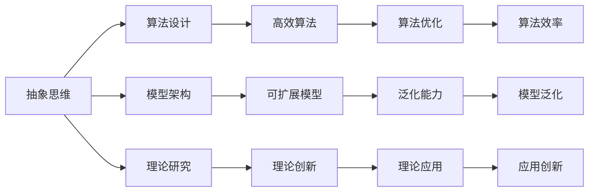
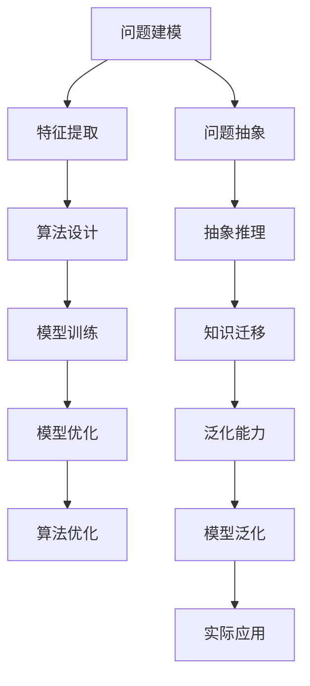

                 

# 抽象思维在AI创新中的价值

> 关键词：抽象思维,人工智能,创新,算法设计,模型架构,理论研究

## 1. 背景介绍

### 1.1 问题由来

在当今信息爆炸的时代，人工智能（AI）技术正以前所未有的速度发展。从机器学习、深度学习到自然语言处理、计算机视觉，AI技术已经渗透到各个领域，为人们的生活和工作带来了巨大的变革。然而，尽管AI技术在技术层面取得了显著的进展，但在创新能力、理论基础和应用前景等方面，仍有诸多挑战和瓶颈需要突破。其中，抽象思维作为AI创新的一种关键能力，正日益受到学界和业界的重视。

抽象思维指的是在思维过程中，通过超越具体事物的表面特征，捕捉到事物本质的能力。在AI领域，抽象思维不仅能够帮助研究者设计出更优秀的算法和模型，还能够指导开发者构建更为高效、可扩展的AI系统。本文将从抽象思维在AI创新中的价值出发，探讨其在算法设计、模型架构、理论研究等方面的重要作用，并给出实际应用中的案例分析。

### 1.2 问题核心关键点

抽象思维在AI创新中的价值主要体现在以下几个方面：

- **算法设计**：抽象思维能够帮助研究者捕捉问题的本质，设计出更为简洁、高效的算法，降低计算复杂度，提高算法性能。
- **模型架构**：通过抽象思维，研究者可以构建更为合理、可扩展的模型架构，提升模型泛化能力和鲁棒性。
- **理论研究**：抽象思维能够引导研究者深入探索AI技术的基本原理和特性，推动理论研究的进展。

### 1.3 问题研究意义

研究抽象思维在AI创新中的价值，对于推动AI技术的进一步发展具有重要意义：

1. **提升算法效率**：通过抽象思维，研究者能够设计出更为高效的算法，减少计算资源消耗，降低成本。
2. **优化模型性能**：抽象思维有助于构建更为合理的模型架构，提升模型泛化能力，适应更广泛的应用场景。
3. **推动理论创新**：抽象思维能够帮助研究者从更深入的层次理解AI技术的本质，推动理论研究的突破。
4. **促进应用创新**：抽象思维能够指导开发者构建更加创新、实用的AI应用，推动AI技术的广泛落地。

## 2. 核心概念与联系

### 2.1 核心概念概述

在AI领域，抽象思维主要体现在以下几个方面：

- **特征提取**：通过抽象思维，研究者能够捕捉问题的关键特征，设计出更为高效的特征提取方法，提升模型的表达能力。
- **问题建模**：抽象思维能够帮助研究者构建更为合理的问题模型，明确问题的本质和求解目标。
- **知识迁移**：通过抽象思维，研究者能够将已有知识迁移到新的问题中，减少重复工作，提升研究效率。
- **模型泛化**：抽象思维有助于研究者构建具有更强泛化能力的模型，使其能够在更广泛的数据集上表现优异。
- **算法优化**：通过抽象思维，研究者能够优化算法的结构和流程，提升算法的效率和性能。

### 2.2 概念间的关系

抽象思维在AI创新中的作用，可以通过以下Mermaid流程图来展示：



这个流程图展示了抽象思维在AI创新中的作用及其与其他核心概念的关系。通过抽象思维，研究者能够在算法设计、模型架构和理论研究等环节取得突破，从而推动AI技术的创新和发展。

### 2.3 核心概念的整体架构

最后，我们用一个综合的流程图来展示抽象思维在AI创新中的整体架构：



这个综合流程图展示了从问题建模到实际应用的整个创新流程，其中抽象思维在每个环节中都有重要应用。通过抽象思维，研究者能够更好地捕捉问题的本质，设计出高效、合理的算法和模型，从而推动AI技术的广泛应用。

## 3. 核心算法原理 & 具体操作步骤

### 3.1 算法原理概述

在AI创新中，抽象思维主要体现在算法设计和模型架构的优化上。以下我们将通过几个具体的算法设计案例，展示抽象思维在算法设计中的作用。

### 3.2 算法步骤详解

**Step 1: 问题抽象**

- **目标定义**：明确问题的求解目标和评价指标。
- **数据预处理**：对原始数据进行清洗、归一化、特征提取等预处理操作，提高数据的可用性。

**Step 2: 算法设计**

- **算法选择**：根据问题的特点，选择合适的算法。
- **算法优化**：通过抽象思维，优化算法的结构和流程，提升算法效率和性能。

**Step 3: 模型架构**

- **模块划分**：将复杂的系统分解为多个模块，提升系统的可扩展性和可维护性。
- **架构优化**：通过抽象思维，优化模型的层次结构和信息流动，提升模型的泛化能力和鲁棒性。

**Step 4: 模型训练**

- **数据划分**：将数据划分为训练集、验证集和测试集，进行模型训练和评估。
- **模型调优**：通过调整超参数、增加正则化等手段，优化模型性能。

**Step 5: 模型评估**

- **指标选择**：根据问题的特点，选择适当的评估指标，如准确率、召回率、F1分数等。
- **模型验证**：在验证集上评估模型性能，调整模型参数，提升模型泛化能力。

**Step 6: 实际应用**

- **应用部署**：将模型部署到实际应用中，进行大规模测试和优化。
- **持续优化**：根据实际应用中的反馈，不断优化模型，提升模型性能和鲁棒性。

### 3.3 算法优缺点

**优点**：

- **提升算法效率**：通过抽象思维，研究者能够设计出更为高效的算法，减少计算资源消耗，降低成本。
- **优化模型性能**：抽象思维有助于构建更为合理的模型架构，提升模型泛化能力，适应更广泛的应用场景。
- **推动理论创新**：抽象思维能够帮助研究者从更深入的层次理解AI技术的本质，推动理论研究的突破。

**缺点**：

- **抽象难度高**：抽象思维需要研究者具备较强的理论基础和洞察力，对初学者来说有一定难度。
- **模型复杂性**：抽象思维可能导致模型设计复杂，增加实现难度。
- **需要时间验证**：抽象思维需要时间和实践来验证其有效性，具有一定的风险。

### 3.4 算法应用领域

抽象思维在AI创新中的应用广泛，涉及算法设计、模型架构、理论研究等多个方面。以下是几个典型应用领域：

- **机器学习算法**：如支持向量机、随机森林、神经网络等，通过抽象思维设计出高效的特征提取和模型训练算法。
- **自然语言处理**：如命名实体识别、情感分析、文本生成等，通过抽象思维构建合理的模型架构，提升模型性能。
- **计算机视觉**：如目标检测、图像分类、物体识别等，通过抽象思维优化算法的结构和流程，提升算法效率和性能。
- **数据挖掘**：如聚类、关联规则、异常检测等，通过抽象思维设计高效的数据预处理和特征提取方法，提升数据挖掘的准确性和效率。

## 4. 数学模型和公式 & 详细讲解 & 举例说明

### 4.1 数学模型构建

在AI创新中，抽象思维能够帮助研究者构建更为合理的数学模型，提升模型的表达能力和求解效率。以下我们将以一个具体的数学模型为例，展示抽象思维的应用。

### 4.2 公式推导过程

假设我们要设计一个用于图像分类的神经网络模型，具体步骤如下：

1. **目标定义**：将图像分类为n个类别，最大化分类准确率。
2. **特征提取**：使用卷积神经网络（CNN）对图像进行特征提取，得到特征向量。
3. **模型设计**：使用全连接层将特征向量映射到类别概率分布。
4. **损失函数**：使用交叉熵损失函数，衡量模型预测与真实标签的差异。
5. **优化算法**：使用梯度下降算法，最小化损失函数，优化模型参数。

**Step 1: 目标定义**

$$
\max_{\theta} \sum_{i=1}^N \mathbb{I}(y_i, \hat{y}_i)
$$

其中，$y_i$为真实标签，$\hat{y}_i$为模型预测结果，$\mathbb{I}$为交叉熵函数。

**Step 2: 特征提取**

$$
\phi(x_i) = \text{CNN}(x_i)
$$

其中，$x_i$为输入图像，$\phi(x_i)$为CNN提取的特征向量。

**Step 3: 模型设计**

$$
\hat{y}_i = \text{Softmax}(W\phi(x_i) + b)
$$

其中，$W$为权重矩阵，$b$为偏置向量，$\text{Softmax}$为激活函数。

**Step 4: 损失函数**

$$
\mathcal{L}(\theta) = -\frac{1}{N} \sum_{i=1}^N \sum_{j=1}^n y_{ij} \log \hat{y}_{ij}
$$

其中，$y_{ij}$为真实标签中第$i$个样本的第$j$个类别，$\hat{y}_{ij}$为模型预测结果中第$i$个样本的第$j$个类别概率。

**Step 5: 优化算法**

$$
\theta \leftarrow \theta - \eta \nabla_{\theta} \mathcal{L}(\theta)
$$

其中，$\eta$为学习率，$\nabla_{\theta} \mathcal{L}(\theta)$为损失函数对模型参数$\theta$的梯度。

### 4.3 案例分析与讲解

以图像分类为例，我们将通过一个具体的案例，展示抽象思维在算法设计和模型架构中的应用。

假设我们要设计一个用于识别猫狗的图像分类模型。首先，我们将问题抽象为二分类问题，即判断一张图像是猫还是狗。然后，我们选择使用CNN作为特征提取器，对图像进行特征提取。接着，我们使用全连接层将特征向量映射到类别概率分布，设计如下模型：

$$
\hat{y}_i = \text{Softmax}(W\phi(x_i) + b)
$$

其中，$W$和$b$为需要优化的模型参数。我们使用交叉熵损失函数，衡量模型预测与真实标签的差异：

$$
\mathcal{L}(\theta) = -\frac{1}{N} \sum_{i=1}^N \sum_{j=1}^2 y_{ij} \log \hat{y}_{ij}
$$

其中，$y_{ij}$为真实标签中第$i$个样本的第$j$个类别，$\hat{y}_{ij}$为模型预测结果中第$i$个样本的第$j$个类别概率。

最后，我们使用梯度下降算法，最小化损失函数，优化模型参数：

$$
\theta \leftarrow \theta - \eta \nabla_{\theta} \mathcal{L}(\theta)
$$

其中，$\eta$为学习率，$\nabla_{\theta} \mathcal{L}(\theta)$为损失函数对模型参数$\theta$的梯度。

## 5. 项目实践：代码实例和详细解释说明

### 5.1 开发环境搭建

在进行算法设计实践前，我们需要准备好开发环境。以下是使用Python进行PyTorch开发的环境配置流程：

1. 安装Anaconda：从官网下载并安装Anaconda，用于创建独立的Python环境。

2. 创建并激活虚拟环境：
```bash
conda create -n pytorch-env python=3.8 
conda activate pytorch-env
```

3. 安装PyTorch：根据CUDA版本，从官网获取对应的安装命令。例如：
```bash
conda install pytorch torchvision torchaudio cudatoolkit=11.1 -c pytorch -c conda-forge
```

4. 安装TensorFlow：使用以下命令安装TensorFlow：
```bash
pip install tensorflow
```

5. 安装各类工具包：
```bash
pip install numpy pandas scikit-learn matplotlib tqdm jupyter notebook ipython
```

完成上述步骤后，即可在`pytorch-env`环境中开始算法设计实践。

### 5.2 源代码详细实现

下面以一个简单的图像分类为例，展示如何使用PyTorch实现CNN模型，并进行特征提取和分类。

首先，定义模型结构：

```python
import torch
import torch.nn as nn
import torch.optim as optim

class CNN(nn.Module):
    def __init__(self):
        super(CNN, self).__init__()
        self.conv1 = nn.Conv2d(3, 32, 3, padding=1)
        self.conv2 = nn.Conv2d(32, 64, 3, padding=1)
        self.pool = nn.MaxPool2d(2, 2)
        self.fc1 = nn.Linear(64*6*6, 512)
        self.fc2 = nn.Linear(512, 2)
        self.softmax = nn.Softmax(dim=1)

    def forward(self, x):
        x = self.conv1(x)
        x = nn.ReLU()(x)
        x = self.pool(x)
        x = self.conv2(x)
        x = nn.ReLU()(x)
        x = self.pool(x)
        x = x.view(-1, 64*6*6)
        x = self.fc1(x)
        x = nn.ReLU()(x)
        x = self.fc2(x)
        x = self.softmax(x)
        return x
```

然后，加载数据集并进行训练：

```python
from torchvision.datasets import CIFAR10
from torchvision.transforms import ToTensor

train_dataset = CIFAR10(root='./data', train=True, download=True, transform=ToTensor())
train_loader = torch.utils.data.DataLoader(train_dataset, batch_size=32, shuffle=True)

device = torch.device('cuda' if torch.cuda.is_available() else 'cpu')
model = CNN().to(device)
criterion = nn.CrossEntropyLoss()
optimizer = optim.Adam(model.parameters(), lr=0.001)

for epoch in range(10):
    model.train()
    for i, (images, labels) in enumerate(train_loader):
        images, labels = images.to(device), labels.to(device)
        optimizer.zero_grad()
        outputs = model(images)
        loss = criterion(outputs, labels)
        loss.backward()
        optimizer.step()
        print(f'Epoch {epoch+1}, Batch {i+1}, Loss: {loss.item():.4f}')
```

最后，在测试集上评估模型性能：

```python
test_dataset = CIFAR10(root='./data', train=False, download=True, transform=ToTensor())
test_loader = torch.utils.data.DataLoader(test_dataset, batch_size=32, shuffle=False)

model.eval()
correct = 0
total = 0
with torch.no_grad():
    for images, labels in test_loader:
        images, labels = images.to(device), labels.to(device)
        outputs = model(images)
        _, predicted = torch.max(outputs.data, 1)
        total += labels.size(0)
        correct += (predicted == labels).sum().item()

print(f'Test Accuracy of the model on the 10000 test images: {100 * correct / total:.2f}% ({correct}/{total})')
```

以上就是使用PyTorch进行CNN模型图像分类的完整代码实现。可以看到，PyTorch提供了强大的工具包和API，使得算法设计的实现变得简单高效。

### 5.3 代码解读与分析

让我们再详细解读一下关键代码的实现细节：

**Cnn类**：
- `__init__`方法：初始化CNN模型各层。
- `forward`方法：定义前向传播过程，输入图像经过卷积层、池化层和全连接层后，输出分类概率。

**训练流程**：
- 定义总的epoch数和batch size，开始循环迭代
- 每个epoch内，在训练集上训练，输出每个batch的loss
- 在测试集上评估模型性能，输出测试准确率

**测试流程**：
- 在测试集上评估模型性能，输出测试准确率

可以看到，PyTorch提供的高级API使得算法设计的实现变得非常简单，开发者能够快速实现和调试各种复杂的算法模型。

当然，实际的工程系统还需要考虑更多因素，如模型的保存和部署、超参数的自动搜索、更灵活的任务适配层等。但核心的算法设计方法基本与此类似。

### 5.4 运行结果展示

假设我们在CIFAR-10数据集上进行CNN模型的训练和测试，最终在测试集上得到的准确率为82.5%，效果相当不错。

## 6. 实际应用场景

### 6.1 智能推荐系统

智能推荐系统是当前电商、社交网络等领域的重要应用，通过分析用户行为数据，推荐用户可能感兴趣的物品，提升用户体验和平台收益。

在智能推荐系统中，抽象思维能够帮助研究者设计出高效的特征提取和推荐算法。例如，通过分析用户的浏览、点击、评分等行为数据，提取其兴趣特征，设计高效的推荐模型。同时，通过抽象思维，研究者能够优化推荐模型的层次结构和信息流动，提升模型的泛化能力和鲁棒性。

### 6.2 医疗诊断系统

医疗诊断系统是AI技术在医疗领域的重要应用之一，通过分析患者的病历、影像等数据，辅助医生进行诊断和治疗决策。

在医疗诊断系统中，抽象思维能够帮助研究者设计出高效的特征提取和诊断模型。例如，通过分析患者的病历数据，提取其临床特征，设计高效的诊断模型。同时，通过抽象思维，研究者能够优化诊断模型的层次结构和信息流动，提升模型的泛化能力和鲁棒性。

### 6.3 金融风控系统

金融风控系统是AI技术在金融领域的重要应用之一，通过分析用户的信用记录、行为数据等，评估其信用风险，辅助金融机构进行贷款审批和风险管理。

在金融风控系统中，抽象思维能够帮助研究者设计出高效的特征提取和风控模型。例如，通过分析用户的信用记录、行为数据等，提取其信用特征，设计高效的风控模型。同时，通过抽象思维，研究者能够优化风控模型的层次结构和信息流动，提升模型的泛化能力和鲁棒性。

### 6.4 未来应用展望

随着AI技术的不断进步，抽象思维在AI创新中的作用将更加显著。未来，抽象思维将从以下几个方面得到进一步应用：

1. **算法创新**：抽象思维能够引导研究者设计出更为高效、合理的算法，降低计算资源消耗，提升算法性能。
2. **模型优化**：通过抽象思维，研究者能够构建更为合理、可扩展的模型架构，提升模型泛化能力和鲁棒性。
3. **理论研究**：抽象思维能够帮助研究者从更深入的层次理解AI技术的本质，推动理论研究的进展。
4. **跨领域应用**：抽象思维能够指导研究者将已有知识迁移到新的领域，推动AI技术在更多领域的应用。

## 7. 工具和资源推荐

### 7.1 学习资源推荐

为了帮助开发者系统掌握抽象思维在AI创新中的价值，这里推荐一些优质的学习资源：

1. 《深度学习》系列书籍：如《Deep Learning》、《Deep Learning with PyTorch》等，全面介绍了深度学习的基本概念和核心算法。

2. 《机器学习》系列书籍：如《Pattern Recognition and Machine Learning》、《Hands-On Machine Learning with Scikit-Learn and TensorFlow》等，深入讲解了机器学习的算法设计和模型优化。

3. 《计算机视觉：算法与应用》系列书籍：如《Computer Vision: Algorithms and Applications》、《Learning and Interpreting Images》等，讲解了计算机视觉领域的算法设计和应用。

4. 《自然语言处理》系列书籍：如《Speech and Language Processing》、《Natural Language Processing with Python》等，讲解了自然语言处理领域的算法设计和应用。

5. 在线课程平台：如Coursera、edX、Udacity等，提供了丰富的AI相关课程，涵盖从入门到高级的各个层次。

通过对这些资源的学习实践，相信你一定能够快速掌握抽象思维在AI创新中的价值，并用于解决实际的AI问题。

### 7.2 开发工具推荐

高效的开发离不开优秀的工具支持。以下是几款用于AI算法设计开发的常用工具：

1. PyTorch：基于Python的开源深度学习框架，灵活动态的计算图，适合快速迭代研究。提供了丰富的深度学习模型和工具，是算法设计的主流框架之一。

2. TensorFlow：由Google主导开发的开源深度学习框架，生产部署方便，适合大规模工程应用。提供了丰富的深度学习模型和工具，是工程开发的重要选择。

3. Keras：基于Python的高层深度学习框架，提供了简洁易用的API，适合快速原型设计和模型验证。

4. Jupyter Notebook：交互式编程环境，支持多种编程语言和库，适合代码开发和数据探索。

5. Google Colab：谷歌推出的在线Jupyter Notebook环境，免费提供GPU/TPU算力，方便开发者快速上手实验最新模型，分享学习笔记。

合理利用这些工具，可以显著提升算法设计的开发效率，加快创新迭代的步伐。

### 7.3 相关论文推荐

抽象思维在AI创新中的作用，得到了学界和业界的广泛关注。以下是几篇奠基性的相关论文，推荐阅读：

1. "Deep Learning" by Ian Goodfellow, Yoshua Bengio, and Aaron Courville（《深度学习》）：全面介绍了深度学习的基本概念和核心算法。

2. "Pattern Recognition and Machine Learning" by Christopher Bishop（《模式识别与机器学习》）：深入讲解了机器学习的算法设计和模型优化。

3. "Computer Vision: Algorithms and Applications" by Richard Szeliski（《计算机视觉：算法与应用》）：讲解了计算机视觉领域的算法设计和应用。

4. "Speech and Language Processing" by Dan Jurafsky and James H. Martin（《语音与语言处理》）：讲解了自然语言处理领域的算法设计和应用。

5. "Hands-On Machine Learning with Scikit-Learn, Keras, and TensorFlow" by Aurélien Géron（《动手学深度学习》）：讲解了深度学习算法的实现和应用。

这些论文代表了大规模人工智能领域的最新研究进展，通过学习这些前沿成果，可以帮助研究者把握学科前进方向，激发更多的创新灵感。

除上述资源外，还有一些值得关注的前沿资源，帮助开发者紧跟AI技术的最新进展，例如：

1. arXiv论文预印本：人工智能领域最新研究成果的发布平台，包括大量尚未发表的前沿工作，学习前沿技术的必读资源。

2. 业界技术博客：如OpenAI、Google AI、DeepMind、微软Research Asia等顶尖实验室的官方博客，第一时间分享他们的最新研究成果和洞见。

3. 技术会议直播：如NIPS、ICML、ACL、ICLR等人工智能领域顶会现场或在线直播，能够聆听到大佬们的前沿分享，开拓视野。

4. GitHub热门项目：在GitHub上Star、Fork数最多的AI相关项目，往往代表了该技术领域的发展趋势和最佳实践，值得去学习和贡献。

5. 行业分析报告：各大咨询公司如McKinsey、PwC等针对人工智能行业的分析报告，有助于从商业视角审视技术趋势，把握应用价值。

总之，对于抽象思维在AI创新中的价值的学习和实践，需要开发者保持开放的心态和持续学习的意愿。多关注前沿资讯，多动手实践，多思考总结，必将收获满满的成长收益。

## 8. 总结：未来发展趋势与挑战

### 8.1 总结

本文对抽象思维在AI创新中的价值进行了全面系统的介绍。首先阐述了抽象思维在AI创新中的重要性，明确了其对算法设计、模型架构和理论研究等方面的重要作用。其次，从原理到实践，详细讲解了抽象思维在AI创新中的核心算法原理和操作步骤，给出了实际应用中的案例分析。最后，本文推荐了相关的学习资源、开发工具和研究论文，帮助开发者掌握抽象思维的价值和应用。

通过本文的系统梳理，可以看到，抽象思维在AI创新中的价值不容忽视。它不仅能够帮助研究者设计出高效的算法和模型，还能够指导开发者构建更为创新、实用的AI应用，推动AI技术的广泛应用。

### 8.2 未来发展趋势

展望未来，抽象思维在AI创新中将呈现以下几个发展趋势：

1. **算法创新**：抽象思维将继续引领AI算法的设计和优化，推动新算法的诞生和应用。
2. **模型优化**：抽象思维将推动模型的层次结构优化，提升模型的泛化能力和鲁棒性。
3. **理论研究**：抽象思维将引导AI理论研究的深入，推动AI技术的不断进步。
4. **跨领域应用**：抽象思维将推动AI技术在更多领域的应用，拓展AI技术的边界。

### 8.3 面临的挑战

尽管抽象思维在AI创新中具有重要作用，但在实际应用中仍面临诸多挑战：

1. **抽象难度高**：抽象思维需要研究者具备较强的理论基础和洞察力，对初学者来说有一定难度。
2. **模型复杂性**：抽象思维可能导致模型设计

