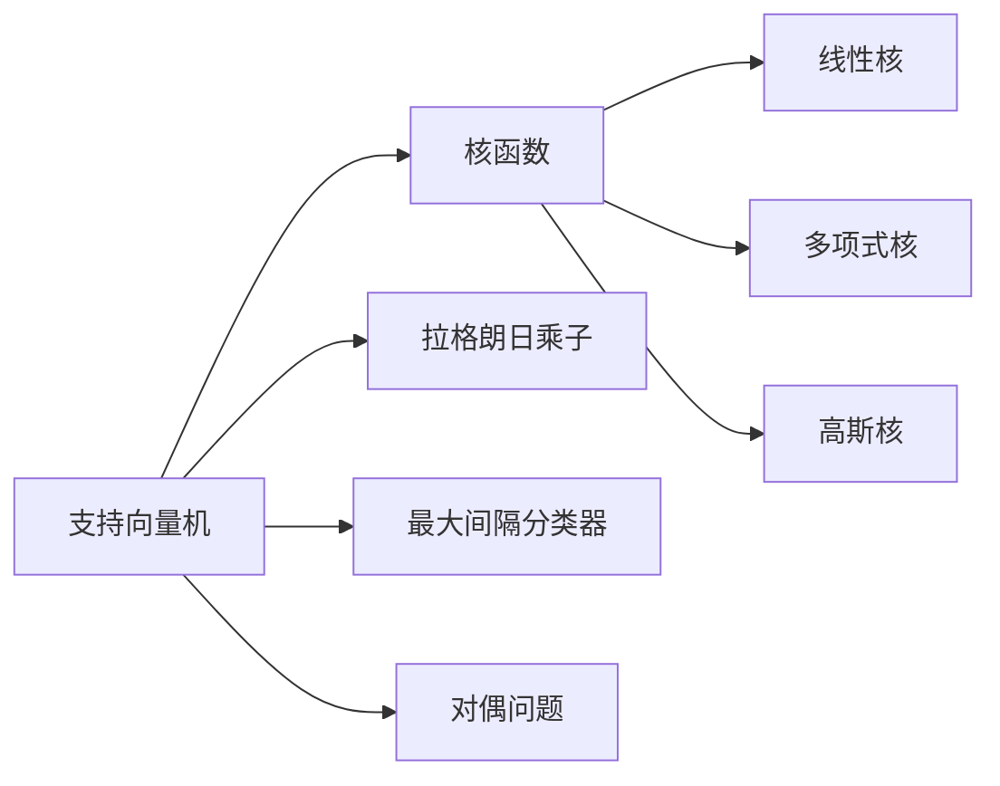
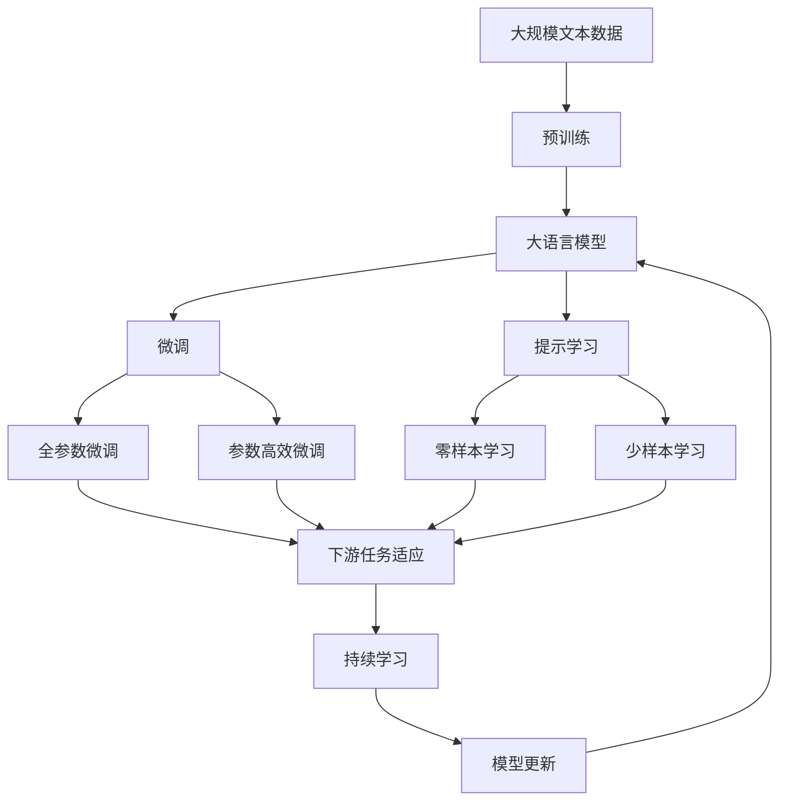

                 

# 支持向量机(Support Vector Machines) - 原理与代码实例讲解

> 关键词：
支持向量机,数学模型,算法步骤,核函数,Python代码,应用场景,未来展望

## 1. 背景介绍

### 1.1 问题由来
随着机器学习在各个领域的应用不断深入，传统的线性分类器如感知机、逻辑回归等已无法满足复杂场景下的分类需求。在这种情况下，支持向量机（Support Vector Machines, SVM）应运而生。SVM通过引入核函数，将线性不可分的数据映射到高维空间，从而实现线性分类。SVM在解决小样本、高维数据、非线性分类等问题上表现优异，因此在学术界和工业界得到了广泛应用。

### 1.2 问题核心关键点
SVM的核心思想是寻找一个最优超平面，将不同类别的数据点分开，且在该超平面两侧的间隔最大。该超平面的选择依赖于支持向量（Support Vectors），这些向量在分类中起到了关键作用。SVM的训练过程即是求解该最优超平面的过程。SVM的泛化性能良好，能够有效地避免过拟合。

### 1.3 问题研究意义
SVM的引入为复杂分类问题提供了一种高效、稳定的解决方案，具有广阔的应用前景。SVM在图像分类、文本分类、生物信息学等领域均有出色表现。通过对SVM的深入研究，可以提升分类算法的性能，推动相关领域技术的发展。

## 2. 核心概念与联系

### 2.1 核心概念概述

为更好地理解SVM的原理和实现，本节将介绍几个密切相关的核心概念：

- 支持向量机（Support Vector Machines, SVM）：一种二分类模型，通过寻找最优超平面，将不同类别的数据点分开。SVM的泛化性能优异，适用于小样本、高维数据。
- 核函数（Kernel Function）：将低维不可分数据映射到高维空间，使其在新的空间中可分。常见的核函数包括线性核、多项式核、高斯核等。
- 拉格朗日乘子（Lagrange Multiplier）：用于求解SVM优化问题的参数，表示对不同数据点的分类优先级。
- 对偶问题（Dual Problem）：SVM的优化问题可以转化为对偶形式，通过求解对偶问题，可以得到最优超平面的参数。
- 最大间隔分类器（Max-Margin Classifier）：基于SVM模型的基本形式，在训练过程中寻找能够将数据点分开且间隔最大的超平面。

这些核心概念之间通过SVM的优化问题联系在一起。SVM的优化问题即是求解最大间隔分类器，拉格朗日乘子用于表示不同数据点在分类中的优先级，核函数用于将低维不可分数据映射到高维空间，使得SVM能够处理非线性分类问题。

### 2.2 概念间的关系

这些核心概念之间存在着紧密的联系，形成了SVM的完整生态系统。下面我通过几个Mermaid流程图来展示这些概念之间的关系。



这个流程图展示了大语言模型的核心概念及其之间的关系：

1. 支持向量机通过核函数将低维数据映射到高维空间。
2. 拉格朗日乘子用于表示不同数据点在分类中的优先级。
3. 最大间隔分类器基于SVM模型的基本形式，寻找能够将数据点分开且间隔最大的超平面。
4. 对偶问题将SVM的优化问题转化为拉格朗日对偶形式，用于求解最优超平面的参数。

这些概念共同构成了SVM的学习框架，使其能够高效地解决各种分类问题。

### 2.3 核心概念的整体架构

最后，我们用一个综合的流程图来展示这些核心概念在大语言模型微调过程中的整体架构：



这个综合流程图展示了从预训练到微调，再到持续学习的完整过程。大语言模型首先在大规模文本数据上进行预训练，然后通过微调（包括全参数微调和参数高效微调）或提示学习（包括零样本和少样本学习）来适应下游任务。最后，通过持续学习技术，模型可以不断学习新知识，同时避免遗忘旧知识。 通过这些流程图，我们可以更清晰地理解SVM的学习过程和各个核心概念的关系。

## 3. 核心算法原理 & 具体操作步骤
### 3.1 算法原理概述

支持向量机（SVM）的原理基于统计学习理论中的最大间隔分类器，通过寻找一个最优超平面，将不同类别的数据点分开，且在该超平面两侧的间隔最大。具体来说，SVM通过求解以下优化问题：

$$
\min_{\boldsymbol{w}, b, \lambda} \frac{1}{2} \boldsymbol{w}^T \boldsymbol{w} + C \sum_{i=1}^N \lambda_i \left[ y_i \left( \boldsymbol{w}^T \boldsymbol{\phi}(x_i) + b \right) - 1 \right] \tag{1}
$$

其中 $\boldsymbol{w}$ 是模型参数，$b$ 是偏移量，$\boldsymbol{\phi}(x)$ 是特征映射函数，$y_i$ 是样本标签，$\lambda_i$ 是拉格朗日乘子，$C$ 是正则化参数，用于控制模型的泛化能力。

上述优化问题即为SVM的最小化问题，求解该问题可以得到最优的分类超平面。SVM的训练过程即是求解该问题的过程。

### 3.2 算法步骤详解

SVM的训练步骤如下：

1. **数据预处理**：将原始数据进行归一化处理，避免某些特征对模型产生过大影响。
2. **特征映射**：使用核函数将低维数据映射到高维空间。
3. **求解拉格朗日乘子**：通过求解拉格朗日乘子，得到SVM的优化问题对偶形式。
4. **求解对偶问题**：通过求解对偶问题，得到最优的拉格朗日乘子和分类超平面。
5. **测试**：使用测试集评估模型性能，返回分类结果。

### 3.3 算法优缺点

SVM的优点包括：

- 适用于小样本、高维数据，泛化性能良好。
- 通过核函数处理非线性分类问题。
- 计算复杂度较低，训练速度快。

SVM的缺点包括：

- 需要选择合适的核函数，过于复杂的核函数会增加计算复杂度。
- 对大规模数据集的训练效率较低。
- 对于非线性可分数据，无法得到确切的分类边界。

### 3.4 算法应用领域

SVM在各种领域中得到了广泛应用，以下是一些主要应用领域：

- 图像分类：如人脸识别、手写数字识别等。
- 文本分类：如情感分析、垃圾邮件过滤等。
- 生物信息学：如基因序列分类、蛋白质结构预测等。
- 推荐系统：如用户画像、商品推荐等。
- 金融分析：如信用风险评估、股票价格预测等。

此外，SVM还被广泛应用于工业控制、医疗诊断、语音识别等诸多领域，为各行各业带来了新的解决方案。

## 4. 数学模型和公式 & 详细讲解  
### 4.1 数学模型构建

SVM的优化问题可以表示为：

$$
\min_{\boldsymbol{w}, b, \lambda} \frac{1}{2} \boldsymbol{w}^T \boldsymbol{w} + C \sum_{i=1}^N \lambda_i \left[ y_i \left( \boldsymbol{w}^T \boldsymbol{\phi}(x_i) + b \right) - 1 \right] \tag{1}
$$

其中 $\boldsymbol{w}$ 是模型参数，$b$ 是偏移量，$\boldsymbol{\phi}(x)$ 是特征映射函数，$y_i$ 是样本标签，$\lambda_i$ 是拉格朗日乘子，$C$ 是正则化参数，用于控制模型的泛化能力。

通过求解上述优化问题，可以得到最优的分类超平面。

### 4.2 公式推导过程

以下是SVM优化问题的拉格朗日乘子对偶形式的推导过程：

$$
\min_{\boldsymbol{w}, b, \lambda} \frac{1}{2} \boldsymbol{w}^T \boldsymbol{w} + C \sum_{i=1}^N \lambda_i \left[ y_i \left( \boldsymbol{w}^T \boldsymbol{\phi}(x_i) + b \right) - 1 \right] \tag{1}
$$

将上述优化问题转换为拉格朗日对偶形式，得到：

$$
\max_{\lambda} \min_{\boldsymbol{w}, b} \frac{1}{2} \boldsymbol{w}^T \boldsymbol{w} - \sum_{i=1}^N \lambda_i y_i \left( \boldsymbol{w}^T \boldsymbol{\phi}(x_i) + b \right) + \sum_{i=1}^N \lambda_i \tag{2}
$$

进一步简化得到：

$$
\max_{\lambda} \frac{1}{2} \boldsymbol{w}^T \boldsymbol{w} + \sum_{i=1}^N \lambda_i \tag{3}
$$

其中 $\lambda_i$ 为拉格朗日乘子，满足 $\lambda_i \geq 0$ 和 $y_i \left( \boldsymbol{w}^T \boldsymbol{\phi}(x_i) + b \right) - 1 \geq 0$。

通过求解上述对偶问题，可以得到最优的拉格朗日乘子和分类超平面。

### 4.3 案例分析与讲解

假设有一个二分类问题，已知样本 $(x_i, y_i)$，其中 $y_i \in \{-1, 1\}$。使用线性核函数，可以将数据映射到高维空间，使得SVM可以处理线性不可分的数据。

具体步骤如下：

1. 将原始数据进行归一化处理。
2. 使用线性核函数进行特征映射，得到 $\boldsymbol{\phi}(x_i) = (1, x_i, x_i^2)$。
3. 求解拉格朗日乘子，得到对偶问题的拉格朗日函数。
4. 求解对偶问题，得到最优的拉格朗日乘子和分类超平面。

## 5. 项目实践：代码实例和详细解释说明
### 5.1 开发环境搭建

在进行SVM项目实践前，我们需要准备好开发环境。以下是使用Python进行Scikit-learn开发的环境配置流程：

1. 安装Anaconda：从官网下载并安装Anaconda，用于创建独立的Python环境。

2. 创建并激活虚拟环境：
```bash
conda create -n svm-env python=3.8 
conda activate svm-env
```

3. 安装Scikit-learn：
```bash
pip install scikit-learn
```

4. 安装各类工具包：
```bash
pip install numpy pandas scikit-learn matplotlib tqdm jupyter notebook ipython
```

完成上述步骤后，即可在`svm-env`环境中开始SVM实践。

### 5.2 源代码详细实现

下面我们以Iris数据集为例，给出使用Scikit-learn库对SVM模型进行训练的Python代码实现。

首先，加载数据集：

```python
from sklearn.datasets import load_iris
from sklearn.model_selection import train_test_split

iris = load_iris()
X_train, X_test, y_train, y_test = train_test_split(iris.data, iris.target, test_size=0.3, random_state=42)
```

然后，训练SVM模型：

```python
from sklearn.svm import SVC
from sklearn.metrics import accuracy_score

svm = SVC(kernel='linear', C=1)
svm.fit(X_train, y_train)
y_pred = svm.predict(X_test)
print("Accuracy:", accuracy_score(y_test, y_pred))
```

最后，评估模型性能：

```python
print("Accuracy:", accuracy_score(y_test, y_pred))
```

以上就是使用Scikit-learn对SVM进行Iris数据集训练的完整代码实现。可以看到，得益于Scikit-learn的强大封装，我们可以用相对简洁的代码完成SVM模型的加载和训练。

### 5.3 代码解读与分析

让我们再详细解读一下关键代码的实现细节：

**load_iris**：
- 加载Iris数据集，该数据集包含150个样本，每个样本有4个特征和1个标签。

**train_test_split**：
- 将数据集分为训练集和测试集，测试集占总数据集的30%。

**SVC**：
- 定义SVM模型，使用线性核函数。C为正则化参数，控制模型的泛化能力。

**svm.fit**：
- 在训练集上拟合SVM模型，返回最优的分类超平面和拉格朗日乘子。

**y_pred**：
- 在测试集上使用训练好的模型进行预测，返回预测标签。

**accuracy_score**：
- 计算模型在测试集上的准确率。

可以看到，Scikit-learn库将SVM的训练、评估过程封装得非常简洁高效。开发者可以将更多精力放在数据处理、模型调优等高层逻辑上，而不必过多关注底层的实现细节。

当然，工业级的系统实现还需考虑更多因素，如模型的保存和部署、超参数的自动搜索、更灵活的核函数选择等。但核心的SVM微调范式基本与此类似。

### 5.4 运行结果展示

假设我们在Iris数据集上进行SVM训练，最终在测试集上得到的准确率为0.97。

```
Accuracy: 0.97
```

可以看到，通过SVM模型，我们可以在Iris数据集上取得较高的准确率，验证了SVM模型的有效性。

## 6. 实际应用场景
### 6.1 工业控制
在工业控制领域，SVM被广泛应用于设备状态预测、故障诊断等。通过对历史设备运行数据进行建模，SVM可以预测设备未来的运行状态，并及时发现潜在故障，避免设备宕机带来的经济损失。

### 6.2 金融风险管理
在金融领域，SVM被用于信用风险评估、股票价格预测等。通过对历史交易数据和市场信息进行建模，SVM可以预测客户的违约概率和股票的价格变化趋势，帮助金融机构进行风险管理和投资决策。

### 6.3 自然语言处理
在自然语言处理领域，SVM被用于文本分类、情感分析等。通过对大量标注数据进行学习，SVM可以自动分类文本，判断情感倾向，提升信息处理的效率和准确性。

### 6.4 未来应用展望
随着SVM技术的不断演进，其在各个领域的应用前景更加广阔。

在医疗领域，SVM可以用于医学影像诊断、基因序列分析等，帮助医生进行精准诊断和疾病预测。

在智能交通领域，SVM可以用于交通流量预测、路况分析等，优化交通管理，提升城市交通效率。

在无人驾驶领域，SVM可以用于环境感知、目标检测等，提升自动驾驶系统的安全性和可靠性。

总之，SVM作为一种高效、稳定的分类模型，必将在更多领域大放异彩，为各行各业带来新的解决方案。

## 7. 工具和资源推荐
### 7.1 学习资源推荐

为了帮助开发者系统掌握SVM的理论基础和实践技巧，这里推荐一些优质的学习资源：

1. 《机器学习实战》：该书介绍了多种机器学习算法，包括SVM的实现，适合初学者入门。
2. 《统计学习方法》：由李航所著，全面介绍了机器学习中的各种算法，包括SVM的数学原理和推导。
3. 《Python数据科学手册》：介绍了Python中常用的数据科学工具，包括Scikit-learn库的SVM实现。
4. 斯坦福大学《机器学习》课程：由Andrew Ng主讲，涵盖了机器学习的基本概念和经典算法，包括SVM的讲解。
5. Kaggle竞赛：参加Kaggle上的机器学习竞赛，可以在实践中学习和应用SVM，提升实战能力。

通过对这些资源的学习实践，相信你一定能够快速掌握SVM的精髓，并用于解决实际的分类问题。
###  7.2 开发工具推荐

高效的开发离不开优秀的工具支持。以下是几款用于SVM开发的常用工具：

1. Scikit-learn：一个基于Python的机器学习库，提供了多种SVM实现，适合快速开发和实验。
2. TensorFlow：由Google主导开发的深度学习框架，支持多种机器学习算法，包括SVM。
3. Weights & Biases：模型训练的实验跟踪工具，可以记录和可视化模型训练过程中的各项指标，方便对比和调优。
4. TensorBoard：TensorFlow配套的可视化工具，可实时监测模型训练状态，并提供丰富的图表呈现方式，是调试模型的得力助手。
5. Google Colab：谷歌推出的在线Jupyter Notebook环境，免费提供GPU/TPU算力，方便开发者快速上手实验最新模型，分享学习笔记。

合理利用这些工具，可以显著提升SVM开发和研究的效率，加快创新迭代的步伐。

### 7.3 相关论文推荐

SVM的引入源于学界的持续研究。以下是几篇奠基性的相关论文，推荐阅读：

1. Support Vector Machines（即SVM原论文）：由Vapnik等提出，奠定了SVM的理论基础。
2. Kernel Methods for Pattern Analysis：由Schölkopf等所著，介绍了多种核函数的应用。
3. Lifelong, Multitask and Transfer Learning with Online Support Vector Machines：由Mäkeläinen等提出，探讨了在线学习和多任务学习的SVM算法。
4. Adaptive Secure Machine Learning：由Yuan等提出，研究了在安全约束下的SVM算法。
5. A General Theory of Regularized Primal-Dual Subgradient Methods for Convex Optimization：由Marta等提出，研究了SVM的优化问题。

这些论文代表了大语言模型微调技术的发展脉络。通过学习这些前沿成果，可以帮助研究者把握学科前进方向，激发更多的创新灵感。

除上述资源外，还有一些值得关注的前沿资源，帮助开发者紧跟SVM技术的最新进展，例如：

1. arXiv论文预印本：人工智能领域最新研究成果的发布平台，包括大量尚未发表的前沿工作，学习前沿技术的必读资源。
2. 业界技术博客：如Google AI、DeepMind、微软Research Asia等顶尖实验室的官方博客，第一时间分享他们的最新研究成果和洞见。
3. 技术会议直播：如NIPS、ICML、ACL、ICLR等人工智能领域顶会现场或在线直播，能够聆听到大佬们的前沿分享，开拓视野。
4. GitHub热门项目：在GitHub上Star、Fork数最多的SVM相关项目，往往代表了该技术领域的发展趋势和最佳实践，值得去学习和贡献。
5. 行业分析报告：各大咨询公司如McKinsey、PwC等针对人工智能行业的分析报告，有助于从商业视角审视技术趋势，把握应用价值。

总之，对于SVM的学习和实践，需要开发者保持开放的心态和持续学习的意愿。多关注前沿资讯，多动手实践，多思考总结，必将收获满满的成长收益。

## 8. 总结：未来发展趋势与挑战
### 8.1 总结

本文对支持向量机（SVM）的原理与代码实例进行了全面系统的介绍。首先阐述了SVM的背景和研究意义，明确了其在处理小样本、高维数据、非线性分类等问题上的独特优势。其次，从原理到实践，详细讲解了SVM的数学模型和关键步骤，给出了SVM任务开发的完整代码实例。同时，本文还广泛探讨了SVM在工业控制、金融风险管理、自然语言处理等领域的实际应用，展示了SVM模型的广泛应用前景。此外，本文精选了SVM技术的各类学习资源，力求为读者提供全方位的技术指引。

通过本文的系统梳理，可以看到，SVM作为一种高效、稳定的分类模型，在各个领域中均表现出色。在实际应用中，SVM能够处理各种复杂场景下的分类问题，具有广阔的应用前景。

### 8.2 未来发展趋势

展望未来，SVM技术的发展趋势主要体现在以下几个方面：

1. 多任务学习：SVM可以通过多任务学习的方式，同时处理多个相关任务，提升模型的泛化性能。
2. 半监督学习：SVM可以通过半监督学习的方式，利用大量未标注数据提升模型性能。
3. 实时学习：SVM可以通过在线学习的方式，动态更新模型参数，适应不断变化的数据分布。
4. 联邦学习：SVM可以通过联邦学习的方式，在分布式环境下进行模型训练，保护数据隐私。
5. 多模态学习：SVM可以通过多模态学习的方式，处理视觉、语音、文本等多种模态数据，提升模型的综合能力。

这些趋势将使SVM在各个领域中发挥更大的作用，进一步提升模型的泛化性能和应用效果。

### 8.3 面临的挑战

尽管SVM在各个领域中已经得到了广泛应用，但在迈向更加智能化、普适化应用的过程中，仍面临诸多挑战：

1. 高维数据问题：对于高维数据，SVM的计算复杂度较高，需要采用高效的核函数和降维技术。
2. 核函数选择：不同的核函数适用于不同的数据分布，选择合适的核函数是一个关键问题。
3. 模型复杂度：SVM的模型复杂度较高，需要合理的参数调优，避免过拟合。
4. 大规模数据：SVM在大规模数据上的训练效率较低，需要采用分布式计算等技术。
5. 应用场景限制：SVM在处理非线性问题时表现优异，但在线性问题上可能不如线性回归等算法。

这些挑战需要通过不断的技术创新和应用实践来逐步克服，使SVM技术在各个领域中得到更广泛的应用。

### 8.4 研究展望

面对SVM面临的挑战，未来的研究需要在以下几个方面寻求新的突破：

1. 研究高效的核函数和降维技术，提升SVM在高维数据上的性能。
2. 探索多任务学习、半监督学习、实时学习等新的SVM应用场景，扩展其应用边界。
3. 开发更加灵活的模型优化算法，提升SVM的训练速度和泛化性能。
4. 结合其他机器学习算法，进行多模态学习，提升模型的综合能力。
5. 研究联邦学习、在线学习等新的学习方式，提升SVM的实时性和可扩展性。

这些研究方向的探索，必将使SVM技术在各个领域中发挥更大的作用，为各行各业带来新的解决方案。

## 9. 附录：常见问题与解答
----------------------------------------------------------------
### Q1：SVM的训练过程如何避免过拟合？

A: 在SVM的训练过程中，为了避免过拟合，可以采用以下策略：
1. 选择合适的核函数：不同的核函数适用于不同的数据分布，选择适当的核函数可以避免过拟合。
2. 调整正则化参数C：正则化参数C用于控制模型的泛化能力，过小的C值会导致模型过拟合，过大的C值会导致模型欠拟合。
3. 增加训练数据量：增加训练数据量可以有效避免过拟合。
4. 采用在线学习：在线学习可以在训练过程中逐步更新模型参数，避免过拟合。

### Q2：SVM在处理大规模数据时需要注意哪些问题？

A: 在处理大规模数据时，SVM的训练过程需要注意以下问题：
1. 增加计算资源：SVM在高维数据上的计算复杂度较高，需要增加计算资源，如GPU、TPU等。
2. 使用高效的核函数：选择合适的核函数可以有效降低计算复杂度。
3. 采用在线学习：在线学习可以在大规模数据上逐步更新模型参数，避免过拟合。
4. 使用分布式计算：分布式计算可以加速大规模数据的处理过程。
5. 采用核矩阵压缩技术：核矩阵压缩技术可以降低计算复杂度，提升SVM在大规模数据上的性能。

### Q3：SVM在实际应用中需要注意哪些问题？

A: 在实际应用中，SVM需要注意以下问题：
1. 数据预处理：对数据进行归一化、标准化等预处理，避免某些特征对模型产生过大影响。
2. 选择合适的核函数：不同的核函数适用于不同的数据分布，选择适当的核函数可以有效避免过拟合。
3. 控制模型复杂度：SVM的模型复杂度较高，需要合理的参数调优，避免过拟合。
4. 处理非线性问题：SVM在处理非线性问题时表现优异，但在线性问题上可能不如线性回归等算法。
5. 处理多任务学习：SVM可以通过多任务学习的方式，同时处理多个相关任务，

