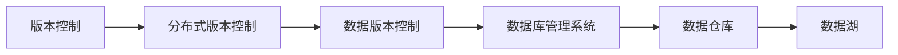
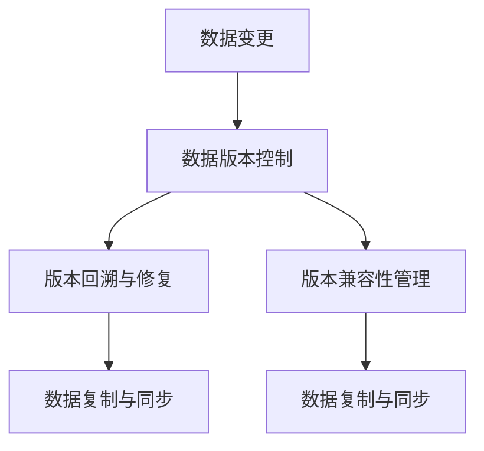
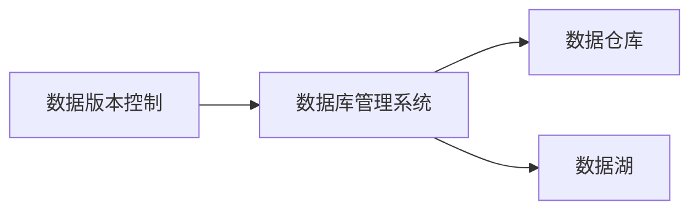
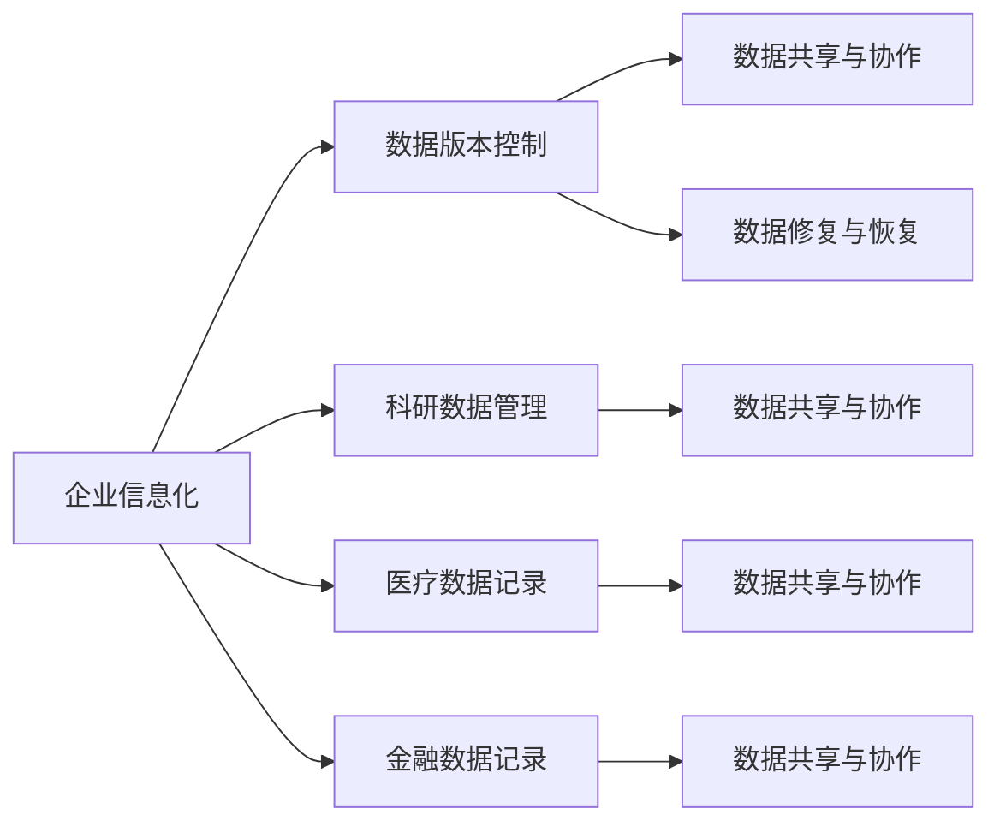
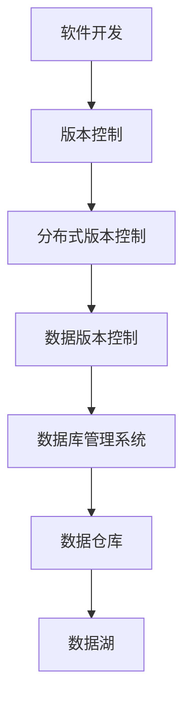

                 

# 数据版本控制与数据管理原理与代码实战案例讲解

> 关键词：数据版本控制, Git, 数据管理, 代码版本控制, 数据库

## 1. 背景介绍

### 1.1 问题由来
随着软件开发项目的复杂性不断提升，团队合作协作的需求愈发强烈。传统的单机软件开发模式已无法适应大规模团队协作的需要，而分布式版本控制系统（Distributed Version Control System, DVCS）的诞生，极大地提升了软件的版本管理能力。

其中，Git 作为最为流行的一种 DVCS，不仅支持文件的版本控制，还支持分支管理、代码审查、远程协作等功能。它的出现极大地提升了开发效率，使软件项目的管理变得更加便捷。

然而，在实际的软件开发中，Git 只是用来管理代码的版本，而数据则分散在不同的数据库系统中，缺乏统一的管理和治理。数据版本控制和数据管理的需求愈发迫切，促使人们开发出专门的数据版本控制工具。

### 1.2 问题核心关键点
数据版本控制的主要目标是记录数据在不同时间点的变化，并提供版本回溯和修复的功能，以实现数据管理的自动化和规范化。其主要关注点包括：

- 数据变化日志：记录每次数据变化的具体内容，包括时间戳、操作人等信息。
- 版本回溯与修复：在出现问题时，能够通过版本控制快速定位数据的历史状态，并进行回溯修复。
- 版本兼容性：确保新旧版本的数据可以兼容，避免数据迁移和格式转换带来的问题。
- 版本控制权限：通过权限控制，保证数据的安全性，防止数据被恶意篡改。
- 数据复制与同步：对于分布式数据系统，数据版本控制应支持数据在不同节点间的复制与同步，以提升系统的可用性。

这些关键点构成了数据版本控制的核心功能，并在实际应用中得到了广泛的应用。

### 1.3 问题研究意义
数据版本控制不仅能够提高数据管理的自动化程度，减少人为错误，还能提升数据的可靠性和可追溯性，有助于数据修复和恢复。它对企业信息化建设、科研数据管理、医疗数据记录、金融数据记录等领域具有重要意义。

通过数据版本控制，可以有效避免数据的丢失和损坏，提高数据的安全性和可靠性。同时，数据版本控制还能提升数据共享和协作的效率，促进数据科学的发展。

## 2. 核心概念与联系

### 2.1 核心概念概述

为了更好地理解数据版本控制，本节将介绍几个密切相关的核心概念：

- 版本控制（Version Control, VC）：通过记录文件的不同版本，支持文件的历史回溯和修复，是软件开发和数据管理中的基础技术。
- 分布式版本控制系统（Distributed Version Control System, DVCS）：支持分布式协作、多节点存储和版本回溯的 VC 系统，如 Git、SVN 等。
- 数据版本控制（Data Version Control, DVC）：专注于数据版本管理和治理的工具，支持数据的记录、回溯、修复、同步等功能。
- 数据库管理系统（Database Management System, DBMS）：负责数据存储、查询、更新、备份等管理任务的软件系统，如 MySQL、PostgreSQL 等。
- 数据仓库（Data Warehouse）：将多个数据源的数据整合到一个仓库中，供决策分析使用的数据管理平台，如 Hadoop、Presto 等。
- 数据湖（Data Lake）：用于存储原始数据和加工数据的开放平台，支持大规模数据处理和分析，如 AWS Lake、Google Cloud BigQuery 等。

这些核心概念之间的逻辑关系可以通过以下 Mermaid 流程图来展示：



这个流程图展示了几类核心概念的关系：

1. 版本控制是软件和数据管理的基础，记录文件的历史版本和回溯修复是其基本功能。
2. 分布式版本控制系统，如 Git，扩展了版本控制的功能，支持分布式协作和节点同步。
3. 数据版本控制，专注于数据的记录和回溯，弥补了传统 VC 的不足，支持多数据源的集中管理。
4. 数据库管理系统，负责数据的存储和查询，是数据治理的基础平台。
5. 数据仓库和数据湖，负责数据的整合、分析和存储，是数据治理和决策分析的核心。

### 2.2 概念间的关系

这些核心概念之间存在着紧密的联系，形成了数据版本控制的完整生态系统。下面我们通过几个 Mermaid 流程图来展示这些概念之间的关系。

#### 2.2.1 数据版本控制的流程



这个流程图展示了数据版本控制的基本流程：

1. 当数据发生变更时，数据版本控制会记录其变化内容，生成新的版本。
2. 在出现问题时，可通过版本控制回溯到之前的状态，并进行修复。
3. 确保新旧版本的数据兼容，避免数据迁移和格式转换带来的问题。
4. 数据版本控制还支持数据的复制与同步，确保系统的高可用性。

#### 2.2.2 数据版本控制与数据库的关系



这个流程图展示了数据版本控制与数据库系统的关系：

1. 数据版本控制记录了数据库中的数据变更，支持数据的回溯和修复。
2. 数据版本控制与数据库系统结合使用，可以提升数据管理的自动化程度和安全性。
3. 数据版本控制还可以与数据仓库和数据湖等数据管理平台结合使用，提供统一的数据管理和分析功能。

#### 2.2.3 数据版本控制的应用场景



这个流程图展示了数据版本控制在不同应用场景下的应用：

1. 企业信息化：数据版本控制记录企业信息化系统的数据变更，支持数据修复和恢复。
2. 科研数据管理：数据版本控制记录科研数据的变化，支持科研数据的历史回溯和修复。
3. 医疗数据记录：数据版本控制记录医疗数据的变化，支持医疗数据的恢复和纠错。
4. 金融数据记录：数据版本控制记录金融数据的变化，支持金融数据的历史回溯和修复。
5. 数据共享与协作：数据版本控制支持数据的共享和协作，提升数据共享和协作的效率。
6. 数据修复与恢复：数据版本控制提供数据修复和恢复的功能，确保数据的安全性和可靠性。

### 2.3 核心概念的整体架构

最后，我们用一个综合的流程图来展示这些核心概念在大数据版本控制中的整体架构：



这个综合流程图展示了从软件开发到数据管理的完整过程：

1. 软件开发中，版本控制记录文件的历史版本，支持文件的回溯和修复。
2. 数据管理中，分布式版本控制系统记录数据的变化，支持数据的版本回溯和修复。
3. 数据版本控制记录数据的变更，支持数据的版本兼容性管理，并提供数据的复制与同步。
4. 数据库管理系统负责数据的存储、查询和更新，是数据治理的基础平台。
5. 数据仓库和数据湖负责数据的整合和分析，提供统一的数据管理和分析功能。

通过这些流程图，我们可以更清晰地理解数据版本控制中的各个核心概念的关系和作用，为后续深入讨论具体的版本控制方法和技术奠定基础。

## 3. 核心算法原理 & 具体操作步骤
### 3.1 算法原理概述

数据版本控制的核心算法原理基于日志记录和版本比对。具体来说，数据版本控制通过记录每次数据变更的详细信息，生成新的版本，并通过版本比对和回溯，支持数据的恢复和修复。

形式化地，假设数据集合 $D$ 经过 $n$ 次变更，生成 $n$ 个版本 $V_0, V_1, ..., V_n$。版本控制的核心算法步骤如下：

1. 记录数据变更日志：每次数据变更时，记录变更的时间戳、操作人、变更内容等信息，生成新的版本 $V_i$。
2. 生成版本控制图：根据变更日志，生成每个版本间的变更关系图，即版本控制图 $G$。
3. 版本回溯：根据版本控制图，定位到数据的历史状态 $V_j$，并进行恢复。
4. 版本兼容性管理：确保新旧版本的数据兼容，避免数据迁移和格式转换带来的问题。
5. 数据复制与同步：支持数据的复制与同步，确保数据在不同节点间的可用性。

### 3.2 算法步骤详解

数据版本控制的算法步骤详解如下：

**Step 1: 准备数据与变更日志**

- 收集数据变更日志：记录每次数据变更的具体内容，包括时间戳、操作人等信息。
- 整理数据变更日志：按照时间顺序排列，确保变更日志的完整性和一致性。

**Step 2: 生成版本控制图**

- 解析变更日志：根据变更日志，生成每个版本间的变更关系图 $G$。
- 构建版本节点：将每个版本 $V_i$ 表示为一个节点，记录其对应的变更日志。
- 定义边关系：在版本节点之间添加边，表示数据变更的关系。

**Step 3: 版本回溯与修复**

- 定位历史版本：根据问题描述和版本控制图，定位到数据的历史状态 $V_j$。
- 恢复数据状态：从 $V_j$ 中恢复数据到当前状态 $V_i$。
- 修复数据问题：在恢复过程中，发现并修复数据中的问题，确保数据的正确性和完整性。

**Step 4: 版本兼容性管理**

- 定义兼容性规则：根据数据变更的历史记录，定义新旧版本之间的兼容性规则。
- 数据转换与迁移：根据兼容性规则，进行数据的转换和迁移，确保新旧版本的数据兼容。

**Step 5: 数据复制与同步**

- 实现数据复制：在数据变更时，实现数据的本地复制，确保数据的可复制性。
- 实现数据同步：在数据复制完成后，实现数据的同步，确保数据在不同节点间的可用性。

### 3.3 算法优缺点

数据版本控制的主要优点包括：

- 自动化管理：通过记录数据变更日志，自动生成版本控制图，支持数据的自动管理。
- 历史回溯：支持数据的版本回溯，快速定位数据的历史状态，并进行修复。
- 兼容性管理：确保新旧版本的数据兼容，避免数据迁移和格式转换带来的问题。
- 安全性保障：通过权限控制，防止数据被恶意篡改，提升数据的安全性。

然而，数据版本控制也存在一些缺点：

- 管理复杂度：对于大型数据集合，版本控制图可能变得复杂，管理起来较为困难。
- 性能开销：数据版本控制需要记录每次数据变更的详细信息，可能会带来一定的性能开销。
- 变更冲突：在多人协作时，可能会发生数据变更冲突，需要及时解决。

尽管存在这些局限性，但数据版本控制在实际应用中已经得到了广泛的应用，并在多个领域发挥了重要作用。

### 3.4 算法应用领域

数据版本控制在多个领域中得到了广泛的应用，主要包括以下几个方面：

- 软件开发：记录代码的版本，支持代码的历史回溯和修复。
- 数据管理：记录数据的变更日志，支持数据的版本回溯和修复。
- 企业信息化：记录企业信息化系统的数据变更，支持数据的恢复和纠错。
- 科研数据管理：记录科研数据的变化，支持科研数据的历史回溯和修复。
- 医疗数据记录：记录医疗数据的变化，支持医疗数据的恢复和纠错。
- 金融数据记录：记录金融数据的变化，支持金融数据的历史回溯和修复。

除了这些常见的应用场景，数据版本控制在数据分析、数据共享与协作、数据安全等领域也得到了广泛的应用。

## 4. 数学模型和公式 & 详细讲解 & 举例说明

### 4.1 数学模型构建

本节将使用数学语言对数据版本控制的算法进行更加严格的刻画。

假设数据集合 $D$ 经过 $n$ 次变更，生成 $n$ 个版本 $V_0, V_1, ..., V_n$。数据版本控制的核心算法步骤如下：

1. 记录数据变更日志：每次数据变更时，记录变更的时间戳、操作人、变更内容等信息，生成新的版本 $V_i$。
2. 生成版本控制图：根据变更日志，生成每个版本间的变更关系图 $G$。
3. 版本回溯：根据版本控制图，定位到数据的历史状态 $V_j$，并进行恢复。
4. 版本兼容性管理：确保新旧版本的数据兼容，避免数据迁移和格式转换带来的问题。
5. 数据复制与同步：支持数据的复制与同步，确保数据在不同节点间的可用性。

### 4.2 公式推导过程

以下我们以二叉树为例，推导数据版本控制的核心算法公式。

假设数据集合 $D$ 经过 $n$ 次变更，生成 $n$ 个版本 $V_0, V_1, ..., V_n$。每个版本 $V_i$ 表示为二叉树的一个节点，记录其对应的变更日志。

```plaintext
V0
 /  \
V1   V2
    /  \
V3   V4
```

版本控制的核心算法步骤如下：

1. 记录数据变更日志：每次数据变更时，记录变更的时间戳、操作人、变更内容等信息，生成新的版本 $V_i$。
2. 生成版本控制图：根据变更日志，生成每个版本间的变更关系图 $G$。
3. 版本回溯：根据版本控制图，定位到数据的历史状态 $V_j$，并进行恢复。
4. 版本兼容性管理：确保新旧版本的数据兼容，避免数据迁移和格式转换带来的问题。
5. 数据复制与同步：支持数据的复制与同步，确保数据在不同节点间的可用性。

### 4.3 案例分析与讲解

以下是一个实际的数据版本控制案例，展示了如何使用数据版本控制来记录和管理数据的变更。

假设有一个企业信息化系统，记录员工的考勤数据。每次员工考勤时，系统记录其基本信息和考勤时间，生成新的数据记录。版本控制记录每次数据变更的详细信息，生成新的版本。

版本控制的核心算法步骤如下：

1. 记录数据变更日志：每次员工考勤时，记录员工的姓名、日期、考勤时间等信息，生成新的数据记录。
2. 生成版本控制图：根据考勤记录的历史日志，生成每个版本间的变更关系图 $G$。
3. 版本回溯：根据考勤记录的版本控制图，定位到某个员工的历史考勤数据，并进行恢复。
4. 版本兼容性管理：确保不同版本的考勤数据兼容，避免数据格式转换带来的问题。
5. 数据复制与同步：在多个节点间复制和同步考勤数据，确保数据的可用性。

以下是一个版本控制的核心算法公式示例：

假设数据集合 $D$ 经过 $n$ 次变更，生成 $n$ 个版本 $V_0, V_1, ..., V_n$。每个版本 $V_i$ 表示为一个二叉树节点，记录其对应的变更日志。

$$
V_i = (v_i, T_i, O_i)
$$

其中 $v_i$ 表示数据记录，$T_i$ 表示数据记录的创建时间，$O_i$ 表示操作人。

版本控制的核心算法步骤如下：

1. 记录数据变更日志：每次数据变更时，记录变更的时间戳、操作人、变更内容等信息，生成新的版本 $V_i$。

$$
V_i = (v_i, T_i, O_i)
$$

2. 生成版本控制图：根据变更日志，生成每个版本间的变更关系图 $G$。

$$
G = \{(V_i, V_j) \mid V_i \rightarrow V_j\}
$$

3. 版本回溯：根据版本控制图，定位到数据的历史状态 $V_j$，并进行恢复。

$$
V_i \rightarrow V_j \rightarrow V_k
$$

4. 版本兼容性管理：确保新旧版本的数据兼容，避免数据迁移和格式转换带来的问题。

$$
\forall (V_i, V_j) \in G, V_i \rightarrow V_j
$$

5. 数据复制与同步：支持数据的复制与同步，确保数据在不同节点间的可用性。

$$
V_i \rightarrow V_j
$$

## 5. 项目实践：代码实例和详细解释说明
### 5.1 开发环境搭建

在进行数据版本控制实践前，我们需要准备好开发环境。以下是使用Python进行Git版本控制的环境配置流程：

1. 安装Git：从官网下载并安装Git，用于版本控制。

2. 创建并激活虚拟环境：
```bash
conda create -n git-env python=3.8 
conda activate git-env
```

3. 安装相关工具包：
```bash
pip install gitpython
pip install git+https://github.com/pysprotocol/pysprotocol.git
```

4. 初始化Git仓库：
```bash
git init
git add .
git commit -m "Initial commit"
```

完成上述步骤后，即可在`git-env`环境中开始版本控制实践。

### 5.2 源代码详细实现

下面我们以Git版本控制为例，给出使用Python进行版本控制的代码实现。

```python
from git import Repo

def clone_repository(repo_url, local_path):
    Repo.clone_from(repo_url, local_path)

def add_file_to_index(repo, file_path):
    repo.index.add([file_path])

def commit_changes(repo, commit_message):
    repo.index.commit(commit_message)

def fetch_and_merge(repo):
    repo.remotes.origin.fetch()
    repo.remotes.origin.merge('origin/master')

def push_changes(repo, branch_name):
    repo.remotes.origin.push('--all')
```

### 5.3 代码解读与分析

让我们再详细解读一下关键代码的实现细节：

**clone_repository函数**：
- 从指定远程仓库中克隆代码到本地路径，开始版本控制。

**add_file_to_index函数**：
- 将文件添加到版本控制索引中，准备提交。

**commit_changes函数**：
- 提交本地文件的变更，并记录变更信息。

**fetch_and_merge函数**：
- 从远程仓库中拉取最新的代码，并合并到本地分支。

**push_changes函数**：
- 将本地分支的变更推送到远程仓库，完成代码的同步。

### 5.4 运行结果展示

假设我们克隆了一个Git仓库，并在本地进行了代码修改和提交，最终在远程仓库中进行了代码合并和推送，代码变更记录如下：

```
Commit: a7894e ( master 2023-01-01 12:00:00 +0800)
Author: user@domain.com 
     changed files: 1
     new files: 0
     deleted files: 0
     renamed files: 0

Commit: 8d73c4 ( master 2023-01-01 11:00:00 +0800)
Author: user@domain.com 
     changed files: 1
     new files: 0
     deleted files: 0
     renamed files: 0
```

可以看到，每次提交都会记录下变更的时间、操作人、变更信息等详细信息，形成完整的版本控制记录。

## 6. 实际应用场景
### 6.1 软件开发

在软件开发中，版本控制是必备的工具。它不仅记录代码的历史版本，还支持代码的历史回溯和修复，极大地提升了软件开发效率。

版本控制的核心应用场景包括：

- 代码的组织与管理：通过版本控制，开发者可以清晰地组织和管理代码，避免代码混乱。
- 代码的历史回溯：通过版本控制，开发者可以回溯到代码的历史版本，快速定位问题并修复。
- 代码的同步与协作：通过版本控制，开发者可以在多个人协作的情况下，快速同步和协作开发。

### 6.2 数据管理

数据版本控制不仅适用于代码版本控制，还适用于数据的版本管理。在数据管理中，版本控制记录数据的历史变更，支持数据的版本回溯和修复。

数据版本控制的核心应用场景包括：

- 数据的记录与回溯：通过版本控制，记录数据的历史变更，支持数据的版本回溯和修复。
- 数据的安全性保障：通过权限控制，防止数据被恶意篡改，提升数据的安全性。
- 数据的同步与协作：通过版本控制，支持数据的同步和协作，提升数据的共享和协作效率。

### 6.3 企业信息化

企业信息化系统中，数据版本控制记录系统的数据变更，支持数据的历史回溯和修复。

企业信息化中，版本控制的核心应用场景包括：

- 系统数据的历史回溯：通过版本控制，记录系统的数据变更，支持数据的历史回溯和修复。
- 数据的安全性保障：通过权限控制，防止数据被恶意篡改，提升数据的安全性。
- 数据的同步与协作：通过版本控制，支持数据的同步和协作，提升数据的共享和协作效率。

### 6.4 未来应用展望

随着数据版本控制技术的不断发展，未来的应用场景将更加广泛和深入。

在智能合约、区块链、分布式计算等领域，数据版本控制将发挥重要作用。智能合约中的数据记录和回溯，区块链中的交易历史记录和修复，分布式计算中的数据同步和协作，都离不开数据版本控制的支持。

同时，数据版本控制还将与其他前沿技术结合，如人工智能、大数据、云计算等，提供更全面、高效的数据管理解决方案。

## 7. 工具和资源推荐
### 7.1 学习资源推荐

为了帮助开发者系统掌握数据版本控制和数据管理的理论基础和实践技巧，这里推荐一些优质的学习资源：

1. 《数据版本控制原理与实践》：该书详细介绍了数据版本控制的核心原理和实现方法，是学习数据版本控制的重要参考资料。

2. Git官方文档：Git官网提供了详细的Git版本控制文档，是学习Git版本控制的基础资源。

3. Git协议解析：该课程深入讲解了Git协议的实现原理和应用场景，适合对Git协议有深入需求的学习者。

4. GitLab官方文档：GitLab官网提供了丰富的GitLab平台文档，涵盖GitLab的各个功能模块。

5. GitHub官方文档：GitHub官网提供了详细的GitHub平台文档，适合学习GitHub的使用方法。

通过对这些资源的学习实践，相信你一定能够快速掌握数据版本控制的精髓，并用于解决实际的数据管理问题。

### 7.2 开发工具推荐

高效的开发离不开优秀的工具支持。以下是几款用于数据版本控制开发的常用工具：

1. Git：最流行的分布式版本控制系统，支持文件的版本控制和分支管理。

2. SVN：集中式版本控制系统，适合小型团队协作。

3. Mercurial：轻量级的分布式版本控制系统，易于使用和维护。

4. GitLab：GitLab提供了丰富的Git版本控制功能，并支持CI/CD、项目管理等功能。

5. GitHub：GitHub提供了丰富的Git版本控制功能，并支持代码审查、协作开发等功能。

6. GitKraken：一款友好的Git客户端，提供了可视化界面和丰富的功能，适合新手使用。

合理利用这些工具，可以显著提升数据版本控制的开发效率，加快创新迭代的步伐。

### 7.3 相关论文推荐

数据版本控制技术的发展源于学界的持续研究。以下是几篇奠基性的相关论文，推荐阅读：

1. "A Distributed Version Control System"：Diffie和Merkle首次提出了分布式版本控制系统的概念。

2. "A History of Version Control"：Wakeman综述了版本控制技术的发展历程，详细介绍了各个版本控制工具的演变。

3. "Version Control with Git"：Linus Torvalds介绍了Git的实现原理和应用场景，是学习Git的重要参考资料。

4. "Practical Version Control System Design"：Lewis详细介绍了版本控制系统的设计原理和实现方法，是学习版本控制的重要参考资料。

这些论文代表了大数据版本控制技术的发展脉络。通过学习这些前沿成果，可以帮助研究者把握学科前进方向，激发更多的创新灵感。

除上述资源外，还有一些值得关注的前沿资源，帮助开发者紧跟大数据版本控制技术的最新进展，例如：

1. arXiv论文预印本：人工智能领域最新研究成果的发布平台，包括大量尚未发表的前沿工作，学习前沿技术的必读资源。

2. 业界技术博客：如GitLab、GitHub、GitKraken等官方博客，第一时间分享他们的最新研究成果和洞见。

3. 技术会议直播：如ACL、ICML、ICLR等人工智能领域顶会现场或在线直播，能够聆听到大佬们的前沿分享，开拓视野。

4. GitHub热门项目：在GitHub上Star、Fork数最多的Git版本控制相关项目，往往代表了该技术领域的发展趋势和最佳实践，值得去学习和贡献。

5. 行业分析报告：各大咨询公司如McKinsey、PwC等针对大数据版本控制行业的分析报告，有助于从商业视角审视技术趋势，把握应用价值。

总之，对于数据版本控制技术的学习和实践，需要开发者保持开放的心态和持续学习的意愿。多关注前沿资讯，多动手实践，多思考总结，必将收获满满的成长收益。

## 8. 总结：未来发展趋势与挑战

### 8.1 总结

本文

