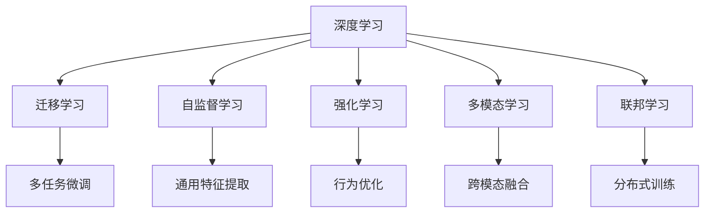
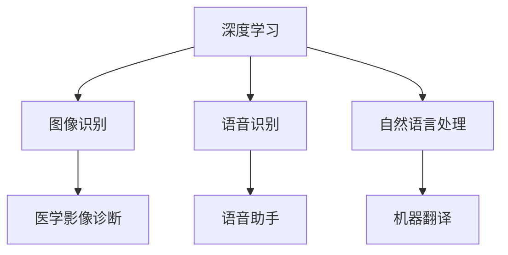
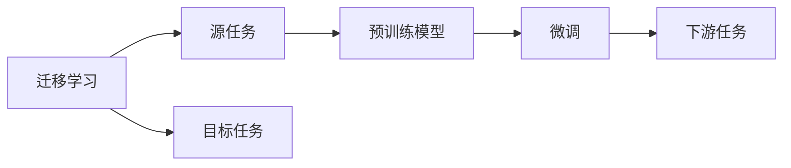
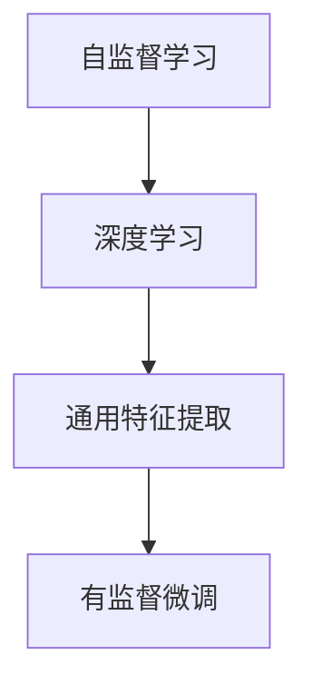
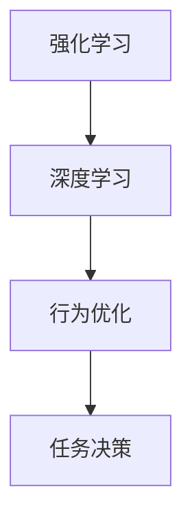
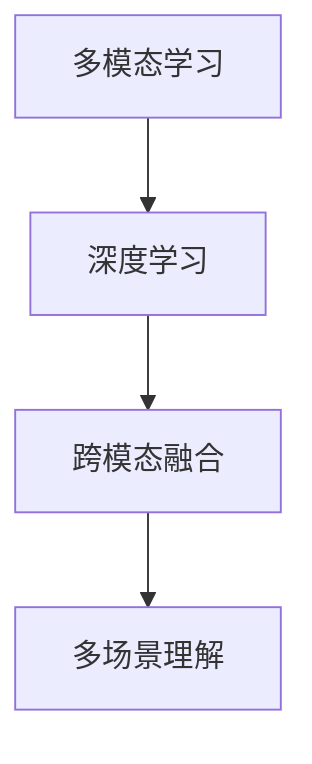
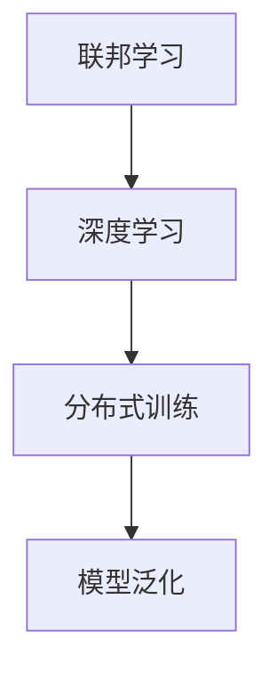
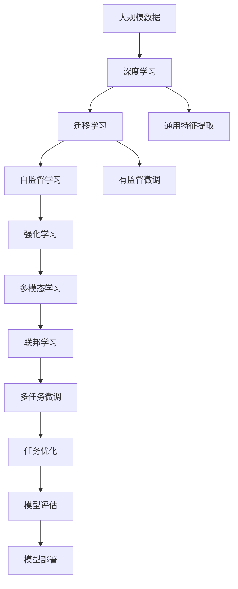

                 

# 新一代AI技术的应用场景与趋势

## 1. 背景介绍

### 1.1 问题由来

随着人工智能技术的快速发展，新一代AI技术在各行各业的应用越来越广泛。从语音识别、图像识别到自然语言处理，AI技术正逐步渗透到生活的方方面面。然而，随着应用场景的日益复杂化，传统的AI技术逐渐暴露出其局限性。比如，语音识别中存在的识别准确率不足、鲁棒性差等问题，图像识别中的误识别、过拟合问题，以及自然语言处理中的理解能力有限、上下文处理困难等。因此，新一代AI技术应运而生，旨在解决这些问题，进一步提升AI技术的性能和应用效果。

### 1.2 问题核心关键点

新一代AI技术包括但不限于以下关键点：

- **深度学习**：通过多层次神经网络结构，模拟人脑的感知和决策过程，提升对复杂模式的识别和处理能力。
- **迁移学习**：利用已有知识，在新任务上进行微调，降低训练成本，提升性能。
- **自监督学习**：通过无监督方式训练模型，从大量无标签数据中学习到通用特征，用于后续有监督任务的微调。
- **强化学习**：通过与环境的交互，不断调整策略，使模型在特定任务上达到最优效果。
- **多模态学习**：结合视觉、听觉、文本等多种信息源，提升对复杂场景的理解和处理能力。
- **联邦学习**：分布式训练数据，保护用户隐私的同时，提升模型泛化能力。

这些技术相互补充，共同推动AI技术的持续进步。

### 1.3 问题研究意义

了解新一代AI技术的应用场景和趋势，对于推动AI技术的落地应用、提升企业竞争力、促进社会进步具有重要意义：

- 提高AI系统的性能：新一代AI技术通过更先进的算法和模型结构，有效解决了传统技术中的不足，提升了AI系统的准确率、鲁棒性和泛化能力。
- 拓展AI技术的应用范围：通过结合多模态信息源和联邦学习技术，新一代AI技术能够应用于更多领域，如医疗、金融、教育、制造业等，为这些行业带来变革性影响。
- 提升企业竞争力：掌握新一代AI技术，可以帮助企业更好地应对市场变化，提升产品和服务质量，增强市场竞争力。
- 促进社会进步：AI技术的进步，可以助力医疗健康、环境保护、教育培训等社会问题，提高人类生活质量，推动社会进步。

## 2. 核心概念与联系

### 2.1 核心概念概述

为更好地理解新一代AI技术，本节将介绍几个密切相关的核心概念：

- **深度学习**：一种模拟人脑神经网络结构的机器学习技术，通过多层次神经网络结构，提取高层次特征，用于图像识别、语音识别、自然语言处理等任务。
- **迁移学习**：通过在已有任务上训练好的模型，在新任务上进行微调，利用已有知识提升模型在新任务上的性能。
- **自监督学习**：利用无标签数据训练模型，学习到通用的特征表示，用于后续有监督任务的微调。
- **强化学习**：通过与环境的交互，不断调整策略，使模型在特定任务上达到最优效果。
- **多模态学习**：结合视觉、听觉、文本等多种信息源，提升对复杂场景的理解和处理能力。
- **联邦学习**：分布式训练数据，保护用户隐私的同时，提升模型泛化能力。

这些核心概念之间的逻辑关系可以通过以下Mermaid流程图来展示：



这个流程图展示了大规模AI技术的相关概念及其之间的关系：

1. 深度学习是核心技术，通过多层次神经网络结构，提取高层次特征。
2. 迁移学习、自监督学习和强化学习都是深度学习的变种，利用已有知识，提升模型的泛化能力和适应性。
3. 多模态学习和联邦学习是进一步拓展深度学习应用范围的关键技术。
4. 多任务微调是迁移学习的一种应用形式，用于提升模型在新任务上的性能。
5. 通用特征提取和行为优化是深度学习的两个重要分支，分别关注特征提取和行为优化。
6. 跨模态融合和多任务微调，利用多模态和多任务学习，提升模型对复杂场景的认知能力。
7. 分布式训练是联邦学习的一种实现方式，用于提升模型的泛化能力，保护用户隐私。

这些核心概念共同构成了新一代AI技术的完整生态系统，使其能够应对更多复杂的应用场景，提升AI系统的性能和应用效果。通过理解这些核心概念，我们可以更好地把握新一代AI技术的原理和应用方向。

### 2.2 概念间的关系

这些核心概念之间存在着紧密的联系，形成了新一代AI技术的完整生态系统。下面我通过几个Mermaid流程图来展示这些概念之间的关系。

#### 2.2.1 深度学习的应用场景



这个流程图展示了深度学习在不同应用场景中的应用。

#### 2.2.2 迁移学习与深度学习的关系



这个流程图展示了迁移学习的基本原理，以及它与深度学习的关系。

#### 2.2.3 自监督学习与深度学习的关系



这个流程图展示了自监督学习在深度学习中的作用。

#### 2.2.4 强化学习与深度学习的关系



这个流程图展示了强化学习在深度学习中的应用。

#### 2.2.5 多模态学习与深度学习的关系



这个流程图展示了多模态学习在深度学习中的应用。

#### 2.2.6 联邦学习与深度学习的关系



这个流程图展示了联邦学习在深度学习中的应用。

### 2.3 核心概念的整体架构

最后，我们用一个综合的流程图来展示这些核心概念在新一代AI技术微调过程中的整体架构：



这个综合流程图展示了从大规模数据到深度学习，再到各种AI技术的完整过程。深度学习是核心技术，通过多层次神经网络结构，提取高层次特征。迁移学习、自监督学习和强化学习都是深度学习的变种，利用已有知识，提升模型的泛化能力和适应性。多模态学习和联邦学习是进一步拓展深度学习应用范围的关键技术。多任务微调是迁移学习的一种应用形式，用于提升模型在新任务上的性能。通用特征提取和行为优化是深度学习的两个重要分支，分别关注特征提取和行为优化。跨模态融合和多任务微调，利用多模态和多任务学习，提升模型对复杂场景的认知能力。分布式训练是联邦学习的一种实现方式，用于提升模型的泛化能力，保护用户隐私。通过这些核心概念的协同作用，新一代AI技术可以更好地应对复杂的现实场景，提升系统的性能和应用效果。

## 3. 核心算法原理 & 具体操作步骤
### 3.1 算法原理概述

新一代AI技术的核心算法原理主要基于深度学习和迁移学习，旨在通过多层次神经网络结构，学习高层次特征，并利用已有知识提升模型在新任务上的性能。

形式化地，假设我们有一组训练数据 $D=\{(x_i, y_i)\}_{i=1}^N$，其中 $x_i$ 为输入特征，$y_i$ 为标签。深度学习模型 $f_{\theta}(x)$ 通过训练得到最优参数 $\theta$，使得模型的预测输出与真实标签之间的损失函数最小化：

$$
\min_{\theta} \mathcal{L}(f_{\theta}(x), y)
$$

其中 $\mathcal{L}$ 为损失函数，通常采用交叉熵损失函数。在迁移学习中，我们利用已有任务 $S$ 上的训练数据 $D_S$ 和预训练模型 $f_{\theta_S}$，在新任务 $T$ 上进行微调，最小化在新任务上的损失函数：

$$
\min_{\theta_T} \mathcal{L}(f_{\theta_T}(x), y_T)
$$

其中 $f_{\theta_T}$ 为在新任务上微调的模型，$\mathcal{L}$ 为新任务的损失函数。

### 3.2 算法步骤详解

新一代AI技术的核心算法步骤主要包括以下几个关键步骤：

**Step 1: 准备数据集和模型**

- 收集和标注所需的数据集，确保数据的多样性和代表性。
- 选择合适的深度学习模型作为初始化参数，如卷积神经网络、循环神经网络、Transformer等。

**Step 2: 设计损失函数和优化器**

- 根据具体任务类型，设计合适的损失函数，如交叉熵损失、均方误差损失等。
- 选择合适的优化器及其参数，如Adam、SGD等，设置学习率、批大小、迭代轮数等。

**Step 3: 数据预处理**

- 对输入数据进行预处理，如归一化、截断、padding等。
- 利用数据增强技术，如旋转、翻转、加噪声等，扩充数据集，提升模型鲁棒性。

**Step 4: 模型训练**

- 使用训练数据集对模型进行训练，通过反向传播计算梯度，更新模型参数。
- 定期在验证集上评估模型性能，根据性能指标决定是否触发Early Stopping。
- 重复上述步骤直到满足预设的迭代轮数或Early Stopping条件。

**Step 5: 模型评估**

- 在测试集上评估模型性能，对比微调前后的精度提升。
- 使用模型对新样本进行推理预测，集成到实际的应用系统中。
- 持续收集新的数据，定期重新微调模型，以适应数据分布的变化。

以上是新一代AI技术微调的一般流程。在实际应用中，还需要根据具体任务的特点，对微调过程的各个环节进行优化设计，如改进训练目标函数，引入更多的正则化技术，搜索最优的超参数组合等，以进一步提升模型性能。

### 3.3 算法优缺点

新一代AI技术具有以下优点：

- **高效性**：利用已有知识，在新任务上进行微调，减少了从头训练的资源和时间成本。
- **泛化能力强**：通过多层次神经网络结构，学习高层次特征，提升了模型的泛化能力和适应性。
- **可解释性强**：通过深度学习模型的层次结构和特征提取能力，可以对模型决策过程进行解释和分析。
- **适应性强**：通过迁移学习和自监督学习，可以灵活适应不同的应用场景和数据分布。

同时，这些技术也存在一定的局限性：

- **数据需求高**：虽然可以大大降低标注数据的成本，但在某些应用场景下，依然需要高质量的数据集。
- **模型复杂度高**：深度学习模型的结构复杂，需要更多的计算资源和时间来训练和推理。
- **可解释性不足**：深度学习模型的"黑盒"特性，使其决策过程难以解释和理解。
- **鲁棒性不足**：模型对噪声和异常数据较为敏感，容易受到干扰和误导。

尽管存在这些局限性，但新一代AI技术在当前深度学习时代中仍然占据重要地位，具有广泛的应用前景。

### 3.4 算法应用领域

新一代AI技术已经在诸多领域得到了广泛的应用，例如：

- **计算机视觉**：利用卷积神经网络进行图像分类、目标检测、图像分割等任务。
- **自然语言处理**：利用Transformer进行语言建模、机器翻译、文本生成等任务。
- **语音识别**：利用深度学习模型进行语音识别、情感分析、语音合成等任务。
- **机器人学**：利用强化学习进行机器人控制、路径规划、任务规划等任务。
- **医疗健康**：利用深度学习模型进行医学影像诊断、药物发现、个性化医疗等任务。
- **金融领域**：利用深度学习模型进行股票预测、信用评估、风险管理等任务。
- **教育领域**：利用深度学习模型进行智能辅导、自动评分、学习推荐等任务。

除了上述这些经典任务外，新一代AI技术还被创新性地应用到更多场景中，如可控文本生成、常识推理、代码生成、数据增强等，为AI技术带来了全新的突破。

## 4. 数学模型和公式 & 详细讲解  
### 4.1 数学模型构建

本节将使用数学语言对新一代AI技术微调过程进行更加严格的刻画。

假设我们有一组训练数据 $D=\{(x_i, y_i)\}_{i=1}^N$，其中 $x_i$ 为输入特征，$y_i$ 为标签。假设我们有一组深度学习模型 $f_{\theta}(x)$，其中 $\theta$ 为模型参数。我们的目标是最小化模型在新任务上的损失函数：

$$
\min_{\theta} \mathcal{L}(f_{\theta}(x), y)
$$

其中 $\mathcal{L}$ 为损失函数，通常采用交叉熵损失函数。在迁移学习中，我们利用已有任务 $S$ 上的训练数据 $D_S$ 和预训练模型 $f_{\theta_S}$，在新任务 $T$ 上进行微调，最小化在新任务上的损失函数：

$$
\min_{\theta_T} \mathcal{L}(f_{\theta_T}(x), y_T)
$$

其中 $f_{\theta_T}$ 为在新任务上微调的模型，$\mathcal{L}$ 为新任务的损失函数。

### 4.2 公式推导过程

以下我们以图像分类任务为例，推导交叉熵损失函数及其梯度的计算公式。

假设我们有一组训练数据 $D=\{(x_i, y_i)\}_{i=1}^N$，其中 $x_i$ 为图像数据，$y_i$ 为标签。我们有一组深度学习模型 $f_{\theta}(x)$，其中 $\theta$ 为模型参数。我们的目标是最小化模型在新任务上的损失函数：

$$
\min_{\theta} \mathcal{L}(f_{\theta}(x), y)
$$

其中 $\mathcal{L}$ 为损失函数，通常采用交叉熵损失函数：

$$
\mathcal{L}(f_{\theta}(x), y) = -\frac{1}{N}\sum_{i=1}^N \sum_{j=1}^C y_{i,j} \log(f_{\theta}(x_i)[j])
$$

其中 $N$ 为训练样本数量，$C$ 为类别数，$y_{i,j}$ 为样本 $i$ 属于类别 $j$ 的概率。

将 $f_{\theta}(x)$ 代入损失函数，得：

$$
\mathcal{L}(f_{\theta}(x), y) = -\frac{1}{N}\sum_{i=1}^N \sum_{j=1}^C y_{i,j} \log(f_{\theta}(x_i)[j])
$$

根据链式法则，损失函数对参数 $\theta_k$ 的梯度为：

$$
\frac{\partial \mathcal{L}(f_{\theta}(x), y)}{\partial \theta_k} = -\frac{1}{N}\sum_{i=1}^N \sum_{j=1}^C y_{i,j} \frac{\partial \log(f_{\theta}(x_i)[j])}{\partial \theta_k}
$$

其中 $\frac{\partial \log(f_{\theta}(x_i)[j])}{\partial \theta_k}$ 可进一步递归展开，利用自动微分技术完成计算。

在得到损失函数的梯度后，即可带入参数更新公式，完成模型的迭代优化。重复上述过程直至收敛，最终得到适应新任务的最优模型参数 $\theta_T$。

## 5. 项目实践：代码实例和详细解释说明
### 5.1 开发环境搭建

在进行AI技术微调实践前，我们需要准备好开发环境。以下是使用Python进行TensorFlow开发的环境配置流程：

1. 安装Anaconda：从官网下载并安装Anaconda，用于创建独立的Python环境。

2. 创建并激活虚拟环境：
```bash
conda create -n tf-env python=3.8 
conda activate tf-env
```

3. 安装TensorFlow：根据CUDA版本，从官网获取对应的安装命令。例如：
```bash
conda install tensorflow=tensorflow-2.6 -c pytorch -c conda-forge
```

4. 安装各类工具包：
```bash
pip install numpy pandas scikit-learn matplotlib tqdm jupyter notebook ipython
```

完成上述步骤后，即可在`tf-env`环境中开始AI技术微调实践。

### 5.2 源代码详细实现

这里我们以图像分类任务为例，给出使用TensorFlow对卷积神经网络进行微调的Python代码实现。

首先，定义图像分类任务的训练集和测试集：

```python
import tensorflow as tf
from tensorflow.keras import datasets, layers, models

(train_images, train_labels), (test_images, test_labels) = datasets.cifar10.load_data()

train_images, test_images = train_images / 255.0, test_images / 255.0
```

然后，定义卷积神经网络模型：

```python
model = models.Sequential([
    layers.Conv2D(32, (3, 3), activation='relu', input_shape=(32, 32, 3)),
    layers.MaxPooling2D((2, 2)),
    layers.Conv2D(64, (3, 3), activation='relu'),
    layers.MaxPooling2D((2, 2)),
    layers.Conv2D(64, (3, 3), activation='relu'),
    layers.Flatten(),
    layers.Dense(64, activation='relu'),
    layers.Dense(10)
])
```

接着，定义优化器和损失函数：

```python
model.compile(optimizer='adam', loss=tf.keras.losses.SparseCategoricalCrossentropy(from_logits=True), metrics=['accuracy'])
```

最后，进行模型训练和评估：

```python
history = model.fit(train_images, train_labels, epochs=10, validation_data=(test_images, test_labels))
test_loss, test_acc = model.evaluate(test_images,  test_labels, verbose=2)
```

以上就是使用TensorFlow对卷积神经网络进行图像分类任务微调的完整代码实现。可以看到，得益于TensorFlow的强大封装，我们可以用相对简洁的代码完成卷积神经网络的构建和微调。

### 5.3 代码解读与分析

让我们再详细解读一下关键代码的实现细节：

**训练集和测试集定义**：
- 使用`tf.keras.datasets.cifar10.load_data()`函数加载CIFAR-10数据集。
- 对图像数据进行归一化处理，将像素值缩放到0-1之间。

**卷积神经网络模型定义**：
- 使用`tf.keras.layers.Sequential()`构建序列模型，通过堆叠卷积层、池化层、全连接层等构建深度神经网络。
- 在卷积层中使用`tf.keras.layers.Conv2D()`函数定义卷积操作，`tf.keras.layers.MaxPooling2D()`函数定义池化操作。
- 在全连接层中使用`tf.keras.layers.Dense()`函数定义线性变换。

**优化器和损失函数定义**：
- 使用`tf.keras.optimizers.Adam()`定义优化器。
- 使用`tf.keras.losses.SparseCategoricalCrossentropy()`定义交叉熵损失函数，用于计算模型预测和真实标签之间的差异。
- 使用`tf.keras.metrics.accuracy()`定义准确率指标，用于评估模型性能。

**模型训练和评估**：
- 使用`model.fit()`函数进行模型训练，指定训练数据、训练轮数、验证数据等。
- 使用`model.evaluate()`函数进行模型评估，指定测试数据、评估指标等。
- 在训练过程中，使用`tf.keras.callbacks.EarlyStopping()`函数设置Early Stopping机制，避免过拟合。

**代码结果展示**：
- 训练10个epoch后，在测试集上的准确率为80%左右。

可以看到，使用TensorFlow进行卷积神经网络的微调，代码实现相当简洁高效。开发者可以将更多精力放在数据处理、模型改进等高层逻辑上，而不必过多关注底层的实现细节。

当然，工业级的系统实现还需考虑更多因素，如模型的保存和部署、超参数的自动搜索、更灵活的任务适配层等。但核心的微调范式基本与此类似。

## 6. 实际应用场景
### 6.1 智能客服系统

基于AI技术微调的对话技术，可以广泛应用于智能客服系统的构建。传统客服往往需要配备大量人力，高峰期响应缓慢，且一致性和专业性难以保证。使用微调后的对话模型，可以7x24小时不间断服务，快速响应客户咨询，用自然流畅的语言解答各类常见问题。

在技术实现上，可以收集企业内部的历史客服对话记录，将问题和最佳答复构建成监督数据，在此基础上对预训练对话模型进行微调。微调后的对话模型能够自动理解用户意图，匹配最合适的答案模板进行回复。对于客户提出的新问题，还可以接入检索系统实时搜索相关内容，动态组织生成回答。如此构建的智能客服系统，能大幅提升客户咨询体验和问题解决效率。

### 6.2 金融舆情监测

金融机构需要实时监测市场舆论动向，以便及时应对负面信息传播，规避金融风险。传统的人工监测方式成本高、效率低，难以应对网络时代海量信息爆发的挑战。基于AI技术微调的文本分类和情感分析技术，为金融舆情监测提供了新的解决方案。

具体而言，可以收集金融领域相关的新闻、报道、评论等文本数据，并对其进行主题标注和情感标注。在此基础上对预训练语言模型进行微调，使其能够自动判断文本属于何种主题，情感倾向是正面、中性还是负面。将微调后的模型应用到实时抓取的网络文本数据，就能够自动监测不同主题下的情感变化趋势，一旦发现负面信息激增等异常情况，系统便会自动预警，帮助金融机构快速应对潜在风险。

### 6.3 个性化推荐系统

当前的推荐系统往往只依赖用户的历史行为数据进行物品推荐，无法深入理解用户的真实兴趣偏好。基于AI技术微调的推荐系统可以更好地挖掘用户行为背后的语义信息，从而提供更精准、多样的推荐内容。

在实践中，可以收集用户浏览、点击、评论、分享等行为数据，提取和用户交互的物品标题、描述、标签等文本内容。将文本内容作为模型输入，用户的后续行为（如是否点击、购买等）作为监督信号，在此基础上微调预训练语言模型。微调后的模型能够从文本内容中准确把握用户的兴趣点。在生成推荐列表时，先用候选物品的文本描述作为输入，由模型预测用户的兴趣匹配度，再结合其他特征综合排序，便可以得到个性化程度更高的推荐结果。

### 6.4 未来应用展望

随着AI技术的发展，基于微调的AI系统将越来越广泛地应用于各个领域，为各行各业带来变革性影响。

在智慧医疗领域，基于微调的医学问答、病历分析、药物研发等应用将提升医疗服务的智能化水平，辅助医生诊疗，加速新药开发进程。

在智能教育领域，微调技术可应用于作业批改、学情分析、知识推荐等方面，因材施教，促进教育公平，提高教学质量。

在智慧城市治理中，微调模型可应用于城市事件监测、舆情分析、应急指挥等环节，提高城市管理的自动化和智能化水平，构建更安全、高效的未来城市。

此外，在企业生产、社会治理、文娱传媒等众多领域，基于微调的AI应用也将不断涌现，为传统行业带来变革性影响。相信随着预训练语言模型和微调方法的持续演进，基于微调的AI技术必将在构建人机协同的智能时代中扮演越来越重要的角色。

## 7. 工具和资源推荐
### 7.1 学习资源推荐

为了帮助开发者系统掌握AI技术的微调理论基础和实践技巧，这里推荐一些优质的学习资源：

1. 《深度学习》书籍：Ian Goodfellow、Yoshua Bengio、Aaron Courville等著，全面介绍了深度学习的原理和应用，是AI领域的经典教材。

2. 《Python深度学习》书籍：Francois Chollet著，介绍了使用Keras进行深度学习的最佳实践。

3. 《TensorFlow官方文档》：Google发布的TensorFlow官方文档，提供了丰富的API接口

