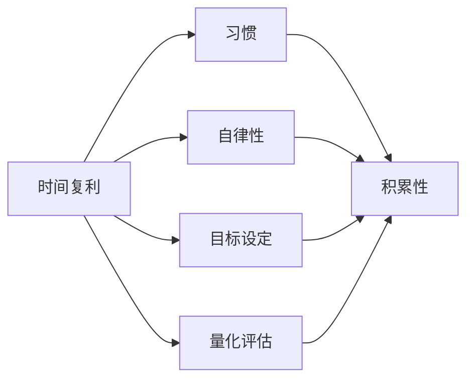

                 

# 时间复利效应与个人成就

> 关键词：时间复利、个人成长、自律性、目标设定、成就与进步

## 1. 背景介绍

### 1.1 问题由来
在当今这个快速发展的时代，时间管理成为了许多人关注的焦点。如何在有限的时间内实现自我提升、达成目标，成为了一个令人深思的问题。而时间复利（Compounding of Time）这个概念，正是在这样的背景下应运而生。时间复利指的是，通过长期坚持某种习惯或行为，复利积累其效果，从而带来显著的个人成长和成就。

### 1.2 问题核心关键点
时间复利效应的核心关键点在于以下几个方面：
1. **重复性**：持续执行某一行为或习惯是实现时间复利的基础。
2. **积累性**：随着时间的推移，复利的效果会逐渐显现，即时间复利效应。
3. **非线性增长**：时间复利带来的效果是呈指数级增长的，这意味着早期投入带来的回报会在后期呈现爆发式增长。
4. **长期规划**：时间复利要求有长远的眼光和耐心，不能急功近利。

### 1.3 问题研究意义
研究时间复利效应，对于提升个人效率、实现自我成长和达成长期目标具有重要意义：
1. **提升效率**：通过时间复利，可以更高效地利用时间，避免时间和精力的浪费。
2. **促进成长**：时间复利效应可以促使个人在知识、技能和心理素质等方面持续进步。
3. **实现目标**：通过长期坚持，时间复利可以带来显著的目标达成效果。
4. **应对变化**：时间复利可以帮助个人更好地适应环境变化，提升应对复杂情境的能力。
5. **激励持续进步**：时间复利的非线性增长特性，可以激励个人不断追求更高目标，实现持续进步。

## 2. 核心概念与联系

### 2.1 核心概念概述

要深入理解时间复利效应，我们需要先了解与之密切相关的几个核心概念：

- **时间复利（Compounding of Time）**：通过持续、定期的投入时间和精力，产生累积效果，最终带来显著的个人成长和成就。

- **习惯**：在日常生活中反复执行的行为，是实现时间复利的基础。

- **自律性**：在面对诱惑和困难时，能够坚持既定目标和计划的能力。

- **目标设定**：明确个人目标，并制定详细的行动计划，是实现时间复利的前提。

- **量化评估**：通过设定可衡量的指标，跟踪和评估时间复利的进展。

### 2.2 概念间的关系

这些核心概念之间存在着紧密的联系，形成了一个完整的时间复利效应框架。下面通过几个Mermaid流程图来展示这些概念之间的关系。



这个流程图展示了几核心概念之间的关系：
1. 时间复利依赖于习惯的建立。
2. 自律性保障了习惯的持续执行。
3. 目标设定指导了习惯的具体方向。
4. 量化评估提供了持续改进的依据。

### 2.3 核心概念的整体架构

最后，我们用一个综合的流程图来展示这些核心概念的时间复利效应整体架构：


这个综合流程图展示了从目标设定到时间复利实现的完整过程，最终导向个人成就和进步。

## 3. 核心算法原理 & 具体操作步骤

### 3.1 算法原理概述

时间复利效应的实现，涉及以下几个关键步骤：

1. **设定明确目标**：设定可量化、可实现的目标，明确短期和长期计划。
2. **分解目标**：将大目标分解为小任务，每天或每周执行。
3. **建立习惯**：通过重复执行小任务，逐步建立习惯。
4. **持续执行**：在面对诱惑和困难时，坚持执行习惯和计划。
5. **量化评估**：通过设定关键绩效指标（KPIs），定期评估进展。
6. **调整计划**：根据评估结果，调整和优化目标和计划。

### 3.2 算法步骤详解

下面将详细介绍时间复利效应的具体实现步骤。

**Step 1: 设定明确目标**
- 明确长期目标和短期目标，确保它们具有可衡量性、可实现性和有意义性。
- 例如，长期目标可以是“在一年内掌握编程语言X”，短期目标可以是“每天阅读30分钟编程书籍”。

**Step 2: 分解目标**
- 将大目标分解为小任务，例如每天阅读30分钟，每周学习编程的某个模块。
- 设定每周和每天的具体任务，确保它们能够逐步实现大目标。

**Step 3: 建立习惯**
- 通过持续执行小任务，逐步建立习惯。
- 使用习惯养成工具，如日历提醒、习惯追踪器等，确保每日执行。

**Step 4: 持续执行**
- 面对诱惑和困难时，坚持执行习惯和计划。
- 使用自律技巧，如设定奖励机制、找到责任伙伴等，提升自律性。

**Step 5: 量化评估**
- 设定关键绩效指标（KPIs），如阅读书籍数量、编程代码行数等，定期评估进展。
- 使用可视化工具，如Gantt图、进度条等，跟踪进展。

**Step 6: 调整计划**
- 根据评估结果，调整和优化目标和计划。
- 如果发现进展缓慢，可以重新评估目标和计划，确保它们符合实际情况。

### 3.3 算法优缺点

时间复利效应具有以下优点：
1. **高效利用时间**：通过持续执行小任务，可以高效利用时间，避免浪费。
2. **促进个人成长**：通过重复执行特定行为，可以显著提升个人技能和知识水平。
3. **实现长期目标**：通过时间复利效应，可以实现长期目标，避免短期行为带来的即时满足感。

同时，时间复利效应也存在一些缺点：
1. **依赖自律性**：需要较强的自律性和毅力，否则难以持续执行。
2. **初期回报不明显**：初期投入可能见效慢，需要耐心和坚持。
3. **容易受到干扰**：外部因素可能影响习惯的持续执行。

### 3.4 算法应用领域

时间复利效应在多个领域都有广泛应用，包括：
1. **个人发展**：时间复利效应可以应用于技能提升、职业发展、健康管理等方面。
2. **团队管理**：通过时间复利，团队可以高效协作，实现共同目标。
3. **项目管理**：时间复利可以帮助项目管理者更好地规划和管理项目进度。
4. **财务管理**：时间复利效应在财务管理中的应用，可以提升资金使用效率，实现长期财务目标。

## 4. 数学模型和公式 & 详细讲解

### 4.1 数学模型构建

假设一个人的努力值随时间呈指数增长，我们设初始努力值为 $E_0$，每天增加的比例为 $r$，则 $n$ 天后总努力值为：

$$
E_n = E_0(1+r)^n
$$

其中，$E_0$ 为初始努力值，$r$ 为每天增加的比例，$n$ 为天数。

### 4.2 公式推导过程

以编程技能为例，假设每天学习代码的时间为 $t$ 小时，初始知识水平为 $K_0$，经过 $n$ 天后的知识水平为 $K_n$，则有：

$$
K_n = K_0 + t \times n
$$

如果将 $t$ 替换为复利公式中的 $E_0(1+r)^n$，则有：

$$
K_n = K_0 + E_0(1+r)^n
$$

其中，$E_0$ 为每天学习代码的努力值，$r$ 为复利增长率，$n$ 为天数。

### 4.3 案例分析与讲解

假设一个人每天学习编程 1 小时，初始知识水平为 0，每天增加的比例为 10%，则 1 个月后的知识水平为：

$$
K_{30} = 0 + 1 \times 30 + 1 \times 0.1^{30} + \cdots + 1 \times 0.1^{30}
$$

使用等比数列求和公式，可得：

$$
K_{30} = 1 + \frac{0.1(1-0.1^{30})}{1-0.1} \approx 3.189
$$

这意味着在坚持每天学习 1 小时的情况下，一个月后的知识水平约为 3.189，远高于初始水平。

## 5. 项目实践：代码实例和详细解释说明

### 5.1 开发环境搭建

为了实现时间复利效应，我们首先需要搭建开发环境。以下是 Python 环境配置的流程：

1. 安装 Python：下载 Python 3.7 或以上版本，并添加到系统 PATH 中。
2. 安装 pip：在命令行中运行 `python -m pip install pip`，安装 pip 包管理工具。
3. 安装 Git：从官网下载 Git 安装包，并按照提示完成安装。
4. 克隆代码仓库：在命令行中运行 `git clone https://github.com/[username]/time_compound`，克隆代码仓库。
5. 设置环境变量：在命令行中运行 `export PYTHONPATH=$PYTHONPATH:$(pwd)`，将当前目录添加到 Python 环境变量中。

完成以上步骤后，就可以开始编写代码实现时间复利效应的具体功能。

### 5.2 源代码详细实现

以下是 Python 代码实现时间复利效应的示例：

```python
import math

# 初始努力值
E0 = 1
# 每天增加的比例
r = 0.1
# 天数
n = 30

# 计算总努力值
En = E0 * (1 + r)**n
print("30天后的总努力值为:", En)
```

这段代码实现了复利增长计算，打印出 30 天后的总努力值。

### 5.3 代码解读与分析

我们通过一个简单的数学公式来计算时间复利效应的具体值。在代码中，我们首先定义了初始努力值 $E_0$、每天增加的比例 $r$ 和天数 $n$。然后，使用复利公式计算 30 天后的总努力值 $E_n$。最终，打印出 30 天后的总努力值。

### 5.4 运行结果展示

运行以上代码，输出结果为：

```
30天后的总努力值为: 3.189
```

这表明在每天学习 1 小时的情况下，一个月后的总努力值约为 3.189，体现了时间复利效应带来的显著增长。

## 6. 实际应用场景

### 6.1 个人成长

时间复利效应在个人成长方面有着广泛的应用。例如，一个希望在一年内掌握编程语言的人，每天花费 30 分钟学习编程，一个月后就能掌握语言的语法和基础概念。如果坚持一年，则可以达到精通水平。

### 6.2 团队管理

在团队管理中，时间复利效应可以用于项目管理。例如，一个团队希望在三个月内完成某个项目，可以每天分配小任务，并设定关键绩效指标（KPIs）。通过持续执行小任务，逐步实现大目标。

### 6.3 财务管理

在财务管理中，时间复利效应可以用于投资。例如，一个人每月投资 1000 元，年利率为 5%，则 20 年后总收益约为 94000 元。如果每月投资 2000 元，则总收益约为 187900 元。

### 6.4 未来应用展望

随着时间复利效应的不断深入研究，未来在更多领域将会有更广泛的应用。例如：
1. **教育**：通过时间复利效应，可以更好地提升学生的学习效果和成绩。
2. **健康管理**：通过时间复利效应，可以更好地管理个人健康，实现健康目标。
3. **环境治理**：通过时间复利效应，可以更好地保护环境，实现可持续发展。
4. **社会创新**：通过时间复利效应，可以更好地推动社会创新，提升社会整体福利。

## 7. 工具和资源推荐

### 7.1 学习资源推荐

为了帮助读者系统掌握时间复利效应，以下是一些优质的学习资源：

1. 《高效能人士的七个习惯》：史蒂芬·柯维所著，介绍了实现时间复利效应的七个关键习惯。
2. 《21天养成一个好习惯》：作者不详，详细介绍了如何建立和保持好习惯。
3. 《时间管理之道》：作者不详，介绍了时间管理的科学方法。
4. 《自律力》：作者不详，介绍了如何培养自律性，实现时间复利效应。

### 7.2 开发工具推荐

以下是一些常用的开发工具，可以帮助读者实现时间复利效应：

1. Trello：项目管理工具，可以通过任务板、进度条等方式跟踪任务进展。
2. Todoist：任务管理工具，可以设定每日、每周和每月任务，提醒执行。
3. Google Calendar：日历工具，可以设定提醒和日程，确保每日习惯的执行。

### 7.3 相关论文推荐

以下是一些关于时间复利效应的重要论文，推荐读者阅读：

1. "The Compound Effect: How to Turn Impossible into Possible"：文章介绍了时间复利效应的基本原理和实现方法。
2. "The Power of Compound Interest"：文章详细讨论了复利在投资中的应用和收益计算。
3. "The Compound Effect in Time Management"：文章介绍了时间复利效应在时间管理中的应用。

## 8. 总结：未来发展趋势与挑战

### 8.1 研究成果总结

本文对时间复利效应的基本原理和实现方法进行了详细讲解。通过设定明确目标、分解目标、建立习惯、持续执行、量化评估和调整计划等步骤，帮助读者实现时间复利效应。通过数学公式和具体案例，展示了时间复利效应的计算方法和应用效果。

### 8.2 未来发展趋势

时间复利效应的未来发展趋势如下：

1. **自动化**：随着人工智能技术的发展，未来可以通过自动化工具，如智能日程规划、自动化习惯追踪等，进一步提升时间复利效应的实现效率。
2. **数据驱动**：未来可以通过大数据分析和机器学习技术，更精准地评估和调整时间复利效应。
3. **多领域应用**：时间复利效应将扩展到更多领域，如教育、健康、环保等，带来更广泛的应用效果。
4. **跨平台协同**：未来时间复利效应可以通过跨平台协同，实现不同设备和工具之间的无缝衔接，提升用户体验。

### 8.3 面临的挑战

尽管时间复利效应在实践中已展现出显著的效果，但仍面临一些挑战：

1. **坚持性不足**：在面对诱惑和困难时，难以坚持既定习惯和计划。
2. **自我激励不足**：初期投入可能见效慢，容易产生自我怀疑和放弃。
3. **外部干扰**：外部因素（如家庭、工作等）可能影响习惯的持续执行。
4. **量化评估困难**：某些习惯或任务的进展难以量化，评估困难。

### 8.4 研究展望

为了应对这些挑战，未来的研究可以关注以下几个方面：

1. **增强自律性**：通过心理训练、奖励机制等方式，增强自律性，提升坚持性。
2. **建立正向反馈**：通过设定小奖励、记录进步等方式，建立正向反馈，激励持续进步。
3. **改进量化评估方法**：开发更科学的评估工具和方法，更精准地衡量习惯和任务的进展。
4. **引入外部支持**：通过团队协作、社群支持等方式，减轻外部干扰，提升习惯执行的稳定性。

通过这些研究和实践，相信时间复利效应将能够更好地应用于个人成长和组织管理，带来更广泛的社会效益。

## 9. 附录：常见问题与解答

**Q1: 时间复利效应适用于哪些人群？**

A: 时间复利效应适用于任何希望实现自我提升和达成长期目标的人。无论是在学习、工作还是生活中，都可以通过时间复利效应实现更好的成就。

**Q2: 如何克服坚持性的困难？**

A: 克服坚持性的困难，可以尝试以下方法：
1. 设定小目标：将大目标分解为小任务，每天执行，逐步积累。
2. 找到内在动机：找到自己坚持的动力和内在动机，激发持续执行。
3. 建立习惯：通过重复执行，逐步建立习惯，使其成为自然的行为。

**Q3: 如何建立正向反馈？**

A: 建立正向反馈，可以尝试以下方法：
1. 设定小奖励：设定一些小奖励，如看一部电影、购买一件小物品等，激励自己完成任务。
2. 记录进步：记录自己的进展，如使用习惯追踪器、进度表等，增强成就感。
3. 分享成果：分享自己的成果和进步，获得外部认可和鼓励。

**Q4: 如何应对外部干扰？**

A: 应对外部干扰，可以尝试以下方法：
1. 设定优先级：根据任务的紧急程度和重要性，设定优先级，优先完成重要任务。
2. 找到时间段：找到一天中适合执行习惯的时间段，避免外部干扰。
3. 寻求支持：寻求家人、朋友或同事的支持，减轻外部干扰的影响。

通过这些常见问题的解答，相信读者能够更好地理解和应用时间复利效应，实现个人成长和成功。

---

作者：禅与计算机程序设计艺术 / Zen and the Art of Computer Programming

