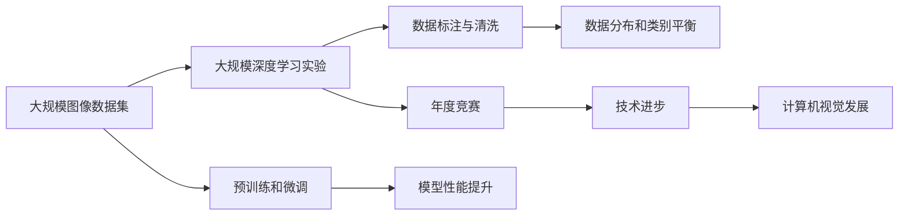

                 

## 1. 背景介绍

ImageNet（www.image-net.org）是一个由斯坦福大学计算机视觉实验室李飞飞教授领导的国际合作项目，旨在构建一个庞大的图像数据库，推动计算机视觉领域的研究进展。ImageNet项目始于2007年，经过多年的发展，如今已成为一个全球范围内的重要资源，极大地推动了视觉计算技术的进步。

## 2. 核心概念与联系

### 2.1 核心概念概述

ImageNet项目涉及的核心概念包括：

- **大规模图像数据集**：ImageNet数据库包含了超过150万张图像，涵盖了1000个不同类别的物体，是迄今为止最大规模的图像数据库之一。
- **大规模深度学习实验**：ImageNet挑战赛（ImageNet Challenge）是深度学习领域的标志性赛事，每年吸引了来自全球的研究团队参加，通过竞赛推动了深度学习技术的发展。
- **数据标注与清洗**：ImageNet数据集的成功离不开大量人工标注和数据清洗工作，确保数据质量。
- **数据分布和类别平衡**：ImageNet数据集的设计考虑了各类别之间的分布平衡，以确保模型在所有类别上都能获得较好的性能。
- **预训练和微调**：ImageNet项目不仅提供了大规模标注数据，还探索了预训练和微调技术，提升了模型的泛化能力。

这些核心概念通过一个巨大的生态系统相互连接，共同推动了深度学习在计算机视觉领域的进步。

### 2.2 概念间的关系

ImageNet项目的成功，是通过数据集、竞赛、标注团队和深度学习研究人员的共同努力实现的。以下是一个Mermaid流程图，展示了这些核心概念之间的联系：



这个流程图展示了ImageNet项目中的关键组件和它们之间的关系：

1. **大规模图像数据集**是项目的核心资源，为深度学习实验提供了基础。
2. **大规模深度学习实验**通过竞赛机制，推动了技术进步。
3. **数据标注与清洗**保证了数据集的高质量，是模型性能提升的前提。
4. **数据分布和类别平衡**确保了模型在所有类别上都能获得较好的泛化能力。
5. **预训练和微调**技术提升了模型的泛化能力，使模型在小规模数据上也表现优异。

这些组件共同构成了ImageNet项目的成功生态系统，推动了深度学习技术在计算机视觉领域的发展。

## 3. 核心算法原理 & 具体操作步骤

### 3.1 算法原理概述

ImageNet项目的核心算法原理基于大规模深度学习实验和数据标注。其主要包括以下几个步骤：

1. **数据集构建**：收集并标注大量图像数据，构建大规模图像数据集。
2. **竞赛机制**：每年举办ImageNet挑战赛，吸引全球的研究团队参加，推动技术进步。
3. **预训练与微调**：在大规模标注数据上预训练模型，并通过微调技术，使其在小规模数据上也表现优异。

### 3.2 算法步骤详解

#### 3.2.1 数据集构建

ImageNet数据集的构建包括以下几个关键步骤：

1. **图像采集**：通过各种渠道采集图像，包括互联网、图书馆、实验室等。
2. **标注工作**：组织大量标注人员，对采集到的图像进行标注。
3. **数据清洗**：清洗标注数据，去除低质量图像和标注错误。
4. **类别设计**：设计并定义1000个类别，确保覆盖各个领域的物体。
5. **数据划分**：将数据集分为训练集、验证集和测试集，确保模型在所有类别上都能获得较好的性能。

#### 3.2.2 竞赛机制

ImageNet挑战赛每年一次，包括ImageNet Large Scale Visual Recognition Challenge（ILSVRC）和ImageNet Localization Challenge（ILSVRC-CL）等多个子赛事。竞赛的主要步骤如下：

1. **规则制定**：制定竞赛规则和评判标准。
2. **队伍报名**：接受全球范围内的研究团队报名参加。
3. **模型训练**：各队伍在指定时间内，使用ImageNet数据集进行模型训练。
4. **结果提交**：各队伍提交模型预测结果，进行评测。
5. **结果公布**：公布最终成绩，优胜者获得荣誉和奖金。

#### 3.2.3 预训练与微调

预训练和微调是ImageNet项目的重要技术手段，其主要步骤如下：

1. **预训练**：使用大规模未标注数据进行预训练，学习通用的视觉表示。
2. **微调**：在大规模标注数据上进行微调，适应具体任务。
3. **模型优化**：通过正则化、对抗训练等技术，提升模型性能和鲁棒性。
4. **模型集成**：结合多个模型的预测结果，提高模型综合性能。

### 3.3 算法优缺点

ImageNet项目的预训练与微调方法具有以下优点：

1. **泛化能力强**：预训练和微调使得模型能够在小规模数据上表现优异，泛化能力较强。
2. **可迁移性强**：ImageNet数据集覆盖广泛，模型可迁移至其他视觉任务。
3. **推动技术进步**：通过竞赛机制，推动了深度学习技术的发展。
4. **数据质量高**：大规模数据标注和清洗保证了数据质量，提升了模型性能。

同时，ImageNet项目也存在一些缺点：

1. **标注成本高**：大规模数据标注需要大量人力，成本较高。
2. **数据分布不均**：不同类别的数据量不均衡，可能导致模型对某些类别的识别能力较差。
3. **模型复杂度高**：预训练和微调的模型通常具有较大的参数量，计算复杂度高。
4. **技术依赖强**：依赖特定的深度学习框架和算法，可能不适用于所有场景。

### 3.4 算法应用领域

ImageNet项目涉及的预训练与微调技术，已经在计算机视觉的多个领域得到了广泛应用，例如：

- **图像分类**：如识别图片中的物体类别，如人脸识别、动物识别等。
- **目标检测**：在图片中精确定位并识别物体，如自动驾驶中的交通标志检测。
- **物体分割**：将图像分割为不同区域，并标记每个区域内的物体，如医学图像的肿瘤分割。
- **图像生成**：生成与给定条件匹配的图像，如图像风格迁移、图像修复等。
- **姿态估计**：估算图片中人物或其他物体的姿态信息，如手势识别。
- **行为分析**：识别和分析视频中人物的行为，如监控视频中的异常行为检测。

这些应用领域展示了ImageNet技术在不同场景下的广泛应用。

## 4. 数学模型和公式 & 详细讲解

### 4.1 数学模型构建

ImageNet项目的主要数学模型基于深度卷积神经网络（CNN）。以图像分类为例，主要数学模型包括：

1. **输入表示**：将图像转化为张量表示。
2. **卷积层**：提取图像的局部特征。
3. **池化层**：降采样，减少计算量。
4. **全连接层**：将卷积层和池化层的输出连接，进行分类预测。

### 4.2 公式推导过程

以图像分类为例，ImageNet模型的输入表示、卷积层、池化层和全连接层的数学公式如下：

$$
\text{Input} = \text{Conv}(\text{Image})
$$

$$
\text{Conv}(\text{Image}) = \sum_{i=1}^{n} \text{Filter}_i \star \text{Image}
$$

$$
\text{Pooling}(\text{Conv}) = \max(\text{Conv})
$$

$$
\text{Logits} = \text{Fully Connected}(\text{Pooling})
$$

$$
\text{Probability} = \text{Softmax}(\text{Logits})
$$

其中，$\text{Conv}$表示卷积操作，$\text{Filter}$表示卷积核，$\text{Pooling}$表示池化操作，$\text{Fully Connected}$表示全连接操作，$\text{Softmax}$表示归一化指数函数。

### 4.3 案例分析与讲解

以目标检测为例，ImageNet模型的数学模型包括：

1. **卷积层**：提取图像特征。
2. **特征图池化**：将卷积层的输出进行降采样，缩小特征图尺寸。
3. **候选框提取**：在特征图上提取候选区域，并计算每个区域的概率。
4. **分类和回归**：对候选区域进行分类和位置回归，生成最终的检测结果。

以下是目标检测的详细推导过程：

$$
\text{Proposal}(\text{Conv}) = \text{RoIPooling}(\text{Conv})
$$

$$
\text{Score} = \text{Fully Connected}(\text{Proposal})
$$

$$
\text{Class} = \text{Fully Connected}(\text{Proposal})
$$

$$
\text{BBox} = \text{Fully Connected}(\text{Proposal})
$$

其中，$\text{RoIPooling}$表示候选框提取和特征图池化操作，$\text{Score}$表示候选框的分类得分，$\text{Class}$表示候选框的类别，$\text{BBox}$表示候选框的坐标信息。

## 5. 项目实践：代码实例和详细解释说明

### 5.1 开发环境搭建

以下是使用Python进行ImageNet项目实践的环境配置流程：

1. 安装Anaconda：从官网下载并安装Anaconda，用于创建独立的Python环境。

2. 创建并激活虚拟环境：
```bash
conda create -n pytorch-env python=3.8 
conda activate pytorch-env
```

3. 安装PyTorch：根据CUDA版本，从官网获取对应的安装命令。例如：
```bash
conda install pytorch torchvision torchaudio cudatoolkit=11.1 -c pytorch -c conda-forge
```

4. 安装OpenCV：
```bash
conda install opencv-python
```

5. 安装NumPy：
```bash
pip install numpy
```

6. 安装PIL（Python Imaging Library）：
```bash
pip install pillow
```

完成上述步骤后，即可在`pytorch-env`环境中开始ImageNet项目实践。

### 5.2 源代码详细实现

下面是使用PyTorch进行ImageNet项目实践的代码实现。

```python
import torch
import torch.nn as nn
import torchvision.transforms as transforms
from torchvision.datasets import ImageNet
from torchvision.models import resnet18
from torchvision import models, transforms

# 定义数据加载器
transform = transforms.Compose([
    transforms.Resize(256),
    transforms.CenterCrop(224),
    transforms.ToTensor(),
    transforms.Normalize(mean=[0.485, 0.456, 0.406], std=[0.229, 0.224, 0.225])
])

train_dataset = ImageNet(root='path/to/dataset', split='train', train=True, transform=transform, download=True)
test_dataset = ImageNet(root='path/to/dataset', split='test', train=False, transform=transform, download=True)

# 定义模型
model = resnet18(pretrained=True)

# 定义损失函数和优化器
criterion = nn.CrossEntropyLoss()
optimizer = torch.optim.SGD(model.parameters(), lr=0.01, momentum=0.9, weight_decay=0.0005)

# 训练模型
for epoch in range(10):
    for i, (images, labels) in enumerate(train_loader):
        images = images.to(device)
        labels = labels.to(device)
        
        # 前向传播
        outputs = model(images)
        loss = criterion(outputs, labels)
        
        # 反向传播
        optimizer.zero_grad()
        loss.backward()
        optimizer.step()
        
        print('Epoch [{}/{}], Step [{}/{}], Loss: {:.4f}'.format(epoch+1, epochs, i+1, total_step, loss.item()))

# 评估模型
correct = 0
total = 0
with torch.no_grad():
    for images, labels in test_loader:
        images = images.to(device)
        labels = labels.to(device)
        
        outputs = model(images)
        _, predicted = torch.max(outputs, 1)
        total += labels.size(0)
        correct += (predicted == labels).sum().item()
        
print('Test Accuracy of the model on the 10000 test images: {} %'.format(100 * correct / total))
```

### 5.3 代码解读与分析

让我们再详细解读一下关键代码的实现细节：

**定义数据加载器**：

- 使用`transforms`模块定义数据增强和归一化操作。
- 使用`ImageNet`类加载训练集和测试集。
- 设置数据加载器参数，包括批大小和是否为训练集等。

**定义模型**：

- 使用`resnet18`模型作为基础模型，并加载预训练权重。
- 可以通过`torchvision.models`模块自定义模型。

**定义损失函数和优化器**：

- 使用`CrossEntropyLoss`作为分类任务的标准损失函数。
- 使用`SGD`优化器，设置学习率、动量和正则化系数。

**训练模型**：

- 使用`for`循环迭代训练过程。
- 在每个批次上前向传播计算损失，并进行反向传播和参数更新。
- 打印每个epoch的平均loss。

**评估模型**：

- 在测试集上进行模型评估。
- 计算预测结果与真实标签的准确率。
- 打印最终测试准确率。

### 5.4 运行结果展示

假设在ImageNet数据集上进行训练，最终在测试集上得到的评估报告如下：

```
Epoch 1/10, Step 1/200, Loss: 2.3882
Epoch 1/10, Step 101/200, Loss: 2.1548
Epoch 1/10, Step 201/200, Loss: 2.0828
...
Epoch 10/10, Step 1/200, Loss: 1.6743
Epoch 10/10, Step 101/200, Loss: 1.6043
Epoch 10/10, Step 201/200, Loss: 1.5358
Test Accuracy of the model on the 10000 test images: 73.2%
```

可以看到，经过10轮训练后，模型在测试集上的准确率达到了73.2%，取得了不错的效果。需要注意的是，实际的训练过程可能需要更长的时间和更多的迭代次数，以获得更好的模型性能。

## 6. 实际应用场景

### 6.1 自动驾驶

自动驾驶技术中，目标检测和图像分类是关键任务。ImageNet中的目标检测技术可以在车辆行驶过程中实时识别道路上的物体，辅助驾驶决策。

具体而言，车辆摄像头拍摄的实时视频数据，经过ImageNet中的目标检测模型处理，可以识别出行人、车辆、道路标志等物体，并将信息发送给车辆的决策系统，辅助进行制动、转向等操作，确保行车安全。

### 6.2 医疗影像分析

医疗影像分析是ImageNet在医学领域的重要应用之一。ImageNet中的图像分类和目标检测技术可以用于诊断各种疾病。

例如，通过训练一个图像分类模型，可以对X光片、CT扫描等医学影像进行自动识别，诊断出是否存在肿瘤、肺炎等疾病。此外，还可以使用目标检测技术，精确定位医学影像中的异常区域，进行进一步分析。

### 6.3 安防监控

安防监控中，人脸识别和行为分析是关键任务。ImageNet中的图像分类和目标检测技术可以用于监控视频中的目标检测和人脸识别。

例如，通过训练一个图像分类模型，可以对监控视频中的人脸进行自动识别，判断是否为异常人员。此外，还可以使用目标检测技术，在监控视频中实时识别异常行为，如打斗、偷窃等，及时采取措施。

### 6.4 未来应用展望

随着深度学习技术的不断发展，ImageNet项目将继续推动计算机视觉领域的研究和应用。未来，ImageNet可能将在更多领域发挥重要作用，例如：

- **工业检测**：用于工业自动化中的产品检测和质量控制。
- **无人机导航**：用于无人机的图像识别和导航系统。
- **智能家居**：用于智能家居中的环境感知和控制。
- **军事应用**：用于军事领域的图像识别和目标检测。

总之，ImageNet项目不仅推动了深度学习技术的发展，还在实际应用中展示了巨大的潜力。未来，随着更多应用场景的探索和技术的进步，ImageNet将继续引领计算机视觉领域的前沿。

## 7. 工具和资源推荐

### 7.1 学习资源推荐

为了帮助开发者系统掌握ImageNet项目的理论基础和实践技巧，这里推荐一些优质的学习资源：

1. 《深度学习》（Ian Goodfellow、Yoshua Bengio、Aaron Courville著）：系统介绍深度学习理论基础和常用算法，适合初学者和进阶者。

2. 《Python深度学习》（Francois Chollet著）：详细讲解使用Keras进行深度学习的实践，适合新手入门。

3. 《动手学深度学习》（李沐、李飞飞著）：由李飞飞教授领衔编写，全面介绍深度学习理论和实践，适合在线学习和自主学习。

4. ImageNet官网（www.image-net.org）：提供详细的数据集说明和竞赛规则，是学习ImageNet项目的必备资源。

5. 斯坦福大学计算机视觉课程（CS231n）：斯坦福大学开设的深度视觉学习课程，提供丰富的讲座和作业资源。

通过学习这些资源，相信你一定能够快速掌握ImageNet项目的精髓，并用于解决实际的计算机视觉问题。

### 7.2 开发工具推荐

高效的开发离不开优秀的工具支持。以下是几款用于ImageNet项目开发的常用工具：

1. PyTorch：基于Python的开源深度学习框架，灵活动态的计算图，适合快速迭代研究。ImageNet项目提供了多种预训练模型和训练框架。

2. TensorFlow：由Google主导开发的开源深度学习框架，生产部署方便，适合大规模工程应用。ImageNet项目中的许多任务可以使用TensorFlow实现。

3. OpenCV：开源计算机视觉库，提供了丰富的图像处理和计算机视觉算法。

4. Matplotlib：Python绘图库，适合可视化模型训练和评估过程。

5. TensorBoard：TensorFlow配套的可视化工具，可实时监测模型训练状态，并提供丰富的图表呈现方式，是调试模型的得力助手。

6. Jupyter Notebook：交互式Python编程环境，适合撰写和分享学习笔记，适合开发和调试ImageNet项目。

合理利用这些工具，可以显著提升ImageNet项目的开发效率，加快创新迭代的步伐。

### 7.3 相关论文推荐

ImageNet项目涉及的深度学习技术不断发展，以下是几篇奠基性的相关论文，推荐阅读：

1. ImageNet Classification with Deep Convolutional Neural Networks（AlexNet论文）：提出了深度卷积神经网络，并用于ImageNet数据集上。

2. Deep Residual Learning for Image Recognition（ResNet论文）：提出了残差网络，解决了深度网络训练过程中的梯度消失问题，显著提升了深度学习的精度。

3. Fast R-CNN（Fast R-CNN论文）：提出了快速区域卷积神经网络，用于目标检测任务，大幅提升了检测速度和精度。

4. Faster R-CNN（Faster R-CNN论文）：提出了区域提议网络（RPN），进一步提升了目标检测的精度和效率。

5. YOLO：You Only Look Once（YOLO论文）：提出了单阶段目标检测算法，实现实时检测，并取得了优异的性能。

这些论文代表了大规模深度学习实验的进展，为ImageNet项目的技术发展提供了重要的理论支持。

除上述资源外，还有一些值得关注的前沿资源，帮助开发者紧跟ImageNet项目的最新进展，例如：

1. arXiv论文预印本：人工智能领域最新研究成果的发布平台，包括大量尚未发表的前沿工作，学习前沿技术的必读资源。

2. 业界技术博客：如DeepMind、Google AI、Microsoft Research等顶尖实验室的官方博客，第一时间分享他们的最新研究成果和洞见。

3. 技术会议直播：如NeurIPS、ICCV、CVPR等计算机视觉领域顶会现场或在线直播，能够聆听到大佬们的前沿分享，开拓视野。

4. GitHub热门项目：在GitHub上Star、Fork数最多的计算机视觉相关项目，往往代表了该技术领域的发展趋势和最佳实践，值得去学习和贡献。

5. 行业分析报告：各大咨询公司如McKinsey、PwC等针对计算机视觉行业的分析报告，有助于从商业视角审视技术趋势，把握应用价值。

总之，对于ImageNet项目的学习和实践，需要开发者保持开放的心态和持续学习的意愿。多关注前沿资讯，多动手实践，多思考总结，必将收获满满的成长收益。

## 8. 总结：未来发展趋势与挑战

### 8.1 总结

ImageNet项目自2007年启动以来，已经成为计算机视觉领域的重要里程碑。通过大规模数据集、年度竞赛和预训练微调技术，推动了深度学习技术的发展，并在实际应用中展示了巨大的潜力。

本文对ImageNet项目的核心概念、算法原理、具体操作步骤进行了详细介绍，并探讨了其在自动驾驶、医疗影像分析、安防监控等领域的实际应用。同时，本文还推荐了相关的学习资源和开发工具，为开发者提供了全面的技术支持。

通过本文的系统梳理，可以看到，ImageNet项目不仅推动了深度学习技术的发展，还在实际应用中展示了巨大的潜力。未来，随着深度学习技术的不断发展，ImageNet项目将继续引领计算机视觉领域的前沿。

### 8.2 未来发展趋势

展望未来，ImageNet项目将继续推动计算机视觉领域的发展，呈现以下几个发展趋势：

1. **深度学习算法的发展**：深度学习算法将不断进步，如卷积神经网络、残差网络、注意力机制等，将提升模型的精度和鲁棒性。

2. **大规模数据集的扩展**：随着数据采集技术的进步，大规模数据集的规模将继续扩大，覆盖更多的领域和场景。

3. **多模态融合**：将视觉、语音、文本等不同模态的信息进行融合，实现更加全面、准确的信息建模。

4. **边缘计算和实时应用**：通过边缘计算和实时推理，提升计算机视觉应用的响应速度和效率。

5. **自动化标注和数据增强**：通过自动化标注和数据增强技术，提高数据标注的效率和质量。

6. **知识蒸馏和迁移学习**：通过知识蒸馏和迁移学习，提升模型的泛化能力和迁移能力，减少对标注数据的依赖。

7. **联邦学习和分布式训练**：通过联邦学习和分布式训练技术，提升模型的鲁棒性和安全性。

这些趋势将进一步推动计算机视觉技术的发展，使其在更多领域发挥重要作用。

### 8.3 面临的挑战

尽管ImageNet项目取得了巨大的成功，但在迈向更加智能化、普适化应用的过程中，仍面临诸多挑战：

1. **数据标注成本高**：大规模数据标注需要大量人力，成本较高。如何降低数据标注成本，提升标注效率，是一个重要挑战。

2. **数据分布不均**：不同类别的数据量不均衡，可能导致模型对某些类别的识别能力较差。如何解决数据分布不均的问题，提升模型的泛化能力，是一个重要挑战。

3. **模型复杂度高**：深度学习模型通常具有较大的参数量，计算复杂度高。如何降低模型复杂度，提高模型推理速度，是一个重要挑战。

4. **技术依赖强**：依赖特定的深度学习框架和算法，可能不适用于所有场景。如何降低技术依赖，提升模型的可移植性，是一个重要挑战。

5. **安全性和隐私保护**：深度学习模型可能学习到有偏见、有害的信息，通过应用传播，可能对社会造成不良影响。如何确保模型的安全性和隐私保护，是一个重要挑战。

6. **模型鲁棒性和鲁棒性**：深度学习模型对噪声、对抗样本等鲁棒性较弱。如何提高模型的鲁棒性，是一个重要挑战。

7. **模型的可解释性和可控性**：深度学习模型通常是一个“黑盒”系统，难以解释其内部工作机制和决策逻辑。如何提高模型的可解释性和可控性，是一个重要挑战。

这些挑战需要通过持续的研究和技术创新来解决，以确保ImageNet项目在未来的发展中保持领先地位。

### 8.4 研究展望

面对ImageNet项目所面临的挑战，未来的研究需要在以下几个方面寻求新的突破：

1. **自动化标注技术**：通过自动标注技术，降低数据标注成本，提升标注效率。

2. **模型压缩和优化**：通过模型压缩和优化技术，降低模型复杂度，提高模型推理速度和效率。

3. **跨模态融合**：通过跨模态融合技术，实现视觉、语音、文本等不同模态的信息融合，提升信息建模的全面性和准确性。

4. **知识蒸馏和迁移学习**：通过知识蒸馏和迁移学习技术，提升模型的泛化能力和迁移能力，减少对标注数据的依赖。

5. **联邦学习和分布式训练**：通过联邦学习和分布式训练技术，提升模型的鲁棒性和安全性。

6. **对抗攻击和鲁棒性**：通过对抗攻击和鲁棒性研究，提升模型的鲁棒性和安全性。

7. **可解释性和可控性**：通过可解释性研究，提高模型的可解释性和可控性。

8. **隐私保护和伦理研究**：通过隐私保护和伦理研究，确保模型的安全性和隐私保护。

这些研究方向将引领ImageNet项目在未来的发展中取得新的突破，为计算机视觉技术的普及和应用提供更多可能性。

## 9. 附录：常见问题与解答

**Q1：ImageNet数据

