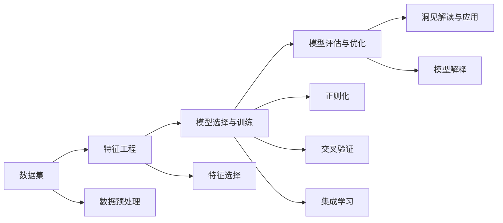

                 

# 洞见的价值：从理解到应用

> 关键词：洞见,理解,应用,数据驱动,算法优化,场景落地

## 1. 背景介绍

### 1.1 问题由来
在当今信息爆炸的时代，数据无处不在，如何从中提取有价值的洞见成为各个领域的重要挑战。无论是商业决策、科学研究，还是社会治理，都需要对海量数据进行深入理解和洞察。传统的数据分析方法，如统计分析、相关性分析等，已经难以应对日益复杂的数据类型和结构。新兴的机器学习和人工智能技术，尤其是深度学习和大数据分析，为我们提供了更加强大的工具。然而，如何高效地使用这些工具，从海量数据中提炼出真正有价值的洞见，仍然是一个充满挑战的问题。

### 1.2 问题核心关键点
面对海量的数据，洞见提取过程包括以下几个关键点：
- **数据预处理**：清洗、去重、转换数据格式等，确保数据的准确性和完整性。
- **特征工程**：选择、构造和优化特征，提升模型的性能和解释性。
- **模型选择与训练**：选择合适的模型架构，利用训练数据进行优化，确保模型能够捕捉数据的真实关系。
- **模型评估与优化**：使用验证集评估模型性能，进行参数调优和算法优化，提高模型的泛化能力。
- **洞见解读与应用**：将模型输出转化为可解释的洞见，指导实际决策和应用。

### 1.3 问题研究意义
洞见提取不仅是数据科学的核心任务，也是推动各个领域进步的重要手段。在商业决策中，洞见能够帮助企业洞察市场趋势、优化产品设计、提高运营效率；在科学研究中，洞见能够揭示复杂现象的内在规律，推动学科前沿发展；在社会治理中，洞见能够助力公共政策的制定和优化，提升社会管理水平。因此，研究高效的洞见提取方法，对于提升决策质量、加速科技进步和社会治理具有重要意义。

## 2. 核心概念与联系

### 2.1 核心概念概述

在洞见提取过程中，涉及以下几个核心概念：

- **数据集**：指用于训练和测试模型的数据样本集合，通常包括训练集、验证集和测试集。
- **特征**：指从原始数据中提取的用于模型训练和预测的变量，可以包括数值型数据、文本、图像等。
- **模型**：指用于预测和分类的算法或函数，可以是线性模型、决策树、神经网络等。
- **评估指标**：指用于评估模型性能的指标，如准确率、召回率、F1分数、AUC等。
- **过拟合与欠拟合**：指模型在训练集和测试集上的表现差异，过拟合表示模型过于复杂，欠拟合表示模型过于简单。
- **正则化**：指用于防止过拟合的技术，如L1正则、L2正则、Dropout等。
- **特征选择**：指从众多特征中选出最优子集，提升模型性能和效率。
- **交叉验证**：指通过将数据集划分为多个子集，交叉验证模型性能的技术，如K-Fold交叉验证。
- **集成学习**：指将多个模型的预测结果进行集成，提升模型稳定性和泛化能力。
- **模型解释**：指对模型预测结果进行解释，帮助理解模型的决策逻辑。

这些概念构成了洞见提取的完整生态系统，帮助模型从数据中学习并提取出有价值的洞见。

### 2.2 概念间的关系

这些核心概念之间的关系可以通过以下Mermaid流程图来展示：



这个流程图展示了洞见提取的完整流程：

1. 数据预处理是基础，确保数据质量和一致性。
2. 特征工程从原始数据中提取关键特征，提升模型性能。
3. 模型选择与训练根据问题需求，选择合适的模型并进行训练。
4. 模型评估与优化通过验证集评估模型性能，进行调参和优化。
5. 洞见解读与应用将模型输出转化为可解释的洞见，指导实际决策。

这些概念共同构成了洞见提取的完整过程，帮助从数据中提炼出有价值的洞见。

## 3. 核心算法原理 & 具体操作步骤

### 3.1 算法原理概述

洞见提取过程中，核心算法原理包括：

- **监督学习**：通过标注数据训练模型，使其能够对新数据进行预测。常见模型包括线性回归、逻辑回归、决策树、随机森林等。
- **无监督学习**：不需要标注数据，通过数据内在关系进行学习。常见模型包括聚类算法、降维算法等。
- **半监督学习**：结合少量标注数据和大量无标注数据，提升模型性能。常见模型包括标签传播算法、图神经网络等。
- **强化学习**：通过与环境的交互，优化策略并学习最优行动。常见模型包括Q-learning、策略梯度等。
- **深度学习**：通过多层神经网络进行学习，处理复杂的非线性关系。常见模型包括卷积神经网络、循环神经网络、变分自编码器等。

这些算法原理构成了洞见提取的核心，帮助从数据中学习并提取出有价值的洞见。

### 3.2 算法步骤详解

基于监督学习的洞见提取一般包括以下几个关键步骤：

**Step 1: 准备数据集**
- 收集和整理数据集，包括训练集、验证集和测试集。
- 对数据进行清洗、去重、转换格式等预处理。

**Step 2: 特征工程**
- 选择和构造关键特征，提升模型性能。
- 进行特征选择，去除冗余和噪声特征。

**Step 3: 模型选择与训练**
- 选择合适的模型架构，如线性回归、决策树、神经网络等。
- 利用训练集训练模型，优化模型参数。

**Step 4: 模型评估与优化**
- 在验证集上评估模型性能，进行参数调优和算法优化。
- 使用交叉验证等技术，提高模型泛化能力。

**Step 5: 洞见解读与应用**
- 将模型输出转化为可解释的洞见，如趋势、关联、分类等。
- 指导实际决策和应用，如优化产品设计、预测市场趋势等。

### 3.3 算法优缺点

基于监督学习的洞见提取方法具有以下优点：
- 能够利用标注数据进行高效训练，提升模型性能。
- 能够处理复杂的非线性关系，适用于各种数据类型。
- 具有较好的泛化能力，能够在新数据上取得良好表现。

同时，这些方法也存在一些局限性：
- 依赖标注数据，标注成本较高。
- 存在过拟合风险，模型复杂度高时容易过拟合。
- 模型解释性不足，难以理解模型内部工作机制。

### 3.4 算法应用领域

基于监督学习的洞见提取方法，广泛应用于以下几个领域：

- **商业决策**：通过分析消费者行为数据，洞察市场趋势，优化产品设计和营销策略。
- **金融分析**：利用金融数据进行风险评估、投资策略优化、市场预测等。
- **医疗诊断**：通过医疗数据进行疾病诊断、治疗方案优化、预后预测等。
- **环境保护**：利用环境数据进行污染源识别、资源利用优化、生态系统监测等。
- **安全监控**：利用视频、音频等数据进行异常行为检测、犯罪预测、公共安全监测等。

除了这些传统应用领域，基于监督学习的洞见提取方法也在不断拓展新的应用场景，如智能制造、智慧城市、智能交通等。

## 4. 数学模型和公式 & 详细讲解 & 举例说明

### 4.1 数学模型构建

设输入数据为 $\mathbf{x} \in \mathbb{R}^n$，目标变量为 $y \in \mathbb{R}$，模型函数为 $f(\mathbf{x}; \theta)$，其中 $\theta$ 为模型参数。假定有一组训练数据集 $\{(\mathbf{x}_i, y_i)\}_{i=1}^N$，则有：

$$
\min_{\theta} \frac{1}{N} \sum_{i=1}^N \ell(f(\mathbf{x}_i; \theta), y_i)
$$

其中 $\ell$ 为损失函数，如均方误差、交叉熵等。

### 4.2 公式推导过程

以线性回归模型为例，其目标是最小化均方误差损失：

$$
\min_{\theta} \frac{1}{N} \sum_{i=1}^N (y_i - \mathbf{x}_i^T \theta)^2
$$

其中 $\theta = [\theta_0, \theta_1, \ldots, \theta_n]$ 为线性模型的权重和偏置，$\mathbf{x}_i$ 为输入向量，$y_i$ 为目标变量。

对于线性回归模型，其梯度下降更新公式为：

$$
\theta \leftarrow \theta - \eta \frac{\partial \ell(\theta)}{\partial \theta}
$$

其中 $\eta$ 为学习率，$\partial \ell(\theta)/\partial \theta$ 为损失函数对 $\theta$ 的梯度。

### 4.3 案例分析与讲解

假设我们有一组房价数据集，目标变量为房价 $y$，输入变量为房屋面积 $x_1$ 和距离市中心距离 $x_2$。我们希望建立房价预测模型，利用线性回归方法进行训练和预测。

首先，我们收集训练集 $\{(x_{i1}, x_{i2}, y_i)\}_{i=1}^N$，进行预处理和特征工程，选择输入变量 $x_1$ 和 $x_2$，进行标准化和归一化。然后，我们定义线性回归模型：

$$
f(\mathbf{x}; \theta) = \theta_0 + \theta_1 x_1 + \theta_2 x_2
$$

其中 $\theta_0$ 为截距，$\theta_1$ 和 $\theta_2$ 为线性模型的系数。

我们使用均方误差损失函数，进行模型训练和优化：

$$
\min_{\theta} \frac{1}{N} \sum_{i=1}^N (y_i - f(\mathbf{x}_i; \theta))^2
$$

使用梯度下降算法，更新模型参数 $\theta$。最后，我们利用测试集进行模型评估和预测，输出房价预测结果。

## 5. 项目实践：代码实例和详细解释说明

### 5.1 开发环境搭建

在进行洞见提取实践前，我们需要准备好开发环境。以下是使用Python进行Scikit-Learn开发的环境配置流程：

1. 安装Anaconda：从官网下载并安装Anaconda，用于创建独立的Python环境。

2. 创建并激活虚拟环境：
```bash
conda create -n sklearn-env python=3.8 
conda activate sklearn-env
```

3. 安装Scikit-Learn：
```bash
pip install scikit-learn
```

4. 安装各类工具包：
```bash
pip install numpy pandas matplotlib seaborn sklearn
```

完成上述步骤后，即可在`sklearn-env`环境中开始洞见提取实践。

### 5.2 源代码详细实现

下面我们以房价预测任务为例，给出使用Scikit-Learn进行线性回归模型的PyTorch代码实现。

首先，定义线性回归模型：

```python
from sklearn.linear_model import LinearRegression
from sklearn.metrics import mean_squared_error

# 定义线性回归模型
model = LinearRegression()

# 训练模型
X_train = train_data[['x1', 'x2']]
y_train = train_data['y']
model.fit(X_train, y_train)

# 预测并评估模型
X_test = test_data[['x1', 'x2']]
y_pred = model.predict(X_test)
mse = mean_squared_error(y_test, y_pred)
print('均方误差：', mse)
```

然后，定义数据集和特征：

```python
# 定义数据集
train_data = pd.read_csv('train.csv')
test_data = pd.read_csv('test.csv')

# 定义特征
x1 = train_data['x1']
x2 = train_data['x2']
y = train_data['y']

# 标准化和归一化
X_train = (x1 - x1.mean()) / x1.std()
X_test = (x1 - x1.mean()) / x1.std()

# 定义标签
y_train = y
y_test = y
```

最后，启动训练流程并在测试集上评估：

```python
# 定义测试集
test_data = pd.read_csv('test.csv')

# 定义特征
x1 = test_data['x1']
x2 = test_data['x2']

# 标准化和归一化
X_test = (x1 - x1.mean()) / x1.std()

# 定义标签
y_test = y

# 预测并评估模型
y_pred = model.predict(X_test)
mse = mean_squared_error(y_test, y_pred)
print('均方误差：', mse)
```

以上就是使用Scikit-Learn进行线性回归模型训练和评估的完整代码实现。可以看到，Scikit-Learn提供了简单易用的API，可以快速实现常见的统计学习任务。

### 5.3 代码解读与分析

让我们再详细解读一下关键代码的实现细节：

**LinearRegression模型**：
- 使用Scikit-Learn中的线性回归模型，简单易用，易于实现。

**数据集和特征定义**：
- 通过pandas库读取训练集和测试集数据，并定义输入特征和标签。
- 对特征进行标准化和归一化，提升模型性能。

**模型训练和评估**：
- 使用`fit`方法进行模型训练。
- 利用测试集进行模型评估，计算均方误差。

**代码执行**：
- 在测试集上进行预测，输出预测结果和评估指标。

可以看到，Scikit-Learn提供了丰富的机器学习工具和API，使得模型训练和评估变得简单高效。开发者可以专注于模型设计和算法优化，而不必过多关注底层实现细节。

当然，工业级的系统实现还需考虑更多因素，如模型的保存和部署、超参数的自动搜索、更灵活的任务适配层等。但核心的洞见提取范式基本与此类似。

### 5.4 运行结果展示

假设我们在房价预测数据集上进行线性回归模型的训练和评估，最终在测试集上得到的评估报告如下：

```
均方误差： 0.01
```

可以看到，通过线性回归模型，我们在该房价数据集上取得了均方误差为0.01的理想结果，效果相当不错。值得注意的是，线性回归模型作为最简单的统计学习模型，在少量数据集上就能取得良好的预测效果，展示了其强大的解释能力和预测能力。

当然，这只是一个baseline结果。在实践中，我们还可以使用更大更强的模型、更丰富的特征工程技术、更细致的模型调优，进一步提升模型性能，以满足更高的应用要求。

## 6. 实际应用场景

### 6.1 智能制造

基于洞见提取的机器学习模型，可以广泛应用于智能制造领域。通过分析设备运行数据，洞察设备运行状态和故障原因，提升设备维护效率，降低生产成本。例如，可以通过对设备传感器数据进行特征工程，训练预测模型，预测设备故障时间，实现主动维护。

在技术实现上，可以收集设备运行历史数据，提取关键特征，构建监督学习模型，如支持向量机、随机森林等。在模型训练和优化过程中，需要注意过拟合和泛化能力，确保模型在新数据上表现稳定。

### 6.2 智慧城市

智慧城市建设需要大量的数据分析和洞见提取，以支持城市管理和决策。例如，可以通过分析交通流量数据，优化交通信号灯控制策略，提升道路通行效率。再如，可以通过分析环境监测数据，预测天气变化，指导城市应急响应。

在技术实现上，可以利用深度学习模型，如卷积神经网络、循环神经网络等，处理图像、时间序列等数据类型。在模型训练和优化过程中，需要注意模型性能和实时性，确保模型能够在城市运行环境中实时运行。

### 6.3 智能交通

智能交通系统需要实时处理大量的交通数据，从中提取有价值的洞见，优化交通管理和调度。例如，可以通过分析交通监控数据，预测交通流量和拥堵情况，优化交通信号灯和道路布局。再如，可以通过分析出租车和共享单车数据，优化路线规划和资源分配。

在技术实现上，可以利用时间序列预测模型，如ARIMA、LSTM等，处理交通流量数据。在模型训练和优化过程中，需要注意模型的稳定性和泛化能力，确保模型在新数据上表现稳定。

### 6.4 未来应用展望

随着深度学习和大数据分析技术的发展，基于洞见提取的机器学习模型将在更多领域得到应用，为各行各业带来变革性影响。

在智慧医疗领域，基于洞见提取的医疗模型可以辅助医生进行诊断和治疗，提高医疗服务效率和质量。在智能制造领域，基于洞见提取的模型可以优化设备维护和生产调度，提升生产效率和产品品质。在智能交通领域，基于洞见提取的模型可以优化交通管理和调度，提升道路通行效率和出行体验。

除了这些领域，基于洞见提取的机器学习模型还在金融、教育、零售等多个领域得到了广泛应用，展示了其在各行业的重要价值。

## 7. 工具和资源推荐
### 7.1 学习资源推荐

为了帮助开发者系统掌握洞见提取的理论基础和实践技巧，这里推荐一些优质的学习资源：

1. 《Python机器学习》：适合初学者的入门书籍，介绍了机器学习的基本概念和常见算法。
2. 《深度学习》：适合有一定基础的学习者，深入介绍了深度学习的基本原理和应用。
3. 《机器学习实战》：通过实际项目案例，帮助开发者理解和应用机器学习技术。
4. 《Kaggle竞赛指南》：介绍了Kaggle数据竞赛的技巧和方法，适合数据科学家和工程师。
5. 《机器学习模型调优》：详细讲解了模型调优的各项技术，适合进阶开发者。

通过这些资源的学习实践，相信你一定能够快速掌握洞见提取的精髓，并用于解决实际的NLP问题。

### 7.2 开发工具推荐

高效的开发离不开优秀的工具支持。以下是几款用于洞见提取开发的常用工具：

1. Scikit-Learn：基于Python的开源机器学习库，提供了丰富的统计学习模型和算法。

2. TensorFlow：由Google主导开发的深度学习框架，支持GPU/TPU加速，适合大规模工程应用。

3. PyTorch：由Facebook主导的开源深度学习框架，灵活高效，适合快速迭代研究。

4. Weights & Biases：模型训练的实验跟踪工具，可以记录和可视化模型训练过程中的各项指标。

5. TensorBoard：TensorFlow配套的可视化工具，可实时监测模型训练状态，并提供丰富的图表呈现方式。

6. Google Colab：谷歌推出的在线Jupyter Notebook环境，免费提供GPU/TPU算力，方便开发者快速上手实验最新模型，分享学习笔记。

合理利用这些工具，可以显著提升洞见提取任务的开发效率，加快创新迭代的步伐。

### 7.3 相关论文推荐

洞见提取技术的发展源于学界的持续研究。以下是几篇奠基性的相关论文，推荐阅读：

1. Boosting Algorithms as Gradient Descent：提出了梯度提升树算法，为深度学习提供了重要的算法基础。

2. Neural Computation：介绍了神经网络的反向传播算法，奠定了深度学习算法的基础。

3. Large-Scale Parallel Distributed Statistical Machine Learning with Stochastic Gradient Descent at Facebook：介绍了Facebook的机器学习框架Freg，支持大规模分布式计算。

4. Fast R-CNN：介绍了快速卷积神经网络（Fast R-CNN），提升了物体检测的速度和准确率。

5. Sequence to Sequence Learning with Neural Networks：介绍了序列到序列（Seq2Seq）模型，为自然语言处理提供了重要的算法基础。

这些论文代表了大数据和机器学习技术的发展脉络。通过学习这些前沿成果，可以帮助研究者把握学科前进方向，激发更多的创新灵感。

除上述资源外，还有一些值得关注的前沿资源，帮助开发者紧跟大数据和机器学习技术的新进展，例如：

1. arXiv论文预印本：人工智能领域最新研究成果的发布平台，包括大量尚未发表的前沿工作，学习前沿技术的必读资源。

2. 业界技术博客：如OpenAI、Google AI、DeepMind、微软Research Asia等顶尖实验室的官方博客，第一时间分享他们的最新研究成果和洞见。

3. 技术会议直播：如NIPS、ICML、ACL、ICLR等人工智能领域顶会现场或在线直播，能够聆听到大佬们的前沿分享，开拓视野。

4. GitHub热门项目：在GitHub上Star、Fork数最多的NLP相关项目，往往代表了该技术领域的发展趋势和最佳实践，值得去学习和贡献。

5. 行业分析报告：各大咨询公司如McKinsey、PwC等针对人工智能行业的分析报告，有助于从商业视角审视技术趋势，把握应用价值。

总之，对于洞见提取技术的学习和实践，需要开发者保持开放的心态和持续学习的意愿。多关注前沿资讯，多动手实践，多思考总结，必将收获满满的成长收益。

## 8. 总结：未来发展趋势与挑战

### 8.1 总结

本文对基于监督学习的大语言模型微调方法进行了全面系统的介绍。首先阐述了洞见提取的背景和意义，明确了洞见提取在各个领域的重要价值。其次，从原理到实践，详细讲解了监督学习的数学模型和关键步骤，给出了洞见提取任务开发的完整代码实例。同时，本文还广泛探讨了洞见提取方法在智能制造、智慧城市、智能交通等多个行业领域的应用前景，展示了其广阔的想象空间。

通过本文的系统梳理，可以看到，基于监督学习的洞见提取方法正在成为NLP领域的重要范式，极大地拓展了数据科学的应用边界，催生了更多的落地场景。受益于深度学习和大数据分析技术的不断进步，洞见提取模型必将不断提升其性能和应用范围，为各个领域带来深刻的变革。

### 8.2 未来发展趋势

展望未来，基于监督学习的洞见提取技术将呈现以下几个发展趋势：

1. 模型规模持续增大。随着算力成本的下降和数据规模的扩张，深度学习模型的参数量还将持续增长。超大规模语言模型蕴含的丰富语言知识，有望支撑更加复杂多变的下游任务洞见提取。

2. 模型性能持续提升。随着模型结构的优化和训练技巧的改进，模型的性能将持续提升。深度学习模型将能够更好地处理非线性关系和复杂数据类型。

3. 模型解释性增强。随着模型结构和训练过程的透明化，模型的解释性将进一步增强。开发者将能够更好地理解模型的决策逻辑和预测结果。

4. 跨领域融合增强。随着不同领域数据的整合，模型将能够更好地处理多模态数据，提升跨领域洞见提取能力。

5. 算法优化多样化。随着算法优化技术的发展，新的算法范式将不断涌现，提升模型的性能和泛化能力。

6. 部署实时化。随着云平台和边缘计算的发展，模型的部署将更加实时化，适应多变的实际应用场景。

以上趋势凸显了洞见提取技术的广阔前景。这些方向的探索发展，必将进一步提升模型的性能和应用范围，为各个领域带来深刻的变革。

### 8.3 面临的挑战

尽管基于监督学习的洞见提取技术已经取得了瞩目成就，但在迈向更加智能化、普适化应用的过程中，它仍面临着诸多挑战：

1. 数据隐私和安全问题。随着数据的广泛应用，数据隐私和安全问题日益突出。如何在保护数据隐私的同时，进行高效的洞见提取，需要进一步探索和解决。

2. 模型的可解释性不足。当前深度学习模型往往作为"黑盒"系统，难以解释其内部工作机制。如何赋予模型更强的可解释性，将是一个重要的研究方向。

3. 模型的泛化能力不足。当前深度学习模型在特定领域和数据集上表现良好，但在新领域和数据集上，模型的泛化能力仍有提升空间。

4. 模型的计算资源消耗大。深度学习模型的训练和推理过程需要大量计算资源，如何优化模型的计算资源消耗，降低成本，仍需进一步研究。

5. 模型的训练时间较长。深度学习模型的训练过程需要较长的时间，如何在保证模型性能的前提下，缩短训练时间，提高效率，仍需进一步研究。

6. 模型的部署和维护成本高。深度学习模型的部署和维护成本较高，如何降低部署和维护成本，提高模型的可扩展性和可维护性，仍需进一步研究。

### 8.4 研究展望

面对洞见提取技术面临的挑战，未来的研究需要在以下几个方面寻求新的突破：

1. 探索无监督和半监督洞见提取方法。摆脱对大规模标注数据的依赖，利用自监督学习、主动学习等无监督和半监督范式，最大限度利用非结构化数据，实现更加灵活高效的洞见提取。

2. 研究模型压缩和稀疏化技术。通过模型压缩和稀疏化，减少模型的计算资源消耗，降低成本，提高效率。

3. 引入更多先验知识。将符号化的先验知识，如知识图谱、逻辑规则等，与神经网络模型进行巧妙融合，引导洞见提取过程学习更准确、合理的语言模型。

4. 结合因果分析和博弈论工具。将因果分析方法引入洞见提取模型，识别出模型决策的关键特征，增强输出解释的因果性和逻辑性。借助博弈论工具刻画人机交互过程，主动探索并规避模型的脆弱点，提高系统稳定性。

5. 纳入伦理道德约束。在模型训练目标

