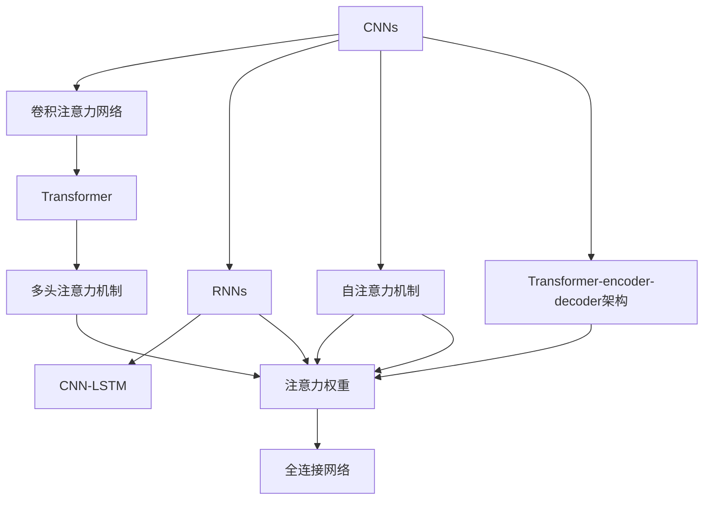
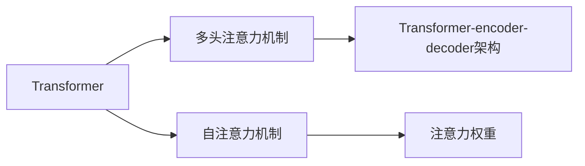
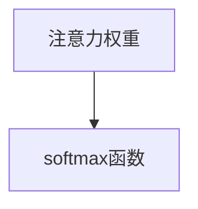
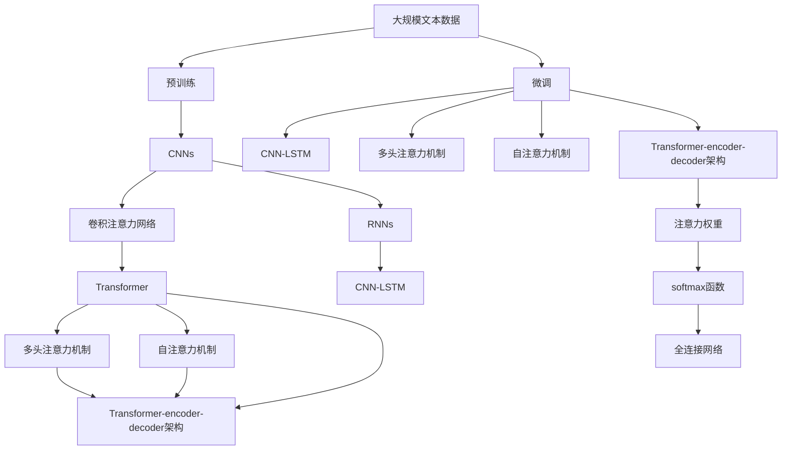

                 

# 深度学习与注意力模型的应用

> 关键词：深度学习,注意力模型,卷积神经网络,循环神经网络,Transformer,BERT,卷积注意力网络,CNN-LSTM,自注意力机制,多头注意力机制,Transformer-encoder-decoder,注意力权重,softmax函数,Attention vs. Fully Connected,全连接网络,语义信息,情感信息,注意力图,目标识别,目标跟踪,物体检测,图像分类,图像分割,机器翻译,文本分类,序列标注,图像生成,语音识别,自动驾驶,边缘计算

## 1. 背景介绍

### 1.1 问题由来
深度学习作为一种强大的数据建模和特征提取工具，在计算机视觉、自然语言处理、语音识别等多个领域取得了巨大的成功。其中，注意力机制作为深度学习中一种重要的信息获取方式，近年来引起了研究者的广泛关注。本文旨在深入探讨深度学习中的注意力模型及其应用，以期为读者提供全面、系统的理解。

### 1.2 问题核心关键点
注意力模型通常通过计算特征之间的注意力权重，将重要的特征信息集中起来，忽略掉无关的噪音信息。这一过程可以看作是一种特殊的特征选择机制，适用于各类复杂任务，如目标识别、目标跟踪、图像分类、图像分割、机器翻译等。注意力模型通过设计不同的注意力机制，可以实现不同的功能，如对序列数据的建模、对图像信息的提取等。

本文主要聚焦于基于卷积神经网络（Convolutional Neural Networks, CNNs）和循环神经网络（Recurrent Neural Networks, RNNs）的注意力模型，以及Transformer架构中的多头注意力机制（Multi-Head Attention Mechanism）。通过理解这些注意力模型的原理和应用，可以帮助读者更好地理解深度学习的高级技术，并探索其在实际问题中的应用。

### 1.3 问题研究意义
深度学习中的注意力模型不仅可以提升模型的性能，还可以减少对计算资源的需求。通过注意力机制，模型可以更好地处理复杂数据结构，如自然语言、图像等，从而实现更准确的预测和分类。此外，注意力模型在边缘计算、自动驾驶等对计算资源和时间有严格限制的应用场景中，也具有重要的应用前景。

本文将深入探讨深度学习中各种注意力模型的原理和应用，从基础的卷积注意力网络、CNN-LSTM模型，到Transformer架构中的多头注意力机制，以及注意力模型在实际问题中的应用案例。通过理解这些注意力模型的原理和应用，读者可以更好地掌握深度学习中注意力机制的核心思想和应用方法，为解决实际问题提供指导。

## 2. 核心概念与联系

### 2.1 核心概念概述

为更好地理解深度学习中注意力模型的原理和应用，本节将介绍几个密切相关的核心概念：

- **卷积神经网络（CNNs）**：一种广泛用于图像处理的深度学习模型，通过卷积层提取图像的局部特征。

- **循环神经网络（RNNs）**：一种用于序列数据处理的深度学习模型，通过循环结构保持序列中的上下文信息。

- **Transformer**：一种基于自注意力机制的深度学习模型，用于处理序列数据。

- **多头注意力机制（Multi-Head Attention）**：Transformer中用于并行计算不同层次注意力的一种机制，通过多个头（head）同时关注序列中的不同位置，提高模型性能。

- **自注意力机制（Self-Attention）**：一种在序列中计算注意力权重的方法，用于捕捉序列中的语义和情感信息。

- **Transformer-encoder-decoder架构**：一种用于序列到序列（seq2seq）任务的深度学习模型，由编码器和解码器组成，用于处理序列数据，如机器翻译、文本摘要等。

- **注意力权重**：用于计算注意力向量的方法，通常通过softmax函数计算。

- **全连接网络**：一种传统的深度学习模型，通过全连接层进行特征提取和分类。

这些核心概念之间的逻辑关系可以通过以下Mermaid流程图来展示：



这个流程图展示了大语言模型中的各种注意力模型及其相互联系：

1. CNNs通过卷积层提取图像的局部特征，然后通过卷积注意力网络（Convolutional Attention Network）进行特征选择。
2. RNNs通过循环结构捕捉序列中的上下文信息，可以结合CNNs进行特征提取，形成CNN-LSTM模型。
3. Transformer架构通过多头注意力机制捕捉序列中的语义和情感信息，适用于各种序列数据处理任务。
4. 自注意力机制是Transformer中用于计算注意力权重的方法，用于捕捉序列中的重要信息。
5. Transformer-encoder-decoder架构用于序列到序列任务的深度学习模型，可以用于机器翻译、文本摘要等。
6. 注意力权重通常通过softmax函数计算，用于表示序列中不同位置的注意力程度。
7. 全连接网络是一种传统的深度学习模型，用于特征提取和分类。

这些核心概念共同构成了深度学习中注意力模型的基础，使得模型能够更好地处理复杂数据结构和各类任务。

### 2.2 概念间的关系

这些核心概念之间存在着紧密的联系，形成了深度学习中注意力模型的完整生态系统。下面我们通过几个Mermaid流程图来展示这些概念之间的关系。

#### 2.2.1 CNNs与卷积注意力网络


这个流程图展示了CNNs与卷积注意力网络之间的关系：

1. CNNs通过卷积层提取图像的局部特征。
2. 卷积注意力网络通过卷积层和注意力机制，选择重要的特征信息。
3. RNNs通过循环结构捕捉序列中的上下文信息。
4. CNN-LSTM结合了CNNs和RNNs，适用于更复杂的序列数据处理任务。
5. Transformer架构通过多头注意力机制捕捉序列中的语义和情感信息。
6. 自注意力机制是Transformer中用于计算注意力权重的方法。
7. Transformer-encoder-decoder架构用于序列到序列任务的深度学习模型。
8. 注意力权重通常通过softmax函数计算，用于表示序列中不同位置的注意力程度。
9. 全连接网络是一种传统的深度学习模型，用于特征提取和分类。

#### 2.2.2 Transformer与多头注意力机制



这个流程图展示了Transformer与多头注意力机制之间的关系：

1. Transformer架构通过多头注意力机制捕捉序列中的语义和情感信息。
2. 多头注意力机制通过多个头（head）同时关注序列中的不同位置。
3. 自注意力机制是Transformer中用于计算注意力权重的方法。
4. 注意力权重通常通过softmax函数计算，用于表示序列中不同位置的注意力程度。
5. Transformer-encoder-decoder架构用于序列到序列任务的深度学习模型。

#### 2.2.3 注意力权重与softmax函数



这个流程图展示了注意力权重与softmax函数之间的关系：

1. 注意力权重通过softmax函数计算，用于表示序列中不同位置的注意力程度。

### 2.3 核心概念的整体架构

最后，我们用一个综合的流程图来展示这些核心概念在大语言模型中的应用：



这个综合流程图展示了从预训练到微调，再到多任务应用的整体过程：

1. 大规模文本数据通过预训练学习通用的语言表示。
2. CNNs和RNNs用于提取图像和序列数据的特征。
3. 卷积注意力网络通过卷积层和注意力机制，选择重要的特征信息。
4. CNN-LSTM结合了CNNs和RNNs，适用于更复杂的序列数据处理任务。
5. Transformer架构通过多头注意力机制捕捉序列中的语义和情感信息。
6. 自注意力机制是Transformer中用于计算注意力权重的方法。
7. Transformer-encoder-decoder架构用于序列到序列任务的深度学习模型。
8. 注意力权重通过softmax函数计算，用于表示序列中不同位置的注意力程度。
9. 全连接网络用于特征提取和分类。
10. 微调过程可以在预训练模型的基础上进行，进一步提升模型性能。
11. 多任务应用中，模型可以进行序列到序列的转换，如机器翻译、文本摘要等。

通过这些流程图，我们可以更清晰地理解深度学习中注意力模型的各个核心概念及其相互关系，为后续深入讨论具体的注意力机制和应用方法奠定基础。

## 3. 核心算法原理 & 具体操作步骤
### 3.1 算法原理概述

深度学习中的注意力模型通常通过计算特征之间的注意力权重，将重要的特征信息集中起来，忽略掉无关的噪音信息。这一过程可以看作是一种特殊的特征选择机制，适用于各类复杂任务，如目标识别、目标跟踪、图像分类、图像分割、机器翻译等。

形式化地，假设输入序列为 $\{x_1, x_2, ..., x_n\}$，特征表示为 $H \in \mathbb{R}^{n \times d}$，注意力权重为 $A \in \mathbb{R}^{n \times n}$，则注意力机制的输出为：

$$
\text{Attention}(H, A) = \sum_{i=1}^{n} \alpha_{i} \cdot H_i
$$

其中 $\alpha_{i} = \sum_{j=1}^{n} A_{i,j} \cdot H_j$，$A_{i,j}$ 表示序列中位置 $i$ 和位置 $j$ 之间的注意力权重，$\alpha_{i}$ 表示位置 $i$ 的总注意力权重。

注意力权重 $A$ 的计算通常通过softmax函数来实现，形式为：

$$
A_{i,j} = \frac{\exp(\text{score}(i,j))}{\sum_{k=1}^{n} \exp(\text{score}(i,k))}
$$

其中 $\text{score}(i,j)$ 表示位置 $i$ 和位置 $j$ 之间的相似度或相关性，可以通过各种方法计算，如点积、相似度矩阵、注意力函数等。

### 3.2 算法步骤详解

深度学习中注意力模型的训练通常包括以下几个关键步骤：

**Step 1: 准备数据集**

- 收集训练集和测试集，划分为训练集、验证集和测试集。训练集用于模型训练，验证集用于超参数调优，测试集用于模型评估。

**Step 2: 设计模型架构**

- 选择合适的卷积神经网络或循环神经网络作为基本架构。
- 在基本架构上添加注意力机制，设计自注意力机制、多头注意力机制等。
- 添加全连接层或分类器，用于模型输出。

**Step 3: 设置超参数**

- 选择合适的优化算法及其参数，如Adam、SGD等，设置学习率、批大小、迭代轮数等。
- 设置正则化技术及强度，包括权重衰减、Dropout、Early Stopping等。
- 确定冻结预训练参数的策略，如仅微调顶层，或全部参数都参与微调。

**Step 4: 执行梯度训练**

- 将训练集数据分批次输入模型，前向传播计算损失函数。
- 反向传播计算参数梯度，根据设定的优化算法和学习率更新模型参数。
- 周期性在验证集上评估模型性能，根据性能指标决定是否触发 Early Stopping。
- 重复上述步骤直到满足预设的迭代轮数或 Early Stopping 条件。

**Step 5: 测试和部署**

- 在测试集上评估微调后模型，对比微调前后的精度提升。
- 使用微调后的模型对新样本进行推理预测，集成到实际的应用系统中。

以上是深度学习中注意力模型的训练流程。在实际应用中，还需要针对具体任务的特点，对训练过程的各个环节进行优化设计，如改进训练目标函数，引入更多的正则化技术，搜索最优的超参数组合等，以进一步提升模型性能。

### 3.3 算法优缺点

深度学习中的注意力模型具有以下优点：

- **特征选择能力**：注意力机制能够自动选择重要特征，减少无关噪音，提升模型性能。
- **模型复杂度低**：相比于全连接网络，注意力模型的参数量较小，计算效率较高。
- **可解释性强**：注意力权重可以解释模型对不同特征的关注程度，帮助理解模型的决策过程。
- **泛化能力强**：注意力模型能够更好地捕捉序列中的语义和情感信息，提升模型的泛化能力。

同时，该模型也存在一定的局限性：

- **计算资源需求高**：注意力机制需要计算注意力权重，计算量较大，对计算资源有较高要求。
- **模型设计复杂**：注意力机制的设计和调整需要一定的专业知识，难以快速实现。
- **数据依赖性强**：注意力模型的性能依赖于训练数据的充分性，对于小样本数据集效果可能不佳。

尽管存在这些局限性，但就目前而言，注意力模型仍是大规模数据处理和复杂任务解决的理想选择。未来相关研究的重点在于如何进一步降低计算资源需求，提高模型的泛化能力，同时兼顾可解释性和数据依赖性等因素。

### 3.4 算法应用领域

深度学习中的注意力模型在NLP、计算机视觉、语音识别等多个领域得到了广泛的应用，以下是几个典型的应用场景：

- **目标识别和跟踪**：在图像中检测目标并跟踪其运动轨迹。通过注意力机制，模型可以更好地关注目标区域，减少误识别和漏识别。
- **图像分类和分割**：将输入图像分类为不同的类别或分割为多个部分。注意力机制可以用于提取图像中的重要区域，提高分类和分割的精度。
- **机器翻译和文本摘要**：将源语言文本翻译成目标语言，或将长文本压缩成简短摘要。通过注意力机制，模型可以更好地捕捉序列中的语义和情感信息，提高翻译和摘要的准确性。
- **对话系统和情感分析**：构建可以与用户进行自然对话的系统，或分析文本中的情感倾向。注意力机制可以用于提取对话中的重要信息，增强系统的理解和响应能力。
- **图像生成和语音识别**：生成逼真的图像或文本，或将语音转换为文本。注意力机制可以用于指导生成过程，提高生成质量和效果。

除了这些经典应用外，注意力模型还被创新性地应用到更多场景中，如可控文本生成、常识推理、代码生成、数据增强等，为计算机视觉和自然语言处理技术带来了全新的突破。随着预训练模型和注意力机制的不断进步，相信注意力模型将在更广阔的应用领域大放异彩。

## 4. 数学模型和公式 & 详细讲解  
### 4.1 数学模型构建

本节将使用数学语言对深度学习中注意力模型的原理进行更加严格的刻画。

记输入序列为 $\{x_1, x_2, ..., x_n\}$，特征表示为 $H \in \mathbb{R}^{n \times d}$，注意力权重为 $A \in \mathbb{R}^{n \times n}$，输出表示为 $O \in \mathbb{R}^{n \times d}$。

定义注意力机制的输出为：

$$
O = \text{Attention}(H, A) = \sum_{i=1}^{n} \alpha_{i} \cdot H_i
$$

其中 $\alpha_{i} = \sum_{j=1}^{n} A_{i,j} \cdot H_j$，$A_{i,j}$ 表示序列中位置 $i$ 和位置 $j$ 之间的注意力权重。

注意力权重 $A$ 的计算通常通过softmax函数来实现，形式为：

$$
A_{i,j} = \frac{\exp(\text{score}(i,j))}{\sum_{k=1}^{n} \exp(\text{score}(i,k))}
$$

其中 $\text{score}(i,j)$ 表示位置 $i$ 和位置 $j$ 之间的相似度或相关性，可以通过各种方法计算，如点积、相似度矩阵、注意力函数等。

### 4.2 公式推导过程

以下我们以自注意力机制为例，推导其计算公式及其梯度的计算公式。

假设输入序列为 $\{x_1, x_2, ..., x_n\}$，特征表示为 $H \in \mathbb{R}^{n \times d}$，注意力权重为 $A \in \mathbb{R}^{n \times n}$。则自注意力机制的输出为：

$$
O = \text{Attention}(H, A) = \sum_{i=1}^{n} \alpha_{i} \cdot H_i
$$

其中 $\alpha_{i} = \sum_{j=1}^{n} A_{i,j} \cdot H_j$，$A_{i,j}$ 表示序列中位置 $i$ 和位置 $j$ 之间的注意力权重。

注意力权重 $A$ 的计算通常通过softmax函数来实现，形式为：

$$
A_{i,j} = \frac{\exp(\text{score}(i,j))}{\sum_{k=1}^{n} \exp(\text{score}(i,k))}
$$

其中 $\text{score}(i,j)$ 表示位置 $i$ 和位置 $j$ 之间的相似度或相关性，可以通过点积计算：

$$
\text{score}(i,j) = H_i^T \cdot W^T \cdot H_j
$$

其中 $W$ 为投影矩阵，$H_i$ 和 $H_j$ 分别为位置 $i$ 和位置 $j$ 的特征表示。

通过上述公式，可以得到注意力机制的输出为：

$$
O_i = \sum_{j=1}^{n} A_{i,j} \cdot H_j = \sum_{j=1}^{n} \frac{\exp(H_i^T \cdot W^T \cdot H_j)}{\sum_{k=1}^{n} \exp(H_i^T \cdot W^T \cdot H_k)} \cdot H_j
$$

为了便于计算，通常将投影矩阵 $W$ 拆分为多个线性变换矩阵 $W_Q$、$W_K$ 和 $W_V$，分别用于计算查询向量、键向量和值向量。具体来说：

$$
Q = H \cdot W_Q \in \mathbb{R}^{n \times d_q}, K = H \cdot W_K \in \mathbb{R}^{n \times d_k}, V = H \cdot W_V \in \mathbb{R}^{n \times d_v}
$$

其中 $d_q$、$d_k$ 和 $d_v$ 分别为查询向量、键向量和值向量的维度，通常取值较小。

通过上述公式，可以得到注意力机制的输出为：

$$
O_i = \sum_{j=1}^{n} \frac{\exp(Q_i^T \cdot K_j)}{\sum_{k=1}^{n} \exp(Q_i^T \cdot K_k)} \cdot V_j
$$

其中 $Q_i$ 和 $K_j$ 分别为位置 $i$ 的查询向量和位置 $j$ 的键向量，$V_j$ 为位置 $j$ 的值向量。

### 4.3 案例分析与讲解

以Transformer中的多头注意力机制为例，其计算公式如下：

$$
O_i^h = \sum_{j=1}^{n} \frac{\exp(Q_i^T \cdot K_j)}{\sum_{k=1}^{n} \exp(Q_i^T \cdot K_k)} \cdot V_j^h
$$

其中 $O_i^h$ 表示位置 $i$ 在头 $h$ 上的输出，$Q_i^T$ 和 $K_j$ 分别为位置 $i$ 的查询向量和位置 $j$ 的键向量，$V_j^h$ 为位置 $j$ 的值向量，$h$ 为头的编号，通常取多个值。

Transformer架构中，多头注意力机制可以并行计算不同层次的注意力，使得模型能够更好地捕捉序列中的语义和情感信息。其计算过程包括三个步骤：

1. **投影和线性变换**：将输入序列 $H$ 投影到多个向量空间中，分别计算查询向量 $Q$、键向量 $K$ 和值向量 $V$。

2. **注意力计算**：计算各个位置之间的注意力权重，得到各个位置的加权值向量。

3. **线性变换和拼接**：对每个位置的加权值向量进行线性变换，拼接多个头的输出，得到最终的输出向量 $O$。

Transformer架构中的多头注意力机制通过并行计算不同层次的注意力，大大提升了计算效率和模型性能。这种机制能够更好地捕捉序列中的语义和情感信息，适用于各种序列数据处理任务。

## 5. 项目实践：代码实例和详细解释说明
### 5.1 开发环境搭建

在进行注意力模型开发前，我们需要准备好开发环境。以下是使用Python进行TensorFlow开发的环境配置流程：

1. 安装Anaconda：从官网下载并安装Anaconda，用于创建独立的Python环境。

2. 创建并激活虚拟环境：
```bash
conda create -n tf-env python=3.8 
conda activate tf-env
```

3. 安装TensorFlow：根据CUDA版本，从官网获取对应的安装命令。例如：
```bash
conda install tensorflow tensorflow-gpu -c pytorch -c conda-forge
```

4. 安装各类工具包：
```bash
pip install numpy pandas scikit-learn matplotlib tqdm jupyter notebook ipython
```

完成上述步骤后，即可在`tf-env`环境中开始注意力模型的开发。

### 5.2 源代码详细实现

下面我们以目标识别任务为例，给出使用TensorFlow实现卷积注意力网络（Convolutional Attention Network）的PyTorch代码实现。

首先，定义模型架构：

```python
import tensorflow as tf
from tensorflow.keras import layers, models

def convolutional_attention_network(input_shape, num_classes):
    inputs = layers.Input(shape=input_shape)
    
    # 卷积层和池化层
    conv1 = layers.Conv2D(64, 3, activation='relu')(inputs)
    pool1 = layers.MaxPooling2D(pool_size=(2, 2))(conv1)
    
    conv2 = layers.Conv2D(128, 3, activation='relu')(pool1)
    pool2 = layers.MaxPooling2D(pool_size=(2, 2))(conv2)
    
    # 卷积注意力层
    attention_conv1 = layers.Conv2D(64, 3, activation='relu')(pool2)
    attention_pool1 = layers.MaxPooling2D(pool_size=(2, 2))(attention_conv1)
    
    attention_conv2 = layers.Conv2D(128, 3, activation='relu')(attention_pool1)
    attention_pool2 = layers.MaxPooling2D(pool_size=(2, 2))(attention_conv2)
    
    attention_pool2 = layers.Reshape((4, 4, 128))(attention_pool2)
    attention_flatten = layers.Flatten()(attention_pool2)
    attention_dense = layers.Dense(256, activation='relu')(attention_flatten)
    attention_weight = layers.Dense(num_classes, activation='softmax')(attention_dense)
    
    # 输出层
    outputs = layers.Dense(num_classes, activation='softmax')(attention_weight)
    
    model = models.Model(inputs=inputs, outputs=outputs)
    return model
```

然后，定义数据集和优化器：

```python
import numpy as np
from tensorflow.keras.datasets import cifar10

(x_train, y_train), (x_test, y_test) = cifar10.load_data()
x_train = x_train / 255.0
x_test = x_test / 255.0

num_classes = 10

model = convolutional_attention_network(input_shape=(32, 32, 3), num_classes=num_classes)

optimizer = tf.keras.optimizers.Adam(learning_rate=0.001)
```

接着，定义训练和评估函数：

```python
from tensorflow.keras.preprocessing.image import ImageDataGenerator
from tensorflow.keras.utils import to_categorical

def train_epoch(model, dataset, batch_size, optimizer):
    dataloader = ImageDataGenerator().flow(dataset, batch_size=batch_size)
    model.train()
    epoch_loss = 0
    for batch in dataloader:
        inputs = batch[0]
        labels = to_categorical(batch[1])
        model.zero_grad()
        outputs = model(inputs)
        loss = tf.keras.losses.c

