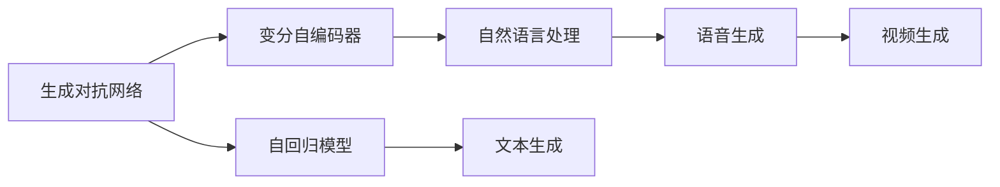

                 

# 生成式AIGC：商业智能的下一个前沿

## 1. 背景介绍

随着人工智能技术的发展，AI生成内容（AIGC）逐渐成为了商业智能的下一个前沿。在数字化时代，数据量呈指数级增长，传统的数据处理、分析和可视化方式已经无法满足需求。AIGC技术通过深度学习、自然语言处理和生成对抗网络等手段，可以自动生成高质量的文本、图像、音频和视频内容，极大地提升了数据利用的效率和效果。本文将详细介绍AIGC技术的原理、实现和应用，帮助读者全面了解这一前沿领域。

## 2. 核心概念与联系

### 2.1 核心概念概述

AIGC（人工智能生成内容）是指利用人工智能技术自动生成高质量文本、图像、音频和视频等内容。AIGC包括文本生成、图像生成、语音生成、视频生成等多个子领域，涵盖了从自然语言处理（NLP）到计算机视觉（CV）的广泛技术。

AIGC技术主要依赖于深度学习模型，如生成对抗网络（GAN）、变分自编码器（VAE）、自回归模型等。这些模型能够自动从大量数据中学习到生成内容的规则和模式，并生成与原始数据相似的新数据。

AIGC技术的应用领域非常广泛，涵盖了广告、营销、新闻、娱乐、教育等多个领域。例如，自动生成新闻稿、广告文案、社交媒体内容等，可以大幅度降低内容创作成本，提高内容生成效率。

### 2.2 核心概念之间的关系

AIGC技术的核心概念包括：

- **生成对抗网络（GAN）**：通过两个神经网络的对抗，生成高质量的图像和视频内容。
- **变分自编码器（VAE）**：通过变分推理，生成高质量的图像和音频内容。
- **自回归模型**：通过自回归过程，生成高质量的文本和语音内容。
- **自然语言处理（NLP）**：通过深度学习模型，生成高质量的文本内容。

这些核心概念之间的关系如下图所示：



## 3. 核心算法原理 & 具体操作步骤

### 3.1 算法原理概述

AIGC技术的主要原理是通过深度学习模型自动学习数据分布，然后利用学习到的分布生成新的内容。常见的生成模型包括生成对抗网络（GAN）、变分自编码器（VAE）、自回归模型等。

以GAN为例，其基本原理是通过两个神经网络：生成器和判别器，进行对抗训练，不断优化生成器和判别器的参数，使生成器能够生成与真实数据相似的新数据。

### 3.2 算法步骤详解

以生成对抗网络（GAN）为例，其步骤包括：

1. **初始化模型**：初始化生成器和判别器模型，设置损失函数。
2. **训练生成器**：通过判别器的反馈，不断优化生成器的参数，使其生成的数据越来越逼真。
3. **训练判别器**：通过生成器生成的数据，不断优化判别器的参数，使其能够准确判别真实数据和生成数据。
4. **迭代训练**：反复迭代1、2、3步骤，直到生成器生成的数据与真实数据无法区分。

### 3.3 算法优缺点

**优点**：

- 生成内容质量高：生成对抗网络（GAN）可以生成高质量的图像和视频内容，与真实数据相似度高。
- 生成速度快：生成对抗网络（GAN）可以在较短时间内生成大量数据，提高内容生成的效率。
- 应用广泛：生成对抗网络（GAN）可以应用于图像生成、视频生成、音频生成等多个领域。

**缺点**：

- 训练复杂：生成对抗网络（GAN）的训练过程复杂，需要大量计算资源和时间。
- 生成的数据多样性不足：生成对抗网络（GAN）生成的数据容易出现模式化现象，缺乏多样性。
- 可解释性不足：生成对抗网络（GAN）生成的数据缺乏可解释性，难以理解其生成过程和原因。

### 3.4 算法应用领域

生成对抗网络（GAN）在图像生成、视频生成、语音生成、文本生成等领域都有广泛应用。例如：

- **图像生成**：通过生成对抗网络（GAN）生成高分辨率的图像，如图像修复、风格转换等。
- **视频生成**：通过生成对抗网络（GAN）生成高帧率的动画视频，如动画短片、视频游戏等。
- **语音生成**：通过生成对抗网络（GAN）生成逼真的语音，如语音合成、语音翻译等。
- **文本生成**：通过生成对抗网络（GAN）生成高质量的文本内容，如文章生成、对话生成等。

## 4. 数学模型和公式 & 详细讲解 & 举例说明

### 4.1 数学模型构建

以生成对抗网络（GAN）为例，其数学模型包括生成器模型和判别器模型。

- **生成器模型**：
$$
G: \mathcal{Z} \rightarrow \mathcal{X}
$$
其中，$\mathcal{Z}$ 表示生成器的输入噪声向量，$\mathcal{X}$ 表示生成器的输出图像。

- **判别器模型**：
$$
D: \mathcal{X} \rightarrow [0, 1]
$$
其中，$\mathcal{X}$ 表示判别器的输入图像，$[0, 1]$ 表示判别器对输入图像的真实性评分。

生成对抗网络（GAN）的总体目标函数为：
$$
\min_G \max_D V(G, D)
$$
其中，$V(G, D)$ 为生成器和判别器的对抗损失函数。

### 4.2 公式推导过程

以生成对抗网络（GAN）为例，推导其对抗损失函数$V(G, D)$。

生成器的目标是生成逼真的图像，判别器的目标是区分真实图像和生成图像。因此，生成器和判别器的对抗目标为：

1. 生成器最大化生成图像被误判为真实图像的概率。
2. 判别器最大化区分真实图像和生成图像的概率。

生成器和判别器的联合损失函数$V(G, D)$可以表示为：
$$
V(G, D) = \mathbb{E}_{x \sim p_{data}(x)}[\log D(x)] + \mathbb{E}_{z \sim p_z(z)}[\log (1 - D(G(z)))]
$$
其中，$p_{data}(x)$ 表示真实图像的分布，$p_z(z)$ 表示生成器的输入噪声分布。

### 4.3 案例分析与讲解

假设我们有一个手写数字生成任务，使用MNIST数据集。

- **生成器模型**：
$$
G(z) = w_1 \tanh (w_2 z + b_2) + b_1
$$
其中，$z$ 为输入的噪声向量，$w_1, w_2$ 和 $b_1, b_2$ 为生成器的权重和偏置。

- **判别器模型**：
$$
D(x) = \sigma(w_3 x + b_3)
$$
其中，$x$ 为输入的图像向量，$w_3$ 和 $b_3$ 为判别器的权重和偏置。

生成对抗网络（GAN）的对抗损失函数可以表示为：
$$
V(G, D) = \mathbb{E}_{x \sim p_{data}(x)}[\log D(x)] + \mathbb{E}_{z \sim p_z(z)}[\log (1 - D(G(z)))]
$$

在训练过程中，生成器和判别器交替进行训练，不断优化各自的参数。最终，生成器可以生成逼真的手写数字图像。

## 5. 项目实践：代码实例和详细解释说明

### 5.1 开发环境搭建

在搭建AIGC项目开发环境时，需要安装Python、PyTorch、TensorFlow等深度学习框架。以下是一个简单的环境搭建步骤：

1. 安装Python：
```
sudo apt-get install python3
```

2. 安装PyTorch：
```
pip install torch torchvision torchaudio
```

3. 安装TensorFlow：
```
pip install tensorflow
```

4. 安装其他依赖库：
```
pip install numpy matplotlib scikit-image
```

### 5.2 源代码详细实现

以生成对抗网络（GAN）为例，给出一个手写数字生成的代码实现：

```python
import torch
import torch.nn as nn
import torchvision.transforms as transforms
import torchvision.datasets as datasets
import torchvision.utils as vutils
import torchvision.utils.save_image
import matplotlib.pyplot as plt
import numpy as np

# 定义生成器模型
class Generator(nn.Module):
    def __init__(self):
        super(Generator, self).__init__()
        self.linear = nn.Linear(100, 256)
        self.fc1 = nn.Linear(256, 256)
        self.fc2 = nn.Linear(256, 784)
        self.relu = nn.ReLU()

    def forward(self, z):
        x = self.linear(z)
        x = self.relu(x)
        x = self.fc1(x)
        x = self.relu(x)
        x = self.fc2(x)
        x = self.relu(x)
        return x

# 定义判别器模型
class Discriminator(nn.Module):
    def __init__(self):
        super(Discriminator, self).__init__()
        self.fc1 = nn.Linear(784, 256)
        self.fc2 = nn.Linear(256, 128)
        self.fc3 = nn.Linear(128, 1)
        self.sigmoid = nn.Sigmoid()

    def forward(self, x):
        x = self.fc1(x)
        x = self.sigmoid(x)
        x = self.fc2(x)
        x = self.sigmoid(x)
        x = self.fc3(x)
        x = self.sigmoid(x)
        return x

# 定义损失函数
def D_loss(x_real, x_fake):
    D_real = D(x_real)
    D_fake = D(x_fake)
    loss_D = -(D_real + torch.mean(torch.clamp(D_fake, min=0.01))) + 0.01 * D_fake.mean()
    return loss_D

def G_loss(x_fake):
    D_fake = D(x_fake)
    loss_G = -torch.mean(torch.clamp(D_fake, min=0.01)) + 0.01 * D_fake.mean()
    return loss_G

# 加载MNIST数据集
transform = transforms.Compose([transforms.ToTensor(), transforms.Normalize((0.5, 0.5, 0.5), (0.5, 0.5, 0.5))])
train_dataset = datasets.MNIST(root='./data', train=True, transform=transform, download=True)
test_dataset = datasets.MNIST(root='./data', train=False, transform=transform, download=True)

# 设置超参数
z_dim = 100
lr_G = 0.001
lr_D = 0.0002
batch_size = 64
epochs = 100

# 初始化生成器和判别器
G = Generator()
D = Discriminator()

# 定义优化器
optimizer_G = torch.optim.Adam(G.parameters(), lr=lr_G)
optimizer_D = torch.optim.Adam(D.parameters(), lr=lr_D)

# 训练过程
for epoch in range(epochs):
    for i, (real_images, _) in enumerate(train_loader):
        real_images = real_images.to(device)
        z = torch.randn(batch_size, z_dim).to(device)
        G.zero_grad()
        fake_images = G(z)
        D_real = D(real_images).detach()
        D_fake = D(fake_images)
        D_loss_real = D_loss(real_images, fake_images)
        D_loss_fake = D_loss(fake_images, real_images)
        G_loss = G_loss(fake_images)
        loss_G = G_loss
        loss_D = D_loss_real + D_loss_fake
        loss_G.backward()
        loss_D.backward()
        optimizer_G.step()
        optimizer_D.step()
        if i % 100 == 0:
            print(f'Epoch [{epoch}/{epochs}], Step [{i}/{len(train_loader)}], Loss_D: {loss_D:.4f}, Loss_G: {loss_G:.4f}')

# 生成样本并保存
fake_images = G(z).detach().cpu()
vutils.save_image(fake_images, './fake_images.png', nrow=8, normalize=True)

```

### 5.3 代码解读与分析

- **定义生成器模型**：生成器模型是一个全连接神经网络，用于生成手写数字图像。
- **定义判别器模型**：判别器模型也是一个全连接神经网络，用于区分真实手写数字图像和生成手写数字图像。
- **定义损失函数**：损失函数包括判别器损失和生成器损失，用于指导生成器和判别器的训练。
- **加载MNIST数据集**：使用PyTorch自带的MNIST数据集，用于训练生成器和判别器。
- **设置超参数**：定义生成器和判别器的超参数，如学习率、批大小、训练轮数等。
- **初始化模型和优化器**：初始化生成器和判别器模型，并定义优化器。
- **训练过程**：在每个epoch中，循环迭代数据集，计算损失函数，并反向传播更新模型参数。

## 6. 实际应用场景

### 6.1 智能广告

智能广告是AIGC技术的重要应用场景之一。通过AIGC技术，可以自动生成高质量的广告文案和图像，提高广告点击率和转化率。例如，通过文本生成模型，自动生成广告文案，通过图像生成模型，自动生成广告图片，实现精准投放和个性化推荐。

### 6.2 自动内容生成

AIGC技术可以应用于自动内容生成，如自动生成新闻稿、广告文案、社交媒体内容等。通过文本生成模型，可以自动生成高质量的文章和内容，节省内容创作时间和成本。例如，新闻机构可以使用AIGC技术自动生成新闻稿，提高新闻发布的效率和覆盖面。

### 6.3 虚拟现实

虚拟现实（VR）和增强现实（AR）是AIGC技术的重要应用场景之一。通过生成对抗网络（GAN），可以生成高质量的虚拟场景和人物，实现沉浸式的虚拟体验。例如，游戏厂商可以使用AIGC技术自动生成虚拟角色和场景，提升游戏的沉浸感和互动性。

### 6.4 未来应用展望

未来，AIGC技术将在更多领域得到应用，为商业智能带来新的突破。

- **自动化设计**：通过AIGC技术，自动生成设计草图和方案，提高设计效率和质量。例如，建筑设计公司可以使用AIGC技术自动生成建筑设计方案。
- **智能客服**：通过AIGC技术，自动生成客服对话脚本，提高客服效率和用户体验。例如，电商平台可以使用AIGC技术自动生成客服对话脚本。
- **教育培训**：通过AIGC技术，自动生成教学材料和课程，提高教育培训的效率和质量。例如，在线教育平台可以使用AIGC技术自动生成教学材料和课程。
- **媒体娱乐**：通过AIGC技术，自动生成音乐、影视作品等娱乐内容，提高内容创作效率和多样化。例如，电影制作公司可以使用AIGC技术自动生成影视作品。

## 7. 工具和资源推荐

### 7.1 学习资源推荐

- **《深度学习》课程**：斯坦福大学提供的深度学习课程，涵盖深度学习的基础理论和实践技能，适合初学者入门。
- **《Python深度学习》书籍**：该书详细介绍了深度学习模型在图像生成、文本生成等领域的实现方法。
- **《GAN简介》论文**：该论文介绍了生成对抗网络（GAN）的基本原理和应用，是AIGC技术的入门必读。
- **Kaggle竞赛**：Kaggle是一个数据科学竞赛平台，可以参加各种数据科学和AIGC竞赛，积累实践经验。

### 7.2 开发工具推荐

- **PyTorch**：PyTorch是一个灵活、高效的深度学习框架，适合开发AIGC项目。
- **TensorFlow**：TensorFlow是一个强大的深度学习框架，适合大规模深度学习模型的训练和部署。
- **Jupyter Notebook**：Jupyter Notebook是一个交互式的编程环境，适合开发和调试AIGC项目。

### 7.3 相关论文推荐

- **ImageNet Large Scale Visual Recognition Challenge（ILSVRC）**：该论文介绍了生成对抗网络（GAN）在图像生成方面的研究成果，展示了其在图像生成、图像修复等领域的优越性。
- **Unsupervised Representation Learning with Deep Convolutional Generative Adversarial Networks（ICML 2014）**：该论文介绍了生成对抗网络（GAN）的基本原理和应用，是AIGC技术的经典论文。
- **Deep Image Prior（NIPS 2018）**：该论文介绍了生成对抗网络（GAN）在图像生成方面的新方法，通过生成对抗网络（GAN）和深度学习的结合，实现了高质量的图像生成。

## 8. 总结：未来发展趋势与挑战

### 8.1 研究成果总结

AIGC技术在图像生成、文本生成、语音生成等领域取得了显著成果。生成对抗网络（GAN）、变分自编码器（VAE）等深度学习模型在生成内容的逼真度和多样性方面表现出色。

### 8.2 未来发展趋势

未来，AIGC技术将继续发展，推动商业智能的前沿应用。

- **模型精度提升**：随着深度学习技术的不断进步，AIGC模型的精度将进一步提升，生成内容的逼真度和多样性将更优。
- **跨模态生成**：AIGC技术将更多地应用于跨模态生成，如同时生成文本和图像内容，提升内容的丰富性和多样性。
- **实时生成**：AIGC技术将更多地应用于实时生成，如实时生成新闻、广告内容等，提升内容的实时性和时效性。
- **人机协同**：AIGC技术将更多地应用于人机协同，如生成对话内容、自动化设计等，提升人机交互的自然性和效率。

### 8.3 面临的挑战

尽管AIGC技术在生成内容方面取得了显著成果，但在实际应用中仍面临诸多挑战。

- **数据质量**：生成内容的真实性和多样性依赖于训练数据的质量，低质量的数据可能导致生成的内容失真或模式化。
- **计算资源**：AIGC模型通常需要大量的计算资源和时间进行训练和优化，计算成本较高。
- **可解释性**：AIGC模型通常缺乏可解释性，难以理解其生成过程和原因，限制了其在某些领域的应用。
- **版权问题**：AIGC技术生成的内容可能侵犯版权，需要在使用时注意版权问题。

### 8.4 研究展望

未来的AIGC研究需要从以下几个方向进行突破：

- **跨模态生成**：结合图像、文本、语音等多种模态信息，实现跨模态内容的生成。
- **自监督学习**：使用自监督学习技术，减少对标注数据的依赖，提升AIGC模型的通用性和鲁棒性。
- **多任务学习**：结合多个任务进行联合学习，提升AIGC模型的任务适应性和泛化能力。
- **对抗攻击防御**：研究对抗攻击防御技术，提升AIGC模型的鲁棒性和安全性。

总之，AIGC技术在商业智能领域具有广阔的应用前景，未来的研究需要不断突破技术瓶颈，推动AIGC技术的成熟和普及。

## 9. 附录：常见问题与解答

**Q1：AIGC技术在实际应用中如何保证生成内容的真实性和多样性？**

A: AIGC技术在实际应用中，可以通过以下方式保证生成内容的真实性和多样性：

1. **数据质量**：使用高质量的训练数据，确保生成内容的真实性和多样性。
2. **模型优化**：通过优化模型结构和训练策略，提高生成内容的真实性和多样性。
3. **样本多样性**：在训练过程中，使用多种样本来训练模型，确保生成内容的丰富性和多样性。

**Q2：AIGC技术在实际应用中如何处理版权问题？**

A: AIGC技术在实际应用中，需要特别注意版权问题，具体措施包括：

1. **授权使用**：在使用AIGC技术生成的内容时，需要确保获取了相应的版权授权。
2. **避免侵权**：在使用AIGC技术生成的内容时，需要避免生成侵犯他人版权的内容。
3. **标识来源**：在使用AIGC技术生成的内容时，需要标注来源，确保内容出处清晰。

**Q3：AIGC技术在实际应用中如何保证生成内容的实时性和时效性？**

A: AIGC技术在实际应用中，可以通过以下方式保证生成内容的实时性和时效性：

1. **优化模型结构**：优化AIGC模型的结构，提高推理速度和实时性。
2. **分布式计算**：使用分布式计算技术，提高计算效率和实时性。
3. **缓存技术**：使用缓存技术，减少重复计算，提高实时性。

**Q4：AIGC技术在实际应用中如何提升生成内容的逼真度和多样性？**

A: AIGC技术在实际应用中，可以通过以下方式提升生成内容的逼真度和多样性：

1. **数据增强**：通过数据增强技术，增加训练数据的数量和多样性，提升生成内容的逼真度和多样性。
2. **模型优化**：优化AIGC模型的结构和训练策略，提升生成内容的逼真度和多样性。
3. **联合训练**：使用多模型联合训练，提升生成内容的逼真度和多样性。

总之，AIGC技术在实际应用中，需要通过多种手段提升生成内容的真实性、多样性和实时性，确保其应用效果和价值。

---

作者：禅与计算机程序设计艺术 / Zen and the Art of Computer Programming

