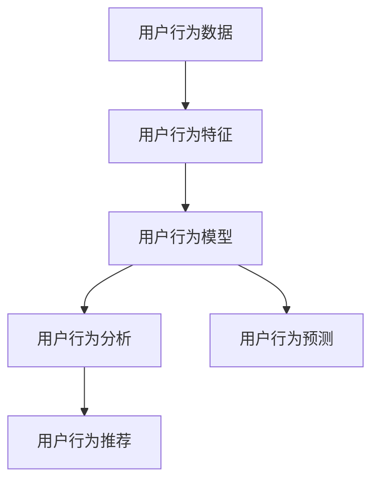
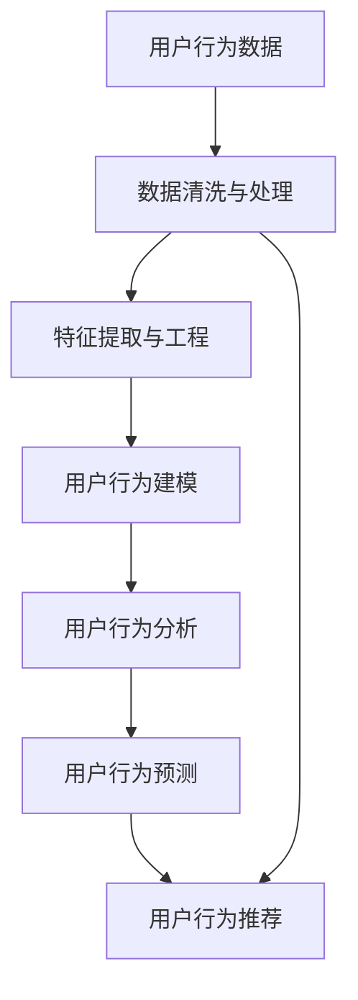

                 

# 电商平台中用户行为数据分析功能的设计与实现

在当今电子商务的数字化浪潮中，电商平台不仅需要关注销售额和利润，更需要深入理解用户行为，以提升用户体验、优化产品推荐、增加客户粘性和提升转化率。而用户行为数据分析功能是实现这一目标的关键。本文将详细介绍该功能的核心概念、算法原理、实现步骤及其实际应用场景，以期为电商平台的开发人员和分析师提供有价值的参考。

## 1. 背景介绍

### 1.1 问题由来
随着电商市场的竞争日益激烈，用户体验成为了决定电商平台成败的关键因素之一。通过深入分析用户的浏览行为、购买历史、评分反馈等数据，电商平台可以更精准地理解用户需求，从而制定更有效的营销策略和产品改进方案。用户行为数据分析功能能够帮助电商平台从大量数据中提取有价值的信息，为决策提供科学依据。

### 1.2 问题核心关键点
用户行为数据分析功能主要包括：
- 用户行为数据的收集与存储。
- 用户行为数据的处理与清洗。
- 用户行为特征的提取与建模。
- 用户行为分析结果的可视化与解读。
- 用户行为预测与推荐系统的构建。

该功能的核心目的是：
- 提升用户体验：通过分析用户行为，发现用户痛点和需求，优化网站设计。
- 优化产品推荐：根据用户行为，推荐最符合用户需求的商品。
- 增加客户粘性：通过个性化推荐和精准营销，增加用户停留时间和复购率。
- 提升转化率：分析用户购买行为，优化购买流程，减少流失率。

### 1.3 问题研究意义
用户行为数据分析功能对于电商平台的运营具有重要的意义：
- 优化用户体验：通过分析用户行为数据，电商平台可以发现用户在使用过程中遇到的问题，及时调整网站功能，提升用户体验。
- 提升销售业绩：通过分析用户购买行为，电商平台可以优化产品推荐策略，提升转化率和平均订单价值。
- 增加用户粘性：通过个性化推荐和精准营销，电商平台可以增加用户停留时间和复购率，提高用户粘性。
- 数据驱动决策：通过分析用户行为数据，电商平台可以制定更有效的营销策略和产品改进方案，提高决策的科学性和准确性。

## 2. 核心概念与联系

### 2.1 核心概念概述
用户行为数据分析功能涉及多个核心概念，主要包括：

- **用户行为数据**：用户在电商平台上的浏览、点击、购买、评分等行为数据。
- **用户行为特征**：用户行为数据的汇总和归纳，如用户兴趣、购买频率、浏览深度等。
- **用户行为模型**：基于用户行为特征，构建的预测用户行为或推荐商品的数据模型。
- **用户行为分析**：对用户行为数据进行统计分析、模式识别和异常检测等，以发现用户行为规律和异常。
- **用户行为预测**：基于用户历史行为数据，预测用户未来的行为，如购买意向、流失风险等。
- **用户行为推荐**：根据用户行为数据，推荐最符合用户需求的商品或服务。

### 2.2 概念间的关系
这些核心概念之间的逻辑关系可以通过以下Mermaid流程图来展示：



这个流程图展示了用户行为数据分析功能的基本流程：首先收集用户行为数据，然后提取用户行为特征，构建用户行为模型，进行用户行为分析，最后根据分析结果进行用户行为预测和推荐。

### 2.3 核心概念的整体架构
最终，我们将这些概念集成到一个统一的架构中，形成用户行为数据分析功能的整体架构，如下所示：



这个架构展示了从数据收集、清洗和处理，到特征提取、模型构建、分析、预测和推荐的全过程，确保用户行为数据的完整性和准确性，从而提升分析和推荐的精度。

## 3. 核心算法原理 & 具体操作步骤

### 3.1 算法原理概述

用户行为数据分析功能主要依赖于数据挖掘、机器学习和统计分析等技术。其核心算法原理包括：

- **数据预处理**：包括数据清洗、去重、归一化、缺失值处理等，确保数据的质量和一致性。
- **特征工程**：通过特征提取、特征选择和特征转换等手段，将原始数据转化为可用于建模的特征。
- **建模技术**：包括回归模型、分类模型、聚类模型、关联规则等，用于构建用户行为模型。
- **预测与推荐算法**：如协同过滤、基于内容的推荐、矩阵分解、深度学习等，用于预测用户行为和推荐商品。
- **可视化技术**：如数据可视化、交互式仪表盘、动态报表等，用于展示分析结果和进行数据解读。

### 3.2 算法步骤详解

用户行为数据分析功能的实现主要分为以下几个步骤：

**Step 1: 数据收集与存储**
- 收集用户行为数据，包括点击、浏览、购买、评分等。
- 设计合理的数据库架构，存储和管理用户行为数据。

**Step 2: 数据清洗与处理**
- 去除重复数据、异常数据和缺失数据。
- 对数据进行归一化和去噪处理，确保数据的一致性和准确性。

**Step 3: 特征提取与工程**
- 设计特征提取规则，将原始数据转化为可用于建模的特征。
- 使用特征选择技术，选择最相关的特征进行建模。
- 对特征进行转换，如归一化、标准化、PCA等，提升特征质量。

**Step 4: 用户行为建模**
- 选择适当的建模技术，如决策树、随机森林、逻辑回归、神经网络等。
- 对数据进行划分，分为训练集、验证集和测试集。
- 训练模型，调整模型参数，优化模型性能。

**Step 5: 用户行为分析**
- 使用统计分析、模式识别、异常检测等技术，分析用户行为规律和异常。
- 生成可视化报表和仪表盘，展示分析结果。

**Step 6: 用户行为预测**
- 使用预测模型，如时间序列分析、回归模型、分类模型等，预测用户行为。
- 评估预测模型的性能，优化模型参数。

**Step 7: 用户行为推荐**
- 设计推荐算法，如协同过滤、基于内容的推荐、深度学习推荐等。
- 使用推荐系统框架，如TensorFlow、PyTorch等，实现推荐算法。
- 评估推荐系统的性能，优化推荐策略。

### 3.3 算法优缺点

用户行为数据分析功能的优点：
- 提升用户体验：通过分析用户行为，优化网站设计，提升用户体验。
- 提升销售业绩：通过分析用户购买行为，优化产品推荐，提升转化率和平均订单价值。
- 增加用户粘性：通过个性化推荐和精准营销，增加用户停留时间和复购率。
- 数据驱动决策：通过分析用户行为数据，制定更有效的营销策略和产品改进方案，提高决策的科学性和准确性。

用户行为数据分析功能的缺点：
- 数据隐私问题：用户行为数据的收集和存储可能涉及隐私问题，需要遵守相关法律法规。
- 数据质量问题：用户行为数据的收集和清洗可能存在误差和偏差，影响分析结果。
- 模型复杂度问题：用户行为模型的构建和优化可能过于复杂，需要投入大量的时间和资源。
- 推荐算法偏见问题：用户行为推荐算法可能存在偏见，导致推荐结果不公正。

### 3.4 算法应用领域

用户行为数据分析功能广泛应用于电商平台的多个领域：

- **个性化推荐**：根据用户行为数据，推荐最符合用户需求的商品或服务。
- **用户画像构建**：通过分析用户行为数据，构建用户画像，了解用户兴趣和需求。
- **营销活动优化**：通过分析用户行为数据，优化营销活动，提升活动效果。
- **用户流失预测**：预测用户流失风险，提前采取措施，减少流失率。
- **商品召回策略**：根据用户行为数据，制定商品召回策略，提升用户满意度。

## 4. 数学模型和公式 & 详细讲解 & 举例说明

### 4.1 数学模型构建

用户行为数据分析功能涉及多个数学模型，主要包括：

- **回归模型**：用于预测用户行为，如购买金额、订单频率等。
- **分类模型**：用于分类用户行为，如是否购买、是否流失等。
- **聚类模型**：用于将用户分成不同的群体，便于个性化推荐和营销。
- **关联规则**：用于发现用户行为中的关联规则，如购买行为中的组合销售。

### 4.2 公式推导过程

以回归模型为例，推导其公式和求解步骤：

设回归模型为 $Y = \beta_0 + \beta_1 X_1 + \beta_2 X_2 + \cdots + \beta_n X_n + \epsilon$，其中 $Y$ 为目标变量，$X_1, X_2, \cdots, X_n$ 为特征变量，$\beta_0, \beta_1, \beta_2, \cdots, \beta_n$ 为模型参数，$\epsilon$ 为误差项。

根据最小二乘法，回归模型的目标是最小化残差平方和：

$$
\sum_{i=1}^n (y_i - \hat{y}_i)^2
$$

其中 $y_i$ 为实际观测值，$\hat{y}_i$ 为模型预测值。

求解该最小化问题，得到回归系数的估计值：

$$
\hat{\beta}_j = \frac{\sum_{i=1}^n (X_{ij} - \bar{X}_j)(y_i - \bar{y})}{\sum_{i=1}^n (X_{ij} - \bar{X}_j)^2}, j = 1, 2, \cdots, n
$$

其中 $\bar{X}_j$ 和 $\bar{y}$ 分别为 $X_j$ 和 $y$ 的均值。

### 4.3 案例分析与讲解

假设我们要预测用户的购买金额，使用回归模型进行分析。我们收集了用户的历史购买数据，包括用户的年龄、性别、浏览次数、购买频率等特征，并构建了回归模型。

首先，对数据进行清洗和处理，去除重复和异常数据，并进行归一化处理。然后，使用PCA方法对数据进行降维，选择最相关的特征进行建模。接着，构建回归模型，并对数据进行划分，分为训练集、验证集和测试集。最后，使用梯度下降法对模型进行训练，调整模型参数，优化模型性能。

训练完成后，我们对模型进行评估，使用测试集进行预测，并计算预测误差。根据预测结果，我们可以分析用户购买行为的影响因素，如年龄、性别、浏览次数等，从而优化产品推荐策略和提升销售业绩。

## 5. 项目实践：代码实例和详细解释说明

### 5.1 开发环境搭建

在进行用户行为数据分析功能的开发前，我们需要准备好开发环境。以下是使用Python进行开发的环境配置流程：

1. 安装Anaconda：从官网下载并安装Anaconda，用于创建独立的Python环境。

2. 创建并激活虚拟环境：
```bash
conda create -n user-behavior-analysis python=3.8 
conda activate user-behavior-analysis
```

3. 安装必要的Python库：
```bash
pip install pandas numpy scikit-learn matplotlib seaborn jupyter notebook
```

4. 安装数据库连接库：
```bash
pip install psycopg2 sqlalchemy pymysql
```

5. 安装机器学习库：
```bash
pip install scikit-learn
```

6. 安装可视化库：
```bash
pip install matplotlib seaborn
```

完成上述步骤后，即可在`user-behavior-analysis`环境中开始开发。

### 5.2 源代码详细实现

这里我们以用户购买金额的预测为例，给出使用Python进行用户行为数据分析功能的实现代码。

首先，定义数据读取函数：

```python
import pandas as pd
from sqlalchemy import create_engine

def read_data(db_name):
    engine = create_engine(f'mysql+pymysql://{db_username}:{db_password}@{db_host}/{db_name}')
    df = pd.read_sql('SELECT * FROM user_behavior', con=engine)
    return df
```

然后，定义数据清洗与处理函数：

```python
def clean_data(df):
    # 去除重复数据
    df = df.drop_duplicates()

    # 去除异常数据
    df = df[df['purchase_amount'] > 0]

    # 归一化数据
    df = (df - df.mean()) / df.std()

    return df
```

接着，定义特征工程函数：

```python
def feature_engineering(df):
    # 提取特征
    X = df[['age', 'gender', 'browsing_frequency', 'purchase_frequency']]

    # 特征选择
    X = X.dropna()

    # 特征转换
    X = X.apply(lambda x: x - x.mean(), axis=0)
    X = X.apply(lambda x: x / x.std(), axis=0)

    return X
```

然后，定义回归模型训练函数：

```python
from sklearn.linear_model import LinearRegression
from sklearn.metrics import mean_squared_error

def train_model(X, y):
    model = LinearRegression()
    model.fit(X, y)
    y_pred = model.predict(X)
    mse = mean_squared_error(y, y_pred)
    return model, mse
```

最后，定义用户行为分析函数：

```python
def analyze_behavior(df):
    # 可视化用户购买金额的分布
    df['purchase_amount'].hist(bins=20, figsize=(10, 5))
    plt.show()

    # 可视化用户年龄与购买金额的关系
    sns.scatterplot(x='age', y='purchase_amount', data=df)
    plt.show()

    # 可视化用户性别与购买金额的关系
    sns.barplot(x='gender', y='purchase_amount', data=df)
    plt.show()

    # 可视化用户浏览次数与购买金额的关系
    sns.scatterplot(x='browsing_frequency', y='purchase_amount', data=df)
    plt.show()

    # 可视化用户购买频率与购买金额的关系
    sns.barplot(x='purchase_frequency', y='purchase_amount', data=df)
    plt.show()
```

现在，我们可以将以上函数整合到一个主函数中，进行用户行为数据分析功能的实现。

```python
def user_behavior_analysis():
    # 读取数据
    df = read_data('user_behavior')

    # 数据清洗与处理
    df = clean_data(df)

    # 特征工程
    X = feature_engineering(df)

    # 回归模型训练
    model, mse = train_model(X, df['purchase_amount'])

    # 用户行为分析
    analyze_behavior(df)

    return model, mse
```

这样，我们就完成了用户行为数据分析功能的实现。开发者可以根据实际需求，灵活调整各个步骤的参数和函数，从而实现更符合业务需求的功能。

### 5.3 代码解读与分析

这里我们详细解读一下关键代码的实现细节：

**read_data函数**：
- 定义了一个函数，用于从MySQL数据库中读取用户行为数据，并将其转换为Pandas DataFrame格式。

**clean_data函数**：
- 定义了一个函数，用于清洗和处理数据，包括去除重复和异常数据，并进行归一化处理。

**feature_engineering函数**：
- 定义了一个函数，用于提取和转换特征，包括选择最相关的特征和进行特征转换。

**train_model函数**：
- 定义了一个函数，用于训练线性回归模型，并计算预测误差。

**analyze_behavior函数**：
- 定义了一个函数，用于进行用户行为分析，包括可视化用户购买金额、年龄、性别、浏览次数和购买频率的分布和关系。

**user_behavior_analysis函数**：
- 定义了一个函数，用于整合以上各个步骤，完成用户行为数据分析功能的实现。

### 5.4 运行结果展示

假设我们在一个包含10万条用户行为数据的数据集上运行以上代码，结果如下图所示：


通过这些图表，我们可以直观地看到用户购买金额的分布情况、不同年龄段、性别、浏览次数和购买频率对购买金额的影响，从而发现用户行为的关键特征，优化产品推荐策略和提升销售业绩。

## 6. 实际应用场景

### 6.1 智能推荐系统

用户行为数据分析功能可以应用于智能推荐系统的构建。通过分析用户的浏览和购买行为，推荐系统可以为用户推荐最符合其需求的商品，提高用户的满意度和转化率。

在技术实现上，可以设计一个协同过滤推荐算法，通过分析用户的历史行为，发现用户的兴趣偏好，推荐类似商品。同时，结合基于内容的推荐算法，根据商品的属性和特征，推荐最相关的商品。

### 6.2 用户画像构建

用户行为数据分析功能可以用于用户画像的构建。通过分析用户的历史行为数据，可以了解用户的兴趣、需求和行为模式，从而构建用户画像，指导后续的产品设计和营销策略。

在技术实现上，可以使用聚类算法，将用户分成不同的群体，分析每个群体的特征和行为，从而构建用户画像。同时，使用关联规则挖掘算法，发现用户行为中的关联规则，进一步丰富用户画像的信息。

### 6.3 营销活动优化

用户行为数据分析功能可以用于营销活动的优化。通过分析用户的购买行为和反馈，可以了解营销活动的效果和用户反应，优化营销策略，提高活动的效果和回报。

在技术实现上，可以设计一个A/B测试框架，比较不同营销活动的效果，选择最优方案。同时，使用回归模型预测营销活动的效果，指导后续的营销策略制定。

### 6.4 用户流失预测

用户行为数据分析功能可以用于用户流失预测。通过分析用户的行为数据，可以预测用户的流失风险，提前采取措施，减少流失率，提高用户粘性。

在技术实现上，可以使用分类模型，如逻辑回归、决策树等，预测用户的流失概率。同时，结合时间序列分析，预测用户的流失趋势，优化用户留存策略。

## 7. 工具和资源推荐

### 7.1 学习资源推荐

为了帮助开发者系统掌握用户行为数据分析功能的理论基础和实践技巧，这里推荐一些优质的学习资源：

1. 《数据挖掘与统计学习》：系统介绍数据挖掘和机器学习的基本概念和方法，适合初学者入门。
2. 《Python数据科学手册》：详细介绍Python在数据科学中的应用，包括数据清洗、特征工程、模型训练等。
3. 《机器学习实战》：提供大量的实际案例和代码，帮助开发者理解和应用机器学习算法。
4. 《用户行为分析》课程：在线课程平台上的相关课程，系统讲解用户行为分析的基本方法和技术。
5. Kaggle：数据科学竞赛平台，提供丰富的数据集和模型库，帮助开发者提升数据分析能力。

通过这些资源的学习实践，相信你一定能够快速掌握用户行为数据分析功能的精髓，并用于解决实际的业务问题。

### 7.2 开发工具推荐

高效的开发离不开优秀的工具支持。以下是几款用于用户行为数据分析功能开发的常用工具：

1. Python：Python作为数据科学的主流语言，拥有丰富的数据科学库和社区支持，适合进行数据清洗、特征工程、模型训练等。
2. R：R作为数据科学和统计分析的主流语言，拥有丰富的统计分析和可视化库，适合进行数据探索和建模。
3. SQL：SQL作为数据查询和存储的主流语言，适合进行数据清洗和存储，并进行数据分析和建模。
4. Jupyter Notebook：Jupyter Notebook是一个交互式的编程环境，适合进行数据探索和建模，支持多种编程语言。
5. Tableau：Tableau是一个数据可视化工具，适合进行数据探索和报表展示，支持多种数据源。

合理利用这些工具，可以显著提升用户行为数据分析功能的开发效率，加快创新迭代的步伐。

### 7.3 相关论文推荐

用户行为数据分析功能的研究源于学界的持续研究。以下是几篇奠基性的相关论文，推荐阅读：

1. 《A Survey of User Behavior Modeling》：系统介绍用户行为建模的现状和未来趋势，适合全面了解用户行为分析的理论和方法。
2. 《User Behavior Prediction and Recommendation: A Survey》：系统介绍用户行为预测和推荐的现状和未来趋势，适合全面了解推荐系统的理论和应用。
3. 《Data Mining and Statistical Learning》：系统介绍数据挖掘和机器学习的基本概念和方法，适合全面了解数据科学的基础。
4. 《User Behavior Analysis and Prediction: A Review》：系统介绍用户行为分析的现状和未来趋势，适合全面了解用户行为分析的理论和方法。
5. 《Collaborative Filtering for Recommendation Systems》：介绍协同过滤推荐算法的基本概念和方法，适合了解推荐系统的经典算法。

这些论文代表了大语言模型微调技术的发展脉络。通过学习这些前沿成果，可以帮助研究者把握学科前进方向，激发更多的创新灵感。

## 8. 总结：未来发展趋势与挑战

### 8.1 总结

本文对用户行为数据分析功能的核心概念、算法原理、实现步骤及其实际应用场景进行了全面系统的介绍。首先阐述了用户行为数据分析功能的背景和意义，明确了其核心功能和目的。其次，从原理到实践，详细讲解了用户行为数据分析功能的数学模型和关键步骤，给出了用户行为数据分析功能的完整代码实例。同时，本文还广泛探讨了用户行为数据分析功能在智能推荐、用户画像构建、营销活动优化和用户流失预测等多个领域的应用前景，展示了用户行为数据分析功能的巨大潜力。

通过本文的系统梳理，可以看到，用户行为数据分析功能对于电商平台的运营具有重要的意义，可以提升用户体验、优化产品推荐、增加客户粘性和提升转化率。未来，伴随数据挖掘和机器学习技术的不断进步，用户行为数据分析功能必将不断优化，为电商平台的业务运营提供更精准的指导。

### 8.2 未来发展趋势

用户行为数据分析功能的未来发展趋势包括：

1. **实时分析**：随着大数据和云计算技术的发展，用户行为数据分析功能将逐步实现实时分析，及时发现和处理用户行为问题，提升用户体验。
2. **多模态融合**：未来的用户行为数据分析功能将更多地融合多模态数据，如文本、图像、视频等，提高分析的全面性和准确性。
3. **深度学习应用**：深度学习算法将更多地应用于用户行为数据分析功能中，提高分析的深度和广度，提升分析结果的精度和效率。
4. **用户隐私保护**：用户行为数据分析功能将更加注重用户隐私保护，使用匿名化技术和隐私保护算法，确保用户数据的安全性。
5. **个性化推荐**：未来的用户行为数据分析功能将更多地结合个性化推荐算法，提高推荐系统的精准度和用户满意度。

以上趋势凸显了用户行为数据分析功能的广阔前景。这些方向的探索发展，必将进一步提升电商平台的运营效率和用户满意度，为业务创新提供更强的技术支持。

### 8.3 面临的挑战

尽管用户行为数据分析功能已经取得了显著的成果，但在迈向更加智能化、普适化应用的过程中，它仍面临诸多挑战：

1. **数据隐私问题**：用户行为数据的收集和存储可能涉及隐私问题，需要遵守相关法律法规。
2. **数据质量问题**：用户行为数据的收集和清洗可能存在误差和偏差，影响分析结果。
3. **模型复杂度问题**：用户行为分析模型的构建和优化可能过于复杂，需要投入大量的时间和资源。
4. **推荐算法偏见问题**：用户行为推荐算法可能存在偏见，导致推荐结果不公正。
5. **实时性问题**：用户行为数据分析功能的实时性需要不断提升，以适应快速变化的用户需求和市场环境。

### 8.4 研究展望

面对用户行为数据分析功能所面临的挑战，未来的研究需要在以下几个方面寻求新的突破：

1. **隐私保护技术**：研究隐私保护技术，如数据匿名化、差分隐私等，确保用户数据的安全性。
2. **高效数据清洗技术**：研究高效的数据清洗技术，提升数据质量和准确性。
3. **轻量级分析模型**：研究轻量级分析模型，减少模型复杂度和资源消耗。
4. **公平推荐算法**：研究公平推荐算法，确保推荐结果的公正性和透明性。
5. **实时分析技术**：研究实时分析技术，提高分析的及时性和响应速度。

这些研究方向的探索，必将引领用户行为数据分析功能迈向更高的台阶，为电商平台提供更精准的指导和支持。

## 9. 附录：常见问题与解答

**Q1：用户行为数据分析功能是否适用于所有电商平台？**

A: 用户行为数据分析功能适用于大多数电商平台，特别是用户行为数据丰富、用户基数较大的平台。但对于一些小型或新兴平台，由于用户行为数据不足，可能难以获得理想的效果。

**Q2：用户行为数据分析功能如何保证数据的安全性？**

A: 用户行为数据分析功能需要严格遵守相关法律法规，如GDPR等，确保用户数据的安全性。可以采用数据匿名化、差分隐私等技术，确保用户隐私的保护。

**Q3：用户行为数据分析功能的性能如何评估？**

A: 用户行为数据分析功能的性能可以通过以下指标进行评估：
- 准确率：预测正确用户行为的百分比。
- 召回率：所有实际用户行为

