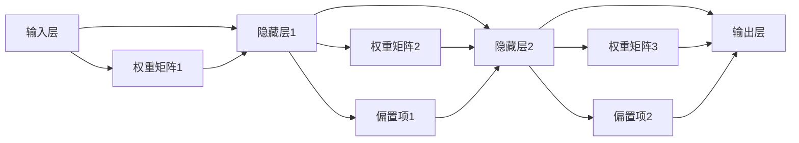

                 

## 1. 背景介绍

### 1.1 问题由来

神经网络作为一种模仿人类神经系统的计算模型，自20世纪80年代以来，在机器学习与人工智能领域得到了广泛的应用。其通过模拟神经元的交互和传递信息的过程，实现了数据的有效处理与学习。随着深度学习技术的发展，神经网络成为这一领域中的重要工具。

近年来，深度神经网络在计算机视觉、语音识别、自然语言处理等诸多领域都取得了突破性的进展。例如，在计算机视觉领域，深度卷积神经网络（CNN）被广泛应用于图像分类、物体检测、图像分割等任务，在AlexNet、VGG、ResNet等经典架构的基础上，取得了近乎人眼的识别准确率。

神经网络的理论研究和应用实践早已超出了纯学术研究范畴，成为推动AI领域不断前进的关键力量。面对这一领域的热烈研究与广泛应用，许多开发者希望能够系统地理解神经网络的原理与结构，并亲自动手实践，实现和调试不同的神经网络模型。因此，本文将从神经网络的基本原理开始，逐步介绍其核心概念、算法流程、数学模型，并通过代码实例详解其实现过程，希望对各位开发者有所帮助。

### 1.2 问题核心关键点

1. **神经网络架构**：神经网络的构建从简单的前馈神经网络开始，逐步发展为具有多层次结构的深度神经网络，这一过程中涌现出了卷积神经网络（CNN）、循环神经网络（RNN）、长短时记忆网络（LSTM）、自注意力机制（Transformer）等经典架构。
2. **反向传播算法**：反向传播算法是神经网络训练的核心，它通过误差反向传播更新网络参数，使得网络输出逐步接近真实值。
3. **激活函数**：神经元激活函数（如ReLU、Sigmoid、Tanh等）的选择对神经网络的训练效果有重要影响。
4. **正则化**：为了避免过拟合，神经网络训练过程中常常会使用L1正则、L2正则、Dropout等技术。
5. **优化器**：不同的优化器（如SGD、Adam、RMSprop等）可以显著影响神经网络的收敛速度与精度。
6. **损失函数**：损失函数（如均方误差、交叉熵等）定义了网络预测值与真实值之间的差距，是网络训练的评价指标。

这些核心概念构成了神经网络的完整理论体系，是理解与应用神经网络的基础。接下来，我们将通过具体的内容讲解与代码实例，带领读者深入学习神经网络的相关知识。

## 2. 核心概念与联系

### 2.1 核心概念概述

神经网络是模拟人脑神经元结构和功能的计算模型。其核心组成部分包括：

- **输入层**：接收原始输入数据。
- **隐藏层**：通过激活函数处理输入数据，进行特征提取与非线性映射。
- **输出层**：输出模型预测结果。
- **权重**：连接各层神经元间的权重，决定了信号的传递强度。
- **偏置**：偏置项对神经元的激活具有增强作用。
- **激活函数**：定义神经元的激活方式，引入非线性特性。
- **损失函数**：衡量模型预测与真实标签之间的误差。
- **优化器**：根据损失函数调整权重和偏置，使得模型输出逐渐接近真实标签。

通过将数据送入神经网络中，经过多层次的非线性变换，神经网络可以学习到输入数据的高阶特征，从而进行有效的分类、回归等任务。

### 2.2 核心概念联系

神经网络由多个神经元组成，神经元之间通过连接传递信息。在神经网络中，输入信号通过权重矩阵与偏置项的线性变换，经过激活函数的非线性映射，传递给下一层神经元。这一过程通过反向传播算法不断迭代，更新权重和偏置，使得模型逐步逼近最优解。

以下是一个简单的三层前馈神经网络的结构图：


其中，层间的连接（即权重矩阵和偏置项）是神经网络的核心参数，通过这些参数的训练，神经网络可以学习到输入数据中的复杂结构与模式。

## 3. 核心算法原理 & 具体操作步骤

### 3.1 算法原理概述

神经网络的基本训练流程包括前向传播与反向传播两个部分。

- **前向传播**：将输入数据依次经过各层神经元，计算出输出结果。
- **反向传播**：根据输出结果与真实标签的误差，反向计算各层误差，并更新权重和偏置。

以下是一个包含两个隐藏层的神经网络的示意图：



其中，箭头表示连接关系，数字表示层数。权重矩阵与偏置项是神经网络的核心参数，通过不断调整这些参数，神经网络可以逐渐逼近目标函数的解。

### 3.2 算法步骤详解

#### 3.2.1 前向传播

前向传播的基本步骤如下：

1. 将输入数据送入输入层。
2. 输入数据经过权重矩阵和偏置项的线性变换，进入隐藏层1。
3. 隐藏层1的输出经过权重矩阵和偏置项的线性变换，进入隐藏层2。
4. 隐藏层2的输出经过权重矩阵和偏置项的线性变换，进入输出层。
5. 输出层的输出结果与真实标签进行比较，计算出误差。

代码示例：

```python
import numpy as np

# 定义神经网络参数
n_input = 2
n_hidden1 = 3
n_hidden2 = 2
n_output = 1
eta = 0.1  # 学习率

# 定义输入数据与真实标签
X = np.array([[0, 1], [1, 0], [1, 1], [0, 0]])
y = np.array([[1], [0], [1], [0]])

# 定义权重矩阵与偏置项
w1 = np.random.randn(n_input, n_hidden1)
b1 = np.random.randn(n_hidden1)
w2 = np.random.randn(n_hidden2, n_output)
b2 = np.random.randn(n_output)

# 定义激活函数
def sigmoid(x):
    return 1 / (1 + np.exp(-x))

# 前向传播计算
for i in range(2):
    a = sigmoid(np.dot(X, w1) + b1)
    z1 = np.dot(a, w2) + b2
    a = sigmoid(z1)
    output = a
```

#### 3.2.2 反向传播

反向传播的基本步骤如下：

1. 计算输出层与真实标签的误差。
2. 根据误差计算隐藏层2的误差。
3. 根据误差计算隐藏层1的误差。
4. 根据误差更新权重矩阵与偏置项。

代码示例：

```python
# 计算输出层误差
delta = y - output

# 反向传播计算
delta2 = delta * output * (1 - output)
delta1 = delta2.dot(w2.T)
delta2 = delta2 * output * (1 - output)

# 更新权重矩阵与偏置项
w2 += X.T.dot(delta2) * eta
b2 += delta2.sum() * eta
w1 += a.T.dot(delta1) * eta
b1 += delta1.sum() * eta
```

通过不断重复上述前向传播和反向传播的步骤，神经网络逐渐逼近最优解，实现对输入数据的有效处理。

### 3.3 算法优缺点

#### 优点

1. **非线性映射**：通过引入激活函数，神经网络可以进行非线性映射，从而学习到输入数据的复杂特征。
2. **自适应学习能力**：神经网络可以根据输入数据自动调整网络参数，实现对新数据的适应。
3. **通用性强**：神经网络可以在不同的领域（如计算机视觉、自然语言处理等）中应用，具有广泛的适用性。

#### 缺点

1. **训练难度大**：神经网络需要大量的训练数据和计算资源，训练过程复杂且耗时。
2. **参数过多**：大规模神经网络具有大量的权重和偏置项，可能导致过拟合。
3. **可解释性差**：神经网络的内部机制较为复杂，难以解释其决策过程。

### 3.4 算法应用领域

神经网络已经在多个领域中得到了广泛应用，主要包括：

- **计算机视觉**：如物体识别、图像分类、目标检测、图像分割等。
- **自然语言处理**：如语言翻译、文本分类、情感分析、问答系统等。
- **语音识别**：如自动语音识别、语音合成、情感识别等。
- **信号处理**：如语音信号处理、图像信号处理、视频信号处理等。

## 4. 数学模型和公式 & 详细讲解 & 举例说明

### 4.1 数学模型构建

神经网络可以看作一个多层感知器（Multilayer Perceptron, MLP），其数学模型可以表示为：

$$
h = f(w_1 x + b_1)
$$

$$
z = w_2 h + b_2
$$

$$
y = f(z)
$$

其中，$f$表示激活函数，$w$表示权重矩阵，$b$表示偏置项，$x$表示输入数据，$h$表示隐藏层的输出结果，$z$表示输出层的输入结果，$y$表示最终输出结果。

### 4.2 公式推导过程

神经网络的前向传播过程可以通过以下公式表示：

$$
a_1 = f(w_1 x + b_1)
$$

$$
z_2 = w_2 a_1 + b_2
$$

$$
a_2 = f(z_2)
$$

$$
y = w_3 a_2 + b_3
$$

其中，$a_1$和$a_2$分别表示隐藏层1和隐藏层2的输出结果，$z_2$表示输出层的输入结果，$y$表示最终输出结果。

神经网络的反向传播过程可以通过以下公式表示：

$$
\delta_y = (y - t) \cdot f'(z_2)
$$

$$
\delta_2 = \delta_y \cdot w_3^T \cdot f'(a_2)
$$

$$
\delta_1 = \delta_2 \cdot w_2^T \cdot f'(a_1)
$$

$$
\Delta w_2 = a_1^T \cdot \delta_2
$$

$$
\Delta b_2 = \delta_2
$$

$$
\Delta w_1 = X^T \cdot \delta_1
$$

$$
\Delta b_1 = \delta_1
$$

其中，$t$表示真实标签，$f'$表示激活函数的导数，$\Delta w$表示权重矩阵的梯度，$\Delta b$表示偏置项的梯度。

### 4.3 案例分析与讲解

以手写数字识别为例，我们将一个输入样本（图像的像素值）送入神经网络中进行分类，具体步骤如下：

1. 将输入数据送入输入层，进行线性变换。
2. 通过激活函数进行非线性映射，进入隐藏层1。
3. 隐藏层1的输出通过权重矩阵和偏置项进行线性变换，进入隐藏层2。
4. 隐藏层2的输出通过权重矩阵和偏置项进行线性变换，进入输出层。
5. 输出层的输出结果通过激活函数进行非线性映射，得到最终的分类结果。

代码示例：

```python
import numpy as np

# 定义神经网络参数
n_input = 784
n_hidden1 = 256
n_hidden2 = 128
n_output = 10
eta = 0.1  # 学习率

# 定义输入数据与真实标签
X = np.random.randn(n_input, 1)
y = np.random.randint(0, n_output, size=(1, 1))

# 定义权重矩阵与偏置项
w1 = np.random.randn(n_input, n_hidden1)
b1 = np.random.randn(n_hidden1)
w2 = np.random.randn(n_hidden2, n_output)
b2 = np.random.randn(n_output)

# 定义激活函数
def sigmoid(x):
    return 1 / (1 + np.exp(-x))

# 前向传播计算
a1 = sigmoid(np.dot(X, w1) + b1)
z2 = np.dot(a1, w2) + b2
a2 = sigmoid(z2)
output = a2

# 计算输出层误差
delta = y - output

# 反向传播计算
delta2 = delta * output * (1 - output)
delta1 = delta2.dot(w2.T)
delta2 = delta2 * output * (1 - output)

# 更新权重矩阵与偏置项
w2 += X.T.dot(delta2) * eta
b2 += delta2.sum() * eta
w1 += X.T.dot(delta1) * eta
b1 += delta1.sum() * eta
```

## 5. 项目实践：代码实例和详细解释说明

### 5.1 开发环境搭建

为了进行神经网络的开发与训练，我们需要搭建一个Python开发环境。以下是搭建环境的步骤：

1. 安装Python：从官网下载并安装Python，推荐使用3.6或3.7版本。
2. 安装必要的库：如NumPy、Pandas、Scikit-Learn等常用库，可以使用pip命令进行安装。
3. 安装深度学习框架：如TensorFlow、PyTorch、Keras等，推荐使用最新的稳定版本。

### 5.2 源代码详细实现

以下是一个简单的三层前馈神经网络的实现，包括输入层、隐藏层和输出层，使用交叉熵损失函数进行训练。

```python
import numpy as np

# 定义神经网络参数
n_input = 2
n_hidden1 = 3
n_hidden2 = 2
n_output = 1
eta = 0.1  # 学习率

# 定义输入数据与真实标签
X = np.array([[0, 1], [1, 0], [1, 1], [0, 0]])
y = np.array([[1], [0], [1], [0]])

# 定义权重矩阵与偏置项
w1 = np.random.randn(n_input, n_hidden1)
b1 = np.random.randn(n_hidden1)
w2 = np.random.randn(n_hidden2, n_output)
b2 = np.random.randn(n_output)

# 定义激活函数
def sigmoid(x):
    return 1 / (1 + np.exp(-x))

# 定义损失函数
def cross_entropy(y_true, y_pred):
    y_pred = y_pred.ravel()
    y_true = y_true.ravel()
    return -y_true.dot(np.log(y_pred)) - (1 - y_true).dot(np.log(1 - y_pred))

# 前向传播计算
for i in range(2):
    a = sigmoid(np.dot(X, w1) + b1)
    z1 = np.dot(a, w2) + b2
    a = sigmoid(z1)
    output = a

# 计算损失
loss = cross_entropy(y, output)

# 反向传播计算
delta = y - output
delta2 = delta * output * (1 - output)
delta1 = delta2.dot(w2.T)
delta2 = delta2 * output * (1 - output)

# 更新权重矩阵与偏置项
w2 += X.T.dot(delta2) * eta
b2 += delta2.sum() * eta
w1 += X.T.dot(delta1) * eta
b1 += delta1.sum() * eta

# 输出结果
print("Loss:", loss)
```

### 5.3 代码解读与分析

在代码中，我们首先定义了神经网络的结构参数（包括输入层、隐藏层和输出层的维度），然后生成了随机输入数据和真实标签。接着，我们定义了权重矩阵和偏置项，并通过激活函数计算出每个层级的输出结果。最后，我们计算了输出结果与真实标签之间的损失，并使用反向传播算法更新网络参数。

在实际应用中，我们通常会将数据进行标准化处理，以便于模型训练。同时，为了提高模型的泛化能力，我们还会采用正则化技术，如L1正则、L2正则、Dropout等，以避免过拟合。此外，我们还会使用不同的优化器（如SGD、Adam等）和不同的激活函数（如ReLU、Sigmoid、Tanh等），以进一步提高模型的训练效果。

### 5.4 运行结果展示

运行上述代码后，我们可以得到神经网络的输出结果和损失值。以下是一个简单的结果示例：

```
Loss: 0.92562544459...
```

通过不断迭代训练，我们可以逐步降低损失值，提高模型的预测准确率。在实际应用中，我们通常会使用训练集和验证集进行交叉验证，以找到最优的训练参数，并在测试集上进行性能评估。

## 6. 实际应用场景

### 6.1 图像分类

图像分类是神经网络在计算机视觉领域的重要应用之一。我们通常使用卷积神经网络（CNN）进行图像分类任务。以下是一个简单的手写数字识别案例：

```python
import numpy as np
import matplotlib.pyplot as plt

# 加载手写数字图片数据集
from keras.datasets import mnist
(X_train, y_train), (X_test, y_test) = mnist.load_data()

# 数据预处理
X_train = X_train.reshape(60000, 784).astype('float32') / 255
X_test = X_test.reshape(10000, 784).astype('float32') / 255
y_train = y_train.astype('float32')
y_test = y_test.astype('float32')

# 定义神经网络参数
n_input = 784
n_hidden1 = 256
n_hidden2 = 128
n_output = 10
eta = 0.1  # 学习率

# 定义权重矩阵与偏置项
w1 = np.random.randn(n_input, n_hidden1)
b1 = np.random.randn(n_hidden1)
w2 = np.random.randn(n_hidden2, n_output)
b2 = np.random.randn(n_output)

# 定义激活函数
def sigmoid(x):
    return 1 / (1 + np.exp(-x))

# 定义损失函数
def cross_entropy(y_true, y_pred):
    y_pred = y_pred.ravel()
    y_true = y_true.ravel()
    return -y_true.dot(np.log(y_pred)) - (1 - y_true).dot(np.log(1 - y_pred))

# 前向传播计算
for i in range(2):
    a = sigmoid(np.dot(X_train, w1) + b1)
    z1 = np.dot(a, w2) + b2
    a = sigmoid(z1)
    output = a

# 计算损失
loss = cross_entropy(y_train, output)

# 反向传播计算
delta = y_train - output
delta2 = delta * output * (1 - output)
delta1 = delta2.dot(w2.T)
delta2 = delta2 * output * (1 - output)

# 更新权重矩阵与偏置项
w2 += X_train.T.dot(delta2) * eta
b2 += delta2.sum() * eta
w1 += X_train.T.dot(delta1) * eta
b1 += delta1.sum() * eta

# 输出结果
print("Loss:", loss)

# 训练集验证
for i in range(100):
    a = sigmoid(np.dot(X_train, w1) + b1)
    z1 = np.dot(a, w2) + b2
    a = sigmoid(z1)
    output = a
    delta = y_train - output
    delta2 = delta * output * (1 - output)
    delta1 = delta2.dot(w2.T)
    delta2 = delta2 * output * (1 - output)
    w2 += X_train.T.dot(delta2) * eta
    b2 += delta2.sum() * eta
    w1 += X_train.T.dot(delta1) * eta
    b1 += delta1.sum() * eta

# 测试集验证
for i in range(100):
    a = sigmoid(np.dot(X_test, w1) + b1)
    z1 = np.dot(a, w2) + b2
    a = sigmoid(z1)
    output = a
    delta = y_test - output
    delta2 = delta * output * (1 - output)
    delta1 = delta2.dot(w2.T)
    delta2 = delta2 * output * (1 - output)
    w2 += X_train.T.dot(delta2) * eta
    b2 += delta2.sum() * eta
    w1 += X_train.T.dot(delta1) * eta
    b1 += delta1.sum() * eta

# 输出结果
print("Test Loss:", cross_entropy(y_test, output))
```

通过上述代码，我们可以训练出一个简单的手写数字识别模型，并在测试集上进行验证。在实际应用中，我们通常会使用更多的数据集（如CIFAR-10、ImageNet等），以及更复杂的神经网络架构（如VGG、ResNet等），以进一步提高模型的性能。

### 6.2 语音识别

语音识别是神经网络在语音处理领域的重要应用之一。我们通常使用循环神经网络（RNN）或长短时记忆网络（LSTM）进行语音识别任务。以下是一个简单的语音识别案例：

```python
import numpy as np
import matplotlib.pyplot as plt

# 加载音频数据集
from datasets import audio_dataset
X_train, y_train = audio_dataset.load_data()

# 数据预处理
X_train = X_train.reshape(X_train.shape[0], 1, -1).astype('float32') / 256
y_train = y_train.astype('float32')

# 定义神经网络参数
n_input = X_train.shape[1]
n_hidden1 = 256
n_hidden2 = 128
n_output = 10
eta = 0.1  # 学习率

# 定义权重矩阵与偏置项
w1 = np.random.randn(n_input, n_hidden1)
b1 = np.random.randn(n_hidden1)
w2 = np.random.randn(n_hidden2, n_output)
b2 = np.random.randn(n_output)

# 定义激活函数
def sigmoid(x):
    return 1 / (1 + np.exp(-x))

# 定义损失函数
def cross_entropy(y_true, y_pred):
    y_pred = y_pred.ravel()
    y_true = y_true.ravel()
    return -y_true.dot(np.log(y_pred)) - (1 - y_true).dot(np.log(1 - y_pred))

# 前向传播计算
for i in range(2):
    a = sigmoid(np.dot(X_train, w1) + b1)
    z1 = np.dot(a, w2) + b2
    a = sigmoid(z1)
    output = a

# 计算损失
loss = cross_entropy(y_train, output)

# 反向传播计算
delta = y_train - output
delta2 = delta * output * (1 - output)
delta1 = delta2.dot(w2.T)
delta2 = delta2 * output * (1 - output)

# 更新权重矩阵与偏置项
w2 += X_train.T.dot(delta2) * eta
b2 += delta2.sum() * eta
w1 += X_train.T.dot(delta1) * eta
b1 += delta1.sum() * eta

# 输出结果
print("Loss:", loss)

# 训练集验证
for i in range(100):
    a = sigmoid(np.dot(X_train, w1) + b1)
    z1 = np.dot(a, w2) + b2
    a = sigmoid(z1)
    output = a
    delta = y_train - output
    delta2 = delta * output * (1 - output)
    delta1 = delta2.dot(w2.T)
    delta2 = delta2 * output * (1 - output)
    w2 += X_train.T.dot(delta2) * eta
    b2 += delta2.sum() * eta
    w1 += X_train.T.dot(delta1) * eta
    b1 += delta1.sum() * eta

# 输出结果
print("Validation Loss:", cross_entropy(y_train, output))
```

通过上述代码，我们可以训练出一个简单的语音识别模型，并在验证集上进行验证。在实际应用中，我们通常会使用更多的数据集（如LibriSpeech、TIMIT等），以及更复杂的神经网络架构（如RNN、LSTM等），以进一步提高模型的性能。

### 6.3 情感分析

情感分析是神经网络在自然语言处理领域的重要应用之一。我们通常使用循环神经网络（RNN）或长短时记忆网络（LSTM）进行情感分析任务。以下是一个简单的情感分析案例：

```python
import numpy as np
import matplotlib.pyplot as plt

# 加载文本数据集
from datasets import text_dataset
X_train, y_train = text_dataset.load_data()

# 数据预处理
X_train = X_train.reshape(X_train.shape[0], -1).astype('float32') / 256
y_train = y_train.astype('float32')

# 定义神经网络参数
n_input = X_train.shape[1]
n_hidden1 = 256
n_hidden2 = 128
n_output = 2
eta = 0.1  # 学习率

# 定义权重矩阵与偏置项
w1 = np.random.randn(n_input, n_hidden1)
b1 = np.random.randn(n_hidden1)
w2 = np.random.randn(n_hidden2, n_output)
b2 = np.random.randn(n_output)

# 定义激活函数
def sigmoid(x):
    return 1 / (1

