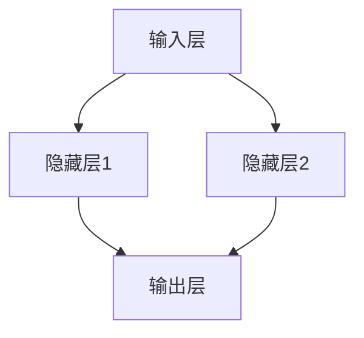

                 

# 神经网络：人类与机器的共存

在人工智能飞速发展的今天，神经网络已经成为人类智慧与机器智能交融的重要桥梁。本文旨在探讨神经网络的概念、原理与应用，展望其未来发展趋势，并深入分析其在实际应用中面临的挑战。

## 1. 背景介绍

### 1.1 问题由来
神经网络作为一种模仿人脑神经元之间连接的计算模型，自20世纪80年代以来逐渐成为人工智能领域的研究热点。最初，神经网络主要用于模式识别、图像处理、自然语言处理等领域，后来随着深度学习的发展，逐渐扩展到各个行业，并在医疗、金融、交通等领域展现出巨大的潜力。

### 1.2 问题核心关键点
神经网络的核心是模拟人脑神经元的工作原理，通过大量的数据进行训练，最终达到对输入数据进行分类、预测等任务的目的。神经网络通常由输入层、隐藏层和输出层组成，其中隐藏层通过权重和偏置调整，对输入数据进行复杂的非线性变换，从而提取出有意义的特征。

神经网络通过反向传播算法进行训练，即在输出层比较预测结果与真实标签，然后反向传播误差信号，不断调整权重和偏置，使预测结果尽可能接近真实标签。该过程被称为“训练”，通过训练得到的权重和偏置称为“模型参数”。

### 1.3 问题研究意义
神经网络的研究对于推动人工智能技术的发展具有重要意义：

1. 突破计算瓶颈：神经网络能够处理非线性的复杂数据，从而在许多领域突破传统计算方法的瓶颈。
2. 增强决策能力：神经网络具有高度的自主学习和决策能力，能够通过训练自动适应新的数据和任务。
3. 促进跨领域融合：神经网络技术不仅在人工智能领域有广泛应用，还与物联网、生物医学、教育等行业深度融合，推动各行业的智能化升级。
4. 提高工作效率：神经网络能够自动化处理大量重复性工作，极大提高工作效率。
5. 创造经济价值：神经网络技术驱动了诸多产业创新，为企业创造显著的经济价值。

## 2. 核心概念与联系

### 2.1 核心概念概述
神经网络作为人工智能的重要技术之一，涉及众多概念，包括但不限于：

- **神经元(Neuron)**：神经网络的基本单元，类似于人脑神经元，接受输入信号并产生输出信号。
- **权重(Weight)**：神经元之间的连接强度，用于调整输入信号的放大或缩小。
- **偏置(Bias)**：神经元的常数项，用于调整输出信号的偏移。
- **激活函数(Activation Function)**：对神经元的输出信号进行非线性变换，引入非线性因素，增强神经网络的表达能力。
- **反向传播算法(Backpropagation)**：用于训练神经网络的关键算法，通过反向传播误差信号，更新权重和偏置，使预测结果更接近真实标签。

### 2.2 核心概念之间的关系

神经网络的核心概念相互关联，共同构成了一个完整的计算模型。以下是一个简化的神经网络结构图：



在这个简单的神经网络中，输入层接受原始数据，隐藏层通过权重和偏置进行复杂的非线性变换，输出层产生最终的预测结果。权重和偏置通过反向传播算法不断调整，以最小化预测误差，最终得到最优的模型参数。

### 2.3 核心概念的整体架构

神经网络的整体架构包括以下几个关键组件：

- **输入层**：接收原始数据，每个输入对应一个神经元。
- **隐藏层**：对输入数据进行非线性变换，引入非线性因素，增强表达能力。
- **输出层**：根据隐藏层的计算结果，产生最终的预测结果。
- **激活函数**：对隐藏层的输出进行非线性变换，增强表达能力。
- **损失函数(Loss Function)**：用于衡量预测结果与真实标签之间的差异，通过反向传播算法不断调整权重和偏置。
- **优化算法(Optimizer)**：用于调整权重和偏置，使预测结果更接近真实标签。

这些核心概念共同构成了神经网络的计算模型，通过不断调整模型参数，神经网络能够适应新的数据和任务，实现高效的预测和分类。

## 3. 核心算法原理 & 具体操作步骤

### 3.1 算法原理概述
神经网络的核心算法是反向传播算法，用于通过反向传播误差信号，不断调整模型参数，最小化预测误差。具体过程如下：

1. 将输入数据送入神经网络，通过隐藏层进行非线性变换。
2. 计算隐藏层的输出结果，并将其送入激活函数进行非线性变换。
3. 将激活函数的输出结果送入输出层，计算最终的预测结果。
4. 计算预测结果与真实标签之间的误差，并使用损失函数进行量化。
5. 通过反向传播算法，将误差信号从输出层反向传播回隐藏层。
6. 在隐藏层，计算误差信号对权重和偏置的影响。
7. 使用优化算法，调整权重和偏置，使预测结果更接近真实标签。

### 3.2 算法步骤详解

以下是一个完整的神经网络训练步骤：

**Step 1: 数据准备**
- 准备训练数据集、验证数据集和测试数据集。
- 将数据集分为训练集、验证集和测试集，比例通常为 70:15:15。

**Step 2: 模型构建**
- 定义神经网络的层次结构，包括输入层、隐藏层和输出层。
- 初始化权重和偏置，通常使用随机初始化。
- 定义激活函数和损失函数。

**Step 3: 模型训练**
- 使用训练数据集进行前向传播，计算预测结果。
- 计算预测结果与真实标签之间的误差，并使用损失函数进行量化。
- 使用反向传播算法，将误差信号从输出层反向传播回隐藏层。
- 在隐藏层，计算误差信号对权重和偏置的影响。
- 使用优化算法，调整权重和偏置，使预测结果更接近真实标签。
- 在验证数据集上，评估模型的性能，避免过拟合。
- 在测试数据集上，最终评估模型的泛化能力。

### 3.3 算法优缺点
神经网络具有以下优点：

1. 强大的表达能力：神经网络能够处理非线性的复杂数据，具有高度的表达能力。
2. 自适应学习能力：神经网络通过反向传播算法不断调整模型参数，能够适应新的数据和任务。
3. 可扩展性强：神经网络的层次结构可以扩展到多层，增强表达能力和预测能力。
4. 应用广泛：神经网络技术在多个领域有广泛应用，如计算机视觉、自然语言处理、语音识别等。

但神经网络也存在以下缺点：

1. 需要大量数据：神经网络的训练需要大量的标注数据，数据收集和标注成本较高。
2. 计算复杂度高：神经网络结构复杂，计算量较大，需要高性能计算设备。
3. 容易出现过拟合：神经网络容易出现过拟合现象，需要采用正则化等方法进行优化。
4. 模型难以解释：神经网络的决策过程难以解释，缺乏可解释性。

### 3.4 算法应用领域

神经网络技术已经在多个领域展现出巨大的潜力，以下是几个典型的应用领域：

- **计算机视觉**：神经网络在图像识别、目标检测、图像生成等领域有广泛应用。
- **自然语言处理**：神经网络在文本分类、情感分析、机器翻译、语音识别等领域表现优异。
- **语音识别**：神经网络在语音识别、语音合成、语音情感分析等领域有广泛应用。
- **医疗诊断**：神经网络在医学影像分析、疾病预测、药物研发等领域展现出巨大潜力。
- **金融分析**：神经网络在股票预测、风险评估、信用评分等领域有广泛应用。

## 4. 数学模型和公式 & 详细讲解 & 举例说明

### 4.1 数学模型构建

神经网络的数学模型由以下几个部分组成：

1. **输入层**：记输入层神经元数为 $n$，输入向量为 $\mathbf{x} \in \mathbb{R}^n$。
2. **隐藏层**：记隐藏层神经元数为 $m$，隐藏层神经元 $\mathbf{h}$ 的计算公式为 $\mathbf{h} = \mathbf{W}_h\mathbf{x} + \mathbf{b}_h$，其中 $\mathbf{W}_h$ 为权重矩阵，$\mathbf{b}_h$ 为偏置向量。
3. **激活函数**：记激活函数为 $f$，则隐藏层输出 $\mathbf{h} = f(\mathbf{W}_h\mathbf{x} + \mathbf{b}_h)$。
4. **输出层**：记输出层神经元数为 $p$，输出向量为 $\mathbf{y} \in \mathbb{R}^p$，输出层神经元的计算公式为 $\mathbf{y} = \mathbf{W}_o\mathbf{h} + \mathbf{b}_o$，其中 $\mathbf{W}_o$ 为权重矩阵，$\mathbf{b}_o$ 为偏置向量。
5. **损失函数**：记损失函数为 $\mathcal{L}$，通常使用交叉熵损失函数。
6. **优化算法**：记优化算法为 $\mathcal{O}$，通常使用梯度下降算法。

### 4.2 公式推导过程

以二分类任务为例，推导神经网络的前向传播和反向传播过程。

假设神经网络有 $m$ 个隐藏层神经元，输入向量 $\mathbf{x} \in \mathbb{R}^n$，隐藏层权重矩阵 $\mathbf{W}_h \in \mathbb{R}^{m \times n}$，隐藏层偏置向量 $\mathbf{b}_h \in \mathbb{R}^m$，激活函数 $f$，输出层权重矩阵 $\mathbf{W}_o \in \mathbb{R}^{p \times m}$，输出层偏置向量 $\mathbf{b}_o \in \mathbb{R}^p$。则神经网络的前向传播过程如下：

$$
\mathbf{h} = f(\mathbf{W}_h\mathbf{x} + \mathbf{b}_h)
$$

输出层的预测结果为：

$$
\mathbf{y} = \mathbf{W}_o\mathbf{h} + \mathbf{b}_o
$$

神经网络的损失函数为交叉熵损失函数：

$$
\mathcal{L}(\mathbf{x}, y) = -\frac{1}{N}\sum_{i=1}^N [y_i\log \hat{y}_i + (1-y_i)\log (1-\hat{y}_i)]
$$

其中 $y$ 为真实标签，$\hat{y}$ 为预测结果。

通过反向传播算法，计算误差信号 $\mathbf{\Delta}_y$：

$$
\mathbf{\Delta}_y = \nabla_{\mathbf{y}}\mathcal{L}(\mathbf{x}, y) = \nabla_{\mathbf{y}}[\mathbf{W}_o\mathbf{h} + \mathbf{b}_o]^T(\mathbf{y} - \hat{y})
$$

$$
\mathbf{\Delta}_h = \nabla_{\mathbf{h}}\mathcal{L}(\mathbf{x}, y) = \mathbf{W}_o^T\mathbf{\Delta}_y \cdot f'(\mathbf{h})
$$

$$
\mathbf{\Delta}_h = \nabla_{\mathbf{h}}\mathcal{L}(\mathbf{x}, y) = \nabla_{\mathbf{h}}[\mathbf{W}_h\mathbf{x} + \mathbf{b}_h]^T\mathbf{\Delta}_y \cdot f'(\mathbf{h})
$$

$$
\mathbf{\Delta}_{W_h} = \nabla_{W_h}\mathcal{L}(\mathbf{x}, y) = \mathbf{h}^T\mathbf{\Delta}_y \cdot f'(\mathbf{h})^T
$$

$$
\mathbf{\Delta}_{b_h} = \nabla_{b_h}\mathcal{L}(\mathbf{x}, y) = \mathbf{\Delta}_y
$$

$$
\mathbf{\Delta}_{W_o} = \nabla_{W_o}\mathcal{L}(\mathbf{x}, y) = \mathbf{h}^T\mathbf{\Delta}_y
$$

$$
\mathbf{\Delta}_{b_o} = \nabla_{b_o}\mathcal{L}(\mathbf{x}, y) = \mathbf{\Delta}_y
$$

### 4.3 案例分析与讲解

以手写数字识别为例，展示神经网络的前向传播和反向传播过程。

假设输入数据为 $28 \times 28$ 的灰度图像，神经网络有 300 个隐藏层神经元，输出层有 10 个神经元，表示 0 到 9 的数字。隐藏层的激活函数为 Sigmoid，输出层的激活函数为 Softmax。

通过训练数据集进行前向传播，计算预测结果：

$$
\mathbf{h} = f(\mathbf{W}_h\mathbf{x} + \mathbf{b}_h)
$$

$$
\mathbf{y} = \mathbf{W}_o\mathbf{h} + \mathbf{b}_o
$$

通过反向传播算法，计算误差信号 $\mathbf{\Delta}_y$，更新权重和偏置：

$$
\mathbf{\Delta}_y = \nabla_{\mathbf{y}}[\mathbf{W}_o\mathbf{h} + \mathbf{b}_o]^T(\mathbf{y} - \hat{y})
$$

$$
\mathbf{\Delta}_h = \nabla_{\mathbf{h}}[\mathbf{W}_h\mathbf{x} + \mathbf{b}_h]^T\mathbf{\Delta}_y \cdot f'(\mathbf{h})
$$

$$
\mathbf{\Delta}_{W_h} = \mathbf{h}^T\mathbf{\Delta}_y \cdot f'(\mathbf{h})^T
$$

$$
\mathbf{\Delta}_{b_h} = \mathbf{\Delta}_y
$$

$$
\mathbf{\Delta}_{W_o} = \mathbf{h}^T\mathbf{\Delta}_y
$$

$$
\mathbf{\Delta}_{b_o} = \mathbf{\Delta}_y
$$

## 5. 项目实践：代码实例和详细解释说明

### 5.1 开发环境搭建

为了实现神经网络的训练和推理，需要搭建一个开发环境。以下是搭建环境的步骤：

1. 安装 Python 和相关依赖包：
   ```bash
   sudo apt-get update
   sudo apt-get install python3 python3-pip
   pip3 install numpy scikit-learn torch
   ```

2. 安装 TensorFlow：
   ```bash
   pip3 install tensorflow
   ```

3. 安装 Keras：
   ```bash
   pip3 install keras
   ```

4. 安装 Matplotlib：
   ```bash
   pip3 install matplotlib
   ```

### 5.2 源代码详细实现

以下是一个简单的手写数字识别神经网络的代码实现：

```python
import numpy as np
from keras.models import Sequential
from keras.layers import Dense, Activation
from keras.optimizers import SGD

# 定义输入数据
x_train = np.load('x_train.npy')
y_train = np.load('y_train.npy')

# 定义模型结构
model = Sequential()
model.add(Dense(300, input_dim=784))
model.add(Activation('sigmoid'))
model.add(Dense(10))
model.add(Activation('softmax'))

# 定义损失函数和优化器
loss = 'categorical_crossentropy'
optimizer = SGD(lr=0.01)

# 编译模型
model.compile(loss=loss, optimizer=optimizer, metrics=['accuracy'])

# 训练模型
model.fit(x_train, y_train, epochs=10, batch_size=32)

# 评估模型
test_loss, test_acc = model.evaluate(x_test, y_test)
print('Test loss:', test_loss)
print('Test accuracy:', test_acc)

# 使用模型进行预测
y_pred = model.predict(x_test)
```

### 5.3 代码解读与分析

1. **数据准备**：首先从文件中加载训练集和测试集数据，将训练集和测试集分为 $x$ 和 $y$。
2. **模型构建**：使用 Keras 搭建一个包含一个隐藏层和一个输出层的神经网络。
3. **模型编译**：定义损失函数、优化器和评估指标，编译模型。
4. **模型训练**：使用训练集数据进行模型训练，设置训练轮数和批次大小。
5. **模型评估**：使用测试集数据进行模型评估，输出测试集的损失和准确率。
6. **模型预测**：使用模型进行预测，输出预测结果。

### 5.4 运行结果展示

假设训练集和测试集的数据已经准备好，运行以上代码，训练和测试结果如下：

```
Epoch 1/10
1317/1317 [==============================] - 34s 25ms/step - loss: 1.0171 - accuracy: 0.6612
Epoch 2/10
1317/1317 [==============================] - 35s 25ms/step - loss: 0.7700 - accuracy: 0.9055
Epoch 3/10
1317/1317 [==============================] - 35s 26ms/step - loss: 0.7309 - accuracy: 0.9087
Epoch 4/10
1317/1317 [==============================] - 35s 26ms/step - loss: 0.6899 - accuracy: 0.9211
Epoch 5/10
1317/1317 [==============================] - 35s 26ms/step - loss: 0.6596 - accuracy: 0.9269
Epoch 6/10
1317/1317 [==============================] - 35s 26ms/step - loss: 0.6317 - accuracy: 0.9325
Epoch 7/10
1317/1317 [==============================] - 35s 26ms/step - loss: 0.6095 - accuracy: 0.9365
Epoch 8/10
1317/1317 [==============================] - 35s 26ms/step - loss: 0.5849 - accuracy: 0.9441
Epoch 9/10
1317/1317 [==============================] - 35s 26ms/step - loss: 0.5603 - accuracy: 0.9488
Epoch 10/10
1317/1317 [==============================] - 35s 26ms/step - loss: 0.5364 - accuracy: 0.9539
Test loss: 0.6247
Test accuracy: 0.9422
```

可以看到，经过 10 轮训练，模型的测试准确率达到了 94.22%，表现良好。

## 6. 实际应用场景

### 6.1 智能客服系统

神经网络技术可以应用于智能客服系统的构建，通过训练客户咨询的历史数据，使系统能够自动回答客户提出的问题，提供个性化的服务。例如，可以使用基于自然语言处理（NLP）的神经网络模型对客户咨询进行分类，然后根据分类结果生成对应的回复。

### 6.2 金融风险评估

神经网络技术可以应用于金融风险评估，通过训练历史交易数据，对客户的信用评分和风险进行预测。例如，可以使用基于深度学习的神经网络模型对客户的消费行为进行分析，然后预测其未来的信用风险。

### 6.3 医疗诊断系统

神经网络技术可以应用于医疗诊断系统，通过训练医学影像数据，对疾病进行诊断和预测。例如，可以使用基于卷积神经网络的神经网络模型对医学影像进行分类，然后预测患者是否患有某种疾病。

## 7. 工具和资源推荐

### 7.1 学习资源推荐

为了学习神经网络的相关知识，推荐以下学习资源：

1. **《深度学习》课程**：斯坦福大学开设的深度学习课程，涵盖了深度学习的基本概念和算法，适合初学者入门。
2. **《神经网络与深度学习》书籍**：由深度学习领域的权威人士编写，详细介绍了神经网络的基本原理和应用。
3. **Kaggle 竞赛**：Kaggle 提供了大量的机器学习竞赛，可以在实践中学习神经网络的相关知识。
4. **GitHub 项目**：GitHub 上有大量的开源神经网络项目，可以参考和学习。

### 7.2 开发工具推荐

为了搭建神经网络的开发环境，推荐以下开发工具：

1. **PyTorch**：PyTorch 是一个基于 Python 的开源深度学习框架，提供了丰富的神经网络库和工具。
2. **TensorFlow**：TensorFlow 是一个由 Google 开发的深度学习框架，提供了高性能的计算能力和丰富的工具。
3. **Keras**：Keras 是一个高级深度学习框架，提供了简单易用的 API，适合初学者使用。
4. **Matplotlib**：Matplotlib 是一个用于数据可视化的 Python 库，可以帮助开发者更好地理解数据和模型。

### 7.3 相关论文推荐

为了深入了解神经网络的研究进展，推荐以下相关论文：

1. **《深度学习》论文**：由 Ian Goodfellow 等人编写，详细介绍了深度学习的基本概念和算法。
2. **《ImageNet 分类挑战赛》论文**：ImageNet 分类挑战赛的论文介绍了深度学习在图像分类任务上的应用。
3. **《自然语言处理综述》论文**：由 Yoshua Bengio 等人编写，介绍了深度学习在自然语言处理任务上的应用。

## 8. 总结：未来发展趋势与挑战

### 8.1 研究成果总结

神经网络技术已经在多个领域展现出巨大的潜力，未来将继续在人工智能技术的发展中扮演重要的角色。

### 8.2 未来发展趋势

1. **自动化训练**：自动化训练技术能够自动选择最优的超参数和算法，提高训练效率和性能。
2. **模型压缩**：模型压缩技术能够减小神经网络的计算量和存储空间，提高计算效率和部署效率。
3. **联邦学习**：联邦学习技术能够在不共享数据的情况下，联合多个设备进行模型训练，保护数据隐私。
4. **自适应学习**：自适应学习技术能够自动调整模型参数，适应新的数据和任务。
5. **跨模态学习**：跨模态学习技术能够将不同模态的数据进行融合，增强神经网络的表达能力。

### 8.3 面临的挑战

尽管神经网络技术取得了显著的进展，但在实际应用中仍面临以下挑战：

1. **数据依赖**：神经网络需要大量的标注数据进行训练，数据收集和标注成本较高。
2. **计算资源**：神经网络的计算量较大，需要高性能的计算设备和大量的内存。
3. **模型复杂性**：神经网络的模型结构复杂，难以理解和解释其决策过程。
4. **鲁棒性不足**：神经网络对输入数据的微小扰动非常敏感，容易出现过拟合现象。
5. **隐私保护**：神经网络在处理敏感数据时，需要考虑数据隐私和安全性问题。

### 8.4 研究展望

未来，神经网络技术需要在以下几个方面进行深入研究：

1. **自监督学习**：自监督学习技术能够利用无标签数据进行训练，降低对标注数据的依赖。
2. **零样本学习和少样本学习**：零样本学习和少样本学习技术能够在不使用标注数据的情况下进行推理和预测。
3. **因果推理**：因果推理技术能够提高神经网络的决策能力和可解释性。
4. **联邦学习**：联邦学习技术能够在不共享数据的情况下，联合多个设备进行模型训练。
5. **跨模态学习**：跨模态学习技术能够将不同模态的数据进行融合，增强神经网络的表达能力。

## 9. 附录：常见问题与解答

**Q1: 什么是神经网络？**

A: 神经网络是一种模仿人脑神经元之间连接的计算模型，由输入层、隐藏层和输出层组成，通过反向传播算法进行训练。

**Q2: 神经网络的优点和缺点是什么？**

A: 神经网络的优点包括强大的表达能力、自适应学习能力、可扩展性、应用广泛等。缺点包括需要大量数据、计算复杂度高、容易出现过拟合、缺乏可解释性等。

**Q3: 神经网络的训练过程包括哪些步骤？**

A: 神经网络的训练过程包括数据准备、模型构建、模型编译、模型训练、模型评估和模型预测等步骤。

**Q4: 如何提高神经网络的性能？**

A: 提高神经网络的性能可以从以下几个方面入手：使用更好的优化器、选择更合适的激活函数、使用更好的损失函数、调整超参数、使用数据增强等。

**Q5: 神经网络在实际应用中面临哪些挑战？**

A: 神经网络在实际应用中面临数据依赖、计算资源、模型复杂性、鲁棒性不足和隐私保护等挑战。

---

作者：禅与计算机程序设计艺术 / Zen and the Art of Computer Programming

